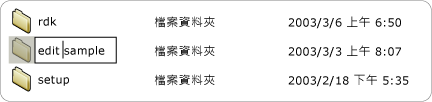

# 實作 UI 自動化 Value 控制項模式Implementing the UI Automation Value Control Pattern
> [!NOTE]
>  這份文件適用於想要使用 <xref:System.Windows.Automation> 命名空間中定義之 Managed [!INCLUDE[TLA2#tla_uiautomation](../../../includes/tla2sharptla-uiautomation-md.md)] 類別的 .NET Framework 開發人員。This documentation is intended for .NET Framework developers who want to use the managed [!INCLUDE[TLA2#tla_uiautomation](../../../includes/tla2sharptla-uiautomation-md.md)] classes defined in the <xref:System.Windows.Automation> namespace. 如需最新資訊[!INCLUDE[TLA2#tla_uiautomation](../../../includes/tla2sharptla-uiautomation-md.md)]，請參閱[Windows Automation API:使用者介面自動化](https://go.microsoft.com/fwlink/?LinkID=156746)。For the latest information about [!INCLUDE[TLA2#tla_uiautomation](../../../includes/tla2sharptla-uiautomation-md.md)], see [Windows Automation API: UI Automation](https://go.microsoft.com/fwlink/?LinkID=156746).  
  
 本主題將介紹實作 <xref:System.Windows.Automation.Provider.IValueProvider>的方針和慣例，包括事件和屬性的相關資訊。This topic introduces guidelines and conventions for implementing <xref:System.Windows.Automation.Provider.IValueProvider>, including information on events and properties. 其他參考的連結列於主題的結尾。Links to additional references are listed at the end of the topic.  
  
 <xref:System.Windows.Automation.ValuePattern> 控制項模式用來支援不跨越某個範圍的內建值且可以表示為字串的控制項。The <xref:System.Windows.Automation.ValuePattern> control pattern is used to support controls that have an intrinsic value not spanning a range and that can be represented as a string. 這個字串可以是可編輯的，視控制項及其設定而定。This string can be editable, depending on the control and its settings. 如需實作此模式的控制項範例，請參閱 [T:System.Windows.Automation.Provider.IValueProvider](../../../docs/framework/ui-automation/control-pattern-mapping-for-ui-automation-clients.md)。For examples of controls that implement this pattern, see [Control Pattern Mapping for UI Automation Clients](../../../docs/framework/ui-automation/control-pattern-mapping-for-ui-automation-clients.md).  
  
   
## 實作方針和慣例Implementation Guidelines and Conventions  
 實作值控制項模式時，請注意下列方針和慣例：When implementing the Value control pattern, note the following guidelines and conventions:  
  
-   如果任何項目的值是可編輯的，則例如 <xref:System.Windows.Automation.ControlType.ListItem> 和 <xref:System.Windows.Automation.ControlType.TreeItem> 等控制項必須支援 <xref:System.Windows.Automation.ValuePattern> ，而不論控制項目前的編輯模式為何。Controls such as <xref:System.Windows.Automation.ControlType.ListItem> and <xref:System.Windows.Automation.ControlType.TreeItem> must support <xref:System.Windows.Automation.ValuePattern> if the value of any of the items is editable, regardless of the current edit mode of the control. 如果子項目是可編輯的，父控制項也必須支援 <xref:System.Windows.Automation.ValuePattern> 。The parent control must also support <xref:System.Windows.Automation.ValuePattern> if the child items are editable.  
  
   
可編輯的清單項目範例Example of an Editable List Item  
  
-   單行編輯控制項支援藉由實作 <xref:System.Windows.Automation.Provider.IValueProvider>，以程式設計方式存取其內容。Single-line edit controls support programmatic access to their contents by implementing <xref:System.Windows.Automation.Provider.IValueProvider>. 不過，多行編輯控制項不會實作 <xref:System.Windows.Automation.Provider.IValueProvider>；它們是改為藉由實作 <xref:System.Windows.Automation.Provider.ITextProvider>來提供其內容的存取。However, multi-line edit controls do not implement <xref:System.Windows.Automation.Provider.IValueProvider>; instead they provide access to their content by implementing <xref:System.Windows.Automation.Provider.ITextProvider>.  
  
-   若要擷取多行編輯控制項的文字內容，控制項必須實作 <xref:System.Windows.Automation.Provider.ITextProvider>。To retrieve the textual contents of a multi-line edit control, the control must implement <xref:System.Windows.Automation.Provider.ITextProvider>. 不過， <xref:System.Windows.Automation.Provider.ITextProvider> 不支援設定控制項的值。However, <xref:System.Windows.Automation.Provider.ITextProvider> does not support setting the value of a control.  
  
-   <xref:System.Windows.Automation.Provider.IValueProvider> 不支援擷取格式設定資訊或子字串值。does not support the retrieval of formatting information or substring values. 在這些案例中請實作 <xref:System.Windows.Automation.Provider.ITextProvider> 。Implement <xref:System.Windows.Automation.Provider.ITextProvider> in these scenarios.  
  
-   <xref:System.Windows.Automation.Provider.IValueProvider> 必須實作控制項這類**色彩選擇器**選取控制項[!INCLUDE[TLA#tla_word](../../../includes/tlasharptla-word-md.md)]（下面詳述），可支援色彩值 （例如 「 黃色 」） 與對等的內部之間的字串對應[!INCLUDE[TLA#tla_rgb](../../../includes/tlasharptla-rgb-md.md)]結構。must be implemented by controls such as the **Color Picker** selection control from [!INCLUDE[TLA#tla_word](../../../includes/tlasharptla-word-md.md)] (illustrated below), which supports string mapping between a color value (for example, "yellow") and an equivalent internal [!INCLUDE[TLA#tla_rgb](../../../includes/tlasharptla-rgb-md.md)] structure.  
  
   
色樣字串對應範例Example of Color Swatch String Mapping  
  
-   控制項的 <xref:System.Windows.Automation.AutomationElement.IsEnabledProperty> 應該設為 `true` ， <xref:System.Windows.Automation.ValuePattern.IsReadOnlyProperty> 應該設為 `false` ，才能允許呼叫 <xref:System.Windows.Automation.Provider.IValueProvider.SetValue%2A>。A control should have its <xref:System.Windows.Automation.AutomationElement.IsEnabledProperty> set to `true` and its <xref:System.Windows.Automation.ValuePattern.IsReadOnlyProperty> set to `false` before allowing a call to <xref:System.Windows.Automation.Provider.IValueProvider.SetValue%2A>.  
  
   
## IValueProvider 的必要成員Required Members for IValueProvider  
 以下是實作 <xref:System.Windows.Automation.Provider.IValueProvider>的必要屬性和方法。The following properties and methods are required for implementing <xref:System.Windows.Automation.Provider.IValueProvider>.  
  
|必要成員Required members|成員類型Member type|注意Notes|  
|----------------------|-----------------|-----------|  
|<xref:System.Windows.Automation.ValuePattern.IsReadOnlyProperty>|屬性Property|NoneNone|  
|<xref:System.Windows.Automation.ValuePattern.ValueProperty>|屬性Property|NoneNone|  
|<xref:System.Windows.Automation.ValuePattern.SetValue%2A>|方法Method|NoneNone|  
  
   
## 例外狀況Exceptions  
 提供者必須擲回下列例外狀況。Providers must throw the following exceptions.  
  
|例外狀況類型Exception type|條件Condition|  
|--------------------|---------------|  
|<xref:System.InvalidOperationException>|<xref:System.Windows.Automation.ValuePattern.SetValue%2A>   -如果地區設定特有的資訊會傳遞至例如格式不正確的日期格式不正確的控制項。-   If locale-specific information is passed to a control in an incorrect format such as an incorrectly formatted date.|  
|<xref:System.ArgumentException>|<xref:System.Windows.Automation.ValuePattern.SetValue%2A>   -如果新的值不能從字串轉換成格式可辨識的控制項。-   If a new value cannot be converted from a string to a format the control recognizes.|  
|<xref:System.Windows.Automation.ElementNotEnabledException>|<xref:System.Windows.Automation.ValuePattern.SetValue%2A>   -當會嘗試將管理未啟用的控制項。-   When an attempt is made to manipulate a control that is not enabled.|  
  
## 另請參閱See also

- [UI 自動化控制項模式概觀UI Automation Control Patterns Overview](../../../docs/framework/ui-automation/ui-automation-control-patterns-overview.md)
- [支援 UI 自動化提供者的控制項模式Support Control Patterns in a UI Automation Provider](../../../docs/framework/ui-automation/support-control-patterns-in-a-ui-automation-provider.md)
- [用戶端的 UI 自動化控制項模式UI Automation Control Patterns for Clients](../../../docs/framework/ui-automation/ui-automation-control-patterns-for-clients.md)
- [ValuePattern 插入文字範例ValuePattern Insert Text Sample](https://github.com/Microsoft/WPF-Samples/tree/master/Accessibility/InsertText)
- [UI 自動化樹狀目錄概觀UI Automation Tree Overview](../../../docs/framework/ui-automation/ui-automation-tree-overview.md)
- [使用 UI 自動化中的快取Use Caching in UI Automation](../../../docs/framework/ui-automation/use-caching-in-ui-automation.md)
