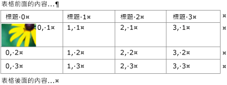
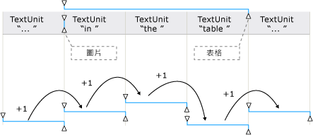
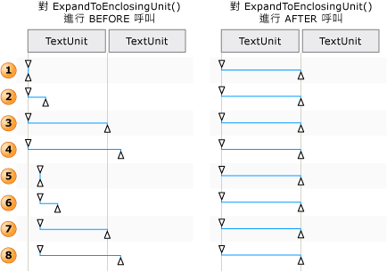

# TextPattern 和 Embedded 物件概觀TextPattern and Embedded Objects Overview
> [!NOTE]
>  這份文件適用於想要使用 <xref:System.Windows.Automation> 命名空間中定義之 Managed [!INCLUDE[TLA2#tla_uiautomation](../../../includes/tla2sharptla-uiautomation-md.md)] 類別的 .NET Framework 開發人員。This documentation is intended for .NET Framework developers who want to use the managed [!INCLUDE[TLA2#tla_uiautomation](../../../includes/tla2sharptla-uiautomation-md.md)] classes defined in the <xref:System.Windows.Automation> namespace. 如需最新資訊[!INCLUDE[TLA2#tla_uiautomation](../../../includes/tla2sharptla-uiautomation-md.md)]，請參閱[Windows Automation API:使用者介面自動化](https://go.microsoft.com/fwlink/?LinkID=156746)。For the latest information about [!INCLUDE[TLA2#tla_uiautomation](../../../includes/tla2sharptla-uiautomation-md.md)], see [Windows Automation API: UI Automation](https://go.microsoft.com/fwlink/?LinkID=156746).  
  
 本概觀描述 [!INCLUDE[TLA#tla_uiautomation](../../../includes/tlasharptla-uiautomation-md.md)] 如何公開內嵌物件或文字文件或容器內的子元素。This overview describes how [!INCLUDE[TLA#tla_uiautomation](../../../includes/tlasharptla-uiautomation-md.md)] exposes embedded objects, or child elements, within a text document or container.  
  
 在 [!INCLUDE[TLA2#tla_uiautomation](../../../includes/tla2sharptla-uiautomation-md.md)] 中，內嵌物件是任何具有非文字界限的元素；例如：影像、超連結、表格或文件類型 (如 [!INCLUDE[TLA#tla_xl](../../../includes/tlasharptla-xl-md.md)] 試算表或 [!INCLUDE[TLA#tla_winmedia](../../../includes/tlasharptla-winmedia-md.md)] 檔案)。In [!INCLUDE[TLA2#tla_uiautomation](../../../includes/tla2sharptla-uiautomation-md.md)] an embedded object is any element that has non-textual boundaries; for example, an image, hyperlink, table, or document type such as an [!INCLUDE[TLA#tla_xl](../../../includes/tlasharptla-xl-md.md)] spreadsheet or [!INCLUDE[TLA#tla_winmedia](../../../includes/tlasharptla-winmedia-md.md)] file. 這不同於下列標準定義：元素建立於一個應用程式中，並內嵌或連結在另一個應用程式中。This differs from the standard definition, where an element is created in one application and embedded, or linked, within another. 物件是否可以在其原始應用程式中進行編輯與 [!INCLUDE[TLA2#tla_uiautomation](../../../includes/tla2sharptla-uiautomation-md.md)]的內容無關。Whether the object can be edited within its original application is irrelevant in the context of [!INCLUDE[TLA2#tla_uiautomation](../../../includes/tla2sharptla-uiautomation-md.md)].  
  
   
## 內嵌物件和 UI 自動化樹狀目錄Embedded Objects and the UI Automation Tree  
 內嵌物件會被視為 [!INCLUDE[TLA2#tla_uiautomation](../../../includes/tla2sharptla-uiautomation-md.md)] 樹狀結構的控制項檢視內的個別項目。Embedded objects are treated as individual elements within the control view of the [!INCLUDE[TLA2#tla_uiautomation](../../../includes/tla2sharptla-uiautomation-md.md)] tree. 這些元素會公開成為文字容器的子系，以便透過與 [!INCLUDE[TLA2#tla_uiautomation](../../../includes/tla2sharptla-uiautomation-md.md)]中其他控制項相同的模式進行存取。They are exposed as children of the text container so that they can be accessed through the same model as other controls in [!INCLUDE[TLA2#tla_uiautomation](../../../includes/tla2sharptla-uiautomation-md.md)].  
  
   
表格、影像和超連結內嵌物件的文字容器範例Example of a Text Container with Table, Image, and Hyperlink Embedded Objects  
  
   
上述文字容器之一部分的內容檢視範例Example of the Content View for a Portion of the Preceding Text Container  
  
   
## 使用 TextPattern 和 TextPatternRange 公開內嵌物件Expose Embedded Objects Using TextPattern and TextPatternRange  
 <xref:System.Windows.Automation.TextPattern> 控制項模式類別和 <xref:System.Windows.Automation.Text.TextPatternRange> 類別搭配使用，可公開方法和屬性，以便瀏覽和查詢內嵌物件。Used in conjunction, the <xref:System.Windows.Automation.TextPattern> control pattern class and the <xref:System.Windows.Automation.Text.TextPatternRange> class expose methods and properties that facilitate navigation and querying of embedded objects.  
  
 在 [!INCLUDE[TLA2#tla_uiautomation](../../../includes/tla2sharptla-uiautomation-md.md)] 樹狀目錄的控制項檢視和內容檢視 (例如超連結或表格儲存格) 中，文字容器和內嵌物件的文字內容 (或內部文字) 會公開為單一連續的文字資料流； 物件界限會被忽略。The textual content (or inner text) of a text container and an embedded object, such as a hyperlink or table cell, is exposed as a single, continuous text stream in both the control view and the content view of the [!INCLUDE[TLA2#tla_uiautomation](../../../includes/tla2sharptla-uiautomation-md.md)] tree; object boundaries are ignored. 如果使用者介面自動化用戶端為了以某種方式進行敘述、解譯或分析而擷取文字，則應檢查特殊案例 (例如具有文字內容或其他內嵌物件的表格) 的文字範圍。If a UI Automation client is retrieving the text for the purpose of reciting, interpreting, or analyzing in some manner, the text range should be checked for special cases, such as a table with textual content or other embedded objects. 呼叫 <xref:System.Windows.Automation.Text.TextPatternRange.GetChildren%2A> 以取得每個內嵌物件的 <xref:System.Windows.Automation.AutomationElement> ，然後呼叫 <xref:System.Windows.Automation.TextPattern.RangeFromChild%2A> 以取得每個元素的文字範圍，即可達成。This can be accomplished by calling <xref:System.Windows.Automation.Text.TextPatternRange.GetChildren%2A> to obtain an <xref:System.Windows.Automation.AutomationElement> for each embedded object and then calling <xref:System.Windows.Automation.TextPattern.RangeFromChild%2A> to obtain a text range for each element. 這會以遞迴方式進行，直到擷取所有的文字內容為止。This is done recursively until all textual content has been retrieved.  
  
   
具有內嵌物件及其範圍的文字資料流範例Example of a text stream with embedded objects and their range spans  
  
 如需周遊文字範圍的內容，則應在幕後執行一連串的步驟，才能成功執行 <xref:System.Windows.Automation.Text.TextPatternRange.Move%2A> 方法。When it is necessary to traverse the content of a text range, a series of steps are involved behind the scenes in order for the <xref:System.Windows.Automation.Text.TextPatternRange.Move%2A> method to execute successfully.  
  
1.  文字範圍已正規化；也就是，文字範圍已在 <xref:System.Windows.Automation.Text.TextPatternRangeEndpoint.Start> 端點摺疊為變質範圍，以致 <xref:System.Windows.Automation.Text.TextPatternRangeEndpoint.End> 端點變成多餘的。The text range is normalized; that is, the text range is collapsed to a degenerate range at the <xref:System.Windows.Automation.Text.TextPatternRangeEndpoint.Start> endpoint, which makes the <xref:System.Windows.Automation.Text.TextPatternRangeEndpoint.End> endpoint superfluous. 需要此步驟，才能移除模稜兩可情況下，文字範圍跨越<xref:System.Windows.Automation.Text.TextUnit>界限： 比方說，`{The URL https://www.microsoft.com is embedded in text`其中"{"和"}"是文字範圍端點。This step is necessary to remove ambiguity in situations where a text range spans <xref:System.Windows.Automation.Text.TextUnit> boundaries: for example, `{The URL https://www.microsoft.com is embedded in text` where "{" and "}" are the text range endpoints.  
  
2.  結果產生的範圍會在 <xref:System.Windows.Automation.TextPattern.DocumentRange%2A> 中向後移至所要求 <xref:System.Windows.Automation.Text.TextUnit> 界限的開頭。The resulting range is moved backward in the <xref:System.Windows.Automation.TextPattern.DocumentRange%2A> to the beginning of the requested <xref:System.Windows.Automation.Text.TextUnit> boundary.  
  
3.  範圍會在 <xref:System.Windows.Automation.TextPattern.DocumentRange%2A> 中依所要求的 <xref:System.Windows.Automation.Text.TextUnit> 界限數目向前或向後移動。The range is moved forward or backward in the <xref:System.Windows.Automation.TextPattern.DocumentRange%2A> by the requested number of <xref:System.Windows.Automation.Text.TextUnit> boundaries.  
  
4.  範圍會接著依一個要求的 <xref:System.Windows.Automation.Text.TextPatternRangeEndpoint.End> 界限移動 <xref:System.Windows.Automation.Text.TextUnit> 端點，從變質範圍狀態展開。The range is then expanded from a degenerate range state by moving the <xref:System.Windows.Automation.Text.TextPatternRangeEndpoint.End> endpoint by one requested <xref:System.Windows.Automation.Text.TextUnit> boundary.  
  
   
如何針對 Move() 和 ExpandToEnclosingUnit() 調整文字範圍的範例Examples of how a text range is adjusted for Move() and ExpandToEnclosingUnit()  
  
   
## 常見案例Common Scenarios  
 下列各節提供有關內嵌物件的最常見案例的範例。The following sections present examples of the most common scenarios that involve embedded objects.  
  
 所示範例的圖例：Legend for the examples shown:  
  
 { = <xref:System.Windows.Automation.Text.TextPatternRangeEndpoint.Start>{ = <xref:System.Windows.Automation.Text.TextPatternRangeEndpoint.Start>  
  
 } = <xref:System.Windows.Automation.Text.TextPatternRangeEndpoint.End>} = <xref:System.Windows.Automation.Text.TextPatternRangeEndpoint.End>  
  
### 超連結Hyperlink  

**範例 1 - 包含內嵌文字超連結的文字範圍****Example 1 - A text range that contains an embedded text hyperlink**
  
`{The URL https://www.microsoft.com is embedded in text}.`
  
|呼叫的方法Method called|結果Result|  
|-------------------|------------|  
|<xref:System.Windows.Automation.Text.TextPatternRange.GetText%2A>|傳回 `The URL https://www.microsoft.com is embedded in text` 字串。Returns the string `The URL https://www.microsoft.com is embedded in text`.|  
|<xref:System.Windows.Automation.Text.TextPatternRange.GetEnclosingElement%2A>|傳回圍住文字範圍的最內層 <xref:System.Windows.Automation.AutomationElement> ；在此情況下是代表文字提供者本身的 <xref:System.Windows.Automation.AutomationElement> 。Returns the innermost <xref:System.Windows.Automation.AutomationElement> that encloses the text range; in this case, the <xref:System.Windows.Automation.AutomationElement> that represents the text provider itself.|  
|<xref:System.Windows.Automation.Text.TextPatternRange.GetChildren%2A>|傳回表示超連結控制項的 <xref:System.Windows.Automation.AutomationElement> 。Returns an <xref:System.Windows.Automation.AutomationElement> representing the hyperlink control.|  
|<xref:System.Windows.Automation.TextPattern.RangeFromChild%2A> ，其中 <xref:System.Windows.Automation.AutomationElement> 是先前 `GetChildren` 方法傳回的物件。<xref:System.Windows.Automation.TextPattern.RangeFromChild%2A> where <xref:System.Windows.Automation.AutomationElement> is the object returned by the previous `GetChildren` method.|傳回表示範圍 」 https://www.microsoft.com"。Returns the range that represents "https://www.microsoft.com".|  
  
 **範例 2 - 部分跨越內嵌文字超連結的文字範圍****Example 2 - A text range that partially spans an embedded text hyperlink**  
  
 URL`https://{[www]}`內嵌於文字。The URL `https://{[www]}` is embedded in text.  
  
|呼叫的方法Method called|結果Result|  
|-------------------|------------|  
|<xref:System.Windows.Automation.Text.TextPatternRange.GetText%2A>|傳回字串 "www"。Returns the string "www".|  
|<xref:System.Windows.Automation.Text.TextPatternRange.GetEnclosingElement%2A>|傳回圍住文字範圍的最內層 <xref:System.Windows.Automation.AutomationElement> ；在此情況下是超連結控制項。Returns the innermost <xref:System.Windows.Automation.AutomationElement> that encloses the text range; in this case, the hyperlink control.|  
|<xref:System.Windows.Automation.Text.TextPatternRange.GetChildren%2A>|傳回 `null` ，因為文字範圍未跨越整個 URL 字串。Returns `null` since the text range doesn't span the entire URL string.|  
  
**範例 3-部分跨越文字容器內容的文字範圍。此文字容器有不屬於此文字範圍的內嵌的文字超連結。****Example 3 - A text range that partially spans the content of a text container. The text container has an embedded text hyperlink that is not part of the text range.**  
  
`{The URL} [https://www.microsoft.com](https://www.microsoft.com) is embedded in text.`
  
|呼叫的方法Method called|結果Result|  
|-------------------|------------|  
|<xref:System.Windows.Automation.Text.TextPatternRange.GetText%2A>|傳回字串 "The URL"。Returns the string "The URL".|  
|<xref:System.Windows.Automation.Text.TextPatternRange.GetEnclosingElement%2A>|傳回圍住文字範圍的最內層 <xref:System.Windows.Automation.AutomationElement> ；在此情況下是代表文字提供者本身的 <xref:System.Windows.Automation.AutomationElement> 。Returns the innermost <xref:System.Windows.Automation.AutomationElement> that encloses the text range; in this case, the <xref:System.Windows.Automation.AutomationElement> that represents the text provider itself.|  
|<xref:System.Windows.Automation.Text.TextPatternRange.Move%2A> ，參數為 (TextUnit.Word, 1)。<xref:System.Windows.Automation.Text.TextPatternRange.Move%2A> with parameters of (TextUnit.Word, 1).|將文字範圍移至 "http"，因為超連結文字是由個別字詞所組成。Moves the text range span to "http" since the text of the hyperlink is comprised of individual words. 在此情況下，並未將超連結視為單一物件。In this case, the hyperlink is not treated as a single object.   {[Http]} 的 URL 會內嵌在文字中。The URL {[http]} is embedded in text.|  
  
   
### ImageImage  
 **範例 1 - 包含內嵌影像的文字範圍****Example 1 - A text range that contains an embedded image**  
  
 {映像內嵌於文字}。{The image  is embedded in text}.  
  
|呼叫的方法Method called|結果Result|  
|-------------------|------------|  
|<xref:System.Windows.Automation.Text.TextPatternRange.GetText%2A>|傳回字串 "The is embedded in text"。Returns the string "The is embedded in text". 任何與影像相關聯的 ALT 文字不應該包含在文字資料流中。Any ALT text associated with the image cannot be expected to be included in the text stream.|  
|<xref:System.Windows.Automation.Text.TextPatternRange.GetEnclosingElement%2A>|傳回圍住文字範圍的最內層 <xref:System.Windows.Automation.AutomationElement> ；在此情況下是代表文字提供者本身的 <xref:System.Windows.Automation.AutomationElement> 。Returns the innermost <xref:System.Windows.Automation.AutomationElement> that encloses the text range; in this case, the <xref:System.Windows.Automation.AutomationElement> that represents the text provider itself.|  
|<xref:System.Windows.Automation.Text.TextPatternRange.GetChildren%2A>|傳回表示影像控制項的 <xref:System.Windows.Automation.AutomationElement> 。Returns an <xref:System.Windows.Automation.AutomationElement> representing the image control.|  
|<xref:System.Windows.Automation.TextPattern.RangeFromChild%2A> ，其中 <xref:System.Windows.Automation.AutomationElement> 是先前 <xref:System.Windows.Automation.Text.TextPatternRange.GetChildren%2A> 方法傳回的物件。<xref:System.Windows.Automation.TextPattern.RangeFromChild%2A> where <xref:System.Windows.Automation.AutomationElement> is the object returned by the previous <xref:System.Windows.Automation.Text.TextPatternRange.GetChildren%2A> method.|傳回代表變質範圍 」"。Returns the degenerate range that represents "".|  
  
 **範例 2-部分跨越文字容器內容的文字範圍。此文字容器有內嵌的影像，但不是文字範圍的一部分。****Example 2 - A text range that partially spans the content of a text container. The text container has an embedded image that is not part of the text range.**  
  
 {映像}內嵌於文字。{The image}  is embedded in text.  
  
|呼叫的方法Method called|結果Result|  
|-------------------|------------|  
|<xref:System.Windows.Automation.Text.TextPatternRange.GetText%2A>|傳回字串 "The image"。Returns the string "The image".|  
|<xref:System.Windows.Automation.Text.TextPatternRange.GetEnclosingElement%2A>|傳回圍住文字範圍的最內層 <xref:System.Windows.Automation.AutomationElement> ；在此情況下是代表文字提供者本身的 <xref:System.Windows.Automation.AutomationElement> 。Returns the innermost <xref:System.Windows.Automation.AutomationElement> that encloses the text range; in this case, the <xref:System.Windows.Automation.AutomationElement> that represents the text provider itself.|  
|<xref:System.Windows.Automation.Text.TextPatternRange.Move%2A> ，參數為 (TextUnit.Word, 1)。<xref:System.Windows.Automation.Text.TextPatternRange.Move%2A> with parameters of (TextUnit.Word, 1).|將文字範圍移至 "is"。Moves the text range span to "is ". 因為只有以文字為基礎的內嵌物件會被視為文字資料流的一部分，所以此範例中的影像不會影響 Move 或其傳回值 (在本例中為 1)。Because only text-based embedded objects are considered part of the text stream, the image in this example does not affect Move or its return value (1 in this case).|  
  
   
### 資料表Table  
  
### 範例使用的資料表Table used for examples  
  
|包含影像的儲存格Cell with Image|包含文字的儲存格Cell with Text|  
|---------------------|--------------------|  
||XX|  
||YY|  
|   Z 的影像Image for Z|ZZ|  
  
 **範例 1：從儲存格內容取得文字容器。****Example 1 - Get the text container from the content of a cell.**  
  
|呼叫的方法Method Called|結果Result|  
|-------------------|------------|  
|<xref:System.Windows.Automation.GridPattern.GetItem%2A> ，參數為 (0,0)<xref:System.Windows.Automation.GridPattern.GetItem%2A> with parameters (0,0)|傳回 <xref:System.Windows.Automation.AutomationElement> ，表示表格儲存格的內容；在此情況下，此元素是文字控制項。Returns the <xref:System.Windows.Automation.AutomationElement> representing the content of the table cell; in this case, the element is a text control.|  
|<xref:System.Windows.Automation.TextPattern.RangeFromChild%2A> ，其中 <xref:System.Windows.Automation.AutomationElement> 是先前 `GetItem` 方法傳回的物件。<xref:System.Windows.Automation.TextPattern.RangeFromChild%2A> where <xref:System.Windows.Automation.AutomationElement> is the object returned by the previous `GetItem` method.|傳回跨越影像的範圍。Returns the range that spans the image .|  
|<xref:System.Windows.Automation.Text.TextPatternRange.GetEnclosingElement%2A> ，適用於先前 `RangeFromChild` 方法所傳回的物件。<xref:System.Windows.Automation.Text.TextPatternRange.GetEnclosingElement%2A> for the object returned by the previous `RangeFromChild` method.|傳回表示表格儲存格的 <xref:System.Windows.Automation.AutomationElement> ；在此情況下，此元素是支援 TableItemPattern 的文字控制項。Returns the <xref:System.Windows.Automation.AutomationElement> representing the table cell; in this case, the element is a text control that supports TableItemPattern.|  
|<xref:System.Windows.Automation.Text.TextPatternRange.GetEnclosingElement%2A> ，適用於先前 `GetEnclosingElement` 方法所傳回的物件。<xref:System.Windows.Automation.Text.TextPatternRange.GetEnclosingElement%2A> for the object returned by the previous `GetEnclosingElement` method.|傳回表示表格的 <xref:System.Windows.Automation.AutomationElement> 。Returns the <xref:System.Windows.Automation.AutomationElement> representing the table.|  
|<xref:System.Windows.Automation.Text.TextPatternRange.GetEnclosingElement%2A> ，適用於先前 `GetEnclosingElement` 方法所傳回的物件。<xref:System.Windows.Automation.Text.TextPatternRange.GetEnclosingElement%2A> for the object returned by the previous `GetEnclosingElement` method.|傳回表示文字提供者本身的 <xref:System.Windows.Automation.AutomationElement>Returns the <xref:System.Windows.Automation.AutomationElement> that represents the text provider itself.|  
  
 **範例 2：取得儲存格的文字內容。****Example 2 - Get the text content of a cell.**  
  
|呼叫的方法Method Called|結果Result|  
|-------------------|------------|  
|<xref:System.Windows.Automation.GridPattern.GetItem%2A> ，參數為 (1,1)。<xref:System.Windows.Automation.GridPattern.GetItem%2A> with parameters of (1,1).|傳回 <xref:System.Windows.Automation.AutomationElement> ，表示表格儲存格的內容；在此情況下，此元素是文字控制項。Returns the <xref:System.Windows.Automation.AutomationElement> representing the content of the table cell; in this case, the element is a text control.|  
|<xref:System.Windows.Automation.TextPattern.RangeFromChild%2A> ，其中 <xref:System.Windows.Automation.AutomationElement> 是先前 `GetItem` 方法傳回的物件。<xref:System.Windows.Automation.TextPattern.RangeFromChild%2A> where <xref:System.Windows.Automation.AutomationElement> is the object returned by the previous `GetItem` method.|傳回 "Y"。Returns "Y".|  
  
## 另請參閱See also
- <xref:System.Windows.Automation.TextPattern>
- <xref:System.Windows.Automation.Text.TextPatternRange>
- <xref:System.Windows.Automation.Provider.ITextProvider>
- <xref:System.Windows.Automation.Provider.ITextRangeProvider>
- [使用 UI 自動化存取內嵌物件Access Embedded Objects Using UI Automation](../../../docs/framework/ui-automation/access-embedded-objects-using-ui-automation.md)
- [使用 UI 自動化公開資料表的內容Expose the Content of a Table Using UI Automation](../../../docs/framework/ui-automation/expose-the-content-of-a-table-using-ui-automation.md)
- [使用 UI 自動化周遊文字Traverse Text Using UI Automation](../../../docs/framework/ui-automation/traverse-text-using-ui-automation.md)
- [TextPattern 搜尋和選取範例TextPattern Search and Selection Sample](https://github.com/Microsoft/WPF-Samples/tree/master/Accessibility/FindText)
