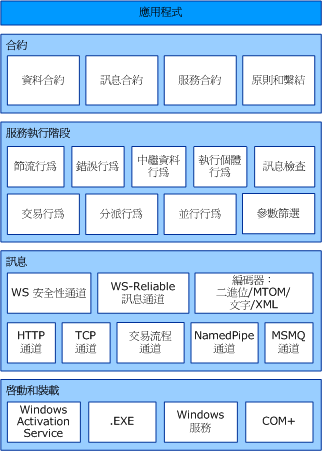

# Windows Communication Foundation 架構Windows Communication Foundation Architecture
下圖說明 [!INCLUDE[indigo1](../../../includes/indigo1-md.md)] 架構的各主要層。The following graphic illustrates the major layers of the [!INCLUDE[indigo1](../../../includes/indigo1-md.md)] architecture.  
  
## WCF 架構WCF Architecture  
   
  
### 合約和描述Contracts and Descriptions  
 合約會定義訊息系統的各方面。Contracts define various aspects of the message system. 資料合約會描述服務所能建立或使用之每個訊息在構成時所使用的每個參數。The data contract describes every parameter that makes up every message that a service can create or consume. 這些訊息參數是由 XML 結構描述定義語言 (XSD) 文件所定義，因此可使任何瞭解 XML 的系統都能處理這些文件。The message parameters are defined by XML Schema definition language (XSD) documents, enabling any system that understands XML to process the documents. 訊息合約會使用 SOAP 通訊協定來定義特定訊息部分，並允許在互通性 (Interoperability) 要求時對訊息的部分進行更精細的控制。The message contract defines specific message parts using SOAP protocols, and allows finer-grained control over parts of the message, when interoperability demands such precision. 服務合約會指定服務的實際方法簽章，而且會透過一種支援的程式語言 (例如 Visual Basic 或 Visual C#) 來散發為介面。The service contract specifies the actual method signatures of the service, and is distributed as an interface in one of the supported programming languages, such as Visual Basic or Visual C#.  
  
 原則和繫結會規定與服務進行通訊時的必要條件。Policies and bindings stipulate the conditions required to communicate with a service.  例如，繫結必須 (至少需要) 指定使用的傳輸 (例如，HTTP 或 TCP)，以及編碼方式。For example, the binding must (at a minimum) specify the transport used (for example, HTTP or TCP), and an encoding. 原則包含在與服務通訊時必須符合的安全性需求和其他條件。Policies include security requirements and other conditions that must be met to communicate with a service.  
  
### 服務執行階段Service Runtime  
 服務執行階段層包含只會在服務之實際作業期間發生的行為，也就是服務的執行階段行為。The service runtime layer contains the behaviors that occur only during the actual operation of the service, that is, the runtime behaviors of the service. 節流設定會控制要處理多少訊息，而隨著對服務的要求擴大到預設限制，這個數量可能會有所不同。Throttling controls how many messages are processed, which can be varied if the demand for the service grows to a preset limit. 錯誤行為會指定在服務發生內部錯誤時所要發生的動作，例如，控制有哪些資訊要傳送到用戶端 An error behavior specifies what occurs when an internal error occurs on the service, for example, by controlling what information is communicated to the client. (有太多資料會讓惡意使用者有機會發動攻擊)。中繼資料行為會管理採用什麼方式以及是否將中繼資料提供給外界。(Too much information can give a malicious user an advantage in mounting an attack.) Metadata behavior governs how and whether metadata is made available to the outside world. 執行個體 (Instance) 行為會指定可以執行服務之執行個體的數目 (例如，「單一」就是指定僅能使用一個執行個體來處理所有訊息)。Instance behavior specifies how many instances of the service can be run (for example, a singleton specifies only one instance to process all messages). 交易行為可使交易的作業在發生失敗時進行復原。Transaction behavior enables the rollback of transacted operations if a failure occurs. 分派行為會控制 [!INCLUDE[indigo2](../../../includes/indigo2-md.md)] 基礎結構處理訊息的方式。Dispatch behavior is the control of how a message is processed by the [!INCLUDE[indigo2](../../../includes/indigo2-md.md)] infrastructure.  
  
 擴充性可使執行階段處理序進行自訂。Extensibility enables customization of runtime processes. 例如，訊息檢查是檢查訊息之部分的功能，而啟用參數篩選功能時，便會根據作用於訊息標頭的篩選來發生預設動作。For example, message inspection is the facility to inspect parts of a message, and parameter filtering enables preset actions to occur based on filters acting on message headers.  
  
### 訊息Messaging  
 在訊息層組成*通道*。The messaging layer is composed of *channels*. 通道是指能以某種方式 (例如，藉由驗證訊息) 處理訊息的元件。A channel is a component that processes a message in some way, for example, by authenticating a message. 一組通道就是所謂*通道堆疊*。A set of channels is also known as a *channel stack*. 通道會在訊息和訊息標頭上運作。Channels operate on messages and message headers. 這點不同於服務執行階段層，其主要著重於關於處理訊息本文的執行。This is different from the service runtime layer, which is primarily concerned about processing the contents of message bodies.  
  
 通道類型有兩種：傳輸通道和通訊協定通道。There are two types of channels: transport channels and protocol channels.  
  
 傳輸通道會從網路讀取和寫入訊息 (或是與外界連接的一些其他通訊點)。Transport channels read and write messages from the network (or some other communication point with the outside world). 有些傳輸會使用編碼器在訊息 (表示為 XML Infoset) 和網路所使用的位元組資料流表示之間來回轉換。Some transports use an encoder to convert messages (which are represented as XML Infosets) to and from the byte stream representation used by the network. 這類傳輸的範例包括 HTTP、具名管道 (Named Pipe)、TCP 及 MSMQ。Examples of transports are HTTP, named pipes, TCP, and MSMQ. 這類編碼的範例包括 XML 和最佳化的二進位編碼。Examples of encodings are XML and optimized binary.  
  
 通訊協定通道會實作訊息處理通訊協定，而此通常是藉由讀取或寫入訊息的額外標頭來完成。Protocol channels implement message processing protocols, often by reading or writing additional headers to the message. 這類通訊協定的範例包括 WS-Security 和 WS-Reliability。Examples of such protocols include WS-Security and WS-Reliability.  
  
 訊息層說明資料的可能格式與交換模式。The messaging layer illustrates the possible formats and exchange patterns of the data. WS-Security 是 WS-Security 規格的實作 (Implementation)，此規格會啟用訊息層的安全性。WS-Security is an implementation of the WS-Security specification enabling security at the message layer. WS-Reliable 訊息通道可保證訊息的傳遞。The WS-Reliable Messaging channel enables the guarantee of message delivery. 編碼器會提供可以用來滿足訊息需要的各種編碼方式。The encoders present a variety of encodings that can be used to suit the needs of the message. HTTP 通道會指定對訊息傳遞使用超文字傳輸協定 (Hypertext Transfer Protocol，HTTP)。The HTTP channel specifies that the HyperText Transport Protocol is used for message delivery. 同樣地，TCP 通道會指定 TCP 通訊協定。The TCP channel similarly specifies the TCP protocol. 交易流程通道會管理交易的訊息模式。The Transaction Flow channel governs transacted message patterns. 具名管道通道會啟用處理序間通訊。The Named Pipe channel enables interprocess communication. MSMQ 通道會啟用與 MSMQ 應用程式的互通。The MSMQ channel enables interoperation with MSMQ applications.  
  
### 裝載和啟動Hosting and Activation  
 服務的最終形式就是程式。In its final form, a service is a program. 就像其他的程式，服務必須在可執行檔中執行。Like other programs, a service must be run in an executable. 這稱為*自我裝載*服務。This is known as a *self-hosted* service.  
  
 服務也可以是*裝載*，或是執行受外部代理程式，例如 IIS 或 Windows Activation Service (WAS) 的可執行檔中。Services can also be *hosted*, or run in an executable managed by an external agent, such as IIS or Windows Activation Service (WAS). WAS 讓 [!INCLUDE[indigo2](../../../includes/indigo2-md.md)] 應用程式能在部署到執行 WAS 的電腦上時自動啟動。WAS enables [!INCLUDE[indigo2](../../../includes/indigo2-md.md)] applications to be activated automatically when deployed on a computer running WAS. 服務也可以透過手動方式來當做可執行檔 (.exe 檔) 執行。Services can also be manually run as executables (.exe files). 服務也可以自動當做 Windows 服務執行。A service can also be run automatically as a Windows service. COM+ 元件也可以裝載為 [!INCLUDE[indigo2](../../../includes/indigo2-md.md)] 服務。COM+ components can also be hosted as [!INCLUDE[indigo2](../../../includes/indigo2-md.md)] services.  
  
## 另請參閱See Also  
 [什麼是 Windows Communication FoundationWhat Is Windows Communication Foundation](../../../docs/framework/wcf/whats-wcf.md)  
 [Windows Communication Foundation 的基本概念Fundamental Windows Communication Foundation Concepts](../../../docs/framework/wcf/fundamental-concepts.md)
