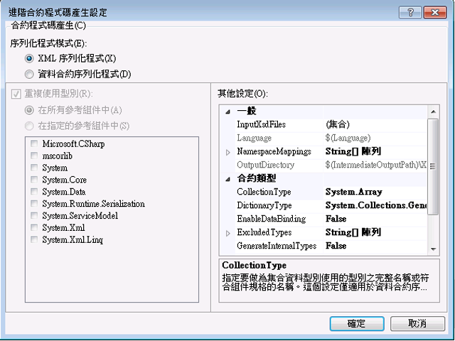

# <a name="contract-first-tool"></a>Contract-First 工具
服務合約通常必須從現有的服務來建立。 在 [!INCLUDE[net_v45](../../../includes/net-v45-md.md)] 中，可以使用合約優先 (Contract-First) 工具自動從現有的服務建立資料合約類別。 若要使用合約優先工具，必須將 XML 結構描述定義 (XSD) 檔案下載至本機，這個工具無法透過 HTTP 匯入遠端資料合約。  
  
 合約優先工具已整合至 [!INCLUDE[vs_current_long](../../../includes/vs-current-long-md.md)] 中做為建置工作。 每當建置專案時就會建立建置工作所產生的程式碼檔案，讓專案可以輕鬆採用基礎服務合約中的變更。  
  
 合約優先工具可以匯入的結構描述型別包括下列各項：  
  
```xml  
<xsd:complexType>  
<xsd:simpleType>  
```  
  
 如果這些型別是基本型別 (例如 `Int16` 或 `String`) 則不產生簡單型別，如果是 `Collection` 型別則不產生複雜類型。 如果這些型別是其他 `xsd:complexType` 的一部分，也不會產生型別。 在所有這些情況下，型別會改為參考專案中的現有型別。  
  
## <a name="adding-a-data-contract-to-a-project"></a>將資料合約加入至專案  
 在使用合約優先工具之前，必須先將服務合約 (XSD) 加入至專案。 為了便於說明本概觀，將會使用下列合約來解釋合約優先功能。 這項服務定義是 Bing 的搜尋應用程式開發介面所使用之服務合約的一個小型子集合。  
  
```xml  
<?xml version="1.0" encoding="utf-8"?>  
<xs:schema id="ServiceSchema"  
    targetNamespace="http://tempuri.org/ServiceSchema.xsd"  
    elementFormDefault="qualified"  
    xmlns="http://tempuri.org/ServiceSchema.xsd"  
    xmlns:mstns="http://tempuri.org/ServiceSchema.xsd"  
    xmlns:xs="http://www.w3.org/2001/XMLSchema"  
>  
  <xs:complexType name="SearchRequest">  
    <xs:sequence>  
      <xs:element minOccurs="0" maxOccurs="1" name="Version" type="xs:string" default="2.2" />  
      <xs:element minOccurs="0" maxOccurs="1" name="Market" type="xs:string" />  
      <xs:element minOccurs="0" maxOccurs="1" name="UILanguage" type="xs:string" />  
      <xs:element minOccurs="1" maxOccurs="1" name="Query" type="xs:string" />  
      <xs:element minOccurs="1" maxOccurs="1" name="AppId" type="xs:string" />  
      <xs:element minOccurs="0" maxOccurs="1" name="Latitude" type="xs:double" />  
      <xs:element minOccurs="0" maxOccurs="1" name="Longitude" type="xs:double" />  
      <xs:element minOccurs="0" maxOccurs="1" name="Radius" type="xs:double" />  
    </xs:sequence>  
  </xs:complexType>  
  <xs:simpleType name="WebSearchOption">  
    <xs:restriction base="xs:string">  
      <xs:enumeration value="DisableHostCollapsing" />  
      <xs:enumeration value="DisableQueryAlterations" />  
    </xs:restriction>  
  </xs:simpleType>  
</xs:schema>  
```  
  
 將上述服務合約加入至專案，以滑鼠右鍵按一下專案，然後選取**加入新...**. 從 [範本] 對話方塊的 [WCF] 窗格中選取 [結構描述定義]，並命名新的檔案 SampleContract.xsd。 複製上面的程式碼，將其貼入新檔案的程式碼檢視中。  
  
## <a name="configuring-contract-first-options"></a>設定合約優先選項  
 合約優先選項可以在 WCF 專案中的內容功能表中加以設定。 若要啟用合約優先開發，請選取**將 XSD 啟用為型別定義語言**專案屬性 視窗的 WCF 頁面中核取方塊。  
  
   
  
 若要設定進階屬性，請按一下 [進階] 按鈕。  
  
   
  
 您可以設定下列適用於從合約產生程式碼的進階設定。 這些設定只能針對專案中的所有檔案進行，目前尚無法對個別檔案進行設定。  
  
-   **序列化程式模式**： 此設定會決定哪個序列化程式，可用來讀取服務合約檔案。 當**XML 序列化程式**選取時，**集合型別**和**重複使用型別**選項已停用。 這些選項僅適用於**資料合約序列化程式**。  
  
-   **重複使用型別**： 此設定可讓您指定哪些文件庫用於型別重複使用。 這項設定僅適用於**序列化程式模式**設**資料合約序列化程式**。  
  
-   **集合型別**： 此設定指定要用於集合的資料類型的完整限定或組件限定型別。 這項設定僅適用於**序列化程式模式**設**資料合約序列化程式**。  
  
-   **字典型別的**： 此設定指定要用於字典資料型別的完整限定或組件限定型別。  
  
-   **EnableDataBinding**： 此設定指定是否要實作<xref:System.ComponentModel.INotifyPropertyChanged>介面以實作資料繫結的所有資料類型。  
  
-   **ExcludedTypes**： 此設定指定要從參考的組件中排除的完整限定或組件限定類型的清單。 這項設定僅適用於**序列化程式模式**設**資料合約序列化程式**。  
  
-   **GenerateInternalTypes**： 此設定指定是否要產生標示為內部的類別。 這項設定僅適用於**序列化程式模式**設**資料合約序列化程式**。  
  
-   **GenerateSerializableTypes**： 此設定指定是否要產生與類別<xref:System.SerializableAttribute>屬性。 這項設定僅適用於**序列化程式模式**設**資料合約序列化程式**。  
  
-   **/Importxmltypes**： 此設定指定是否設定資料合約序列化程式，以套用<xref:System.SerializableAttribute>屬性設定為不具類別<xref:System.Runtime.Serialization.DataContractAttribute>屬性。  這項設定僅適用於**序列化程式模式**設**資料合約序列化程式**。  
  
-   **SupportFx35TypedDataSets**： 此設定指定是否提供額外的功能，針對具類型資料集建立適用於.Net Framework 3.5。 當**序列化程式模式**設**XML 序列化程式**、<xref:System.Data.Design.TypedDataSetSchemaImporterExtensionFx35>擴充將會加入至 XML 結構描述匯入工具，當此值設定為 True。 當**序列化程式模式**設為**資料合約序列化程式**，型別<xref:System.DateTimeOffset>時此值設定為 False，將從參考排除，讓<xref:System.DateTimeOffset>一定會產生針對舊版 framework。  
  
-   **InputXsdFiles**： 此設定指定輸入檔清單。 每個檔案都必須包含有效的 XML 結構描述。  
  
-   **語言**： 此設定指定產生的合約程式碼的語言。 這個設定必須可以由 <xref:System.CodeDom.Compiler.CodeDomProvider> 辨識。  
  
-   **NamespaceMappings**： 此設定可指定從 XSD 目標命名空間到 CLR 命名空間的對應。 每個對應都要使用下列格式：  
  
    ```xml  
    "<Schema Namespace>, <CLR Namespace>"  
    ```  
  
     XML 序列化程式只接受一個使用下列格式的對應：  
  
    ```xml  
    "*, <CLR Namespace>"  
    ```  
  
-   **OutputDirectory**： 此設定可指定將產生的程式碼檔案的目錄。  
  
 建置專案時，將會使用這些設定從服務合約檔案產生服務合約型別。  
  
## <a name="using-contract-first-development"></a>使用合約優先開發  
 加入專案中的服務合約並確認組建設定，請按下建置專案後**F6**。 服務合約中定義的型別接著就可以在專案中使用。  
  
 若要使用服務合約中定義的型別，請在目前命名空間之下加入 `ContractTypes` 的參考：  
  
```csharp  
using MyProjectNamespace.ContractTypes;  
```  
  
 服務合約中定義的型別接著就可以在專案中解析，如下所示。  
  
   
  
 工具所產生的型別會建立在 GeneratedXSDTypes.cs 檔案中。 檔案建立在\<專案目錄 > j\<組建組態 > /XSDGeneratedCode/ 目錄預設。 本主題開頭的範例結構描述轉換如下：  
  
```csharp
//------------------------------------------------------------------------------  
// <auto-generated>  
//     This code was generated by a tool.  
//     Runtime Version:4.0.30319.17330  
//  
//     Changes to this file may cause incorrect behavior and will be lost if  
//     the code is regenerated.  
// </auto-generated>  
//------------------------------------------------------------------------------  
  
namespace TestXSD3.ContractTypes  
{  
    using System.Xml.Serialization;  
  
    /// <remarks/>  
    [System.CodeDom.Compiler.GeneratedCodeAttribute("System.Xml", "4.0.30319.17330")]  
    [System.SerializableAttribute()]  
    [System.Diagnostics.DebuggerStepThroughAttribute()]  
    [System.ComponentModel.DesignerCategoryAttribute("code")]  
    [System.Xml.Serialization.XmlTypeAttribute(Namespace="http://tempuri.org/ServiceSchema.xsd")]  
    [System.Xml.Serialization.XmlRootAttribute(Namespace="http://tempuri.org/ServiceSchema.xsd", IsNullable=true)]  
    public partial class SearchRequest  
    {  
  
        private string versionField;  
  
        private string marketField;  
  
        private string uILanguageField;  
  
        private string queryField;  
  
        private string appIdField;  
  
        private double latitudeField;  
  
        private bool latitudeFieldSpecified;  
  
        private double longitudeField;  
  
        private bool longitudeFieldSpecified;  
  
        private double radiusField;  
  
        private bool radiusFieldSpecified;  
  
        public SearchRequest()  
        {  
            this.versionField = "2.2";  
        }  
  
        /// <remarks/>  
        [System.ComponentModel.DefaultValueAttribute("2.2")]  
        public string Version  
        {  
            get  
            {  
                return this.versionField;  
            }  
            set  
            {  
                this.versionField = value;  
            }  
        }  
  
        /// <remarks/>  
        public string Market  
        {  
            get  
            {  
                return this.marketField;  
            }  
            set  
            {  
                this.marketField = value;  
            }  
        }  
  
        /// <remarks/>  
        public string UILanguage  
        {  
            get  
            {  
                return this.uILanguageField;  
            }  
            set  
            {  
                this.uILanguageField = value;  
            }  
        }  
  
        /// <remarks/>  
        public string Query  
        {  
            get  
            {  
                return this.queryField;  
            }  
            set  
            {  
                this.queryField = value;  
            }  
        }  
  
        /// <remarks/>  
        public string AppId  
        {  
            get  
            {  
                return this.appIdField;  
            }  
            set  
            {  
                this.appIdField = value;  
            }  
        }  
  
        /// <remarks/>  
        public double Latitude  
        {  
            get  
            {  
                return this.latitudeField;  
            }  
            set  
            {  
                this.latitudeField = value;  
            }  
        }  
  
        /// <remarks/>  
        [System.Xml.Serialization.XmlIgnoreAttribute()]  
        public bool LatitudeSpecified  
        {  
            get  
            {  
                return this.latitudeFieldSpecified;  
            }  
            set  
            {  
                this.latitudeFieldSpecified = value;  
            }  
        }  
  
        /// <remarks/>  
        public double Longitude  
        {  
            get  
            {  
                return this.longitudeField;  
            }  
            set  
            {  
                this.longitudeField = value;  
            }  
        }  
  
        /// <remarks/>  
        [System.Xml.Serialization.XmlIgnoreAttribute()]  
        public bool LongitudeSpecified  
        {  
            get  
            {  
                return this.longitudeFieldSpecified;  
            }  
            set  
            {  
                this.longitudeFieldSpecified = value;  
            }  
        }  
  
        /// <remarks/>  
        public double Radius  
        {  
            get  
            {  
                return this.radiusField;  
            }  
            set  
            {  
                this.radiusField = value;  
            }  
        }  
  
        /// <remarks/>  
        [System.Xml.Serialization.XmlIgnoreAttribute()]  
        public bool RadiusSpecified  
        {  
            get  
            {  
                return this.radiusFieldSpecified;  
            }  
            set  
            {  
                this.radiusFieldSpecified = value;  
            }  
        }  
    }  
  
    /// <remarks/>  
    [System.CodeDom.Compiler.GeneratedCodeAttribute("System.Xml", "4.0.30319.17330")]  
    [System.SerializableAttribute()]  
    [System.Xml.Serialization.XmlTypeAttribute(Namespace="http://tempuri.org/ServiceSchema.xsd")]  
    [System.Xml.Serialization.XmlRootAttribute(Namespace="http://tempuri.org/ServiceSchema.xsd", IsNullable=false)]  
    public enum WebSearchOption  
    {  
  
        /// <remarks/>  
        DisableHostCollapsing,  
  
        /// <remarks/>  
        DisableQueryAlterations,  
    }  
}  
```  
  
## <a name="errors-and-warnings"></a>錯誤和警告  
 剖析 XSD 結構描述時發生的錯誤和警告將會顯示為建置錯誤和警告。  
  
## <a name="interface-inheritance"></a>介面繼承  
 不能同時使用介面繼承與合約優先開發；這與介面在其他作業中的運作方式一致。 若要使用繼承基底介面的介面，請使用兩個單獨的端點。 第一個端點使用繼承的合約，第二個端點實作基底介面。
