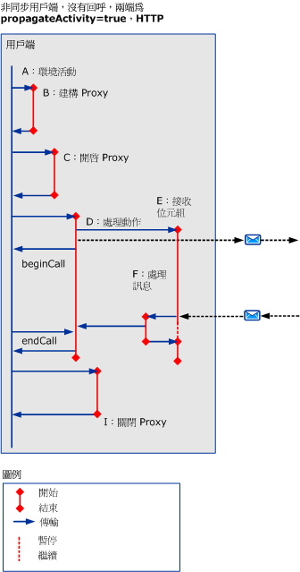
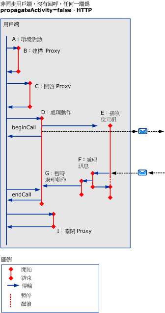
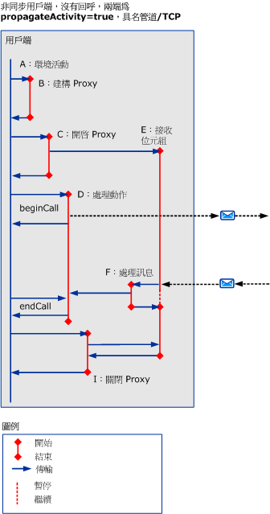
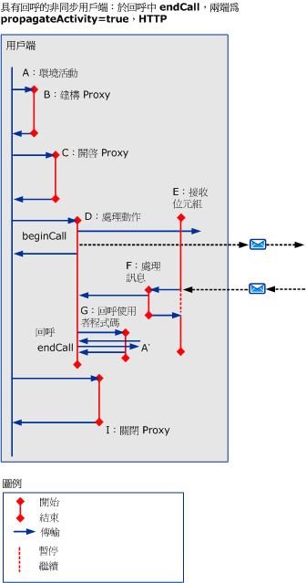
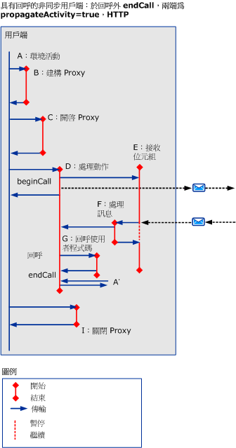
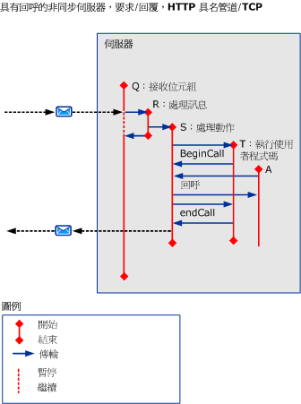

# 使用 HTTP、TCP 或具名管道的非同步案例Asynchronous Scenarios using HTTP, TCP, or Named-Pipe
本主題會說明各種非同步要求/回覆案例的活動和傳輸，以及使用 HTTP、TCP 或具名管道的執行緒要求。This topic describes the activities and transfers for different asynchronous request/reply scenarios, with multithreaded requests using HTTP, TCP, or named pipe.  
  
## 無錯誤的非同步要求/回覆Asynchronous Request/Reply without Errors  
 本章節會說明非同步要求/回覆案例的活動和傳輸，以及多執行緒的用戶端。This section describes the activities and transfers for an asynchronous request/reply scenario, with multithreaded clients.  
  
 當 `beginCall` 傳回，而且 `endCall` 傳回時，呼叫端活動便會終止。The caller activity terminates when `beginCall` returns, and `endCall` returns. 如果有呼叫回呼，該回呼就會傳回。If a callback is called, the callback returns.  
  
 當 `beginCall` 傳回，而且 `endCall` 傳回，或是當回呼 (若有從活動呼叫) 傳回時，呼叫的活動便會終止。The called activity terminates when `beginCall` returns, `endCall` returns, or when the callback returns if it was called from that activity.  
  
### 沒有回呼的非同步用戶端Asynchronous Client without Callback  
  
#### 兩端皆啟用傳播，使用 HTTPPropagation is Enabled on Both Sides, using HTTP  
   
  
 圖 1。Figure 1. 非同步用戶端，沒有回呼， `propagateActivity` = `true`兩端，HTTPAsynchronous client, no callback, `propagateActivity`=`true` on both sides, HTTP  
  
 如果`propagateActivity` = `true`，ProcessMessage 會指示要傳輸哪一個 ProcessAction 活動。If `propagateActivity`=`true`, ProcessMessage indicates which ProcessAction activity to transfer to.  
  
 若是 HTTP 架構案例，ReceiveBytes 會叫用於第一個要傳送的訊息上，並隨該要求的存留期而保留。For HTTP-based scenarios, ReceiveBytes is invoked on the first message to send, and exists for the lifetime of the request.  
  
#### 任何一端的傳播已停用，使用 HTTPPropagation is Disabled on Either Sides, using HTTP  
 如果`propagateActivity` = `false`任一邊，ProcessMessage 不會指示要傳輸哪一個 ProcessAction 活動。If `propagateActivity`=`false` on either side, ProcessMessage does not indicate which ProcessAction activity to transfer to. 因此，這時會叫用含有新識別碼的新暫存 ProcessAction 活動。Therefore, a new temporary ProcessAction activity with a new ID is invoked. 當非同步回應符合 ServiceModel 程式碼中的要求時，該活動識別碼即可從本機內容進行擷取。When the asynchronous response is matched to the request in ServiceModel code, the Activity ID can be retrieved from the local context. 實際的 ProcessAction 活動可以透過該識別碼加以傳輸。The actual ProcessAction activity can be transferred to with that ID.  
  
   
  
 圖 2。Figure 2. 非同步用戶端，沒有回呼， `propagateActivity` = `false`任一端，HTTPAsynchronous client, no callback, `propagateActivity`=`false` on either side, HTTP  
  
 若是 HTTP 架構案例，ReceiveBytes 會叫用於第一個要傳送的訊息上，並隨該要求的存留期而保留。For HTTP-based scenarios, ReceiveBytes is invoked on the first message to send, and exists for the lifetime of the request.  
  
 非同步用戶端上建立 「 處理動作 」 活動時`propagateActivity` = `false`呼叫端或被呼叫端，和回應訊息不包含動作標頭。A Process Action activity is created on an asynchronous client when `propagateActivity`=`false` at the caller or callee, and when the response message does not include an Action header.  
  
#### 兩端皆啟用傳播，使用 TCP 或具名管道Propagation is Enabled on Both Sides, using TCP or Named Pipe  
   
  
 圖 3.Figure 3. 非同步用戶端，沒有回呼， `propagateActivity` = `true`雙方具名管道 /TCPAsynchronous client, no callback, `propagateActivity`=`true` on both sides, Named-Pipe/TCP  
  
 若是具名管道或 TCP 架構案例，ReceiveBytes 會叫用於用戶端開啟時，並隨該連線的存留期而保留。For a Named-Pipe or TCP-based scenario, ReceiveBytes is invoked when the client is opened, and exists for the lifetime of the connection.  
  
 類似於圖 1，如果`propagateActivity` = `true`，ProcessMessage 會指示要傳輸哪一個 ProcessAction 活動。Similar to Figure 1, if `propagateActivity`=`true`, ProcessMessage indicates which ProcessAction activity to transfer to.  
  
#### 任何一端的傳播已停用，使用 TCP 或具名管道Propagation is Disabled on Either Sides, using TCP or Named Pipe  
 若是具名管道或 TCP 架構案例，ReceiveBytes 會叫用於用戶端開啟時，並隨該連線的存留期而保留。For a Named-Pipe or TCP-based scenario, ReceiveBytes is invoked when the client is opened, and exists for the lifetime of the connection.  
  
 類似於 Fig.2，如果`propagateActivity` = `false`任一邊，ProcessMessage 不會指示要傳輸哪一個 ProcessAction 活動。Similar to Fig.2, If `propagateActivity`=`false` on either side, ProcessMessage does not indicate which ProcessAction activity to transfer to. 因此，這時會叫用含有新識別碼的新暫存 ProcessAction 活動。Therefore, a new temporary ProcessAction activity with a new ID is invoked. 當非同步回應符合 ServiceModel 程式碼中的要求時，該活動識別碼即可從本機內容進行擷取。When the asynchronous response is matched to the request in ServiceModel code, the Activity ID can be retrieved from the local context. 實際的 ProcessAction 活動可以透過該識別碼加以傳輸。The actual ProcessAction activity can be transferred to with that ID.  
  
   
  
 圖 4。Figure 4. 非同步用戶端，沒有回呼， `propagateActivity` = `false`任一端、 具名管道 /TCPAsynchronous client, no callback, `propagateActivity`=`false` on either side, Named-Pipe/TCP  
  
### 有回呼的非同步用戶端Asynchronous client with Callback  
 這個案例會為回呼和 `endCall` 新增活動 G 和 A’，及其傳入/傳出。This scenario adds activities G and A’, for the callback and `endCall`, and their transfers in/out.  
  
 本章節只有示範使用 HTTP 與`propragateActivity` = `true`。This section only demonstrates using HTTP with `propragateActivity`=`true`. 不過，其他的活動和傳輸也適用於其他情況 (也就是`propagateActivity` = `false`，使用 TCP 或具名管道)。However, the additional activities and transfers also apply to the other cases (that is, `propagateActivity`=`false`, using TCP or Named-Pipe).  
  
 當用戶端呼叫使用者程式碼以通知結果已準備好時，該回呼就會建立新活動 (G)。The callback creates a new activity (G) when the client calls user code to notify that results are ready. 然後，使用者程式碼便會從回呼內部 (如圖 5 所示) 或回呼外部 (圖 6) 呼叫 `endCall`。User code then calls `endCall` within the callback (as shown in Figure 5) or outside the callback (Figure 6). 因為不知道哪個使用者活動`endCall`呼叫，此活動會標示為`A’`。Because it is not known which user activity `endCall` is being called from, this activity is labeled `A’`. A’ 有可能相同或不同於 A。It is possible that A’ can be identical to or different from A.  
  
   
  
 圖 5。Figure 5. 具有回呼的非同步用戶端，從回呼呼叫 `endCall`Asynchronous client with callback, `endCall` in Callback  
  
   
  
 圖 6。Figure 6. 具有回呼的非同步用戶端，從回呼外部呼叫 `endCall`Asynchronous client with callback, `endCall` outside of Callback  
  
### 有回呼的非同步伺服器Asynchronous Server with Callback  
   
  
 圖 7。Figure 7. 有回呼的非同步伺服器Asynchronous server, with callback  
  
 通道堆疊會在訊息接收時回呼用戶端：這個處理的追蹤會由 ProcessRequest 活動本身發出。The channel stack calls back the client on Message Receive: traces for this processing are emitted in the ProcessRequest activity itself.  
  
## 含有錯誤的非同步要求/回覆Asynchronous Request/Reply with Errors  
 `endCall` 期間會收到錯誤 (Fault) 訊息錯誤 (Error)。Fault message errors are received during `endCall`. 在其他方面，活動和傳輸都與上述案例相似。Otherwise, activities and transfers are similar to previous scenarios.  
  
## 不一定具有錯誤的非同步單向Asynchronous One-Way with or without Errors  
 沒有任何回應或錯誤傳回到用戶端。No response or fault is returned to the client.
