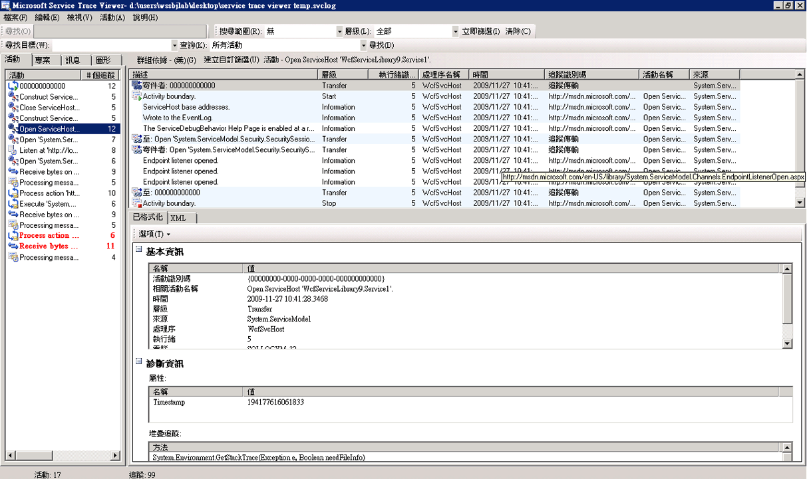
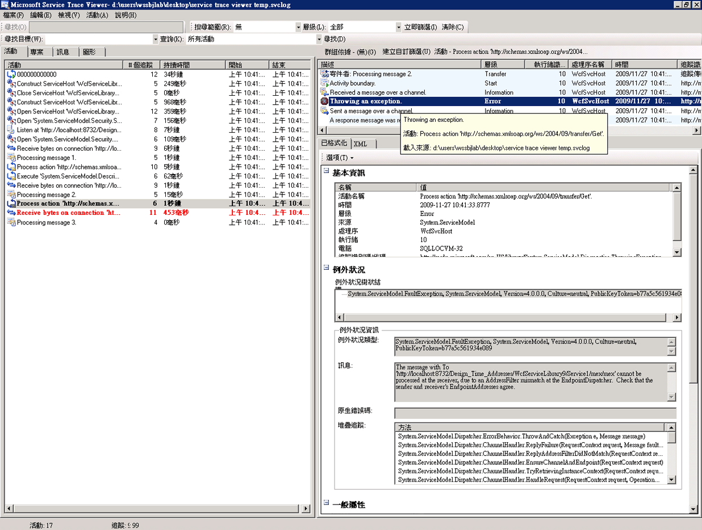
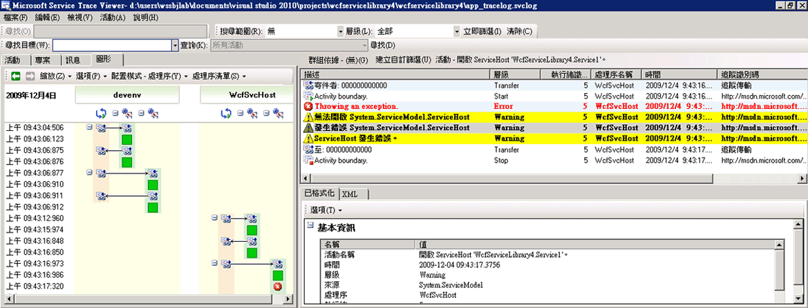

# <a name="emitting-user-code-traces"></a>發出使用者程式碼追蹤
除了在組態中啟用追蹤來收集由 [!INCLUDE[indigo1](../../../../../includes/indigo1-md.md)] 產生的檢測資料之外，您也可以在使用者程式碼中，透過程式設計方式發出追蹤。 如此一來，您就可以主動建立供日後深入診斷之用的檢測資料。 本主題將討論如何完成這項工作。  
  
 此外，[擴充追蹤](../../../../../docs/framework/wcf/samples/extending-tracing.md)範例包含下列各節中所示範的程式碼。  
  
## <a name="creating-a-trace-source"></a>建立追蹤來源  
 您可以使用下列程式碼來建立使用者追蹤來源。  
  
```  
TraceSource ts = new TraceSource("myUserTraceSource");  
```  
  
## <a name="creating-activities"></a>建立活動  
 活動是處理的邏輯單位。 您可以為每個主要處理單位建立一個活動，而這些處理單位是您要在其中將追蹤聚集成群組的地方。 例如，您可以為每一個針對服務發出的要求建立一個活動。 若要這麼做，請執行下列步驟。  
  
1.  儲存範圍內的活動識別碼。  
  
2.  建立新的活動識別碼。  
  
3.  從範圍內的活動傳輸到新活動、設定範圍內的新活動，然後發出該活動的「開始追蹤」。  
  
 下列程式碼會示範如何執行此項作業。  
  
```  
Guid oldID = Trace.CorrelationManager.ActivityId;  
Guid traceID = Guid.NewGuid();  
ts.TraceTransfer(0, "transfer", traceID);  
Trace.CorrelationManager.ActivityId = traceID; // Trace is static  
ts.TraceEvent(TraceEventType.Start, 0, "Add request");  
```  
  
## <a name="emitting-traces-within-a-user-activity"></a>在使用者活動內發出追蹤  
 下列程式碼會在使用者活動內發出追蹤。  
  
```  
double value1 = 100.00D;  
double value2 = 15.99D;  
ts.TraceInformation("Client sends message to Add " + value1 + ", " + value2);  
double result = client.Add(value1, value2);  
ts.TraceInformation("Client receives Add response '" + result + "'");  
```  
  
## <a name="stopping-the-activities"></a>停止活動  
 若要停止活動，請傳輸回到舊活動、停止目前的活動識別碼，然後重設範圍內的舊活動識別碼。  
  
 下列程式碼會示範如何執行此項作業。  
  
```  
ts.TraceTransfer(0, "transfer", oldID);  
ts.TraceEvent(TraceEventType.Stop, 0, "Add request");  
Trace.CorrelationManager.ActivityId = oldID;  
```  
  
## <a name="propagating-the-activity-id-to-a-service"></a>將活動識別碼傳播至服務  
 如果同時在用戶端和服務的組態檔中，將其 `propagateActivity` 追蹤來源的 `true` 屬性設定為 `System.ServiceModel`，則會在用戶端定義的同一個活動中進行「加法」要求的服務處理。 如果服務定義了本身的活動和傳輸，服務追蹤就不會出現在用戶端傳播的活動中， 而會出現在和用戶端傳播的識別碼所代表之活動相互關聯的活動中 (此相互關聯是由傳輸追蹤建立)。  
  
> [!NOTE]
>  如果同時在用戶端和服務上，將其 `propagateActivity` 屬性設定為 `true`，則服務作業範圍內的環境活動 (Ambient Activity) 是由 [!INCLUDE[indigo2](../../../../../includes/indigo2-md.md)] 所設定。  
  
 您可以使用下列程式碼來檢查 [!INCLUDE[indigo2](../../../../../includes/indigo2-md.md)] 是否已在範圍中設定某項活動。  
  
```  
// Check if an activity was set in scope by WCF, if it was   
// propagated from the client. If not, ( ambient activity is   
// equal to Guid.Empty), create a new one.  
if(Trace.CorrelationManager.ActivityId == Guid.Empty)  
{  
    Guid newGuid = Guid.NewGuid();  
    Trace.CorrelationManager.ActivityId = newGuid;  
}  
// Emit your Start trace.  
ts.TraceEvent(TraceEventType.Start, 0, "Add Activity");  
  
// Emit the processing traces for that request.  
serviceTs.TraceInformation("Service receives Add "   
                            + n1 + ", " + n2);  
// double result = n1 + n2;  
serviceTs.TraceInformation("Service sends Add result" + result);  
  
// Emit the Stop trace and exit the method scope.  
ts.TraceEvent(TraceEventType.Stop, 0, "Add Activity");  
// return result;  
```  
  
## <a name="tracing-exceptions-thrown-in-code"></a>追蹤程式碼中擲回的例外狀況  
 當您在程式碼中擲回例外狀況時，您也可以使用下列程式碼來追蹤警告層級 (含) 以上的例外狀況。  
  
```  
ts.TraceEvent(TraceEventType.Warning, 0, "Throwing exception " + "exceptionMessage");  
```  
  
## <a name="viewing-user-traces-in-the-service-trace-viewer-tool"></a>在服務追蹤檢視器工具中檢視使用者追蹤  
 此章節包含的執行所產生的追蹤螢幕擷取畫面[擴充追蹤](../../../../../docs/framework/wcf/samples/extending-tracing.md)取樣，請使用檢視時[服務追蹤檢視器工具 (SvcTraceViewer.exe)](../../../../../docs/framework/wcf/service-trace-viewer-tool-svctraceviewer-exe.md)。  
  
 在下列圖表中，左面板上選取先前建立的 「 加法要求 」 活動。 它和構成應用程式用戶端程式的另外三個「數學運算」活動 (除法、減法、乘法) 列在一起。 使用者程式碼為每項作業各定義了一個新活動，以便隔離不同要求中可能發生的錯誤。  
  
 示範如何使用中傳輸的[擴充追蹤](../../../../../docs/framework/wcf/samples/extending-tracing.md)範例中，封裝將四個作業要求的計算機活動也會建立。 每個要求都有往返於「計算機」活動和要求活動之間的傳輸 (本圖的右上方面板中會反白顯示追蹤)。  
  
 當您選取左面板上的活動時，這個活動所包含的追蹤會顯示在右上方面板中。 如果`propagateActivity`是`true`要求路徑中每個端點，在要求活動中的追蹤會從所有參與要求的處理序。 在這個範例中，您可以在面板的第 4 欄中看見來自用戶端和服務兩方的追蹤。  
  
 這個活動會顯示下列處理順序：  
  
1.  用戶端傳送訊息至「加法」。  
  
2.  服務接收「加法」要求訊息。  
  
3.  服務傳送「加法」回應。  
  
4.  用戶端接收「加法」回應。  
  
 所有這些追蹤都是在資訊層級發出。 按一下右上方面板中的追蹤，就會在右下方面板中顯示該追蹤的詳細資訊。  
  
 在下列圖表中，也會看到往返「計算機」活動的傳輸追蹤，以及每個要求活動各兩對的「開始」和「停止」追蹤，一對屬於用戶端，另一對屬於服務 (亦即，每個追蹤來源各有一對追蹤)。  
  
   
依據建立時間 (左面板) 以及依據巢狀活動 (右上方面板) 列示的活動清單  
  
 如果服務程式碼擲回連帶導致用戶端擲回的例外狀況 (例如，用戶端未獲得其要求的回應時)，服務和用戶端的警告或錯誤訊息都會因為直接的相互關聯而在同一個活動中產生。 在下列圖表中，服務擲回例外狀況的"The service refuses 處理此要求的使用者程式碼。 」 用戶端也會擲回的例外狀況，表示 「 伺服器無法處理要求，因為發生內部錯誤 」。  
  
   
如果指定的要求活動識別碼已傳播，則該要求的跨端點錯誤會出現在同一個活動中。  
  
 按兩下左面板上的「乘法」活動時，會顯示下圖，其中包含每個相關處理序的「乘法」活動追蹤。 我們可以看到警告先發生在服務 (擲回例外狀況)，接著會因為無法處理要求而在用戶端產生警告和錯誤。 因此，我們可以看出端點間發生錯誤的因果關係，從而得知錯誤的根本原因。  
  
   
錯誤相互關聯的圖形檢視  
  
 為了取得前述的追蹤，我們將使用者追蹤來源設定為 `ActivityTracing`，而將 `propagateActivity=true` 追蹤來源設定為 `System.ServiceModel`。 我們並未將 `ActivityTracing` 設定給 `System.ServiceModel` 追蹤來源，來讓使用者程式碼使用使用者程式碼活動傳播  (當 ServiceModel 活動追蹤為開啟狀態時，用戶端中定義的活動識別碼不會直接傳播到服務使用者程式碼；然而，傳輸會讓用戶端及服務使用者程式碼活動與 [!INCLUDE[indigo2](../../../../../includes/indigo2-md.md)] 中繼活動產生相互關聯)。  
  
 定義活動和傳播活動識別碼可讓我們在端點之間執行直接錯誤相互關聯。 如此一來，就可以更迅速地找到錯誤的根本原因。  
  
## <a name="see-also"></a>另請參閱  
 [擴充追蹤](../../../../../docs/framework/wcf/samples/extending-tracing.md)
