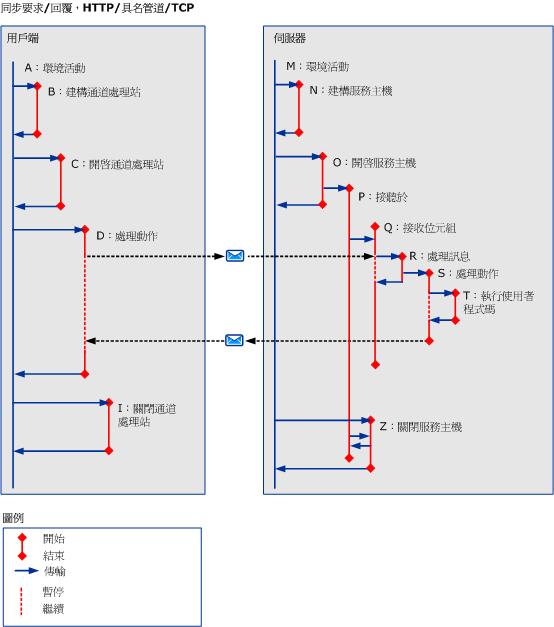

# 使用 HTTP、TCP 或具名管道的同步案例Synchronous Scenarios using HTTP, TCP or Named-Pipe
本主題將說明不同的同步要求/回覆案例中的各種活動與傳輸，以及使用 HTTP、TCP 或具名管道的單一執行緒用戶端。This topic describes the activities and transfers for different synchronous request/reply scenarios, with a single-threaded client, using HTTP, TCP or named pipe. 請參閱[使用 HTTP、 TCP 或具名管道的非同步案例](../../../../../docs/framework/wcf/diagnostics/tracing/asynchronous-scenarios-using-http-tcp-or-named-pipe.md)如需詳細資訊，在多執行緒的要求。See [Asynchronous Scenarios using HTTP, TCP, or Named-Pipe](../../../../../docs/framework/wcf/diagnostics/tracing/asynchronous-scenarios-using-http-tcp-or-named-pipe.md) for more information on multi-threaded requests.  
  
## 沒有錯誤的同步要求/回覆Synchronous Request/Reply without Errors  
 本節將說明有效的同步要求/回覆案例的各種活動和傳輸 (搭配單一執行緒用戶端)。This section describes the activities and transfers for a valid synchronous request/reply scenario, with single-threaded client.  
  
### 用戶端Client  
  
#### 建立服務端點的通訊Establishing Communication with Service Endpoint  
 用戶端已建構並開啟。A client is constructed and opened. 針對每個步驟中，環境活動 （A） 會傳送至 「 建構用戶端 」 （B） 和 「 開放式用戶端 」 （C） 活動分別。For each of these steps, the ambient activity (A) is transferred to a "Construct Client" (B) and "Open Client" (C) activity respectively. 針對每一個傳送出去的活動，在傳回一個活動之前環境活動會暫停 (亦即，直到執行 ServiceModel 程式碼為止)。For each activity being transferred to, the ambient activity is suspended until there is a transfer back, that is, until ServiceModel code is executed.  
  
#### 向服務端點提出要求Making a Request to Service Endpoint  
 環境活動會傳送到"ProcessAction"(D) 活動。The ambient activity is transferred to a "ProcessAction" (D) activity. 在此活動中，會傳送要求訊息，同時收到回應訊息。Within this activity, a request message is sent, and a response message is received. 當控制項傳回使用者程式碼時，活動會結束。The activity ends when control returns to user code. 由於這是一項同步要求，環境活動會在控制項傳回之前暫停。Because this is a synchronous request, the ambient activity suspends until control returns.  
  
#### 關閉服務端點的通訊Closing Communication with Service Endpoint  
 用戶端的關閉活動 (I) 會從環境活動中建立。The client's close activity (I) is created from the ambient activity. 這與全新及開放項目相同。This is identical to new and open.  
  
### 伺服器Server  
  
#### 設定服務主機Setting up a Service Host  
 ServiceHost 的全新與開放活動 (N 和 O) 會從環境活動 (M) 中建立。The ServiceHost’s new and open activities (N and O) are created from the ambient activity (M).  
  
 接聽項活動 (P) 是在開啟每個接聽項的 ServiceHost 時建立。A listener activity (P) is created from opening a ServiceHost for each listener. 接聽項活動會開始等候接收並處理資料。The listener activity waits to receive and process data.  
  
#### 接收網路上的資料Receiving Data on the Wire  
 當資料抵達網路時，如果它不存在 (Q) 以處理接收的資料將會建立"ReceiveBytes"活動。When data arrives on the wire, a "ReceiveBytes" activity is created if it does not already exist (Q) to process the received data. 此活動可以重複使用在同一個連線或佇列中的多個訊息上。This activity can be reused for multiple messages within a connection or queue.  
  
 如果 ReceiveBytes 活動擁有足夠的資料來構成 SOAP 動作訊息的話，就會啟動 ProcessMessage 活動 (R)。The ReceiveBytes activity launches a ProcessMessage activity (R) if it has enough data to form a SOAP action message.  
  
 在活動 R 中，訊息標頭會經過處理，並確認 activityID 標頭。In activity R, the message headers are processed, and the activityID header is verified. 如果此標頭已存在，則活動識別碼會設定為 ProcessAction 活動，否則，會建立新的識別碼。If this header is present, the activity ID is set to the ProcessAction activity; otherwise, a new ID is created.  
  
 在處理呼叫時，會建立 ProcessAction 活動 (S) 並將之傳送出去。ProcessAction activity (S) is created and being transferred to, when the call is processed. 一旦完成所有與傳入訊息相關的處理之後，此活動就會結束，包括執行使用者程式碼 (T) 並傳送回應訊息 (如果適用的話)。This activity ends when all processing related to the incoming message is completed, including executing user code (T) and sending the response message if applicable.  
  
#### 關閉服務主機Closing a Service Host  
 ServiceHost 的關閉活動 (Z) 會從環境活動中建立。The ServiceHost’s close activity (Z) is created from the ambient activity.  
  
   
  
 在\<a： 名稱 >，`A`是捷徑符號，說明上一個文字和資料表 3 中的活動。In \<A: name>, `A` is a shortcut symbol that describes the activity in the previous text and in table 3. `Name` 是活動的名稱縮寫。`Name` is a shortened name of the activity.  
  
 如果`propagateActivity` = `true`，用戶端和服務上的處理程序動作有相同的活動識別碼。If `propagateActivity`=`true`, Process Action on both the client and service have the same activity ID.  
  
## 具有錯誤的同步要求/回覆Synchronous Request/Reply with Errors  
 與先前案例的唯一不同點在於，SOAP 錯誤訊息將做為回應訊息傳回。The only difference with the previous scenario is that a SOAP fault message is returned as a response message. 如果`propagateActivity` = `true`，要求訊息的活動識別碼會加入至 SOAP 錯誤訊息。If `propagateActivity`=`true`, the activity ID of the request message is added to the SOAP fault message.  
  
## 不具有錯誤的同步單向Synchronous One-Way without Errors  
 與第一個案例的唯一不同點在於，沒有任何訊息會傳回伺服器。The only difference with the first scenario is that no message is returned to the server. 如果是以 HTTP 為基礎的通訊協定，則仍舊會將狀態 (有效或錯誤) 傳回用戶端。For HTTP-based protocols, a status (valid or error) is still returned to the client. 這是因為 HTTP 是唯一的通訊協定與要求-回應語意，是 WCF 通訊協定堆疊的一部分。This is because HTTP is the only protocol with a request-response semantics that is part of the WCF protocol stack. 由於 TCP 處理已經從 WCF 隱藏，通知會傳送至用戶端。Because TCP processing is hidden from WCF, no acknowledgement is sent to the client.  
  
## 具有錯誤的同步單向Synchronous One-Way with Errors  
 如果在處理訊息 (Q 或更多) 時發生錯誤，就不會將任何通知傳回用戶端。If an error occurs while processing the message (Q or beyond), no notification is returned to the client. 這個案例與「不具有錯誤的同步單向」案例相同。This is identical to the "Synchronous One-Way without Errors" scenario. 如果您想要收到錯誤訊息，就不應該使用單向案例。You should not use a One-Way scenario if you want to receive an error message.  
  
## 雙工Duplex  
 與先前案例的不同之處在於，用戶端會表現出服務行為並建立 ReceiveBytes 和 ProcessMessage 活動，這與非同步案例類似。The difference with the previous scenarios is that the client acts as a service, in which it creates the ReceiveBytes and ProcessMessage activities, similar to the Asynchronous scenarios.
