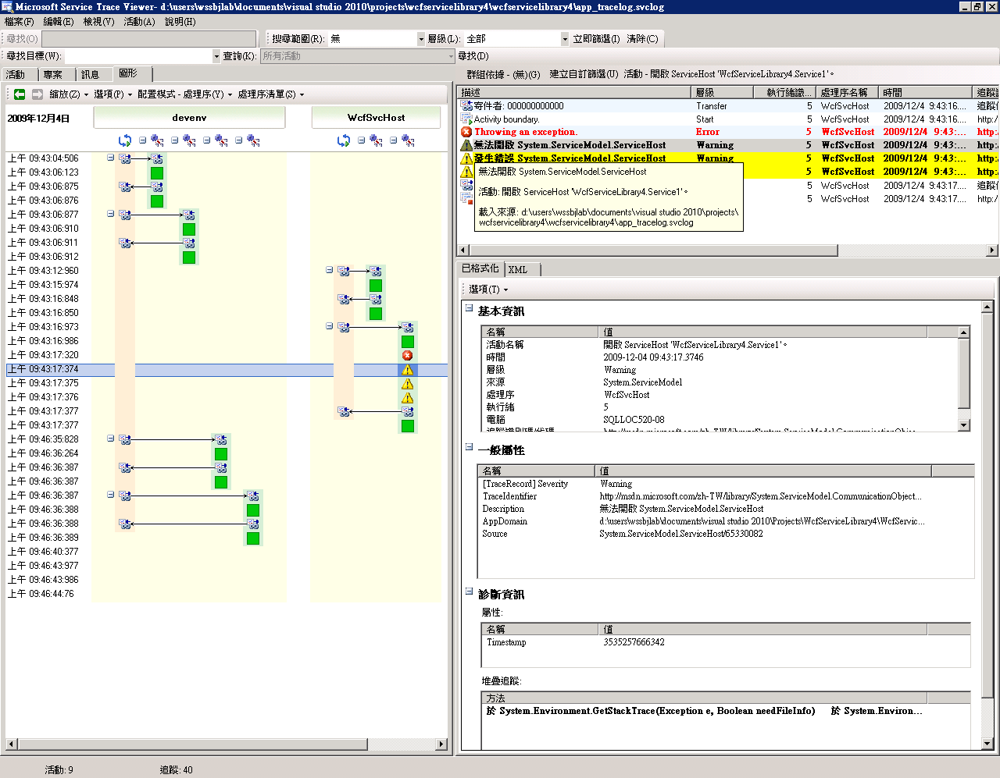

# <a name="using-service-trace-viewer-for-viewing-correlated-traces-and-troubleshooting"></a><span data-ttu-id="32ad2-102">使用服務追蹤檢視器檢視相關追蹤並進行疑難排解</span><span class="sxs-lookup"><span data-stu-id="32ad2-102">Using Service Trace Viewer for Viewing Correlated Traces and Troubleshooting</span></span>

<span data-ttu-id="32ad2-103">本主題說明追蹤資料的格式、檢視方式，以及如何使用服務追蹤檢視器來排解應用程式問題的方法。</span><span class="sxs-lookup"><span data-stu-id="32ad2-103">This topic describes the format of trace data, how to view it, and approaches that use the Service Trace Viewer to troubleshoot your application.</span></span>

## <a name="using-the-service-trace-viewer-tool"></a><span data-ttu-id="32ad2-104">使用服務追蹤檢視器工具</span><span class="sxs-lookup"><span data-stu-id="32ad2-104">Using the Service Trace Viewer Tool</span></span>

<span data-ttu-id="32ad2-105">Windows Communication Foundation (WCF) 服務追蹤檢視器工具可協助您找出錯誤的根本原因的 WCF 接聽程式所產生的診斷追蹤將相互關聯。</span><span class="sxs-lookup"><span data-stu-id="32ad2-105">The Windows Communication Foundation (WCF) Service Trace Viewer tool helps you correlate diagnostic traces produced by WCF listeners to locate the root cause of an error.</span></span> <span data-ttu-id="32ad2-106">此工具可讓您輕鬆地檢視、 群組和篩選追蹤，以便您可以診斷、 修復以及驗證與 WCF 服務的問題的方式。</span><span class="sxs-lookup"><span data-stu-id="32ad2-106">The tool gives you a way to easily view, group, and filter traces so that you can diagnose, repair and verify issues with WCF services.</span></span> <span data-ttu-id="32ad2-107">如需使用此工具的詳細資訊，請參閱[Service Trace Viewer Tool (SvcTraceViewer.exe)](../../../../../docs/framework/wcf/service-trace-viewer-tool-svctraceviewer-exe.md)。</span><span class="sxs-lookup"><span data-stu-id="32ad2-107">For more information about using this tool, see [Service Trace Viewer Tool (SvcTraceViewer.exe)](../../../../../docs/framework/wcf/service-trace-viewer-tool-svctraceviewer-exe.md).</span></span>

<span data-ttu-id="32ad2-108">本主題包含執行所產生的追蹤的螢幕擷取畫面[追蹤和訊息記錄](../../../../../docs/framework/wcf/samples/tracing-and-message-logging.md)取樣，請使用檢視時[Service Trace Viewer Tool (SvcTraceViewer.exe)](../../../../../docs/framework/wcf/service-trace-viewer-tool-svctraceviewer-exe.md)。</span><span class="sxs-lookup"><span data-stu-id="32ad2-108">This topic contains screenshots of traces generated by running the [Tracing and Message Logging](../../../../../docs/framework/wcf/samples/tracing-and-message-logging.md) sample, when viewed using the [Service Trace Viewer Tool (SvcTraceViewer.exe)](../../../../../docs/framework/wcf/service-trace-viewer-tool-svctraceviewer-exe.md).</span></span> <span data-ttu-id="32ad2-109">本主題示範如何了解追蹤內容、活動與其相互關聯性，以及在排解疑難時如何分析大量的追蹤。</span><span class="sxs-lookup"><span data-stu-id="32ad2-109">This topic demonstrates how to understand trace content, activities and their correlation, and how to analyze large numbers of traces when troubleshooting.</span></span>

## <a name="viewing-trace-content"></a><span data-ttu-id="32ad2-110">檢視追蹤內容</span><span class="sxs-lookup"><span data-stu-id="32ad2-110">Viewing Trace Content</span></span>

<span data-ttu-id="32ad2-111">追蹤事件包含下列最重要的資訊：</span><span class="sxs-lookup"><span data-stu-id="32ad2-111">A trace event contains the following most significant information:</span></span>

- <span data-ttu-id="32ad2-112">設定的活動名稱。</span><span class="sxs-lookup"><span data-stu-id="32ad2-112">Activity name when set.</span></span>

- <span data-ttu-id="32ad2-113">發出時間。</span><span class="sxs-lookup"><span data-stu-id="32ad2-113">Emission time.</span></span>

- <span data-ttu-id="32ad2-114">追蹤層級。</span><span class="sxs-lookup"><span data-stu-id="32ad2-114">Trace level.</span></span>

- <span data-ttu-id="32ad2-115">追蹤來源名稱。</span><span class="sxs-lookup"><span data-stu-id="32ad2-115">Trace source name.</span></span>

- <span data-ttu-id="32ad2-116">處理序名稱。</span><span class="sxs-lookup"><span data-stu-id="32ad2-116">Process name.</span></span>

- <span data-ttu-id="32ad2-117">執行緒 ID。</span><span class="sxs-lookup"><span data-stu-id="32ad2-117">Thread id.</span></span>

- <span data-ttu-id="32ad2-118">唯一的追蹤識別碼，也就是指向中 Microsoft 文件，您可以從該處取得追蹤的相關資訊的目的地 URL。</span><span class="sxs-lookup"><span data-stu-id="32ad2-118">A unique trace identifier, which is a URL that points to a destination in Microsoft Docs, from which you can obtain more information related to the trace.</span></span>

 <span data-ttu-id="32ad2-119">中的右上方面板位於服務追蹤檢視器中，或可以看到所有這些**的基本資訊**右下角面板，選取追蹤時的格式化檢視中的區段。</span><span class="sxs-lookup"><span data-stu-id="32ad2-119">All of these can be seen in the upper right panel in the Service Trace Viewer, or in the **Basic Information** section in the formatted view of the lower-right panel when selecting a trace.</span></span>

> [!NOTE]
> <span data-ttu-id="32ad2-120">如果用戶端和服務位於相同的電腦上，就會顯示這兩個應用程式的追蹤。</span><span class="sxs-lookup"><span data-stu-id="32ad2-120">If the client and the service are on the same machine, the traces for both applications will be present.</span></span> <span data-ttu-id="32ad2-121">這些可以使用來篩選**處理序名稱**資料行。</span><span class="sxs-lookup"><span data-stu-id="32ad2-121">These can be filtered using the **Process Name** column.</span></span>

<span data-ttu-id="32ad2-122">此外，格式化檢視同時提供追蹤的說明，以及額外的詳細資訊 (如果有的話)。</span><span class="sxs-lookup"><span data-stu-id="32ad2-122">In addition, the formatted view also provides a description for the trace and additional detailed information when available.</span></span> <span data-ttu-id="32ad2-123">後者包含例外狀況型別與訊息、呼叫堆疊、訊息動作、自/至欄位，以及其他例外狀況資訊。</span><span class="sxs-lookup"><span data-stu-id="32ad2-123">The latter can include exception type and message, call stacks, message action, from/to fields, and other exception information.</span></span>

<span data-ttu-id="32ad2-124">在 XML 檢閱中，包含下列好用的 xml 標記：</span><span class="sxs-lookup"><span data-stu-id="32ad2-124">In the XML view, useful xml tags include the following:</span></span>

- <span data-ttu-id="32ad2-125">`<SubType>` （追蹤層級）。</span><span class="sxs-lookup"><span data-stu-id="32ad2-125">`<SubType>` (trace level).</span></span>

- <span data-ttu-id="32ad2-126">`<TimeCreated>`.</span><span class="sxs-lookup"><span data-stu-id="32ad2-126">`<TimeCreated>`.</span></span>

- <span data-ttu-id="32ad2-127">`<Source>` （追蹤來源名稱）。</span><span class="sxs-lookup"><span data-stu-id="32ad2-127">`<Source>` (trace source name).</span></span>

- <span data-ttu-id="32ad2-128">`<Correlation>` （設定的活動識別碼發出追蹤時）。</span><span class="sxs-lookup"><span data-stu-id="32ad2-128">`<Correlation>` (activity id set when emitting the trace).</span></span>

- <span data-ttu-id="32ad2-129">`<Execution>` （處理序和執行緒識別碼）。</span><span class="sxs-lookup"><span data-stu-id="32ad2-129">`<Execution>` (process and thread id).</span></span>

- <span data-ttu-id="32ad2-130">`<Computer>`.</span><span class="sxs-lookup"><span data-stu-id="32ad2-130">`<Computer>`.</span></span>

- <span data-ttu-id="32ad2-131">`<ExtendedData>`其中包括`<Action>`，`<MessageID>`而`<ActivityId>`傳送訊息時，訊息標頭中設定。</span><span class="sxs-lookup"><span data-stu-id="32ad2-131">`<ExtendedData>`, including `<Action>`, `<MessageID>` and the `<ActivityId>` set in the message header when sending a message.</span></span>

<span data-ttu-id="32ad2-132">如果您檢查「已透過通道傳送訊息」追蹤，可以看到下列內容。</span><span class="sxs-lookup"><span data-stu-id="32ad2-132">If you examine the "Sent a message over a channel" trace, you may see the following content.</span></span>

```xml
<E2ETraceEvent xmlns="http://schemas.microsoft.com/2004/06/E2ETraceEvent">
   <System xmlns="http://schemas.microsoft.com/2004/06/windows/eventlog/system">
      <EventID>262163</EventID>
      <Type>3</Type>
      <SubType Name="Information">0</SubType>
      <Level>8</Level>
      <TimeCreated SystemTime="2006-08-04T18:45:30.8491051Z" />
      <Source Name="System.ServiceModel" />
       <Correlation ActivityID="{27c6331d-8998-43aa-a382-03239013a6bd}"/>
       <Execution ProcessName="client" ProcessID="1808" ThreadID="1" />
       <Channel />
       <Computer>TEST1</Computer>
   </System>
   <ApplicationData>
       <TraceData>
          <DataItem>
             <TraceRecord xmlns="http://schemas.microsoft.com/2004/10/E2ETraceEvent/TraceRecord" Severity="Information">
                 <TraceIdentifier>http://msdn.microsoft.com/library/System.ServiceModel.Channels.MessageSent.aspx</TraceIdentifier>
                 <Description>Sent a message over a channel.</Description>
                 <AppDomain>client.exe</AppDomain>
                 <Source>System.ServiceModel.Channels.ClientFramingDuplexSessionChannel/35191196</Source>
                <ExtendedData xmlns="http://schemas.microsoft.com/2006/08/ServiceModel/MessageTransmitTraceRecord">

                  <MessageProperties>
                     <AllowOutputBatching>False</AllowOutputBatching>
                  </MessageProperties>
                  <MessageHeaders>
                     <Action d4p1:mustUnderstand="1" xmlns:d4p1="http://www.w3.org/2003/05/soap-envelope" xmlns="http://www.w3.org/2005/08/addressing">http://Microsoft.ServiceModel.Samples/ICalculator/Multiply</Action>
                     <MessageID xmlns="http://www.w3.org/2005/08/addressing">urn:uuid:7c6670d8-4c9c-496e-b6a0-2ceb6db35338</MessageID>
                     <ActivityId CorrelationId="b02e2189-0816-4387-980c-dd8e306440f5" xmlns="http://schemas.microsoft.com/2004/09/ServiceModel/Diagnostics">27c6331d-8998-43aa-a382-03239013a6bd</ActivityId>
                     <ReplyTo xmlns="http://www.w3.org/2005/08/addressing">
                        <Address>http://www.w3.org/2005/08/addressing/anonymous</Address>
                    </ReplyTo>
                    <To d4p1:mustUnderstand="1" xmlns:d4p1="http://www.w3.org/2003/05/soap-envelope" xmlns="http://www.w3.org/2005/08/addressing">net.tcp://localhost/servicemodelsamples/service</To>
                  </MessageHeaders>
                  <RemoteAddress>net.tcp://localhost/servicemodelsamples/service</RemoteAddress>
                </ExtendedData>
            </TraceRecord>
          </DataItem>
       </TraceData>
   </ApplicationData>
</E2ETraceEvent>
```

## <a name="servicemodel-e2e-tracing"></a><span data-ttu-id="32ad2-133">ServiceModel E2E 追蹤</span><span class="sxs-lookup"><span data-stu-id="32ad2-133">ServiceModel E2E Tracing</span></span>

<span data-ttu-id="32ad2-134">當`System.ServiceModel`追蹤來源設定`switchValue`為關閉，而不和`ActivityTracing`，WCF 會建立活動和 WCF 處理的傳輸。</span><span class="sxs-lookup"><span data-stu-id="32ad2-134">When the `System.ServiceModel` trace source is set with a `switchValue` other than Off, and `ActivityTracing`, WCF creates activities and transfers for WCF processing.</span></span>

<span data-ttu-id="32ad2-135">活動指的是一個邏輯處理單元，可將所有與該處理單元相關的追蹤群組在一起。</span><span class="sxs-lookup"><span data-stu-id="32ad2-135">An activity is a logical unit of processing that groups all traces related to that processing unit.</span></span> <span data-ttu-id="32ad2-136">例如，您可以為每一個要求定義一個活動。</span><span class="sxs-lookup"><span data-stu-id="32ad2-136">For example, you can define one activity for each request.</span></span> <span data-ttu-id="32ad2-137">傳輸會在端點的活動之間建立因果關係。</span><span class="sxs-lookup"><span data-stu-id="32ad2-137">Transfers create a causal relationship between activities within endpoints.</span></span> <span data-ttu-id="32ad2-138">傳播活動識別碼可讓您關聯端點之間的活動。</span><span class="sxs-lookup"><span data-stu-id="32ad2-138">Propagating the activity ID enables you to relate activities across endpoints.</span></span> <span data-ttu-id="32ad2-139">這可以藉由設定`propagateActivity` = `true`在每個端點的組態中。</span><span class="sxs-lookup"><span data-stu-id="32ad2-139">This can be done by setting `propagateActivity`=`true` in configuration at every endpoint.</span></span> <span data-ttu-id="32ad2-140">活動、傳輸與傳播可讓您執行錯誤關聯。</span><span class="sxs-lookup"><span data-stu-id="32ad2-140">Activities, transfers, and propagation allow you to perform error correlation.</span></span> <span data-ttu-id="32ad2-141">如此一來，就可以更迅速地找到錯誤的根本原因。</span><span class="sxs-lookup"><span data-stu-id="32ad2-141">In this way, you can find the root cause of an error more quickly.</span></span>

<span data-ttu-id="32ad2-142">在用戶端，一個 WCF 活動建立每個物件模型呼叫 （例如，開啟 ChannelFactory、 新增、 分割等等。）每個作業呼叫會處理 「 處理動作 」 活動。</span><span class="sxs-lookup"><span data-stu-id="32ad2-142">On the client, one WCF activity is created for each object model call (for example, Open ChannelFactory, Add, Divide, and so on.) Each of the operation calls is processed in a "Process Action" activity.</span></span>

<span data-ttu-id="32ad2-143">在下列螢幕擷取畫面取自[追蹤和訊息記錄](../../../../../docs/framework/wcf/samples/tracing-and-message-logging.md)範例左面板會顯示在用戶端處理序，以建立時間排序中建立的活動清單。</span><span class="sxs-lookup"><span data-stu-id="32ad2-143">In the following screenshot, extracted from the [Tracing and Message Logging](../../../../../docs/framework/wcf/samples/tracing-and-message-logging.md) sample the left panel displays the list of activities created in the client process, sorted by creation time.</span></span> <span data-ttu-id="32ad2-144">下列為依時間順序排列的活動清單：</span><span class="sxs-lookup"><span data-stu-id="32ad2-144">The following is a chronological list of activities:</span></span>

- <span data-ttu-id="32ad2-145">已建構通道處理站 (ClientBase)。</span><span class="sxs-lookup"><span data-stu-id="32ad2-145">Constructed the channel factory (ClientBase).</span></span>

- <span data-ttu-id="32ad2-146">已開啟通道處理站。</span><span class="sxs-lookup"><span data-stu-id="32ad2-146">Opened the channel factory.</span></span>

- <span data-ttu-id="32ad2-147">已處理 [新增] 動作。</span><span class="sxs-lookup"><span data-stu-id="32ad2-147">Processed the Add action.</span></span>

- <span data-ttu-id="32ad2-148">設定安全工作階段 （第一次要求時發生） 和已處理的三個安全性基礎結構回應訊息：RST、 RSTR、 SCT （處理程序訊息 1、 2、 3）。</span><span class="sxs-lookup"><span data-stu-id="32ad2-148">Set up the Secure Session (this OCCURRED on the first request) and processed three security infrastructure response messages: RST, RSTR, SCT (Process message 1, 2, 3).</span></span>

- <span data-ttu-id="32ad2-149">已處理「減去」、「相乘」，和「除以」要求。</span><span class="sxs-lookup"><span data-stu-id="32ad2-149">Processed the Subtract, Multiply, and Divide requests.</span></span>

- <span data-ttu-id="32ad2-150">已關閉通道處理站，而且這麼做導致關閉了安全工作階段並處理安全性訊息回應 (取消)。</span><span class="sxs-lookup"><span data-stu-id="32ad2-150">Closed the channel factory, and doing so closed the Secure session and processed the security message response Cancel.</span></span>

 <span data-ttu-id="32ad2-151">由於 wsHttpBinding 的緣故，讓我們看到了安全性基礎結構訊息。</span><span class="sxs-lookup"><span data-stu-id="32ad2-151">We see the security infrastructure messages because of the wsHttpBinding.</span></span>

> [!NOTE]
> <span data-ttu-id="32ad2-152">在 WCF 中，我們會顯示在個別的活動 （處理程序訊息） 中一開始要處理的回應訊息相關聯對應處理動作 」 活動，其中包含要求訊息時，透過傳輸之前。</span><span class="sxs-lookup"><span data-stu-id="32ad2-152">In WCF, we show response messages being processed initially in a separate activity (Process message) before we correlate them to the corresponding Process Action activity that includes the request message, through a transfer.</span></span> <span data-ttu-id="32ad2-153">這種情況會在基礎結構訊息與非同步要求期間發生，而且是因為我們必須檢查訊息、讀取 activityId 標頭，並使用該識別碼來識別現有的「處理動作」活動以便加以關聯時所致。</span><span class="sxs-lookup"><span data-stu-id="32ad2-153">This happens for infrastructure messages and asynchronous requests and is due to the fact that we must inspect the message, read the activityId header, and identify the existing Process Action activity with that id to correlate to it.</span></span> <span data-ttu-id="32ad2-154">如果是同步要求，我們會封鎖回應，因此會知道回應所關聯的「處理動作」是哪一個。</span><span class="sxs-lookup"><span data-stu-id="32ad2-154">For synchronous requests, we are blocking for the response and hence know which Process action the response relates to.</span></span>

<span data-ttu-id="32ad2-155">下圖顯示建立時間 （左面板） 及其巢狀的活動與追蹤 （右上角面板） 所列出的 WCF 用戶端活動：</span><span class="sxs-lookup"><span data-stu-id="32ad2-155">The following image shows WCF client activities listed by creation time (left panel) and their nested activities and traces (upper right panel):</span></span>


<span data-ttu-id="32ad2-157">當您選取左面板上的活動時，可以看到巢狀活動與追蹤出現在右上方面板中。</span><span class="sxs-lookup"><span data-stu-id="32ad2-157">When we select an activity in the left panel, we can see nested activities and traces on the upper right panel.</span></span> <span data-ttu-id="32ad2-158">因此，左側的活動清單是依據選取的上層活動產生的精簡版階層架構檢視。</span><span class="sxs-lookup"><span data-stu-id="32ad2-158">Therefore, this is a reduced hierarchical view of the list of activities on the left, based on the selected parent activity.</span></span> <span data-ttu-id="32ad2-159">由於選取的「處理動作」(新增) 是第一個要求，此活動包含了「設定安全工作階段」活動 (傳輸目的地、回傳來源)，以及 [新增] 動作的實際處理追蹤。</span><span class="sxs-lookup"><span data-stu-id="32ad2-159">Because the selected Process action Add is the first request made, this activity contains the Set Up Secure Session activity (transfer to, transfer back from), and traces for the actual processing of the Add action.</span></span>

<span data-ttu-id="32ad2-160">如果我們連按兩下左面板中加入活動的 「 處理動作，我們可以看到新增的相關用戶端 WCF 活動的圖形表示法。</span><span class="sxs-lookup"><span data-stu-id="32ad2-160">If we double click the Process action Add activity in the left panel, we can see a graphical representation of the client WCF activities related to Add.</span></span> <span data-ttu-id="32ad2-161">左側的第一個活動為根活動 (0000)，也是預設活動。</span><span class="sxs-lookup"><span data-stu-id="32ad2-161">The first activity on the left is the root activity (0000), which is the default activity.</span></span> <span data-ttu-id="32ad2-162">WCF 傳輸，從環境活動。</span><span class="sxs-lookup"><span data-stu-id="32ad2-162">WCF transfers out of the ambient activity.</span></span> <span data-ttu-id="32ad2-163">如果未定義，WCF 會傳出 0000 傳輸。</span><span class="sxs-lookup"><span data-stu-id="32ad2-163">If this is not defined, WCF transfers out of 0000.</span></span> <span data-ttu-id="32ad2-164">此處的第二個活動「處理動作」(新增) 則會傳出 0。</span><span class="sxs-lookup"><span data-stu-id="32ad2-164">Here, the second activity, Process Action Add, transfers out of 0.</span></span> <span data-ttu-id="32ad2-165">接著，我們會看到「設定安全工作階段」。</span><span class="sxs-lookup"><span data-stu-id="32ad2-165">Then we see Setup Secure Session.</span></span>

<span data-ttu-id="32ad2-166">下圖顯示圖表檢視的 WCF 用戶端活動，尤其是環境活動 (此處為 0)，處理動作，並設定安全工作階段：</span><span class="sxs-lookup"><span data-stu-id="32ad2-166">The following image shows a graph view of WCF client activities, specifically Ambient Activity (here 0), Process action, and Set Up Secure Session:</span></span>


<span data-ttu-id="32ad2-168">在右上角面板中，我們可以看到所有與「處理動作」(新增活動) 相關的追蹤。</span><span class="sxs-lookup"><span data-stu-id="32ad2-168">On the upper right panel, we can see all traces related to the Process Action Add activity.</span></span> <span data-ttu-id="32ad2-169">具體來說，我們已將要求訊息 (「已透過通道傳送訊息」) 傳送出去，並在相同的活動中接收了回應 (「已透過通道接收訊息」)。</span><span class="sxs-lookup"><span data-stu-id="32ad2-169">Specifically, we have sent the request message ("Sent a message over a channel") and received the response ("Received a message over a channel") in the same activity.</span></span> <span data-ttu-id="32ad2-170">下圖將顯示此做法。</span><span class="sxs-lookup"><span data-stu-id="32ad2-170">This is shown in the following graph.</span></span> <span data-ttu-id="32ad2-171">為求簡單扼要，「設定安全工作階段」活動將於圖形中摺疊起來。</span><span class="sxs-lookup"><span data-stu-id="32ad2-171">For clarity, the Set up Secure Session activity is collapsed in the graph.</span></span>

<span data-ttu-id="32ad2-172">下圖顯示一份 「 處理動作 」 活動的追蹤。</span><span class="sxs-lookup"><span data-stu-id="32ad2-172">The following image shows a list of traces for the Process Action activity.</span></span> <span data-ttu-id="32ad2-173">我們會傳送要求，並接收回應相同的活動。</span><span class="sxs-lookup"><span data-stu-id="32ad2-173">We send the request and receive the response in the same activity.</span></span>


<span data-ttu-id="32ad2-175">在這裡，我們載入用戶端追蹤，只是為了清楚起見，但服務追蹤 （收到的要求訊息和傳送回應訊息） 會出現在相同的活動，如果他們也會在工具中載入並`propagateActivity`已設為`true.`這更新的圖所示。</span><span class="sxs-lookup"><span data-stu-id="32ad2-175">Here, we load client traces only for clarity, but service traces (request message received and response message sent) appear in the same activity if they are also loaded in the tool and `propagateActivity` was set to `true.` This is shown in a later illustration.</span></span>

<span data-ttu-id="32ad2-176">在服務中，活動模型會對應至 WCF 的概念，如下所示：</span><span class="sxs-lookup"><span data-stu-id="32ad2-176">On the service, the activity model maps to the WCF concepts as follows:</span></span>

1. <span data-ttu-id="32ad2-177">我們會建構並開啟 ServiceHost (可能會因此建立好幾個與主機相關的活動，例如，在安全性案例中)。</span><span class="sxs-lookup"><span data-stu-id="32ad2-177">We construct and open a ServiceHost (this may create several host-related activities, for instance, in the case of security).</span></span>

2. <span data-ttu-id="32ad2-178">我們會針對 ServiceHost 中的每個接聽項建立一個「接聽」活動 (包含「開啟 ServiceHost」的傳入與傳出)。</span><span class="sxs-lookup"><span data-stu-id="32ad2-178">We create a Listen At activity for each listener in the ServiceHost (with transfers in and out of Open ServiceHost).</span></span>

3. <span data-ttu-id="32ad2-179">當接聽程式偵測到用戶端起始的通訊要求時，它所傳輸到 「 接收位元組 」 活動，以處理從用戶端傳送的所有位元組。</span><span class="sxs-lookup"><span data-stu-id="32ad2-179">When the listener detects a communication request initiated by the client, it transfers to a "Receive Bytes" activity, in which all bytes sent from the client are processed.</span></span> <span data-ttu-id="32ad2-180">在此活動中，我們可以看到在用戶端服務互動期間所發生所有連線錯誤。</span><span class="sxs-lookup"><span data-stu-id="32ad2-180">In this activity, we can see any connection errors that have happened during the client-service interaction.</span></span>

4. <span data-ttu-id="32ad2-181">每一組對應至訊息的已接收位元組，我們處理這些位元組在 「 處理程序訊息 」 活動中，我們用來建立 WCF Message 物件。</span><span class="sxs-lookup"><span data-stu-id="32ad2-181">For each set of bytes that is received that corresponds to a message, we process these bytes in a "Process Message" activity, where we create the WCF Message object.</span></span> <span data-ttu-id="32ad2-182">在此活動中，我們可以看到因為信封不良或格式錯誤的訊息而發生的錯誤</span><span class="sxs-lookup"><span data-stu-id="32ad2-182">In this activity, we see errors related to a bad envelope or a malformed message.</span></span>

5. <span data-ttu-id="32ad2-183">一旦訊息形成，我們就可以傳輸至「處理動作」活動。</span><span class="sxs-lookup"><span data-stu-id="32ad2-183">Once the message is formed, we transfer to a Process Action activity.</span></span> <span data-ttu-id="32ad2-184">如果用戶端與服務上的 `propagateActivity` 同時設為 `true`，則此活動將與用戶端上所定義的活動具有相同的識別碼，如先前所述。</span><span class="sxs-lookup"><span data-stu-id="32ad2-184">If `propagateActivity` is set to `true` on both the client and service, this activity has the same id as the one defined in the client, and described previously.</span></span> <span data-ttu-id="32ad2-185">從這個階段我們開始受益於直接的相互關聯到端點，因為所有發出的追蹤中 WCF 與要求相關的是位於相同的活動，包括處理回應訊息。</span><span class="sxs-lookup"><span data-stu-id="32ad2-185">From this stage we start to benefit from direct correlation across endpoints, because all traces emitted in WCF that are related to the request are in that same activity, including the response message processing.</span></span>

6. <span data-ttu-id="32ad2-186">跨處理序動作，我們會建立 「 執行使用者程式碼 」 活動，以隔離使用者程式碼，在 WCF 中所發出的追蹤。</span><span class="sxs-lookup"><span data-stu-id="32ad2-186">For out-of-process action, we create an "Execute user code" activity to isolate traces emitted in user code from the ones emitted in WCF.</span></span> <span data-ttu-id="32ad2-187">在上述範例中，「 服務會傳送新增回應 」 追蹤，就會發出 「 執行使用者程式碼 」 活動不會在用戶端傳播的活動中的話。</span><span class="sxs-lookup"><span data-stu-id="32ad2-187">In the preceding example, the "Service sends Add response" trace is emitted in the "Execute User code" activity not in the activity propagated by the client, if applicable.</span></span>

<span data-ttu-id="32ad2-188">在下列圖示中，左側的第一個活動為根活動 (0000)，也是預設活動。</span><span class="sxs-lookup"><span data-stu-id="32ad2-188">In the illustration that follows, the first activity on the left is the root activity (0000), which is the default activity.</span></span> <span data-ttu-id="32ad2-189">後續的三個活動都是用來開啟 ServiceHost。</span><span class="sxs-lookup"><span data-stu-id="32ad2-189">The next three activities are to open the ServiceHost.</span></span> <span data-ttu-id="32ad2-190">欄 5 的活動為接聽項，而剩餘的活動 (6 至 8) 說明了從位元組處理到使用者程式碼啟動的 WCF 訊息處理。</span><span class="sxs-lookup"><span data-stu-id="32ad2-190">The activity in column 5 is the listener, and the remaining activities (6 to 8) describe the WCF processing of a message, from bytes processing to user code activation.</span></span>

<span data-ttu-id="32ad2-191">下圖顯示 WCF 服務活動的圖形檢視：</span><span class="sxs-lookup"><span data-stu-id="32ad2-191">The following image shows a graph view of WCF service activities:</span></span>


<span data-ttu-id="32ad2-193">下列螢幕擷取畫面同時說明用戶端與服務的活動，並強調處理序之間的「處理動作」(新增活動) (橘色)。</span><span class="sxs-lookup"><span data-stu-id="32ad2-193">The following screenshot shows the activities for both the client and service, and highlights the Process Action Add activity across processes (orange).</span></span> <span data-ttu-id="32ad2-194">箭頭將把用戶端與服務所傳送與接收的要求與回應訊息關聯起來。</span><span class="sxs-lookup"><span data-stu-id="32ad2-194">Arrows relate the request and response messages sent and received by the client and service.</span></span> <span data-ttu-id="32ad2-195">圖表中的「處理動作」追蹤將按照處理序來分門別類，但是將於右上角面板中顯示為相同活動的一部份。</span><span class="sxs-lookup"><span data-stu-id="32ad2-195">The traces of Process Action are separated across processes in the graph, but shown as part of the same activity in the upper-right panel.</span></span> <span data-ttu-id="32ad2-196">在此面板中，我們可以看到傳送訊息的用戶端追蹤，後面接著已接收及已處理訊息的服務追蹤。</span><span class="sxs-lookup"><span data-stu-id="32ad2-196">In this panel, we can see client traces for sent messages followed by service traces for received and processed messages.</span></span>

<span data-ttu-id="32ad2-197">下圖顯示這兩個 WCF 用戶端與服務活動的圖形檢視</span><span class="sxs-lookup"><span data-stu-id="32ad2-197">The following images shows a graph view of both WCF client and service activities</span></span>


<span data-ttu-id="32ad2-199">在下列錯誤案例中，位於服務與用戶端上的錯誤與警告追蹤將相互關聯。</span><span class="sxs-lookup"><span data-stu-id="32ad2-199">In the following error scenario, error and warning traces at the service and client are related.</span></span> <span data-ttu-id="32ad2-200">服務中的使用者程式碼將首先擲回例外狀況 (最右側的綠色活動包含「服務無法透過使用者程式碼來處理此要求」例外狀況的警告追蹤)。</span><span class="sxs-lookup"><span data-stu-id="32ad2-200">An exception is first thrown in user code on the service (right-most green activity that includes a warning trace for the exception "The service cannot process this request in user code.").</span></span> <span data-ttu-id="32ad2-201">當回應傳送至用戶端時，會再一次發出警告追蹤以表示錯誤訊息 (左側的粉紅色活動)。</span><span class="sxs-lookup"><span data-stu-id="32ad2-201">When the response is sent to the client, a warning trace is again emitted to denote the fault message (left pink activity).</span></span> <span data-ttu-id="32ad2-202">接著，用戶端會關閉自己的 WCF 用戶端 (左下角的黃色活動)，以中止服務連線。</span><span class="sxs-lookup"><span data-stu-id="32ad2-202">The client then closes its WCF client (yellow activity on the lower-left side), which aborts the connection to the service.</span></span> <span data-ttu-id="32ad2-203">服務會擲回錯誤 (右側最長的粉紅色活動)。</span><span class="sxs-lookup"><span data-stu-id="32ad2-203">The service throws an error (longest pink activity on the right).</span></span>

<span data-ttu-id="32ad2-204"></span><span class="sxs-lookup"><span data-stu-id="32ad2-204"></span></span>

<span data-ttu-id="32ad2-205">服務與用戶端之間的錯誤關聯</span><span class="sxs-lookup"><span data-stu-id="32ad2-205">Error correlation across the service and client</span></span>

<span data-ttu-id="32ad2-206">用來產生這些追蹤的範例是一系列使用 wsHttpBinding 的同步要求。</span><span class="sxs-lookup"><span data-stu-id="32ad2-206">The sample used to generate these traces is a series of synchronous requests using the wsHttpBinding.</span></span> <span data-ttu-id="32ad2-207">在此圖中，不具有安全性或是具有非同步要求的案例中會有一些誤差，其中「處理動作」活動涵蓋了構成非同步呼叫的開始與結束作業，並顯示回呼活動的傳輸。</span><span class="sxs-lookup"><span data-stu-id="32ad2-207">There are deviations from this graph for scenarios without security, or with asynchronous requests, where the Process Action activity encompasses the begin and end operations that constitute the asynchronous call, and shows transfers to a callback activity.</span></span> <span data-ttu-id="32ad2-208">如需其他案例的詳細資訊，請參閱[端對端追蹤案例](../../../../../docs/framework/wcf/diagnostics/tracing/end-to-end-tracing-scenarios.md)。</span><span class="sxs-lookup"><span data-stu-id="32ad2-208">For more information about additional scenarios, see [End-To-End Tracing Scenarios](../../../../../docs/framework/wcf/diagnostics/tracing/end-to-end-tracing-scenarios.md).</span></span>

## <a name="troubleshooting-using-the-service-trace-viewer"></a><span data-ttu-id="32ad2-209">使用服務追蹤檢視器來排解疑難</span><span class="sxs-lookup"><span data-stu-id="32ad2-209">Troubleshooting Using the Service Trace Viewer</span></span>

<span data-ttu-id="32ad2-210">當您使用服務追蹤檢視器工具來載入追蹤檔案，可以在左面板中選取任何一項紅色或黃色活動，以便追蹤應用程式的問題成因。</span><span class="sxs-lookup"><span data-stu-id="32ad2-210">When you load trace files in the Service Trace Viewer Tool, you can select any red or yellow activity on the left panel to track down the cause of a problem in your application.</span></span> <span data-ttu-id="32ad2-211">一般來說，000 活動具有能夠反昇至使用者的未處理例外狀況。</span><span class="sxs-lookup"><span data-stu-id="32ad2-211">The 000 activity typically has unhandled exceptions that bubble up to the user.</span></span>

<span data-ttu-id="32ad2-212">下圖顯示如何選取紅色或黃色活動以找出問題的根目錄。</span><span class="sxs-lookup"><span data-stu-id="32ad2-212">The following image shows how to select a red or yellow activity to locate the root of a problem.</span></span>
<span data-ttu-id="32ad2-213"></span><span class="sxs-lookup"><span data-stu-id="32ad2-213"></span></span>

<span data-ttu-id="32ad2-214">您可以透過右上角面板，檢查您於左面板中選取的活動追蹤。</span><span class="sxs-lookup"><span data-stu-id="32ad2-214">On the upper right panel, you can examine traces for the activity you selected on the left.</span></span> <span data-ttu-id="32ad2-215">接著，您可以檢查該面板中的紅色或黃色追蹤，並檢視它們之間的相互關係。</span><span class="sxs-lookup"><span data-stu-id="32ad2-215">You can then examine red or yellow traces in that panel and see how they are correlated.</span></span> <span data-ttu-id="32ad2-216">在上一個圖形中，我們在同一個「處理動作」活動中同時看到用戶端與服務的警告追蹤。</span><span class="sxs-lookup"><span data-stu-id="32ad2-216">In the preceding graph, we see warning traces both for the client and service in the same Process Action activity.</span></span>

<span data-ttu-id="32ad2-217">如果這些追蹤並未提供您錯誤的根本原因，可以連按兩下左面板中的選取活動 (此處為「處理動作」) 來使用圖形。</span><span class="sxs-lookup"><span data-stu-id="32ad2-217">If these traces do not provide you with the root cause of the error, you can utilize the graph by double-clicking the selected activity on the left panel (here Process action).</span></span> <span data-ttu-id="32ad2-218">這時會顯示具有相關活動的圖形。</span><span class="sxs-lookup"><span data-stu-id="32ad2-218">The graph with related activities is then displayed.</span></span> <span data-ttu-id="32ad2-219">您接著可以擴充相關的活動 （藉由按一下"+"號） 來尋找紅色或黃色標示相關的活動中的第一個發出的追蹤。</span><span class="sxs-lookup"><span data-stu-id="32ad2-219">You can then expand related activities (by clicking the "+" signs) to find the first emitted trace in red or yellow in a related activity.</span></span> <span data-ttu-id="32ad2-220">針對您感興趣的紅色或黃色追蹤，從頭展開這些追蹤之前的所有活動，並接著展開相關活動的傳輸或端點之間的訊息流，直到您找到問題的根本原因為止。</span><span class="sxs-lookup"><span data-stu-id="32ad2-220">Keep expanding the activities that happened just before the red or yellow trace of interest, following transfers to related activities or message flows across endpoints, until you track the root cause of the problem.</span></span>

<span data-ttu-id="32ad2-221"></span><span class="sxs-lookup"><span data-stu-id="32ad2-221"></span></span>

<span data-ttu-id="32ad2-222">展開活動來追蹤問題的根本原因</span><span class="sxs-lookup"><span data-stu-id="32ad2-222">Expanding activities to track the root cause of a problem</span></span>

<span data-ttu-id="32ad2-223">如果 ServiceModel `ActivityTracing` 已關閉，但是 ServiceModel 追蹤卻開啟，則您可以看到 0000 活動所發出的 ServiceModel 追蹤。</span><span class="sxs-lookup"><span data-stu-id="32ad2-223">If ServiceModel `ActivityTracing` is off but ServiceModel tracing is on, you can see ServiceModel traces emitted in the 0000 activity.</span></span> <span data-ttu-id="32ad2-224">然而，您需要加倍努力來了解這些追蹤的相互關係。</span><span class="sxs-lookup"><span data-stu-id="32ad2-224">However, this requires more effort to understand the correlation of these traces.</span></span>

<span data-ttu-id="32ad2-225">如果已啟用訊息記錄，則您可以透過 [訊息] 索引標籤來檢視會受到錯誤影響的訊息。</span><span class="sxs-lookup"><span data-stu-id="32ad2-225">If Message Logging is enabled, you can use the Message Tab to see which message is impacted by the error.</span></span> <span data-ttu-id="32ad2-226">您只要連按兩下紅色或黃色訊息，就可以看到相關活動的圖形檢視。</span><span class="sxs-lookup"><span data-stu-id="32ad2-226">By double-clicking a message in red or yellow, you can see the graph view of the related activities.</span></span> <span data-ttu-id="32ad2-227">這些活動即是與發生錯誤之原始要求最相關的活動。</span><span class="sxs-lookup"><span data-stu-id="32ad2-227">These activities are the ones most closely related to the request where an error happened.</span></span>


<span data-ttu-id="32ad2-229">若要開始疑難排解，您也可以挑選紅色或黃色訊息追蹤，並按兩下來追蹤根本原因。</span><span class="sxs-lookup"><span data-stu-id="32ad2-229">To start troubleshooting, you can also pick a red or yellow message trace and double click it to track the root cause.</span></span>

## <a name="see-also"></a><span data-ttu-id="32ad2-230">另請參閱</span><span class="sxs-lookup"><span data-stu-id="32ad2-230">See also</span></span>

- [<span data-ttu-id="32ad2-231">端對端追蹤案例</span><span class="sxs-lookup"><span data-stu-id="32ad2-231">End-To-End Tracing Scenarios</span></span>](../../../../../docs/framework/wcf/diagnostics/tracing/end-to-end-tracing-scenarios.md)
- [<span data-ttu-id="32ad2-232">服務追蹤檢視器工具 (SvcTraceViewer.exe)</span><span class="sxs-lookup"><span data-stu-id="32ad2-232">Service Trace Viewer Tool (SvcTraceViewer.exe)</span></span>](../../../../../docs/framework/wcf/service-trace-viewer-tool-svctraceviewer-exe.md)
- [<span data-ttu-id="32ad2-233">追蹤</span><span class="sxs-lookup"><span data-stu-id="32ad2-233">Tracing</span></span>](../../../../../docs/framework/wcf/diagnostics/tracing/index.md)
