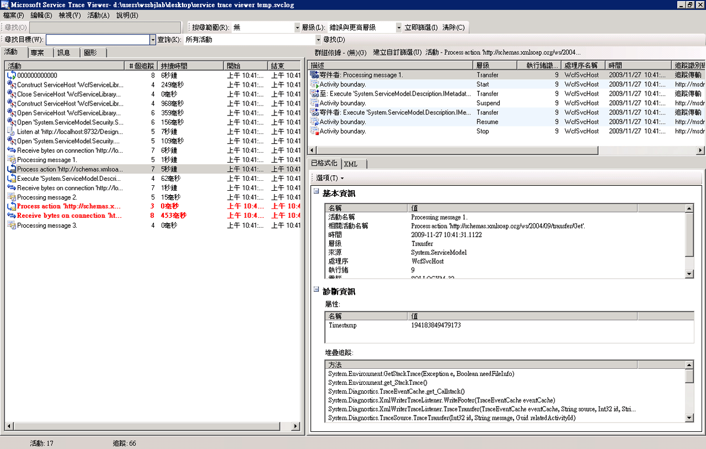
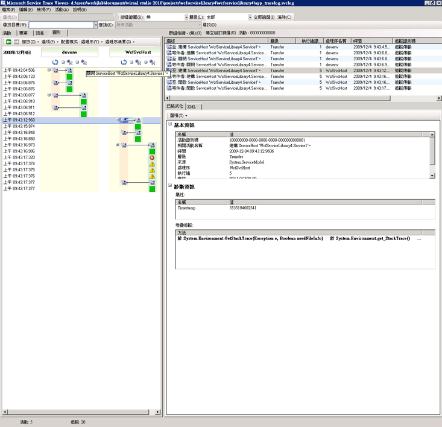
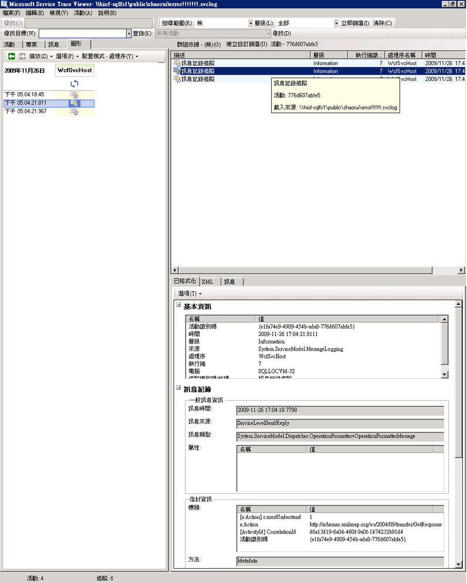
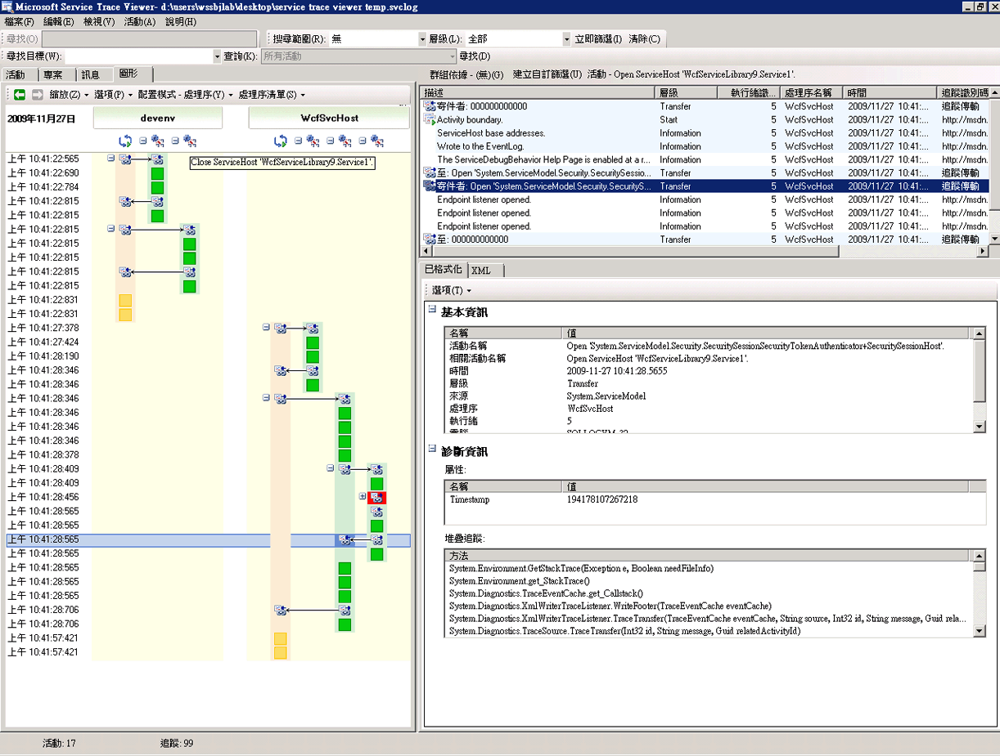
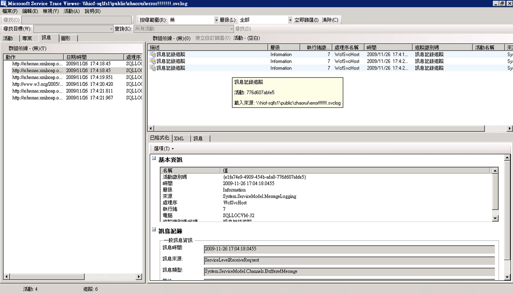

# <a name="using-service-trace-viewer-for-viewing-correlated-traces-and-troubleshooting"></a>使用服務追蹤檢視器檢視相關追蹤並進行疑難排解
本主題說明追蹤資料的格式、檢視方式，以及如何使用服務追蹤檢視器來排解應用程式問題的方法。  
  
## <a name="using-the-service-trace-viewer-tool"></a>使用服務追蹤檢視器工具  
 Windows Communication Foundation (WCF) 服務追蹤檢視器工具可協助您診斷 WCF 接聽程式，以找出錯誤的根本原因所產生的追蹤相互關聯。 此工具可讓您輕鬆地檢視、 群組和篩選追蹤，以便您可以診斷、 修復與驗證問題與 WCF 服務的方式。 如需有關使用此工具的詳細資訊，請參閱[服務追蹤檢視器工具 (SvcTraceViewer.exe)](../../../../../docs/framework/wcf/service-trace-viewer-tool-svctraceviewer-exe.md)。  
  
 本主題包含執行所產生的追蹤的螢幕擷取畫面[追蹤和訊息記錄](../../../../../docs/framework/wcf/samples/tracing-and-message-logging.md)取樣，請使用檢視時[服務追蹤檢視器工具 (SvcTraceViewer.exe)](../../../../../docs/framework/wcf/service-trace-viewer-tool-svctraceviewer-exe.md)。 本主題示範如何了解追蹤內容、活動與其相互關聯性，以及在排解疑難時如何分析大量的追蹤。  
  
## <a name="viewing-trace-content"></a>檢視追蹤內容  
 追蹤事件包含下列最重要的資訊：  
  
-   設定的活動名稱。  
  
-   發出時間。  
  
-   追蹤層級。  
  
-   追蹤來源名稱。  
  
-   處理序名稱。  
  
-   執行緒 ID。  
  
-   唯一的追蹤識別碼，指向 Microsoft 文件，您可以從中取得追蹤的相關資訊的目的地 url。  
  
 右上角面板在服務追蹤檢視器，或在中可以看到所有的這些**基本資訊**> 一節中的格式化檢視之右下角面板，選取追蹤時。  
  
> [!NOTE]
>  如果用戶端和服務位於相同的電腦上，就會顯示這兩個應用程式的追蹤。 這些可以篩選使用**處理序名稱**資料行。  
  
 此外，格式化檢視同時提供追蹤的說明，以及額外的詳細資訊 (如果有的話)。 後者包含例外狀況型別與訊息、呼叫堆疊、訊息動作、自/至欄位，以及其他例外狀況資訊。  
  
 在 XML 檢閱中，包含下列好用的 xml 標記：  
  
-   \<子類型 > （追蹤層級）。  
  
-   \<TimeCreated >。  
  
-   \<來源 > （追蹤來源名稱）。  
  
-   \<相互關聯 > （發出追蹤時所設定的活動識別碼）。  
  
-   \<執行 > （處理序和執行緒識別碼）。  
  
-   \<電腦 >。  
  
-   \<X >，包括\<動作 >， \<MessageID > 而\<ActivityId > 傳送郵件時，在訊息標頭中設定。  
  
 如果您檢查「已透過通道傳送訊息」追蹤，可以看到下列內容。  
  
```xml  
<E2ETraceEvent xmlns="http://schemas.microsoft.com/2004/06/E2ETraceEvent">  
   <System xmlns="http://schemas.microsoft.com/2004/06/windows/eventlog/system">  
      <EventID>262163</EventID>  
      <Type>3</Type>  
      <SubType Name="Information">0</SubType>  
      <Level>8</Level>  
      <TimeCreated SystemTime="2006-08-04T18:45:30.8491051Z" />  
      <Source Name="System.ServiceModel" />  
       <Correlation ActivityID="{27c6331d-8998-43aa-a382-03239013a6bd}"/>  
       <Execution ProcessName="client" ProcessID="1808" ThreadID="1" />  
       <Channel />  
       <Computer>TEST1</Computer>  
   </System>  
   <ApplicationData>  
       <TraceData>  
          <DataItem>  
             <TraceRecord xmlns="http://schemas.microsoft.com/2004/10/E2ETraceEvent/TraceRecord" Severity="Information">  
                 <TraceIdentifier>http://msdn.microsoft.com/library/System.ServiceModel.Channels.MessageSent.aspx</TraceIdentifier>  
                 <Description>Sent a message over a channel.</Description>  
                 <AppDomain>client.exe</AppDomain>  
                 <Source>System.ServiceModel.Channels.ClientFramingDuplexSessionChannel/35191196</Source>  
                <ExtendedData xmlns="http://schemas.microsoft.com/2006/08/ServiceModel/MessageTransmitTraceRecord">  
  
                  <MessageProperties>  
                     <AllowOutputBatching>False</AllowOutputBatching>  
                  </MessageProperties>  
                  <MessageHeaders>  
                     <Action d4p1:mustUnderstand="1" xmlns:d4p1="http://www.w3.org/2003/05/soap-envelope" xmlns="http://www.w3.org/2005/08/addressing">http://Microsoft.ServiceModel.Samples/ICalculator/Multiply</Action>  
                     <MessageID xmlns="http://www.w3.org/2005/08/addressing">urn:uuid:7c6670d8-4c9c-496e-b6a0-2ceb6db35338</MessageID>  
                     <ActivityId CorrelationId="b02e2189-0816-4387-980c-dd8e306440f5" xmlns="http://schemas.microsoft.com/2004/09/ServiceModel/Diagnostics">27c6331d-8998-43aa-a382-03239013a6bd</ActivityId>  
                     <ReplyTo xmlns="http://www.w3.org/2005/08/addressing">  
                        <Address>http://www.w3.org/2005/08/addressing/anonymous</Address>  
                    </ReplyTo>  
                    <To d4p1:mustUnderstand="1" xmlns:d4p1="http://www.w3.org/2003/05/soap-envelope" xmlns="http://www.w3.org/2005/08/addressing">net.tcp://localhost/servicemodelsamples/service</To>  
                  </MessageHeaders>  
                  <RemoteAddress>net.tcp://localhost/servicemodelsamples/service</RemoteAddress>  
                </ExtendedData>  
            </TraceRecord>  
          </DataItem>  
       </TraceData>  
   </ApplicationData>  
</E2ETraceEvent>  
```  
  
## <a name="servicemodel-e2e-tracing"></a>ServiceModel E2E 追蹤  
 當`System.ServiceModel`追蹤來源設定為與`switchValue`以外關閉，和`ActivityTracing`，WCF 中建立的 WCF 處理活動和傳輸。  
  
 活動指的是一個邏輯處理單元，可將所有與該處理單元相關的追蹤群組在一起。 例如，您可以為每一個要求定義一個活動。 傳輸會在端點的活動之間建立因果關係。 傳播活動識別碼可讓您關聯端點之間的活動。 這可藉由設定`propagateActivity` = `true`中每個端點上的組態。 活動、傳輸與傳播可讓您執行錯誤關聯。 如此一來，就可以更迅速地找到錯誤的根本原因。  
  
 在用戶端，每個物件模型呼叫 （例如，開啟 ChannelFactory、 新增、 分割等等。） 建立一個 WCF 活動每個作業呼叫會處理 「 處理動作 」 活動。  
  
 在下列螢幕擷取畫面中，擷取自[追蹤和訊息記錄](../../../../../docs/framework/wcf/samples/tracing-and-message-logging.md)範例左面板會顯示在 排序依據建立時間用戶端處理序中建立的活動清單。 下列為依時間順序排列的活動清單：  
  
-   已建構通道處理站 (ClientBase)。  
  
-   已開啟通道處理站。  
  
-   已處理 [新增] 動作。  
  
-   已設定安全工作階段 (會在第一次要求時發生) 並處理三個安全性基礎結構回應訊息：RST、RSTR、SCT (處理序訊息 1、2、3)。  
  
-   已處理「減去」、「相乘」，和「除以」要求。  
  
-   已關閉通道處理站，而且這麼做導致關閉了安全工作階段並處理安全性訊息回應 (取消)。  
  
 由於 wsHttpBinding 的緣故，讓我們看到了安全性基礎結構訊息。  
  
> [!NOTE]
>  在 WCF 中，我們會顯示不同的活動 （處理序訊息） 中一開始要處理的回應訊息相關聯對應處理動作 」 活動，其中包含要求訊息，透過傳輸之前。 這種情況會在基礎結構訊息與非同步要求期間發生，而且是因為我們必須檢查訊息、讀取 activityId 標頭，並使用該識別碼來識別現有的「處理動作」活動以便加以關聯時所致。 如果是同步要求，我們會封鎖回應，因此會知道回應所關聯的「處理動作」是哪一個。  
  
   
依據建立時間 (左面板) 與其巢狀活動及追蹤 (右上方面板) 列出的 WCF 用戶端活動  
  
 當您選取左面板上的活動時，可以看到巢狀活動與追蹤出現在右上方面板中。 因此，左側的活動清單是依據選取的上層活動產生的精簡版階層架構檢視。 由於選取的「處理動作」(新增) 是第一個要求，此活動包含了「設定安全工作階段」活動 (傳輸目的地、回傳來源)，以及 [新增] 動作的實際處理追蹤。  
  
 如果我們連按兩下左面板中加入活動的 「 處理動作，我們可以看到與加入相關的 WCF 用戶端活動的圖形表示法。 左側的第一個活動為根活動 (0000)，也是預設活動。 WCF 會傳出環境的活動。 如果未定義，WCF 會會傳出 0000。 此處的第二個活動「處理動作」(新增) 則會傳出 0。 接著，我們會看到「設定安全工作階段」。  
  
   
WCF 用戶端活動的圖形檢視：環境活動 (此處為 0)、處理動作，和設定安全工作階段。  
  
 在右上角面板中，我們可以看到所有與「處理動作」(新增活動) 相關的追蹤。 具體來說，我們已將要求訊息 (「已透過通道傳送訊息」) 傳送出去，並在相同的活動中接收了回應 (「已透過通道接收訊息」)。 下圖將顯示此做法。 為求簡單扼要，「設定安全工作階段」活動將於圖形中摺疊起來。  
  
   
「處理動作」活動的追蹤清單：我們會透過相同的活動來傳送要求與接收回應。  
  
 在這裡，我們會載入用戶端追蹤，只為了清楚起見，而服務追蹤 （接收要求訊息和傳送回應訊息） 都會出現在相同的活動，如果他們也會在工具載入和`propagateActivity`設`true.`這更新的圖所示。  
  
 在服務上，活動模型會對應到 WCF 概念，如下所示：  
  
1.  我們會建構並開啟 ServiceHost (可能會因此建立好幾個與主機相關的活動，例如，在安全性案例中)。  
  
2.  我們會針對 ServiceHost 中的每個接聽項建立一個「接聽」活動 (包含「開啟 ServiceHost」的傳入與傳出)。  
  
3.  當接聽程式偵測到用戶端起始的通訊要求時，它會傳送至 「 接收位元組 」 活動，在其中處理從用戶端傳送的所有位元組。 在此活動中，我們可以看到在用戶端服務互動期間所發生所有連線錯誤。  
  
4.  每一組已接收位元組的訊息對應，我們處理這些位元組，在 「 處理訊息 」 活動中，我們在其中建立 WCF 訊息物件。 在此活動中，我們可以看到因為信封不良或格式錯誤的訊息而發生的錯誤  
  
5.  一旦訊息形成，我們就可以傳輸至「處理動作」活動。 如果用戶端與服務上的 `propagateActivity` 同時設為 `true`，則此活動將與用戶端上所定義的活動具有相同的識別碼，如先前所述。 從這個階段開始，我們開始受益直接的相互關聯跨端點，因為所有發出的追蹤在 WCF 中與要求相關的位於相同的活動，包括處理回應訊息。  
  
6.  跨處理序動作，我們建立 「 執行使用者程式碼 」 活動來隔離使用者程式碼，從在 WCF 中發出的項目中所發出的追蹤。 在上述範例中，「 服務會傳送新增回應 」 追蹤，就會發出 「 執行使用者程式碼 」 活動不在用戶端傳播的活動中的話。  
  
 在下列圖示中，左側的第一個活動為根活動 (0000)，也是預設活動。 後續的三個活動都是用來開啟 ServiceHost。 欄 5 的活動為接聽項，而剩餘的活動 (6 至 8) 說明了從位元組處理到使用者程式碼啟動的 WCF 訊息處理。  
  
   
WCF 服務活動清單  
  
 下列螢幕擷取畫面同時說明用戶端與服務的活動，並強調處理序之間的「處理動作」(新增活動) (橘色)。 箭頭將把用戶端與服務所傳送與接收的要求與回應訊息關聯起來。 圖表中的「處理動作」追蹤將按照處理序來分門別類，但是將於右上角面板中顯示為相同活動的一部份。 在此面板中，我們可以看到傳送訊息的用戶端追蹤，後面接著已接收及已處理訊息的服務追蹤。  
  
   
WCF 用戶端與服務活動的圖形檢視  
  
 在下列錯誤案例中，位於服務與用戶端上的錯誤與警告追蹤將相互關聯。 服務中的使用者程式碼將首先擲回例外狀況 (最右側的綠色活動包含「服務無法透過使用者程式碼來處理此要求」例外狀況的警告追蹤)。 當回應傳送至用戶端時，會再一次發出警告追蹤以表示錯誤訊息 (左側的粉紅色活動)。 接著，用戶端會關閉自己的 WCF 用戶端 (左下角的黃色活動)，以中止服務連線。 服務會擲回錯誤 (右側最長的粉紅色活動)。  
  
   
服務與用戶端之間的錯誤關聯  
  
 用來產生這些追蹤的範例是一系列使用 wsHttpBinding 的同步要求。 在此圖中，不具有安全性或是具有非同步要求的案例中會有一些誤差，其中「處理動作」活動涵蓋了構成非同步呼叫的開始與結束作業，並顯示回呼活動的傳輸。 如需其他案例的詳細資訊，請參閱[端對端追蹤案例](../../../../../docs/framework/wcf/diagnostics/tracing/end-to-end-tracing-scenarios.md)。  
  
## <a name="troubleshooting-using-the-service-trace-viewer"></a>使用服務追蹤檢視器來排解疑難  
 當您使用服務追蹤檢視器工具來載入追蹤檔案，可以在左面板中選取任何一項紅色或黃色活動，以便追蹤應用程式的問題成因。 一般來說，000 活動具有能夠反昇至使用者的未處理例外狀況。  
  
   
選取紅色或黃色活動以找到問題成因  
  
 您可以透過右上角面板，檢查您於左面板中選取的活動追蹤。 接著，您可以檢查該面板中的紅色或黃色追蹤，並檢視它們之間的相互關係。 在上一個圖形中，我們在同一個「處理動作」活動中同時看到用戶端與服務的警告追蹤。  
  
 如果這些追蹤並未提供您錯誤的根本原因，可以連按兩下左面板中的選取活動 (此處為「處理動作」) 來使用圖形。 這時會顯示具有相關活動的圖形。 接著，您可以展開相關的活動 （藉由按一下"+"號） 來尋找紅色或黃色標示相關活動中的第一個發出的追蹤。 針對您感興趣的紅色或黃色追蹤，從頭展開這些追蹤之前的所有活動，並接著展開相關活動的傳輸或端點之間的訊息流，直到您找到問題的根本原因為止。  
  
   
展開活動來追蹤問題的根本原因  
  
 如果 ServiceModel `ActivityTracing` 已關閉，但是 ServiceModel 追蹤卻開啟，則您可以看到 0000 活動所發出的 ServiceModel 追蹤。 然而，您需要加倍努力來了解這些追蹤的相互關係。  
  
 如果已啟用訊息記錄，則您可以透過 [訊息] 索引標籤來檢視會受到錯誤影響的訊息。 您只要連按兩下紅色或黃色訊息，就可以看到相關活動的圖形檢視。 這些活動即是與發生錯誤之原始要求最相關的活動。  
  
   
若要開始排解疑難，您也可以挑選紅色或黃色訊息追蹤，並連按兩下來追蹤根本原因。  
  
## <a name="see-also"></a>另請參閱  
 [端對端追蹤案例](../../../../../docs/framework/wcf/diagnostics/tracing/end-to-end-tracing-scenarios.md)  
 [服務追蹤檢視器工具 (SvcTraceViewer.exe)](../../../../../docs/framework/wcf/service-trace-viewer-tool-svctraceviewer-exe.md)  
 [追蹤](../../../../../docs/framework/wcf/diagnostics/tracing/index.md)
