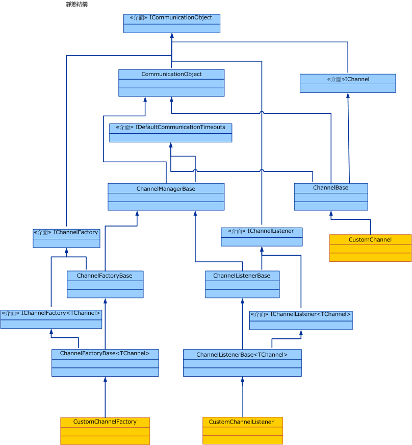

# 通道模型概觀Channel Model Overview
Windows Communication Foundation （WCF）通道堆疊是一種分層通訊堆疊，其中包含一或多個處理訊息的通道。The Windows Communication Foundation (WCF) channel stack is a layered communication stack with one or more channels that process messages. 堆疊底部為傳輸通道，其負責針對基礎傳輸進行調整 (例如，TCP、HTTP、SMTP 和其他的傳輸類型)。At the bottom of the stack is a transport channel that is responsible for adapting the channel stack to the underlying transport (for example, TCP, HTTP, SMTP and other types of transport.). 通道會提供低階的程式設計模型來傳送及接收訊息。Channels provide a low-level programming model for sending and receiving messages. 這個程式設計模型依賴數個介面和其他類型，統稱為 WCF 通道模型。This programming model relies on several interfaces and other types collectively known as the WCF channel model. 本主題將討論通道形狀、建構基本通道接聽程式 (在服務上) 以及通道處理站 (在用戶端上)。This topic discusses channel shapes, the construction of a basic channel listener (on the service) and channel factory (on the client).  
  
## 通道堆疊Channel Stack  
 WCF 端點會使用稱為通道堆疊的通訊堆疊與世界通訊。WCF endpoints communicate with the world using a communication stack called the channel stack. 下列圖表比較通道堆疊與其他的通訊堆疊，例如 TCP/IP。The following diagram compares the channel stack with other communication stacks, for example TCP/IP.  
  
   
  
 首先，相似之處：在這兩種情況下，堆疊的每個層級都會在該層的下方提供一些抽象概念，並只向其上方的層公開該抽象化。First, the similarities: In both cases, each layer of the stack provides some abstraction of the world below that layer and exposed that abstraction only to the layer directly above it. 每一層只會使用其下方一層的抽象概念。Each layer uses the abstraction of only the layer directly below it. 此外，在這兩種情況下，當兩個堆疊通訊時，每一層都會與另一個堆疊中的對應層進行通訊，例如 IP 層會與 IP 層通訊，而 TCP 層則與 TCP 層通訊，以此類推。Also in both cases, when two stacks communicate, each layer communicates with the corresponding layer in the other stack, for example, the IP layer communicates with the IP layer and the TCP layer with the TCP layer, and so on.  
  
 現在的差異如下：雖然 TCP 堆疊的設計目的是要提供實體網路的抽象概念，但通道堆疊的設計目的是要提供不僅傳遞訊息的方式，也就是傳輸，還有其他功能，例如訊息中的內容或通訊協定是用來進行通訊，包括傳輸，但遠多於這種情況。Now, the differences: While the TCP stack was designed to provide an abstraction of the physical network, the channel stack is designed to provide an abstraction of not only how the message is delivered, that is, the transport, but also other features such as what is in the message or what protocol is used for communication, including the transport but much more than that. 例如，可靠工作階段繫結項目就屬於通道堆疊的一部分，但其並不在傳輸下層，也不是傳輸本身。For example, reliable session binding element is part of the channel stack but is not below the transport or the transport itself. 要求堆疊中的底部通道將基礎的傳輸通訊協定調整為通道堆疊架構，接著依賴堆疊中的上一個通道提供通訊功能，例如可靠性保證和安全性，便可完成這個抽象概念。This abstraction is achieved by requiring the bottom channel in the stack to adapt the underlying transport protocol to the channel stack architecture and then relying on channels further up in the stack to provide communication features such as reliability guarantees and security.  
  
 訊息會以 <xref:System.ServiceModel.Channels.Message> 物件的狀態流經通訊堆疊。Messages flow through the communication stack as <xref:System.ServiceModel.Channels.Message> objects. 如上圖所示，底部通道稱為傳輸通道。As shown in figure above, the bottom channel is called a transport channel. 這就是負責與其他端點來回傳送及接收訊息的通道。It is the channel that is responsible for sending and receiving messages to and from other parties. 這個通道的責任包括將 <xref:System.ServiceModel.Channels.Message> 物件來回轉換為與其他端點進行通訊時所使用的格式。This includes the responsibility of transforming the <xref:System.ServiceModel.Channels.Message> object to and from the format used to communicate with other parties. 傳輸通道上方可以有任意數目的通訊協定通道，而其中每個通道都負責提供一項通訊功能，例如可靠的傳遞保證。Above the transport channel there can be any number of protocol channels each responsible for providing a communication function such as reliable delivery guarantees. 通訊協定通道會針對以 <xref:System.ServiceModel.Channels.Message> 物件格式流經其中的訊息執行動作。Protocol channels operate on messages flowing through them in the form of the <xref:System.ServiceModel.Channels.Message> object. 這些通道通常會轉換訊息 (例如，以新增標頭或將內文加密的方式)，或是傳送及接收它們自己的通訊協定控制訊息 (例如，回條認可)。They typically either transform the message, for example, by adding headers or encrypting the body, or send and receive their own protocol control messages, for example, receipt acknowledgments.  
  
## 通道形狀Channel Shapes  
 每個通道都會實作一個或多個介面，而這些介面即稱為通道形狀介面或通道形狀。Each channel implements one or more interfaces known as channel shape interfaces or channel shapes. 這些通道形狀會提供通訊導向的方法，例如，通道所實作以及通道使用者所呼叫的傳送及接收或是要求及回覆。Those channel shapes provide the communication-oriented methods such as send and receive or request and reply that the channel implements and the user of the channel calls. 「通道」圖形的基底是<xref:System.ServiceModel.Channels.IChannel>介面，它是`GetProperty` \<提供 T > 方法的介面，以做為分層機制來存取堆疊中的通道所公開的任意功能。At the base of the channel shapes is the <xref:System.ServiceModel.Channels.IChannel> interface, which is an interface that provides a `GetProperty`\<T> method intended as a layered mechanism to access arbitrary features exposed by channels in the stack. 延伸自 <xref:System.ServiceModel.Channels.IChannel> 的五種通道形狀為：The five channel shapes that extend <xref:System.ServiceModel.Channels.IChannel> are:  
  
- <xref:System.ServiceModel.Channels.IInputChannel>  
  
- <xref:System.ServiceModel.Channels.IOutputChannel>  
  
- <xref:System.ServiceModel.Channels.IRequestChannel>  
  
- <xref:System.ServiceModel.Channels.IReplyChannel>  
  
- <xref:System.ServiceModel.Channels.IDuplexChannel>  
  
 此外，其中每一個形狀都有延伸自 <xref:System.ServiceModel.Channels.ISessionChannel%601?displayProperty=nameWithType> 而可支援工作階段的對等形狀。Further, each of these shapes has an equivalent that extends <xref:System.ServiceModel.Channels.ISessionChannel%601?displayProperty=nameWithType> to support sessions. 這些是：These are:  
  
- <xref:System.ServiceModel.Channels.IInputSessionChannel>  
  
- <xref:System.ServiceModel.Channels.IOutputSessionChannel>  
  
- <xref:System.ServiceModel.Channels.IRequestSessionChannel>  
  
- <xref:System.ServiceModel.Channels.IReplySessionChannel>  
  
- <xref:System.ServiceModel.Channels.IDuplexSessionChannel>  
  
 通道形狀會仿效現有傳輸通訊協定所支援的某些基本訊息交換模式來建立模式。The channel shapes are patterned after some of the fundamental message exchange patterns supported by existing transport protocols. 例如，單向<xref:System.ServiceModel.Channels.IInputChannel>訊息對應至一/ <xref:System.ServiceModel.Channels.IOutputChannel>組，要求-回復會對應<xref:System.ServiceModel.Channels.IReplyChannel> <xref:System.ServiceModel.Channels.IRequestChannel> /至配對，而雙向雙工通訊則對應至<xref:System.ServiceModel.Channels.IDuplexChannel>（這會擴充<xref:System.ServiceModel.Channels.IInputChannel>和<xref:System.ServiceModel.Channels.IOutputChannel>）。For example, one-way messaging corresponds to an <xref:System.ServiceModel.Channels.IInputChannel>/<xref:System.ServiceModel.Channels.IOutputChannel> pair, request-reply corresponds to <xref:System.ServiceModel.Channels.IRequestChannel>/<xref:System.ServiceModel.Channels.IReplyChannel> pairs and two-way duplex communications corresponds to <xref:System.ServiceModel.Channels.IDuplexChannel> (which extends both <xref:System.ServiceModel.Channels.IInputChannel> and <xref:System.ServiceModel.Channels.IOutputChannel>).  
  
## 使用通道堆疊進行程式設計Programming with the Channel Stack  
 通道堆疊通常是使用處理站模式所建立，在此種模式中，繫結程序會建立通道堆疊。Channel stacks are typically created using a factory pattern where a binding creates the channel stack. 在傳送端上，繫結會用來建置 <xref:System.ServiceModel.ChannelFactory>，而此處理站會接著建置通道堆疊，並傳回在堆疊中頂端通道的參考。On the send side, a binding is used to build a <xref:System.ServiceModel.ChannelFactory>, which in turn builds a channel stack and returns a reference to the top channel in the stack. 應用程式可以接著使用這個通道來傳送訊息。The application can then use this channel to send messages. 如需詳細資訊，請參閱[用戶端通道層級的程式設計](client-channel-level-programming.md)。For more information, see [Client Channel-Level Programming](client-channel-level-programming.md).  
  
 在接收端上，繫結會用來建置 <xref:System.ServiceModel.Channels.IChannelListener>，而此接聽項會接聽傳入訊息。On the receive side a binding is used to build a <xref:System.ServiceModel.Channels.IChannelListener>, which listens for incoming messages. <xref:System.ServiceModel.Channels.IChannelListener> 會透過建立通道堆疊並將應用程式參考傳遞至頂端通道的方式，來提供訊息給接聽應用程式。The <xref:System.ServiceModel.Channels.IChannelListener> provides messages to the listening application by creating channel stacks and handing the application reference to the top channel. 應用程式可以接著使用這個通道來接收傳入訊息。The application then uses this channel to receive incoming messages. 如需詳細資訊，請參閱[服務通道層級的程式設計](service-channel-level-programming.md)。For more information, see [Service Channel-Level Programming](service-channel-level-programming.md).  
  
## 通道物件模型The Channel Object Model  
 通道物件模型是在實作通道、通道接聽程式和通道處理站時所需要的介面核心集。The channel object model is the core set of interfaces required to implement channels, channel listeners and channel factories. 同時也提供了一些可協助進行自訂實作的基底類別 (Base Class)。There are also some base classes provided to assist in custom implementations.  
  
 通道接聽程式負責接聽傳入訊息，並接著透過此通道接聽程式所建立的通道，將這些訊息傳遞至上一層。Channel listeners are responsible for listening for incoming messages, then delivering them to the layer above through channels created by the channel listener.  
  
 通道處理站負責建立的通道會用於傳送訊息，以及用於關閉在通道處理站關閉時所建立的所有通道。Channel factories are responsible for creating channels that are used for sending messages and for closing all channels they created when the channel factory is closed.  
  
 <xref:System.ServiceModel.ICommunicationObject> 為核心介面，它會定義所有通訊物件所實作的基本狀態機器。<xref:System.ServiceModel.ICommunicationObject> is the core interface that defines the basic state machine that all communication objects implement. <xref:System.ServiceModel.Channels.CommunicationObject> 會提供此核心介面的實作，這樣其他通道類別就可以從這個實作衍生，而不需重新實作該介面。<xref:System.ServiceModel.Channels.CommunicationObject> provides an implementation of this core interface that other channel classes can derive from rather than re-implementing the interface. 但是，這不並是規定方式。自訂通道可以直接實作 <xref:System.ServiceModel.ICommunicationObject>，而不用從 <xref:System.ServiceModel.Channels.CommunicationObject> 繼承。However, this is not required: a custom channel can implement <xref:System.ServiceModel.ICommunicationObject> directly and not inherit from <xref:System.ServiceModel.Channels.CommunicationObject>. 圖 3 中的所有類別都不是通道模型的一部分；這些類別是想要建置通道之自訂通道實作器可使用的協助程式。None of the classes in Figure 3 are considered part of the channel model; they are helpers available to custom channel implementers who want to build channels.  
  
   
  
 下列主題會說明通道物件模型，以及有助於建置自訂通道的各種開發區域。The following topics describe the channel object model as well as various development areas that help build custom channels.  
  
|主題Topic|描述Description|  
|-----------|-----------------|  
|[維護通道接聽程式和通道Service: Channel Listeners and Channels](service-channel-listeners-and-channels.md)|說明通道接聽程式，此接聽項會接聽服務應用程式中的傳入通道。Describes channel listeners, which listen for incoming channels in a service application.|  
|[台通道處理站和通道Client: Channel Factories and Channels](client-channel-factories-and-channels.md)|說明通道處理站，此處理站會建立可連接至服務應用程式的通道。Describes channel factories, which create channels to connect to a service application.|  
|[了解狀態變更Understanding State Changes](understanding-state-changes.md)|說明 <xref:System.ServiceModel.ICommunicationObject?displayProperty=nameWithType> 介面模型狀態在通道中的變更方式。Describes how the <xref:System.ServiceModel.ICommunicationObject?displayProperty=nameWithType> interface models state changes in channels.|  
|[選擇訊息交換模式Choosing a Message Exchange Pattern](choosing-a-message-exchange-pattern.md)|說明通道可支援的六種基本訊息交換模式。Describes the six basic message exchange patterns that channels can support.|  
|[處理例外狀況和失敗Handling Exceptions and Faults](handling-exceptions-and-faults.md)|說明如何處理在自訂通道中的錯誤和例外狀況。Describes how to handle faults and exceptions in custom channels.|  
|[組態與中繼資料支援Configuration and Metadata Support](configuration-and-metadata-support.md)|說明如何支援從應用程式模型使用自訂通道，以及如何使用繫結和繫結項目來匯出及匯入中繼資料。Describes how to support the use of custom channels from the application model and how to export and import metadata using bindings and binding elements.|
