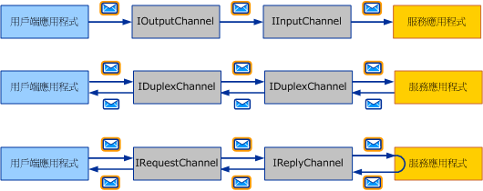
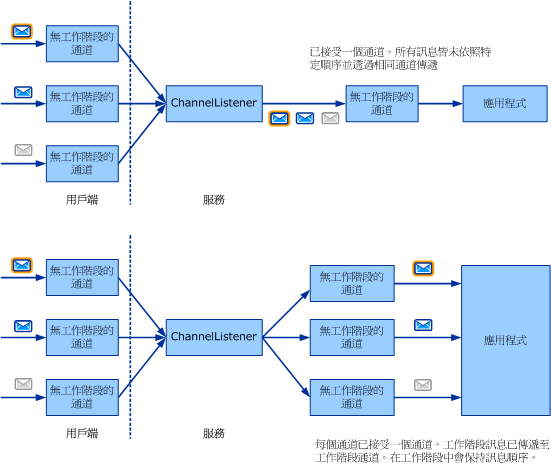

# 選擇訊息交換模式Choosing a Message Exchange Pattern
撰寫自訂傳輸的第一個步驟是決定*訊息交換模式*（又稱為 Mep） 所需的通道所開發。The first step in writing a custom transport is to decide which *message exchange patterns* (or MEPs) are required for the channel you are developing. 本主題會說明可用的選項，並討論各種需求。This topic describes the options available and discusses the various requirements. 這是通道開發工作清單中所述的第一個工作[開發通道](../../../../docs/framework/wcf/extending/developing-channels.md)。This is the first task in the channel development task list described in [Developing Channels](../../../../docs/framework/wcf/extending/developing-channels.md).  
  
## 六種訊息交換模式Six Message Exchange Patterns  
 您可以從三個 MEP 中選擇：There are three MEPs to choose from:  
  
-   資料包 (<xref:System.ServiceModel.Channels.IInputChannel> 和 <xref:System.ServiceModel.Channels.IOutputChannel>)Datagram (<xref:System.ServiceModel.Channels.IInputChannel> and <xref:System.ServiceModel.Channels.IOutputChannel>)  
  
     當使用資料包 (datagram) MEP 時，用戶端傳送訊息，使用*引發 fire and forget* exchange。When using a datagram MEP, a client sends a message using a *fire and forget* exchange. 射後不理交換是一種需要以超出範圍之外的方式確認傳遞成功的交換。A fire and forget exchange is one that requires out-of-band confirmation of successful delivery. 訊息可能會在傳輸時遺失而永遠無法抵達服務。The message might be lost in transit and never reach the service. 即使傳送作業在用戶端已成功完成，也無法保證遠端端點已接收到該訊息。If the send operation completes successfully at the client end, it does not guarantee that the remote endpoint has received the message. 資料包是訊息的基本建置組塊，您可以在資料包的最上層建立自己的通訊協定，其中包括可靠的通訊協定和安全的通訊協定。The datagram is a fundamental building block for messaging, as you can build your own protocols on top of it—including reliable protocols and secure protocols. 用戶端資料包通道會實作 <xref:System.ServiceModel.Channels.IOutputChannel> 介面，服務資料包通道則會實作 <xref:System.ServiceModel.Channels.IInputChannel> 介面。Client datagram channels implement the <xref:System.ServiceModel.Channels.IOutputChannel> interface and service datagram channels implement the <xref:System.ServiceModel.Channels.IInputChannel> interface.  
  
-   要求-回應 (<xref:System.ServiceModel.Channels.IRequestChannel> 和 <xref:System.ServiceModel.Channels.IReplyChannel>)Request-Response (<xref:System.ServiceModel.Channels.IRequestChannel> and <xref:System.ServiceModel.Channels.IReplyChannel>)  
  
     在此 MEP 中，會傳送訊息，而且會接收回覆。In this MEP, a message is sent, and a reply is received. 此模式是由要求-回應組合所構成。The pattern consists of request-response pairs. 遠端程序呼叫 (Remote Procedure Call，RPC) 與瀏覽器 GET 要求就是要求-回應呼叫的例子。Examples of request-response calls are remote procedure calls (RPC) and browser GET requests. 這個模式又稱為半雙工。This pattern is also known as half-duplex. 在此 MEP 中，用戶端通道會實作 <xref:System.ServiceModel.Channels.IRequestChannel>，服務通道則會實作 <xref:System.ServiceModel.Channels.IReplyChannel>。In this MEP, client channels implement <xref:System.ServiceModel.Channels.IRequestChannel> and service channels implement <xref:System.ServiceModel.Channels.IReplyChannel>.  
  
-   雙工 (<xref:System.ServiceModel.Channels.IDuplexChannel>)Duplex (<xref:System.ServiceModel.Channels.IDuplexChannel>)  
  
     雙工 MEP 會允許用戶端傳送任意數目的訊息，並以任何順序接收這些訊息。The duplex MEP allows an arbitrary number of messages to be sent by a client and received in any order. 雙工 MEP 就像是電話交談，談話中說出的每個字都是一則訊息。The duplex MEP is like a phone conversation, where each word being spoken is a message. 由於兩端都可以透過此種 MEP 來傳送和接收訊息，所以由用戶端和服務通道所實作的介面會是 <xref:System.ServiceModel.Channels.IDuplexChannel>。Because both sides can send and receive in this MEP, the interface implemented by the client and service channels is <xref:System.ServiceModel.Channels.IDuplexChannel>.  
  
   
三個基本訊息交換模式。The three basic message exchange patterns. 從上到下：資料包、要求-回應及雙工。Top to bottom: datagram, request-response, and duplex.  
  
 每個 Mep 都能支援*工作階段*。Each of these MEPs can also support *sessions*. 工作階段 (以及 <xref:System.ServiceModel.Channels.ISessionChannel%601?displayProperty=nameWithType> 型別的 <xref:System.ServiceModel.Channels.ISession?displayProperty=nameWithType> 實作) 會使在通道中傳送與接收的所有訊息相互關聯。A session (and implementation of <xref:System.ServiceModel.Channels.ISessionChannel%601?displayProperty=nameWithType> of type <xref:System.ServiceModel.Channels.ISession?displayProperty=nameWithType>) correlates all messages sent and received on a channel. 要求-回應模式是獨立的兩個訊息工作階段，因為要求與回覆是相互關聯的。The request-response pattern is a stand-alone two-message session, as the request and reply are correlated. 相較之下，支援工作階段的要求-回應模式，則表示在通道上的所有要求/回應組合都與彼此相互關聯。In contrast, the request-response pattern that supports sessions implies that all request/response pairs on that channel are correlated with each other. 這樣您就可以從總計六個的 MEP 中進行選擇：This gives you a total of six MEPs to choose from:  
  
-   資料包Datagram  
  
-   要求-回應Request-response  
  
-   雙工Duplex  
  
-   搭配工作階段的資料包Datagram with sessions  
  
-   搭配工作階段的要求-回應Request-response with sessions  
  
-   搭配工作階段的雙工Duplex with sessions  
  
> [!NOTE]
>  若是 UDP 傳輸，唯一支援的 MEP 是資料包，因為 UDP 原本就是射後不理 (Fire and Forget) 通訊協定。For the UDP transport, the only MEP that is supported is datagram, because UDP is inherently a fire and forget protocol.  
  
## 工作階段和工作階段通道Sessions and Sessionful Channels  
 在網路世界中有連線導向的通訊協定 (例如 TCP)，以及無連線的通訊協定 (例如 UDP)。In the networking world, there are connection-oriented protocols (for example, TCP) and connection-less protocols (for example, UDP). WCF 會使用工作階段一詞來表示像是連線的邏輯抽象概念。WCF uses the term session to mean a connection-like logical abstraction. 工作階段 WCF 通訊協定類似連線導向的網路通訊協定，而無工作階段的 WCF 通訊協定類似無連線的網路通訊協定。Sessionful WCF protocols are similar to connection-oriented network protocols and sessionless WCF protocols are similar to connection-less network protocols.  
  
 在通道物件模型中，每個邏輯工作階段都會顯示為工作階段通道的執行個體。In the channel object model, each logical session manifests as an instance of a sessionful channel. 因此，由用戶端建立並由服務接受的每個新工作階段，都會對應到每一端上的新工作階段通道。Therefore every new session created by the client, and accepted on the service, corresponds to a new sessionful channel on each side. 下圖的最上方顯示出無工作階段通道的結構，而下方則顯示工作階段通道的結構。The following diagram shows, on the top, the structure of sessionless channels, and on the bottom, the structure of sessionful channels.  
  
   
  
 用戶端會建立新的工作階段通道並傳送訊息。A client creates a new sessionful channel and sends a message. 在服務端上，通道接聽程式會接收此訊息，並偵測到該訊息屬於新的工作階段，因此它會建立新的工作階段通道，並會將其交給應用程式 (以回應在通道接聽程式上呼叫 AcceptChannel 的應用程式)。On the service side, the channel listener receives this message and detects that it belongs to a new session so it creates a new sessionful channel and hands it to the application (in response to the application calling AcceptChannel on the channel listener). 接著，應用程式便會接收此訊息，以及所有透過該相同工作階段通道傳送的後續訊息。The application then receives this message and all subsequent messages sent in the same session through the same sessionful channel.  
  
 另一個用戶端 (或是相同的用戶端) 會建立新的工作階段並傳送訊息。Another client (or the same client) creates a new sessionful and sends a message. 通道接聽程式會偵測出此訊息是存在於新的工作階段並建立新的工作階段通道，並重複這個程序。The channel listener detects this message is in a new session and creates a new sessionful channel and the process repeats.  
  
 若是沒有工作階段，通道與工作階段之間就不會有任何相互關聯。Without sessions, there is no correlation between channels and sessions. 因此，通道接聽程式只會建立一個所有已接收訊息都要透過其中以傳遞到應用程式的通道。Therefore a channel listener creates only one channel through which all received messages are delivered to the application. 由於沒有用來維持訊息順序的工作階段，所以，這時並不進行訊息排序。There is also no message ordering because there is no session within which to maintain message order. 上圖的最上方說明了無工作階段的訊息交換。The top portion of the preceding graphic illustrates a sessionless message exchange.  
  
## 啟動和終止工作階段Starting and Terminating Sessions  
 只要建立新的工作階段通道，即可在用戶端上啟動工作階段。Sessions are started on the client by simply creating a new sessionful channel. 當服務接收到在新工作階段中傳送的訊息時，這些工作階段便會在服務上啟動。They are started on the service when the service receives a message that was sent in a new session. 同樣的，關閉或中止工作階段通道便會使工作階段終止。Likewise, sessions are terminated by closing or aborting a sessionful channel.  
  
 這種情況的例外是 <xref:System.ServiceModel.Channels.IDuplexSessionChannel>，這種通道會用來在雙工的工作階段通訊模式中同時傳送和接收訊息。The exception to this is <xref:System.ServiceModel.Channels.IDuplexSessionChannel> which is used for both sending and receiving messages in a duplex, sessionful communication pattern. 有時會出現某一端希望停止傳送訊息但繼續接收訊息的情況，這時若是使用 <xref:System.ServiceModel.Channels.IDuplexSessionChannel> 便可提供一個機制，讓您能夠關閉輸出工作階段以表示您將不會傳送任何訊息，但是又使輸入工作階段維持開啟來讓您繼續接收訊息。It is possible that one side will want to stop sending messages but continue to receive messages therefore when using <xref:System.ServiceModel.Channels.IDuplexSessionChannel> there is a mechanism that lets you close the output session indicating you will not send any more messages but keep the input session opened allowing you to continue to receive messages.  
  
 一般而言，工作階段是在傳出端上被關閉，而不是在傳入端上。In general, sessions are closed on the outgoing side and not on the incoming side. 也就是說，工作階段輸出通道可以被關閉，並進而正常地終止工作階段。That is, sessionful output channels can be closed, thereby cleanly terminating the session. 關閉工作階段輸出通道，會造成對應的工作階段輸入通道將 null 傳回給在 <xref:System.ServiceModel.Channels.IInputChannel.Receive%2A?displayProperty=nameWithType> 上呼叫 <xref:System.ServiceModel.Channels.IDuplexSessionChannel> 的應用程式。Closing a sessionful output channel causes the corresponding sessionful input channel to return null to the application calling <xref:System.ServiceModel.Channels.IInputChannel.Receive%2A?displayProperty=nameWithType> on the <xref:System.ServiceModel.Channels.IDuplexSessionChannel>.  
  
 不過，除非 <xref:System.ServiceModel.Channels.IInputChannel.Receive%2A?displayProperty=nameWithType> 上的 <xref:System.ServiceModel.Channels.IDuplexSessionChannel> 傳回 null 以表示工作階段已關閉，否則，應該不要關閉工作階段輸入通道。However sessionful input channels should not be closed unless <xref:System.ServiceModel.Channels.IInputChannel.Receive%2A?displayProperty=nameWithType> on the <xref:System.ServiceModel.Channels.IDuplexSessionChannel> returns null, indicating that the session is already closed. 如果 <xref:System.ServiceModel.Channels.IInputChannel.Receive%2A?displayProperty=nameWithType> 上的 <xref:System.ServiceModel.Channels.IDuplexSessionChannel> 沒有傳回 null，這時關閉工作階段輸入通道時可能會擲回例外狀況，因為該通道可能會在關閉時收到未預期的訊息。If <xref:System.ServiceModel.Channels.IInputChannel.Receive%2A?displayProperty=nameWithType> on the <xref:System.ServiceModel.Channels.IDuplexSessionChannel> has not returned null, closing a sessionful input channel may throw an exception because it may receive unexpected messages while closing. 如果接收端希望在傳送端終止工作階段之前先行終止，它就應該在輸入通道上呼叫 <xref:System.ServiceModel.ICommunicationObject.Abort%2A>，如此就會立即終止該工作階段。If a receiver wishes to terminate a session before the sender does, it should call <xref:System.ServiceModel.ICommunicationObject.Abort%2A> on the input channel, which abruptly terminates the session.  
  
## 撰寫工作階段通道Writing Sessionful Channels  
 身為工作階段通道作者，您的通道必須進行一些動作才能提供工作階段。As a sessionful channel author, there are a few things your channel must do to provide sessions. 在傳送端上，您的通道必須執行下列動作：On the send side, your channel needs to:  
  
-   對於每個新通道，建立新的工作階段，並使這個工作階段與屬於唯一字串的新工作階段識別碼產生關聯。For each new channel, create a new session and associate it with a new session id which is a unique string. 或是從堆疊中低於您的工作階段通道中，取得新的工作階段。Or obtain a new session from the sessionful channel below you in the stack.  
  
-   對於使用這個通道傳送的每則訊息，如果工作階段是由您的通道建立 (而非從低於您的通道層中取得此工作階段)，您就需要使訊息與此工作階段產生關聯。For each message sent using this channel, if your channel created the session (as opposed to obtaining it from the layer below you), you need to associate the message with the session. 若是通訊協定通道，通常是新增 SOAP 標頭來做到這點。For protocol channels, this is typically done by adding a SOAP header. 若是傳輸通道，通常是建立新傳輸連線、或是將工作階段資訊新增到框架處理通訊協定來做到這點。For transport channels, this is typically done by creating a new transport connection or adding session information to the framing protocol.  
  
-   對於使用這個通道傳送的每則訊息，您必須提供上述的傳遞保證。For each message sent using this channel, you need to provide the delivery guarantees mentioned above. 如果您是依賴在您之下的通道來提供工作階段，該通道也將會提供傳遞保證。If you are relying on the channel below you to provide the session, that channel will also provide the delivery guarantees. 如果您是自己提供工作階段，您就必須實作這些保證以做為通訊協定的一部分。If you’re providing the session yourself, you need to implement those guarantees as part of your protocol. 一般而言，如果您要撰寫假設兩端都有 WCF 的通訊協定通道，您可能會需要 TCP 傳輸或可信賴傳訊通道，並依賴其中一種來提供工作階段。In general, if you are writing a protocol channel that assumes WCF on both sides you may require the TCP transport or the Reliable Messaging channel and rely on either one to provide a session.  
  
-   當某一端在您的通道上呼叫 <xref:System.ServiceModel.ICommunicationObject.Close%2A?displayProperty=nameWithType> 時，執行必要的工作來關閉使用指定或預設逾時的工作階段。When <xref:System.ServiceModel.ICommunicationObject.Close%2A?displayProperty=nameWithType> is called on your channel, perform the necessary work to close the session using either the specified timeout or the default one. 這點就像在您以下的通道呼叫 <xref:System.ServiceModel.ICommunicationObject.Close%2A> (如果只從其中取得工作階段)、傳送特殊的 SOAP 訊號，或是關閉傳輸連線一樣簡單。This can be as simple as calling <xref:System.ServiceModel.ICommunicationObject.Close%2A> on the channel below you (if you just obtained the session from it) or sending a special SOAP message or closing a transport connection.  
  
-   當某一端在您的通道上呼叫 <xref:System.ServiceModel.ICommunicationObject.Abort%2A> 時，立即終止工作階段而不執行 I/O。When <xref:System.ServiceModel.ICommunicationObject.Abort%2A> is called on your channel, terminate the session abruptly without performing I/O. 這可能表示不進行任何動作，或是牽涉到中止網路連線或其他一些資源。This may mean doing nothing or may involve aborting a network connection or some other resource.  
  
 在接收端上，您的通道必須執行下列動作：On the receive side, your channel needs to:  
  
-   對於每則傳入訊息，通道接聽程式都必須偵測其所屬於的工作階段。For each incoming message, the channel listener must detect the session it belongs to. 如果這是工作階段中的第一則訊息，通道接聽程式就必須建立新的通道，並從對 <xref:System.ServiceModel.Channels.IChannelListener%601.AcceptChannel%2A?displayProperty=nameWithType> 的呼叫將其傳回。If this is the first message in the session, the channel listener must create a new channel and return it from the call to <xref:System.ServiceModel.Channels.IChannelListener%601.AcceptChannel%2A?displayProperty=nameWithType>. 否則，通道接聽程式就必須找到對應至該工作階段的現有通道，並透過該通道傳遞訊息。Otherwise the channel listener must find the existing channel that corresponds to the session and deliver the message through that channel.  
  
-   如果您的通道會提供工作階段 (以及必要的傳遞保證)，接收端就可能需要執行一些動作，像是重新排列訊息或傳送認可。If your channel is providing the session (along with the required delivery guarantees) the receive side may be required to perform some actions such as re-order messages or send acknowledgements.  
  
-   當某一端在您的通道上呼叫 <xref:System.ServiceModel.ICommunicationObject.Close%2A> 時，執行必要的工作來關閉使用指定或預設逾時的工作階段。When <xref:System.ServiceModel.ICommunicationObject.Close%2A> is called on your channel, perform the necessary work to close the session either the specified timeout or the default one. 如果通道在等候關閉逾時到期的期間收到訊息，這時可能會造成例外狀況。This could result in exceptions if the channel receives a message while waiting for the close timeout to expire. 這是因為通道在收到訊息時將是處於 Closing 狀態，所以可能會擲回例外狀況。That’s because the channel will be in the Closing state when it receives a message so it would throw.  
  
-   當某一端在您的通道上呼叫 <xref:System.ServiceModel.ICommunicationObject.Abort%2A> 時，立即終止工作階段而不執行 I/O。When <xref:System.ServiceModel.ICommunicationObject.Abort%2A> is called on your channel, terminate the session abruptly without performing I/O. 同樣地，這可能表示不進行任何動作，或是牽涉到中止網路連線或其他一些資源。Again, this may mean doing nothing or may involve aborting a network connection or some other resource.  
  
## 另請參閱See Also  
 [通道模型概觀Channel Model Overview](../../../../docs/framework/wcf/extending/channel-model-overview.md)
