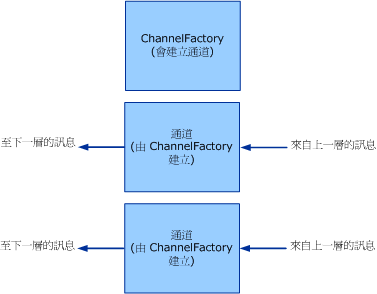

# <a name="client-channel-factories-and-channels"></a><span data-ttu-id="2715d-102">用戶端：通道處理站與通道</span><span class="sxs-lookup"><span data-stu-id="2715d-102">Client: Channel Factories and Channels</span></span>
<span data-ttu-id="2715d-103">這個主題會討論通道處理站和通道的建立方面。</span><span class="sxs-lookup"><span data-stu-id="2715d-103">This topic discusses the creation of channel factories and channels.</span></span>  
  
## <a name="channel-factories-and-channels"></a><span data-ttu-id="2715d-104">通道處理站與通道</span><span class="sxs-lookup"><span data-stu-id="2715d-104">Channel Factories and Channels</span></span>  
 <span data-ttu-id="2715d-105">通道處理站會負責建立通道。</span><span class="sxs-lookup"><span data-stu-id="2715d-105">Channel factories are responsible for creating channels.</span></span> <span data-ttu-id="2715d-106">而通道處理站所建立的通道會用於傳送訊息。</span><span class="sxs-lookup"><span data-stu-id="2715d-106">Channels created by channel factories are used for sending messages.</span></span> <span data-ttu-id="2715d-107">這些通道會負責從上層取得訊息、執行必須的處理動作，然後將訊息傳送至下層。</span><span class="sxs-lookup"><span data-stu-id="2715d-107">These channels are responsible for getting the message from the layer above, performing whatever processing is necessary, then sending the message to the layer below.</span></span> <span data-ttu-id="2715d-108">下圖會說明這個程序。</span><span class="sxs-lookup"><span data-stu-id="2715d-108">The following graphic illustrates this process.</span></span>  
  
 <span data-ttu-id="2715d-109"></span><span class="sxs-lookup"><span data-stu-id="2715d-109"></span></span>  
<span data-ttu-id="2715d-110">通道處理站會建立通道。</span><span class="sxs-lookup"><span data-stu-id="2715d-110">A channel factory creates channels.</span></span>  
  
 <span data-ttu-id="2715d-111">關閉時，通道處理站會負責關閉所建立但尚未關閉的任何通道。</span><span class="sxs-lookup"><span data-stu-id="2715d-111">When closed, channel factories are responsible for closing any channels they created that are not yet closed.</span></span> <span data-ttu-id="2715d-112">請注意，此處的模型為非對稱，這是因為關閉通道接聽項時，只會停止接受新通道，但會讓現有的通道保持為開啟，這樣才可以繼續接收訊息。</span><span class="sxs-lookup"><span data-stu-id="2715d-112">Note that the model is asymmetric here because when a channel listener is closed, it only stops accepting new channels but leaves existing channels open so that they can continue receiving messages.</span></span>  
  
 <span data-ttu-id="2715d-113">WCF 會為此程式提供基類 helper。</span><span class="sxs-lookup"><span data-stu-id="2715d-113">WCF provides base class helpers for this process.</span></span> <span data-ttu-id="2715d-114">（如需本主題中所討論之通道協助程式類別的圖表，請參閱[通道模型總覽](channel-model-overview.md)）。</span><span class="sxs-lookup"><span data-stu-id="2715d-114">(For a diagram of the channel helper classes discussed in this topic, see [Channel Model Overview](channel-model-overview.md).)</span></span>  
  
- <span data-ttu-id="2715d-115">類別會執行[開發通道](developing-channels.md)的步驟2中所述的狀態機器，並加以強制執行。<xref:System.ServiceModel.ICommunicationObject> <xref:System.ServiceModel.Channels.CommunicationObject></span><span class="sxs-lookup"><span data-stu-id="2715d-115">The <xref:System.ServiceModel.Channels.CommunicationObject> class implements <xref:System.ServiceModel.ICommunicationObject> and enforces the state machine described in step 2 of [Developing Channels](developing-channels.md).</span></span>  
  
- <span data-ttu-id="2715d-116"><xref:System.ServiceModel.Channels.ChannelManagerBase> 類別會實作 <xref:System.ServiceModel.Channels.CommunicationObject>，並為 <xref:System.ServiceModel.Channels.ChannelFactoryBase?displayProperty=nameWithType> 和 <xref:System.ServiceModel.Channels.ChannelListenerBase?displayProperty=nameWithType> 提供統一的基底類別。</span><span class="sxs-lookup"><span data-stu-id="2715d-116">The <xref:System.ServiceModel.Channels.ChannelManagerBase> class implements <xref:System.ServiceModel.Channels.CommunicationObject> and provides a unified base class for <xref:System.ServiceModel.Channels.ChannelFactoryBase?displayProperty=nameWithType> and <xref:System.ServiceModel.Channels.ChannelListenerBase?displayProperty=nameWithType>.</span></span> <span data-ttu-id="2715d-117"><xref:System.ServiceModel.Channels.ChannelManagerBase> 類別可以和 <xref:System.ServiceModel.Channels.ChannelBase> 一起運作，而後者是實作 <xref:System.ServiceModel.Channels.IChannel> 的基底類別。</span><span class="sxs-lookup"><span data-stu-id="2715d-117">The <xref:System.ServiceModel.Channels.ChannelManagerBase> class works in conjunction with <xref:System.ServiceModel.Channels.ChannelBase>, which is a base class that implements <xref:System.ServiceModel.Channels.IChannel>.</span></span>
  
- <span data-ttu-id="2715d-118"><xref:System.ServiceModel.Channels.ChannelFactoryBase> `OnCreateChannel`類別會執行`CreateChannel`和，<xref:System.ServiceModel.Channels.IChannelFactory>並將多載合併為單一抽象方法。 <xref:System.ServiceModel.Channels.ChannelManagerBase></span><span class="sxs-lookup"><span data-stu-id="2715d-118">The <xref:System.ServiceModel.Channels.ChannelFactoryBase> class implements <xref:System.ServiceModel.Channels.ChannelManagerBase> and <xref:System.ServiceModel.Channels.IChannelFactory> and consolidates the `CreateChannel` overloads into one `OnCreateChannel` abstract method.</span></span>
  
- <span data-ttu-id="2715d-119"><xref:System.ServiceModel.Channels.ChannelListenerBase> 類別會實作 <xref:System.ServiceModel.Channels.IChannelListener>。</span><span class="sxs-lookup"><span data-stu-id="2715d-119">The <xref:System.ServiceModel.Channels.ChannelListenerBase> class implements <xref:System.ServiceModel.Channels.IChannelListener>.</span></span> <span data-ttu-id="2715d-120">它會負責基礎的狀態管理。</span><span class="sxs-lookup"><span data-stu-id="2715d-120">It takes care of basic state management.</span></span> 
  
 <span data-ttu-id="2715d-121">下列討論是以[傳輸為基礎：UDP](../samples/transport-udp.md)範例。</span><span class="sxs-lookup"><span data-stu-id="2715d-121">The following discussion is based upon the [Transport: UDP](../samples/transport-udp.md) sample.</span></span>  
  
### <a name="creating-a-channel-factory"></a><span data-ttu-id="2715d-122">建立通道處理站y</span><span class="sxs-lookup"><span data-stu-id="2715d-122">Creating a Channel Factory</span></span>  
 <span data-ttu-id="2715d-123">`UdpChannelFactory` 是衍生自 <xref:System.ServiceModel.Channels.ChannelFactoryBase>。</span><span class="sxs-lookup"><span data-stu-id="2715d-123">The `UdpChannelFactory` derives from <xref:System.ServiceModel.Channels.ChannelFactoryBase>.</span></span> <span data-ttu-id="2715d-124">範例會覆寫 <xref:System.ServiceModel.Channels.ChannelFactoryBase.GetProperty%2A>，以提供訊息編碼器之訊息版本的存取權。</span><span class="sxs-lookup"><span data-stu-id="2715d-124">The sample overrides <xref:System.ServiceModel.Channels.ChannelFactoryBase.GetProperty%2A> to provide access to the message version of the message encoder.</span></span> <span data-ttu-id="2715d-125">當狀態電腦進行轉換時，該範例也會覆寫 <xref:System.ServiceModel.Channels.ChannelFactoryBase.OnClose%2A> 以終止 <xref:System.ServiceModel.Channels.BufferManager> 的執行個體。</span><span class="sxs-lookup"><span data-stu-id="2715d-125">The sample also overrides <xref:System.ServiceModel.Channels.ChannelFactoryBase.OnClose%2A> to tear down our instance of <xref:System.ServiceModel.Channels.BufferManager> when the state machine transitions.</span></span>  
  
#### <a name="the-udp-output-channel"></a><span data-ttu-id="2715d-126">UDP 輸出通道</span><span class="sxs-lookup"><span data-stu-id="2715d-126">The UDP Output Channel</span></span>  
 <span data-ttu-id="2715d-127">`UdpOutputChannel` 會實作 <xref:System.ServiceModel.Channels.IOutputChannel>。</span><span class="sxs-lookup"><span data-stu-id="2715d-127">The `UdpOutputChannel` implements <xref:System.ServiceModel.Channels.IOutputChannel>.</span></span> <span data-ttu-id="2715d-128">建構函式會驗證引數，並根據傳進的 <xref:System.Net.EndPoint> 建構目的地 <xref:System.ServiceModel.EndpointAddress> 物件。</span><span class="sxs-lookup"><span data-stu-id="2715d-128">The constructor validates the arguments and constructs a destination <xref:System.Net.EndPoint> object based on the <xref:System.ServiceModel.EndpointAddress> that is passed in.</span></span>  
  
 <span data-ttu-id="2715d-129">覆寫 <xref:System.ServiceModel.Channels.CommunicationObject.OnOpen%2A> 後會建立用於將訊息傳送至此 <xref:System.Net.EndPoint> 的通訊端 (Socket)。</span><span class="sxs-lookup"><span data-stu-id="2715d-129">The override of <xref:System.ServiceModel.Channels.CommunicationObject.OnOpen%2A> creates a socket that is used to send messages to this <xref:System.Net.EndPoint>.</span></span>  
  
 ```csharp 
this.socket = new Socket(  
this.remoteEndPoint.AddressFamily,
   SocketType.Dgram,
   ProtocolType.Udp
);  
```  

 <span data-ttu-id="2715d-130">可以依正常程序或非正常程序關閉通道。</span><span class="sxs-lookup"><span data-stu-id="2715d-130">The channel can be closed gracefully or ungracefully.</span></span> <span data-ttu-id="2715d-131">如果依正常程序關閉通道，將會關閉通訊端，並且會呼叫基底類別 `OnClose` 方法。</span><span class="sxs-lookup"><span data-stu-id="2715d-131">If the channel is closed gracefully the socket is closed and a call is made to the base class `OnClose` method.</span></span> <span data-ttu-id="2715d-132">如果因此發生例外狀況，則基礎結構會呼叫 `Abort`，確保已清除通道。</span><span class="sxs-lookup"><span data-stu-id="2715d-132">If this throws an exception, the infrastructure calls `Abort` to ensure the channel is cleaned up.</span></span>  
  
```csharp  
this.socket.Close();  
base.OnClose(timeout);  
```  
  
 <span data-ttu-id="2715d-133">執行`Send()`和`BeginSend()`。 / `EndSend()`</span><span class="sxs-lookup"><span data-stu-id="2715d-133">Implement `Send()` and `BeginSend()`/`EndSend()`.</span></span> <span data-ttu-id="2715d-134">這分成兩個主要區段。</span><span class="sxs-lookup"><span data-stu-id="2715d-134">This breaks down into two main sections.</span></span> <span data-ttu-id="2715d-135">首先，將訊息序列化為位元組陣列：</span><span class="sxs-lookup"><span data-stu-id="2715d-135">First serialize the message into a byte array:</span></span>  
  
```csharp  
ArraySegment<byte> messageBuffer = EncodeMessage(message);  
```  
  
 <span data-ttu-id="2715d-136">然後在 Wire 上傳送產生的資料：</span><span class="sxs-lookup"><span data-stu-id="2715d-136">Then send the resulting data on the wire:</span></span>  
  
```csharp  
this.socket.SendTo(  
  messageBuffer.Array,   
  messageBuffer.Offset,   
  messageBuffer.Count,   
  SocketFlags.None,   
  this.remoteEndPoint  
);  
```  
  
## <a name="see-also"></a><span data-ttu-id="2715d-137">另請參閱</span><span class="sxs-lookup"><span data-stu-id="2715d-137">See also</span></span>

- [<span data-ttu-id="2715d-138">開發通道</span><span class="sxs-lookup"><span data-stu-id="2715d-138">Developing Channels</span></span>](developing-channels.md)
