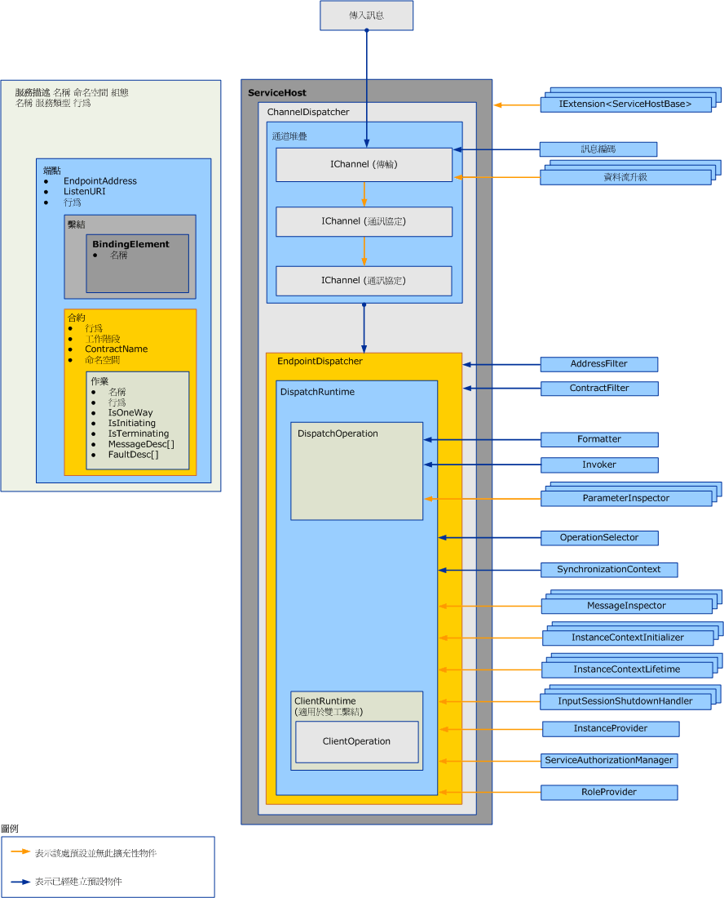

# 擴充發送器Extending Dispatchers
發送器負責從基礎通道提取傳入訊息，將訊息轉譯成應用程式程式碼中的方法叫用，然後將結果傳回給呼叫者。Dispatchers are responsible for pulling incoming messages out of the underlying channels, translating them into method invocations in application code, and sending the results back to the caller. 發送器擴充可讓您修改這個處理。Dispatcher extensions allow you to modify this processing.  您可以實作可檢查或修改訊息或參數之內容的訊息或參數偵測器。You can implement message or parameter inspectors that inspect or modify the contents of messages or parameters.  您可以變更訊息路由傳送到作業的方式，或提供其他特定功能。You can change the way messages are routed to operations or provide some other functionality.  
  
 本主題描述如何使用<xref:System.ServiceModel.Dispatcher.DispatchRuntime>和<xref:System.ServiceModel.Dispatcher.DispatchOperation>類別中的 Windows Communication Foundation (WCF) 服務來修改發送器的預設執行行為，或是攔截或修改訊息、 參數或傳回的應用程式之前或之後傳送，或從通道層擷取這些值。This topic describes how to use the <xref:System.ServiceModel.Dispatcher.DispatchRuntime> and <xref:System.ServiceModel.Dispatcher.DispatchOperation> classes in a Windows Communication Foundation (WCF) service application to modify the default execution behavior of a dispatcher or to intercept or modify messages, parameters, or return values prior to or subsequent to sending or retrieving them from the channel layer. 如需有關對等用戶端執行階段訊息處理的詳細資訊，請參閱[擴充用戶端](../../../../docs/framework/wcf/extending/extending-clients.md)。For more information about the equivalent client runtime message processing, see [Extending Clients](../../../../docs/framework/wcf/extending/extending-clients.md). 若要了解角色，<xref:System.ServiceModel.IExtensibleObject%601>型別中存取各種執行階段自訂物件之間的共用的狀態播放，請參閱 <<c2> [ 可擴充物件](../../../../docs/framework/wcf/extending/extensible-objects.md)。To understand the role that <xref:System.ServiceModel.IExtensibleObject%601> types play in accessing shared state between various runtime customization objects, see [Extensible Objects](../../../../docs/framework/wcf/extending/extensible-objects.md).  
  
## 發送器Dispatchers  
 服務模型層會在開發人員的程式設計模型與一般稱為通道層的基礎訊息交換之間執行轉換。The service model layer performs the conversion between the developer’s programming model and the underlying message exchange, commonly called the channel layer. 在 WCF 通道和端點調派程式 (<xref:System.ServiceModel.Dispatcher.ChannelDispatcher>和<xref:System.ServiceModel.Dispatcher.EndpointDispatcher>分別) 是負責接受新通道、 接收訊息、 作業分派和叫用，以及回應處理的服務元件。In WCF the channel and endpoint dispatchers (<xref:System.ServiceModel.Dispatcher.ChannelDispatcher> and <xref:System.ServiceModel.Dispatcher.EndpointDispatcher>, respectively) are the service components responsible for accepting new channels, receiving messages, operation dispatch and invocation, and response processing. 發送器物件是指接收物件，但是雙工服務中的回呼合約實作也會公開其發送器物件，以進行檢查、修改或擴充。Dispatcher objects are receiver objects, but callback contract implementations in duplex services also expose their dispatcher objects for inspection, modification, or extension.  
  
 通道發送器和隨附的 <xref:System.ServiceModel.Channels.IChannelListener> 會從基礎通道中提取訊息，並將訊息傳遞至個別的端點發送器。The channel dispatcher (and companion <xref:System.ServiceModel.Channels.IChannelListener>) pulls messages out of the underling channel and passes the messages to their respective endpoint dispatchers. 每個端點發送器都有一個 <xref:System.ServiceModel.Dispatcher.DispatchRuntime>，可將訊息傳送至適當的 <xref:System.ServiceModel.Dispatcher.DispatchOperation> (負責呼叫可實作作業的方法)。Each endpoint dispatcher has a <xref:System.ServiceModel.Dispatcher.DispatchRuntime> that routes messages to the appropriate <xref:System.ServiceModel.Dispatcher.DispatchOperation>, which is responsible for calling the method that implements the operation. 過程中需要各種選擇性及必要的延伸類別。Various optional and required extension classes are invoked along the way. 本主題說明這些部分如何互相配合，以及如何修改屬性並插入您自己的程式碼以擴充基礎功能。This topic explains how these pieces fit together, and how you might modify properties and plug your own code in to extend the base functionality.  
  
 發送器屬性與修改的自訂物件可透過服務、端點、合約，或作業行為物件來插入。Dispatcher properties and modified customization objects are inserted by using service, endpoint, contract, or operation behavior objects. 本主題未說明這些行為的用法。This topic does not describe how to use behaviors. 如需用來插入發送器修改的類型的詳細資訊，請參閱[設定和擴充執行階段行為](../../../../docs/framework/wcf/extending/configuring-and-extending-the-runtime-with-behaviors.md)。For more information about the types used to insert dispatcher modifications, see [Configuring and Extending the Runtime with Behaviors](../../../../docs/framework/wcf/extending/configuring-and-extending-the-runtime-with-behaviors.md).  
  
 下圖提供服務中架構項目的高階檢視。The following graphic provides a high-level view of the architectural items in a service.  
  
   
  
### 通道發送器Channel Dispatchers  
 <xref:System.ServiceModel.Dispatcher.ChannelDispatcher> 物件是建立用來將服務執行個體與位於特定 URI (稱為接聽 URI) 的 <xref:System.ServiceModel.Channels.IChannelListener> 產生關聯。A <xref:System.ServiceModel.Dispatcher.ChannelDispatcher> object is created to associate an <xref:System.ServiceModel.Channels.IChannelListener> at a particular URI (called a listen URI) with an instance of a service. 每個 <xref:System.ServiceModel.ServiceHost> 物件都可以擁有許多 <xref:System.ServiceModel.Dispatcher.ChannelDispatcher> 物件，而其中每一個物件只會與一個接聽項和接聽 URI 產生關聯。Each <xref:System.ServiceModel.ServiceHost> object can have many <xref:System.ServiceModel.Dispatcher.ChannelDispatcher> objects, each associated with only one listener and listen URI. 當訊息抵達時，<xref:System.ServiceModel.Dispatcher.ChannelDispatcher> 會查詢每個關聯的 <xref:System.ServiceModel.Dispatcher.EndpointDispatcher> 物件來判定該端點是否可以接受此訊息，然後將該訊息傳遞至可以接受的端點。When a message arrives, the <xref:System.ServiceModel.Dispatcher.ChannelDispatcher> queries each of the associated <xref:System.ServiceModel.Dispatcher.EndpointDispatcher> objects whether the endpoint can accept the message, and passes the message to the one that can.  
  
 所有控制通道工作階段之存留期及行為的屬性都可以用來檢查或修改 <xref:System.ServiceModel.Dispatcher.ChannelDispatcher> 物件，All properties that control the lifetime and behavior of a channel session are available for inspection or modification on the <xref:System.ServiceModel.Dispatcher.ChannelDispatcher> object. 這些屬性包括自訂通道初始設定式、通道接聽項、主機與關聯的 <xref:System.ServiceModel.InstanceContext> 等等。These include custom channel initializers, the channel listener, the host, the associated <xref:System.ServiceModel.InstanceContext>, and so on.  
  
### 端點發送器Endpoint Dispatchers  
 當訊息的目的端位址符合 <xref:System.ServiceModel.Dispatcher.EndpointDispatcher>，而且訊息動作符合 <xref:System.ServiceModel.Dispatcher.ChannelDispatcher> 屬性時，<xref:System.ServiceModel.Dispatcher.EndpointDispatcher.AddressFilter%2A> 物件就會負責處理來自 <xref:System.ServiceModel.Dispatcher.EndpointDispatcher.ContractFilter%2A> 的訊息。The <xref:System.ServiceModel.Dispatcher.EndpointDispatcher> object is responsible for processing messages from a <xref:System.ServiceModel.Dispatcher.ChannelDispatcher> when the destination address of a message matches the <xref:System.ServiceModel.Dispatcher.EndpointDispatcher.AddressFilter%2A> and the message action matches the <xref:System.ServiceModel.Dispatcher.EndpointDispatcher.ContractFilter%2A> property. 如果有兩個 <xref:System.ServiceModel.Dispatcher.EndpointDispatcher> 物件可以接受訊息，<xref:System.ServiceModel.Dispatcher.EndpointDispatcher.FilterPriority%2A> 屬性值會決定使用較高優先順序的端點。If two <xref:System.ServiceModel.Dispatcher.EndpointDispatcher> objects can accept a message, the <xref:System.ServiceModel.Dispatcher.EndpointDispatcher.FilterPriority%2A> property value determines the higher priority endpoint.  
  
 使用 <xref:System.ServiceModel.Dispatcher.EndpointDispatcher> 即可取得兩個主要的服務模型擴充點 (<xref:System.ServiceModel.Dispatcher.DispatchRuntime> 和 <xref:System.ServiceModel.Dispatcher.DispatchOperation> 類別)，以便您用來自訂發送器的處理。Use the <xref:System.ServiceModel.Dispatcher.EndpointDispatcher> to acquire the two main service model extension points – the <xref:System.ServiceModel.Dispatcher.DispatchRuntime> and <xref:System.ServiceModel.Dispatcher.DispatchOperation> classes – that you can use to customize the processing of the dispatcher. <xref:System.ServiceModel.Dispatcher.DispatchRuntime> 類別可讓使用者在合約範圍內 (亦即針對合約內的所有訊息) 攔截與擴充發送器，The <xref:System.ServiceModel.Dispatcher.DispatchRuntime> class allows users to intercept and extend the dispatcher at the contract scope (that is, for all messages in a contract). <xref:System.ServiceModel.Dispatcher.DispatchOperation> 類別則可讓使用者在作業範圍內 (亦即針對作業內的所有訊息) 攔截與擴充發送器。The <xref:System.ServiceModel.Dispatcher.DispatchOperation> class allows users to intercept and extend the dispatcher at an operation scope (that is, for all messages in an operation).  
  
## 案例Scenarios  
 發送器會因為下列某些原因而需要擴充：There a number of reasons to extend the dispatcher:  
  
- 自訂訊息驗證。Custom Message Validation. 使用者可以強制訊息對特定結構描述有效，Users can enforce that a message is valid for a certain schema. 實作訊息攔截器介面即可達到這個目的。This can be done by implementing the message interceptor interfaces. 如需範例，請參閱[訊息偵測器](../../../../docs/framework/wcf/samples/message-inspectors.md)。For an example, see [Message Inspectors](../../../../docs/framework/wcf/samples/message-inspectors.md).  
  
- 自訂訊息記錄。Custom Message Logging. 使用者可以檢查和記錄某個流經端點的應用程式訊息集合，Users can inspect and log some set of application messages that flow through an endpoint. 使用訊息攔截器介面也可以完成這個動作。This can also be accomplished with the message interceptor interfaces.  
  
- 自訂訊息轉換。Custom Message Transformations. 使用者可以將特定轉換套用至執行階段中的訊息 (例如用來進行版本控制)，Users can apply certain transformations to the message in the runtime (for example, for versioning). 使用訊息攔截器介面同樣可以完成這個動作。This can be accomplished, again, with the message interceptor interfaces.  
  
- 自訂資料模型。Custom Data Model. 使用者可以擁有以外 WCF 中的預設支援的資料序列化模型 (亦即<xref:System.Runtime.Serialization.DataContractSerializer?displayProperty=nameWithType>， <xref:System.Xml.Serialization.XmlSerializer?displayProperty=nameWithType>，和未經處理的訊息)。Users can have a data serialization model other than those supported by default in WCF (namely, <xref:System.Runtime.Serialization.DataContractSerializer?displayProperty=nameWithType>, <xref:System.Xml.Serialization.XmlSerializer?displayProperty=nameWithType>, and raw messages). 實作訊息格式器介面即可達到這個目的。This can be done by implement the message formatter interfaces. 如需範例，請參閱[作業格式器和作業選取器](../../../../docs/framework/wcf/samples/operation-formatter-and-operation-selector.md)。For an example, see [Operation Formatter and Operation Selector](../../../../docs/framework/wcf/samples/operation-formatter-and-operation-selector.md).  
  
- 自訂參數驗證。Custom Parameter Validation. 使用者可以強制型別參數都是有效的參數 (相對於 XML)，Users can enforce that typed parameters are valid (as opposed to XML). 使用參數偵測器介面即可達到這個目的。This can be done using the parameter inspector interfaces.  
  
- 自訂作業分派。Custom Operation Dispatching. 使用者可以針對動作以外的項目 (例如主體項目或自訂訊息屬性) 實作分派，Users can implement dispatching on something other than action – for example, on the body element, or on a custom message property. 使用 <xref:System.ServiceModel.Dispatcher.IDispatchOperationSelector> 介面即可達到這個目的。This can be done using the <xref:System.ServiceModel.Dispatcher.IDispatchOperationSelector> interface. 如需範例，請參閱[作業格式器和作業選取器](../../../../docs/framework/wcf/samples/operation-formatter-and-operation-selector.md)。For an example, see [Operation Formatter and Operation Selector](../../../../docs/framework/wcf/samples/operation-formatter-and-operation-selector.md).  
  
- 物件共用。Object Pooling. 使用者可以共用執行個體，而不為每個呼叫分配一個新的執行個體，Users can pool instances rather than allocating a new one for every call. 使用執行個體提供者介面即可實作這個動作。This can be implemented using the instance provider interfaces. 如需範例，請參閱[共用](../../../../docs/framework/wcf/samples/pooling.md)。For an example, see [Pooling](../../../../docs/framework/wcf/samples/pooling.md).  
  
- 執行個體租用。Instance Leasing. 使用者可以實作執行個體存留期的租用模式，方法與實作 .NET Framework 遠端處理的租用模式類似。Users can implement a leasing pattern for instance lifetime, similar to that of .NET Framework Remoting. 使用執行個體內容存留期介面即可達到這個目的。This can be done using the instance context lifetime interfaces.  
  
- 自訂錯誤處理。Custom Error Handling. 使用者可以控制如何同時處理本機錯誤，以及如何將錯誤傳回用戶端。Users can control how both local errors are processed and how faults are communicated back to clients. 使用 <xref:System.ServiceModel.Dispatcher.IErrorHandler> 介面即可實作這個動作。This can be implemented using the <xref:System.ServiceModel.Dispatcher.IErrorHandler> interfaces.  
  
- 自訂授權行為。Custom Authorization Behaviors. 使用者可以擴充「合約」或「作業」執行階段片段，並根據訊息中存在的權杖新增安全性檢查，以實作自訂存取控制。Users can implement custom access control by extending the Contract or Operation run-time pieces and adding security checks based upon the tokens present in the message. 使用訊息攔截器或參數攔截器介面即可達到這個目的。This can be accomplished using either the message interceptor or parameter interceptor interfaces. 如需範例，請參閱[安全性擴充性](../../../../docs/framework/wcf/samples/security-extensibility.md)。For examples, see [Security Extensibility](../../../../docs/framework/wcf/samples/security-extensibility.md).  
  
    > [!CAUTION]
    >  由於改變安全性屬性有可能會危及安全性的 WCF 應用程式，因此強烈建議您進行有關安全性的修改，請小心，並在部署之前徹底測試。Because altering security properties has the potential to compromise the security of WCF applications, it is strongly recommended that you undertake security-related modifications with care and test thoroughly prior to deployment.  
  
- 自訂 WCF 執行階段驗證器。Custom WCF Runtime Validators. 您可以安裝自訂的驗證程式檢查服務、 合約和繫結，來強制執行 WCF 應用程式相關的企業層級原則。You can install custom validators that examine services, contracts, and bindings to enforce enterprise-level policies with respect to WCF applications. (例如，請參閱[How to:鎖定在企業中的端點](../../../../docs/framework/wcf/extending/how-to-lock-down-endpoints-in-the-enterprise.md)。)(For example, see [How to: Lock Down Endpoints in the Enterprise](../../../../docs/framework/wcf/extending/how-to-lock-down-endpoints-in-the-enterprise.md).)  
  
### 使用 DispatchRuntime 類別Using the DispatchRuntime Class  
 使用 <xref:System.ServiceModel.Dispatcher.DispatchRuntime> 類別即可修改服務或個別端點的預設行為，或是將實作自訂修改的物件插入下列其中一個或所有服務處理序 (或雙工用戶端情況下的用戶端處理序)：Use the <xref:System.ServiceModel.Dispatcher.DispatchRuntime> class either to modify the default behavior of a service or individual endpoint, or to insert objects that implement custom modifications to one or both of the following service processes (or client processes in the case of a duplex client):  
  
- 將傳入訊息轉換成物件，並且在針對服務物件叫用方法時釋放這些物件。The transformation of incoming messages into objects and releasing those objects as method invocations on a service object.  
  
- 將回應叫用服務作業時收到的物件轉換成傳出訊息。The transformation of objects received from the response to a service operation invocation into outbound messages.  
  
 即使無法辨識訊息，<xref:System.ServiceModel.Dispatcher.DispatchRuntime> 仍可讓您為特定合約上的所有訊息攔截及擴充通道或端點發送器。The <xref:System.ServiceModel.Dispatcher.DispatchRuntime> enables you to intercept and extend the channel or endpoint dispatcher for all messages across a particular contract, even when a message is not recognized. 當抵達的訊息不符合在合約中宣告的任何訊息時，該訊息會被分派至由 <xref:System.ServiceModel.Dispatcher.DispatchRuntime.UnhandledDispatchOperation%2A> 屬性傳回的作業。When a message arrives that does not match any declared in the contract it is dispatched to the operation returned by the <xref:System.ServiceModel.Dispatcher.DispatchRuntime.UnhandledDispatchOperation%2A> property. 若要針對特定作業在所有訊息上進行攔截或擴充，請參閱 <xref:System.ServiceModel.Dispatcher.DispatchOperation> 類別。To intercept or extend across all messages for a particular operation, see the <xref:System.ServiceModel.Dispatcher.DispatchOperation> class.  
  
 發送器擴充性的四個主要區域是由 <xref:System.ServiceModel.Dispatcher.DispatchRuntime> 類別所公開：There are four main areas of dispatcher extensibility exposed by the <xref:System.ServiceModel.Dispatcher.DispatchRuntime> class:  
  
1. 通道元件會使用 <xref:System.ServiceModel.Dispatcher.DispatchRuntime> 的屬性以及由 <xref:System.ServiceModel.Dispatcher.DispatchRuntime.ChannelDispatcher%2A> 屬性傳回之相關通道發送器的屬性，以自訂通道發送器如何接受及關閉通道。Channel components use the properties of the <xref:System.ServiceModel.Dispatcher.DispatchRuntime> and those of the associated channel dispatcher returned by the <xref:System.ServiceModel.Dispatcher.DispatchRuntime.ChannelDispatcher%2A> property to customize how the channel dispatcher accepts and closes channels. 這個分類包括 <xref:System.ServiceModel.Dispatcher.ChannelDispatcher.ChannelInitializers%2A> 和 <xref:System.ServiceModel.Dispatcher.DispatchRuntime.InputSessionShutdownHandlers%2A> 屬性。This category includes the <xref:System.ServiceModel.Dispatcher.ChannelDispatcher.ChannelInitializers%2A> and <xref:System.ServiceModel.Dispatcher.DispatchRuntime.InputSessionShutdownHandlers%2A> properties.  
  
2. 訊息元件會針對所處理的各個訊息進行自訂。Message components are customized for each message processed. 這個分類包括 <xref:System.ServiceModel.Dispatcher.DispatchRuntime.MessageInspectors%2A>、<xref:System.ServiceModel.Dispatcher.DispatchRuntime.OperationSelector%2A>、<xref:System.ServiceModel.Dispatcher.DispatchRuntime.Operations%2A> 和 <xref:System.ServiceModel.Dispatcher.ChannelDispatcher.ErrorHandlers%2A> 屬性。This category includes the <xref:System.ServiceModel.Dispatcher.DispatchRuntime.MessageInspectors%2A>, <xref:System.ServiceModel.Dispatcher.DispatchRuntime.OperationSelector%2A>, <xref:System.ServiceModel.Dispatcher.DispatchRuntime.Operations%2A>, and the <xref:System.ServiceModel.Dispatcher.ChannelDispatcher.ErrorHandlers%2A> properties.  
  
3. 執行個體元件會自訂服務類型執行個體的建立、存留期和處置。Instance components customize the creation, lifetime, and disposal of instances of the service type. 如需服務物件存留期的詳細資訊，請參閱 <xref:System.ServiceModel.ServiceBehaviorAttribute.InstanceContextMode%2A> 屬性。For more information about service object lifetimes, see the <xref:System.ServiceModel.ServiceBehaviorAttribute.InstanceContextMode%2A> property. 這個分類包括 <xref:System.ServiceModel.Dispatcher.DispatchRuntime.InstanceContextInitializers%2A> 和 <xref:System.ServiceModel.Dispatcher.DispatchRuntime.InstanceProvider%2A> 屬性。This category includes the <xref:System.ServiceModel.Dispatcher.DispatchRuntime.InstanceContextInitializers%2A> and the <xref:System.ServiceModel.Dispatcher.DispatchRuntime.InstanceProvider%2A> properties.  
  
4. 安全性相關的元件可以使用下列屬性：Security-related components can use the following properties:  
  
    - <xref:System.ServiceModel.Dispatcher.DispatchRuntime.SecurityAuditLogLocation%2A> 會指出要將稽核事件寫入何處。<xref:System.ServiceModel.Dispatcher.DispatchRuntime.SecurityAuditLogLocation%2A> indicates where audit events are written.  
  
    - <xref:System.ServiceModel.Dispatcher.DispatchRuntime.ImpersonateCallerForAllOperations%2A> 會控制服務是否會嘗試使用由傳入訊息提供的認證來進行模擬。<xref:System.ServiceModel.Dispatcher.DispatchRuntime.ImpersonateCallerForAllOperations%2A> controls whether the service attempts to impersonate using the credentials provided by the incoming message.  
  
    - <xref:System.ServiceModel.Dispatcher.DispatchRuntime.MessageAuthenticationAuditLevel%2A> 會控制是否要將成功的訊息驗證事件寫入由 <xref:System.ServiceModel.Dispatcher.DispatchRuntime.SecurityAuditLogLocation%2A> 指定的事件記錄檔。<xref:System.ServiceModel.Dispatcher.DispatchRuntime.MessageAuthenticationAuditLevel%2A> controls whether successful message authentication events are written to the event log specified by <xref:System.ServiceModel.Dispatcher.DispatchRuntime.SecurityAuditLogLocation%2A>.  
  
    - <xref:System.ServiceModel.Dispatcher.DispatchRuntime.PrincipalPermissionMode%2A> 會控制 <xref:System.Threading.Thread.CurrentPrincipal%2A> 屬性的設定方式。<xref:System.ServiceModel.Dispatcher.DispatchRuntime.PrincipalPermissionMode%2A> controls how the <xref:System.Threading.Thread.CurrentPrincipal%2A> property is set.  
  
    - <xref:System.ServiceModel.Dispatcher.DispatchRuntime.ServiceAuthorizationAuditLevel%2A> 會指定稽核授權事件的執行方式。<xref:System.ServiceModel.Dispatcher.DispatchRuntime.ServiceAuthorizationAuditLevel%2A> specifies how the auditing of authorization events is performed.  
  
    - <xref:System.ServiceModel.Dispatcher.DispatchRuntime.SuppressAuditFailure%2A> 會指定是否要隱藏在記錄處理期間發生的非嚴重例外狀況。<xref:System.ServiceModel.Dispatcher.DispatchRuntime.SuppressAuditFailure%2A> specifies whether to suppress non-critical exceptions that occur during the logging process.  
  
 一般來說，自訂延伸物件會指派給 <xref:System.ServiceModel.Dispatcher.DispatchRuntime> 屬性，或由服務行為 (實作 <xref:System.ServiceModel.Description.IServiceBehavior> 的物件)、合約行為 (實作 <xref:System.ServiceModel.Description.IContractBehavior> 的物件) 或端點行為 (實作 <xref:System.ServiceModel.Description.IEndpointBehavior> 的物件) 插入集合中。Typically, custom extension objects are assigned to a <xref:System.ServiceModel.Dispatcher.DispatchRuntime> property or inserted into a collection by a service behavior (an object that implements <xref:System.ServiceModel.Description.IServiceBehavior>), a contract behavior (an object that implements <xref:System.ServiceModel.Description.IContractBehavior>), or an endpoint behavior (an object that implements <xref:System.ServiceModel.Description.IEndpointBehavior>). 接著，安裝行為物件會透過程式設計的方式或實作自訂 <xref:System.ServiceModel.Configuration.BehaviorExtensionElement> 物件的方式新增至適當的行為集合，讓該行為可以透過應用程式組態檔插入。Then the installing behavior object is added to the appropriate collection of behaviors either programmatically or by implementing a custom <xref:System.ServiceModel.Configuration.BehaviorExtensionElement> object to enable the behavior to be inserted using an application configuration file.  
  
 雙工用戶端 (實作由雙工服務指定之回呼合約的用戶端) 也有一個 <xref:System.ServiceModel.Dispatcher.DispatchRuntime> 物件，您可以使用 <xref:System.ServiceModel.Dispatcher.ClientRuntime.CallbackDispatchRuntime%2A> 屬性來存取該物件。Duplex clients (clients that implement a callback contract specified by a duplex service) also have a <xref:System.ServiceModel.Dispatcher.DispatchRuntime> object that can be accessed using the <xref:System.ServiceModel.Dispatcher.ClientRuntime.CallbackDispatchRuntime%2A> property.  
  
### 使用 DispatchOperation 類別Using the DispatchOperation Class  
 <xref:System.ServiceModel.Dispatcher.DispatchOperation> 類別是進行執行階段修改的位置，以及範圍僅限一項服務作業之自訂延伸的插入點。The <xref:System.ServiceModel.Dispatcher.DispatchOperation> class is the location for run-time modifications and the insertion point for custom extensions that are scoped to only one service operation. 若要修改合約中所有訊息的服務執行階段行為，請使用 <xref:System.ServiceModel.Dispatcher.DispatchRuntime> 類別。(To modify service run-time behavior for all messages in a contract, use the <xref:System.ServiceModel.Dispatcher.DispatchRuntime> class.)  
  
 使用自訂服務行為物件即可安裝 <xref:System.ServiceModel.Dispatcher.DispatchOperation> 修改。Install <xref:System.ServiceModel.Dispatcher.DispatchOperation> modifications using a custom service behavior object.  
  
 您可以使用 <xref:System.ServiceModel.Dispatcher.DispatchRuntime.Operations%2A> 屬性找出表示特定服務作業的 <xref:System.ServiceModel.Dispatcher.DispatchOperation> 物件。Use the <xref:System.ServiceModel.Dispatcher.DispatchRuntime.Operations%2A> property to locate the <xref:System.ServiceModel.Dispatcher.DispatchOperation> object that represents a particular service operation.  
  
 下列屬性控制作業層級的執行階段執行：The following properties control runtime execution at the operation level:  
  
- <xref:System.ServiceModel.Dispatcher.DispatchOperation.Action%2A>、<xref:System.ServiceModel.Dispatcher.DispatchOperation.ReplyAction%2A>、<xref:System.ServiceModel.Dispatcher.DispatchOperation.FaultContractInfos%2A>、<xref:System.ServiceModel.Dispatcher.DispatchOperation.IsOneWay%2A>、<xref:System.ServiceModel.Dispatcher.DispatchOperation.IsTerminating%2A> 和 <xref:System.ServiceModel.Dispatcher.DispatchOperation.Name%2A> 屬性會各自取得該作業的值。The <xref:System.ServiceModel.Dispatcher.DispatchOperation.Action%2A>, <xref:System.ServiceModel.Dispatcher.DispatchOperation.ReplyAction%2A>, <xref:System.ServiceModel.Dispatcher.DispatchOperation.FaultContractInfos%2A>, <xref:System.ServiceModel.Dispatcher.DispatchOperation.IsOneWay%2A>, <xref:System.ServiceModel.Dispatcher.DispatchOperation.IsTerminating%2A>, and <xref:System.ServiceModel.Dispatcher.DispatchOperation.Name%2A> properties obtain the respective values for the operation.  
  
- <xref:System.ServiceModel.Dispatcher.DispatchOperation.TransactionAutoComplete%2A> 和 <xref:System.ServiceModel.Dispatcher.DispatchOperation.TransactionRequired%2A> 會指定異動行為。The <xref:System.ServiceModel.Dispatcher.DispatchOperation.TransactionAutoComplete%2A> and <xref:System.ServiceModel.Dispatcher.DispatchOperation.TransactionRequired%2A> specify transaction behavior.  
  
- <xref:System.ServiceModel.Dispatcher.DispatchOperation.ReleaseInstanceBeforeCall%2A> 和 <xref:System.ServiceModel.Dispatcher.DispatchOperation.ReleaseInstanceAfterCall%2A> 屬性會控制與 <xref:System.ServiceModel.InstanceContext> 相關之使用者定義服務物件的存留期。The <xref:System.ServiceModel.Dispatcher.DispatchOperation.ReleaseInstanceBeforeCall%2A> and <xref:System.ServiceModel.Dispatcher.DispatchOperation.ReleaseInstanceAfterCall%2A> properties control the lifetime of the user-defined service object relative to the <xref:System.ServiceModel.InstanceContext>.  
  
- <xref:System.ServiceModel.Dispatcher.DispatchOperation.DeserializeRequest%2A>、<xref:System.ServiceModel.Dispatcher.DispatchOperation.SerializeReply%2A> 和 <xref:System.ServiceModel.Dispatcher.DispatchOperation.Formatter%2A> 屬性可以用來明確控制訊息與物件之間的相互轉換。The <xref:System.ServiceModel.Dispatcher.DispatchOperation.DeserializeRequest%2A>, <xref:System.ServiceModel.Dispatcher.DispatchOperation.SerializeReply%2A>, and the <xref:System.ServiceModel.Dispatcher.DispatchOperation.Formatter%2A> properties enable explicit control over the conversion from messages to objects and objects to messages.  
  
- <xref:System.ServiceModel.Dispatcher.DispatchOperation.Impersonation%2A> 屬性會指定作業模擬層級。The <xref:System.ServiceModel.Dispatcher.DispatchOperation.Impersonation%2A> property specifies the operation impersonation level.  
  
- <xref:System.ServiceModel.Dispatcher.DispatchOperation.CallContextInitializers%2A> 屬性會插入作業的自訂呼叫內容延伸。The <xref:System.ServiceModel.Dispatcher.DispatchOperation.CallContextInitializers%2A> property inserts custom call context extensions for the operation.  
  
- <xref:System.ServiceModel.Dispatcher.DispatchOperation.AutoDisposeParameters%2A> 屬性會控制何時要終結參數物件。The <xref:System.ServiceModel.Dispatcher.DispatchOperation.AutoDisposeParameters%2A> property controls when parameter objects are destroyed.  
  
- 要插入自訂 Invoker 物件的 <xref:System.ServiceModel.Dispatcher.DispatchOperation.Invoker%2A> 屬性。The <xref:System.ServiceModel.Dispatcher.DispatchOperation.Invoker%2A> property to insert a custom invoker object.  
  
- <xref:System.ServiceModel.Dispatcher.DispatchOperation.ParameterInspectors%2A> 屬性可以讓您插入可用來檢查或修改參數和傳回值的自訂參數偵測器。The <xref:System.ServiceModel.Dispatcher.DispatchOperation.ParameterInspectors%2A> property enables you to insert a custom parameter inspector that you can use to inspect or modify parameters and return values.  
  
## 另請參閱See also

- <xref:System.ServiceModel.Dispatcher.DispatchRuntime>
- <xref:System.ServiceModel.Dispatcher.DispatchOperation>
- [如何：檢查及修改服務上的訊息How to: Inspect and Modify Messages on the Service](../../../../docs/framework/wcf/extending/how-to-inspect-and-modify-messages-on-the-service.md)
- [如何：檢查或修改參數How to: Inspect or Modify Parameters](../../../../docs/framework/wcf/extending/how-to-inspect-or-modify-parameters.md)
- [如何：鎖定在企業中的端點How to: Lock Down Endpoints in the Enterprise](../../../../docs/framework/wcf/extending/how-to-lock-down-endpoints-in-the-enterprise.md)
