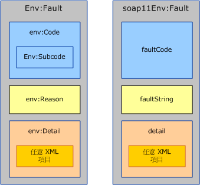
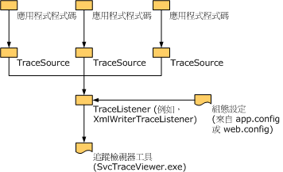

# <a name="handling-exceptions-and-faults"></a><span data-ttu-id="cf5ec-102">處理例外狀況和錯誤</span><span class="sxs-lookup"><span data-stu-id="cf5ec-102">Handling Exceptions and Faults</span></span>
<span data-ttu-id="cf5ec-103">例外狀況是用來在本機上傳送服務或用戶端實作內發生的錯誤。</span><span class="sxs-lookup"><span data-stu-id="cf5ec-103">Exceptions are used to communicate errors locally within the service or the client implementation.</span></span> <span data-ttu-id="cf5ec-104">另一方面，錯誤 (Fault) 是用來傳送跨越服務界限 (例如從伺服器到用戶端，反之亦然) 發生的錯誤 (Error)。</span><span class="sxs-lookup"><span data-stu-id="cf5ec-104">Faults, on the other hand, are used to communicate errors across service boundaries, such as from the server to the client or vice versa.</span></span> <span data-ttu-id="cf5ec-105">除了錯誤 (Fault) 以外，傳輸通道也經常會使用傳輸特定的機制來傳送傳輸層級的錯誤 (Error)。</span><span class="sxs-lookup"><span data-stu-id="cf5ec-105">In addition to faults, transport channels often use transport-specific mechanisms to communicate transport-level errors.</span></span> <span data-ttu-id="cf5ec-106">例如，HTTP 傳輸會使用 404 等狀態碼來傳送不存在的端點 URL (表示沒有端點可傳回錯誤)。</span><span class="sxs-lookup"><span data-stu-id="cf5ec-106">For example, HTTP transport uses status codes such as 404 to communicate a non-existing endpoint URL (there is no endpoint to send back a fault).</span></span> <span data-ttu-id="cf5ec-107">本文件包含的三個章節都提供指引給自訂通道作者。</span><span class="sxs-lookup"><span data-stu-id="cf5ec-107">This document consists of three sections that provide guidance to custom channel authors.</span></span> <span data-ttu-id="cf5ec-108">第一個章節會提供關於何時與如何定義及擲回例外狀況的指引，</span><span class="sxs-lookup"><span data-stu-id="cf5ec-108">The first section provides guidance on when and how to define and throw exceptions.</span></span> <span data-ttu-id="cf5ec-109">而第二個章節會提供關於產生和使用錯誤的指引，</span><span class="sxs-lookup"><span data-stu-id="cf5ec-109">The second section provides guidance around generating and consuming faults.</span></span> <span data-ttu-id="cf5ec-110">第三個章節則會說明如何提供追蹤資訊，以協助自訂通道的使用者針對執行中的應用程式進行疑難排解。</span><span class="sxs-lookup"><span data-stu-id="cf5ec-110">The third section explains how to provide trace information to aid the user of your custom channel in troubleshooting running applications.</span></span>  
  
## <a name="exceptions"></a><span data-ttu-id="cf5ec-111">例外狀況</span><span class="sxs-lookup"><span data-stu-id="cf5ec-111">Exceptions</span></span>  
 <span data-ttu-id="cf5ec-112">有兩件事，要牢記在心時擲回例外狀況,：第一次，它必須是類型，可讓使用者的例外狀況的適當地撰寫正確程式碼來回應。</span><span class="sxs-lookup"><span data-stu-id="cf5ec-112">There are two things to keep in mind when throwing an exception: First it has to be of a type that allows users to write correct code that can react appropriately to the exception.</span></span> <span data-ttu-id="cf5ec-113">其次，例外狀況必須提供足夠的資訊，讓使用者瞭解何處出錯、失敗的影響以及如何進行修正。</span><span class="sxs-lookup"><span data-stu-id="cf5ec-113">Second, it has to provide enough information for the user to understand what went wrong, the failure impact, and how to fix it.</span></span> <span data-ttu-id="cf5ec-114">下列各節提供的指導方針的例外狀況類型和 Windows Communication Foundation (WCF) 通道的訊息。</span><span class="sxs-lookup"><span data-stu-id="cf5ec-114">The following sections give guidance around exception types and messages for Windows Communication Foundation (WCF) channels.</span></span> <span data-ttu-id="cf5ec-115">在＜例外狀況的設計方針＞文件中，也有關於 .NET 例外狀況的一般指引。</span><span class="sxs-lookup"><span data-stu-id="cf5ec-115">There is also general guidance around exceptions in .NET in the Design Guidelines for Exceptions document.</span></span>  
  
### <a name="exception-types"></a><span data-ttu-id="cf5ec-116">例外狀況類型</span><span class="sxs-lookup"><span data-stu-id="cf5ec-116">Exception Types</span></span>  
 <span data-ttu-id="cf5ec-117">由通道擲回的所有例外狀況都必須是 <xref:System.TimeoutException?displayProperty=nameWithType>、<xref:System.ServiceModel.CommunicationException?displayProperty=nameWithType>，或是從 <xref:System.ServiceModel.CommunicationException> 衍生的類型。</span><span class="sxs-lookup"><span data-stu-id="cf5ec-117">All exceptions thrown by channels must be either a <xref:System.TimeoutException?displayProperty=nameWithType>, <xref:System.ServiceModel.CommunicationException?displayProperty=nameWithType>, or a type derived from <xref:System.ServiceModel.CommunicationException>.</span></span> <span data-ttu-id="cf5ec-118">系統可能也會擲回 <xref:System.ObjectDisposedException> 等例外狀況，不過這只是用來表示呼叫的程式碼誤用通道。</span><span class="sxs-lookup"><span data-stu-id="cf5ec-118">(Exceptions such as <xref:System.ObjectDisposedException> may also be thrown, but only to indicate that the calling code has misused the channel.</span></span> <span data-ttu-id="cf5ec-119">如果正確使用通道，它一定只會擲回指定的例外狀況。WCF 會提供七種例外狀況類型衍生自<xref:System.ServiceModel.CommunicationException>旨在用來讓通道。</span><span class="sxs-lookup"><span data-stu-id="cf5ec-119">If a channel is used correctly, it must only throw the given exceptions.) WCF provides seven exception types that derive from <xref:System.ServiceModel.CommunicationException> and are designed to be used by channels.</span></span> <span data-ttu-id="cf5ec-120">還有其他 <xref:System.ServiceModel.CommunicationException>衍生的例外狀況是設計用來讓系統的其他部分使用。</span><span class="sxs-lookup"><span data-stu-id="cf5ec-120">There are other <xref:System.ServiceModel.CommunicationException>-derived exceptions that are designed to be used by other parts of the system.</span></span> <span data-ttu-id="cf5ec-121">這些例外狀況類型包括：</span><span class="sxs-lookup"><span data-stu-id="cf5ec-121">These exception types are:</span></span>  
  
|<span data-ttu-id="cf5ec-122">例外狀況類型</span><span class="sxs-lookup"><span data-stu-id="cf5ec-122">Exception Type</span></span>|<span data-ttu-id="cf5ec-123">意義</span><span class="sxs-lookup"><span data-stu-id="cf5ec-123">Meaning</span></span>|<span data-ttu-id="cf5ec-124">內部例外狀況內容</span><span class="sxs-lookup"><span data-stu-id="cf5ec-124">Inner Exception Content</span></span>|<span data-ttu-id="cf5ec-125">復原策略</span><span class="sxs-lookup"><span data-stu-id="cf5ec-125">Recovery Strategy</span></span>|  
|--------------------|-------------|-----------------------------|-----------------------|  
|<xref:System.ServiceModel.AddressAlreadyInUseException>|<span data-ttu-id="cf5ec-126">指定用於接聽的端點位址已在使用中。</span><span class="sxs-lookup"><span data-stu-id="cf5ec-126">The endpoint address specified for listening is already in use.</span></span>|<span data-ttu-id="cf5ec-127">如果有的話，則提供造成此例外狀況之傳輸錯誤的詳細資料。</span><span class="sxs-lookup"><span data-stu-id="cf5ec-127">If present, provides more details about the transport error that caused this exception.</span></span> <span data-ttu-id="cf5ec-128">例如，</span><span class="sxs-lookup"><span data-stu-id="cf5ec-128">For example.</span></span> <span data-ttu-id="cf5ec-129"><xref:System.IO.PipeException>、<xref:System.Net.HttpListenerException> 或 <xref:System.Net.Sockets.SocketException>。</span><span class="sxs-lookup"><span data-stu-id="cf5ec-129"><xref:System.IO.PipeException>, <xref:System.Net.HttpListenerException>, or <xref:System.Net.Sockets.SocketException>.</span></span>|<span data-ttu-id="cf5ec-130">嘗試不同的位址。</span><span class="sxs-lookup"><span data-stu-id="cf5ec-130">Try a different address.</span></span>|  
|<xref:System.ServiceModel.AddressAccessDeniedException>|<span data-ttu-id="cf5ec-131">此處理序不可以存取指定用於接聽的端點位址。</span><span class="sxs-lookup"><span data-stu-id="cf5ec-131">The process is not allowed access to the endpoint address specified for listening.</span></span>|<span data-ttu-id="cf5ec-132">如果有的話，則提供造成此例外狀況之傳輸錯誤的詳細資料。</span><span class="sxs-lookup"><span data-stu-id="cf5ec-132">If present, provides more details about the transport error that caused this exception.</span></span> <span data-ttu-id="cf5ec-133">例如，<xref:System.IO.PipeException> 或 <xref:System.Net.HttpListenerException>。</span><span class="sxs-lookup"><span data-stu-id="cf5ec-133">For example, <xref:System.IO.PipeException>, or <xref:System.Net.HttpListenerException>.</span></span>|<span data-ttu-id="cf5ec-134">嘗試使用不同的認證。</span><span class="sxs-lookup"><span data-stu-id="cf5ec-134">Try with different credentials.</span></span>|  
|<xref:System.ServiceModel.CommunicationObjectFaultedException>|<span data-ttu-id="cf5ec-135"><xref:System.ServiceModel.ICommunicationObject>正處於 Faulted 狀態 (如需詳細資訊，請參閱 <<c2> [ 了解狀態變更](../../../../docs/framework/wcf/extending/understanding-state-changes.md))。</span><span class="sxs-lookup"><span data-stu-id="cf5ec-135">The <xref:System.ServiceModel.ICommunicationObject> being used is in the Faulted state (for more information, see [Understanding State Changes](../../../../docs/framework/wcf/extending/understanding-state-changes.md)).</span></span> <span data-ttu-id="cf5ec-136">請注意，當具有多個擱置呼叫的物件轉換為「錯誤」狀態時，只有一個呼叫會擲回與該失敗相關的例外狀況，而其餘的呼叫會擲回 <xref:System.ServiceModel.CommunicationObjectFaultedException>。</span><span class="sxs-lookup"><span data-stu-id="cf5ec-136">Note that when an object with multiple pending calls transitions to the Faulted state, only one call throws an exception that is related to the failure and the rest of the calls throw a <xref:System.ServiceModel.CommunicationObjectFaultedException>.</span></span> <span data-ttu-id="cf5ec-137">這個例外狀況的擲回原因，通常是因為應用程式忽略某個例外狀況，而且嘗試在可能不同於攔截原始例外狀況之執行緒上使用已經出錯的物件。</span><span class="sxs-lookup"><span data-stu-id="cf5ec-137">This exception is typically thrown because an application overlooks some exception and tries to use an already faulted object, possibly on a thread other than the one that caught the original exception.</span></span>|<span data-ttu-id="cf5ec-138">如果有的話，則提供此內部例外狀況的詳細資料。</span><span class="sxs-lookup"><span data-stu-id="cf5ec-138">If present provides details about the inner exception.</span></span>|<span data-ttu-id="cf5ec-139">建立新的物件。</span><span class="sxs-lookup"><span data-stu-id="cf5ec-139">Create a new object.</span></span> <span data-ttu-id="cf5ec-140">請注意，視當初造成 <xref:System.ServiceModel.ICommunicationObject> 出錯的原因而定，可能會需要進行其他工作來復原。</span><span class="sxs-lookup"><span data-stu-id="cf5ec-140">Note that depending on what caused the <xref:System.ServiceModel.ICommunicationObject> to fault in the first place, there may be other work required to recover.</span></span>|  
|<xref:System.ServiceModel.CommunicationObjectAbortedException>|<span data-ttu-id="cf5ec-141"><xref:System.ServiceModel.ICommunicationObject>中止正在使用 (如需詳細資訊，請參閱 <<c2> [ 了解狀態變更](../../../../docs/framework/wcf/extending/understanding-state-changes.md))。</span><span class="sxs-lookup"><span data-stu-id="cf5ec-141">The <xref:System.ServiceModel.ICommunicationObject> being used has been Aborted (for more information, see [Understanding State Changes](../../../../docs/framework/wcf/extending/understanding-state-changes.md)).</span></span> <span data-ttu-id="cf5ec-142">類似於 <xref:System.ServiceModel.CommunicationObjectFaultedException>，此例外狀況表示應用程式已對可能來自其他執行緒的物件呼叫 <xref:System.ServiceModel.ICommunicationObject.Abort%2A>，該物件因此而無法再使用。</span><span class="sxs-lookup"><span data-stu-id="cf5ec-142">Similar to <xref:System.ServiceModel.CommunicationObjectFaultedException>, his exception indicates the application has called <xref:System.ServiceModel.ICommunicationObject.Abort%2A> on the object, possibly from another thread, and the object is no longer usable for that reason.</span></span>|<span data-ttu-id="cf5ec-143">如果有的話，則提供此內部例外狀況的詳細資料。</span><span class="sxs-lookup"><span data-stu-id="cf5ec-143">If present provides details about the inner exception.</span></span>|<span data-ttu-id="cf5ec-144">建立新的物件。</span><span class="sxs-lookup"><span data-stu-id="cf5ec-144">Create a new object.</span></span> <span data-ttu-id="cf5ec-145">請注意，視當初造成 <xref:System.ServiceModel.ICommunicationObject> 中止的原因而定，可能會需要進行其他工作來復原。</span><span class="sxs-lookup"><span data-stu-id="cf5ec-145">Note that depending on what caused the <xref:System.ServiceModel.ICommunicationObject> to abort in the first place, there may be other work required to recover.</span></span>|  
|<xref:System.ServiceModel.EndpointNotFoundException>|<span data-ttu-id="cf5ec-146">目標遠端端點未接聽。</span><span class="sxs-lookup"><span data-stu-id="cf5ec-146">The target remote endpoint is not listening.</span></span> <span data-ttu-id="cf5ec-147">這可能是由於端點位址的某個部分不正確、無法解析，或是端點已關閉。</span><span class="sxs-lookup"><span data-stu-id="cf5ec-147">This can result from any part of the endpoint address being incorrect, irresolvable, or the endpoint being down.</span></span> <span data-ttu-id="cf5ec-148">範例包括 DNS 錯誤、無法使用佇列管理員，以及未執行服務。</span><span class="sxs-lookup"><span data-stu-id="cf5ec-148">Examples include DNS error, Queue Manager not available, and service not running.</span></span>|<span data-ttu-id="cf5ec-149">內部例外狀況會提供詳細資料 (通常是透過基礎傳輸)。</span><span class="sxs-lookup"><span data-stu-id="cf5ec-149">The inner exception provides details, typically from the underlying transport.</span></span>|<span data-ttu-id="cf5ec-150">嘗試不同的位址。</span><span class="sxs-lookup"><span data-stu-id="cf5ec-150">Try a different address.</span></span> <span data-ttu-id="cf5ec-151">或者，如果服務已關閉，傳送者可以稍後再試一次</span><span class="sxs-lookup"><span data-stu-id="cf5ec-151">Alternatively, the sender may wait a while and try again in case the service was down</span></span>|  
|<xref:System.ServiceModel.ProtocolException>|<span data-ttu-id="cf5ec-152">端點原則所描述的通訊協定在端點之間彼此不相符。</span><span class="sxs-lookup"><span data-stu-id="cf5ec-152">The communication protocols, as described by the endpoint’s policy, are mismatched between endpoints.</span></span> <span data-ttu-id="cf5ec-153">例如，框架處理內容類型不符，或是超出最大的訊息大小。</span><span class="sxs-lookup"><span data-stu-id="cf5ec-153">For example, framing content type mismatch or max message size exceeded.</span></span>|<span data-ttu-id="cf5ec-154">如果有的話，則提供特定通訊協定錯誤的詳細資料。</span><span class="sxs-lookup"><span data-stu-id="cf5ec-154">If present provides more information about the specific protocol error.</span></span> <span data-ttu-id="cf5ec-155">例如，如果錯誤原因是超過 MaxReceivedMessageSize，則 <xref:System.ServiceModel.QuotaExceededException> 是內部例外狀況。</span><span class="sxs-lookup"><span data-stu-id="cf5ec-155">For example, <xref:System.ServiceModel.QuotaExceededException> is the inner exception when the error cause is exceeding MaxReceivedMessageSize.</span></span>|<span data-ttu-id="cf5ec-156">復原：請確定傳送者和接收的通訊協定設定相符。</span><span class="sxs-lookup"><span data-stu-id="cf5ec-156">Recovery: Ensure sender and received protocol settings match.</span></span> <span data-ttu-id="cf5ec-157">若要這麼做，其中一個方法就是重新匯入服務端點的中繼資料 (原則)，並使用產生的繫結來重新建立通道。</span><span class="sxs-lookup"><span data-stu-id="cf5ec-157">One way to do this is to re-import the service endpoint’s metadata (policy) and use the generated binding to recreate the channel.</span></span>|  
|<xref:System.ServiceModel.ServerTooBusyException>|<span data-ttu-id="cf5ec-158">遠端端點正在接聽，但是尚未準備進行處理訊息。</span><span class="sxs-lookup"><span data-stu-id="cf5ec-158">The remote endpoint is listening but is not prepared to process messages.</span></span>|<span data-ttu-id="cf5ec-159">如果有的話，內部例外狀況就會提供 SOAP 錯誤 (Fault) 或傳輸層級錯誤 (Error) 的詳細資料。</span><span class="sxs-lookup"><span data-stu-id="cf5ec-159">If present, the inner Exception provides the SOAP fault or transport-level error details.</span></span>|<span data-ttu-id="cf5ec-160">復原：稍候並重新嘗試進行作業。</span><span class="sxs-lookup"><span data-stu-id="cf5ec-160">Recovery: Wait and retry the operation later.</span></span>|  
|<xref:System.TimeoutException>|<span data-ttu-id="cf5ec-161">作業無法在逾時期限內完成。</span><span class="sxs-lookup"><span data-stu-id="cf5ec-161">The operation failed to complete within the timeout period.</span></span>|<span data-ttu-id="cf5ec-162">可提供逾時的詳細資料。</span><span class="sxs-lookup"><span data-stu-id="cf5ec-162">May provide details about the timeout.</span></span>|<span data-ttu-id="cf5ec-163">稍候並重新嘗試進行作業。</span><span class="sxs-lookup"><span data-stu-id="cf5ec-163">Wait and retry the operation later.</span></span>|  
  
 <span data-ttu-id="cf5ec-164">只有在類型對應至不同於任何現有例外狀況類型的特定復原策略時，才會定義新的例外狀況類型。</span><span class="sxs-lookup"><span data-stu-id="cf5ec-164">Define a new exception type only if that type corresponds to a specific recovery strategy different from all of the existing exception types.</span></span> <span data-ttu-id="cf5ec-165">如果確實要定義新的例外狀況類型，該類型就必須衍生自 <xref:System.ServiceModel.CommunicationException> 或是其所衍生的一個類別。</span><span class="sxs-lookup"><span data-stu-id="cf5ec-165">If you do define a new exception type, it must derive from <xref:System.ServiceModel.CommunicationException> or one of its derived classes.</span></span>  
  
### <a name="exception-messages"></a><span data-ttu-id="cf5ec-166">例外狀況訊息</span><span class="sxs-lookup"><span data-stu-id="cf5ec-166">Exception Messages</span></span>  
 <span data-ttu-id="cf5ec-167">例外狀況訊息的對象是使用者而不是程式，所以這類訊息應該提供充分的資訊，協助使用者瞭解並解決問題。</span><span class="sxs-lookup"><span data-stu-id="cf5ec-167">Exception messages are targeted at the user not the program so they should provide sufficient information to help the user understand and solve the problem.</span></span> <span data-ttu-id="cf5ec-168">良好的例外狀況訊息包括三個重要部分：</span><span class="sxs-lookup"><span data-stu-id="cf5ec-168">The three essential parts of a good exception message are:</span></span>  
  
 <span data-ttu-id="cf5ec-169">發生的情況。</span><span class="sxs-lookup"><span data-stu-id="cf5ec-169">What happened.</span></span> <span data-ttu-id="cf5ec-170">使用與使用者切身操作相關的術語，提供清楚的問題描述。</span><span class="sxs-lookup"><span data-stu-id="cf5ec-170">Provide a clear description of the problem using terms that relate to the user’s experience.</span></span> <span data-ttu-id="cf5ec-171">例如，「無效的組態區段」就是不好的例外狀況訊息。</span><span class="sxs-lookup"><span data-stu-id="cf5ec-171">For example, a bad exception message would be "Invalid configuration section".</span></span> <span data-ttu-id="cf5ec-172">這個訊息會讓使用者猜測究竟是哪個組態區段不正確，以及為什麼不正確。</span><span class="sxs-lookup"><span data-stu-id="cf5ec-172">This leaves the user wondering which configuration section is incorrect and why it is incorrect.</span></span> <span data-ttu-id="cf5ec-173">增強的訊息會是 「 無效的組態區段\<customBinding > 」。</span><span class="sxs-lookup"><span data-stu-id="cf5ec-173">An improved message would be "Invalid configuration section \<customBinding>".</span></span> <span data-ttu-id="cf5ec-174">而更好的訊息會是「無法將名為 myTransport 的傳輸新增至名為 myBinding 的繫結，因為該繫結已經具有名為 myTransport 的傳輸」。</span><span class="sxs-lookup"><span data-stu-id="cf5ec-174">An even better message would be "Cannot add the transport named myTransport to the binding named myBinding because the binding already has a transport named myTransport".</span></span> <span data-ttu-id="cf5ec-175">這是非常仔細的訊息，使用者可以在應用程式組態檔中輕鬆識別這個訊息使用的術語和名稱。</span><span class="sxs-lookup"><span data-stu-id="cf5ec-175">This is a very specific message using terms and names that the user can easily identify in the application’s configuration file.</span></span> <span data-ttu-id="cf5ec-176">不過，這個訊息還漏掉了一些關鍵部分。</span><span class="sxs-lookup"><span data-stu-id="cf5ec-176">However, there are still a few key components missing.</span></span>  
  
 <span data-ttu-id="cf5ec-177">錯誤的重要性。</span><span class="sxs-lookup"><span data-stu-id="cf5ec-177">The significance of the error.</span></span> <span data-ttu-id="cf5ec-178">除非訊息清楚表示錯誤的意義，不然使用者可能會猜想這個錯誤是否為嚴重錯誤，或者是否可以忽略。</span><span class="sxs-lookup"><span data-stu-id="cf5ec-178">Unless the message states clearly what the error means, the user is likely to wonder whether it is a fatal error or if it can be ignored.</span></span> <span data-ttu-id="cf5ec-179">一般而言，訊息的開頭應該要提供錯誤的意義或重要性。</span><span class="sxs-lookup"><span data-stu-id="cf5ec-179">In general, messages should lead with the meaning or significance of the error.</span></span> <span data-ttu-id="cf5ec-180">為了改善前一個範例，則訊息可能會 「 ServiceHost 無法開啟設定錯誤所致：無法將名為 mytransport 的傳輸新增至繫結，因為名為 myBinding 的繫結已經具有名為 mytransport 的傳輸 」。</span><span class="sxs-lookup"><span data-stu-id="cf5ec-180">To improve the previous example, the message could be "ServiceHost failed to Open due to a configuration error: Cannot add the transport named myTransport to the binding named myBinding because the binding already has a transport named myTransport".</span></span>  
  
 <span data-ttu-id="cf5ec-181">使用者應該如何修正問題。</span><span class="sxs-lookup"><span data-stu-id="cf5ec-181">How the user should correct the problem.</span></span> <span data-ttu-id="cf5ec-182">訊息最重要的部分就是協助使用者修正問題，</span><span class="sxs-lookup"><span data-stu-id="cf5ec-182">The most important part of the message is helping the user fix the problem.</span></span> <span data-ttu-id="cf5ec-183">所以應該包含一些關於要檢查或修正哪些項目以補救問題的指引或提示。</span><span class="sxs-lookup"><span data-stu-id="cf5ec-183">The message should include some guidance or hints about what to check or fix to remedy the problem.</span></span> <span data-ttu-id="cf5ec-184">比方說，「 ServiceHost 無法開啟設定錯誤所致：無法將名為 mytransport 的傳輸新增至繫結，因為名為 myBinding 的繫結已經具有名為 mytransport 的傳輸。</span><span class="sxs-lookup"><span data-stu-id="cf5ec-184">For example, "ServiceHost failed to Open due to a configuration error: Cannot add the transport named myTransport to the binding named myBinding because the binding already has a transport named myTransport.</span></span> <span data-ttu-id="cf5ec-185">請確定繫結中只有一個傳輸」。</span><span class="sxs-lookup"><span data-stu-id="cf5ec-185">Please ensure there is only one transport in the binding".</span></span>  
  
## <a name="communicating-faults"></a><span data-ttu-id="cf5ec-186">傳送錯誤</span><span class="sxs-lookup"><span data-stu-id="cf5ec-186">Communicating Faults</span></span>  
 <span data-ttu-id="cf5ec-187">SOAP 1.1 和 SOAP 1.2 都會定義錯誤的特定結構。</span><span class="sxs-lookup"><span data-stu-id="cf5ec-187">SOAP 1.1 and SOAP 1.2 both define a specific structure for faults.</span></span> <span data-ttu-id="cf5ec-188">這兩種規格之間雖有某些差異，但一般而言，Message 和 MessageFault 類型都是用來建立和使用錯誤。</span><span class="sxs-lookup"><span data-stu-id="cf5ec-188">There are some differences between the two specifications but in general, the Message and MessageFault types are used to create and consume faults.</span></span>  
  
 <span data-ttu-id="cf5ec-189"></span><span class="sxs-lookup"><span data-stu-id="cf5ec-189"></span></span>  
<span data-ttu-id="cf5ec-190">SOAP 1.2 錯誤 (左邊) 和 SOAP 1.1 錯誤 (右邊)。</span><span class="sxs-lookup"><span data-stu-id="cf5ec-190">SOAP 1.2 Fault (left) and SOAP 1.1 Fault (right).</span></span> <span data-ttu-id="cf5ec-191">請注意，在 SOAP 1.1 中，只有「錯誤」項目符合命名空間。</span><span class="sxs-lookup"><span data-stu-id="cf5ec-191">Note that in SOAP 1.1 only the Fault element is namespace qualified.</span></span>  
  
 <span data-ttu-id="cf5ec-192">SOAP 會將錯誤訊息定義為只包含錯誤項目 (名稱為 `<env:Fault>` 的項目) 做為 `<env:Body>` 之子系的訊息。</span><span class="sxs-lookup"><span data-stu-id="cf5ec-192">SOAP defines a fault message as a message that contains only a fault element (an element whose name is `<env:Fault>`) as a child of `<env:Body>`.</span></span> <span data-ttu-id="cf5ec-193">此錯誤項目的內容在 SOAP 1.1 與 SOAP 1.2 之間稍有不同，如圖 1 所示。</span><span class="sxs-lookup"><span data-stu-id="cf5ec-193">The contents of the fault element differ slightly between SOAP 1.1 and SOAP 1.2 as shown in figure 1.</span></span> <span data-ttu-id="cf5ec-194">不過，<xref:System.ServiceModel.Channels.MessageFault?displayProperty=nameWithType> 類別會將這些差異都正規化到一個物件模型中：</span><span class="sxs-lookup"><span data-stu-id="cf5ec-194">However, the <xref:System.ServiceModel.Channels.MessageFault?displayProperty=nameWithType> class normalizes these differences into one object model:</span></span>  
  
```  
public abstract class MessageFault  
{  
    protected MessageFault();  
  
    public virtual string Actor { get; }  
    public virtual string Node { get; }  
    public static string DefaultAction { get; }  
    public abstract FaultCode Code { get; }  
    public abstract bool HasDetail { get; }  
    public abstract FaultReason Reason { get; }  
  
    public T GetDetail<T>();  
    public T GetDetail<T>( XmlObjectSerializer serializer);  
    public System.Xml.XmlDictionaryReader GetReaderAtDetailContents();  
  
    // other methods omitted  
}  
```  
  
 <span data-ttu-id="cf5ec-195">`Code` 屬性會對應到 `env:Code` (或是 SOAP 1.1 中的 `faultCode`)，並且會識別該錯誤的類型。</span><span class="sxs-lookup"><span data-stu-id="cf5ec-195">The `Code` property corresponds to the `env:Code` (or `faultCode` in SOAP 1.1) and identifies the type of the fault.</span></span> <span data-ttu-id="cf5ec-196">SOAP 1.2 針對 `faultCode` 定義五種可允許的值 (例如，Sender 和 Receiver)，並且定義可以包含任何子代碼值的 `Subcode` 項目 </span><span class="sxs-lookup"><span data-stu-id="cf5ec-196">SOAP 1.2 defines five allowable values for `faultCode` (for example, Sender and Receiver) and defines a `Subcode` element which can contain any subcode value.</span></span> <span data-ttu-id="cf5ec-197">(請參閱[SOAP 1.2 規格](https://go.microsoft.com/fwlink/?LinkId=95176)如可允許的錯誤代碼及其意義的清單。)SOAP 1.1 具有稍有不同的機制：它會定義四個`faultCode`可加以擴充，藉由定義全新的或使用點標記法建立更具體的值 （例如，用戶端和伺服器） `faultCodes`，例如 Client.Authentication。</span><span class="sxs-lookup"><span data-stu-id="cf5ec-197">(See the [SOAP 1.2 specification](https://go.microsoft.com/fwlink/?LinkId=95176) for the list of allowable fault codes and their meaning.) SOAP 1.1 has a slightly different mechanism: It defines four `faultCode` values (for example, Client and Server) that can be extended either by defining entirely new ones or by using the dot notation to create more specific `faultCodes`, for example, Client.Authentication.</span></span>  
  
 <span data-ttu-id="cf5ec-198">當您使用 MessageFault 來撰寫錯誤時，FaultCode.Name 和 FaultCode.Namespace 便會對應至 SOAP 1.2 `env:Code` 或 SOAP 1.1 `faultCode` 的名稱和命名空間。</span><span class="sxs-lookup"><span data-stu-id="cf5ec-198">When you use MessageFault to program faults, the FaultCode.Name and FaultCode.Namespace maps to the name and namespace of the SOAP 1.2 `env:Code` or the SOAP 1.1 `faultCode`.</span></span> <span data-ttu-id="cf5ec-199">在 SOAP 1.2 中，FaultCode.SubCode 會對應至 `env:Subcode`，若在 SOAP 1.1 則會對應至 null。</span><span class="sxs-lookup"><span data-stu-id="cf5ec-199">The FaultCode.SubCode maps to `env:Subcode` for SOAP 1.2 and is null for SOAP 1.1.</span></span>  
  
 <span data-ttu-id="cf5ec-200">如果需要以程式設計的方式來區別錯誤，您就應該建立新的錯誤子代碼 (如果是使用 SOAP 1.1 則是建立新的錯誤代碼)。</span><span class="sxs-lookup"><span data-stu-id="cf5ec-200">You should create new fault subcodes (or new fault codes if using SOAP 1.1) if it is interesting to programmatically distinguish a fault.</span></span> <span data-ttu-id="cf5ec-201">這種做法類似於建立新的例外狀況類型。</span><span class="sxs-lookup"><span data-stu-id="cf5ec-201">This is analogous to creating a new exception type.</span></span> <span data-ttu-id="cf5ec-202">您應該避免搭配 SOAP 1.1 錯誤代碼使用點標記法 </span><span class="sxs-lookup"><span data-stu-id="cf5ec-202">You should avoid using the dot notation with SOAP 1.1 fault codes.</span></span> <span data-ttu-id="cf5ec-203">( [WS-Basic profile](https://go.microsoft.com/fwlink/?LinkId=95177)也不建議使用錯誤代碼點標記法。)</span><span class="sxs-lookup"><span data-stu-id="cf5ec-203">(The [WS-I Basic Profile](https://go.microsoft.com/fwlink/?LinkId=95177) also discourages the use of the fault code dot notation.)</span></span>  
  
```  
public class FaultCode  
{  
    public FaultCode(string name);  
    public FaultCode(string name, FaultCode subCode);  
    public FaultCode(string name, string ns);  
    public FaultCode(string name, string ns, FaultCode subCode);  
  
    public bool IsPredefinedFault { get; }  
    public bool IsReceiverFault { get; }  
    public bool IsSenderFault { get; }  
    public string Name { get; }  
    public string Namespace { get; }  
    public FaultCode SubCode { get; }  
  
//  methods omitted  
  
}  
```  
  
 <span data-ttu-id="cf5ec-204">`Reason` 屬性會對應至 `env:Reason` (或是 SOAP 1.1 的 `faultString`)，這是人們可讀取的 (Human-Readable) 錯誤條件描述，類似於例外狀況的訊息。</span><span class="sxs-lookup"><span data-stu-id="cf5ec-204">The `Reason` property corresponds to the `env:Reason` (or `faultString` in SOAP 1.1) a human-readable description of the error condition analogous to an exception’s message.</span></span> <span data-ttu-id="cf5ec-205">`FaultReason` 類別 (以及 SOAP 的 `env:Reason/faultString`) 內建的支援適用在全球化時進行多種翻譯。</span><span class="sxs-lookup"><span data-stu-id="cf5ec-205">The `FaultReason` class (and SOAP `env:Reason/faultString`) has built-in support for having multiple translations in the interest of globalization.</span></span>  
  
```  
public class FaultReason  
{  
    public FaultReason(FaultReasonText translation);  
    public FaultReason(IEnumerable<FaultReasonText> translations);  
    public FaultReason(string text);  
  
    public SynchronizedReadOnlyCollection<FaultReasonText> Translations   
    {   
       get;   
    }  
  
 }  
```  
  
 <span data-ttu-id="cf5ec-206">錯誤詳細資料內容會公開在 MessageFault 使用各種方法，包括`GetDetail` \<T > 和`GetReaderAtDetailContents`（)。</span><span class="sxs-lookup"><span data-stu-id="cf5ec-206">The fault detail contents are exposed on MessageFault using various methods including the `GetDetail`\<T> and `GetReaderAtDetailContents`().</span></span> <span data-ttu-id="cf5ec-207">錯誤詳細資料是一種不透明項目，用來夾帶有關錯誤的其他詳細資料。</span><span class="sxs-lookup"><span data-stu-id="cf5ec-207">The fault detail is an opaque element for carrying additional detail about the fault.</span></span> <span data-ttu-id="cf5ec-208">如果您要隨錯誤夾帶某些任意的結構化詳細資料，這種資料就會非常有用。</span><span class="sxs-lookup"><span data-stu-id="cf5ec-208">This is useful if there is some arbitrary structured detail that you want to carry with the fault.</span></span>  
  
### <a name="generating-faults"></a><span data-ttu-id="cf5ec-209">產生錯誤</span><span class="sxs-lookup"><span data-stu-id="cf5ec-209">Generating Faults</span></span>  
 <span data-ttu-id="cf5ec-210">本節說明的程序會產生錯誤 (Fault)，以回應通道或由通道建立之訊息屬性中偵測到的錯誤 (Error) 狀況。</span><span class="sxs-lookup"><span data-stu-id="cf5ec-210">This section explains the process of generating a fault in response to an error condition detected in a channel or in a message property created by the channel.</span></span> <span data-ttu-id="cf5ec-211">例如，傳回錯誤以回應包含無效資料的要求訊息，這就是一種常見情況。</span><span class="sxs-lookup"><span data-stu-id="cf5ec-211">A typical example is sending back a fault in response to a request message that contains invalid data.</span></span>  
  
 <span data-ttu-id="cf5ec-212">產生錯誤時，自訂通道不應直接傳送錯誤，而是應該擲回例外狀況，並讓上一層決定是否要將該例外狀況轉換成錯誤，以及使用何種方法進行傳送。</span><span class="sxs-lookup"><span data-stu-id="cf5ec-212">When generating a fault, the custom channel should not send the fault directly, rather, it should throw an exception and let the layer above decide whether to convert that exception to a fault and how to send it.</span></span> <span data-ttu-id="cf5ec-213">為了促進這項轉換，通道應該提供可將自訂通道擲回的例外狀況轉換成適當錯誤的 `FaultConverter` 實作。</span><span class="sxs-lookup"><span data-stu-id="cf5ec-213">To aid in this conversion, the channel should provide a `FaultConverter` implementation that can convert the exception thrown by the custom channel to the appropriate fault.</span></span> <span data-ttu-id="cf5ec-214">`FaultConverter` 會定義為：</span><span class="sxs-lookup"><span data-stu-id="cf5ec-214">`FaultConverter` is defined as:</span></span>  
  
```  
public class FaultConverter  
{  
    public static FaultConverter GetDefaultFaultConverter(  
                                   MessageVersion version);  
    protected abstract bool OnTryCreateFaultMessage(  
                                   Exception exception,   
                                   out Message message);  
    public bool TryCreateFaultMessage(  
                                   Exception exception,   
                                   out Message message);  
}  
```  
  
 <span data-ttu-id="cf5ec-215">每個產生自訂錯誤的通道都必須實作 `FaultConverter`，並藉由呼叫 `GetProperty<FaultConverter>` 來傳回它。</span><span class="sxs-lookup"><span data-stu-id="cf5ec-215">Each channel that generates custom faults must implement `FaultConverter` and return it from a call to `GetProperty<FaultConverter>`.</span></span> <span data-ttu-id="cf5ec-216">自訂的 `OnTryCreateFaultMessage` 實作必須將例外狀況轉換成錯誤，或是委派到內部通道的 `FaultConverter`。</span><span class="sxs-lookup"><span data-stu-id="cf5ec-216">The custom `OnTryCreateFaultMessage` implementation must either convert the exception to a fault or delegate to the inner channel’s `FaultConverter`.</span></span> <span data-ttu-id="cf5ec-217">如果通道是一種傳輸它必須轉換例外狀況或委派給編碼器`FaultConverter`則是預設`FaultConverter`WCF 中提供。</span><span class="sxs-lookup"><span data-stu-id="cf5ec-217">If the channel is a transport it must either convert the exception or delegate to the encoder’s `FaultConverter` or the default `FaultConverter` provided in WCF .</span></span> <span data-ttu-id="cf5ec-218">預設的 `FaultConverter` 會轉換與 WS-Addressing 和 SOAP 指定之錯誤 (Fault) 訊息相對應的錯誤 (Error)。</span><span class="sxs-lookup"><span data-stu-id="cf5ec-218">The default `FaultConverter` converts errors corresponding to fault messages specified by WS-Addressing and SOAP.</span></span> <span data-ttu-id="cf5ec-219">以下是 `OnTryCreateFaultMessage` 實作的範例。</span><span class="sxs-lookup"><span data-stu-id="cf5ec-219">Here is an example `OnTryCreateFaultMessage` implementation.</span></span>  
  
```  
public override bool OnTryCreateFaultMessage(Exception exception,   
                                             out Message message)  
{  
    if (exception is ...)  
    {  
        message = ...;  
        return true;  
    }  
  
#if IMPLEMENTING_TRANSPORT_CHANNEL  
    FaultConverter encoderConverter =   
                    this.encoder.GetProperty<FaultConverter>();  
    if ((encoderConverter != null) &&               
        (encoderConverter.TryCreateFaultMessage(  
         exception, out message)))  
    {  
        return true;  
    }  
  
    FaultConverter defaultConverter =   
                   FaultConverter.GetDefaultFaultConverter(  
                   this.channel.messageVersion);  
    return defaultConverter.TryCreateFaultMessage(  
                   exception,   
                   out message);  
#else  
    FaultConverter inner =   
                   this.innerChannel.GetProperty<FaultConverter>();  
    if (inner != null)  
    {  
        return inner.TryCreateFaultMessage(exception, out message);  
    }  
    else  
    {  
        message = null;  
        return false;  
    }  
#endif  
}  
```  
  
 <span data-ttu-id="cf5ec-220">這個模式的含意在於，在各層之間針對要求錯誤 (Fault) 之錯誤 (Error) 情況而擲回的例外狀況必須包含足夠的資訊，讓對應的錯誤 (Fault) 產生器建立正確的錯誤 (Fault)。</span><span class="sxs-lookup"><span data-stu-id="cf5ec-220">An implication of this pattern is that exceptions thrown between layers for error conditions that require faults must contain enough information for the corresponding fault generator to create the correct fault.</span></span> <span data-ttu-id="cf5ec-221">身為自訂通道作者，如果還沒有某些例外狀況，您可以定義這些對應到不同錯誤情況的例外狀況類型。</span><span class="sxs-lookup"><span data-stu-id="cf5ec-221">As a custom channel author, you may define exception types that correspond to different fault conditions if such exceptions do not already exist.</span></span> <span data-ttu-id="cf5ec-222">請注意，周遊通道層的例外狀況應該傳送錯誤 (Error) 狀況，而非不透明的錯誤 (Fault) 資料。</span><span class="sxs-lookup"><span data-stu-id="cf5ec-222">Note that exceptions traversing channel layers should communicate the error condition rather than opaque fault data.</span></span>  
  
### <a name="fault-categories"></a><span data-ttu-id="cf5ec-223">錯誤分類</span><span class="sxs-lookup"><span data-stu-id="cf5ec-223">Fault Categories</span></span>  
 <span data-ttu-id="cf5ec-224">錯誤通常有三種分類：</span><span class="sxs-lookup"><span data-stu-id="cf5ec-224">There are generally three categories of faults:</span></span>  
  
1. <span data-ttu-id="cf5ec-225">遍佈在整個堆疊中的錯誤。</span><span class="sxs-lookup"><span data-stu-id="cf5ec-225">Faults that are pervasive throughout the entire stack.</span></span> <span data-ttu-id="cf5ec-226">這些錯誤可能會出現在通道堆疊的任何一層，例如 InvalidCardinalityAddressingException。</span><span class="sxs-lookup"><span data-stu-id="cf5ec-226">These faults could be encountered at any layer in the channel stack, for example InvalidCardinalityAddressingException.</span></span>  
  
2. <span data-ttu-id="cf5ec-227">可能出現在堆疊中特定層上方任何位置的錯誤，例如某些與流動的異動或安全性角色有關的錯誤。</span><span class="sxs-lookup"><span data-stu-id="cf5ec-227">Faults that can be encountered anywhere above a certain layer in the stack for example some errors that pertain to a flowed transaction or to security roles.</span></span>  
  
3. <span data-ttu-id="cf5ec-228">導向到堆疊中單一層的錯誤 (Fault) ，例如 WS-RM 序號錯誤 (Fault) 等錯誤 (Error)。</span><span class="sxs-lookup"><span data-stu-id="cf5ec-228">Faults that are directed at a single layer in the stack, for example errors like WS-RM sequence number faults.</span></span>  
  
 <span data-ttu-id="cf5ec-229">分類 1。</span><span class="sxs-lookup"><span data-stu-id="cf5ec-229">Category 1.</span></span> <span data-ttu-id="cf5ec-230">錯誤通常是指 WS-Addressing 和 SOAP 錯誤。</span><span class="sxs-lookup"><span data-stu-id="cf5ec-230">Faults are generally WS-Addressing and SOAP faults.</span></span> <span data-ttu-id="cf5ec-231">基底`FaultConverter`提供由 WCF 所對應至錯誤訊息的轉換錯誤所指定之 Ws-addressing 和 SOAP 因此您不需要處理這些例外狀況的轉換您自己的類別。</span><span class="sxs-lookup"><span data-stu-id="cf5ec-231">The base `FaultConverter` class provided by WCF converts errors corresponding to fault messages specified by WS-Addressing and SOAP so you do not have to handle conversion of these exceptions yourself.</span></span>  
  
 <span data-ttu-id="cf5ec-232">類別目錄 2。</span><span class="sxs-lookup"><span data-stu-id="cf5ec-232">Category 2.</span></span> <span data-ttu-id="cf5ec-233">當某一層將屬性加入到未完全使用與該層相關之訊息資訊的訊息時，就會出現錯誤。</span><span class="sxs-lookup"><span data-stu-id="cf5ec-233">Faults occur when a layer adds a property to the message that does not completely consume message information that pertains to that layer.</span></span> <span data-ttu-id="cf5ec-234">如果有較高層要求此訊息屬性更進一步處理訊息資訊時，可能就會偵測出錯誤 (Error)。</span><span class="sxs-lookup"><span data-stu-id="cf5ec-234">Errors may be detected later when a higher layer asks the message property to process message information further.</span></span> <span data-ttu-id="cf5ec-235">這類通道應該實作先前指定的 `GetProperty`，以便讓較高層能夠傳回正確的錯誤 (Fault)。</span><span class="sxs-lookup"><span data-stu-id="cf5ec-235">Such channels should implement the `GetProperty` specified previously to enable the higher layer to send back the correct fault.</span></span> <span data-ttu-id="cf5ec-236">TransactionMessageProperty 就是一個範例，</span><span class="sxs-lookup"><span data-stu-id="cf5ec-236">An example of this is the TransactionMessageProperty.</span></span> <span data-ttu-id="cf5ec-237">這個屬性會新增到訊息中，不會完整驗證標頭中的所有資料 (這麼做可能會涉及連絡分散式異動協調器 (DTC))。</span><span class="sxs-lookup"><span data-stu-id="cf5ec-237">This property is added to the message without fully validating all the data in the header (doing so may involve contacting the distributed transaction coordinator (DTC).</span></span>  
  
 <span data-ttu-id="cf5ec-238">分類 3。</span><span class="sxs-lookup"><span data-stu-id="cf5ec-238">Category 3.</span></span> <span data-ttu-id="cf5ec-239">錯誤只會由處理器中的單一層產生和傳送。</span><span class="sxs-lookup"><span data-stu-id="cf5ec-239">Faults are only generated and sent by a single layer in the processor.</span></span> <span data-ttu-id="cf5ec-240">因此，所有的例外狀況都包含在該層內部。</span><span class="sxs-lookup"><span data-stu-id="cf5ec-240">Therefore all the exceptions are contained within the layer.</span></span> <span data-ttu-id="cf5ec-241">若要改進通道間的一致性並簡化維護程序，您的自訂通道應該使用先前指定的模式來產生內部錯誤的錯誤訊息。</span><span class="sxs-lookup"><span data-stu-id="cf5ec-241">To improve consistency among channels and ease maintenance, your custom channel should use the pattern specified previously to generate fault messages even for internal faults.</span></span>  
  
### <a name="interpreting-received-faults"></a><span data-ttu-id="cf5ec-242">解譯收到的錯誤</span><span class="sxs-lookup"><span data-stu-id="cf5ec-242">Interpreting Received Faults</span></span>  
 <span data-ttu-id="cf5ec-243">本節提供在接收錯誤訊息時產生適當例外狀況的指引。</span><span class="sxs-lookup"><span data-stu-id="cf5ec-243">This section provides guidance for generating the appropriate exception when receiving a fault message.</span></span> <span data-ttu-id="cf5ec-244">以下是在堆疊中處理各層訊息的決策樹：</span><span class="sxs-lookup"><span data-stu-id="cf5ec-244">The decision tree for processing a message at every layer in the stack is as follows:</span></span>  
  
1. <span data-ttu-id="cf5ec-245">如果此層將訊息視為無效，則應該進行其「無效訊息」處理。</span><span class="sxs-lookup"><span data-stu-id="cf5ec-245">If the layer considers the message to be invalid, the layer should do its ‘invalid message’ processing.</span></span> <span data-ttu-id="cf5ec-246">這類處理專用於此層，不過可以包含捨棄訊息、追蹤，或是擲回轉換為錯誤的例外狀況。</span><span class="sxs-lookup"><span data-stu-id="cf5ec-246">Such processing is specific to the layer but could include dropping the message, tracing, or throwing an exception that gets converted to a fault.</span></span> <span data-ttu-id="cf5ec-247">範例包括接收未適當保護安全之訊息的安全性，或是接收具序號錯誤之訊息的 RM。</span><span class="sxs-lookup"><span data-stu-id="cf5ec-247">Examples include security receiving a message that is not secured properly, or RM receiving a message with a bad sequence number.</span></span>  
  
2. <span data-ttu-id="cf5ec-248">否則，如果訊息是專門套用至此層的錯誤訊息，而且訊息在此層的互動範圍以外不具任何意義，則此層應該要處理錯誤條件。</span><span class="sxs-lookup"><span data-stu-id="cf5ec-248">Otherwise, if the message is a fault message that applies specifically to the layer, and the message is not meaningful outside the layer’s interaction, the layer should handle the error condition.</span></span> <span data-ttu-id="cf5ec-249">「RM 序列遭拒」錯誤就是一個範例，這個錯誤對 RM 通道上面的層級沒有任何意義，這表示將 RM 通道判定為失敗並將從擱置作業擲回。</span><span class="sxs-lookup"><span data-stu-id="cf5ec-249">An example of this is an RM Sequence Refused fault that is meaningless to layers above the RM channel and that implies faulting the RM channel and throwing from pending operations.</span></span>  
  
3. <span data-ttu-id="cf5ec-250">否則，訊息應該從 Request() 或 Receive() 傳回。</span><span class="sxs-lookup"><span data-stu-id="cf5ec-250">Otherwise, the message should be returned from Request() or Receive().</span></span> <span data-ttu-id="cf5ec-251">例如，此層辨識出該錯誤，但錯誤只表示要求失敗，沒有表示將通道判定為失敗並將從擱置作業擲回。</span><span class="sxs-lookup"><span data-stu-id="cf5ec-251">This includes cases where the layer recognizes the fault, but the fault just indicates that a request failed and does not imply faulting the channel and throwing from pending operations.</span></span> <span data-ttu-id="cf5ec-252">若要改進這種情況下的可用性，此層應該實作 `GetProperty<FaultConverter>` 並傳回 `FaultConverter` 衍生類別，此類別可藉由覆寫 `OnTryCreateException` 將錯誤轉換成例外狀況。</span><span class="sxs-lookup"><span data-stu-id="cf5ec-252">To improve usability in such a case, the layer should implement `GetProperty<FaultConverter>` and return a `FaultConverter` derived class that can convert the fault to an exception by overriding `OnTryCreateException`.</span></span>  
  
 <span data-ttu-id="cf5ec-253">下列物件模型支援將訊息轉換成例外狀況：</span><span class="sxs-lookup"><span data-stu-id="cf5ec-253">The following object model supports converting messages to exceptions:</span></span>  
  
```  
public class FaultConverter  
{  
    public static FaultConverter GetDefaultFaultConverter(  
                                  MessageVersion version);  
    protected abstract bool OnTryCreateException(  
                                 Message message,   
                                 MessageFault fault,   
                                 out Exception exception);  
    public bool TryCreateException(  
                                 Message message,   
                                 MessageFault fault,   
                                 out Exception exception);  
}  
```  
  
 <span data-ttu-id="cf5ec-254">通道層可以實作 `GetProperty<FaultConverter>`，以支援將錯誤訊息轉換成例外狀況。</span><span class="sxs-lookup"><span data-stu-id="cf5ec-254">A channel layer can implement `GetProperty<FaultConverter>` to support converting fault messages to exceptions.</span></span> <span data-ttu-id="cf5ec-255">若要這樣做，請覆寫 `OnTryCreateException` 並檢查錯誤訊息。</span><span class="sxs-lookup"><span data-stu-id="cf5ec-255">To do so, override `OnTryCreateException` and inspect the fault message.</span></span> <span data-ttu-id="cf5ec-256">如果辨認成功就進行轉換，否則，要求內部通道來進行轉換。</span><span class="sxs-lookup"><span data-stu-id="cf5ec-256">If recognized, do the conversion, otherwise ask the inner channel to convert it.</span></span> <span data-ttu-id="cf5ec-257">傳輸通道應該要委派到 `FaultConverter.GetDefaultFaultConverter`，以取得預設的 SOAP/WS-Addressing FaultConverter。</span><span class="sxs-lookup"><span data-stu-id="cf5ec-257">Transport channels should delegate to `FaultConverter.GetDefaultFaultConverter` to get the default SOAP/WS-Addressing FaultConverter.</span></span>  
  
 <span data-ttu-id="cf5ec-258">一般的實作如下所示：</span><span class="sxs-lookup"><span data-stu-id="cf5ec-258">A typical implementation looks like this:</span></span>  
  
```  
public override bool OnTryCreateException(  
                            Message message,   
                            MessageFault fault,   
                            out Exception exception)  
{  
    if (message.Action == "...")  
    {  
        exception = ...;  
        return true;  
    }  
    // OR  
    if ((fault.Code.Name == "...") && (fault.Code.Namespace == "..."))  
    {  
        exception = ...;  
        return true;  
    }  
  
    if (fault.IsMustUnderstand)  
    {  
        if (fault.WasHeaderNotUnderstood(  
                   message.Headers, "...", "..."))  
        {  
            exception = new ProtocolException(...);  
            return true;  
        }  
    }  
  
#if IMPLEMENTING_TRANSPORT_CHANNEL  
    FaultConverter encoderConverter =   
              this.encoder.GetProperty<FaultConverter>();  
    if ((encoderConverter != null) &&   
        (encoderConverter.TryCreateException(  
                              message, fault, out exception)))  
    {  
        return true;  
    }  
  
    FaultConverter defaultConverter =  
             FaultConverter.GetDefaultFaultConverter(  
                             this.channel.messageVersion);  
    return defaultConverter.TryCreateException(  
                             message, fault, out exception);  
#else  
    FaultConverter inner =   
                    this.innerChannel.GetProperty<FaultConverter>();  
    if (inner != null)  
    {  
        return inner.TryCreateException(message, fault, out exception);  
    }  
    else  
    {  
        exception = null;  
        return false;  
    }  
#endif  
}  
```  
  
 <span data-ttu-id="cf5ec-259">如果是復原情形不同的特定錯誤情況，可考慮定義 `ProtocolException` 的衍生類別。</span><span class="sxs-lookup"><span data-stu-id="cf5ec-259">For specific fault conditions that have distinct recovery scenarios, consider defining a derived class of `ProtocolException`.</span></span>  
  
### <a name="mustunderstand-processing"></a><span data-ttu-id="cf5ec-260">MustUnderstand 處理</span><span class="sxs-lookup"><span data-stu-id="cf5ec-260">MustUnderstand Processing</span></span>  
 <span data-ttu-id="cf5ec-261">SOAP 會定義一般錯誤，表示接收者不瞭解必要標頭。</span><span class="sxs-lookup"><span data-stu-id="cf5ec-261">SOAP defines a general fault for signaling that a required header was not understood by the receiver.</span></span> <span data-ttu-id="cf5ec-262">這個錯誤稱為 `mustUnderstand` 錯誤。</span><span class="sxs-lookup"><span data-stu-id="cf5ec-262">This fault is known as the `mustUnderstand` fault.</span></span> <span data-ttu-id="cf5ec-263">在 WCF 中，自訂通道永遠不會產生`mustUnderstand`錯誤。</span><span class="sxs-lookup"><span data-stu-id="cf5ec-263">In WCF, custom channels never generate `mustUnderstand` faults.</span></span> <span data-ttu-id="cf5ec-264">相反地，WCF 發送器，也就是位於 WCF 通訊堆疊的頂端，會檢查，查看所有標頭已標記為 MustUndestand = true 已了解基礎堆疊。</span><span class="sxs-lookup"><span data-stu-id="cf5ec-264">Instead, the WCF Dispatcher, which is located at the top of the WCF communication stack, checks to see that all headers that were marked as MustUndestand=true were understood by the underlying stack.</span></span> <span data-ttu-id="cf5ec-265">如果全部都不瞭解，此時就會產生 `mustUnderstand` 錯誤。</span><span class="sxs-lookup"><span data-stu-id="cf5ec-265">If any were not understood, a `mustUnderstand` fault is generated at that point.</span></span> <span data-ttu-id="cf5ec-266">使用者可以選擇關閉這個 `mustUnderstand` 處理，然後讓應用程式接收所有訊息標頭。</span><span class="sxs-lookup"><span data-stu-id="cf5ec-266">(The user can choose to turn off this `mustUnderstand` processing and have the application receive all message headers.</span></span> <span data-ttu-id="cf5ec-267">在這種情況下，應用程式便會負責執行 `mustUnderstand` 處理。產生的錯誤包括 NotUnderstood 標頭，其中包含堆疊不瞭解其 MustUnderstand=true 之標頭的名稱。</span><span class="sxs-lookup"><span data-stu-id="cf5ec-267">In that case the application is responsible for performing `mustUnderstand` processing.) The generated fault includes a NotUnderstood header that contains the names of all headers with MustUnderstand=true that were not understood.</span></span>  
  
 <span data-ttu-id="cf5ec-268">如果您的通訊協定通道傳送 MustUnderstand=true 的自訂標頭，並且收到 `mustUnderstand` 錯誤，則通道必須瞭解其傳送的標頭是否為該錯誤的成因。</span><span class="sxs-lookup"><span data-stu-id="cf5ec-268">If your protocol channel sends a custom header with MustUnderstand=true and receives a `mustUnderstand` fault, it must figure out whether that fault is due to the header it sent.</span></span> <span data-ttu-id="cf5ec-269">`MessageFault` 類別上有兩個成員適用於這種情況：</span><span class="sxs-lookup"><span data-stu-id="cf5ec-269">There are two members on the `MessageFault` class that are useful for this:</span></span>  
  
```  
public class MessageFault  
{  
    ...  
    public bool IsMustUnderstandFault { get; }  
    public static bool WasHeaderNotUnderstood(MessageHeaders headers,   
        string name, string ns) { }  
    ...  
  
}  
```  
  
 <span data-ttu-id="cf5ec-270">如果錯誤是 `IsMustUnderstandFault` 錯誤，則 `true` 會傳回 `mustUnderstand`。</span><span class="sxs-lookup"><span data-stu-id="cf5ec-270">`IsMustUnderstandFault` returns `true` if the fault is a `mustUnderstand` fault.</span></span> <span data-ttu-id="cf5ec-271">如果具有指定名稱和命名空間的標頭是當做 NotUnderstood 標頭加入到錯誤中，`WasHeaderNotUnderstood` 則會傳回 `true`。</span><span class="sxs-lookup"><span data-stu-id="cf5ec-271">`WasHeaderNotUnderstood` returns `true` if the header with the specified name and namespace is included in the fault as a NotUnderstood header.</span></span>  <span data-ttu-id="cf5ec-272">否則，它會傳回 `false`。</span><span class="sxs-lookup"><span data-stu-id="cf5ec-272">Otherwise, it returns `false`.</span></span>  
  
 <span data-ttu-id="cf5ec-273">如果通道發出標記為 MustUnderstand = true 的標頭，則該層應同時實作「例外狀況產生 API」模式，而且應將該標頭造成的 `mustUnderstand` 錯誤轉換成更有用的例外狀況 (如前述)。</span><span class="sxs-lookup"><span data-stu-id="cf5ec-273">If a channel emits a header that is marked MustUnderstand = true, then that layer should also implement the Exception Generation API pattern and should convert `mustUnderstand` faults caused by that header to a more useful exception as described previously.</span></span>  
  
## <a name="tracing"></a><span data-ttu-id="cf5ec-274">追蹤</span><span class="sxs-lookup"><span data-stu-id="cf5ec-274">Tracing</span></span>  
 <span data-ttu-id="cf5ec-275">.NET Framework 提供一種追蹤程式執行的機制，如果無法直接附加偵錯工具並逐步執行程式碼，該機制有助於診斷實際執行應用程式或間歇性問題。</span><span class="sxs-lookup"><span data-stu-id="cf5ec-275">The .NET Framework provides a mechanism to trace program execution as a way to aid diagnosing production applications or intermittent problems where it is not possible to just attach a debugger and step through the code.</span></span> <span data-ttu-id="cf5ec-276">此機制的核心元件位於 <xref:System.Diagnostics?displayProperty=nameWithType> 命名空間，而且包含下列各項：</span><span class="sxs-lookup"><span data-stu-id="cf5ec-276">The core components of this mechanism are in the <xref:System.Diagnostics?displayProperty=nameWithType> namespace and consist of:</span></span>  
  
- <span data-ttu-id="cf5ec-277"><xref:System.Diagnostics.TraceSource?displayProperty=nameWithType>，這是要寫入之追蹤資訊的來源；<xref:System.Diagnostics.TraceListener?displayProperty=nameWithType>，這是具體接聽項的抽象基底類別，這些具體接聽項會從 <xref:System.Diagnostics.TraceSource> 接收要追蹤的資訊，並將其輸出到接聽項特定的目的端。</span><span class="sxs-lookup"><span data-stu-id="cf5ec-277"><xref:System.Diagnostics.TraceSource?displayProperty=nameWithType>, which is the source of trace information to be written, <xref:System.Diagnostics.TraceListener?displayProperty=nameWithType>, which is an abstract base class for concrete listeners that receive the information to be traced from the <xref:System.Diagnostics.TraceSource> and output it to a listener-specific destination.</span></span> <span data-ttu-id="cf5ec-278">例如，<xref:System.Diagnostics.XmlWriterTraceListener> 會將追蹤資訊輸出到 XML 檔。</span><span class="sxs-lookup"><span data-stu-id="cf5ec-278">For example, <xref:System.Diagnostics.XmlWriterTraceListener> outputs trace information to an XML file.</span></span> <span data-ttu-id="cf5ec-279">最後一項是 <xref:System.Diagnostics.TraceSwitch?displayProperty=nameWithType>，它可讓應用程式使用者控制追蹤詳細資訊，而且通常是在組態中指定。</span><span class="sxs-lookup"><span data-stu-id="cf5ec-279">Finally, <xref:System.Diagnostics.TraceSwitch?displayProperty=nameWithType>, which lets the application user control the tracing verbosity and is typically specified in configuration.</span></span>  
  
- <span data-ttu-id="cf5ec-280">除了核心元件，您可以使用[Service Trace Viewer Tool (SvcTraceViewer.exe)](../../../../docs/framework/wcf/service-trace-viewer-tool-svctraceviewer-exe.md)來檢視和搜尋 WCF 追蹤。</span><span class="sxs-lookup"><span data-stu-id="cf5ec-280">In addition to the core components, you can use the [Service Trace Viewer Tool (SvcTraceViewer.exe)](../../../../docs/framework/wcf/service-trace-viewer-tool-svctraceviewer-exe.md) to view and search WCF traces.</span></span> <span data-ttu-id="cf5ec-281">此工具專為 WCF 所產生，並寫出使用的追蹤檔案<xref:System.Diagnostics.XmlWriterTraceListener>。</span><span class="sxs-lookup"><span data-stu-id="cf5ec-281">The tool is designed specifically for trace files generated by WCF and written out using <xref:System.Diagnostics.XmlWriterTraceListener>.</span></span> <span data-ttu-id="cf5ec-282">下圖顯示與追蹤有關的各種元件。</span><span class="sxs-lookup"><span data-stu-id="cf5ec-282">The following figure shows the various components involved in tracing.</span></span>  
  
 <span data-ttu-id="cf5ec-283"></span><span class="sxs-lookup"><span data-stu-id="cf5ec-283"></span></span>  
  
### <a name="tracing-from-a-custom-channel"></a><span data-ttu-id="cf5ec-284">從自訂通道追蹤</span><span class="sxs-lookup"><span data-stu-id="cf5ec-284">Tracing from a Custom Channel</span></span>  
 <span data-ttu-id="cf5ec-285">當偵錯工具無法附加到執行中的應用程式時，自訂通道便應該寫出追蹤訊息以協助診斷問題。</span><span class="sxs-lookup"><span data-stu-id="cf5ec-285">Custom channels should write out trace messages to assist in diagnosing problems when it is not possible to attach a debugger to the running application.</span></span> <span data-ttu-id="cf5ec-286">這牽涉到兩個高層級的工作：具現化<xref:System.Diagnostics.TraceSource>並呼叫其方法來寫入追蹤。</span><span class="sxs-lookup"><span data-stu-id="cf5ec-286">This involves two high level tasks: Instantiating a <xref:System.Diagnostics.TraceSource> and calling its methods to write traces.</span></span>  
  
 <span data-ttu-id="cf5ec-287">當具現化 <xref:System.Diagnostics.TraceSource> 時，您所指定的字串會成為該來源的名稱。</span><span class="sxs-lookup"><span data-stu-id="cf5ec-287">When instantiating a <xref:System.Diagnostics.TraceSource>, the string you specify becomes the name of that source.</span></span> <span data-ttu-id="cf5ec-288">這個名稱是用來設定 (啟用/停用/設定追蹤層級) 追蹤來源，</span><span class="sxs-lookup"><span data-stu-id="cf5ec-288">This name is used to configure (enable/disable/set tracing level) the trace source.</span></span> <span data-ttu-id="cf5ec-289">同時也會出現在追蹤輸出本身。</span><span class="sxs-lookup"><span data-stu-id="cf5ec-289">It also appears in the trace output itself.</span></span> <span data-ttu-id="cf5ec-290">自訂通道應該使用唯一來源名稱，以利追蹤輸出的讀取器瞭解該追蹤資訊的來源為何。</span><span class="sxs-lookup"><span data-stu-id="cf5ec-290">Custom channels should use a unique source name to help readers of the trace output understand where the trace information comes from.</span></span> <span data-ttu-id="cf5ec-291">使用將資訊寫入成為追蹤來源名稱之組件的名稱是常見的做法。</span><span class="sxs-lookup"><span data-stu-id="cf5ec-291">Using the name of the assembly that is writing the information as the name of the trace source is the common practice.</span></span> <span data-ttu-id="cf5ec-292">例如，WCF 會使用 System.ServiceModel 做為追蹤來源寫入從 System.ServiceModel 組件的資訊。</span><span class="sxs-lookup"><span data-stu-id="cf5ec-292">For example, WCF uses System.ServiceModel as the trace source for information written from the System.ServiceModel assembly.</span></span>  
  
 <span data-ttu-id="cf5ec-293">有了追蹤來源之後，您可以呼叫其 <xref:System.Diagnostics.TraceSource.TraceData%2A>、<xref:System.Diagnostics.TraceSource.TraceEvent%2A> 或 <xref:System.Diagnostics.TraceSource.TraceInformation%2A> 方法，將追蹤項目寫入到追蹤接聽項中。</span><span class="sxs-lookup"><span data-stu-id="cf5ec-293">Once you have a trace source, you call its <xref:System.Diagnostics.TraceSource.TraceData%2A>, <xref:System.Diagnostics.TraceSource.TraceEvent%2A>, or <xref:System.Diagnostics.TraceSource.TraceInformation%2A> methods to write trace entries to the trace listeners.</span></span> <span data-ttu-id="cf5ec-294">針對每一個您寫入的追蹤項目，您都需要將事件的型別分類為 <xref:System.Diagnostics.TraceEventType> 中定義的其中一個事件型別。</span><span class="sxs-lookup"><span data-stu-id="cf5ec-294">For each trace entry you write, you need to classify the type of event as one of the event types defined in <xref:System.Diagnostics.TraceEventType>.</span></span> <span data-ttu-id="cf5ec-295">這個分類和組態中的追蹤層級設定會判斷追蹤項目是否要輸出到接聽項中。</span><span class="sxs-lookup"><span data-stu-id="cf5ec-295">This classification and the trace level setting in configuration determine whether the trace entry is output to the listener.</span></span> <span data-ttu-id="cf5ec-296">例如，如果將組態中的追蹤層級設定為 `Warning`，就可以寫入 `Warning`、`Error` 和 `Critical` 追蹤項目，但會封鎖「資訊」和「詳細資訊」項目。</span><span class="sxs-lookup"><span data-stu-id="cf5ec-296">For example, setting the trace level in configuration to `Warning` allows `Warning`, `Error` and `Critical` trace entries to be written but blocks Information and Verbose entries.</span></span> <span data-ttu-id="cf5ec-297">以下是具現化追蹤來源，並且在資訊層級寫出項目的範例：</span><span class="sxs-lookup"><span data-stu-id="cf5ec-297">Here is an example of instantiating a trace source and writing out an entry at Information level:</span></span>  
  
```  
using System.Diagnostics;  
//...  
TraceSource udpSource=new TraceSource("Microsoft.Samples.Udp");  
//...  
udpsource.TraceInformation("UdpInputChannel received a message");  
```  
  
> [!IMPORTANT]
>  <span data-ttu-id="cf5ec-298">強烈建議您指定自訂通道的唯一追蹤來源名稱，以利追蹤輸出讀取器瞭解輸出的來源。</span><span class="sxs-lookup"><span data-stu-id="cf5ec-298">It is highly recommended that you specify a trace source name that is unique to your custom channel to help trace output readers understand where the output came from.</span></span>  
  
#### <a name="integrating-with-the-trace-viewer"></a><span data-ttu-id="cf5ec-299">整合追蹤檢視器</span><span class="sxs-lookup"><span data-stu-id="cf5ec-299">Integrating with the Trace Viewer</span></span>  
 <span data-ttu-id="cf5ec-300">您的通道所產生的追蹤可能會讀取的格式中的輸出[Service Trace Viewer Tool (SvcTraceViewer.exe)](../../../../docs/framework/wcf/service-trace-viewer-tool-svctraceviewer-exe.md)使用<xref:System.Diagnostics.XmlWriterTraceListener?displayProperty=nameWithType>為追蹤接聽程式。</span><span class="sxs-lookup"><span data-stu-id="cf5ec-300">Traces generated by your channel can be output in a format readable by the [Service Trace Viewer Tool (SvcTraceViewer.exe)](../../../../docs/framework/wcf/service-trace-viewer-tool-svctraceviewer-exe.md) by using <xref:System.Diagnostics.XmlWriterTraceListener?displayProperty=nameWithType> as the trace listener.</span></span> <span data-ttu-id="cf5ec-301">這並不是身為通道開發人員的您所需要做的事情，</span><span class="sxs-lookup"><span data-stu-id="cf5ec-301">This is not something you, as the channel developer, need to do.</span></span> <span data-ttu-id="cf5ec-302">反而是需要在應用程式組態檔中設定這個追蹤接聽項的應用程式使用者 (或是針對應用程式進行疑難排解的人員)，才需要做這件事。</span><span class="sxs-lookup"><span data-stu-id="cf5ec-302">Rather, it is the application user (or the person troubleshooting the application) that needs to configure this trace listener in the application’s configuration file.</span></span> <span data-ttu-id="cf5ec-303">例如，下列組態會從 <xref:System.ServiceModel?displayProperty=nameWithType> 和 `Microsoft.Samples.Udp` 兩者，將追蹤資訊輸出到名為 `TraceEventsFile.e2e` 的檔案中：</span><span class="sxs-lookup"><span data-stu-id="cf5ec-303">For example, the following configuration outputs trace information from both <xref:System.ServiceModel?displayProperty=nameWithType> and `Microsoft.Samples.Udp` to the file named `TraceEventsFile.e2e`:</span></span>  
  
```xml  
<configuration>  
  <system.diagnostics>  
    <sources>  
      <!-- configure System.ServiceModel trace source -->  
      <source name="System.ServiceModel" switchValue="Verbose"   
              propagateActivity="true">  
        <listeners>  
          <add name="e2e" />  
        </listeners>  
      </source>  
      <!-- configure Microsoft.Samples.Udp trace source -->  
      <source name="Microsoft.Samples.Udp" switchValue="Verbose" >  
        <listeners>  
          <add name="e2e" />  
        </listeners>  
      </source>  
    </sources>  
    <!--   
    Define a shared trace listener that outputs to TraceFile.e2e  
    The listener name is e2e   
    -->  
    <sharedListeners>  
      <add name="e2e" type="System.Diagnostics.XmlWriterTraceListener"  
        initializeData=".\TraceFile.e2e"/>  
    </sharedListeners>  
    <trace autoflush="true" />  
  </system.diagnostics>  
</configuration>  
```  
  
#### <a name="tracing-structured-data"></a><span data-ttu-id="cf5ec-304">追蹤結構化資料</span><span class="sxs-lookup"><span data-stu-id="cf5ec-304">Tracing Structured Data</span></span>  
 <span data-ttu-id="cf5ec-305"><xref:System.Diagnostics.TraceSource?displayProperty=nameWithType> 的 <xref:System.Diagnostics.TraceSource.TraceData%2A> 方法會使用包含在追蹤項目中的一或多個物件。</span><span class="sxs-lookup"><span data-stu-id="cf5ec-305"><xref:System.Diagnostics.TraceSource?displayProperty=nameWithType> has a <xref:System.Diagnostics.TraceSource.TraceData%2A> method that takes one or more objects that are to be included in the trace entry.</span></span> <span data-ttu-id="cf5ec-306">一般而言，會針對每個物件呼叫 <xref:System.Object.ToString%2A?displayProperty=nameWithType> 方法，並將產生的字串寫入成為追蹤項目的一部分。</span><span class="sxs-lookup"><span data-stu-id="cf5ec-306">In general, the <xref:System.Object.ToString%2A?displayProperty=nameWithType> method is called on each object and the resulting string is written as part of the trace entry.</span></span> <span data-ttu-id="cf5ec-307">使用 <xref:System.Diagnostics.XmlWriterTraceListener?displayProperty=nameWithType> 輸出追蹤時，您可以將 <xref:System.Xml.XPath.IXPathNavigable?displayProperty=nameWithType> 當做資料物件傳遞到 <xref:System.Diagnostics.TraceSource.TraceData%2A>。</span><span class="sxs-lookup"><span data-stu-id="cf5ec-307">When using <xref:System.Diagnostics.XmlWriterTraceListener?displayProperty=nameWithType> to output traces, you can pass an <xref:System.Xml.XPath.IXPathNavigable?displayProperty=nameWithType> as the data object to <xref:System.Diagnostics.TraceSource.TraceData%2A>.</span></span> <span data-ttu-id="cf5ec-308">產生的追蹤項目包括 <xref:System.Xml.XPath.XPathNavigator?displayProperty=nameWithType> 所提供的 XML。</span><span class="sxs-lookup"><span data-stu-id="cf5ec-308">The resulting trace entry includes the XML provided by the <xref:System.Xml.XPath.XPathNavigator?displayProperty=nameWithType>.</span></span> <span data-ttu-id="cf5ec-309">以下示範包含 XML 應用程式資料的項目：</span><span class="sxs-lookup"><span data-stu-id="cf5ec-309">Here is an example entry with XML application data:</span></span>  
  
```xml  
<E2ETraceEvent xmlns="http://schemas.microsoft.com/2004/06/E2ETraceEvent">  
  <System xmlns="...">  
    <EventID>12</EventID>  
    <Type>3</Type>  
    <SubType Name="Information">0</SubType>  
    <Level>8</Level>  
    <TimeCreated SystemTime="2006-01-13T22:58:03.0654832Z" />  
    <Source Name="Microsoft.ServiceModel.Samples.Udp" />  
    <Correlation ActivityID="{00000000-0000-0000-0000-000000000000}" />  
    <Execution  ProcessName="UdpTestConsole"   
                ProcessID="3348" ThreadID="4" />  
    <Channel />  
    <Computer>COMPUTER-LT01</Computer>  
  </System>  
<!-- XML application data -->  
  <ApplicationData>  
  <TraceData>  
   <DataItem>  
   <TraceRecord   
     Severity="Information"  
     xmlns="…">  
        <TraceIdentifier>some trace id</TraceIdentifier>  
        <Description>EndReceive called</Description>  
        <AppDomain>UdpTestConsole.exe</AppDomain>  
        <Source>UdpInputChannel</Source>  
      </TraceRecord>  
    </DataItem>  
  </TraceData>  
  </ApplicationData>  
</E2ETraceEvent>  
```  
  
 <span data-ttu-id="cf5ec-310">WCF 追蹤檢視器，了解的結構描述`TraceRecord`先前所示的項目和其子項目從擷取資料並將其以表格格式顯示。</span><span class="sxs-lookup"><span data-stu-id="cf5ec-310">The WCF trace viewer understands the schema of the `TraceRecord` element shown previously and extracts the data from its child elements and displays it in a tabular format.</span></span> <span data-ttu-id="cf5ec-311">在追蹤結構化應用程式資料時，您的通道應該要使用此結構描述，以利 Svctraceviewer.exe 使用者讀取資料。</span><span class="sxs-lookup"><span data-stu-id="cf5ec-311">Your channel should use this schema when tracing structured application data to help Svctraceviewer.exe users read the data.</span></span>
