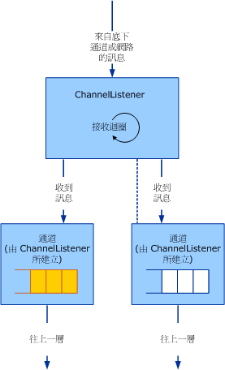

# 服務：通道接聽程式與通道
通道物件共有下列三種類別：通道、通道接聽程式和通道處理站。通道是介於應用程式與通道堆疊之間的介面。通道接聽程式負責建立接收 \(或接聽\) 端的通道，一般用來回應新傳入的訊息或連線。通道處理站負責建立傳送端的通道，以初始化與端點的通訊。  
  
## 通道接聽程式與通道  
 通道接聽程式負責建立通道並接收來自網路或下一層的訊息。接收到的訊息會透過通道接聽程式所建立的通道傳遞至上一層。  
  
 下列圖表會說明接收訊息與將之傳遞至上一層的處理序。  
  
   
負責接收訊息並透過通道傳遞至上一層的通道接聽程式。  
  
 儘管實作時也許不會真的用到佇列，在概念上處理序還是可以做成位於每個通道內部的佇列模型。通道接聽程式負責接收來自下一層或網路的訊息，並將其放到佇列中。通道負責從佇列取得訊息，並在上一層要求訊息時，將它交給上一層，例如呼叫通道上的 `Receive`。  
  
 [!INCLUDE[indigo2](../../../../includes/indigo2-md.md)] 會提供此處理序的基底類別協助程式 \(如需本主題討論的通道協助程式類別圖表，請參閱[通道模型概觀](../../../../docs/framework/wcf/extending/channel-model-overview.md)\)。  
  
-   <xref:System.ServiceModel.Channels.CommunicationObject> 類別會實作 <xref:System.ServiceModel.ICommunicationObject> 並強制執行[開發通道](../../../../docs/framework/wcf/extending/developing-channels.md)步驟 2 中所述的狀態電腦。  
  
-   <xref:System.ServiceModel.Channels.ChannelManagerBase> 類別會實作 <xref:System.ServiceModel.Channels.CommunicationObject>，並為 <xref:System.ServiceModel.Channels.ChannelFactoryBase> 和 <xref:System.ServiceModel.Channels.ChannelListenerBase> 提供統一的基底類別。<xref:System.ServiceModel.Channels.ChannelManagerBase> 類別可以和 <xref:System.ServiceModel.Channels.ChannelBase> 一起運作，而後者是實作 <xref:System.ServiceModel.Channels.IChannel> 的基底類別。  
  
-   ``  <xref:System.ServiceModel.Channels.ChannelFactoryBase> 類別會實作 <xref:System.ServiceModel.Channels.ChannelManagerBase> 和 <xref:System.ServiceModel.Channels.IChannelFactory>，並且將 `CreateChannel` 多載合併為單一 `OnCreateChannel` 抽象方法。  
  
-   <xref:System.ServiceModel.Channels.ChannelListenerBase> 類別會實作 <xref:System.ServiceModel.Channels.IChannelListener>。它會負責基礎的狀態管理。  
  
 下列討論將以[傳輸：UDP](../../../../docs/framework/wcf/samples/transport-udp.md) 範例為基礎。  
  
## 建立通道接聽程式  
 範例實作的 ``UdpChannelListener 是衍生自 <xref:System.ServiceModel.Channels.ChannelListenerBase> 類別。它會使用單一 UDP 通訊端來接收資料包。`OnOpen` 方法會透過非同步迴圈的 UDP 通訊端來接收資料，然後透過下列訊息編碼系統將資料轉換為訊息：  
  
```  
message = UdpConstants.MessageEncoder.ReadMessage(  
  new ArraySegment<byte>(buffer, 0, count),   
  bufferManager  
);  
```  
  
 由於相同的資料包通道代表來自幾個來源的訊息，因此 `UdpChannelListener` 是單一接聽程式。與此接聽項相關聯的作用中 <xref:System.ServiceModel.Channels.IChannel>``一次最多只有一個。只有當 <xref:System.ServiceModel.Channels.ChannelListenerBase%601.AcceptChannel%2A> 方法所傳回的通道被接著處理後，範例才會產生另一個通道。收到訊息時，就會將它加入此單一通道佇列中。  
  
### UdpInputChannel  
 `UdpInputChannel` 類別會實作 <xref:System.ServiceModel.Channels.IInputChannel>。它包含由 `UdpChannelListener` 通訊端所填入的傳入訊息佇列。這些訊息佇列會由 <xref:System.ServiceModel.Channels.IInputChannel.Receive%2A> 方法加以清除。