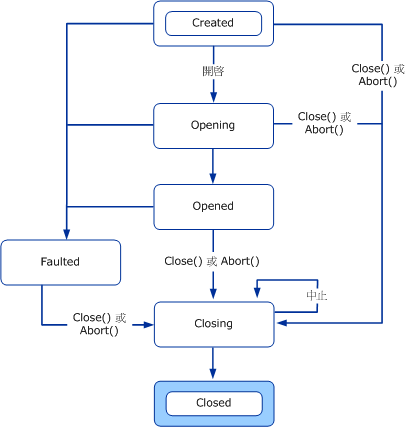
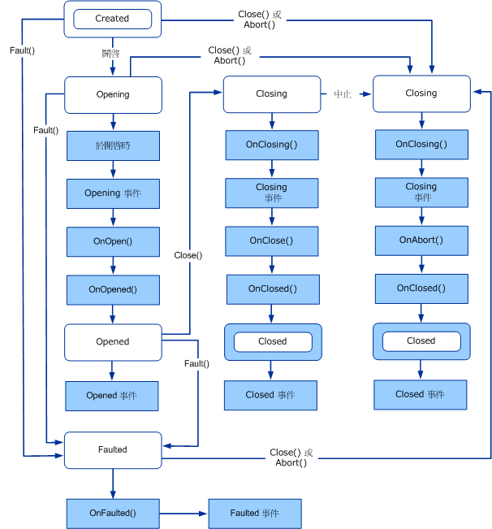
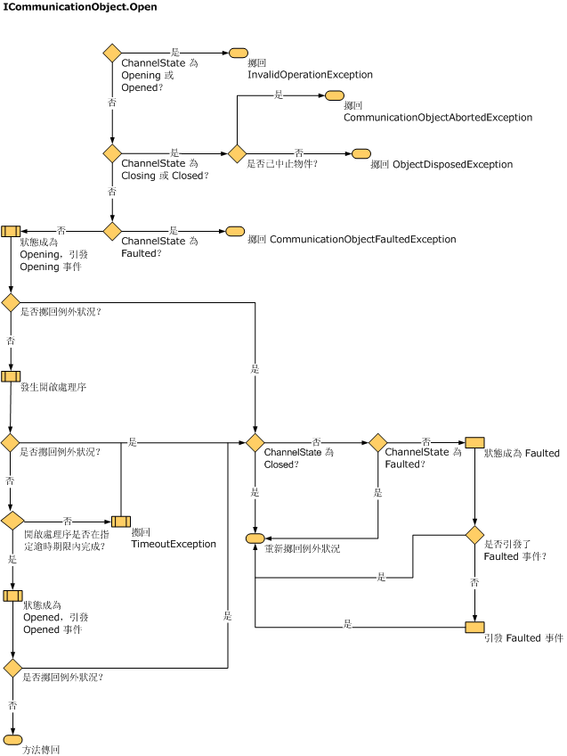
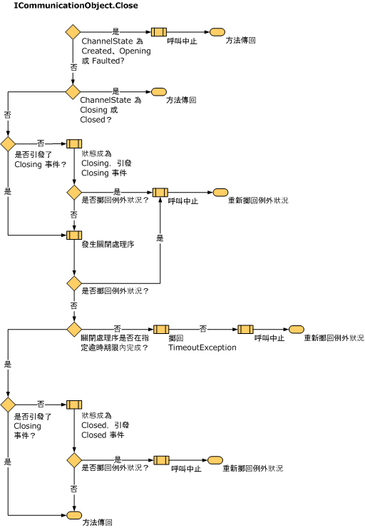
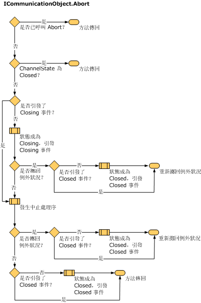

# 了解狀態變更
本主題說明通道具有的狀態和轉換、用來建構通道狀態的型別，以及如何實作。  
  
## 狀態機器和通道  
 處理通訊的物件 (例如通訊端) 通常會呈現狀態轉換與配置網路資源、建立或接受連線、關閉連線和終止通訊等相關的狀態機器。 通道狀態機器提供了通訊物件狀態的統一模型，摘要該物件的基礎實作。 <xref:System.ServiceModel.ICommunicationObject> 介面提供一組狀態、狀態轉換方法和狀態轉換事件。 所有通道、通道處理站和通道接聽項都會實作通道狀態機器。  
  
 事件 Closed、Closing、Faulted、Opened 和 Opening 會在狀態轉換發生後對外部觀察器發出信號。  
  
 方法 Abort、Close 和 Open (以及它們的非同步對等用法) 會造成狀態轉換。  
  
 狀態屬性會傳回 <xref:System.ServiceModel.CommunicationState> 所定義的目前狀態：  
  
## ICommunicationObject、CommunicationObject、狀態和狀態轉換  
 <xref:System.ServiceModel.ICommunicationObject> 一開始處於 Created 狀態，在這個狀態下可設定各種屬性。 一旦在 Opened 狀態下，物件就不能用於傳送和接收訊息，它的屬性也會被視為不變的。 一旦在 Closing 狀態下，物件就無法再處理新的傳送或接收要求，但是直到 Close 逾時之前現有的要求仍有機會完成。  如果發生無法修復的錯誤，物件會轉換為 Faulted 狀態，在這個狀態下，可檢查物件取得錯誤相關資訊，最後關閉物件。 在 Closed 狀態下，物件本質上已經達到狀態機器結尾。 一旦物件從某個狀態轉換為下一個狀態，就不會回到上一個狀態。  
  
 下圖說明 <xref:System.ServiceModel.ICommunicationObject> 狀態和狀態轉換。 藉由呼叫下列三種方法的其中一種, 可能會導致狀態轉換:[中止]、[開啟] 或 [關閉]。 此外，藉由呼叫其他實作特定的方法，也可以造成狀態轉換。 當開啟通訊物件的時候或之後發生錯誤，則會轉換為 Faulted 狀態。  
  
 每個 <xref:System.ServiceModel.ICommunicationObject> 一開始都處於 Created 狀態。 在這個狀態下，應用程式可以設定物件屬性。 一旦物件處於 Created 以外的狀態，就會被視為不變的。  
  
   
[圖 1] ICommunicationObject 狀態機器。  
  
 Windows Communication Foundation (WCF) 提供名為<xref:System.ServiceModel.Channels.CommunicationObject> <xref:System.ServiceModel.ICommunicationObject>的抽象基類, 該類別會執行和通道狀態機器。 下圖是 <xref:System.ServiceModel.Channels.CommunicationObject> 特定的狀態修訂圖。 除了 <xref:System.ServiceModel.ICommunicationObject> 狀態機器之外，它還說明了叫用其他 <xref:System.ServiceModel.Channels.CommunicationObject> 方法的時機。  
  
   
圖 2。 CommunicationObject 狀態機器的 CommunicationObject 實作，包括呼叫事件和受保護的方法。  
  
### ICommunicationObject 事件  
 <xref:System.ServiceModel.Channels.CommunicationObject> 會公開 <xref:System.ServiceModel.ICommunicationObject> 所定義的五個事件。 這些事件是為使用通訊物件以得知狀態轉換的程式碼而設計。 如上面圖 2 所示，在物件狀態轉換為依事件所指名的狀態之後，每個事件都會引發一次。 所有五個事件都屬於 `EventHandler` 型別，定義為：  
  
 `public delegate void EventHandler(object sender, EventArgs e);`  
  
 在 <xref:System.ServiceModel.Channels.CommunicationObject> 實作中，<xref:System.ServiceModel.Channels.CommunicationObject> 本身是傳送者，或者傳入 <xref:System.ServiceModel.Channels.CommunicationObject> 建構函式當做傳送者 (如果使用該建構函式多載的話)。 EventArgs 參數 `e` 一定是 `EventArgs.Empty`。  
  
### 衍生的物件回呼  
 除了五個事件之外，<xref:System.ServiceModel.Channels.CommunicationObject> 還會宣告八個受保護的虛擬方法，設計用於狀態轉換前後回呼衍生的物件。  
  
 <xref:System.ServiceModel.Channels.CommunicationObject.Open%2A?displayProperty=nameWithType> 和 <xref:System.ServiceModel.Channels.CommunicationObject.Close%2A?displayProperty=nameWithType> 方法各有三個這類的回呼。 例如，<xref:System.ServiceModel.Channels.CommunicationObject.Open%2A?displayProperty=nameWithType> 有對應的 <xref:System.ServiceModel.Channels.CommunicationObject.OnOpening%2A?displayProperty=nameWithType>、<xref:System.ServiceModel.Channels.CommunicationObject.OnOpen%2A?displayProperty=nameWithType> 和 <xref:System.ServiceModel.Channels.CommunicationObject.OnOpened%2A?displayProperty=nameWithType>。 <xref:System.ServiceModel.Channels.CommunicationObject.Close%2A?displayProperty=nameWithType> 有相關聯的 <xref:System.ServiceModel.Channels.CommunicationObject.OnClose%2A?displayProperty=nameWithType>、<xref:System.ServiceModel.Channels.CommunicationObject.OnClosing%2A?displayProperty=nameWithType> 和 <xref:System.ServiceModel.Channels.CommunicationObject.OnClosed%2A?displayProperty=nameWithType> 方法。  
  
 同樣的，<xref:System.ServiceModel.Channels.CommunicationObject.Abort%2A?displayProperty=nameWithType> 方法也有對應的 <xref:System.ServiceModel.Channels.CommunicationObject.OnAbort%2A?displayProperty=nameWithType>。  
  
 雖然 <xref:System.ServiceModel.Channels.CommunicationObject.OnOpen%2A?displayProperty=nameWithType>、<xref:System.ServiceModel.Channels.CommunicationObject.OnClose%2A?displayProperty=nameWithType> 和 <xref:System.ServiceModel.Channels.CommunicationObject.OnAbort%2A?displayProperty=nameWithType> 沒有預設實作，但其他回呼仍有狀態機器正確性需要的預設實作。 如果您要覆寫這些方法，請務必呼叫基底實作或正確地將它取代。  
  
 <xref:System.ServiceModel.Channels.CommunicationObject.OnOpening%2A?displayProperty=nameWithType>、<xref:System.ServiceModel.Channels.CommunicationObject.OnClosing%2A?displayProperty=nameWithType> 和 <xref:System.ServiceModel.Channels.CommunicationObject.OnFaulted%2A?displayProperty=nameWithType> 會引發對應的 <xref:System.ServiceModel.Channels.CommunicationObject.Opening?displayProperty=nameWithType>、<xref:System.ServiceModel.Channels.CommunicationObject.Closing?displayProperty=nameWithType> 和 <xref:System.ServiceModel.Channels.CommunicationObject.Faulted?displayProperty=nameWithType> 事件。 <xref:System.ServiceModel.Channels.CommunicationObject.OnOpened%2A?displayProperty=nameWithType> 和 <xref:System.ServiceModel.Channels.CommunicationObject.OnClosed%2A?displayProperty=nameWithType> 會將物件狀態分別設定為 Opened 和 Closed，然後引發對應的 <xref:System.ServiceModel.Channels.CommunicationObject.Opened?displayProperty=nameWithType> 和 <xref:System.ServiceModel.Channels.CommunicationObject.Closed?displayProperty=nameWithType> 事件。  
  
### 狀態轉換方法  
 <xref:System.ServiceModel.Channels.CommunicationObject> 提供了 Abort、Close 和 Open 實作。 此外，還提供 Fault 方法，會將狀態轉換為 Faulted 狀態。 圖 2 說明 <xref:System.ServiceModel.ICommunicationObject> 狀態機器，其中每個轉換都由造成轉換的方法所標記 (在造成上一個已標記轉換的方法實作內部，會發生未標記的轉換)。  
  
> [!NOTE]
> <xref:System.ServiceModel.Channels.CommunicationObject> 所有的通訊狀態取得/設定實作，都是執行緒同步。  
  
 建構函式  
  
 <xref:System.ServiceModel.Channels.CommunicationObject> 提供了三個都會將物件置於 Created 狀態的建構函式。 這些建構函式定義為：  
  
 第一個函式是一個無參數的函式, 可委派給接受物件的函式多載:  
  
 `protected CommunicationObject() : this(new object()) { … }`  
  
 在同步存取通訊物件狀態時，接受物件的建構函式會將該參數做為要鎖定的物件：  
  
 `protected CommunicationObject(object mutex) { … }`  
  
 最後，當引發 <xref:System.ServiceModel.ICommunicationObject> 事件時，第三個建構函式會接受其他參數做為傳送者引數。  
  
 `protected CommunicationObject(object mutex, object eventSender) { … }`  
  
 前兩個建構函式會設定此傳送者。  
  
 Open 方法  
  
 預處理已建立狀態。  
  
 後置條件:狀態為 [已開啟] 或 [錯誤]。 可能會擲回例外狀況。  
  
 Open() 方法會嘗試開啟通訊物件，並將狀態設定為 Opened。 如果發生錯誤，則會將狀態設定為 Faulted。  
  
 此方法會先檢查目前狀態是否為 Created。 如果目前狀態為 Opening 或 Opened，則會擲回 <xref:System.InvalidOperationException>。 如果目前狀態為 Closing 或 Closed，且物件已終止，則會擲回 <xref:System.ServiceModel.CommunicationObjectAbortedException>，否則會擲回 <xref:System.ObjectDisposedException>。 如果目前狀態為 Faulted，則會擲回 <xref:System.ServiceModel.CommunicationObjectFaultedException>。  
  
 然後，將狀態設定為 Opening，並依序呼叫 OnOpening() (這會引發 Opening 事件)、OnOpen() 和 OnOpened()。 OnOpened() 會將狀態設定為 Opened，並且引發 Opened 事件。 如果任何這些呼叫擲回例外狀況，則 Open() 會呼叫 Fault()，並且將例外狀況反昇。 下圖詳細說明 Open 處理序。  
  
   
覆寫 OnOpen 方法以實作自訂開啟邏輯，例如開啟內部通訊物件。  
  
 Close 方法  
  
 預處理無。  
  
 後置條件:狀態為 [已關閉]。 可能會擲回例外狀況。  
  
 在任何狀態下，都可以呼叫 Close() 方法。 這個方法會嘗試依正常程序關閉物件。 如果發生錯誤，則會終止物件。 如果目前狀態為 Closing 或 Closed，這個方法不會有任何作用。 否則，會將狀態設定為 Closing。 如果原始狀態為 Created、Opening 或 Faulted，則會呼叫 Abort() (請參閱下圖)。 如果原始狀態為 Opened，則會依序呼叫 OnClosing() (這會引發 Closing 事件)、OnClose() 和 OnClosed()。 如果任何這些呼叫擲回例外狀況，則 Close() 會呼叫 Abort()，並且將例外狀況反昇。 OnClosed() 會將狀態設定為 Closed，並且引發 Closed 事件。 下圖詳細說明 Close 處理序。  
  
   
覆寫 OnClose 方法以實作自訂關閉邏輯，例如關閉內部通訊物件。 因為 OnClose() 接受逾時參數，而且不是做為 Abort() 的一部分呼叫，所有長時間封鎖 (例如等待另一端回應) 的依正常程序關閉邏輯都應該在 OnClose() 之中實作。  
  
 Abort  
  
 預處理無。  
後置條件:狀態為 [已關閉]。 可能會擲回例外狀況。  
  
 如果目前狀態為 Closed，或者物件已經終止 (例如，可能藉由在另一個執行緒上執行 Abort())，則 Abort() 方法不會有任何作用。 否則，方法會將狀態設定為 Closing，並且依序呼叫 OnClosing() (這會引發 Closing 事件)、OnAbort() 和 OnClosed() (不會呼叫 OnClose，因為物件正在終止，而未關閉)。 OnClosed() 會將狀態設定為 Closed，並且引發 Closed 事件。 如果任何這些呼叫擲回例外狀況，則會將例外狀況重新擲回至 Abort 的呼叫者。 OnClosing()、OnClosed() 和 OnAbort() 實作不應封鎖 (例如，於輸入/輸出時)。 下圖詳細說明 Abort 處理序。  
  
   
覆寫 OnAbort 方法以實作自訂終止邏輯，例如終止內部通訊物件。  
  
 Fault  
  
 Fault 方法是 <xref:System.ServiceModel.Channels.CommunicationObject> 特有的，不是 <xref:System.ServiceModel.ICommunicationObject> 介面的一部分。 為求完整性，將它一併併入。  
  
 預處理無。  
  
 後置條件:狀態為 [錯誤]。 可能會擲回例外狀況。  
  
 如果目前狀態為 Faulted 或 Closed，Fault() 方法不會有任何作用。 否則，會將狀態設定為 Faulted 並呼叫 OnFaulted()，而引發 Faulted 事件。 如果 OnFaulted 擲回例外狀況，則會重新擲回例外狀況。  
  
### ThrowIfXxx 方法  
 CommunicationObject 有三個受保護的方法，當物件處於特定狀態時，可用來擲回例外狀況。  
  
 如果狀態為 Closing、Closed 或 Faulted，<xref:System.ServiceModel.Channels.CommunicationObject.ThrowIfDisposed%2A> 會擲回例外狀況。  
  
 如果狀態不是 Created，<xref:System.ServiceModel.Channels.CommunicationObject.ThrowIfDisposedOrImmutable%2A> 會擲回例外狀況。  
  
 如果狀態不是 Opened，<xref:System.ServiceModel.Channels.CommunicationObject.ThrowIfDisposedOrNotOpen%2A> 會擲回例外狀況。  
  
 擲回的例外狀況取決於狀態。 下表說明不同狀態，以及在狀態下藉由呼叫 ThrowIfXxx 擲回的對應例外狀況型別。  
  
|State|是否已呼叫 Abort？|例外|  
|-----------|----------------------------|---------------|  
|建立時間|N/A|<xref:System.InvalidOperationException?displayProperty=nameWithType>|  
|正在開啟|N/A|<xref:System.InvalidOperationException?displayProperty=nameWithType>|  
|Opened|N/A|<xref:System.InvalidOperationException?displayProperty=nameWithType>|  
|Closing|是|<xref:System.ServiceModel.CommunicationObjectAbortedException?displayProperty=nameWithType>|  
|Closing|否|<xref:System.ObjectDisposedException?displayProperty=nameWithType>|  
|Closed|是|在先前明確呼叫 Abort 而關閉物件的情況下，為 <xref:System.ServiceModel.CommunicationObjectAbortedException?displayProperty=nameWithType>。 如果在此物件上呼叫 Close，則會擲回 <xref:System.ObjectDisposedException?displayProperty=nameWithType>。|  
|Closed|否|<xref:System.ObjectDisposedException?displayProperty=nameWithType>|  
|Faulted|N/A|<xref:System.ServiceModel.CommunicationObjectFaultedException?displayProperty=nameWithType>|  
  
### 逾時  
 我們所討論的數個方法會接受逾時參數， 包括 Close、Open (某些多載和非同步版本)、OnClose 和 OnOpen。 這些方法的設計考慮到漫長作業 (例如，於輸入/輸出時封鎖，同時依正常程序關閉連線)，因此逾時參數會表示中斷前這類作業所需的時間。 任何這些方法的實作都應該使用提供的逾時值，以確保在逾時前傳回至呼叫者。 不接受逾時的其他方法實作，不是為漫長作業而設計，且不應於輸入/輸出時封鎖。  
  
 但是 Open() 和 Close() 多載例外，這些方法多載不會接受逾時， 而是使用衍生類別所提供的預設逾時值。 <xref:System.ServiceModel.Channels.CommunicationObject> 會公開兩個名為 <xref:System.ServiceModel.Channels.CommunicationObject.DefaultCloseTimeout%2A> 和 <xref:System.ServiceModel.Channels.CommunicationObject.DefaultOpenTimeout%2A> 的受保護抽象屬性，其定義為：  
  
 `protected abstract TimeSpan DefaultCloseTimeout { get; }`  
  
 `protected abstract TimeSpan DefaultOpenTimeout { get; }`  
  
 衍生類別會實作這些屬性，為不接受逾時值的 Open() 和 Close() 多載提供預設逾時。 然後，Open() 和 Close() 實作會委派至接受逾時的多載，以傳遞預設逾時值，例如：  
  
 `public void Open()`  
  
 `{`  
  
 `this.Open(this.DefaultOpenTimeout);`  
  
 `}`  
  
#### IDefaultCommunicationTimeouts  
 這個介面有四個唯讀屬性，為 Open、Send、Receive 和 Close 提供預設逾時值。 每個實作都負責以適當方式取得預設值。 為提供便利，<xref:System.ServiceModel.Channels.ChannelFactoryBase> 和 <xref:System.ServiceModel.Channels.ChannelListenerBase> 會將這些值都預設為 1 分鐘。
