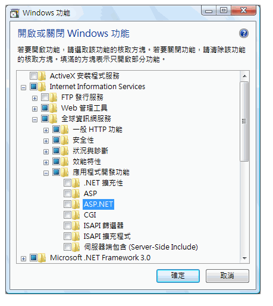
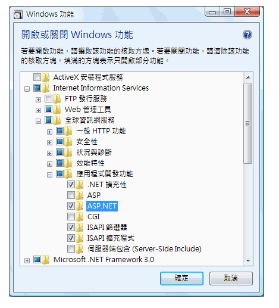
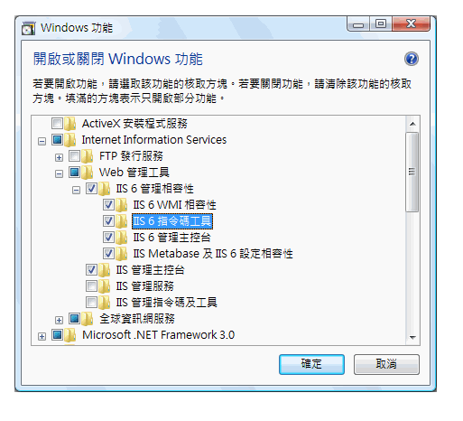

# 設定 Internet Information Services 7.0 for Windows Communication FoundationConfiguring Internet Information Services 7.0 for Windows Communication Foundation

Internet Information Services (IIS) 7.0 具有模組化的設計，可以讓您選擇性地安裝所需的元件。Internet Information Services (IIS) 7.0 has a modular design that allows you to selectively install components that are required. 這項設計是以 [!INCLUDE[wv](../../../../includes/wv-md.md)]中引進的新資訊清單驅動元件化技術為基礎。This design is based on the new manifest-driven componentization technology introduced in [!INCLUDE[wv](../../../../includes/wv-md.md)]. 有 40 個以上的獨立功能元件，可獨立安裝的 IIS 7.0。There are more than 40 standalone feature components of IIS 7.0 that can be installed independently. 這讓 IT 專業人員能夠輕鬆地依其需要自訂安裝。This allows IT professionals to easily customize the installation as required. 本主題討論如何設定 IIS 7.0 使用與 Windows Communication Foundation (WCF)，並判斷需要哪些元件。This topic discusses how to configure IIS 7.0 for use with Windows Communication Foundation (WCF) and determine which components are required.

## 基本安裝：安裝 WASMinimal Installation: Installing WAS
 整個 IIS 7.0 封裝的基本安裝是安裝 Windows Process Activation Service (WAS)。The minimal installation of the whole IIS 7.0 package is to install the Windows Process Activation Service (WAS). 已是獨立功能，它是唯一的功能，可供所有 IIS 7.0[!INCLUDE[wv](../../../../includes/wv-md.md)]作業系統 （Home Basic、 Home Premium、 Business 和 Ultimate 和 Enterprise）。WAS is a standalone feature and it is the only feature from the IIS 7.0 that is available for all [!INCLUDE[wv](../../../../includes/wv-md.md)] operating systems (Home Basic, Home Premium, Business, and Ultimate and Enterprise).

 從 控制台 中按一下**程式**，然後按一下**開啟 Windows 功能開啟或關閉** 下**程式和功能**，WAS 元件所示如下列圖所示的清單。From the Control Panel, click **Programs** and then click **Turn Windows features on or off** which is listed under **Programs and Features**, the WAS component is shown in the list as in the following illustration.

 

 這項功能具有下列子元件：This feature has the following sub-components:

-   .NET 環境.NET Environment

-   組態 APIConfiguration APIs

-   處理序模型Process Model

 如果您選取根節點的 WAS，只有**處理序模型**子節點依預設會勾選。If you select the root node of WAS, only the **Process Model** sub-node is checked by default. 請注意，進行這項安裝時只會安裝 WAS，因為此時不支援 Web 伺服器。Please note that with this installation you are only installing WAS, because there is no support for a Web server.

 若要讓 WCF 或任何 ASP.NET 應用程式工作，請檢查 **.NET 環境**核取方塊。To make WCF or any ASP.NET application work, check the **.NET Environment** checkbox. 這表示所有的 WAS 元件都需要進行 WCF 和 ASP.NET 無法正常運作。This means that all of WAS components are required to make WCF and ASP.NET to work well. 一旦您安裝任何其中一個上述元件，這些應用程式便會自動核取。These are automatically checked once you install any of those components.

## IIS 7.0：預設安裝IIS 7.0: Default Installation
 藉由檢查**Internet Information Services**如下圖所示，會自動檢查功能，某些子節點。By checking the **Internet Information Services** feature, some of the sub-nodes are automatically checked as shown in the following illustration.

 

 這是 IIS 7.0 的預設安裝。This is the default installation of IIS 7.0. 這項安裝，您可以使用 IIS 7.0 來服務靜態內容 （例如 HTML 網頁和其他內容）。With this installation, you can use IIS 7.0 to service static content (such as HTML pages and other content). 不過，您無法執行 ASP.NET 或 CGI 應用程式或裝載 WCF 服務。However, you cannot run ASP.NET or CGI applications or host WCF services.

## IIS 7.0：具有 ASP.NET 支援的安裝IIS 7.0: Installation with ASP.NET Support
 您必須安裝 ASP.NET，讓 ASP.NET 在 IIS 7.0 上運作。You must install ASP.NET to make ASP.NET work on IIS 7.0. 檢查後**ASP.NET**，您的畫面應該看起來類似下圖。After checking **ASP.NET**, your screen should look like the following illustration.

 

 這是最小的環境，讓 IIS 7.0 中運作的 WCF 和 ASP.NET 應用程式。This is the minimal environment for both WCF and ASP.NET applications to work in IIS 7.0.

## IIS 7.0：具有 IIS 6.0 相容性元件的安裝IIS 7.0: Installation with IIS 6.0 Compatibility Components
 當 Visual Studio 2005 或其他自動化指令碼或設定使用 IIS 6.0 Metabase API 的虛擬應用程式的工具 （例如 Adsutil.vbs) 的系統上安裝 IIS 7.0，請確定您檢查 IIS 6.0**指令碼工具**.When installing IIS 7.0 on a system with Visual Studio 2005 or some other automation scripts or tools (such as Adsutil.vbs) that configure virtual applications that use IIS 6.0 Metabase API, ensure that you check the IIS 6.0 **Scripting Tools**. 這會自動檢查 IIS 6.0 的其他子節點**管理相容性**。This automatically checks the other sub-nodes of IIS 6.0 **Management Compatibility**. 這麼做之後下, 圖顯示的畫面：The following illustration shows the screen after this is done:

 

 此安裝中，您可以使用網頁上的 IIS 7.0、 ASP.NET 和 WCF 的功能和可用的範例所需的所有項目。With this installation, you have everything required to use IIS 7.0, ASP.NET and WCF features and samples available on the Web.

## 要求限制Request Limits
 在具有 IIS 7 的 [!INCLUDE[wv](../../../../includes/wv-md.md)] 上，`maxUri` 和 `maxQueryStringSize` 設定的預設值已經變更。On [!INCLUDE[wv](../../../../includes/wv-md.md)] with IIS 7 the default value of the `maxUri` and `maxQueryStringSize` settings have been changed. 根據預設，IIS 7.0 中的要求篩選允許 URL 長度為 4096 個字元，查詢字串長度為 2048 個字元。By default, request filtering in IIS 7.0 allows a URL length of 4096 characters and a query string length of 2048 characters. 若要變更這些預設值，請將下列 XML 加入至您的 App.config 檔中。To change these defaults add the following XML to your App.config file.

 `<system.webServer>`

 `<security>`

 `<requestFiltering>`

 `<requestLimits maxUrl="8192" maxQueryString="8192" />`

 `</requestFiltering>`

 `</security>`

 `</system.webServer>`

## 另請參閱See Also

- [WAS 啟用架構WAS Activation Architecture](../../../../docs/framework/wcf/feature-details/was-activation-architecture.md)
- [設定用於 WCF 的 WASConfiguring WAS for Use with WCF](../../../../docs/framework/wcf/feature-details/configuring-the-wpa--service-for-use-with-wcf.md)
- [如何：安裝和設定 WCF 啟用元件How to: Install and Configure WCF Activation Components](../../../../docs/framework/wcf/feature-details/how-to-install-and-configure-wcf-activation-components.md)
- [Windows Server App Fabric 主控功能Windows Server App Fabric Hosting Features](https://go.microsoft.com/fwlink/?LinkId=201276)
