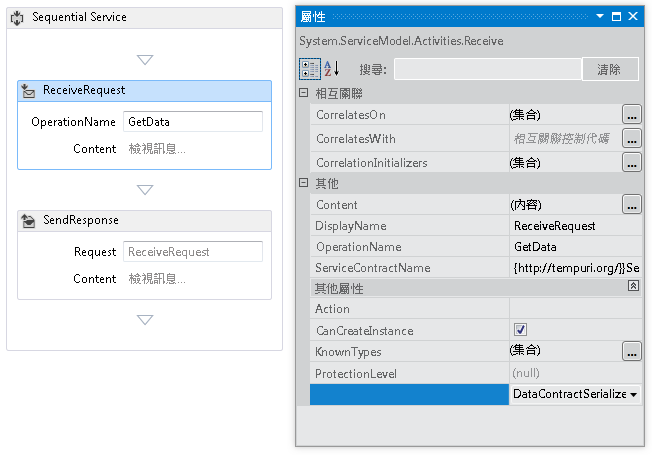
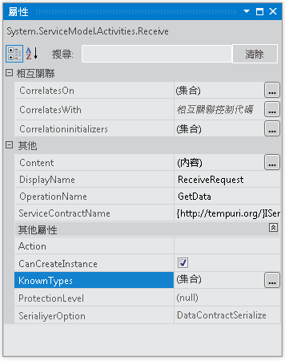
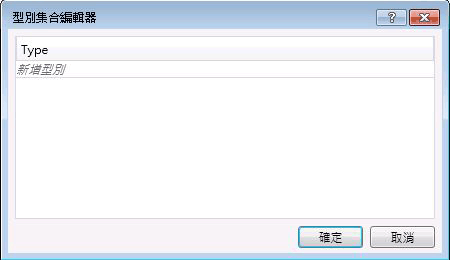

# <a name="configuring-serialization-in-a-workflow-service"></a>在工作流程服務中設定序列化
工作流程服務是 Windows Communication Foundation (WCF) 服務，因此可以選擇使用<xref:System.Runtime.Serialization.DataContractSerializer>（預設值） 或<xref:System.Xml.Serialization.XmlSerializer>。 撰寫非工作流程服務時，要使用的序列化程式型別會指定於服務或作業合約上。 建立 WCF workflow service 時未指定這些合約中的程式碼，但而不是在執行階段所產生合約推斷。 如需有關合約推斷的詳細資訊，請參閱[在工作流程中使用的合約](../../../../docs/framework/wcf/feature-details/using-contracts-in-workflow.md)。  序列化程式是使用 <xref:System.ServiceModel.Activities.Receive.SerializerOption%2A> 屬性來指定。 您可以在設計工具中設定此屬性，如下圖所示。  
  
   
  
 您也可以在程式碼中設定序列化程式，如下列範例所示。  
  
```  
Receive approveExpense = new Receive  
            {  
                OperationName = "ApproveExpense",  
                CanCreateInstance = true,  
                ServiceContractName = "FinanceService",  
                SerializerOption = SerializerOption.DataContractSerializer,  
                Content = ReceiveContent.Create(new OutArgument<Expense>(expense))  
            };  
```  
  
 此外，您也可以在工作流程服務上指定已知型別。 如需已知型別的詳細資訊，請參閱[Data Contract Known Types](../../../../docs/framework/wcf/feature-details/data-contract-known-types.md)。 您可以在設計工具或程式碼中指定已知型別。 若要在設計工具中指定已知型別，請在 <xref:System.ServiceModel.Activities.Receive> 活動的 [屬性] 視窗中，按一下 KnownTypes 屬性旁的省略符號按鈕，如下圖所示。  
  
   
  
 這樣就會顯示 [型別集合編輯器]，可讓您搜尋和指定已知型別。  
  
   
  
 按一下 **加入新的型別**連結，並用於下拉式清單選取或類型搜尋新增至已知型別集合。 若要在程式碼中指定已知型別，請使用 <xref:System.ServiceModel.Activities.Receive.KnownTypes%2A> 屬性，如下列範例所示。  
  
```csharp
Receive approveExpense = new Receive  
            {  
                OperationName = "ApproveExpense",  
                CanCreateInstance = true,  
                ServiceContractName = "FinanceService",  
                SerializerOption = SerializerOption.DataContractSerializer,  
                Content = ReceiveContent.Create(new OutArgument<Expense>(expense))  
            };  
            approveExpense.KnownTypes.Add(typeof(Travel));  
            approveExpense.KnownTypes.Add(typeof(Meal));  
```
