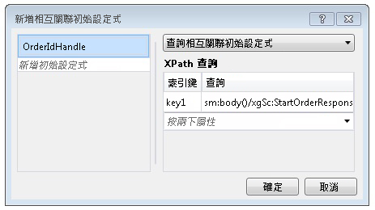

# 以內容為主的相互關聯Content Based Correlation
工作流程服務與用戶端及其他服務通訊時，交換的訊息中通常會含有能夠將訊息透過唯一方式關聯特定執行個體的資料。When workflow services communicate with clients and other services, often there is some data in the exchanged messages that uniquely relates a message to a particular instance. 以內容為主的相互關聯會利用訊息中的此項資料 (例如客戶編號或訂單 ID)，將訊息路由至適當的工作流程執行個體。Content-based correlation uses this data in the message, such as a customer number or order ID, to route messages to the proper workflow instance. 本主題說明如何在工作流程中使用以內容為主的相互關聯。This topic explains how to use content-based correlation in workflows.  
  
## 使用以內容為主的相互關聯Using Content-Based Correlation  
 當工作流程服務具有多個透過單一用戶端存取的方法，以及交換的訊息中有一個資料片段能夠識別所需的執行個體時，就會使用以內容為主的相互關聯。Content-based correlation is used when a workflow service has multiple methods that are accessed by a single client and a piece of data in the exchanged messages identifies the desired instance.  
  
> [!NOTE]
>  若因繫結不是可支援的內容交換繫結其中一個，而無法使用內容相互關聯時，以內容為主的相互關聯就非常有用。Content-based correlation is useful when context correlation cannot be used because the binding is not one of the supported context exchange bindings. [!INCLUDE[crabout](../../../../includes/crabout-md.md)]內容相互關聯，請參閱[Context Exchange](../../../../docs/framework/wcf/feature-details/context-exchange-correlation.md)。 context correlation, see [Context Exchange](../../../../docs/framework/wcf/feature-details/context-exchange-correlation.md).  
  
 這些通訊中使用的每個傳訊活動，都必須在能夠唯一識別該執行個體的訊息中指定資料的位置。Each messaging activity used in these communications must specify the location of the data in the message that uniquely identifies the instance. 若要進行這項操作，請使用 <xref:System.ServiceModel.MessageQuerySet> 或 <xref:System.ServiceModel.Activities.QueryCorrelationInitializer> 提供 <xref:System.ServiceModel.Activities.Receive.CorrelatesOn%2A> (會在訊息中查詢能夠唯一識別該執行個體的資料)。This is done by providing a <xref:System.ServiceModel.MessageQuerySet>, using either a <xref:System.ServiceModel.Activities.QueryCorrelationInitializer> or <xref:System.ServiceModel.Activities.Receive.CorrelatesOn%2A>, that queries the message for the piece or pieces of data that uniquely identify the instance.  
  
> [!WARNING]
>  用於識別執行個體的資料會雜湊成為相互關聯索引鍵。The data that is used to identify the instance is hashed into a correlation key. 請特別小心確認用於關聯的資料是否為唯一的資料，否則雜湊索引鍵中可能會發生衝突，導致訊息路由錯誤。Care must be taken to ensure that the data used for correlation is unique or else collisions in the hashed key could occur and cause messages to be misrouted. 例如，只以客戶名稱為主的相互關聯可能會造成衝突，因為可能會有多位客戶具有相同的名稱。For example, a correlation based solely on a customer name may cause a collision because there may be multiple customers with the same name. 相互關聯資訊的資料中不可包含冒號 (`:`)，因為冒號已用於分隔訊息查詢的索引鍵和值，以形成後續雜湊的字串。The colon (`:`) should not be used as part of the data used to correlate the message because it is already used to delimit the message query’s key and value to form the string that is subsequently hashed.  
  
 在下列範例中，初始<xref:System.ServiceModel.Activities.Receive> / <xref:System.ServiceModel.Activities.SendReply>在工作流程服務會傳回`OrderId`，然後傳遞回用戶端上呼叫下列<xref:System.ServiceModel.Activities.Receive>工作流程服務中的活動。In the following example, the initial <xref:System.ServiceModel.Activities.Receive>/<xref:System.ServiceModel.Activities.SendReply> in a workflow service returns an `OrderId`, which is then passed back by the client on the call to the following <xref:System.ServiceModel.Activities.Receive> activity in the workflow service.  
  
 [!code-csharp[CFX_ContentCorrelation#1](../../../../samples/snippets/csharp/VS_Snippets_CFX/cfx_contentcorrelation/cs/program.cs#1)]  
  
 上述範例示範以內容為主的相互關聯，這個相互關聯是由 <xref:System.ServiceModel.Activities.SendReply> 所初始化。The previous example shows a content-based correlation that is initialized by the <xref:System.ServiceModel.Activities.SendReply>. <xref:System.ServiceModel.MessageQuerySet> 會將用於讓這個服務識別後續訊息的資料指定為 `OrderId`。The <xref:System.ServiceModel.MessageQuerySet> specifies that the data used to identify subsequent messages to this service is the `OrderId`.  
  
 [!code-csharp[CFX_ContentCorrelation#2](../../../../samples/snippets/csharp/VS_Snippets_CFX/cfx_contentcorrelation/cs/program.cs#2)]  
  
 在工作流程中，<xref:System.ServiceModel.Activities.Receive> 之後的 <xref:System.ServiceModel.Activities.SendReply> 活動會接在 <xref:System.ServiceModel.Activities.SendReply> 所初始化的相互關聯之後。The <xref:System.ServiceModel.Activities.Receive> activity that follows the <xref:System.ServiceModel.Activities.SendReply> in the workflow follows the correlation that was initialized by the <xref:System.ServiceModel.Activities.SendReply>. 兩個活動共用同一個 <xref:System.ServiceModel.Activities.CorrelationHandle>，但各自擁有其 <xref:System.ServiceModel.MessageQuerySet> 和 <xref:System.ServiceModel.XPathMessageQuery> (指定識別資料在該特定訊息中的位置)。Both activities share the same <xref:System.ServiceModel.Activities.CorrelationHandle>, but each one has its own <xref:System.ServiceModel.MessageQuerySet> and <xref:System.ServiceModel.XPathMessageQuery> that specifies where the identifying data is in that particular message. 在初始化相互關聯的活動上，這個 <xref:System.ServiceModel.MessageQuerySet> 是在 <xref:System.ServiceModel.Activities.Receive.CorrelationInitializers%2A> 屬性中指定的，而在接下來的任何 <xref:System.ServiceModel.Activities.Receive> 活動中，則是使用 <xref:System.ServiceModel.Activities.Receive.CorrelatesOn%2A> 屬性來指定的。On the activity that initializes the correlation, this <xref:System.ServiceModel.MessageQuerySet> is specified in the <xref:System.ServiceModel.Activities.Receive.CorrelationInitializers%2A> property, and for any following <xref:System.ServiceModel.Activities.Receive> activities, it is specified using the <xref:System.ServiceModel.Activities.Receive.CorrelatesOn%2A> property.  
  
 [!code-csharp[CFX_ContentCorrelation#3](../../../../samples/snippets/csharp/VS_Snippets_CFX/cfx_contentcorrelation/cs/program.cs#3)]  
  
 當資料隨著訊息流動時，以內容為主的相互關聯可由任何傳訊活動 (<xref:System.ServiceModel.Activities.Send>、<xref:System.ServiceModel.Activities.Receive>、<xref:System.ServiceModel.Activities.SendReply>、<xref:System.ServiceModel.Activities.ReceiveReply>) 初始化。A content-based correlation can be initialized by any messaging activity (<xref:System.ServiceModel.Activities.Send>, <xref:System.ServiceModel.Activities.Receive>, <xref:System.ServiceModel.Activities.SendReply>, <xref:System.ServiceModel.Activities.ReceiveReply>) when the data flows as part of a message. 如果特定的資料片段並未隨著訊息流動，則可利用 <xref:System.ServiceModel.Activities.InitializeCorrelation> 活動加以明確初始化。If the particular piece of data does not flow as part of a message, then it can be initialized explicitly by using the <xref:System.ServiceModel.Activities.InitializeCorrelation> activity. 如果有多個資料片段需要唯一識別該訊息，則可以將多個查詢加入至 <xref:System.ServiceModel.MessageQuerySet>。If multiple pieces of data are required to uniquely identify the message, then multiple queries can be added to the <xref:System.ServiceModel.MessageQuerySet>. 這些範例將<xref:System.ServiceModel.Activities.CorrelationHandle> 明確提供給使用 `CorrelatesWith` 或 `CorrelationHandle` 屬性的每個活動，但如果整個工作流程如果只需一個相互關聯 (例如在這個範例中，一切都在 `OrderId` 上相互關聯)，那麼只需使用 <xref:System.ServiceModel.Activities.WorkflowServiceHost> 所提供的隱含相互關聯控制代碼管理即可。In these examples, a <xref:System.ServiceModel.Activities.CorrelationHandle> was explicitly provided to each of the activities using the `CorrelatesWith` or `CorrelationHandle` properties, but if there is only one correlation required for the entire workflow, such as in this example where everything correlates on `OrderId`, the implicit correlation handle management provided by <xref:System.ServiceModel.Activities.WorkflowServiceHost> is sufficient.  
  
## 使用 InitializeCorrelation 活動Using the InitializeCorrelation Activity  
 在上述範例中，`OrderId` 會透過 <xref:System.ServiceModel.Activities.SendReply> 活動流動至呼叫端，而這就是相互關聯初始化之處。In the previous example, the `OrderId` flowed to the caller through the <xref:System.ServiceModel.Activities.SendReply> activity and this is where the correlation was initialized. 使用 <xref:System.ServiceModel.Activities.InitializeCorrelation> 活動也能達到同樣的行為。The same behavior can be accomplished by using the <xref:System.ServiceModel.Activities.InitializeCorrelation> activity. <xref:System.ServiceModel.Activities.InitializeCorrelation> 活動會採用 <xref:System.ServiceModel.Activities.CorrelationHandle> 及項目字典 (其中的項目代表用於將訊息對應至正確執行個體的資料)。The <xref:System.ServiceModel.Activities.InitializeCorrelation> activity takes the <xref:System.ServiceModel.Activities.CorrelationHandle> and a dictionary of items that represent the data used to map the message to the correct instance. 若要在上述範例中使用 <xref:System.ServiceModel.Activities.InitializeCorrelation> 活動，請移除 <xref:System.ServiceModel.Activities.SendReply.CorrelationInitializers%2A> 活動中的 <xref:System.ServiceModel.Activities.SendReply>，並且使用 <xref:System.ServiceModel.Activities.InitializeCorrelation> 活動初始化相互關聯。To use the <xref:System.ServiceModel.Activities.InitializeCorrelation> activity in the preceding sample, remove the <xref:System.ServiceModel.Activities.SendReply.CorrelationInitializers%2A> from the <xref:System.ServiceModel.Activities.SendReply> activity and initialize the correlation using the <xref:System.ServiceModel.Activities.InitializeCorrelation> activity.  
  
 [!code-csharp[CFX_ContentCorrelation#4](../../../../samples/snippets/csharp/VS_Snippets_CFX/cfx_contentcorrelation/cs/program.cs#4)]  
  
 接著，在工作流程中，<xref:System.ServiceModel.Activities.InitializeCorrelation> 活動會在保存填入之資料的變數後以及 <xref:System.ServiceModel.Activities.Receive> 活動 (與初始化的 <xref:System.ServiceModel.Activities.CorrelationHandle> 相互關聯) 前使用。The <xref:System.ServiceModel.Activities.InitializeCorrelation> activity is then used in the workflow, after the variables that hold the data are populated but before the <xref:System.ServiceModel.Activities.Receive> activity that correlates with the initialized <xref:System.ServiceModel.Activities.CorrelationHandle>.  
  
 [!code-csharp[CFX_ContentCorrelation#5](../../../../samples/snippets/csharp/VS_Snippets_CFX/cfx_contentcorrelation/cs/program.cs#5)]  
  
## 使用工作流程設計工具設定 XPath 查詢Configuring XPath Queries Using the Workflow Designer  
 在上述範例中，訊息查詢中使用的活動和 XPath 查詢會在程式碼中指定。In the previous examples, the activities and the XPath queries used in the message queries were specified in code. [!INCLUDE[vs_current_long](../../../../includes/vs-current-long-md.md)] 中的工作流程設計工具也提供從 `DataContract` 型別產生 XPath 的功能，可用於以內容為主的相互關聯。The workflow designer in [!INCLUDE[vs_current_long](../../../../includes/vs-current-long-md.md)] also provides the ability to generate XPaths from `DataContract` types for content-based correlation. 上述範例中設定的第一個 XPath 是針對 <xref:System.ServiceModel.Activities.SendReply> 所設定的。The first XPath configured in the previous example was configured for the <xref:System.ServiceModel.Activities.SendReply>.  
  
 [!code-csharp[CFX_ContentCorrelation#2](../../../../samples/snippets/csharp/VS_Snippets_CFX/cfx_contentcorrelation/cs/program.cs#2)]  
  
 若要在工作流程設計工具中設定傳訊活動的 XPath，請在工作流程設計工具中選取該活動。To configure the XPath for a messaging activity in the workflow designer, select the activity in the workflow designer. 如果活動初始化相互關聯，如同先前的範例中，按一下省略符號按鈕**CorrelationInitializers**屬性**屬性**視窗。If the activity is initializing the correlation, as in the previous example, click the ellipsis button for the **CorrelationInitializers** property in the **Properties** window. 這會顯示**加入相互關聯初始設定式**對話方塊視窗。This displays the **Add Correlation Initializers** dialog window. 在這個對話方塊中，您可以指定相互關聯類型，並且選取用於相互關聯的內容。From this dialog you can specify the correlation type and select the content that is used for the correlation. <xref:System.ServiceModel.Activities.CorrelationHandle>中指定變數**新增初始設定式** 方塊中，相互關聯型別和相互關聯所使用的資料從選取**XPath 查詢**對話方塊的區段。The <xref:System.ServiceModel.Activities.CorrelationHandle> variable is specified in the **Add initializer** box, and the correlation type and data used for the correlation is selected from the **XPath Queries** section of the dialog box.  
  
   
  
 上述範例中的第二個 XPath 查詢是在 <xref:System.ServiceModel.Activities.Receive> 活動中所設定的。The second XPath query in the previous example was configured in the <xref:System.ServiceModel.Activities.Receive> activity.  
  
 [!code-csharp[CFX_ContentCorrelation#3](../../../../samples/snippets/csharp/VS_Snippets_CFX/cfx_contentcorrelation/cs/program.cs#3)]  
  
 若要設定 XPath 查詢不會初始化相互關聯的傳訊活動，工作流程設計工具中選取該活動，然後按一下省略符號按鈕**CorrelatesOn**屬性**屬性**視窗。To configure the XPath query for a messaging activity that does not initialize the correlation, select the activity in the workflow designer and then click the ellipsis button for the **CorrelatesOn** property in the **Properties** window. 這會顯示**CorrelatesOn 定義**對話方塊視窗。This displays the **CorrelatesOn Definition** dialog window.  
  
   
  
 在此對話方塊中指定<xref:System.ServiceModel.Activities.CorrelationHandle>選擇中的項目**XPath 查詢**用於建置 XPath 查詢的清單。From this dialog you specify the <xref:System.ServiceModel.Activities.CorrelationHandle> and choose items in the **XPath Queries** list to build the XPath query.
