# <a name="creating-a-long-running-workflow-service"></a>建立長期執行的工作流程服務
本主題會說明如何建立長時間執行的工作流程服務。 長時間執行的工作流程服務可能會執行一段很長的時間。 有時候，此工作流程可能會處於閒置狀態，等候其他某些資訊。 發生這種情況時，此工作流程會保存至 SQL 資料庫並從記憶體中移除。 當其他資訊可用時，此工作流程執行個體就會重新載入記憶體中並繼續執行。  在本案例中，您要實作非常簡化的訂購系統。  用戶端會將初始訊息傳送至工作流程服務，以便啟動訂單。 然後，服務會將訂單 ID 傳回給用戶端。 此時，工作流程服務會等候用戶端的其他訊息、進入閒置狀態並保存至 SQL Server 資料庫。  當用戶端傳送下一則訊息以訂購項目時，工作流程服務就會重新載入記憶體中，並且完成訂單處理作業。 在程式碼範例中，它會傳回一個字串，表示項目已經加入至訂單。 此程式碼範例並非採用此技術的實際應用程式，而是說明長時間執行工作流程服務的簡單範例。 本主題假設您知道如何建立 [!INCLUDE[vs_current_long](../../../../includes/vs-current-long-md.md)] 專案和方案。  
  
## <a name="prerequisites"></a>必要條件  
 您必須先安裝下列軟體，才能使用此逐步解說：  
  
1.  Microsoft SQL Server 2008  
  
2.  [!INCLUDE[vs_current_long](../../../../includes/vs-current-long-md.md)]  
  
3.  Microsoft [!INCLUDE[netfx_current_long](../../../../includes/netfx-current-long-md.md)]  
  
4.  您已熟悉 WCF 和 [!INCLUDE[vs_current_long](../../../../includes/vs-current-long-md.md)]，而且知道如何建立專案/方案。  
  
### <a name="to-setup-the-sql-database"></a>若要設定 SQL 資料庫  
  
1.  為了保存工作流程服務執行個體，您必須已經安裝 Microsoft SQL Server 而且必須設定資料庫來儲存已保存的工作流程執行個體。 按一下以執行 Microsoft SQL Management Studio**啟動**按鈕、 選取**所有程式**， **Microsoft SQL Server 2008**，和**Microsoft SQLManagement Studio**。  
  
2.  按一下**連接**按鈕以登入 SQL Server 執行個體  
  
3.  以滑鼠右鍵按一下**資料庫**在樹狀檢視，然後選取**新資料庫...** 若要建立新的資料庫稱為`SQLPersistenceStore`。  
  
4.  執行 SqlWorkflowInstanceStoreSchema.sql 指令碼檔 (位於 SQLPersistenceStore 資料庫的 C:\Windows\Microsoft.NET\Framework\v4.0\SQL\en 目錄中)，以便設定所需的資料庫結構描述。  
  
5.  執行 SqlWorkflowInstanceStoreLogic.sql 指令碼檔 (位於 SQLPersistenceStore 資料庫的 C:\Windows\Microsoft.NET\Framework\v4.0\SQL\en 目錄中)，以便設定所需的資料庫邏輯。  
  
### <a name="to-create-the-web-hosted-workflow-service"></a>若要建立 Web 裝載的工作流程服務  
  
1.  建立空白的 [!INCLUDE[vs_current_long](../../../../includes/vs-current-long-md.md)] 方案並將它命名為 `OrderProcessing`。  
  
2.  將名為 `OrderService` 的新 WCF 工作流程服務應用程式專案加入至此方案。  
  
3.  在 專案屬性 對話方塊中，選取**Web**  索引標籤。  
  
    1.  在下**起始動作**選取**特定頁面**並指定`Service1.xamlx`。  
  
         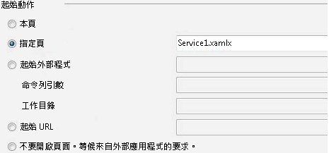  
  
    2.  在下**伺服器**選取**使用本機 IIS Web 伺服器**。  
  
         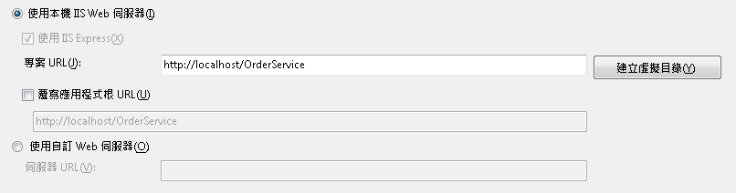  
  
        > [!WARNING]
        >  您必須在系統管理員模式中執行 [!INCLUDE[vs_current_long](../../../../includes/vs-current-long-md.md)]，才能進行這項設定。  
  
         這兩個步驟會將工作流程服務專案設定為由 IIS 裝載。  
  
4.  開啟`Service1.xamlx`是否已開啟及刪除現有**ReceiveRequest**和**SendResponse**活動。  
  
5.  選取**循序服務**活動，然後按一下**變數**連結並新增下列圖例所示的變數。 這樣做就會加入一些之後將用於工作流程服務的變數。  
  
    > [!NOTE]
    >  如果 CorrelationHandle 不在 [變數類型] 下拉式清單中，選取**瀏覽型別**從下拉式清單。 輸入中的 CorrelationHandle**型別名稱**，從清單方塊中選取 CorrelationHandle，然後按一下**確定**。  
  
     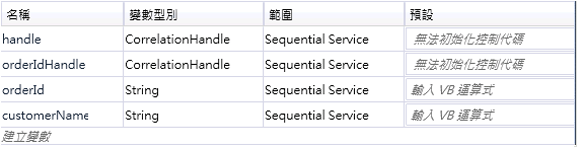  
  
6.  將拖放**ReceiveAndSendReply**活動範本**循序服務**活動。 這組活動將會接收用戶端的訊息並傳回回覆。  
  
    1.  選取**接收**活動，然後設定下圖中反白的屬性。  
  
         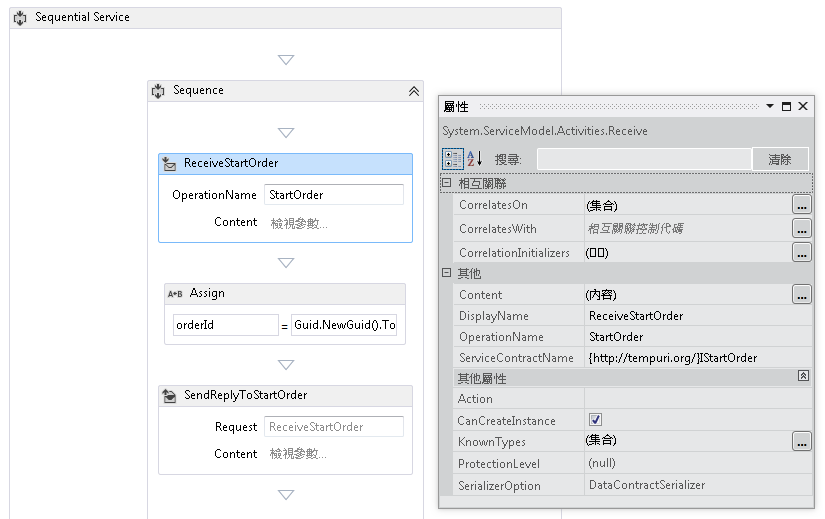  
  
         DisplayName 屬性會針對設計工具中的 Receive 活動設定顯示名稱。 ServiceContractName 和 OperationName 屬性會指定 Receive 活動所實作之服務合約和作業的名稱。 如需工作流程服務中使用合約的詳細資訊，請參閱[工作流程中使用的合約](../../../../docs/framework/wcf/feature-details/using-contracts-in-workflow.md)。  
  
    2.  按一下**定義...** 中連結**ReceiveStartOrder**活動並設定在下圖所示的屬性。  請注意，**參數**選取選項按鈕時，名為`p_customerName`繫結至`customerName`變數。 這會設定**接收**活動接收部分資料，並將該資料繫結至區域變數。  
  
         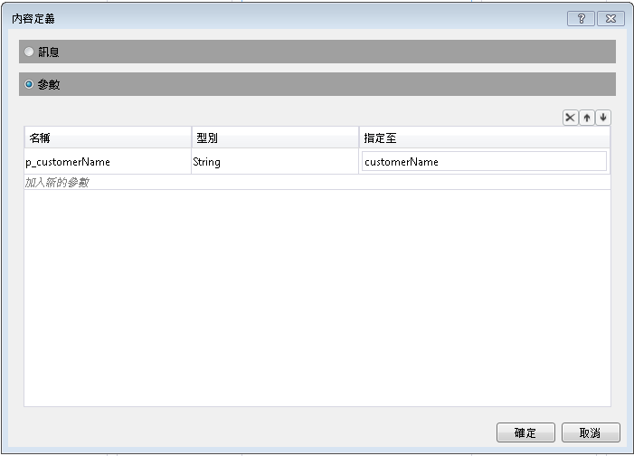  
  
    3.  選取**SendReplyToReceive**活動，然後設定反白顯示在下圖中的屬性。  
  
         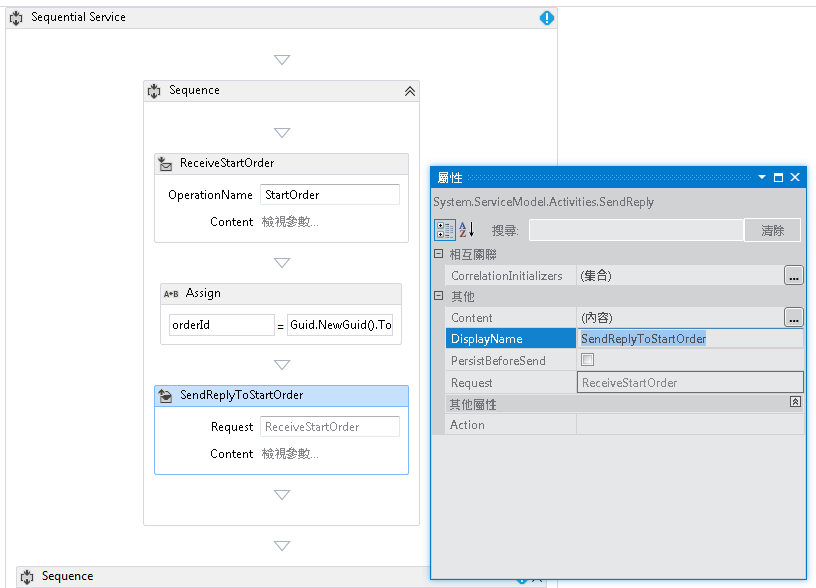  
  
    4.  按一下**定義...** 中連結**SendReplyToStartOrder**活動並設定在下圖所示的屬性。 請注意，**參數**選取選項按鈕，則為參數命名為`p_orderId`繫結至`orderId`變數。 這項設定會指定 SendReplyToStartOrder 活動將字串型別的值傳回給呼叫端。  
  
         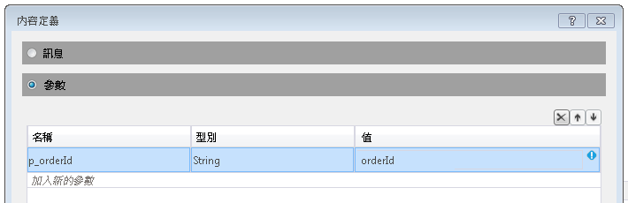  
  
    5.  將拖放 Assign 活動之間**接收**和**SendReply**活動並設定屬性，如下圖所示：  
  
         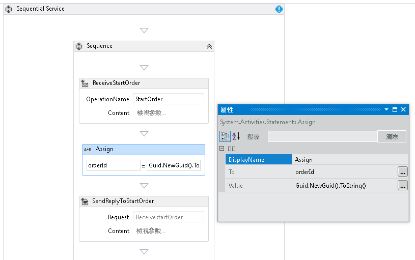  
  
         這樣就會建立新的訂單 ID 並將此值放入 orderId 變數中。  
  
    6.  選取**ReplyToStartOrder**活動。 在 屬性 視窗中按一下 省略符號按鈕**CorrelationInitializers**。 選取**新增初始設定式**連結並輸入`orderIdHandle`在初始設定式 文字方塊中，選取查詢相互關聯類型的相互關聯初始設定式，並在 XPATH 查詢 下拉式方塊底下選取 p_orderId。 下圖將顯示這些設定。 按一下 [確定 **Deploying Office Solutions**]。  這樣就會初始化用戶端與這個工作流程服務執行個體之間的相互關聯。 收到包含此訂單 ID 的訊息時，它就會路由傳送至這個工作流程服務執行個體。  
  
         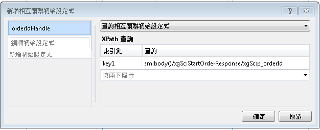  
  
7.  拖放另一個**ReceiveAndSendReply**活動至工作流程的結尾 (外部**順序**包含第一個**接收**和**SendReply**活動)。 這樣就會接收用戶端所傳送的第二則訊息並回應訊息。  
  
    1.  選取**順序**，其中包含新加入**接收**和**SendReply**活動，然後按一下**變數** 按鈕。 加入在下圖中反白顯示的變數：  
  
         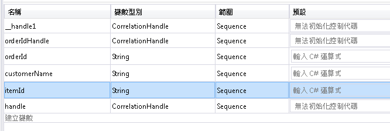  
  
    2.  選取**接收**活動並設定屬性，如下圖所示：  
  
         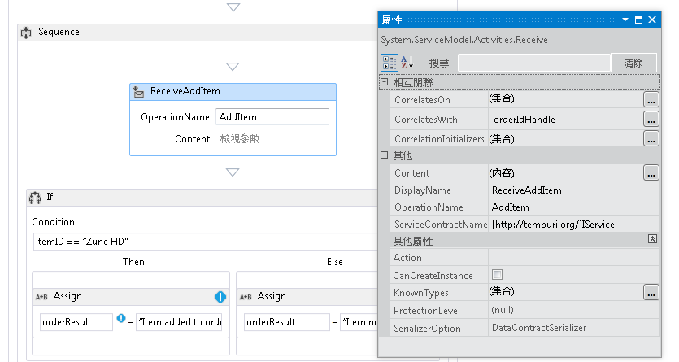  
  
    3.  按一下**定義...** 中連結**ReceiveAddItem**活動並加入下圖中顯示的參數： 這樣就會設定 receive 活動，以接受兩個參數，訂單 ID 以及所訂購項目的識別碼。  
  
         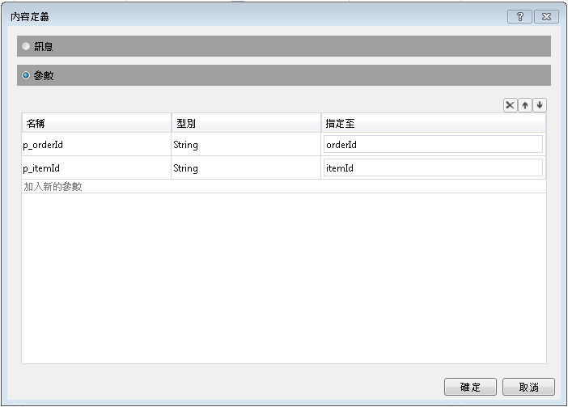  
  
    4.  按一下**CorrelateOn**省略符號按鈕，並輸入`orderIdHandle`。 在下**XPath 查詢**，按一下下拉式箭號並選取`p_orderId`。 這樣就會設定第二個 Receive 活動的相互關聯。 如需有關相互關聯，請參閱[相互關聯](../../../../docs/framework/wcf/feature-details/correlation.md)。  
  
         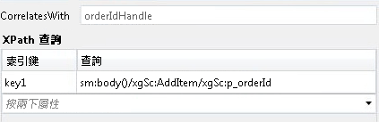  
  
    5.  將拖放**如果**活動之後立即**ReceiveAddItem**活動。 這個活動的運作方式就如同 if 陳述式。  
  
        1.  設定**條件**屬性 `itemId=="Zune HD" (itemId="Zune HD" for Visual Basic)`  
  
        2.  將拖放**指派**活動中的**然後**區段，而另一個到**Else**區段中設定的屬性**指派**下圖所示的活動。  
  
             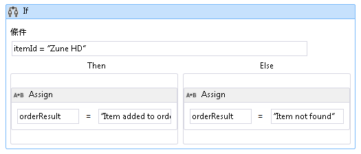  
  
             如果條件為`true`**然後**> 一節將會執行。 如果條件為`false` **Else**執行的區段。  
  
        3.  選取**SendReplyToReceive**活動，然後設定**DisplayName**下圖所示的屬性。  
  
             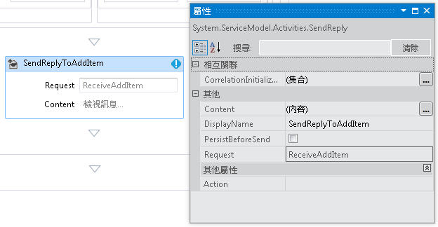  
  
        4.  按一下**定義...** 中連結**SetReplyToAddItem**活動並將它設定在下圖所示。 這會設定**SendReplyToAddItem**活動中的將值傳回`orderResult`變數。  
  
             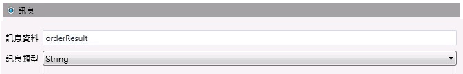  
  
8.  開啟 web.config 檔案，然後加入下列項目中的\<行為 > 區段以啟用工作流程持續性。  
  
    ```xml  
    <sqlWorkflowInstanceStore connectionString="Data Source=your-machine\SQLExpress;Initial Catalog=SQLPersistenceStore;Integrated Security=True;Asynchronous Processing=True" instanceEncodingOption="None" instanceCompletionAction="DeleteAll" instanceLockedExceptionAction="BasicRetry" hostLockRenewalPeriod="00:00:30" runnableInstancesDetectionPeriod="00:00:02" />  
              <workflowIdle timeToUnload="0"/>  
    ```  
  
    > [!WARNING]
    >  請務必取代上一個程式碼片段中的主機和 SQL Server 執行個體名稱。  
  
9. 建置方案。  
  
### <a name="to-create-a-client-application-to-call-the-workflow-service"></a>若要建立用戶端應用程式來呼叫工作流程服務  
  
1.  將名為 `OrderClient` 的新主控台應用程式專案加入至方案。  
  
2.  將下列組件的參考加入至 `OrderClient` 專案。  
  
    1.  System.ServiceModel.dll  
  
    2.  System.ServiceModel.Activities.dll  
  
3.  將服務參考加入至工作流程服務並將 `OrderService` 指定為命名空間。  
  
4.  在用戶端專案的 `Main()` 方法中，加入下列程式碼：  
  
    ```  
    static void Main(string[] args)  
    {  
       // Send initial message to start the workflow service  
       Console.WriteLine("Sending start message");  
       StartOrderClient startProxy = new StartOrderClient();  
       string orderId = startProxy.StartOrder("Kim Abercrombie");  
  
       // The workflow service is now waiting for the second message to be sent  
       Console.WriteLine("Workflow service is idle...");  
       Console.WriteLine("Press [ENTER] to send an add item message to reactivate the workflow service...");  
       Console.ReadLine();  
  
       // Send the second message  
       Console.WriteLine("Sending add item message");  
       AddItemClient addProxy = new AddItemClient();  
       AddItem item = new AddItem();  
       item.p_itemId = "Zune HD";  
       item.p_orderId = orderId;  
  
       string orderResult = addProxy.AddItem(item);  
       Console.WriteLine("Service returned: " + orderResult);  
    }  
    ```  
  
5.  建置方案並執行 `OrderClient` 應用程式。 用戶端就會顯示下列文字：  
  
    ```Output  
    Sending start messageWorkflow service is idle...Press [ENTER] to send an add item message to reactivate the workflow service...  
    ```  
  
6.  若要確認已保存工作流程服務，啟動 SQL Server Management Studio，請前往**啟動**功能表上，選取**所有程式**， **Microsoft SQL Server 2008**， **SQL Server Management Studio**。  
  
    1.  在左窗格中展開，**資料庫**， **SQLPersistenceStore**，**檢視**，以滑鼠右鍵按一下**System.Activities.DurableInstancing.Instances**選取**選取前 1000 個資料列**。 在**結果**窗格可讓您確認您看到列出至少一個執行個體。 如果執行時發生例外狀況，可能會有先前執行的其他執行個體。 您可以刪除現有的資料列，以滑鼠右鍵按一下**System.Activities.DurableInstancing.Instances** ，然後選取**編輯前 200 個資料列**、 按下**Execute** ] 按鈕，在 [結果] 窗格中選取所有資料列，選取 [**刪除**。  若要確認顯示在資料庫中的執行個體就是應用程式所建立的執行個體，請先確認 Instances 檢視表是空的，然後再執行用戶端。 一旦用戶端執行之後，請重新執行查詢 (選取前 1000 個資料列) 並確認已經加入新的執行個體。  
  
7.  按下 Enter，將 add item 訊息傳送至工作流程服務。 用戶端就會顯示下列文字：  
  
    ```Output  
    Sending add item messageService returned: Item added to orderPress any key to continue . . .  
    ```  
  
## <a name="see-also"></a>另請參閱  
 [工作流程服務](../../../../docs/framework/wcf/feature-details/workflow-services.md)
