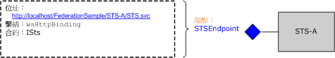

# <a name="federation"></a>同盟
此主題提供聯合安全性概念的簡短概觀。 其中也說明部署同盟安全性架構的 Windows Communication Foundation (WCF) 支援。 如需示範同盟的範例應用程式, 請參閱[同盟範例](../../../../docs/framework/wcf/samples/federation-sample.md)。  
  
## <a name="definition-of-federated-security"></a>聯合安全性定義  
 聯合安全性可以清楚地分隔用戶端正在存取的服務，以及關聯的驗證與授權程序。 聯合安全性也能夠讓多個系統、網路和組織在不同的信任領域中共同作業。  
  
 WCF 提供建立和部署採用同盟安全性之分散式系統的支援。  
  
### <a name="elements-of-a-federated-security-architecture"></a>聯合安全性架構的項目  
 聯合安全性架構有三個索引鍵項目，如下表所示。  
  
|項目|說明|  
|-------------|-----------------|  
|網域/領域|安全性管理或信任的單一單位。 一般的網域會包含單一組織。|  
|同盟|已建立信任的網域集合。 信任的層級可能會有所不同，但是一般來說會包含驗證，並且幾乎都包含授權。 一般的聯合可能會包含一些組織，這些組織已建立對資源集合之共用存取的信任。|  
|安全性權杖服務 (STS)|將安全性權杖 (也就是根據其信任的辨識項建立判斷提示) 發行至信任它之一方的 Web 服務。 這就形成網域間信任代理服務的基礎。|  
  
### <a name="example-scenario"></a>範例案例  
 下圖顯示聯合安全性的範例:  
  
   
  
 此案例包含兩個組織:答: a 和 B。組織 B 有 Web 資源 (Web 服務), 組織中的某些使用者覺得有價值。  
  
> [!NOTE]
> 本章節會使用*資源*、*服務*和*Web 服務*等詞彙交換。  
  
 一般來說，在存取服務之前，組織 B 會需要組織 A 的使用者提供某些有效形式的驗證。 此外，組織可能也會需要使用者通過授權才能存取討論中的特定資源。 處理這個問題，並且能夠讓組織 A 中的使用者存取組織 B 中資源的其中一種方法如下：  
  
- 組織 A 中的使用者在組織 B 登錄其認證 (使用者名稱與密碼)。  
  
- 在資源存取期間，組織 A 中的使用者將其認證提交給組織 B，並且在存取資源之前通過驗證。  
  
 這個方法有三個顯著的缺點：  
  
- 組織 B 除了管理本機使用者的認證外，還必須管理組織 A 的使用者認證。  
  
- 組織 A 中的使用者除了要維護平常用來存取組織 A 資源的認證外，還需要維護額外的認證集合 (也就是記憶額外的使用者名稱與密碼)。這通常會鼓勵在多個服務站台上使用相同的使用者名稱與密碼，而這是個很弱的安全性方式。  
  
- 這個架構並不會因為更多組織發覺組織 B 中有許多有用的資源而調整大小。  
  
 另一個替代方法是採用聯合安全性，可以改善之前提到的缺點。 在這個方法中，組織 A 和 B 會建立信任關係並採用安全性權杖服務 (STS)，以啟用已建立信任的代理服務。  
  
 在聯合安全性架構中，組織 A 的使用者了解如果想要存取組織 B 中的 Web 服務，就必須在組織 B 提交來自 STS 的有效安全性權杖，以便驗證與授權存取特定服務。  
  
 在連絡 STS B 時，使用者會接收到來自與 STS 關聯之原則的另一個間接取值層級。 在 STS B 將安全性權杖發行給他們之前，他們必須提交來自 STS A 的有效安全性權杖 (也就是用戶端信任領域)。 這是在兩個組織之間建立信任關係的必然結果，並且表示組織 B 不需要管理組織 A 使用者的識別。實際上，STS B 通常會有 Null 的 `issuerAddress` 和 `issuerMetadataAddress`。 如需詳細資訊，請參閱[如何：設定本機簽發者](../../../../docs/framework/wcf/feature-details/how-to-configure-a-local-issuer.md)。 在此情況下, 用戶端會諮詢本機原則來尋找 STS A。這種設定稱為「*主領域同盟*」, 它的規模較佳, 因為 sts B 不需要維護 Sts A 的相關資訊。  
  
 然後使用者就可以在組織 A 連絡 STS，並藉由提交平常用來存取組織內任何其他資源的驗證認證以取得安全性權杖。這也可以改善使用者必須維護多個認證集合，或在多個服務站台使用相同認證集合的問題。  
  
 使用者一旦取得來自 STS A 的安全性權杖，就會將權杖提交給 STS B。組織 B 就會開始執行使用者要求的授權，並且從自己的安全性權杖集合將安全性權杖發行給使用者。 然後使用者可以將其權杖提交給組織 B 的資源以存取服務。  
  
## <a name="support-for-federated-security-in-wcf"></a>在 WCF 中支援聯合安全性  
 WCF 提供透過[ \<wsFederationHttpBinding >](../../../../docs/framework/configure-apps/file-schema/wcf/wsfederationhttpbinding.md)部署聯合安全性架構的全包式支援。  
  
 WsFederationHttpBinding > 元素提供安全、可靠且互通的系結, 此系結需要使用 HTTP 做為要求-回復通訊樣式的基礎傳輸機制, 並採用文字和 XML 做為[ \< ](../../../../docs/framework/configure-apps/file-schema/wcf/wsfederationhttpbinding.md)編碼的電傳格式。  
  
 在聯合安全性案例中使用[ \<wsFederationHttpBinding >](../../../../docs/framework/configure-apps/file-schema/wcf/wsfederationhttpbinding.md)可以分離成兩個邏輯上獨立的階段, 如下列各節所述。  
  
### <a name="phase-1-design-phase"></a>第1階段:設計階段  
 在設計階段期間, 用戶端會使用[System.servicemodel 中繼資料公用程式工具 (Svcutil)](../../../../docs/framework/wcf/servicemodel-metadata-utility-tool-svcutil-exe.md)來讀取服務端點所公開的原則, 並收集服務的驗證和授權需求。 建構適當的 Proxy 以便在用戶端建立下列聯合安全性通訊模式：  
  
- 在用戶端信任領域中從 STS 取得安全性權杖。  
  
- 在服務信任領域中將權杖提交給 STS。  
  
- 在服務信任領域中從 STS 取得安全性權杖。  
  
- 將權杖提交給服務以存取服務。  
  
### <a name="phase-2-run-time-phase"></a>第2階段:執行時間階段  
 在執行時間階段中, 用戶端會具現化 WCF 用戶端類別的物件, 並使用 WCF 用戶端進行呼叫。 WCF 的基礎架構會處理先前在聯合安全性通訊模式中提到的步驟, 並讓用戶端順暢地取用服務。  
  
## <a name="sample-implementation-using-wcf"></a>使用 WCF 的範例實作  
 下圖顯示使用 WCF 的原生支援之聯合安全性架構的範例執行。  
  
   
  
### <a name="example-myservice"></a>範例 MyService  
 服務 `MyService` 會透過 `MyServiceEndpoint` 公開單一端點。 下圖顯示與端點關聯的位址、繫結與合約。  
  
   
  
 服務端點`MyServiceEndpoint`會`accessAuthorized` [ \<使用 wsFederationHttpBinding >](../../../../docs/framework/configure-apps/file-schema/wcf/wsfederationhttpbinding.md) , 而且需要有效的安全性判斷提示標記語言 (SAML) 權杖搭配 STS B 所發行的宣告。這會在服務設定中以宣告方式指定。  
  
```xml  
<system.serviceModel>  
  <services>  
    <service type="FederationSample.MyService"      
        behaviorConfiguration='MyServiceBehavior'>  
        <endpoint address=""  
            binding=" wsFederationHttpBinding"  
            bindingConfiguration='MyServiceBinding'  
            contract="Federation.IMyService" />  
   </service>  
  </services>  
  
  <bindings>  
    <wsFederationHttpBinding>  
    <!-- This is the binding used by MyService. It redirects   
    clients to STS-B. -->  
      <binding name='MyServiceBinding'>  
        <security mode="Message">  
           <message issuedTokenType=  
"http://docs.oasis-open.org/wss/oasis-wss-saml-token-profile-1.1#SAMLV1.1">  
           <issuer address="http://localhost/FederationSample/STS-B/STS.svc" />  
            <issuerMetadata   
           address=  
"http://localhost/FederationSample/STS-B/STS.svc/mex" />  
         <requiredClaimTypes>  
            <add claimType="http://tempuri.org:accessAuthorized" />  
         </requiredClaimTypes>  
        </message>  
      </security>  
      </binding>  
    </wsFederationHttpBinding>  
  </bindings>  
  
  <behaviors>  
    <behavior name='MyServiceBehavior'>  
      <serviceAuthorization   
operationRequirementType="FederationSample.MyServiceOperationRequirement, MyService" />  
       <serviceCredentials>  
         <serviceCertificate findValue="CN=FederationSample.com"  
         x509FindType="FindBySubjectDistinguishedName"  
         storeLocation='LocalMachine'  
         storeName='My' />  
      </serviceCredentials>  
    </behavior>  
  </behaviors>  
</system.serviceModel>  
```  
  
> [!NOTE]
> 關於 `MyService` 需要的宣告有一點應該要注意。 第二個圖形表示 `MyService` 需要 SAML 權杖使用 `accessAuthorized` 宣告。 更精確地說，這會指定 `MyService` 需要的宣告類型。 此宣告類型的完整名稱是`http://tempuri.org:accessAuthorized` (連同相關聯的命名空間), 用於服務設定檔中。 這個宣告的值表示這個宣告存在，並且假設 STS B 會將它設定為 `true`。  
  
 在執行階段時，`MyServiceOperationRequirement` 類別會強制執行這個原則，而這個類別是 `MyService` 實作的一部分。  
  
 [!code-csharp[C_Federation#0](../../../../samples/snippets/csharp/VS_Snippets_CFX/c_federation/cs/source.cs#0)]
 [!code-vb[C_Federation#0](../../../../samples/snippets/visualbasic/VS_Snippets_CFX/c_federation/vb/source.vb#0)]  
[!code-csharp[C_Federation#1](../../../../samples/snippets/csharp/VS_Snippets_CFX/c_federation/cs/source.cs#1)]
[!code-vb[C_Federation#1](../../../../samples/snippets/visualbasic/VS_Snippets_CFX/c_federation/vb/source.vb#1)]  
  
#### <a name="sts-b"></a>STS B  
 下圖顯示 STS B。如同之前所述，安全性權杖服務 (STS) 也是 Web 服務，並且能夠有與其關聯的端點和原則等等。  
  
   
  
 STS B 會公開能夠用來要求安全性權杖的單一端點 (稱為 `STSEndpoint`)。 具體來說，STS B 會使用 `accessAuthorized` 宣告發行 SAML 權杖，您可以在 `MyService` 服務站台提交這個權杖以存取服務。 但是，STS B 需要使用者提交 STS A 發行的有效 SAML 權杖，其中包含 `userAuthenticated` 宣告。 在 STS 組態中會以宣告方式指定。  
  
```xml  
<system.serviceModel>  
  <services>  
    <service type="FederationSample.STS_B" behaviorConfiguration=  
     "STS-B_Behavior">  
    <endpoint address=""  
              binding="wsFederationHttpBinding"  
              bindingConfiguration='STS-B_Binding'  
      contract="FederationSample.ISts" />  
    </service>  
  </services>  
  <bindings>  
    <wsFederationHttpBinding>  
    <!-- This is the binding used by STS-B. It redirects clients to   
         STS-A. -->  
      <binding name='STS-B_Binding'>  
        <security mode='Message'>  
          <message issuedTokenType="http://docs.oasis-open.org/wss/oasis-wss-saml-token-profile-1.1#SAMLV1.1">  
          <issuer address='http://localhost/FederationSample/STS-A/STS.svc' />  
          <issuerMetadata address='http://localhost/FederationSample/STS-A/STS.svc/mex'/>  
          <requiredClaimTypes>  
            <add claimType='http://tempuri.org:userAuthenticated'/>  
          </requiredClaimTypes>  
          </message>  
        </security>  
    </binding>  
   </wsFederationHttpBinding>  
  </bindings>  
  <behaviors>  
  <behavior name='STS-B_Behavior'>  
    <serviceAuthorization   operationRequirementType='FederationSample.STS_B_OperationRequirement, STS_B' />  
    <serviceCredentials>  
      <serviceCertificate findValue='CN=FederationSample.com'  
      x509FindType='FindBySubjectDistinguishedName'  
       storeLocation='LocalMachine'  
       storeName='My' />  
     </serviceCredentials>  
   </behavior>  
  </behaviors>  
</system.serviceModel>  
```  
  
> [!NOTE]
> 同樣地, `userAuthenticated`宣告是 STS B 所需的宣告類型。此宣告類型的完整名稱是`http://tempuri.org:userAuthenticated` (連同相關聯的命名空間), 用於 STS 設定檔中。 這個宣告的值表示這個宣告存在，並且假設 STS A 會將它設定為 `true`。  
  
 在執行階段時，`STS_B_OperationRequirement` 類別會強制執行這個原則，而這個類別是 STS B 實作的一部分。  
  
 [!code-csharp[C_Federation#2](../../../../samples/snippets/csharp/VS_Snippets_CFX/c_federation/cs/source.cs#2)]
 [!code-vb[C_Federation#2](../../../../samples/snippets/visualbasic/VS_Snippets_CFX/c_federation/vb/source.vb#2)]  
  
 如果取消存取檢查，STS B 就會使用 `accessAuthorized` 宣告發行 SAML 權杖。  
  
 [!code-csharp[C_Federation#3](../../../../samples/snippets/csharp/VS_Snippets_CFX/c_federation/cs/source.cs#3)]
 [!code-vb[C_Federation#3](../../../../samples/snippets/visualbasic/VS_Snippets_CFX/c_federation/vb/source.vb#3)]  
  
#### <a name="sts-a"></a>STS A  
 下圖將顯示 STS A。  
  
   
  
 與 STS B 類似，STS A 也是發行安全性權杖，並針對此目的公開單一端點的 Web 服務。 不過, 它會使用不同的系`wsHttpBinding`結 (), 並要求使用者出示`emailAddress`具有宣告的有效 CardSpace。 它會使用 `userAuthenticated` 宣告發行 SAML 權杖當做回應。 在服務組態中會以宣告方式指定。  
  
```xml  
<system.serviceModel>  
  <services>  
    <service type="FederationSample.STS_A" behaviorConfiguration="STS-A_Behavior">  
      <endpoint address=""  
                binding="wsHttpBinding"  
                bindingConfiguration="STS-A_Binding"  
                contract="FederationSample.ISts">  
       <identity>  
       <certificateReference findValue="CN=FederationSample.com"    
                       x509FindType="FindBySubjectDistinguishedName"  
                       storeLocation="LocalMachine"   
                       storeName="My" />  
       </identity>  
    <endpoint>  
  </service>  
</services>  
  
<bindings>  
  <wsHttpBinding>  
  <!-- This is the binding used by STS-A. It requires users to present  
   a CardSpace. -->  
    <binding name='STS-A_Binding'>  
      <security mode='Message'>  
        <message clientCredentialType="CardSpace" />  
      </security>  
    </binding>  
  </wsHttpBinding>  
</bindings>  
  
<behaviors>  
  <behavior name='STS-A_Behavior'>  
    <serviceAuthorization operationRequirementType=  
     "FederationSample.STS_A_OperationRequirement, STS_A" />  
      <serviceCredentials>  
  <serviceCertificate findValue="CN=FederationSample.com"  
                     x509FindType='FindBySubjectDistinguishedName'  
                     storeLocation='LocalMachine'  
                     storeName='My' />  
      </serviceCredentials>  
    </behavior>  
  </behaviors>  
</system.serviceModel>  
```  
  
 在執行階段時，`STS_A_OperationRequirement` 類別會強制執行這個原則，而這個類別是 STS A 實作的一部分。  
  
 [!code-csharp[C_Federation#4](../../../../samples/snippets/csharp/VS_Snippets_CFX/c_federation/cs/source.cs#4)]
 [!code-vb[C_Federation#4](../../../../samples/snippets/visualbasic/VS_Snippets_CFX/c_federation/vb/source.vb#4)]  
  
 如果存取是 `true`，STS A 就會使用 `userAuthenticated` 宣告發行 SAML 權杖。  
  
 [!code-csharp[C_Federation#5](../../../../samples/snippets/csharp/VS_Snippets_CFX/c_federation/cs/source.cs#5)]
 [!code-vb[C_Federation#5](../../../../samples/snippets/visualbasic/VS_Snippets_CFX/c_federation/vb/source.vb#5)]  
  
### <a name="client-at-organization-a"></a>組織 A 的用戶端  
 下圖顯示組織 A 的用戶端，以及關於進行 `MyService` 服務呼叫的步驟。 也會包含其他功能元件以提供完整性。  
  
   
  
## <a name="summary"></a>總結  
 聯合安全性清楚地分隔責任，並協助建置安全且可擴充的服務架構。 WCF 是用來建立和部署分散式應用程式的平臺, 它提供了執行同盟安全性的原生支援。  
  
## <a name="see-also"></a>另請參閱

- [Security](../../../../docs/framework/wcf/feature-details/security.md)
