# <a name="flowing-transactions-into-and-out-of-workflow-services"></a>進出工作流程服務的異動流動
工作流程服務與用戶端都可以參與異動。  若要讓服務作業變成環境交易的一部分，請將 <xref:System.ServiceModel.Activities.Receive> 活動放在 <xref:System.ServiceModel.Activities.TransactedReceiveScope> 活動內。 <xref:System.ServiceModel.Activities.Send> 或 <xref:System.ServiceModel.Activities.SendReply> 活動在 <xref:System.ServiceModel.Activities.TransactedReceiveScope> 內所進行的任何呼叫也會在環境交易中進行。 工作流程用戶端應用程式可以使用 <xref:System.Activities.Statements.TransactionScope> 活動建立環境交易，然後使用環境交易呼叫服務作業。 本主題逐步帶領您建立參與交易的工作流程服務和工作流程用戶端。  
  
> [!WARNING]
>  如果工作流程服務執行個體是在交易內載入，而且工作流程包含 <xref:System.Activities.Statements.Persist> 活動，則工作流程執行個體將會停止回應，直到交易逾時為止。  
  
> [!IMPORTANT]
>  每當您使用 <xref:System.ServiceModel.Activities.TransactedReceiveScope> 時，建議您將工作流程中的所有 Receive 放在 <xref:System.ServiceModel.Activities.TransactedReceiveScope> 活動內。  
  
> [!IMPORTANT]
>  如果使用 <xref:System.ServiceModel.Activities.TransactedReceiveScope> 而且訊息按照錯誤的順序送達，工作流程就會在嘗試傳送第一則順序錯誤的訊息時中止。 當工作流程閒置時，您必須確定工作流程永遠位於一致的停止點。 萬一工作流程已中止，這樣做可讓您從上一個保存點重新啟動工作流程。  
  
### <a name="create-a-shared-library"></a>建立共用程式庫  
  
1.  建立一個新的空白 Visual Studio 方案。  
  
2.  加入稱為 `Common` 的新類別庫專案。 加入下列組件的參考：  
  
    -   System.Activities.dll  
  
    -   System.ServiceModel.dll  
  
    -   System.ServiceModel.Activities.dll  
  
    -   System.Transactions.dll  
  
3.  將稱為 `PrintTransactionInfo` 的新類別加入至 `Common` 專案。 此類別衍生自 <xref:System.Activities.NativeActivity>，而且會多載 <xref:System.Activities.NativeActivity.Execute%2A> 方法。  
  
    ```  
    using System;  
    using System;  
    using System.Activities;  
    using System.Transactions;  
  
    namespace Common  
    {  
        public class PrintTransactionInfo : NativeActivity  
        {  
            protected override void Execute(NativeActivityContext context)  
            {  
                RuntimeTransactionHandle rth = context.Properties.Find(typeof(RuntimeTransactionHandle).FullName) as RuntimeTransactionHandle;  
  
                if (rth == null)  
                {  
                    Console.WriteLine("There is no ambient RuntimeTransactionHandle");  
                }  
  
                Transaction t = rth.GetCurrentTransaction(context);  
  
                if (t == null)  
                {  
                    Console.WriteLine("There is no ambient transaction");  
                }  
                else  
                {  
                    Console.WriteLine("Transaction: {0} is {1}", t.TransactionInformation.DistributedIdentifier, t.TransactionInformation.Status);  
                }  
            }  
        }  
  
    }  
    ```  
  
     這是一種原生活動，該活動可顯示環境異動的相關資訊，而且可同時用於本主題中所使用的服務和用戶端工作流程。 建置此方案，以提供這項活動**常見**區段**工具箱**。  
  
### <a name="implement-the-workflow-service"></a>實作工作流程服務  
  
1.  加入新[!INCLUDE[indigo2](../../../../includes/indigo2-md.md)]工作流程服務，稱為`WorkflowService`至`Common`專案。 若要這樣做，右邊按一下`Common`專案，然後選取**新增**，**新項目...**，選取**工作流程**下**已安裝的範本**選取**WCF Workflow Service**。  
  
     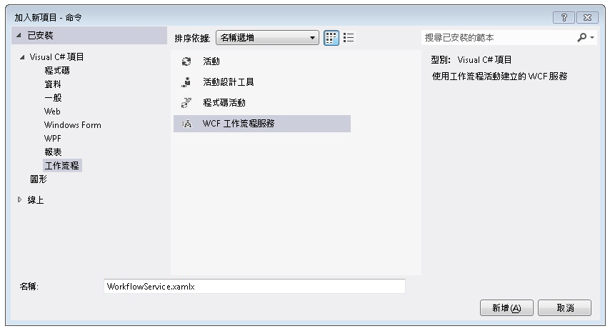  
  
2.  刪除預設的 `ReceiveRequest` 和 `SendResponse` 活動。  
  
3.  將 <xref:System.Activities.Statements.WriteLine> 活動拖放到 `Sequential Service` 活動中。 將文字屬性設定為 `"Workflow Service starting ..."`，如下列範例所示。  
  
       
  
4.  將 <xref:System.ServiceModel.Activities.TransactedReceiveScope> 拖放到 <xref:System.Activities.Statements.WriteLine> 活動後面。 <xref:System.ServiceModel.Activities.TransactedReceiveScope>活動位於**傳訊**區段**工具箱**。 <xref:System.ServiceModel.Activities.TransactedReceiveScope>活動由兩個區段組成**要求**和**主體**。 **要求**區段包含<xref:System.ServiceModel.Activities.Receive>活動。 **主體**> 一節包含要在收到訊息之後，在交易內執行的活動。  
  
     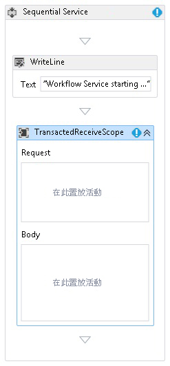  
  
5.  選取<xref:System.ServiceModel.Activities.TransactedReceiveScope>活動，然後按一下**變數** 按鈕。 加入下列變數。  
  
     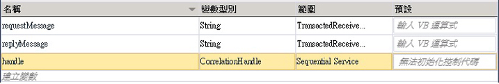  
  
    > [!NOTE]
    >  根據預設，您可以刪除現有的資料變數。 您也可以使用現有的控制碼變數。  
  
6.  將拖放<xref:System.ServiceModel.Activities.Receive>活動內**要求**區段<xref:System.ServiceModel.Activities.TransactedReceiveScope>活動。 設定下列屬性：  
  
    |屬性|值|  
    |--------------|-----------|  
    |CanCreateInstance|True (核取此核取方塊)|  
    |OperationName|StartSample|  
    |ServiceContractName|ITransactionSample|  
  
     工作流程的外觀應該如下圖所示：  
  
     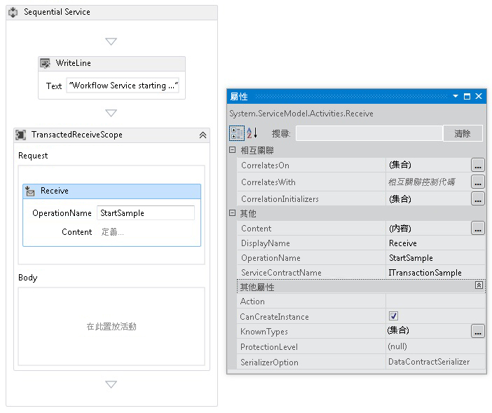  
  
7.  按一下**定義...**中連結<xref:System.ServiceModel.Activities.Receive>活動，然後進行下列設定：  
  
     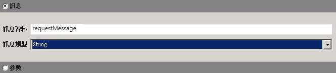  
  
8.  將 <xref:System.Activities.Statements.Sequence> 活動拖放到 <xref:System.ServiceModel.Activities.TransactedReceiveScope> 的 [主體] 區段內。 拖放 <xref:System.Activities.Statements.Sequence> 活動內的兩個 <xref:System.Activities.Statements.WriteLine> 活動，並設定 <xref:System.Activities.Statements.WriteLine.Text%2A> 屬性，如下列範例所示。  
  
    |活動|值|  
    |--------------|-----------|  
    |第一個 WriteLine|「 服務： 接收已完成 」|  
    |第二個 WriteLine|"Service: Received = " + requestMessage|  
  
     工作流程的外觀現在應該如下圖所示：  
  
     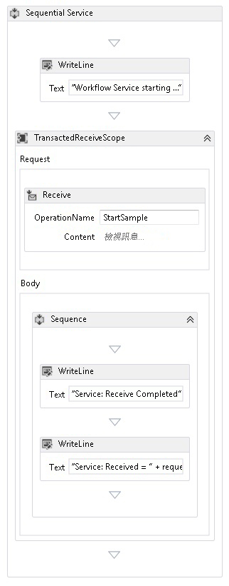  
  
9. 將拖放`PrintTransactionInfo`活動之後，第二個<xref:System.Activities.Statements.WriteLine>中的活動**主體**中<xref:System.ServiceModel.Activities.TransactedReceiveScope>活動。  
  
     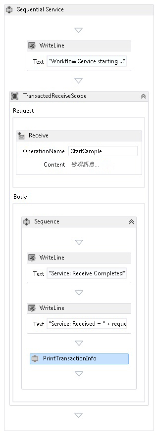  
  
10. 將 <xref:System.Activities.Statements.Assign> 活動拖放到 `PrintTransactionInfo` 活動後面，然後根據下表設定其屬性。  
  
    |屬性|值|  
    |--------------|-----------|  
    |以|replyMessage|  
    |值|"Service: Sending reply."|  
  
11. 將 <xref:System.Activities.Statements.WriteLine> 活動拖放到 <xref:System.Activities.Statements.Assign> 活動後面，並將其 <xref:System.Activities.Statements.WriteLine.Text%2A> 屬性設定為 "Service: Begin reply"。  
  
     工作流程的外觀現在應該如下圖所示：  
  
     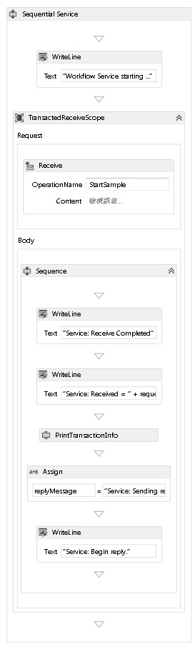  
  
12. 以滑鼠右鍵按一下<xref:System.ServiceModel.Activities.Receive>活動，然後選取**建立 SendReply**並將它貼在最後一個之後<xref:System.Activities.Statements.WriteLine>活動。 按一下**定義...**中連結`SendReplyToReceive`活動，然後進行下列設定。  
  
     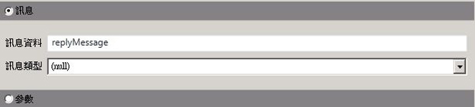  
  
13. 拖曳和卸除<xref:System.Activities.Statements.WriteLine>活動之後`SendReplyToReceive`活動，然後設定它有<xref:System.Activities.Statements.WriteLine.Text%2A>屬性 」 服務： 傳送的回覆。 」  
  
14. 將 <xref:System.Activities.Statements.WriteLine> 活動拖放到工作流程的底部，然後將其 <xref:System.Activities.Statements.WriteLine.Text%2A> 屬性設定為 "Service: Workflow ends, press ENTER to exit"。  
  
     完成的服務工作流程外觀應該如下圖所示：  
  
     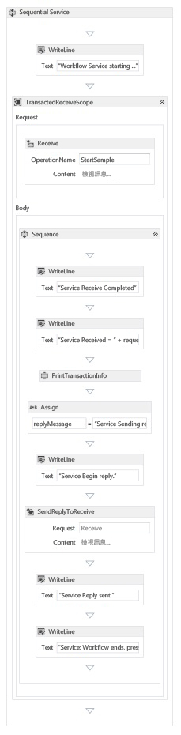  
  
### <a name="implement-the-workflow-client"></a>實作工作流程用戶端  
  
1.  將稱為 `WorkflowClient` 的新 WCF 工作流程應用程式加入至 `Common` 專案。 若要這樣做，右邊按一下`Common`專案，然後選取**新增**，**新項目...**，選取**工作流程**下**已安裝的範本**選取**活動**。  
  
     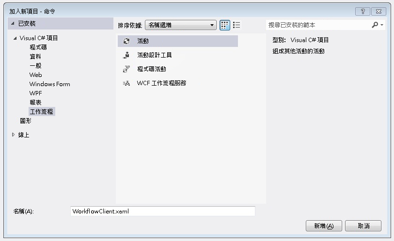  
  
2.  將 <xref:System.Activities.Statements.Sequence> 活動拖放至設計介面上。  
  
3.  拖放 <xref:System.Activities.Statements.Sequence> 活動內的 <xref:System.Activities.Statements.WriteLine> 活動，並將其 <xref:System.Activities.Statements.WriteLine.Text%2A> 屬性設定為 `"Client: Workflow starting"`。 工作流程的外觀現在應該如下圖所示：  
  
       
  
4.  將 <xref:System.Activities.Statements.TransactionScope> 活動拖放到 <xref:System.Activities.Statements.WriteLine> 活動後面。  選取 <xref:System.Activities.Statements.TransactionScope> 活動，按一下 [變數] 按鈕，然後加入下列變數。  
  
     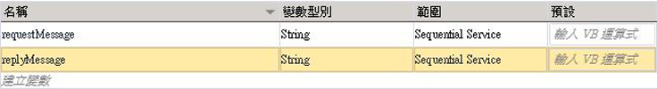  
  
5.  將 <xref:System.Activities.Statements.Sequence> 活動拖放到 <xref:System.Activities.Statements.TransactionScope> 活動的主體內。  
  
6.  將 `PrintTransactionInfo` 活動拖放到 <xref:System.Activities.Statements.Sequence> 內  
  
7.  將拖放<xref:System.Activities.Statements.WriteLine>活動之後`PrintTransactionInfo`活動，然後設定其<xref:System.Activities.Statements.WriteLine.Text%2A>屬性為"Client: Beginning Send"。 工作流程的外觀現在應該如下圖所示：  
  
       
  
8.  將 <xref:System.ServiceModel.Activities.Send> 活動拖放到 <xref:System.Activities.Statements.Assign> 活動後面，然後設定下列屬性：  
  
    |屬性|值|  
    |--------------|-----------|  
    |EndpointConfigurationName|workflowServiceEndpoint|  
    |OperationName|StartSample|  
    |ServiceContractName|ITransactionSample|  
  
     工作流程的外觀現在應該如下圖所示：  
  
     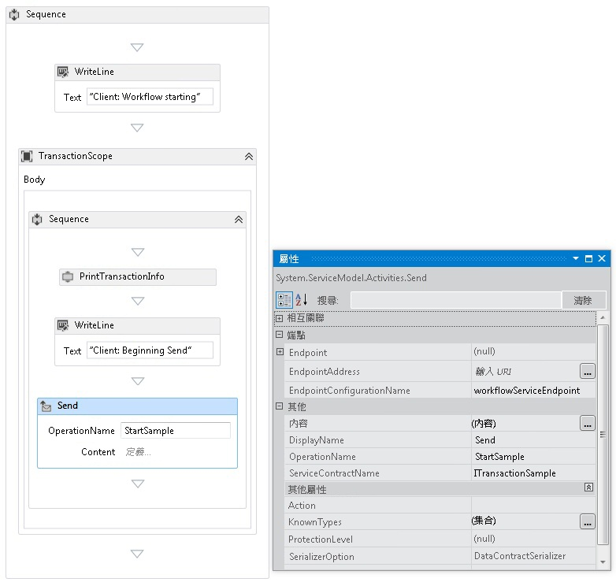  
  
9. 按一下**定義...**連結，然後進行下列設定：  
  
     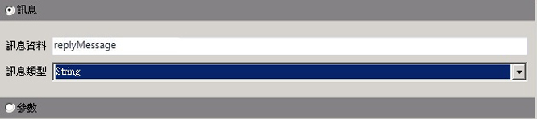  
  
10. 以滑鼠右鍵按一下<xref:System.ServiceModel.Activities.Send>活動，然後選取**建立 ReceiveReply**。 <xref:System.ServiceModel.Activities.ReceiveReply> 活動將會自動放在 <xref:System.ServiceModel.Activities.Send> 活動後面。  
  
11. 按一下 ReceiveReplyForSend 活動中的 [定義] 連結，然後進行下列設定：  
  
       
  
12. 將 <xref:System.Activities.Statements.WriteLine> 活動拖放到 <xref:System.ServiceModel.Activities.Send> 和 <xref:System.ServiceModel.Activities.ReceiveReply> 活動之間，然後將其 <xref:System.Activities.Statements.WriteLine.Text%2A> 屬性設定為 "Client: Send complete"。  
  
13. 將 <xref:System.Activities.Statements.WriteLine> 活動拖放到 <xref:System.ServiceModel.Activities.ReceiveReply> 活動後面，並將其 <xref:System.Activities.Statements.WriteLine.Text%2A> 屬性設定為 "Client side: Reply received = " + replyMessage  
  
14. 將 `PrintTransactionInfo` 活動拖放到 <xref:System.Activities.Statements.WriteLine> 活動後面。  
  
15. 將 <xref:System.Activities.Statements.WriteLine> 活動拖放到工作流程的結尾，然後將其 <xref:System.Activities.Statements.WriteLine.Text%2A> 屬性設定為 "Client workflow ends"。 完成的工作流程外觀應該如下圖所示。  
  
     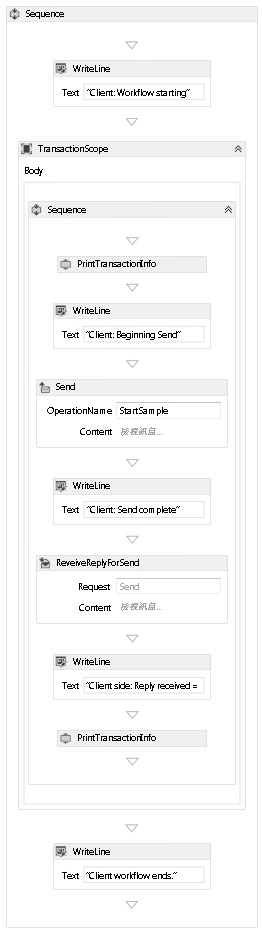  
  
16. 建置方案。  
  
### <a name="create-the-service-application"></a>建立服務應用程式  
  
1.  將稱為 `Service` 的新主控台應用程式專案加入至方案。 加入下列組件的參考：  
  
    1.  System.Activities.dll  
  
    2.  System.ServiceModel.dll  
  
    3.  System.ServiceModel.Activities.dll  
  
2.  開啟產生的 Program.cs 檔案以及下列程式碼：  
  
    ```  
    static void Main()  
          {  
              Console.WriteLine("Building the server.");  
              using (WorkflowServiceHost host = new WorkflowServiceHost(new DeclarativeServiceWorkflow(), new Uri("net.tcp://localhost:8000/TransactedReceiveService/Declarative")))  
              {                
                  //Start the server  
                  host.Open();  
                  Console.WriteLine("Service started.");  
  
                  Console.WriteLine();  
                  Console.ReadLine();  
                  //Shutdown  
                  host.Close();  
              };         
          }  
    ```  
  
3.  將下列 app.config 檔案加入至專案。  
  
    ```xml  
    <?xml version="1.0" encoding="utf-8" ?>  
    <!-- Copyright © Microsoft Corporation.  All rights reserved. -->  
    <configuration>  
        <system.serviceModel>  
            <bindings>  
                <netTcpBinding>  
                    <binding transactionFlow="true" />  
                </netTcpBinding>  
            </bindings>  
        </system.serviceModel>  
    </configuration>  
    ```  
  
### <a name="create-the-client-application"></a>建立用戶端應用程式  
  
1.  將稱為 `Client` 的新主控台應用程式專案加入至方案。 將參考加入到 System.Activities.dll。  
  
2.  開啟 program.cs 檔案並加入下列程式碼。  
  
    ```  
    class Program  
        {  
  
            private static AutoResetEvent syncEvent = new AutoResetEvent(false);  
  
            static void Main(string[] args)  
            {  
                //Build client  
                Console.WriteLine("Building the client.");  
                WorkflowApplication client = new WorkflowApplication(new DeclarativeClientWorkflow());  
                client.Completed = Program.Completed;  
                client.Aborted = Program.Aborted;  
                client.OnUnhandledException = Program.OnUnhandledException;  
  
                //Wait for service to start  
                Console.WriteLine("Press ENTER once service is started.");  
                Console.ReadLine();  
  
                //Start the client              
                Console.WriteLine("Starting the client.");  
                client.Run();  
                syncEvent.WaitOne();  
  
                //Sample complete  
                Console.WriteLine();  
                Console.WriteLine("Client complete. Press ENTER to exit.");  
                Console.ReadLine();  
            }  
  
            private static void Completed(WorkflowApplicationCompletedEventArgs e)  
            {  
                Program.syncEvent.Set();  
            }  
  
            private static void Aborted(WorkflowApplicationAbortedEventArgs e)  
            {  
                Console.WriteLine("Client Aborted: {0}", e.Reason);  
                Program.syncEvent.Set();  
            }  
  
            private static UnhandledExceptionAction OnUnhandledException(WorkflowApplicationUnhandledExceptionEventArgs e)  
            {  
                Console.WriteLine("Client had an unhandled exception: {0}", e.UnhandledException);  
                return UnhandledExceptionAction.Cancel;  
            }  
        }  
    ```  
  
## <a name="see-also"></a>另請參閱  
 [工作流程服務](../../../../docs/framework/wcf/feature-details/workflow-services.md)  
 [Windows Communication Foundation 交易概觀](../../../../docs/framework/wcf/feature-details/transactions-overview.md)  
 [TransactedReceiveScope 的使用](../../../../docs/framework/windows-workflow-foundation/samples/use-of-transactedreceivescope.md)
