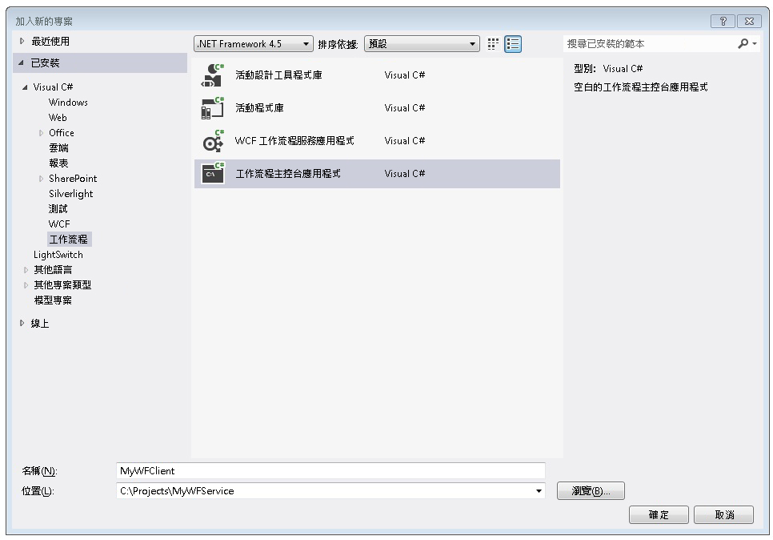
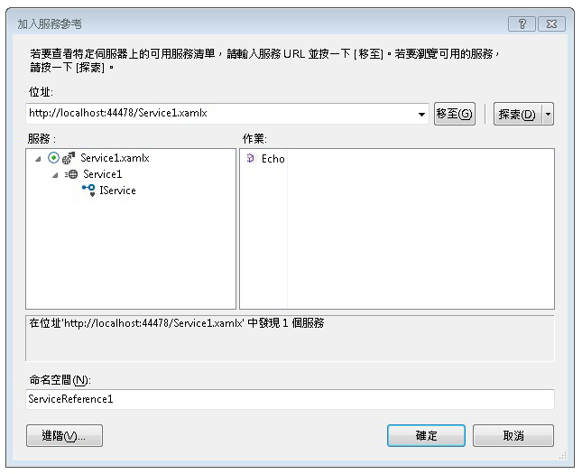
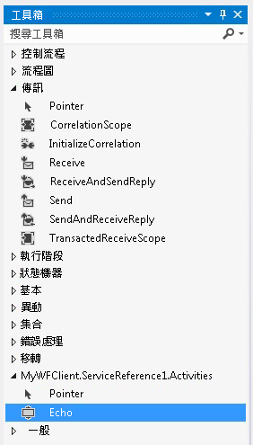
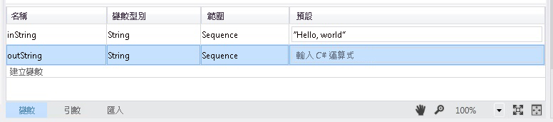
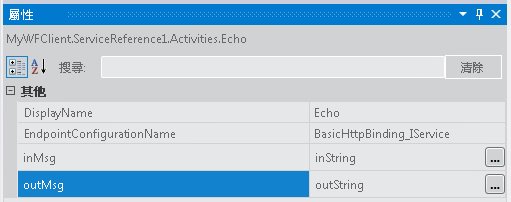
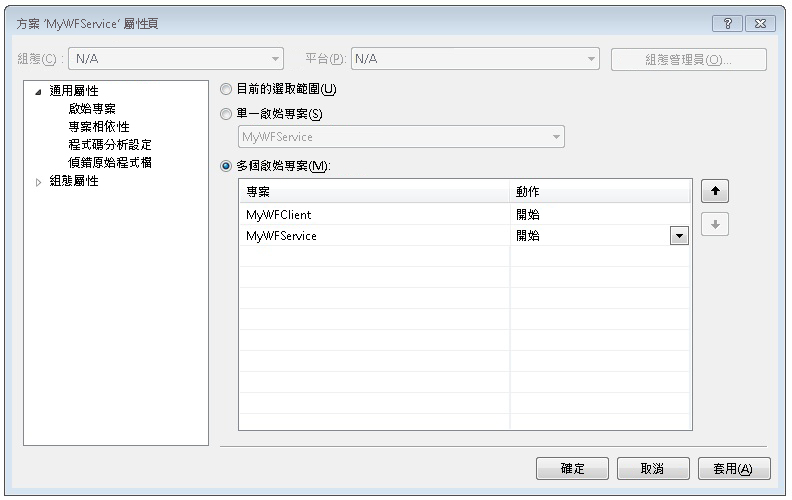

# HOW TO：存取來自工作流程應用程式的服務
本主題描述如何從工作流程主控台應用程式呼叫工作流程服務。 它必須先完成[如何： 使用訊息活動建立工作流程服務](../../../../docs/framework/wcf/feature-details/how-to-create-a-workflow-service-with-messaging-activities.md)主題。 雖然本主題說明如何從工作流程應用程式呼叫工作流程服務，但相同的方法可用來從工作流程應用程式呼叫任何 Windows Communication Foundation (WCF) 服務。

### 建立工作流程主控台應用程式專案

1.  啟動 [!INCLUDE[vs_current_long](../../../../includes/vs-current-long-md.md)]。

2.  載入您在中建立的 MyWFService 專案[如何： 使用訊息活動建立工作流程服務](../../../../docs/framework/wcf/feature-details/how-to-create-a-workflow-service-with-messaging-activities.md)主題。

3.  以滑鼠右鍵按一下**MyWFService**中的解決方案**方案總管**，然後選取**新增**，**新專案**。 選取 **工作流程**中**已安裝的範本**並**工作流程主控台應用程式**從專案類型清單。 將專案命名為 MyWFClient，並且使用預設位置，如下圖所示。

     

     按一下 [ **[確定]** 按鈕以關閉**新增新的專案] 對話方塊**。

4.  建立專案之後，Workflow1.xaml 檔會在設計工具中開啟。 按一下 [**工具箱**索引標籤，以開啟工具箱] 中，如果不是已開啟，然後按一下圖釘，讓工具箱視窗保持開啟。

5.  按下**Ctrl**+**F5**以建置並啟動服務。 ASP.NET 程式開發伺服器會如往常一般隨即啟動，而且 Internet Explorer 會顯示 WCF 說明網頁。 請記下這個網頁的 URI，因為您必須在下一個步驟中使用。

     

6.  以滑鼠右鍵按一下**MyWFClient**專案中**方案總管**，然後選取**新增** > **服務參考**。 按一下 **探索**按鈕，以搜尋目前方案中的任何服務。 按一下 [服務] 清單中 Service1.xamlx 旁邊的三角形。 按一下 Service1 旁邊的三角形，即可列出 Service1 服務實作的合約。 依序展開**Service1**中的節點**服務**清單。 Echo 作業會顯示在**作業**列出如下圖所示。

     

     保留預設的命名空間，然後按一下 **[確定]** 以關閉**加入服務參考**對話方塊。 此時會顯示下列對話方塊。

     

     按一下 **確定**關閉對話方塊。 接著，請按下 CTRL+SHIFT+B 建置方案。 請注意，在工具箱 中已加入新的區段稱為**MyWFClient.ServiceReference1.Activities**。 展開此區段並注意已加入的 Echo 活動，如下圖所示。

     

7.  將拖放<!--zz <xref:System.ServiceModel.Activities.Sequence>-->`System.ServiceModel.Activities.Sequence`拖曳至設計工具介面上的活動。 其低於**控制流程**工具箱的區段。

8.  具有<!--zz <xref:System.ServiceModel.Activities.Sequence>-->`System.ServiceModel.Activities.Sequence`活動中取得焦點時，按一下**變數**連結並新增名為的字串變數`inString`。 提供變數的預設值`"Hello, world"`以及字串變數，名為`outString`如下圖所示。

     

9. 將拖放**Echo**活動<!--zz <xref:System.ServiceModel.Activities.Sequence>--> `System.ServiceModel.Activities.Sequence`。 在 [屬性] 視窗中將繫結`inMsg`引數`inString`變數並`outMsg`引數`outString`變數，如下圖所示。 這樣做會將 `inString` 變數的值傳遞至作業中，然後取得傳回值並放入 `outString` 變數。

     

10. 將拖放**WriteLine**下方的活動**Echo**活動，以顯示服務呼叫所傳回的字串。 **WriteLine**活動會位於**基本型別**工具箱 中的節點。 繫結**文字**引數**WriteLine**活動`outString`變數輸入`outString`文字方塊中上, **WriteLine**活動。 現在，工作流程的外觀應該如下圖所示。

     

11. 以滑鼠右鍵按一下 MyWFService 方案，然後選取**設定啟始專案...**.選取 **多個啟始專案**選項按鈕，然後選取**開始**中每個專案**動作**如下圖所示的資料行。

     

12. 按下 Ctrl+F5，同時啟動服務與用戶端。 ASP.NET 程式開發伺服器裝載的服務、 Internet Explorer 會顯示 WCF 說明頁面中，和用戶端工作流程應用程式會在主控台視窗中啟動並顯示從服務 （"Hello，world"） 傳回的字串。

## 另請參閱

- [工作流程服務](../../../../docs/framework/wcf/feature-details/workflow-services.md)
- [如何：使用傳訊活動建立工作流程服務](../../../../docs/framework/wcf/feature-details/how-to-create-a-workflow-service-with-messaging-activities.md)
- [使用 WCF 服務，從工作流程中的 Web 專案](https://go.microsoft.com/fwlink/?LinkId=207725)