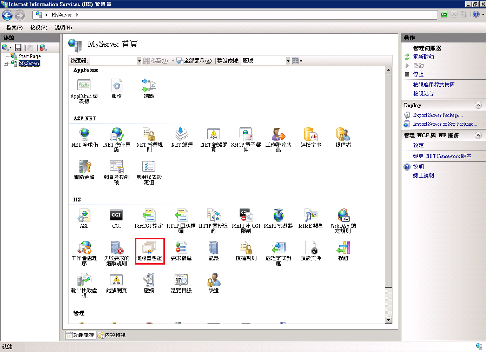
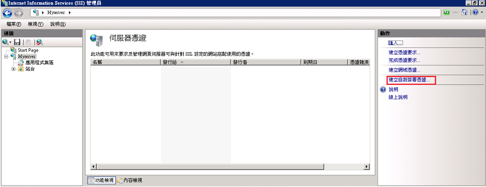
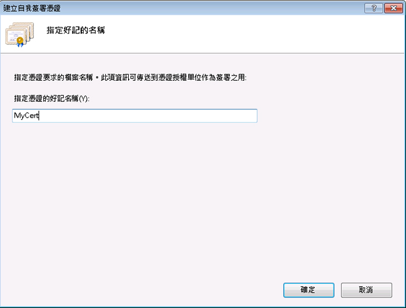
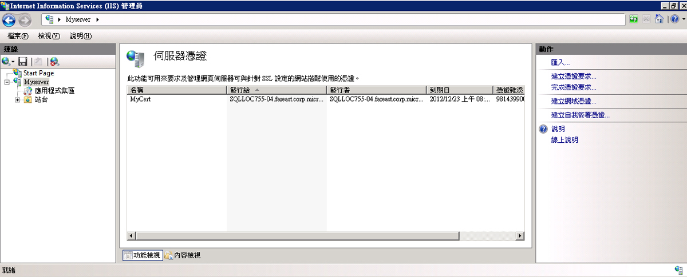
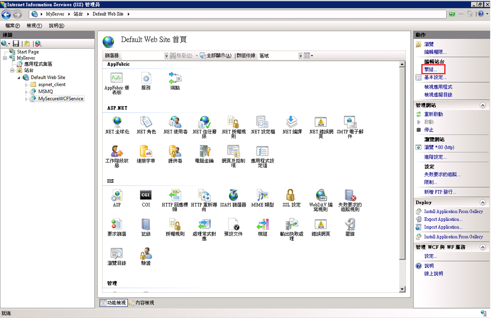
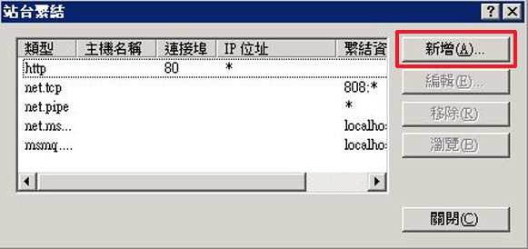
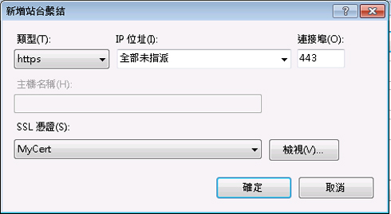
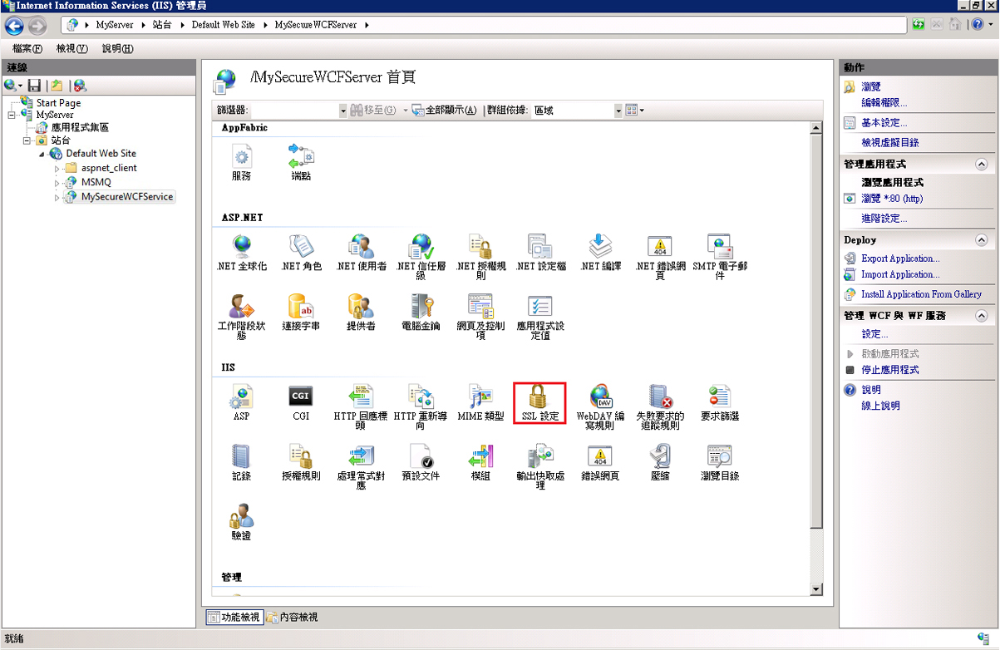
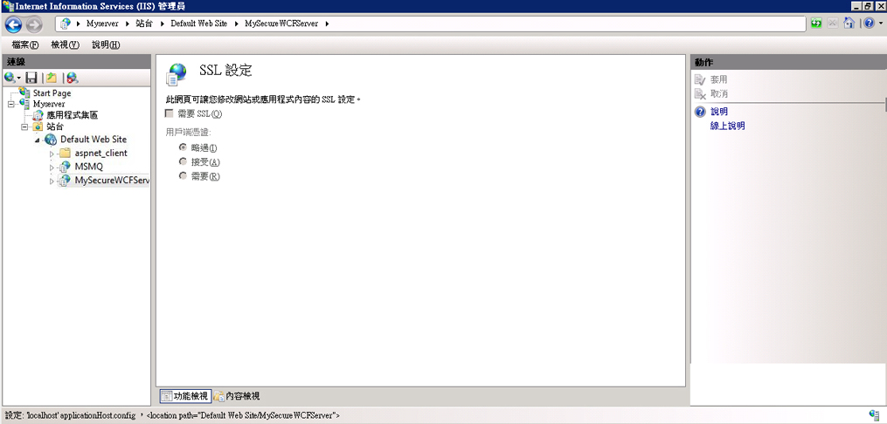

# <a name="how-to-configure-an-iis-hosted-wcf-service-with-ssl"></a><span data-ttu-id="84bc4-102">HOW TO：以 SSL 設定 IIS 裝載的 WCF 服務</span><span class="sxs-lookup"><span data-stu-id="84bc4-102">How to: Configure an IIS-hosted WCF service with SSL</span></span>
<span data-ttu-id="84bc4-103">本主題說明如何設定 IIS 裝載的 WCF 服務以使用 HTTP 傳輸安全性。</span><span class="sxs-lookup"><span data-stu-id="84bc4-103">This topic describes how to set up an IIS-hosted WCF service to use HTTP transport security.</span></span> <span data-ttu-id="84bc4-104">HTTP 傳輸安全性必須使用 SSL 憑證才能註冊到 IIS。</span><span class="sxs-lookup"><span data-stu-id="84bc4-104">HTTP transport security requires an SSL certificate to be registered with IIS.</span></span> <span data-ttu-id="84bc4-105">如果您沒有 SSL 憑證，則可以使用 IIS 來產生測試憑證。</span><span class="sxs-lookup"><span data-stu-id="84bc4-105">If you do not have an SSL certificate you can use IIS to generate a test certificate.</span></span> <span data-ttu-id="84bc4-106">接下來，您必須將 SSL 繫結加入至網站，並設定網站的驗證屬性。</span><span class="sxs-lookup"><span data-stu-id="84bc4-106">Next you must add an SSL binding to the web site and configure the web site’s authentication properties.</span></span> <span data-ttu-id="84bc4-107">最後，您需要將 WCF 服務設定為使用 HTTPS。</span><span class="sxs-lookup"><span data-stu-id="84bc4-107">Finally you need to configure the WCF service to use HTTPS.</span></span>  
  
### <a name="creating-a-self-signed-certificate"></a><span data-ttu-id="84bc4-108">建立自我簽署憑證</span><span class="sxs-lookup"><span data-stu-id="84bc4-108">Creating a Self-Signed Certificate</span></span>  
  
1.  <span data-ttu-id="84bc4-109">開啟網際網路資訊服務管理員 (inetmgr.exe)，並在左側樹狀檢視中選取您的電腦名稱。</span><span class="sxs-lookup"><span data-stu-id="84bc4-109">Open Internet Information Services Manager (inetmgr.exe), and select your computer name in the left-hand tree view.</span></span> <span data-ttu-id="84bc4-110">在螢幕右側選取 [伺服器憑證]</span><span class="sxs-lookup"><span data-stu-id="84bc4-110">On the right-hand side of the screen select Server Certificates</span></span>  
  
     <span data-ttu-id="84bc4-111"></span><span class="sxs-lookup"><span data-stu-id="84bc4-111"></span></span>  
  
2.  <span data-ttu-id="84bc4-112">在 [伺服器憑證] 視窗中按一下**建立自我簽署憑證...**</span><span class="sxs-lookup"><span data-stu-id="84bc4-112">In the Server Certificates window click the **Create Self-Signed Certificate….**</span></span> <span data-ttu-id="84bc4-113">連結。</span><span class="sxs-lookup"><span data-stu-id="84bc4-113">Link.</span></span>  
  
     <span data-ttu-id="84bc4-114"></span><span class="sxs-lookup"><span data-stu-id="84bc4-114"></span></span>  
  
3.  <span data-ttu-id="84bc4-115">輸入的自我簽署憑證的易記名稱，然後按一下**確定**。</span><span class="sxs-lookup"><span data-stu-id="84bc4-115">Enter a friendly name for the self-signed certificate and click **OK**.</span></span>  
  
     <span data-ttu-id="84bc4-116"></span><span class="sxs-lookup"><span data-stu-id="84bc4-116"></span></span>  
  
     <span data-ttu-id="84bc4-117">現在會顯示新建立的自我簽署的憑證的詳細資訊**伺服器憑證**視窗。</span><span class="sxs-lookup"><span data-stu-id="84bc4-117">The newly created self-signed certificate details are now shown in the **Server Certificates** window.</span></span>  
  
     <span data-ttu-id="84bc4-118"></span><span class="sxs-lookup"><span data-stu-id="84bc4-118"></span></span>  
  
     <span data-ttu-id="84bc4-119">產生的憑證會安裝在 [受信任的根憑證授權單位] 存放區中。</span><span class="sxs-lookup"><span data-stu-id="84bc4-119">The generated certificate is installed in the Trusted Root Certification Authorities store.</span></span>  
  
### <a name="add-ssl-binding"></a><span data-ttu-id="84bc4-120">加入 SSL 繫結</span><span class="sxs-lookup"><span data-stu-id="84bc4-120">Add SSL Binding</span></span>  
  
1.  <span data-ttu-id="84bc4-121">仍在 Internet Information Services 管理員 中展開**站台**資料夾，然後**Default Web Site**螢幕左側樹狀檢視中的資料夾。</span><span class="sxs-lookup"><span data-stu-id="84bc4-121">Still in Internet Information Services Manager, expand the **Sites** folder and then the **Default Web Site** folder in the tree view on the left-hand side of the screen.</span></span>  
  
2.  <span data-ttu-id="84bc4-122">按一下 **繫結...**</span><span class="sxs-lookup"><span data-stu-id="84bc4-122">Click the **Bindings….**</span></span> <span data-ttu-id="84bc4-123">連結**動作**視窗的右上部分的一節。</span><span class="sxs-lookup"><span data-stu-id="84bc4-123">Link in the **Actions** section in the upper right hand portion of the window.</span></span>  
  
     <span data-ttu-id="84bc4-124"></span><span class="sxs-lookup"><span data-stu-id="84bc4-124"></span></span>  
  
3.  <span data-ttu-id="84bc4-125">在 網站繫結 視窗中按一下**新增** 按鈕。</span><span class="sxs-lookup"><span data-stu-id="84bc4-125">In the Site Bindings window click the **Add** button.</span></span>  
  
     <span data-ttu-id="84bc4-126"></span><span class="sxs-lookup"><span data-stu-id="84bc4-126"></span></span>  
  
4.  <span data-ttu-id="84bc4-127">在 [**新增網站繫結**] 對話方塊中，選取 https 的型別和剛才的自我簽署憑證的易記名稱建立。</span><span class="sxs-lookup"><span data-stu-id="84bc4-127">In the **Add Site Binding** dialog, select https for the type and the friendly name of the self-signed certificate you just created.</span></span>  
  
     <span data-ttu-id="84bc4-128"></span><span class="sxs-lookup"><span data-stu-id="84bc4-128"></span></span>  
  
### <a name="configure-virtual-directory-for-ssl"></a><span data-ttu-id="84bc4-129">設定 SSL 的虛擬目錄</span><span class="sxs-lookup"><span data-stu-id="84bc4-129">Configure Virtual Directory for SSL</span></span>  
  
1.  <span data-ttu-id="84bc4-130">仍舊在網際網路資訊服務管理員中，選取包含您的 WCF 安全服務的虛擬目錄。</span><span class="sxs-lookup"><span data-stu-id="84bc4-130">Still in Internet Information Services Manager, select the virtual directory that contains your WCF secure service.</span></span>  
  
2.  <span data-ttu-id="84bc4-131">在視窗的中央窗格中，選取**SSL 設定**的 IIS 區段中。</span><span class="sxs-lookup"><span data-stu-id="84bc4-131">In the center pane of the window, select **SSL Settings** in the IIS section.</span></span>  
  
     <span data-ttu-id="84bc4-132"></span><span class="sxs-lookup"><span data-stu-id="84bc4-132"></span></span>  
  
3.  <span data-ttu-id="84bc4-133">在 SSL 設定 窗格中，選取**需要 SSL**核取方塊，按一下 **套用**連結**動作**區段在右手邊的畫面。</span><span class="sxs-lookup"><span data-stu-id="84bc4-133">In the SSL Settings pane, select the **Require SSL** checkbox and click the **Apply** link in the **Actions** section on the right hand side of the screen.</span></span>  
  
     <span data-ttu-id="84bc4-134"></span><span class="sxs-lookup"><span data-stu-id="84bc4-134"></span></span>  
  
### <a name="configure-wcf-service-for-http-transport-security"></a><span data-ttu-id="84bc4-135">設定 HTTP 傳輸安全性的 WCF 服務</span><span class="sxs-lookup"><span data-stu-id="84bc4-135">Configure WCF Service for HTTP Transport Security</span></span>  
  
1.  <span data-ttu-id="84bc4-136">在 WCF 服務的 web.config 中，將 HTTP 繫結設定為使用傳輸安全性，如下列 XML 所示。</span><span class="sxs-lookup"><span data-stu-id="84bc4-136">In the WCF service’s web.config configure the HTTP binding to use transport security as shown in the following XML.</span></span>  
  
    ```xml  
    <bindings>  
          <basicHttpBinding>  
            <binding name="secureHttpBinding">  
              <security mode="Transport">  
                <transport clientCredentialType="None"/>  
              </security>  
            </binding>  
          </basicHttpBinding>  
    </bindings>  
    ```  
  
2.  <span data-ttu-id="84bc4-137">指定您的服務和服務端點，如下列 XML 所示。</span><span class="sxs-lookup"><span data-stu-id="84bc4-137">Specify your service and service endpoint as shown in the following XML.</span></span>  
  
    ```xml  
    <services>  
          <service name="MySecureWCFService.Service1">  
            <endpoint address=""  
                      binding="basicHttpBinding"  
                      bindingConfiguration="secureHttpBinding"  
                      contract="MySecureWCFService.IService1"/>  
  
            <endpoint address="mex"  
                      binding="mexHttpsBinding"  
                      contract="IMetadataExchange" />  
          </service>  
    </services>  
    ```  
  
## <a name="example"></a><span data-ttu-id="84bc4-138">範例</span><span class="sxs-lookup"><span data-stu-id="84bc4-138">Example</span></span>  
 <span data-ttu-id="84bc4-139">下列是使用 HTTP 傳輸安全性之 WCF 服務的 web.config 檔的完整範例</span><span class="sxs-lookup"><span data-stu-id="84bc4-139">The following is a complete example of a web.config file for a WCF service using HTTP transport security</span></span>  
  
```xml  
<?xml version="1.0"?>  
<configuration>  
  
  <system.web>  
    <compilation debug="true" targetFramework="4.0" />  
  </system.web>  
  <system.serviceModel>  
    <services>  
      <service name="MySecureWCFService.Service1">  
        <endpoint address=""  
                  binding="basicHttpBinding"  
                  bindingConfiguration="secureHttpBinding"  
                  contract="MySecureWCFService.IService1"/>  
  
        <endpoint address="mex"  
                  binding="mexHttpsBinding"  
                  contract="IMetadataExchange" />  
      </service>  
    </services>  
    <bindings>  
      <basicHttpBinding>  
        <binding name="secureHttpBinding">  
          <security mode="Transport">  
            <transport clientCredentialType="None"/>  
          </security>  
        </binding>  
      </basicHttpBinding>  
    </bindings>  
    <behaviors>  
      <serviceBehaviors>  
        <behavior>  
          <!-- To avoid disclosing metadata information, set the value below to false and remove the metadata endpoint above before deployment -->  
          <serviceMetadata httpsGetEnabled="true"/>  
          <!-- To receive exception details in faults for debugging purposes, set the value below to true.  Set to false before deployment to avoid disclosing exception information -->  
          <serviceDebug includeExceptionDetailInFaults="false"/>  
        </behavior>  
      </serviceBehaviors>  
    </behaviors>  
    <serviceHostingEnvironment multipleSiteBindingsEnabled="true" />  
  </system.serviceModel>  
  <system.webServer>  
    <modules runAllManagedModulesForAllRequests="true"/>  
  </system.webServer>  
  
</configuration>  
```  
  
## <a name="see-also"></a><span data-ttu-id="84bc4-140">另請參閱</span><span class="sxs-lookup"><span data-stu-id="84bc4-140">See also</span></span>

- [<span data-ttu-id="84bc4-141">在網際網路資訊服務中裝載</span><span class="sxs-lookup"><span data-stu-id="84bc4-141">Hosting in Internet Information Services</span></span>](../../../../docs/framework/wcf/feature-details/hosting-in-internet-information-services.md)
- [<span data-ttu-id="84bc4-142">Internet Information Service 裝載指示</span><span class="sxs-lookup"><span data-stu-id="84bc4-142">Internet Information Service Hosting Instructions</span></span>](../../../../docs/framework/wcf/samples/internet-information-service-hosting-instructions.md)
- [<span data-ttu-id="84bc4-143">網際網路資訊服務裝載最佳做法</span><span class="sxs-lookup"><span data-stu-id="84bc4-143">Internet Information Services Hosting Best Practices</span></span>](../../../../docs/framework/wcf/feature-details/internet-information-services-hosting-best-practices.md)
- [<span data-ttu-id="84bc4-144">使用內嵌程式碼的 IIS 裝載</span><span class="sxs-lookup"><span data-stu-id="84bc4-144">IIS Hosting Using Inline Code</span></span>](../../../../docs/framework/wcf/samples/iis-hosting-using-inline-code.md)
