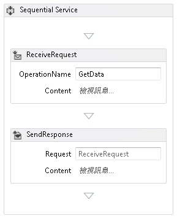
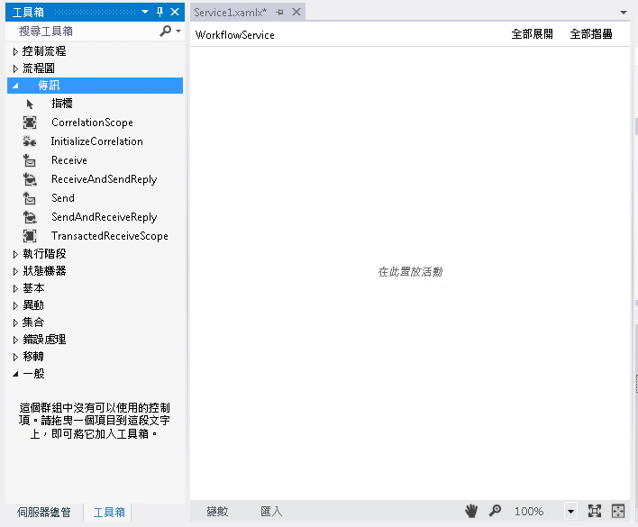
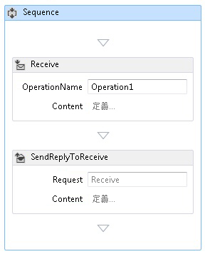
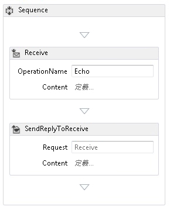
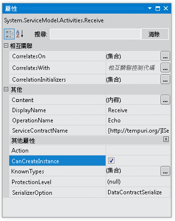
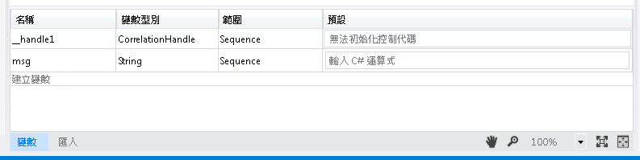
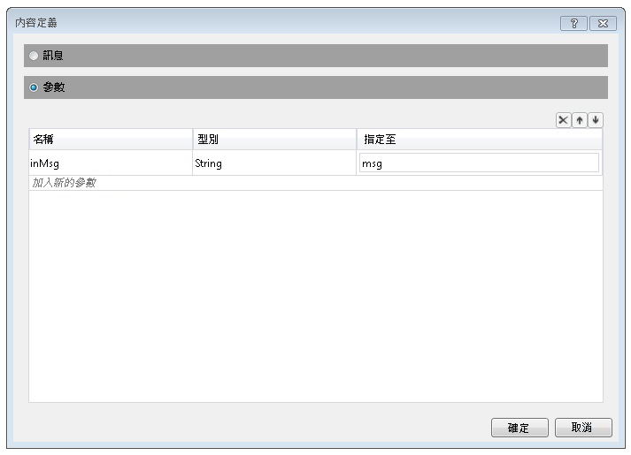
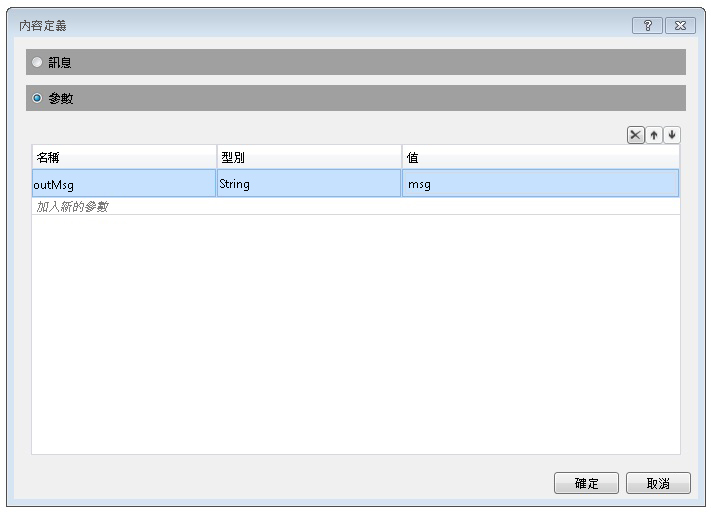
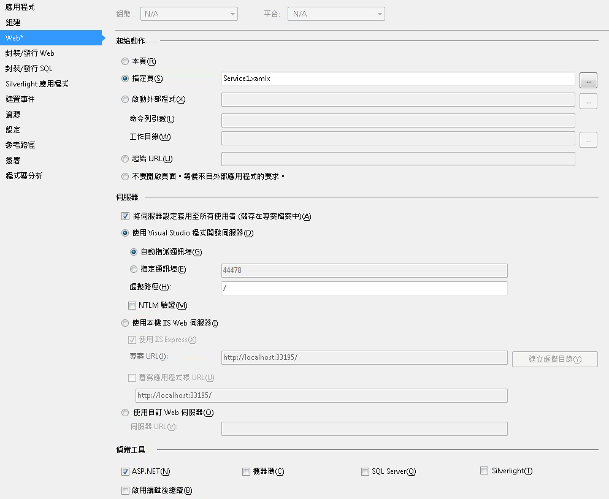

# HOW TO：說明如何使用訊息活動建立工作流程服務。How to: Create a Workflow Service with Messaging Activities
本主題描述如何使用訊息活動建立簡單的工作流程服務。This topic describes how to create a simple workflow service using messaging activities. 本主題的重點在於建立工作流程服務的機制，而該服務主要包含的便是訊息活動。This topic focuses on the mechanics of creating a workflow service where the service consists solely of messaging activities. 在真實世界的服務中，工作流程包含許多其他活動。In a real-world service, the workflow contains many other activities. 服務會實作一項稱為 Echo 的作業，該作業會使用字串並將字串傳回呼叫端。The service implements one operation called Echo, which takes a string and returns the string to the caller. 本主題即為兩個主題的第一個。This topic is the first in a series of two topics. 下一個主題[How To: 服務從工作流程應用程式存取](../../../../docs/framework/wcf/feature-details/how-to-access-a-service-from-a-workflow-application.md)討論如何建立可呼叫服務，本主題中建立工作流程應用程式。The next topic [How To: Access a Service From a Workflow Application](../../../../docs/framework/wcf/feature-details/how-to-access-a-service-from-a-workflow-application.md) discusses how to create a workflow application that can call the service created in this topic.  
  
### 若要建立工作流程服務專案To create a workflow service project  
  
1.  啟動 [!INCLUDE[vs_current_long](../../../../includes/vs-current-long-md.md)]。Start [!INCLUDE[vs_current_long](../../../../includes/vs-current-long-md.md)].  
  
2.  按一下**檔案**功能表上，選取**新增**，然後**專案**顯示**新增專案 對話方塊**。Click the **File** menu, select **New**, and then **Project** to display the **New Project Dialog**. 選取**工作流程**從已安裝的範本清單和**WCF 工作流程服務應用程式**從專案類型清單。Select **Workflow** from the list of installed templates and **WCF Workflow Service Application** from the list of project types. 將專案命名`MyWFService`並使用預設位置，如下圖所示。Name the project `MyWFService` and use the default location as shown in the following illustration.  
  
     按一下**確定**按鈕以關閉**新增專案 對話方塊**。Click the **OK** button to dismiss the **New Project Dialog**.  
  
3.  建立專案後，會在設計工具中開啟 Service1.xamlx 檔案，如下圖所示。When the project is created, the Service1.xamlx file is opened in the designer as shown in the following illustration.  
  
       
  
     以滑鼠右鍵按一下活動標示為**循序服務**選取**刪除**。Right-click the activity labeled **Sequential Service** and select **Delete**.  
  
### 若要實作工作流程服務To implement the workflow service  
  
1.  選取**工具箱** 索引標籤上顯示 工具箱，然後按一下圖釘，讓視窗保持開啟畫面的左半部。Select the **Toolbox** tab on the left side of the screen to display the toolbox and click the pushpin to keep the window open. 展開**傳訊**顯示訊息活動和訊息活動範本，如下圖所示的 [工具箱] 的區段。Expand the **Messaging** section of the toolbox to display the messaging activities and the messaging activity templates as shown in the following illustration.  
  
       
  
2.  將拖放**ReceiveAndSendReply**工作流程設計工具的範本。Drag and drop a **ReceiveAndSendReply** template to the workflow designer. 這會建立<!--zz <xref:System.ServiceModel.Activities.Sequence>-->`System.ServiceModel.Activities.Sequence`活動，具有**接收**活動，後面<xref:System.ServiceModel.Activities.SendReply>活動，如下圖所示。This creates a <!--zz <xref:System.ServiceModel.Activities.Sequence>--> `System.ServiceModel.Activities.Sequence` activity with a **Receive** activity followed by a <xref:System.ServiceModel.Activities.SendReply> activity as shown in the following illustration.  
  
       
  
     注意，<xref:System.ServiceModel.Activities.SendReply> 活動的 <xref:System.ServiceModel.Activities.SendReply.Request%2A> 屬性會設為 `Receive`，也就是 <xref:System.ServiceModel.Activities.Receive> 活動所回覆之 <xref:System.ServiceModel.Activities.SendReply> 活動的名稱。Notice that the <xref:System.ServiceModel.Activities.SendReply> activity’s <xref:System.ServiceModel.Activities.SendReply.Request%2A> property is set to `Receive`, the name of the <xref:System.ServiceModel.Activities.Receive> activity to which the <xref:System.ServiceModel.Activities.SendReply> activity is replying.  
  
3.  在<xref:System.ServiceModel.Activities.Receive>活動型別`Echo`標示為文字方塊**OperationName**。In the <xref:System.ServiceModel.Activities.Receive> activity type `Echo` into the textbox labeled **OperationName**. 這樣做會定義服務所實作之作業的名稱。This defines the name of the operation the service implements.  
  
       
  
4.  與<xref:System.ServiceModel.Activities.Receive>活動選取，開啟 屬性 視窗如果未開啟，即可**檢視**功能表，然後選取**屬性 視窗**。With the <xref:System.ServiceModel.Activities.Receive> activity selected, open the properties window if not already open by clicking the **View** menu and selecting **Properties Window**. 在**屬性 視窗**向下捲動直到您看到**CanCreateInstance**按一下核取方塊，如下圖所示。In the **Properties Window** scroll down until you see **CanCreateInstance** and click the checkbox as shown in the following illustration. 這項設定可讓工作流程服務主機在接收訊息時建立新的服務執行個體 (如果需要的話)。This setting enables the workflow service host to create a new instance of the service (if needed) when a message is received.  
  
       
  
5.  選取<!--zz <xref:System.ServiceModel.Activities.Sequence>-->`System.ServiceModel.Activities.Sequence`活動，然後按一下**變數**在設計工具左下角的按鈕。Select the <!--zz <xref:System.ServiceModel.Activities.Sequence>--> `System.ServiceModel.Activities.Sequence` activity and click the **Variables** button in the lower left corner of the designer. 如此將會顯示變數編輯器。This displays the variables editor. 按一下**建立變數**連結加入變數，以儲存傳送作業的字串。Click the **Create Variable** link to add a variable to store the string sent to the operation. 將變數命名`msg`並設定其**變數**輸入為字串，如下圖所示。Name the variable `msg` and set its **Variable** type to String as shown in the following illustration.  
  
       
  
     按一下**變數**按鈕以關閉變數編輯器。Click the **Variables** button again to close the variables editor.  
  
6.  按一下**定義...**Click the **Define..** 連結中**內容**文字方塊中<xref:System.ServiceModel.Activities.Receive>活動顯示**內容定義**對話方塊。link in the **Content** text box in the <xref:System.ServiceModel.Activities.Receive> activity to display the **Content Definition** dialog. 選取**參數**選項按鈕，按一下**加入新的參數**連結，輸入`inMsg`中**名稱**文字方塊中，選取**字串**中**類型**下拉式清單方塊，然後輸入`msg`中**指派給**文字方塊中，在下圖所示。Select the **Parameters** radio button, click the **Add new Parameter** link, type `inMsg` in the **name** text box, select **String** in the **Type** drop down list box, and type `msg` in the **Assign To** text box as shown in the following illustration.  
  
       
  
     這樣會指定 [接收] 活動接收字串參數，且該資料繫結至 `msg` 變數。This specifies that the Receive activity receives string parameter and that data is bound to the `msg` variable. 按一下**確定**關閉**內容定義**對話方塊。Click **OK** to close the **Content Definition** dialog.  
  
7.  按一下**定義...**中連結**內容**方塊中<xref:System.ServiceModel.Activities.SendReply>活動顯示**內容定義**對話方塊。Click the **Define...** link in the **Content** box in the <xref:System.ServiceModel.Activities.SendReply> activity to display the **Content Definition** dialog. 選取**參數**選項按鈕，按一下**加入新的參數**連結，輸入`outMsg`中**名稱**文字方塊中，選取**字串**中**類型**下拉式清單方塊中，和`msg`中**值**文字方塊中，在下圖所示。Select the **Parameters** radio button, click the **Add new Parameter** link, type `outMsg` in the **name** textbox, select **String** in the **Type** dropdown list box, and `msg` in the **Value** text box as shown in the following illustration.  
  
       
  
     這樣會指定 <xref:System.ServiceModel.Activities.SendReply> 活動傳送訊息或訊息合約型別，且該資料繫結至 `msg` 變數。This specifies that the <xref:System.ServiceModel.Activities.SendReply> activity sends a message or message contract type and that data is bound to the `msg` variable. 由於此為 <xref:System.ServiceModel.Activities.SendReply> 活動，代表 `msg` 中的資料是用來填入由活動傳回用戶端的訊息。Because this is a <xref:System.ServiceModel.Activities.SendReply> activity, this means the data in `msg` is used to populate the message the activity sends back to the client. 按一下**確定**關閉**內容定義**對話方塊。Click **OK** to close the **Content Definition** dialog.  
  
8.  儲存並建置此方案，依序按一下**建置**功能表，然後選取**建置方案**。Save and build the solution by clicking the **Build** menu and selecting **Build Solution**.  
  
## 設定工作流程服務專案。Configure the Workflow Service Project  
 工作流程執行服務已完成。The workflow service is complete. 本節說明如何設定工作流程服務方案，讓裝載和執行更順利。This section explains how to configure the workflow service solution to make it easy to host and run. 此方案是使用 ASP.NET 程式開發伺服器來裝載服務。This solution uses the ASP.NET Development Server to host the service.  
  
#### 若要設定專案啟動選項To set project start up options  
  
1.  在**方案總管 中**，以滑鼠右鍵按一下**MyWFService**選取**屬性**顯示**專案屬性**對話方塊。In the **Solution Explorer**, right-click **MyWFService** and select **Properties** to display the **Project Properties** dialog.  
  
2.  選取**Web**索引標籤並選取**特定頁面**下**起始動作**和型別`Service1.xamlx`在文字方塊中，在下圖所示。Select the **Web** tab and select **Specific Page** under **Start Action** and type `Service1.xamlx` in the text box as shown in the following illustration.  
  
       
  
     這樣做會裝載在 ASP.NET 程式開發伺服器的 Service1.xamlx 中所定義的服務。This hosts the service defined in Service1.xamlx in the ASP.NET Development Server.  
  
3.  按 Ctrl+F5 啟動服務。Press Ctrl + F5 to launch the service. [ASP.NET 程式開發伺服器] 圖示會顯示在桌面的右下角，如下圖所示。The ASP.NET Development Server icon is displayed in the lower right side of the desktop as shown in the following image.  
  
       
  
     此外，Internet Explorer 還會顯示該服務的 WCF 服務說明網頁。In addition, Internet Explorer displays the WCF Service Help Page for the service.  
  
       
  
4.  繼續前往[How To: 服務從工作流程應用程式存取](../../../../docs/framework/wcf/feature-details/how-to-access-a-service-from-a-workflow-application.md)主題以建立工作流程用戶端會呼叫此服務。Continue on to the [How To: Access a Service From a Workflow Application](../../../../docs/framework/wcf/feature-details/how-to-access-a-service-from-a-workflow-application.md) topic to create a workflow client that calls this service.  
  
## 另請參閱See Also  
 [工作流程服務Workflow Services](../../../../docs/framework/wcf/feature-details/workflow-services.md)  
 [裝載工作流程服務概觀Hosting Workflow Services Overview](../../../../docs/framework/wcf/feature-details/hosting-workflow-services-overview.md)  
 [傳訊活動Messaging Activities](../../../../docs/framework/wcf/feature-details/messaging-activities.md)
