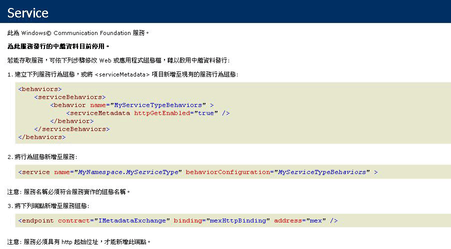

# <a name="how-to-host-a-non-service-workflow-in-iis"></a><span data-ttu-id="8fb7c-102">HOW TO：在 IIS 中裝載非服務工作流程</span><span class="sxs-lookup"><span data-stu-id="8fb7c-102">How to: Host a non-service workflow in IIS</span></span>
<span data-ttu-id="8fb7c-103">您可以在 IIS/WAS 底下裝載非工作流程服務的工作流程。</span><span class="sxs-lookup"><span data-stu-id="8fb7c-103">Workflows that are not workflow services can be hosted under IIS/WAS.</span></span> <span data-ttu-id="8fb7c-104">當您需要裝載其他人所撰寫的工作流程時，這樣做就很有用。</span><span class="sxs-lookup"><span data-stu-id="8fb7c-104">This is useful when you need to host a workflow written by somebody else.</span></span> <span data-ttu-id="8fb7c-105">例如，如果您重新裝載工作流程設計工具並允許使用者建立自己的工作流程。</span><span class="sxs-lookup"><span data-stu-id="8fb7c-105">For example, if you rehost the workflow designer and allow users to create their own workflows.</span></span>  <span data-ttu-id="8fb7c-106">在 IIS 中裝載非服務工作流程可支援許多功能，例如處理序回收、閒置關機、處理序健康狀態監控，以及訊息啟動。</span><span class="sxs-lookup"><span data-stu-id="8fb7c-106">Hosting non-service workflows in IIS provides support for features like process recycling, idle shutdown, process health monitoring, and message-based activation.</span></span> <span data-ttu-id="8fb7c-107">在 IIS 中裝載的工作流程服務包含 <xref:System.ServiceModel.Activities.Receive> 活動，而且這些服務會在 IIS 收到訊息時啟動。</span><span class="sxs-lookup"><span data-stu-id="8fb7c-107">Workflow services hosted in IIS contain <xref:System.ServiceModel.Activities.Receive> activities and are activated when a message is received by IIS.</span></span> <span data-ttu-id="8fb7c-108">非服務工作流程不包含訊息活動，而且預設無法透過傳送訊息來啟動。</span><span class="sxs-lookup"><span data-stu-id="8fb7c-108">Non-service workflows do not contain messaging activities, and by default cannot be activated by sending a message.</span></span>  <span data-ttu-id="8fb7c-109">您必須從 <xref:System.ServiceModel.Activities.WorkflowHostingEndpoint> 衍生類別，並且定義包含作業的服務合約來建立工作流程執行個體。</span><span class="sxs-lookup"><span data-stu-id="8fb7c-109">You must derive a class from <xref:System.ServiceModel.Activities.WorkflowHostingEndpoint> and define a service contract that contains operations to create an instance of the workflow.</span></span> <span data-ttu-id="8fb7c-110">本主題將逐步引導您逐步建立簡單的工作流程、 定義服務合約的用戶端可以使用啟動工作流程，以及衍生自<xref:System.ServiceModel.Activities.WorkflowHostingEndpoint>這用來接聽之工作流程建立要求的服務合約。</span><span class="sxs-lookup"><span data-stu-id="8fb7c-110">This topic will walk you through creating a simple workflow, defining a service contract a client can use to activate the workflow, and deriving a class from <xref:System.ServiceModel.Activities.WorkflowHostingEndpoint> which uses the service contract to listen for workflow creating requests.</span></span>  
  
### <a name="create-a-simple-workflow"></a><span data-ttu-id="8fb7c-111">建立簡單的工作流程</span><span class="sxs-lookup"><span data-stu-id="8fb7c-111">Create a simple workflow</span></span>  
  
1.  <span data-ttu-id="8fb7c-112">建立新的 [!INCLUDE[vs_current_long](../../../../includes/vs-current-long-md.md)] 空方案，稱為 `CreationEndpointTest`。</span><span class="sxs-lookup"><span data-stu-id="8fb7c-112">Create a new [!INCLUDE[vs_current_long](../../../../includes/vs-current-long-md.md)] empty solution called `CreationEndpointTest`.</span></span>  
  
2.  <span data-ttu-id="8fb7c-113">將名為 `SimpleWorkflow` 的新 WCF 工作流程服務應用程式專案加入至此方案。</span><span class="sxs-lookup"><span data-stu-id="8fb7c-113">Add a new WCF Workflow Service Application project called `SimpleWorkflow` to the solution.</span></span> <span data-ttu-id="8fb7c-114">工作流程設計工具隨即開啟。</span><span class="sxs-lookup"><span data-stu-id="8fb7c-114">The workflow designer will open.</span></span>  
  
3.  <span data-ttu-id="8fb7c-115">刪除 ReceiveRequest 和 SendResponse 活動。</span><span class="sxs-lookup"><span data-stu-id="8fb7c-115">Delete the ReceiveRequest and SendResponse activities.</span></span> <span data-ttu-id="8fb7c-116">這些活動就是讓工作流程成為工作流程服務的活動。</span><span class="sxs-lookup"><span data-stu-id="8fb7c-116">These activities are what makes a workflow a workflow service.</span></span> <span data-ttu-id="8fb7c-117">因為我們不要使用工作流程服務，所以不再需要它們。</span><span class="sxs-lookup"><span data-stu-id="8fb7c-117">Since we are not working with a workflow service, we no longer need them.</span></span>  
  
4.  <span data-ttu-id="8fb7c-118">設定為"Sequential Workflow"的序列活動的 DisplayName。</span><span class="sxs-lookup"><span data-stu-id="8fb7c-118">Set the DisplayName for the sequence activity to "Sequential Workflow".</span></span>  
  
5.  <span data-ttu-id="8fb7c-119">將 Service1.xamlx 重新命名為 Workflow1.xamlx。</span><span class="sxs-lookup"><span data-stu-id="8fb7c-119">Rename Service1.xamlx to Workflow1.xamlx.</span></span>  
  
6.  <span data-ttu-id="8fb7c-120">按一下序列活動中，外部的設計工具，並設定為"Workflow1"Name 和 ConfigurationName 屬性</span><span class="sxs-lookup"><span data-stu-id="8fb7c-120">Click the designer outside of the sequence activity, and set the Name and ConfigurationName properties to "Workflow1"</span></span>  
  
7.  <span data-ttu-id="8fb7c-121">將 <xref:System.Activities.Statements.WriteLine> 活動拖曳至 <xref:System.Activities.Statements.Sequence> 中。</span><span class="sxs-lookup"><span data-stu-id="8fb7c-121">Drag a <xref:System.Activities.Statements.WriteLine> activity into the <xref:System.Activities.Statements.Sequence>.</span></span> <span data-ttu-id="8fb7c-122"><xref:System.Activities.Statements.WriteLine>活動位於**基本型別**工具箱的區段。</span><span class="sxs-lookup"><span data-stu-id="8fb7c-122">The <xref:System.Activities.Statements.WriteLine> activity can be found in the **Primitives** section of the toolbox.</span></span> <span data-ttu-id="8fb7c-123">設定<xref:System.Activities.Statements.WriteLine.Text%2A>屬性<xref:System.Activities.Statements.WriteLine>活動"Hello，world"。</span><span class="sxs-lookup"><span data-stu-id="8fb7c-123">Set the <xref:System.Activities.Statements.WriteLine.Text%2A> property of the <xref:System.Activities.Statements.WriteLine> activity to "Hello, world".</span></span>  
  
     <span data-ttu-id="8fb7c-124">現在，工作流程的外觀應該如下圖所示。</span><span class="sxs-lookup"><span data-stu-id="8fb7c-124">The workflow should now look like the following diagram.</span></span>  
  
     <span data-ttu-id="8fb7c-125"></span><span class="sxs-lookup"><span data-stu-id="8fb7c-125"></span></span>  
  
### <a name="create-the-workflow-creation-service-contract"></a><span data-ttu-id="8fb7c-126">建立工作流程建立服務合約</span><span class="sxs-lookup"><span data-stu-id="8fb7c-126">Create the workflow creation service contract</span></span>  
  
1.  <span data-ttu-id="8fb7c-127">將名為 `Shared` 的新類別庫專案加入至 `CreationEndpointTest` 方案。</span><span class="sxs-lookup"><span data-stu-id="8fb7c-127">Add a new class library project called `Shared` to the `CreationEndpointTest` solution.</span></span>  
  
2.  <span data-ttu-id="8fb7c-128">將 System.ServiceModel.dll、System.Configuration 和 System.ServiceModel.Activities 的參考加入至 `Shared` 專案。</span><span class="sxs-lookup"><span data-stu-id="8fb7c-128">Add a reference to System.ServiceModel.dll, System.Configuration, and System.ServiceModel.Activities to the `Shared` project.</span></span>  
  
3.  <span data-ttu-id="8fb7c-129">將 Class1.cs 檔案重新命名為 IWorkflowCreation.cs 並將下列程式碼複製到檔案。</span><span class="sxs-lookup"><span data-stu-id="8fb7c-129">Rename the Class1.cs file to IWorkflowCreation.cs and the following code to the file.</span></span>  
  
    ```  
    using System;  
    using System.Collections.Generic;  
    using System.Linq;  
    using System.Text;  
    using System.ServiceModel;  
  
    namespace Shared  
    {  
        //service contract exposed from the endpoint  
        [ServiceContract(Name = "IWorkflowCreation")]  
        public interface IWorkflowCreation  
        {  
            [OperationContract(Name = "Create")]  
            Guid Create(IDictionary<string, object> inputs);  
  
            [OperationContract(Name = "CreateWithInstanceId", IsOneWay = true)]  
            void CreateWithInstanceId(IDictionary<string, object> inputs, Guid instanceId);  
        }  
    }  
    ```  
  
     <span data-ttu-id="8fb7c-130">這個合約會定義兩項作業，而這兩項作業都會建立您剛才建立之非服務工作流程的新執行個體。</span><span class="sxs-lookup"><span data-stu-id="8fb7c-130">This contract defines two operations both create a new instance of the non-service workflow you just created.</span></span> <span data-ttu-id="8fb7c-131">第一項作業會使用產生的執行個體 ID 來建立新的執行個體，而另一項作業可讓您針對新的工作流程執行個體指定執行個體 ID。</span><span class="sxs-lookup"><span data-stu-id="8fb7c-131">One creates a new instance with a generated instance ID and the other allows you to specify the instance ID for the new workflow instance.</span></span>  <span data-ttu-id="8fb7c-132">這兩種方法都允許您將參數傳入新的工作流程執行個體。</span><span class="sxs-lookup"><span data-stu-id="8fb7c-132">Both methods allow you to pass in parameters to the new workflow instance.</span></span> <span data-ttu-id="8fb7c-133">本合約將由<xref:System.ServiceModel.Activities.WorkflowHostingEndpoint>以允許用戶端建立非服務工作流程的新執行個體。</span><span class="sxs-lookup"><span data-stu-id="8fb7c-133">This contract will be exposed by the <xref:System.ServiceModel.Activities.WorkflowHostingEndpoint> to allow clients to create new instances of a non-service workflow.</span></span>  
  
### <a name="derive-a-class-from-workflowhostingendpoint"></a><span data-ttu-id="8fb7c-134">從 WorkflowHostingEndpoint 衍生類別</span><span class="sxs-lookup"><span data-stu-id="8fb7c-134">Derive a class from WorkflowHostingEndpoint</span></span>  
  
1.  <span data-ttu-id="8fb7c-135">加入新的類別稱為`CreationEndpoint`衍生自<xref:System.ServiceModel.Activities.WorkflowHostingEndpoint>至`Shared`專案。</span><span class="sxs-lookup"><span data-stu-id="8fb7c-135">Add a new class called `CreationEndpoint` derived from <xref:System.ServiceModel.Activities.WorkflowHostingEndpoint> to the `Shared` project.</span></span>  
  
    ```  
    using System;  
    using System.Collections.Generic;  
    using System.Diagnostics;  
    using System.Globalization;  
    using System.ServiceModel;  
    using System.ServiceModel.Activities;  
    using System.ServiceModel.Channels;  
  
    namespace Shared  
    {  
        public class CreationEndpoint : WorkflowHostingEndpoint  
        {  
        }  
    }  
    ```  
  
2.  <span data-ttu-id="8fb7c-136">將名為 <xref:System.Uri> 的區域靜態 `defaultBaseUri` 變數加入至 `CreationEndpoint` 類別。</span><span class="sxs-lookup"><span data-stu-id="8fb7c-136">Add a local static <xref:System.Uri> variable called `defaultBaseUri` to the `CreationEndpoint` class.</span></span>  
  
    ```  
    public class CreationEndpoint : WorkflowHostingEndpoint  
    {  
        static Uri defaultBaseUri;  
    }  
    ```  
  
3.  <span data-ttu-id="8fb7c-137">將下列建構函式加入至 `CreationEndpoint` 類別。</span><span class="sxs-lookup"><span data-stu-id="8fb7c-137">Add the following constructor to the `CreationEndpoint` class.</span></span> <span data-ttu-id="8fb7c-138">請注意，我們會在基底建構函式的呼叫中指定 `IWorkflowCreation` 服務合約。</span><span class="sxs-lookup"><span data-stu-id="8fb7c-138">Notice we specify the `IWorkflowCreation` service contract in the call to the base constructor.</span></span>  
  
    ```  
    public CreationEndpoint(Binding binding, EndpointAddress address)  
       : base(typeof(IWorkflowCreation), binding, address)  
       {  
       }  
    ```  
  
4.  <span data-ttu-id="8fb7c-139">將下列預設建構函式加入至 `CreationEndpoint` 類別。</span><span class="sxs-lookup"><span data-stu-id="8fb7c-139">Add the following default constructor to the `CreationEndpoint` class.</span></span>  
  
    ```  
    public CreationEndpoint()  
       : this(GetDefaultBinding(),  
       new EndpointAddress(new Uri(DefaultBaseUri, new Uri(Guid.NewGuid().ToString(), UriKind.Relative))))  
       {  
       }  
    ```  
  
5.  <span data-ttu-id="8fb7c-140">將靜態 `DefaultBaseUri` 屬性加入至 `CreationEndpoint` 類別。</span><span class="sxs-lookup"><span data-stu-id="8fb7c-140">Add a static `DefaultBaseUri` property to the `CreationEndpoint` class.</span></span> <span data-ttu-id="8fb7c-141">這個屬性將用來保存預設基底 URI (如果沒有提供的話)。</span><span class="sxs-lookup"><span data-stu-id="8fb7c-141">This property will be used to hold a default base URI if one is not provided.</span></span>  
  
    ```  
    static Uri DefaultBaseUri  
    {  
       get  
       {  
          if (defaultBaseUri == null)  
          {  
             defaultBaseUri = new Uri(string.Format(CultureInfo.InvariantCulture, "net.pipe://localhost/workflowCreationEndpoint/{0}/{1}",  
                Process.GetCurrentProcess().Id,  
                AppDomain.CurrentDomain.Id));  
          }  
          return defaultBaseUri;  
       }  
     }  
    ```  
  
6.  <span data-ttu-id="8fb7c-142">建立下列方法，以便取得要用於建立端點的預設繫結。</span><span class="sxs-lookup"><span data-stu-id="8fb7c-142">Create the following method to get the default binding to use for the creation endpoint.</span></span>  
  
    ```  
    //defaults to NetNamedPipeBinding  
    public static Binding GetDefaultBinding()  
    {  
       return new NetNamedPipeBinding(NetNamedPipeSecurityMode.None) { TransactionFlow = true };  
    }  
    ```  
  
7.  <span data-ttu-id="8fb7c-143">覆寫 <xref:System.ServiceModel.Activities.WorkflowHostingEndpoint.OnGetInstanceId%2A> 方法，以便傳回工作流程執行個體 ID。</span><span class="sxs-lookup"><span data-stu-id="8fb7c-143">Override the <xref:System.ServiceModel.Activities.WorkflowHostingEndpoint.OnGetInstanceId%2A> method to return the workflow instance ID.</span></span> <span data-ttu-id="8fb7c-144">如果`Action`標頭以 「 建立 」 會傳回空的 GUID，如果`Action`標頭以"CreateWithInstanceId"傳回傳遞至方法的 GUID。</span><span class="sxs-lookup"><span data-stu-id="8fb7c-144">If the `Action` header ends with "Create" return an empty GUID, if the `Action` header ends with "CreateWithInstanceId" return the GUID passed into the method.</span></span> <span data-ttu-id="8fb7c-145">否則，就會擲回 <xref:System.InvalidOperationException>。</span><span class="sxs-lookup"><span data-stu-id="8fb7c-145">Otherwise, throw an <xref:System.InvalidOperationException>.</span></span> <span data-ttu-id="8fb7c-146">這些 `Action` 標頭會對應至 `IWorkflowCreation` 服務合約中定義的兩項作業。</span><span class="sxs-lookup"><span data-stu-id="8fb7c-146">These `Action` headers correspond to the two operations defined in the `IWorkflowCreation` service contract.</span></span>  
  
    ```  
    protected override Guid OnGetInstanceId(object[] inputs, OperationContext operationContext)  
    {  
       //Create was called by client  
       if (operationContext.IncomingMessageHeaders.Action.EndsWith("Create"))  
       {  
          return Guid.Empty;  
       }  
       //CreateWithInstanceId was called by client  
       else if (operationContext.IncomingMessageHeaders.Action.EndsWith("CreateWithInstanceId"))  
       {  
          return (Guid)inputs[1];  
       }  
       else  
       {  
          throw new InvalidOperationException("Invalid Action: " + operationContext.IncomingMessageHeaders.Action);  
       }  
    }  
    ```  
  
8.  <span data-ttu-id="8fb7c-147">覆寫 <xref:System.ServiceModel.Activities.WorkflowHostingEndpoint.OnGetCreationContext%2A> 方法，以便建立 <xref:System.ServiceModel.Activities.WorkflowCreationContext> 並加入工作流程的任何引數、將執行個體 ID 傳送至用戶端，然後傳回 <xref:System.ServiceModel.Activities.WorkflowCreationContext>。</span><span class="sxs-lookup"><span data-stu-id="8fb7c-147">Override the <xref:System.ServiceModel.Activities.WorkflowHostingEndpoint.OnGetCreationContext%2A> method to create a <xref:System.ServiceModel.Activities.WorkflowCreationContext> and add any arguments for the workflow, send the instance ID to the client, and then return the <xref:System.ServiceModel.Activities.WorkflowCreationContext>.</span></span>  
  
    ```  
    protected override WorkflowCreationContext OnGetCreationContext(object[] inputs, OperationContext operationContext, Guid instanceId, WorkflowHostingResponseContext responseContext)  
    {  
       WorkflowCreationContext creationContext = new WorkflowCreationContext();  
       if (operationContext.IncomingMessageHeaders.Action.EndsWith("Create") || (operationContext.IncomingMessageHeaders.Action.EndsWith("CreateWithInstanceId")))  
       {  
          Dictionary<string, object> arguments = (Dictionary<string, object>)inputs[0];  
          if (arguments != null && arguments.Count > 0)  
          {  
             foreach (KeyValuePair<string, object> pair in arguments)  
             {  
                //arguments to pass to the workflow  
                creationContext.WorkflowArguments.Add(pair.Key, pair.Value);  
             }  
          }  
          //reply to client with instanceId  
          responseContext.SendResponse(instanceId, null);  
       }  
       else  
       {  
          throw new InvalidOperationException("Invalid Action: " + operationContext.IncomingMessageHeaders.Action);  
       }  
       return creationContext;  
    }  
    ```  
  
### <a name="create-a-standard-endpoint-element-to-allow-you-to-configure-the-workflowcreationendpoint"></a><span data-ttu-id="8fb7c-148">建立標準端點項目，讓您設定 WorkflowCreationEndpoint</span><span class="sxs-lookup"><span data-stu-id="8fb7c-148">Create a standard endpoint element to allow you to configure the WorkflowCreationEndpoint</span></span>  
  
1.  <span data-ttu-id="8fb7c-149">在 `CreationEndpoint` 專案中加入 Shared 的參考。</span><span class="sxs-lookup"><span data-stu-id="8fb7c-149">Add a reference to Shared in the `CreationEndpoint` project</span></span>  
  
2.  <span data-ttu-id="8fb7c-150">將衍生自 `CreationEndpointElement` 且名為 <xref:System.ServiceModel.Configuration.StandardEndpointElement> 的新類別加入至 `CreationEndpoint` 專案。</span><span class="sxs-lookup"><span data-stu-id="8fb7c-150">Add a new class called `CreationEndpointElement`, derived from <xref:System.ServiceModel.Configuration.StandardEndpointElement> to the `CreationEndpoint` project.</span></span> <span data-ttu-id="8fb7c-151">這個類別將代表 web.config 檔案中的 `CreationEndpoint`。</span><span class="sxs-lookup"><span data-stu-id="8fb7c-151">This class will represent a `CreationEndpoint` in a web.config file.</span></span>  
  
    ```  
    using System;  
    using System.Configuration;  
    using System.ServiceModel.Activities;  
    using System.ServiceModel.Configuration;  
    using System.ServiceModel.Description;  
    using Shared;  
  
    namespace CreationEndpointTest  
    {  
        //config element for CreationEndpoint  
        public class CreationEndpointElement : StandardEndpointElement  
        {  
       }  
    ```  
  
3.  <span data-ttu-id="8fb7c-152">加入名為 `EndpointType` 的屬性，以便傳回端點的型別。</span><span class="sxs-lookup"><span data-stu-id="8fb7c-152">Add a property called `EndpointType` to return the type of the endpoint.</span></span>  
  
    ```  
    protected override Type EndpointType  
    {  
       get { return typeof(CreationEndpoint); }  
    }  
    ```  
  
4.  <span data-ttu-id="8fb7c-153">覆寫 <xref:System.ServiceModel.Configuration.StandardEndpointElement.CreateServiceEndpoint%2A> 方法，並傳回新的 `CreationEndpoint`。</span><span class="sxs-lookup"><span data-stu-id="8fb7c-153">Override the <xref:System.ServiceModel.Configuration.StandardEndpointElement.CreateServiceEndpoint%2A> method and return a new `CreationEndpoint`.</span></span>  
  
    ```  
    protected override ServiceEndpoint CreateServiceEndpoint(ContractDescription contractDescription)  
    {  
       return new CreationEndpoint();  
    }  
    ```  
  
5.  <span data-ttu-id="8fb7c-154">多載 <xref:System.ServiceModel.Configuration.StandardEndpointElement.OnApplyConfiguration%2A>、<xref:System.ServiceModel.Configuration.StandardEndpointElement.OnApplyConfiguration%2A>、<xref:System.ServiceModel.Configuration.StandardEndpointElement.OnInitializeAndValidate%2A> 和 <xref:System.ServiceModel.Configuration.StandardEndpointElement.OnInitializeAndValidate%2A> 方法。</span><span class="sxs-lookup"><span data-stu-id="8fb7c-154">Overload the <xref:System.ServiceModel.Configuration.StandardEndpointElement.OnApplyConfiguration%2A>, <xref:System.ServiceModel.Configuration.StandardEndpointElement.OnApplyConfiguration%2A>, <xref:System.ServiceModel.Configuration.StandardEndpointElement.OnInitializeAndValidate%2A>, and <xref:System.ServiceModel.Configuration.StandardEndpointElement.OnInitializeAndValidate%2A> methods.</span></span> <span data-ttu-id="8fb7c-155">您只需要定義這些方法，不需要加入任何程式碼。</span><span class="sxs-lookup"><span data-stu-id="8fb7c-155">These methods just need to be defined, you do not need to add any code to them.</span></span>  
  
    ```  
    protected override void OnApplyConfiguration(ServiceEndpoint endpoint, ChannelEndpointElement channelEndpointElement)  
    {  
    }  
  
    protected override void OnApplyConfiguration(ServiceEndpoint endpoint, ServiceEndpointElement serviceEndpointElement)  
    {  
    }  
  
    protected override void OnInitializeAndValidate(ChannelEndpointElement channelEndpointElement)  
    {  
    }  
  
    protected override void OnInitializeAndValidate(ServiceEndpointElement serviceEndpointElement)  
    {  
    }  
    ```  
  
6.  <span data-ttu-id="8fb7c-156">將 `CreationEndpoint` 的集合類別加入至 `CreationEndpoint` 專案中的 CreationEndpointElement.cs 檔案。</span><span class="sxs-lookup"><span data-stu-id="8fb7c-156">Add the collection class for `CreationEndpoint` to the CreationEndpointElement.cs file in the `CreationEndpoint` project.</span></span> <span data-ttu-id="8fb7c-157">組態會使用這個類別，在 web.config 檔案中保存許多 `CreationEndpoint` 執行個體。</span><span class="sxs-lookup"><span data-stu-id="8fb7c-157">This class is used by configuration to hold a number of `CreationEndpoint` instances in a web.config file.</span></span>  
  
    ```  
    public class CreationEndpointCollection : StandardEndpointCollectionElement<CreationEndpoint, CreationEndpointElement>  
    {  
    }  
    ```  
  
7.  <span data-ttu-id="8fb7c-158">建置方案。</span><span class="sxs-lookup"><span data-stu-id="8fb7c-158">Build the solution.</span></span>  
  
### <a name="host-the-workflow-in-iis"></a><span data-ttu-id="8fb7c-159">在 IIS 中裝載工作流程</span><span class="sxs-lookup"><span data-stu-id="8fb7c-159">Host the workflow in IIS</span></span>  
  
1.  <span data-ttu-id="8fb7c-160">在 IIS 中建立名為 `MyCreationEndpoint` 的新應用程式。</span><span class="sxs-lookup"><span data-stu-id="8fb7c-160">Create a new application called `MyCreationEndpoint` in IIS.</span></span>  
  
2.  <span data-ttu-id="8fb7c-161">將工作流程設計工具所產生的 workflow1.xaml 檔案複製到應用程式目錄並將它重新命名為 workflow1.xamlx。</span><span class="sxs-lookup"><span data-stu-id="8fb7c-161">Copy the workflow1.xaml file generated by the workflow designer to the application directory and rename it to workflow1.xamlx.</span></span>  
  
3.  <span data-ttu-id="8fb7c-162">將 shared.dll 和 CreationEndpoint.dll 檔案複製到應用程式的 bin 目錄 (如果此目錄不存在，請建立 bin 目錄)。</span><span class="sxs-lookup"><span data-stu-id="8fb7c-162">Copy the shared.dll and CreationEndpoint.dll files to the application’s bin directory (create the bin directory if it is not present).</span></span>  
  
4.  <span data-ttu-id="8fb7c-163">將 `CreationEndpoint` 專案中 Web.config 檔案的內容取代成下列程式碼。</span><span class="sxs-lookup"><span data-stu-id="8fb7c-163">Replace the contents of the Web.config file in the `CreationEndpoint` project with the following code.</span></span>  
  
    ```xaml  
    <?xml version="1.0" encoding="utf-8" ?>  
    <configuration>  
      <system.web>  
        <compilation debug="true" targetFramework="4.0" />  
      </system.web>   
    </configuration>  
    ```  
  
5.  <span data-ttu-id="8fb7c-164">在 `<system.web>` 項目後面加入下列組態程式碼，藉以註冊 `CreationEndpoint`。</span><span class="sxs-lookup"><span data-stu-id="8fb7c-164">After the `<system.web>` element, register `CreationEndpoint` by adding the following configuration code.</span></span>  
  
    ```xml  
    <system.serviceModel>  
        <!--register CreationEndpoint-->  
        <serviceHostingEnvironment multipleSiteBindingsEnabled="true" />  
        <extensions>  
          <endpointExtensions>  
            <add name="creationEndpoint" type="CreationEndpointTest.CreationEndpointCollection, CreationEndpoint, Version=1.0.0.0, Culture=neutral, PublicKeyToken=null" />  
          </endpointExtensions>  
        </extensions>  
    </system.serviceModel>  
    ```  
  
     <span data-ttu-id="8fb7c-165">這樣就會註冊 `CreationEndpointCollection` 類別，因此您可以在 web.config 檔案中設定 `CreationEndpoint`。</span><span class="sxs-lookup"><span data-stu-id="8fb7c-165">This registers the `CreationEndpointCollection` class so you can configure a `CreationEndpoint` in a web.config file.</span></span>  
  
6.  <span data-ttu-id="8fb7c-166">新增`<service>`元素 (之後\</extensions > 標記) 與`CreationEndpoint`用接聽傳入訊息。</span><span class="sxs-lookup"><span data-stu-id="8fb7c-166">Add a `<service>` element (after the \</extensions> tag) with a `CreationEndpoint` which will listen for incoming messages.</span></span>  
  
    ```xml  
    <services>  
          <!-- add endpoint to service-->  
          <service name="Workflow1" behaviorConfiguration="basicConfig" >  
            <endpoint kind="creationEndpoint" binding="basicHttpBinding" address=""/>  
          </service>  
        </services>  
    ```  
  
7.  <span data-ttu-id="8fb7c-167">新增\<行為 > 項目 (之後 \< /> 標記) 來啟用服務中繼資料。</span><span class="sxs-lookup"><span data-stu-id="8fb7c-167">Add a \<behaviors> element (after the \</services> tag) to enable service metadata.</span></span>  
  
    ```xml  
    <behaviors>  
          <serviceBehaviors>  
            <behavior name="basicConfig">  
              <serviceMetadata httpGetEnabled="true" />  
            </behavior>  
          </serviceBehaviors>  
        </behaviors>  
    ```  
  
8.  <span data-ttu-id="8fb7c-168">將 web.config 複製到您的 IIS 應用程式目錄。</span><span class="sxs-lookup"><span data-stu-id="8fb7c-168">Copy the web.config to your IIS application directory.</span></span>  
  
9. <span data-ttu-id="8fb7c-169">測試以查看建立端點，是否要處理的啟動 Internet Explorer 並瀏覽至 http://localhost/MyCreationEndpoint/Workflow1.xamlx 。</span><span class="sxs-lookup"><span data-stu-id="8fb7c-169">Test to see if the creation endpoint is working by starting Internet Explorer and browsing to http://localhost/MyCreationEndpoint/Workflow1.xamlx.</span></span> <span data-ttu-id="8fb7c-170">Internet Explorer 應該會顯示下列畫面：</span><span class="sxs-lookup"><span data-stu-id="8fb7c-170">Internet Explorer should display the following screen:</span></span>  
  
     <span data-ttu-id="8fb7c-171"></span><span class="sxs-lookup"><span data-stu-id="8fb7c-171"></span></span>  
  
### <a name="create-a-client-that-will-call-the-creationendpoint"></a><span data-ttu-id="8fb7c-172">建立將呼叫 CreationEndpoint 的用戶端。</span><span class="sxs-lookup"><span data-stu-id="8fb7c-172">Create a client that will call the CreationEndpoint.</span></span>  
  
1.  <span data-ttu-id="8fb7c-173">將新的主控台應用程式加入至 `CreationEndpointTest` 方案。</span><span class="sxs-lookup"><span data-stu-id="8fb7c-173">Add a new Console application to the `CreationEndpointTest` solution.</span></span>  
  
2.  <span data-ttu-id="8fb7c-174">加入 System.ServiceModel.dll、System.ServiceModel.Activities 和 `Shared` 專案的參考。</span><span class="sxs-lookup"><span data-stu-id="8fb7c-174">Add references to System.ServiceModel.dll, System.ServiceModel.Activities, and the `Shared` project.</span></span>  
  
3.  <span data-ttu-id="8fb7c-175">在`Main`方法建立<xref:System.ServiceModel.ChannelFactory%601>型別的`IWorkflowCreation`呼叫<xref:System.ServiceModel.ChannelFactory%601.CreateChannel%2A>。</span><span class="sxs-lookup"><span data-stu-id="8fb7c-175">In the `Main` method create a <xref:System.ServiceModel.ChannelFactory%601> of type `IWorkflowCreation` and call <xref:System.ServiceModel.ChannelFactory%601.CreateChannel%2A>.</span></span> <span data-ttu-id="8fb7c-176">這樣就會傳回 Proxy。</span><span class="sxs-lookup"><span data-stu-id="8fb7c-176">This will return a proxy.</span></span> <span data-ttu-id="8fb7c-177">然後，您可以在該 Proxy 上呼叫 `Create`，以便建立在 IIS 底下裝載的工作流程執行個體：</span><span class="sxs-lookup"><span data-stu-id="8fb7c-177">You can then call `Create` on that proxy to create the workflow instance hosted under IIS:</span></span>  
  
    ```  
    using System.Text;  
    using Shared;  
    using System.ServiceModel;  
  
    namespace CreationEndpointClient  
    {  
        class Program  
        {  
            static void Main(string[] args)  
            {  
                try  
                {  
                    //client using BasicHttpBinding  
                    IWorkflowCreation client = new ChannelFactory<IWorkflowCreation>(new BasicHttpBinding(), new EndpointAddress("http://localhost/CreationEndpoint/Workflow1.xamlx")).CreateChannel();  
  
                    Console.WriteLine("Workflow Instance created using CreationEndpoint added in config. Instance Id: {0}", client.Create(null));  
                    Console.WriteLine("Press return to exit ...");  
                    Console.ReadLine();  
                }  
                catch (Exception ex)  
                {  
                    Console.WriteLine(ex);  
                    Console.ReadLine();  
                }  
            }  
        }  
    }  
    ```  
  
4.  <span data-ttu-id="8fb7c-178">執行 CreationEndpointClient。</span><span class="sxs-lookup"><span data-stu-id="8fb7c-178">Run the CreationEndpointClient.</span></span> <span data-ttu-id="8fb7c-179">輸出看起來應該如下所示：</span><span class="sxs-lookup"><span data-stu-id="8fb7c-179">The output should look like the following:</span></span>  
  
    ```Output  
    Workflow Instance created using CreationEndpoint added in config. Instance Id: 0875dac0-2b8b-473e-b3cc-abcb235e9693Press return to exit ...  
    ```  
  
    > [!NOTE]
    >  <span data-ttu-id="8fb7c-180">您不會看見工作流程的輸出，因為它在沒有任何主控台輸出的 IIS 底下執行。</span><span class="sxs-lookup"><span data-stu-id="8fb7c-180">You will not see the output of the workflow because it is running under IIS which has no console output.</span></span>  
  
## <a name="example"></a><span data-ttu-id="8fb7c-181">範例</span><span class="sxs-lookup"><span data-stu-id="8fb7c-181">Example</span></span>  
 <span data-ttu-id="8fb7c-182">下面是此範例的完整程式碼。</span><span class="sxs-lookup"><span data-stu-id="8fb7c-182">The following is the complete code for this sample.</span></span>  
  
```xaml  
<!-— workflow1.xamlx -->  
<WorkflowService mc:Ignorable="sap"   
                 ConfigurationName="Workflow1"   
                 sap:VirtualizedContainerService.HintSize="263,230"   
                 Name="Workflow1"   
                 mva:VisualBasic.Settings="Assembly references and imported namespaces serialized as XML namespaces"   
                 xmlns="http://schemas.microsoft.com/netfx/2009/xaml/servicemodel"   
                 xmlns:mc="http://schemas.openxmlformats.org/markup-compatibility/2006"   
                 xmlns:mv="clr-namespace:Microsoft.VisualBasic;assembly=System"   
                 xmlns:mva="clr-namespace:Microsoft.VisualBasic.Activities;assembly=System.Activities"   
                 xmlns:p="http://schemas.microsoft.com/netfx/2009/xaml/activities"   
                 xmlns:s="clr-namespace:System;assembly=mscorlib"   
                 xmlns:s1="clr-namespace:System;assembly=System"   
                 xmlns:s2="clr-namespace:System;assembly=System.Xml"   
                 xmlns:s3="clr-namespace:System;assembly=System.Core"   
                 xmlns:sad="clr-namespace:System.Activities.Debugger;assembly=System.Activities"   
                 xmlns:sap="http://schemas.microsoft.com/netfx/2009/xaml/activities/presentation"   
                 xmlns:scg="clr-namespace:System.Collections.Generic;assembly=System"   
                 xmlns:scg1="clr-namespace:System.Collections.Generic;assembly=System.ServiceModel"   
                 xmlns:scg2="clr-namespace:System.Collections.Generic;assembly=System.Core"   
                 xmlns:scg3="clr-namespace:System.Collections.Generic;assembly=mscorlib"   
                 xmlns:sd="clr-namespace:System.Data;assembly=System.Data"   
                 xmlns:sl="clr-namespace:System.Linq;assembly=System.Core"   
                 xmlns:st="clr-namespace:System.Text;assembly=mscorlib"   
                 xmlns:x="http://schemas.microsoft.com/winfx/2006/xaml">  
  <p:Sequence DisplayName="Sequential Service"   
              sad:XamlDebuggerXmlReader.FileName="c:\projects\CreationEndpointTest\CreationEndpoint\Service1.xamlx"   
              sap:VirtualizedContainerService.HintSize="233,200"   
              mva:VisualBasic.Settings="Assembly references and imported namespaces serialized as XML namespaces">  
    <p:Sequence.Variables>  
      <p:Variable x:TypeArguments="CorrelationHandle" Name="handle" />  
      <p:Variable x:TypeArguments="x:Int32" Name="data" />  
    </p:Sequence.Variables>  
    <sap:WorkflowViewStateService.ViewState>  
      <scg3:Dictionary x:TypeArguments="x:String, x:Object">  
        <x:Boolean x:Key="IsExpanded">True</x:Boolean>  
      </scg3:Dictionary>  
    </sap:WorkflowViewStateService.ViewState>  
    <p:WriteLine sap:VirtualizedContainerService.HintSize="211,61" Text="Hello, world" />  
  </p:Sequence>  
</WorkflowService>  
```  
  
```csharp  
// CreationEndpointElement.cs  
using System;  
using System.Configuration;  
using System.ServiceModel.Activities;  
using System.ServiceModel.Configuration;  
using System.ServiceModel.Description;  
using Shared;  
  
namespace CreationEndpointTest  
{  
    //config element for CreationEndpoint  
    public class CreationEndpointElement : StandardEndpointElement  
    {  
        protected override Type EndpointType  
        {  
            get { return typeof(CreationEndpoint); }  
        }  
  
        protected override ConfigurationPropertyCollection Properties  
        {  
            get  
            {  
                ConfigurationPropertyCollection properties = base.Properties;  
                properties.Add(new ConfigurationProperty("name", typeof(String), null, ConfigurationPropertyOptions.IsRequired));  
                return properties;  
            }  
        }  
  
        protected override ServiceEndpoint CreateServiceEndpoint(ContractDescription contractDescription)  
        {  
            return new CreationEndpoint();  
        }  
  
        protected override void OnApplyConfiguration(ServiceEndpoint endpoint, ChannelEndpointElement channelEndpointElement)  
        {  
        }  
  
        protected override void OnApplyConfiguration(ServiceEndpoint endpoint, ServiceEndpointElement serviceEndpointElement)  
        {  
        }  
  
        protected override void OnInitializeAndValidate(ChannelEndpointElement channelEndpointElement)  
        {  
        }  
  
        protected override void OnInitializeAndValidate(ServiceEndpointElement serviceEndpointElement)  
        {  
        }  
    }  
  
    public class CreationEndpointCollection : StandardEndpointCollectionElement<CreationEndpoint, CreationEndpointElement>  
    {  
    }  
}  
```  
  
```xml  
<!-- web.config -->  
<?xml version="1.0" encoding="utf-8" ?>  
<configuration>  
  <system.web>  
    <compilation debug="true" targetFramework="4.0" />  
  </system.web>  
  <system.serviceModel>  
    <!--register CreationEndpoint-->  
    <serviceHostingEnvironment multipleSiteBindingsEnabled="true" />  
    <extensions>  
      <endpointExtensions>  
        <add name="creationEndpoint" type="CreationEndpointTest.CreationEndpointCollection, Shared, Version=1.0.0.0, Culture=neutral, PublicKeyToken=null" />  
      </endpointExtensions>  
    </extensions>  
    <services>  
      <!-- add endpoint to service-->  
      <service name="Workflow1" behaviorConfiguration="basicConfig" >  
        <endpoint kind="creationEndpoint" binding="basicHttpBinding" address=""/>  
      </service>  
    </services>  
    <behaviors>  
      <serviceBehaviors>  
        <behavior name="basicConfig">  
          <serviceMetadata httpGetEnabled="true" />  
        </behavior>  
      </serviceBehaviors>  
    </behaviors>  
  </system.serviceModel>  
</configuration>  
```  
  
```csharp  
// IWorkflowCreation.cs  
using System;  
using System.Collections.Generic;  
using System.Linq;  
using System.Text;  
using System.ServiceModel;  
  
namespace Shared  
{  
    //service contract exposed from the endpoint  
    [ServiceContract(Name = "IWorkflowCreation")]  
    public interface IWorkflowCreation  
    {  
        [OperationContract(Name = "Create")]  
        Guid Create(IDictionary<string, object> inputs);  
  
        [OperationContract(Name = "CreateWithInstanceId", IsOneWay = true)]  
        void CreateWithInstanceId(IDictionary<string, object> inputs, Guid instanceId);  
    }  
}  
```  
  
```csharp  
// CreationEndpoint.cs  
using System;  
using System.Collections.Generic;  
using System.Linq;  
using System.Text;  
using System.ServiceModel.Activities;  
using System.ServiceModel.Channels;  
using System.ServiceModel;  
using System.Globalization;  
using System.Diagnostics;  
  
namespace Shared  
{  
    public class CreationEndpoint : WorkflowHostingEndpoint  
    {  
        static Uri defaultBaseUri;  
  
        public CreationEndpoint(Binding binding, EndpointAddress address)  
            : base(typeof(IWorkflowCreation), binding, address) { }  
  
        public CreationEndpoint()  
            : this(GetDefaultBinding(),  
                new EndpointAddress(new Uri(DefaultBaseUri, new Uri(Guid.NewGuid().ToString(), UriKind.Relative)))) { }  
  
        static Uri DefaultBaseUri  
        {  
            get  
            {  
                if (defaultBaseUri == null)  
                {  
                    defaultBaseUri = new Uri(string.Format(CultureInfo.InvariantCulture, "net.pipe://localhost/workflowCreationEndpoint/{0}/{1}",  
                        Process.GetCurrentProcess().Id,  
                        AppDomain.CurrentDomain.Id));  
                }  
                return defaultBaseUri;  
            }  
        }  
  
        //defaults to NetNamedPipeBinding  
        public static Binding GetDefaultBinding()  
        {  
            return new NetNamedPipeBinding(NetNamedPipeSecurityMode.None) { TransactionFlow = true };  
        }  
  
        protected override Guid OnGetInstanceId(object[] inputs, OperationContext operationContext)  
        {  
            //Create was called by client  
            if (operationContext.IncomingMessageHeaders.Action.EndsWith("Create"))  
            {  
                return Guid.Empty;  
            }  
  
            //CreateWithInstanceId was called by client  
            else if (operationContext.IncomingMessageHeaders.Action.EndsWith("CreateWithInstanceId"))  
            {  
                return (Guid)inputs[1];  
            }  
            else  
            {  
                throw new InvalidOperationException("Invalid Action: " + operationContext.IncomingMessageHeaders.Action);  
            }  
        }  
  
        protected override WorkflowCreationContext OnGetCreationContext(object[] inputs, OperationContext operationContext, Guid instanceId, WorkflowHostingResponseContext responseContext)  
        {  
            WorkflowCreationContext creationContext = new WorkflowCreationContext();  
            if (operationContext.IncomingMessageHeaders.Action.EndsWith("Create"))  
            {  
                Dictionary<string, object> arguments = (Dictionary<string, object>)inputs[0];  
                if (arguments != null && arguments.Count > 0)  
                {  
                    foreach (KeyValuePair<string, object> pair in arguments)  
                    {  
                        //arguments to pass to the workflow  
                        creationContext.WorkflowArguments.Add(pair.Key, pair.Value);  
                    }  
                }  
                //reply to client with instanceId  
                responseContext.SendResponse(instanceId, null);  
            }  
            else if (operationContext.IncomingMessageHeaders.Action.EndsWith("CreateWithInstanceId"))  
            {  
                Dictionary<string, object> arguments = (Dictionary<string, object>)inputs[0];  
                if (arguments != null && arguments.Count > 0)  
                {  
                    foreach (KeyValuePair<string, object> pair in arguments)  
                    {  
                        //arguments to pass to workflow  
                        creationContext.WorkflowArguments.Add(pair.Key, pair.Value);  
                    }  
                }  
            }  
            else  
            {  
                throw new InvalidOperationException("Invalid Action: " + operationContext.IncomingMessageHeaders.Action);  
            }  
            return creationContext;  
        }  
    }  
}  
```  
  
```csharp  
// CreationEndpointClient.cs  
using System;  
using System.Collections.Generic;  
using System.Linq;  
using System.Text;  
using Shared;  
using System.ServiceModel;  
  
namespace CreationClient  
{  
    class Program  
    {  
        static void Main(string[] args)  
        {  
            try  
            {  
                //client using BasicHttpBinding  
                IWorkflowCreation client = new ChannelFactory<IWorkflowCreation>(new BasicHttpBinding(), new EndpointAddress("http://localhost/MyCreationEndpoint/Workflow1.xamlx")).CreateChannel();  
  
                Console.WriteLine("Workflow Instance created using CreationEndpoint added in config. Instance Id: {0}", client.Create(null));  
                Console.WriteLine("Press return to exit ...");  
                Console.ReadLine();  
            }  
            catch (Exception ex)  
            {  
                Console.WriteLine(ex);  
                Console.ReadLine();  
            }  
  
        }  
    }  
  
}  
```  
  
 <span data-ttu-id="8fb7c-183">此範例可能會產生混淆，因為您從未實作可實作 `IWorkflowCreation` 的服務。</span><span class="sxs-lookup"><span data-stu-id="8fb7c-183">This example may seem confusing because you never implement a service that implements `IWorkflowCreation`.</span></span> <span data-ttu-id="8fb7c-184">這是因為 `CreationEndpoint` 為您實作了此服務。</span><span class="sxs-lookup"><span data-stu-id="8fb7c-184">This is because the `CreationEndpoint` does this for you.</span></span>  
  
## <a name="see-also"></a><span data-ttu-id="8fb7c-185">另請參閱</span><span class="sxs-lookup"><span data-stu-id="8fb7c-185">See Also</span></span>  
 [<span data-ttu-id="8fb7c-186">工作流程服務</span><span class="sxs-lookup"><span data-stu-id="8fb7c-186">Workflow Services</span></span>](../../../../docs/framework/wcf/feature-details/workflow-services.md)  
 [<span data-ttu-id="8fb7c-187">在 Internet Information Services 中裝載</span><span class="sxs-lookup"><span data-stu-id="8fb7c-187">Hosting in Internet Information Services</span></span>](../../../../docs/framework/wcf/feature-details/hosting-in-internet-information-services.md)  
 [<span data-ttu-id="8fb7c-188">Internet Information Services 裝載最佳做法</span><span class="sxs-lookup"><span data-stu-id="8fb7c-188">Internet Information Services Hosting Best Practices</span></span>](../../../../docs/framework/wcf/feature-details/internet-information-services-hosting-best-practices.md)  
 [<span data-ttu-id="8fb7c-189">Internet Information Service 裝載指示</span><span class="sxs-lookup"><span data-stu-id="8fb7c-189">Internet Information Service Hosting Instructions</span></span>](../../../../docs/framework/wcf/samples/internet-information-service-hosting-instructions.md)  
 [<span data-ttu-id="8fb7c-190">Windows Workflow 架構</span><span class="sxs-lookup"><span data-stu-id="8fb7c-190">Windows Workflow Architecture</span></span>](../../../../docs/framework/windows-workflow-foundation/architecture.md)  
 [<span data-ttu-id="8fb7c-191">WorkflowHostingEndpoint 繼續書籤</span><span class="sxs-lookup"><span data-stu-id="8fb7c-191">WorkflowHostingEndpoint Resume Bookmark</span></span>](../../../../docs/framework/windows-workflow-foundation/samples/workflowhostingendpoint-resume-bookmark.md)  
 [<span data-ttu-id="8fb7c-192">重新裝載工作流程設計工具</span><span class="sxs-lookup"><span data-stu-id="8fb7c-192">Rehosting the Workflow Designer</span></span>](../../../../docs/framework/windows-workflow-foundation/rehosting-the-workflow-designer.md)  
 [<span data-ttu-id="8fb7c-193">Windows Workflow 概觀</span><span class="sxs-lookup"><span data-stu-id="8fb7c-193">Windows Workflow Overview</span></span>](../../../../docs/framework/windows-workflow-foundation/overview.md)
