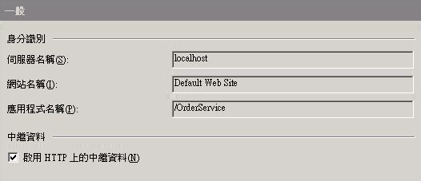
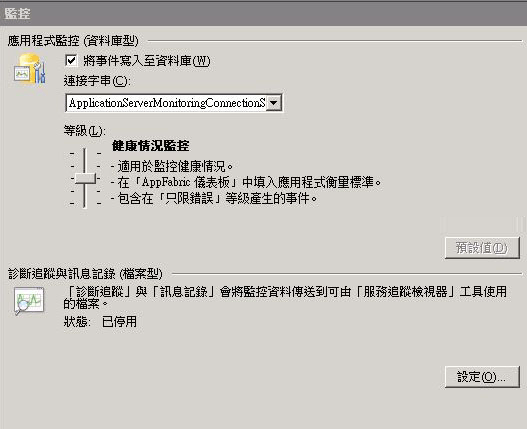
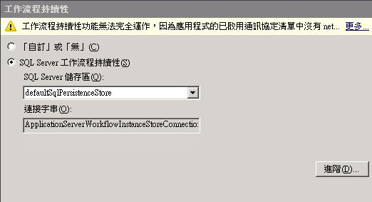
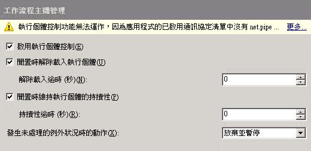
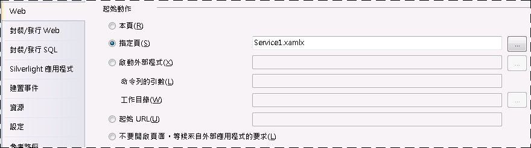
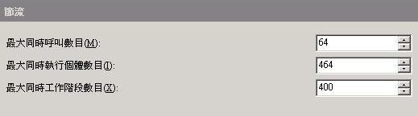
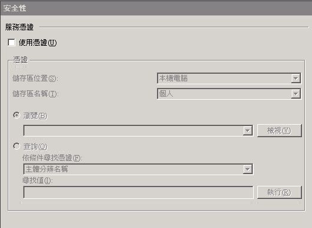
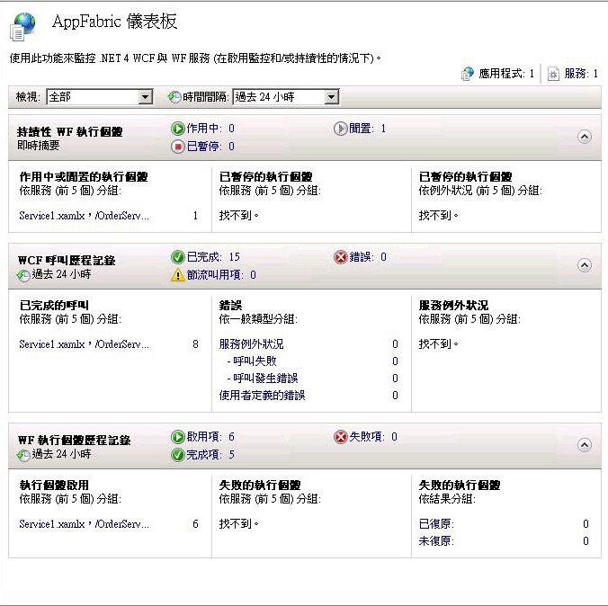
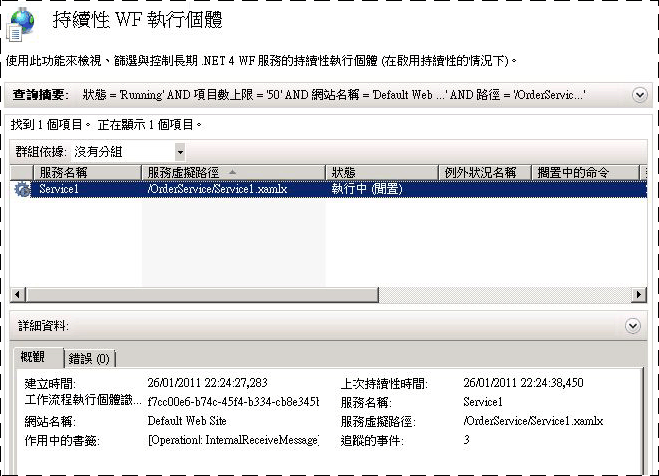

# HOW TO：使用 Windows Server App Fabric 裝載工作流程服務
在 AppFabric 中裝載工作流程服務與在 IIS\/WAS 底下裝載很相似。唯一的差異在於 AppFabric 針對部署、監視和管理工作流程服務所提供的工具。本主題會使用在[建立長期執行的工作流程服務](../../../../docs/framework/wcf/feature-details/creating-a-long-running-workflow-service.md)中建立的工作流程服務。該主題將逐步引導您建立工作流程服務。本主題會說明如何使用 AppFabric 來裝載工作流程服務。[!INCLUDE[crabout](../../../../includes/crabout-md.md)] Windows Server AppFabric 的詳細資訊，請參閱 [Windows Server AppFabric 文件](http://go.microsoft.com/fwlink/?LinkID=193037&clcid=0x409)。完成下列步驟之前，請先確定您已安裝 Windows Server AppFabric。若要這樣做，請開啟 Internet Information Services \(inetmgr.exe\)、在 \[**連線**\] 檢視中按一下您的伺服器名稱、按一下 \[站台\]，然後按一下 \[**預設的網站**\]。在畫面的右側，您應該會看見名為 \[**AppFabric**\] 的區段。如果您沒有看見此區段 \(位於右側窗格的頂端\)，表示您沒有安裝 App Fabric。[!INCLUDE[crabout](../../../../includes/crabout-md.md)]安裝 Windows Server App Fabric 的詳細資訊，請參閱[安裝 Windows Server App Fabric](http://go.microsoft.com/fwlink/?LinkId=193136)。  
  
### 建立簡單的工作流程服務  
  
1.  開啟 [!INCLUDE[vs_current_long](../../../../includes/vs-current-long-md.md)] 並載入您在 [建立長期執行的工作流程服務](../../../../docs/framework/wcf/feature-details/creating-a-long-running-workflow-service.md) 主題中建立的 OrderProcessing 方案。  
  
2.  以滑鼠右鍵按一下 \[**OrderService**\] 專案、選取 \[**屬性**\]，然後選取 \[**Web**\] 索引標籤。  
  
3.  在屬性頁的 \[**起始動作**\] 區段中，選取 \[**指定頁**\]，然後在編輯方塊中輸入 Service1.xamlx。  
  
4.  在屬性頁的 \[**伺服器**\] 區段中，選取 \[**使用本機 IIS Web 伺服器**\]，然後輸入下列 URL：`http://localhost/OrderService`。  
  
5.  按一下 \[**建立虛擬目錄**\] 按鈕。這樣就會建立新的虛擬目錄並設定專案，以便在建置專案時，將所需的檔案複製到虛擬目錄。或者，您也可以將 .xamlx、web.config 和任何所需的 DLL 手動複製到虛擬目錄。  
  
### 設定在 Windows Server AppFabric 中裝載的工作流程服務  
  
1.  開啟 Internet Information Services 管理員 \(inetmgr.exe\)。  
  
2.  在 \[**連線**\] 窗格中，巡覽至 OrderService 虛擬目錄。  
  
3.  以滑鼠右鍵按一下 \[OrderService\] 並選取 \[**管理 WCF 與 WF 服務**\] 和 \[**設定**\]。\[**設定應用程式的 WCF 與 WF**\] 對話方塊隨即顯示。  
  
4.  選取 \[**一般**\] 索引標籤，即可顯示有關應用程式的一般資訊，如下列螢幕擷取畫面所示。  
  
       
  
5.  選取 \[**監控**\] 索引標籤。這樣就會顯示各種監控設定，如下列螢幕擷取畫面所示。  
  
       
  
     [!INCLUDE[crabout](../../../../includes/crabout-md.md)]在 AppFabric 中設定工作流程服務監控的詳細資訊，請參閱[設定監控功能](http://go.microsoft.com/fwlink/?LinkId=193153)。  
  
6.  選取 \[**工作流程持續性**\] 索引標籤。這樣可讓您將應用程式設定為使用 AppFabric 的預設持續性提供者，如下列螢幕擷取畫面所示。  
  
       
  
     [!INCLUDE[crabout](../../../../includes/crabout-md.md)]在 Windows Server AppFabric 中設定工作流程持續性的詳細資訊，請參閱[設定工作流程持續性](http://go.microsoft.com/fwlink/?LinkId=193148)。  
  
7.  選取 \[**工作流程主機管理**\] 索引標籤。這樣可讓您指定應該卸載並保存閒置工作流程服務執行個體的時間，如下列螢幕擷取畫面所示。  
  
       
  
     [!INCLUDE[crabout](../../../../includes/crabout-md.md)]工作流程主機管理組態的詳細資訊，請參閱[設定工作流程主機管理](http://go.microsoft.com/fwlink/?LinkId=193151)。  
  
8.  選取 \[**自動啟動**\] 索引標籤。這樣可讓您針對應用程式中的工作流程服務指定自動啟動設定，如下列螢幕擷取畫面所示。  
  
       
  
     [!INCLUDE[crabout](../../../../includes/crabout-md.md)]設定自動啟動的詳細資訊，請參閱[設定自動啟動功能](http://go.microsoft.com/fwlink/?LinkId=193150)。  
  
9. 選取 \[**節流**\] 索引標籤。這樣可讓您針對工作流程服務進行節流設定，如下列螢幕擷取畫面所示。  
  
       
  
     [!INCLUDE[crabout](../../../../includes/crabout-md.md)]設定節流的詳細資訊，請參閱[設定節流功能](http://go.microsoft.com/fwlink/?LinkId=193149)。  
  
10. 選取 \[**安全性**\] 索引標籤。這樣可讓您針對應用程式進行安全性設定，如下列螢幕擷取畫面所示。  
  
       
  
     [!INCLUDE[crabout](../../../../includes/crabout-md.md)]使用 Windows Server AppFabric 來設定安全性的詳細資訊，請參閱[設定安全性](http://go.microsoft.com/fwlink/?LinkId=193152)。  
  
### 使用 Windows Server AppFabric  
  
1.  建置方案，以便將必要的檔案複製到虛擬目錄。  
  
2.  以滑鼠右鍵按一下 \[OrderClient\] 專案並選取 \[**偵錯**\] 和 \[**開始新執行個體**\] 啟動用戶端應用程式。  
  
3.  用戶端隨即執行，而且 Visual Studio 將顯示 \[**附加安全性警告**\] 對話方塊。請按一下 \[**不附加**\] 按鈕。這樣會告知 Visual Studio 不要附加至 IIS 處理序進行偵錯。  
  
4.  用戶端應用程式會立即呼叫工作流程服務，然後等候。工作流程服務將處於閒置狀態並保存。您可以啟動 Internet Information Services \(inetmgr.exe\)、在 \[連線\] 窗格中巡覽至 OrderService，然後選取它，藉以確認這點。接著，在右側窗格中，按一下 \[App Fabric 儀表板\] 圖示。在 \[持續性 WF 執行個體\] 底下，您將看見一個已保存的工作流程服務執行個體，如下列螢幕擷取畫面所示。  
  
       
  
     \[**WF 執行個體歷程記錄**\] 會列出工作流程服務的相關資訊，例如工作流程服務啟用項數目、工作流程服務執行個體完成項數目，以及失敗的工作流程執行個體數目。\[作用中或閒置的執行個體\] 底下會顯示一個連結。按一下此連結就會顯示有關閒置工作流程執行個體的詳細資訊，如下列螢幕擷取畫面所示。  
  
       
  
     如需 Windows Server App Fabric 功能以及如何使用它們的詳細資訊，請參閱 [Windows Server App Fabric 主控功能](http://go.microsoft.com/fwlink/?LinkID=193143&clcid=0x409)。  
  
## 請參閱  
 [建立長期執行的工作流程服務](../../../../docs/framework/wcf/feature-details/creating-a-long-running-workflow-service.md)   
 [AppFabric 主控功能](http://go.microsoft.com/fwlink/?LinkId=193143)   
 [安裝 Windows ServerApp Fabric](http://go.microsoft.com/fwlink/?LinkId=193136)   
 [Windows Server AppFabric 文件](http://go.microsoft.com/fwlink/?LinkID=193037&clcid=0x409)