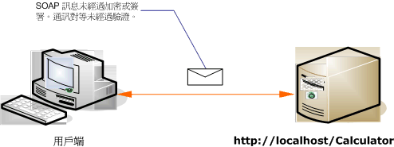

# <a name="internet-unsecured-client-and-service"></a><span data-ttu-id="d3814-102">沒有安全保障的網際網路用戶端與服務</span><span class="sxs-lookup"><span data-stu-id="d3814-102">Internet Unsecured Client and Service</span></span>
<span data-ttu-id="d3814-103">下圖顯示的公用、 不安全 Windows Communication Foundation (WCF) 用戶端和服務的範例。</span><span class="sxs-lookup"><span data-stu-id="d3814-103">The following illustration shows an example of a public, unsecured Windows Communication Foundation (WCF) client and service.</span></span>  
  
 <span data-ttu-id="d3814-104"></span><span class="sxs-lookup"><span data-stu-id="d3814-104"></span></span>  
  
|<span data-ttu-id="d3814-105">特性</span><span class="sxs-lookup"><span data-stu-id="d3814-105">Characteristic</span></span>|<span data-ttu-id="d3814-106">描述</span><span class="sxs-lookup"><span data-stu-id="d3814-106">Description</span></span>|  
|--------------------|-----------------|  
|<span data-ttu-id="d3814-107">安全性模式</span><span class="sxs-lookup"><span data-stu-id="d3814-107">Security Mode</span></span>|<span data-ttu-id="d3814-108">無</span><span class="sxs-lookup"><span data-stu-id="d3814-108">None</span></span>|  
|<span data-ttu-id="d3814-109">Transport</span><span class="sxs-lookup"><span data-stu-id="d3814-109">Transport</span></span>|<span data-ttu-id="d3814-110">HTTP</span><span class="sxs-lookup"><span data-stu-id="d3814-110">HTTP</span></span>|  
|<span data-ttu-id="d3814-111">繫結</span><span class="sxs-lookup"><span data-stu-id="d3814-111">Binding</span></span>|<span data-ttu-id="d3814-112"><xref:System.ServiceModel.BasicHttpBinding> 在程式碼，或[ \<basicHttpBinding >](../../../../docs/framework/configure-apps/file-schema/wcf/basichttpbinding.md)組態中的項目。</span><span class="sxs-lookup"><span data-stu-id="d3814-112"><xref:System.ServiceModel.BasicHttpBinding> in code, or the [\<basicHttpBinding>](../../../../docs/framework/configure-apps/file-schema/wcf/basichttpbinding.md) element in configuration.</span></span>|  
|<span data-ttu-id="d3814-113">互通性</span><span class="sxs-lookup"><span data-stu-id="d3814-113">Interoperability</span></span>|<span data-ttu-id="d3814-114">使用現有的 Web 服務用戶端和服務</span><span class="sxs-lookup"><span data-stu-id="d3814-114">With existing Web service clients and services</span></span>|  
|<span data-ttu-id="d3814-115">驗證</span><span class="sxs-lookup"><span data-stu-id="d3814-115">Authentication</span></span>|<span data-ttu-id="d3814-116">無</span><span class="sxs-lookup"><span data-stu-id="d3814-116">None</span></span>|  
|<span data-ttu-id="d3814-117">完整性</span><span class="sxs-lookup"><span data-stu-id="d3814-117">Integrity</span></span>|<span data-ttu-id="d3814-118">無</span><span class="sxs-lookup"><span data-stu-id="d3814-118">None</span></span>|  
|<span data-ttu-id="d3814-119">機密性</span><span class="sxs-lookup"><span data-stu-id="d3814-119">Confidentiality</span></span>|<span data-ttu-id="d3814-120">無</span><span class="sxs-lookup"><span data-stu-id="d3814-120">None</span></span>|  
  
## <a name="service"></a><span data-ttu-id="d3814-121">服務</span><span class="sxs-lookup"><span data-stu-id="d3814-121">Service</span></span>  
 <span data-ttu-id="d3814-122">下列程式碼和組態要獨立執行。</span><span class="sxs-lookup"><span data-stu-id="d3814-122">The following code and configuration are meant to run independently.</span></span> <span data-ttu-id="d3814-123">執行下列任一步驟：</span><span class="sxs-lookup"><span data-stu-id="d3814-123">Do one of the following:</span></span>  
  
-   <span data-ttu-id="d3814-124">使用不含組態的程式碼建立獨立服務。</span><span class="sxs-lookup"><span data-stu-id="d3814-124">Create a stand-alone service using the code with no configuration.</span></span>  
  
-   <span data-ttu-id="d3814-125">使用提供的組態建立服務，但不要定義任何端點。</span><span class="sxs-lookup"><span data-stu-id="d3814-125">Create a service using the supplied configuration, but do not define any endpoints.</span></span>  
  
### <a name="code"></a><span data-ttu-id="d3814-126">程式碼</span><span class="sxs-lookup"><span data-stu-id="d3814-126">Code</span></span>  
 <span data-ttu-id="d3814-127">下列程式碼顯示如何建立無安全性的端點。</span><span class="sxs-lookup"><span data-stu-id="d3814-127">The following code shows how to create an endpoint with no security.</span></span> <span data-ttu-id="d3814-128">根據預設值，<xref:System.ServiceModel.BasicHttpBinding> 的安全性模式設定為 <xref:System.ServiceModel.BasicHttpSecurityMode.None>。</span><span class="sxs-lookup"><span data-stu-id="d3814-128">By default, the <xref:System.ServiceModel.BasicHttpBinding> has the security mode set to <xref:System.ServiceModel.BasicHttpSecurityMode.None>.</span></span>  
  
 [!code-csharp[C_UnsecuredService#1](../../../../samples/snippets/csharp/VS_Snippets_CFX/c_unsecuredservice/cs/source.cs#1)]
 [!code-vb[C_UnsecuredService#1](../../../../samples/snippets/visualbasic/VS_Snippets_CFX/c_unsecuredservice/vb/source.vb#1)]  
  
### <a name="service-configuration"></a><span data-ttu-id="d3814-129">服務組態</span><span class="sxs-lookup"><span data-stu-id="d3814-129">Service Configuration</span></span>  
 <span data-ttu-id="d3814-130">下列程式碼會使用組態設定相同端點。</span><span class="sxs-lookup"><span data-stu-id="d3814-130">The following code sets up the same endpoint using configuration.</span></span>  
  
```xml  
<?xml version="1.0" encoding="utf-8"?>  
<configuration>  
  <system.serviceModel>  
    <behaviors />  
    <services>  
      <service behaviorConfiguration="" name="ServiceModel.Calculator">  
        <endpoint address="http://localhost/Calculator"   
                  binding="basicHttpBinding"  
                  bindingConfiguration="Basic_Unsecured"   
                  name="BasicHttp_ICalculator"  
                  contract="ServiceModel.ICalculator" />  
      </service>  
    </services>  
    <bindings>  
      <basicHttpBinding>  
        <binding name="Basic_Unsecured" />  
      </basicHttpBinding>  
    </bindings>  
    <client />  
  </system.serviceModel>  
</configuration>  
```  
  
## <a name="client"></a><span data-ttu-id="d3814-131">用戶端</span><span class="sxs-lookup"><span data-stu-id="d3814-131">Client</span></span>  
 <span data-ttu-id="d3814-132">下列程式碼和組態要獨立執行。</span><span class="sxs-lookup"><span data-stu-id="d3814-132">The following code and configuration are meant to run independently.</span></span> <span data-ttu-id="d3814-133">執行下列任一步驟：</span><span class="sxs-lookup"><span data-stu-id="d3814-133">Do one of the following:</span></span>  
  
-   <span data-ttu-id="d3814-134">使用此程式碼 (和用戶端程式碼) 建立獨立用戶端。</span><span class="sxs-lookup"><span data-stu-id="d3814-134">Create a stand-alone client using the code (and client code).</span></span>  
  
-   <span data-ttu-id="d3814-135">建立未定義任何端點位址的用戶端，</span><span class="sxs-lookup"><span data-stu-id="d3814-135">Create a client that does not define any endpoint addresses.</span></span> <span data-ttu-id="d3814-136">然後改用可接受組態名稱當做引數的用戶端建構函式。</span><span class="sxs-lookup"><span data-stu-id="d3814-136">Instead, use the client constructor that takes the configuration name as an argument.</span></span> <span data-ttu-id="d3814-137">例如：</span><span class="sxs-lookup"><span data-stu-id="d3814-137">For example:</span></span>  
  
     [!code-csharp[C_SecurityScenarios#0](../../../../samples/snippets/csharp/VS_Snippets_CFX/c_securityscenarios/cs/source.cs#0)]
     [!code-vb[C_SecurityScenarios#0](../../../../samples/snippets/visualbasic/VS_Snippets_CFX/c_securityscenarios/vb/source.vb#0)]  
  
### <a name="code"></a><span data-ttu-id="d3814-138">程式碼</span><span class="sxs-lookup"><span data-stu-id="d3814-138">Code</span></span>  
 <span data-ttu-id="d3814-139">下列程式碼會顯示基本的 WCF 用戶端使用不安全端點。</span><span class="sxs-lookup"><span data-stu-id="d3814-139">The following code shows a basic WCF client that accesses an unsecured endpoint.</span></span>  
  
 [!code-csharp[C_UnsecuredClient#1](../../../../samples/snippets/csharp/VS_Snippets_CFX/c_unsecuredclient/cs/source.cs#1)]
 [!code-vb[C_UnsecuredClient#1](../../../../samples/snippets/visualbasic/VS_Snippets_CFX/c_unsecuredclient/vb/source.vb#1)]  
  
### <a name="client-configuration"></a><span data-ttu-id="d3814-140">用戶端組態</span><span class="sxs-lookup"><span data-stu-id="d3814-140">Client Configuration</span></span>  
 <span data-ttu-id="d3814-141">下列程式碼會設定用戶端。</span><span class="sxs-lookup"><span data-stu-id="d3814-141">The following code configures the client.</span></span>  
  
```xml  
<?xml version="1.0" encoding="utf-8"?>  
<configuration>  
  <system.serviceModel>  
    <bindings>  
      <basicHttpBinding>  
        <binding name="BasicHttpBinding_ICalculator" >  
          <security mode="None">  
          </security>  
        </binding>  
      </basicHttpBinding>  
    </bindings>  
    <client>  
      <endpoint address="http://localhost/Calculator/Unsecured"  
          binding="basicHttpBinding"   
          bindingConfiguration="BasicHttpBinding_ICalculator"  
          contract="ICalculator"   
          name="BasicHttpBinding_ICalculator" />  
    </client>  
  </system.serviceModel>  
</configuration>  
```  
  
## <a name="see-also"></a><span data-ttu-id="d3814-142">另請參閱</span><span class="sxs-lookup"><span data-stu-id="d3814-142">See Also</span></span>  
 [<span data-ttu-id="d3814-143">常見的安全性案例</span><span class="sxs-lookup"><span data-stu-id="d3814-143">Common Security Scenarios</span></span>](../../../../docs/framework/wcf/feature-details/common-security-scenarios.md)  
 [<span data-ttu-id="d3814-144">安全性概觀</span><span class="sxs-lookup"><span data-stu-id="d3814-144">Security Overview</span></span>](../../../../docs/framework/wcf/feature-details/security-overview.md)  
 [<span data-ttu-id="d3814-145">Windows Server App Fabric 的安全性模型</span><span class="sxs-lookup"><span data-stu-id="d3814-145">Security Model for Windows Server App Fabric</span></span>](https://go.microsoft.com/fwlink/?LinkID=201279&clcid=0x409)
