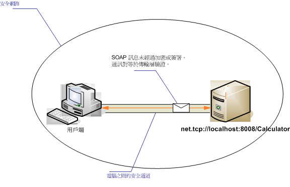

# <a name="intranet-unsecured-client-and-service"></a>沒有安全保障的內部網路用戶端與服務
下圖說明簡單的 Windows Communication Foundation (WCF) 服務，開發 WCF 應用程式的安全私人網路上提供的資訊。 因為資料重要性低、 預期是原本就是安全的網路，或安全性由 WCF 基礎結構下一層提供，則不需要安全性。  
  
   
  
|特性|描述|  
|--------------------|-----------------|  
|安全性模式|無|  
|Transport|TCP|  
|繫結|<xref:System.ServiceModel.NetTcpBinding>|  
|互通性|WCF 只|  
|驗證|無|  
|完整性|無|  
|機密性|無|  
  
## <a name="service"></a>服務  
 下列程式碼和組態要獨立執行。 執行下列任一步驟：  
  
-   使用不含組態的程式碼建立獨立服務。  
  
-   使用提供的組態建立服務，但不要定義任何端點。  
  
### <a name="code"></a>程式碼  
 下列程式碼會示範如何建立無安全性的端點：  
  
 [!code-csharp[C_UnsecuredService#2](../../../../samples/snippets/csharp/VS_Snippets_CFX/c_unsecuredservice/cs/source.cs#2)]
 [!code-vb[C_UnsecuredService#2](../../../../samples/snippets/visualbasic/VS_Snippets_CFX/c_unsecuredservice/vb/source.vb#2)]  
  
### <a name="configuration"></a>組態  
 下列程式碼會設定使用組態的相同端點：  
  
```xml  
<?xml version="1.0" encoding="utf-8"?>  
<configuration>  
  <system.serviceModel>  
    <behaviors />  
    <services>  
      <service behaviorConfiguration=""   
               name="ServiceModel.Calculator">  
        <endpoint address="net.tcp://localhost:8008/Calculator"   
                  binding="netTcpBinding"  
                  bindingConfiguration="tcp_Unsecured"   
                  name="netTcp_ICalculator"  
                  contract="ServiceModel.ICalculator" />  
      </service>  
    </services>  
    <bindings>  
      <netTcpBinding>  
        <binding name="tcp_Unsecured">  
          <security mode="None" />  
        </binding>  
      </netTcpBinding>  
    </bindings>  
    <client />  
  </system.serviceModel>  
</configuration>  
```  
  
## <a name="client"></a>用戶端  
 下列程式碼和組態要獨立執行。 執行下列任一步驟：  
  
-   使用此程式碼 (和用戶端程式碼) 建立獨立用戶端。  
  
-   建立未定義任何端點位址的用戶端， 然後改用可接受組態名稱當做引數的用戶端建構函式。 例如：  
  
     [!code-csharp[C_SecurityScenarios#0](../../../../samples/snippets/csharp/VS_Snippets_CFX/c_securityscenarios/cs/source.cs#0)]
     [!code-vb[C_SecurityScenarios#0](../../../../samples/snippets/visualbasic/VS_Snippets_CFX/c_securityscenarios/vb/source.vb#0)]  
  
### <a name="code"></a>程式碼  
 下列程式碼會顯示基本的 WCF 用戶端存取使用 TCP 通訊協定的不安全的端點。  
  
 [!code-csharp[C_UnsecuredClient#2](../../../../samples/snippets/csharp/VS_Snippets_CFX/c_unsecuredclient/cs/source.cs#2)]
 [!code-vb[C_UnsecuredClient#2](../../../../samples/snippets/visualbasic/VS_Snippets_CFX/c_unsecuredclient/vb/source.vb#2)]  
  
### <a name="configuration"></a>組態  
 下列組態程式碼會套用至用戶端：  
  
```xml  
<?xml version="1.0" encoding="utf-8"?>  
<configuration>  
  <system.serviceModel>  
    <bindings>  
      <netTcpBinding>  
        <binding name="NetTcpBinding_ICalculator" >  
          <security mode="None">  
          </security>  
        </binding>  
      </netTcpBinding>  
    </bindings>  
    <client>  
      <endpoint address="net.tcp://machineName:8008/Calculator "  
                binding="netTcpBinding"   
                bindingConfiguration="NetTcpBinding_ICalculator"  
                contract="ICalculator"   
                name="NetTcpBinding_ICalculator" />  
    </client>  
  </system.serviceModel>  
</configuration>  
```  
  
## <a name="see-also"></a>另請參閱  
 <xref:System.ServiceModel.NetTcpBinding>  
 [安全性概觀](../../../../docs/framework/wcf/feature-details/security-overview.md)  
 [Windows Server App Fabric 的安全性模型](https://go.microsoft.com/fwlink/?LinkID=201279&clcid=0x409)
