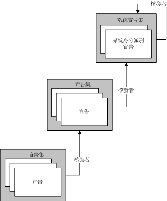
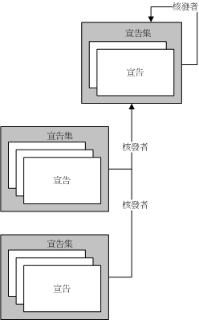
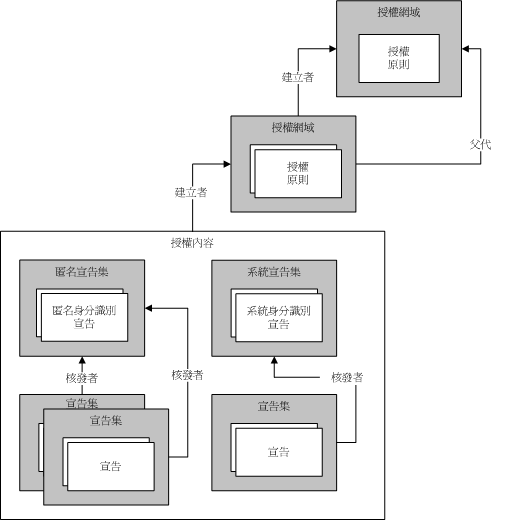

# 使用身分識別模型來管理宣告與授權
授權就是決定哪些實體可以擁有變更、檢視或另外存取電腦資源等權限的程序。 例如，在公司裡只有經理可以存取這家公司員工的檔案。 Windows Communication Foundation (WCF) 支援兩種機制執行授權程序。 第一種機制可讓您使用現有的 Common Language Runtime (CLR) 建構來控制授權。 第二個是宣告為基礎的模型，稱為*身分識別模型*。 WCF 會使用身分識別模型來建立宣告，從內送訊息;身分識別模型類別可加以擴充以支援新的宣告類型，用於自訂授權配置。 本主題將顯示識別模型功能的主要程式設計概念概觀，以及此功能使用之最重要類別的清單。  
  
## 識別模型案例  
 下列案例會顯示使用識別模型。  
  
### 案例 1:支援身分識別、 角色和群組宣告  
 使用者傳送訊息至 Web 服務。 Web 服務的存取控制需求使用識別、角色或群組。 訊息寄件者會對應至一組角色或一組群組。 角色或群組資訊會用於執行存取檢查。  
  
### 案例 2:支援豐富的宣告  
 使用者傳送訊息至 Web 服務。 Web 服務的存取控制需求需要使用比識別、角色或群組更豐富的模型。 Web 服務會使用豐富的宣告架構模型來判定特定使用者是否可以存取特定受保護的資源。 例如，某位使用者可以讀取像是薪資資訊的特定資訊，但是其他使用者不能讀取該資訊。  
  
### 案例 3:對應不同的宣告  
 使用者傳送訊息至 Web 服務。 使用者可以在幾個不同的方式指定其認證：X.509 憑證、 使用者名稱權杖或 Kerberos 語彙基元。 不論是那一種使用者認證類型，Web 服務都必須以相同方式來執行存取控制檢查。 如果在經過一段時間後有其他認證類型也受到支援，系統也應該隨著演進。  
  
### 案例 4:判斷多個資源的存取權  
 Web 服務嘗試存取多個資源。 此服務會將與使用者關聯的宣告與存取該資源時所需要的宣告進行比較，以判定特定使用者擁有哪一個受保護資源的存取權限。  
  
## 識別模型詞彙  
 下列清單會定義用來描述識別模型概念的重要詞彙。  
  
 授權原則  
 一組規則，可將一組輸入宣告對應至一組輸出宣告。 評估授權原則，便可使宣告集新增至評估內容以及隨後的授權內容中。  
  
 授權內容  
 一組宣告集，以及零或更多個屬性。 評估一個或多個授權原則所產生的結果。  
  
 宣告  
 宣告類型、權限和值的組合。  
  
 宣告集  
 由特定簽發者所發行的一組宣告。  
  
 宣告類型  
 宣告的種類。 由識別模型 API 定義的宣告，就是 <xref:System.IdentityModel.Claims.Claim.ClaimType%2A> 類別的屬性。 系統提供的宣告類型範例包括：<xref:System.IdentityModel.Claims.ClaimTypes.Dns%2A>、<xref:System.IdentityModel.Claims.ClaimTypes.Email%2A>、<xref:System.IdentityModel.Claims.ClaimTypes.Hash%2A>、<xref:System.IdentityModel.Claims.ClaimTypes.Name%2A>、<xref:System.IdentityModel.Claims.ClaimTypes.Rsa%2A>、<xref:System.IdentityModel.Claims.ClaimTypes.Sid%2A>、<xref:System.IdentityModel.Claims.ClaimTypes.Spn%2A>、<xref:System.IdentityModel.Claims.ClaimTypes.System%2A>、<xref:System.IdentityModel.Claims.ClaimTypes.Thumbprint%2A>、<xref:System.IdentityModel.Claims.ClaimTypes.Uri%2A> 和 <xref:System.IdentityModel.Claims.ClaimTypes.X500DistinguishedName%2A>。  
  
 評估內容  
 評估其中之授權原則的內容。 包含屬性和宣告集。 完成評估之後，便會成為授權內容的基礎。  
  
 識別宣告  
 所擁有權限即為識別的宣告。  
  
 簽發者  
 宣告集，其包含至少一個識別宣告且被視為已發行其他宣告集。  
  
 屬性  
 一組與評估內容或授權內容相關聯的資訊。  
  
 受保護資源  
 指系統中僅能在符合特定需求時才能予以使用、存取或操作的內容。  
  
 右  
 指關於某項資源的能力。 由識別模型 API 定義的權限，就是 <xref:System.IdentityModel.Claims.Rights> 類別的屬性。 系統提供的權限範例包括 <xref:System.IdentityModel.Claims.Rights.Identity%2A> 和 <xref:System.IdentityModel.Claims.Rights.PossessProperty%2A>。  
  
 值  
 指可透過其中來宣告權限的內容。  
  
## 宣告  
 識別模型為宣告架構的系統。 宣告會描述與系統中某些實體關聯的功能，這類實體通常是指該系統的使用者。 與特定實體關聯的一組宣告可以視為金鑰。 這些特定宣告會定義該金鑰的形狀，就像是用來開啟門鎖的實體鑰匙。 宣告可用來獲得資源的存取權。 判定特定受保護資源之權限的方式，就是比較存取該資源時所需要的宣告和正在嘗試存取之實體的相關聯宣告。  
  
 宣告就是權限對於特定值的運算式。 權限可以是 "Read"、"Write" 或 "Execute" 或其他權限。 值可以是資料庫、檔案、信箱或屬性。 宣告也具有宣告類型， 宣告類型和權限的組合會提供可指定關於特定值之能力的機制。 例如，當宣告類型 "File" 對於值 "Biography.doc" 擁有權限 "Read"，表示與該宣告關聯的實體擁有 Biography.doc 檔案的讀取權限。當宣告類型 "Name" 對於值 "Martin" 擁有權限 "PossessProperty"，表示與該宣告關聯的實體會處理值為 "Martin" 的 Name 屬性。  
  
 雖然各種宣告類型和權限都會定義成為識別模型的一部分，但是系統仍具備擴充性，可以讓各種系統建置於識別模型基礎架構的頂端，以便視需要定義其他宣告類型和權限。  
  
### 識別宣告  
 識別的權限是一種特殊權限。 擁有此權限的宣告發出關於實體之識別的陳述式。 例如，宣告類型 「 使用者主體名稱 」 (UPN) 值是"someone@example.com」 和身分識別的權限表示特定網域中的特定識別。  
  
#### 系統識別宣告  
 身分識別模型會定義一個識別宣告：系統。 此系統識別宣告表示實體為目前的應用程式或系統。  
  
### 宣告集  
 表示識別的宣告模型是很重要的，因為宣告永遠都是由系統中的某些實體發行的，即使該實體只是某些「自我」的概念。 宣告會聚集起來分類為集合，且每個集合都會有簽發者。 而簽發者就只是一組宣告。 此類遞迴關係最終必須結束，而且任何宣告集都可以成為自己的簽發者。  
  
 下列圖表顯示三個宣告集範例，其中一個宣告集是以另一個宣告集做為其簽發者，而該簽發者宣告集又以系統宣告集做為其簽發者。 因此，這些宣告集會形成具有任意深度的階層。  
  
   
  
 多個宣告集可以擁有相同的發行宣告集，如下圖所示。  
  
   
  
 除了宣告集為自己本身簽發者的情況，識別模型並不支援讓宣告集形成迴圈。 因此，絕對不會出現宣告集 A 是由宣告集 B 發行，而宣告集 B 本身又是由宣告集 A 發行的狀況。 此外，識別模型也不支援宣告集擁有多個簽發者。 如果有兩個或多個簽發者必須發行特定的宣告集，您就必須使用多個宣告集來讓每個宣告集都包含相同的宣告，但卻擁有不同的簽發者。  
  
### 宣告的來源  
 宣告可以來自多個來源。 其中一個常見的宣告來源就是使用者所提供的認證，例如屬於傳送給 Web 服務之訊息的一部分。 系統會驗證此類宣告，接著這些宣告就會成為與使用者關聯之宣告集的一部分。 其他的系統元件也可以成為宣告來源，包括但不限於作業系統、網路堆疊、執行階段環境或應用程式。 此外，遠端服務也可以成為宣告來源。  
  
### 授權原則  
 在識別模型中，在評估授權原則程序時會產生宣告。 授權原則會檢查 (可能為空白的) 現有的宣告集，而且可能會選擇新增以既有宣告為基礎的額外宣告，以及新增其進行處置時的額外資訊。 這樣會提供宣告之間的對應基礎。 系統中是否存在宣告會影響授權原則的行為，也就是會決定是否會新增額外的宣告。  
  
 例如，授權原則可以存取包含了使用系統之各個實體生日的資料庫。 授權原則會使用該資訊，在內容中新增 "Over18" 的宣告。 請注意，此處的 Over18 宣告並不會洩漏實體的任何資訊，而只是用於表示其超過 18 歲。 請注意，對 'Over18' 宣告的解譯會依據對該宣告語意的瞭解而有不同。 新增此宣告的授權原則多少都會瞭解這些語意。 負責後續檢查原則評估所產生之宣告的程式碼也會獲悉這些語意。  
  
 特定的授權原則可能會要求對其進行多次評估，因為其他授權原則會新增宣告，該授權原則也可能會新增更多的宣告。 識別模型是設計成可持續進行評估，直到內容中不再由任何授權原則有效地新增宣告為止。 這個持續進行的授權原則評估可避免對於授權原則強制要求執行任何特定的評估順序；也就是說，它們可以依照任意順序來進行評估。 例如，假設原則 X 必須等到原則 A 新增了宣告 B 才會新增宣告 Z，則如果是原則 X 先進行評估，它一開始並不會新增宣告 Z。之後，對原則 A 進行評估並新增宣告 B。接著原則 X 就會進行第二次評估，而且這次也會新增宣告 Z。  
  
 特定系統可能擁有多個有效的授權原則。  
  
### 打造鑰匙的機器  
 評估一組相關聯的授權原則，就像是在操作打造鑰匙的機器。 授權原則會分別進行評估並產生宣告集，同時逐漸建構出金鑰的形狀。 一旦金鑰成形後，就可以用來嘗試打開某些鎖。 金鑰的形狀會儲存在「授權內容」中，而授權內容是由授權管理員所建立。  
  
### 授權內容  
 授權管理員會以上述方式來評估各種授權原則，評估所產生的結果就是授權內容 (一組宣告集和某些關聯屬性的集合)。 授權內容可以加以檢查來判定內容中包括了哪些宣告、各種宣告之間的關係 (例如，發行宣告集)，最後還可以針對這些宣告必須符合才可存取資源之特定需求來比較宣告。  
  
### 鎖  
 如果授權內容 (宣告集) 是鑰匙，則在為了存取特定受保護資源而必須滿足的各種需求就構成了一個鎖，而鑰匙必須與這個鎖相配。 識別模型並不會規定此需求的表示方式，但是這些需求會在系統的宣告架構性質驅動之下，進行比對授權內容中的宣告與某些必要的宣告集。  
  
### 概述  
 識別模型是以宣告的概念為基礎。 宣告會分類為集合，並於授權內容完成彙總。 授權內容包含有宣告集，而且它是在評估一個或多個與授權管理員關聯的授權原則之後所產生的。 這些宣告集可以加以檢查，以判定是否符合存取需求。 下圖顯示各種識別模型概念之間的關係。  
  
   
  
## WCF 和識別模型  
 WCF 會使用身分識別模型基礎結構作為基礎來執行授權。 在 WCF 中，<xref:System.ServiceModel.Description.ServiceAuthorizationBehavior>類別可讓您指定*授權*原則做為服務的一部分。 此類授權原則稱為*外部授權原則*，而且它們可以執行宣告處理根據本機原則或與遠端服務互動。 授權管理員中，由<xref:System.ServiceModel.ServiceAuthorizationManager>類別會評估外部授權原則以及辨識各種認證類型 （權杖） 的授權原則，並填入所謂*授權內容*內送訊息到適當的宣告。 授權內容會以 <xref:System.IdentityModel.Policy.AuthorizationContext> 類別表示。  
  
## 識別模型程式設計  
 下表描述可用來程式設計識別模型延伸的物件模型。 這些類別全部都存在於 <xref:System.IdentityModel.Policy> 或 <xref:System.IdentityModel.Claims> 命名空間 (Namespace) 中。  
  
|類別|描述|  
|-----------|-----------------|  
|授權元件|識別模型類別，它會實作 <xref:System.IdentityModel.Policy.IAuthorizationComponent> 介面。|  
|<xref:System.IdentityModel.Policy.IAuthorizationComponent>|提供單一唯讀字串屬性的介面：識別碼。這個屬性值對負責實作此介面之系統中的每個執行個體是唯一的。|  
|<xref:System.IdentityModel.Policy.AuthorizationContext>|*授權元件*，其中包含一組`ClaimSet`具有零個或多個屬性執行個體; 評估一個或多個授權原則的結果。|  
|<xref:System.IdentityModel.Claims.Claim>|宣告類型、權限和值的組合。 權限和值的部分是受宣告類型所限制。|  
|<xref:System.IdentityModel.Claims.ClaimSet>|抽象基底類別。 `Claim` 執行個體的集合。|  
|<xref:System.IdentityModel.Claims.DefaultClaimSet>|密封類別。 `ClaimSet` 類別的實作。|  
|<xref:System.IdentityModel.Policy.EvaluationContext>|抽象基底類別。 它是在原則評估期間傳遞至授權原則。|  
|<xref:System.IdentityModel.Policy.IAuthorizationPolicy>|介面衍生自`IAuthorizationComponent`並由授權原則類別實作。|  
|<xref:System.IdentityModel.Claims.Rights>|靜態類別，包含預先定義的權限值。|  
  
 下列類別也會用於識別模型程式設計中，但不存在於 <xref:System.IdentityModel.Policy> 或 <xref:System.IdentityModel.Claims> 命名空間。  
  
|類別|描述|  
|-----------|-----------------|  
|<xref:System.ServiceModel.ServiceAuthorizationManager>|類別，它可提供方法 (<xref:System.ServiceModel.ServiceAuthorizationManager.CheckAccessCore%2A>) 來對服務中的每項作業執行宣告架構的授權檢查。 您必須衍生自類別並覆寫該方法。|  
|<xref:System.ServiceModel.Description.ServiceAuthorizationBehavior>|密封類別，它會提供當服務與授權有關時與該服務行為關聯的各種屬性。|  
|<xref:System.ServiceModel.ServiceSecurityContext>|類別，它會提供適用於目前執行中 (或即將執行) 之作業的安全性內容，其中包括授權內容。 這個類別的執行個體為 <xref:System.ServiceModel.OperationContext> 的一部分。|  
  
### 顯著性成員  
 下列成員經常用來建立新的宣告類型。  
  
|成員|描述|  
|------------|-----------------|  
|<xref:System.ServiceModel.ServiceAuthorizationManager.CheckAccessCore%2A>|衍生類別會實作這個方法，以便在執行服務中的作業之前先執行宣告架構的存取檢查。 在已提供 <xref:System.ServiceModel.OperationContext> 或其他地方的任何資訊以及所有資訊，可以在做出存取檢查決策時加以檢查。 如果 <xref:System.ServiceModel.ServiceAuthorizationManager.CheckAccessCore%2A> 傳回 `true`，則會授與存取並允許作業執行。 如果 `CheckAccessCore` 傳回 `false`，則會拒絕存取且不會執行作業。 如需範例，請參閱[如何：建立自訂授權管理員服務](../../../../docs/framework/wcf/extending/how-to-create-a-custom-authorization-manager-for-a-service.md)。|  
|<xref:System.ServiceModel.Description.ServiceAuthorizationBehavior.ServiceAuthorizationManager%2A>|傳回服務的 <xref:System.ServiceModel.ServiceAuthorizationManager>。 <xref:System.ServiceModel.ServiceAuthorizationManager> 負責做出授權決策。|  
|<xref:System.ServiceModel.Description.ServiceAuthorizationBehavior.ExternalAuthorizationPolicies%2A>|對此服務所指定的自訂授權原則集合。 除了與傳入訊息中之認證關聯的原則以外，這些原則也會加以評估。|  
  
## 另請參閱

- <xref:System.IdentityModel.Policy.AuthorizationContext>
- <xref:System.IdentityModel.Claims.Claim>
- <xref:System.IdentityModel.Policy.EvaluationContext>
- <xref:System.IdentityModel.Policy.IAuthorizationComponent>
- <xref:System.IdentityModel.Policy.IAuthorizationPolicy>
- <xref:System.IdentityModel.Claims.Rights>
- <xref:System.IdentityModel.Claims>
- <xref:System.IdentityModel.Policy>
- <xref:System.IdentityModel.Tokens>
- <xref:System.IdentityModel.Selectors>
- [宣告與權杖](../../../../docs/framework/wcf/feature-details/claims-and-tokens.md)
- [宣告與拒絕資源的存取](../../../../docs/framework/wcf/feature-details/claims-and-denying-access-to-resources.md)
- [宣告建立與資源值](../../../../docs/framework/wcf/feature-details/claim-creation-and-resource-values.md)
- [如何：建立自訂宣告](../../../../docs/framework/wcf/extending/how-to-create-a-custom-claim.md)
- [如何：比較宣告](../../../../docs/framework/wcf/extending/how-to-compare-claims.md)
- [如何：建立自訂授權原則](../../../../docs/framework/wcf/extending/how-to-create-a-custom-authorization-policy.md)
- [如何：建立自訂授權管理員服務](../../../../docs/framework/wcf/extending/how-to-create-a-custom-authorization-manager-for-a-service.md)
- [安全性概觀](../../../../docs/framework/wcf/feature-details/security-overview.md)
- [授權](../../../../docs/framework/wcf/feature-details/authorization-in-wcf.md)
