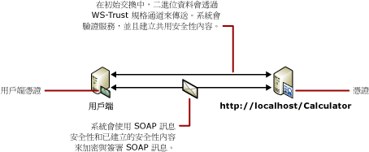

# <a name="message-security-with-a-certificate-client"></a><span data-ttu-id="bfa60-102">憑證用戶端的訊息安全性</span><span class="sxs-lookup"><span data-stu-id="bfa60-102">Message Security with a Certificate Client</span></span>
<span data-ttu-id="bfa60-103">下列狀況顯示使用訊息安全性模式加以保障的 [!INCLUDE[indigo1](../../../../includes/indigo1-md.md)] 用戶端及服務。</span><span class="sxs-lookup"><span data-stu-id="bfa60-103">The following scenario shows a [!INCLUDE[indigo1](../../../../includes/indigo1-md.md)] client and service secured using message security mode.</span></span> <span data-ttu-id="bfa60-104">用戶端與服務皆以憑證驗證。</span><span class="sxs-lookup"><span data-stu-id="bfa60-104">Both the client and the service are authenticated with certificates.</span></span> [!INCLUDE[crdefault](../../../../includes/crdefault-md.md)]<span data-ttu-id="bfa60-105">[分散式應用程式安全性](../../../../docs/framework/wcf/feature-details/distributed-application-security.md)。</span><span class="sxs-lookup"><span data-stu-id="bfa60-105"> [Distributed Application Security](../../../../docs/framework/wcf/feature-details/distributed-application-security.md).</span></span>  
  
 <span data-ttu-id="bfa60-106">範例應用程式，請參閱[訊息安全性憑證](../../../../docs/framework/wcf/samples/message-security-certificate.md)。</span><span class="sxs-lookup"><span data-stu-id="bfa60-106">For a sample application, see [Message Security Certificate](../../../../docs/framework/wcf/samples/message-security-certificate.md).</span></span>  
  
 <span data-ttu-id="bfa60-107"></span><span class="sxs-lookup"><span data-stu-id="bfa60-107"></span></span>  
  
|<span data-ttu-id="bfa60-108">特性</span><span class="sxs-lookup"><span data-stu-id="bfa60-108">Characteristic</span></span>|<span data-ttu-id="bfa60-109">描述</span><span class="sxs-lookup"><span data-stu-id="bfa60-109">Description</span></span>|  
|--------------------|-----------------|  
|<span data-ttu-id="bfa60-110">安全性模式</span><span class="sxs-lookup"><span data-stu-id="bfa60-110">Security Mode</span></span>|<span data-ttu-id="bfa60-111">訊息</span><span class="sxs-lookup"><span data-stu-id="bfa60-111">Message</span></span>|  
|<span data-ttu-id="bfa60-112">互通性</span><span class="sxs-lookup"><span data-stu-id="bfa60-112">Interoperability</span></span>|<span data-ttu-id="bfa60-113">僅限 [!INCLUDE[indigo2](../../../../includes/indigo2-md.md)]</span><span class="sxs-lookup"><span data-stu-id="bfa60-113">[!INCLUDE[indigo2](../../../../includes/indigo2-md.md)] only</span></span>|  
|<span data-ttu-id="bfa60-114">驗證 (伺服器)</span><span class="sxs-lookup"><span data-stu-id="bfa60-114">Authentication (Server)</span></span>|<span data-ttu-id="bfa60-115">使用服務憑證</span><span class="sxs-lookup"><span data-stu-id="bfa60-115">Using service certificate</span></span>|  
|<span data-ttu-id="bfa60-116">驗證 (用戶端)</span><span class="sxs-lookup"><span data-stu-id="bfa60-116">Authentication (Client)</span></span>|<span data-ttu-id="bfa60-117">使用用戶端憑證</span><span class="sxs-lookup"><span data-stu-id="bfa60-117">Using client certificate</span></span>|  
|<span data-ttu-id="bfa60-118">完整性</span><span class="sxs-lookup"><span data-stu-id="bfa60-118">Integrity</span></span>|<span data-ttu-id="bfa60-119">是</span><span class="sxs-lookup"><span data-stu-id="bfa60-119">Yes</span></span>|  
|<span data-ttu-id="bfa60-120">機密性</span><span class="sxs-lookup"><span data-stu-id="bfa60-120">Confidentiality</span></span>|<span data-ttu-id="bfa60-121">是</span><span class="sxs-lookup"><span data-stu-id="bfa60-121">Yes</span></span>|  
|<span data-ttu-id="bfa60-122">Transport</span><span class="sxs-lookup"><span data-stu-id="bfa60-122">Transport</span></span>|<span data-ttu-id="bfa60-123">HTTP</span><span class="sxs-lookup"><span data-stu-id="bfa60-123">HTTP</span></span>|  
|<span data-ttu-id="bfa60-124">繫結</span><span class="sxs-lookup"><span data-stu-id="bfa60-124">Binding</span></span>|<xref:System.ServiceModel.WSHttpBinding>|  
  
## <a name="service"></a><span data-ttu-id="bfa60-125">服務</span><span class="sxs-lookup"><span data-stu-id="bfa60-125">Service</span></span>  
 <span data-ttu-id="bfa60-126">下列程式碼和組態要獨立執行。</span><span class="sxs-lookup"><span data-stu-id="bfa60-126">The following code and configuration are meant to run independently.</span></span> <span data-ttu-id="bfa60-127">執行下列任一步驟：</span><span class="sxs-lookup"><span data-stu-id="bfa60-127">Do one of the following:</span></span>  
  
-   <span data-ttu-id="bfa60-128">使用不含組態的程式碼建立獨立服務。</span><span class="sxs-lookup"><span data-stu-id="bfa60-128">Create a stand-alone service using the code with no configuration.</span></span>  
  
-   <span data-ttu-id="bfa60-129">使用提供的組態建立服務，但不要定義任何端點。</span><span class="sxs-lookup"><span data-stu-id="bfa60-129">Create a service using the supplied configuration, but do not define any endpoints.</span></span>  
  
### <a name="code"></a><span data-ttu-id="bfa60-130">程式碼</span><span class="sxs-lookup"><span data-stu-id="bfa60-130">Code</span></span>  
 <span data-ttu-id="bfa60-131">下列程式碼顯示如何建立使用訊息安全性產生安全內容的服務端點。</span><span class="sxs-lookup"><span data-stu-id="bfa60-131">The following code shows how to create a service endpoint that uses message security to establish a secure context.</span></span>  
  
 [!code-csharp[C_SecurityScenarios#10](../../../../samples/snippets/csharp/VS_Snippets_CFX/c_securityscenarios/cs/source.cs#10)]
 [!code-vb[C_SecurityScenarios#10](../../../../samples/snippets/visualbasic/VS_Snippets_CFX/c_securityscenarios/vb/source.vb#10)]  
  
### <a name="configuration"></a><span data-ttu-id="bfa60-132">組態</span><span class="sxs-lookup"><span data-stu-id="bfa60-132">Configuration</span></span>  
 <span data-ttu-id="bfa60-133">可以使用以下組態來取代程式碼。</span><span class="sxs-lookup"><span data-stu-id="bfa60-133">The following configuration can be used instead of the code.</span></span>  
  
```xml  
<?xml version="1.0" encoding="utf-8"?>  
<configuration>  
  <system.serviceModel>  
    <behaviors>  
      <serviceBehaviors>  
        <behavior name="ServiceCredentialsBehavior">  
          <serviceCredentials>  
            <serviceCertificate findValue="Contoso.com"  
                                x509FindType="FindBySubjectName" />  
          </serviceCredentials>  
        </behavior>  
      </serviceBehaviors>  
    </behaviors>  
    <services>  
      <service behaviorConfiguration="ServiceCredentialsBehavior"   
               name="ServiceModel.Calculator">  
        <endpoint address="http://localhost/Calculator"   
                  binding="wsHttpBinding"  
                  bindingConfiguration="MessageAndCerficiateClient"   
                  name="SecuredByClientCertificate"  
                  contract="ServiceModel.ICalculator" />  
      </service>  
    </services>  
    <bindings>  
      <wsHttpBinding>  
        <binding name="WSHttpBinding_ICalculator">  
          <security mode="Message">  
            <message clientCredentialType="Certificate" />  
          </security>  
        </binding>  
      </wsHttpBinding>  
    </bindings>  
    <client />  
  </system.serviceModel>  
</configuration>  
```  
  
## <a name="client"></a><span data-ttu-id="bfa60-134">用戶端</span><span class="sxs-lookup"><span data-stu-id="bfa60-134">Client</span></span>  
 <span data-ttu-id="bfa60-135">下列程式碼和組態要獨立執行。</span><span class="sxs-lookup"><span data-stu-id="bfa60-135">The following code and configuration are meant to run independently.</span></span> <span data-ttu-id="bfa60-136">執行下列任一步驟：</span><span class="sxs-lookup"><span data-stu-id="bfa60-136">Do one of the following:</span></span>  
  
-   <span data-ttu-id="bfa60-137">使用此程式碼 (和用戶端程式碼) 建立獨立用戶端。</span><span class="sxs-lookup"><span data-stu-id="bfa60-137">Create a stand-alone client using the code (and client code).</span></span>  
  
-   <span data-ttu-id="bfa60-138">建立未定義任何端點位址的用戶端，</span><span class="sxs-lookup"><span data-stu-id="bfa60-138">Create a client that does not define any endpoint addresses.</span></span> <span data-ttu-id="bfa60-139">然後改用可接受組態名稱當做引數的用戶端建構函式。</span><span class="sxs-lookup"><span data-stu-id="bfa60-139">Instead, use the client constructor that takes the configuration name as an argument.</span></span> <span data-ttu-id="bfa60-140">例如：</span><span class="sxs-lookup"><span data-stu-id="bfa60-140">For example:</span></span>  
  
     [!code-csharp[C_SecurityScenarios#0](../../../../samples/snippets/csharp/VS_Snippets_CFX/c_securityscenarios/cs/source.cs#0)]
     [!code-vb[C_SecurityScenarios#0](../../../../samples/snippets/visualbasic/VS_Snippets_CFX/c_securityscenarios/vb/source.vb#0)]  
  
### <a name="code"></a><span data-ttu-id="bfa60-141">程式碼</span><span class="sxs-lookup"><span data-stu-id="bfa60-141">Code</span></span>  
 <span data-ttu-id="bfa60-142">下列程式碼會建立用戶端。</span><span class="sxs-lookup"><span data-stu-id="bfa60-142">The following code creates the client.</span></span> <span data-ttu-id="bfa60-143">繫結會使用訊息模式安全性，而且用戶端認證類型設為 `Certificate`。</span><span class="sxs-lookup"><span data-stu-id="bfa60-143">The binding is to message mode security, and the client credential type is set to `Certificate`.</span></span>  
  
 [!code-csharp[C_SecurityScenarios#17](../../../../samples/snippets/csharp/VS_Snippets_CFX/c_securityscenarios/cs/source.cs#17)]
 [!code-vb[C_SecurityScenarios#17](../../../../samples/snippets/visualbasic/VS_Snippets_CFX/c_securityscenarios/vb/source.vb#17)]  
  
### <a name="configuration"></a><span data-ttu-id="bfa60-144">組態</span><span class="sxs-lookup"><span data-stu-id="bfa60-144">Configuration</span></span>  
 <span data-ttu-id="bfa60-145">下列組態指定使用端點行為的用戶端憑證。</span><span class="sxs-lookup"><span data-stu-id="bfa60-145">The following configuration specifies the client certificate using an endpoint behavior.</span></span> <span data-ttu-id="bfa60-146">如需憑證的詳細資訊，請參閱[使用憑證](../../../../docs/framework/wcf/feature-details/working-with-certificates.md)。</span><span class="sxs-lookup"><span data-stu-id="bfa60-146">For more information about certificates, see [Working with Certificates](../../../../docs/framework/wcf/feature-details/working-with-certificates.md).</span></span> <span data-ttu-id="bfa60-147">程式碼也會使用 <`identity`> 項目來指定預期的伺服器識別網域名稱系統 (DNS)。</span><span class="sxs-lookup"><span data-stu-id="bfa60-147">The code also uses an <`identity`> element to specify a Domain Name System (DNS) of the expected server identity.</span></span> [!INCLUDE[crabout](../../../../includes/crabout-md.md)]<span data-ttu-id="bfa60-148">身分識別，請參閱[服務識別和驗證](../../../../docs/framework/wcf/feature-details/service-identity-and-authentication.md)。</span><span class="sxs-lookup"><span data-stu-id="bfa60-148"> identity, see [Service Identity and Authentication](../../../../docs/framework/wcf/feature-details/service-identity-and-authentication.md).</span></span>  
  
```xml  
<?xml version="1.0" encoding="utf-8"?>  
<configuration>  
  <system.serviceModel>  
    <behaviors>  
      <endpointBehaviors>  
        <behavior name="endpointCredentialsBehavior">  
          <clientCredentials>  
            <clientCertificate findValue="Cohowinery.com"   
               storeLocation="LocalMachine"  
              x509FindType="FindBySubjectName" />  
          </clientCredentials>  
        </behavior>  
      </endpointBehaviors>  
    </behaviors>  
    <bindings>  
      <wsHttpBinding>  
        <binding name="WSHttpBinding_ICalculator" >  
          <security mode="Message">  
            <message clientCredentialType="Certificate" />  
          </security>  
        </binding>  
      </wsHttpBinding>  
    </bindings>  
    <client>  
      <endpoint address="http://machineName/Calculator"   
                behaviorConfiguration="endpointCredentialsBehavior"  
                binding="wsHttpBinding"  
                bindingConfiguration="WSHttpBinding_ICalculator"  
                contract="ICalculator"  
                name="WSHttpBinding_ICalculator">  
        <identity>  
          <dns value="Contoso.com" />  
        </identity>  
      </endpoint>  
    </client>  
  </system.serviceModel>  
</configuration>  
```  
  
## <a name="see-also"></a><span data-ttu-id="bfa60-149">請參閱</span><span class="sxs-lookup"><span data-stu-id="bfa60-149">See Also</span></span>  
 [<span data-ttu-id="bfa60-150">安全性概觀</span><span class="sxs-lookup"><span data-stu-id="bfa60-150">Security Overview</span></span>](../../../../docs/framework/wcf/feature-details/security-overview.md)  
 [<span data-ttu-id="bfa60-151">服務身分識別和驗證</span><span class="sxs-lookup"><span data-stu-id="bfa60-151">Service Identity and Authentication</span></span>](../../../../docs/framework/wcf/feature-details/service-identity-and-authentication.md)  
 [<span data-ttu-id="bfa60-152">使用憑證</span><span class="sxs-lookup"><span data-stu-id="bfa60-152">Working with Certificates</span></span>](../../../../docs/framework/wcf/feature-details/working-with-certificates.md)  
 [<span data-ttu-id="bfa60-153">Windows Server App Fabric 的安全性模型</span><span class="sxs-lookup"><span data-stu-id="bfa60-153">Security Model for Windows Server App Fabric</span></span>](http://go.microsoft.com/fwlink/?LinkID=201279&clcid=0x409)
