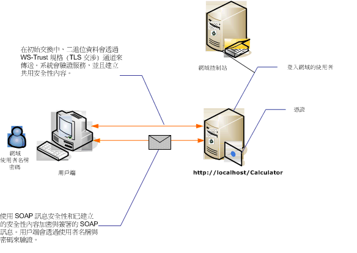

# <a name="message-security-with-a-user-name-client"></a>使用者名稱用戶端的訊息安全性
下圖顯示 Windows Communication Foundation (WCF) 服務和用戶端使用訊息層級安全性保護。 服務會使用 X.509 憑證來進行驗證。 用戶端會使用使用者名稱與密碼來進行驗證。  
  
 範例應用程式，請參閱[訊息安全性使用者名稱](../../../../docs/framework/wcf/samples/message-security-user-name.md)。  
  
   
  
|特性|描述|  
|--------------------|-----------------|  
|安全性模式|訊息|  
|互通性|Windows Communication Foundation (WCF) 只|  
|驗證 (伺服器)|初始交涉需要伺服器驗證|  
|驗證 (用戶端)|使用者名稱/密碼|  
|完整性|是，使用共用安全性內容|  
|機密性|是，使用共用安全性內容|  
|Transport|HTTP|  
|繫結|<xref:System.ServiceModel.WSHttpBinding>|  
  
## <a name="service"></a>服務  
 下列程式碼和組態要獨立執行。 執行下列任一步驟：  
  
-   使用不含組態的程式碼建立獨立服務。  
  
-   使用提供的組態建立服務，但不要定義任何端點。  
  
### <a name="code"></a>程式碼  
 下列程式碼會顯示如何建立會使用訊息安全性的服務端點。  
  
 [!code-csharp[C_SecurityScenarios#9](../../../../samples/snippets/csharp/VS_Snippets_CFX/c_securityscenarios/cs/source.cs#9)]
 [!code-vb[C_SecurityScenarios#9](../../../../samples/snippets/visualbasic/VS_Snippets_CFX/c_securityscenarios/vb/source.vb#9)]  
  
### <a name="configuration"></a>組態  
 可使用下列組態來取代程式碼：  
  
```xml  
<?xml version="1.0" encoding="utf-8"?>  
<configuration>  
  <system.serviceModel>  
    <behaviors>  
      <serviceBehaviors>  
        <behavior name="ServiceCredentialsBehavior">  
          <serviceCredentials>  
            <serviceCertificate findValue="Contoso.com"   
                                storeLocation="LocalMachine"  
                                storeName="My"     
                                x509FindType="FindBySubjectName" />  
          </serviceCredentials>  
        </behavior>  
      </serviceBehaviors>  
    </behaviors>  
    <services>  
      <service behaviorConfiguration="ServiceCredentialsBehavior"  
               name="ServiceModel.Calculator">  
        <endpoint address="http://localhost/Calculator"  
                  binding="wsHttpBinding"  
                  bindingConfiguration="MessageAndUserName"  
                  name="SecuredByTransportEndpoint"  
                  contract="ServiceModel.ICalculator" />  
      </service>  
    </services>  
    <bindings>  
      <wsHttpBinding>  
        <binding name="MessageAndUserName">  
          <security mode="Message">              
            <message clientCredentialType="UserName" />  
          </security>  
        </binding>  
      </wsHttpBinding>  
    </bindings>  
    <client />  
  </system.serviceModel>  
</configuration>  
```  
  
## <a name="client"></a>用戶端  
  
### <a name="code"></a>程式碼  
 下列程式碼會建立用戶端。 繫結會使用訊息模式安全性，而且用戶端認證類型設為 `UserName`。 使用者名稱和密碼只能使用程式碼 (它是不可設定的) 來指定。 在此不示範傳回使用者名稱與密碼的程式碼，因為必須在應用程式層級才能完成這個動作。 例如，使用 [Windows 表單] 對話方塊查詢使用者的資料。  
  
 [!code-csharp[C_SecurityScenarios#16](../../../../samples/snippets/csharp/VS_Snippets_CFX/c_securityscenarios/cs/source.cs#16)]
 [!code-vb[C_SecurityScenarios#16](../../../../samples/snippets/visualbasic/VS_Snippets_CFX/c_securityscenarios/vb/source.vb#16)]  
  
### <a name="configuration"></a>組態  
 下列程式碼會設定用戶端。 繫結會使用訊息模式安全性，而且用戶端認證類型設為 `UserName`。 使用者名稱和密碼只能使用程式碼 (它是不可設定的) 來指定。  
  
```xml  
<?xml version="1.0" encoding="utf-8"?>  
<configuration>  
  <system.serviceModel>  
    <bindings>  
      <wsHttpBinding>  
        <binding name="WSHttpBinding_ICalculator" >  
          <security mode="Message">  
            <message clientCredentialType="UserName" />  
          </security>  
        </binding>  
      </wsHttpBinding>  
    </bindings>  
    <client>  
      <endpoint address="http://machineName/Calculator"   
                binding="wsHttpBinding"  
                bindingConfiguration="WSHttpBinding_ICalculator"   
                contract="ICalculator"  
                name="WSHttpBinding_ICalculator">  
        <identity>  
          <dns value ="Contoso.com" />  
        </identity>  
      </endpoint>  
    </client>  
  </system.serviceModel>  
</configuration>  
```  
  
## <a name="see-also"></a>另請參閱
- [安全性概觀](../../../../docs/framework/wcf/feature-details/security-overview.md)
- [訊息安全性使用者名稱](../../../../docs/framework/wcf/samples/message-security-user-name.md)
- [服務身分識別和驗證](../../../../docs/framework/wcf/feature-details/service-identity-and-authentication.md)
- [\<identity>](../../../../docs/framework/configure-apps/file-schema/wcf/identity.md)
- [Windows Server App Fabric 的安全性模型](https://go.microsoft.com/fwlink/?LinkID=201279&clcid=0x409)
