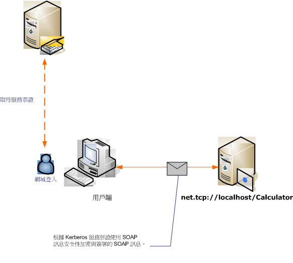

# <a name="message-security-with-a-windows-client-without-credential-negotiation"></a>未使用認證交涉的 Windows 用戶端訊息安全性
下列案例會顯示 Windows Communication Foundation (WCF) 用戶端與服務保護的 Kerberos 通訊協定。  
  
 服務和用戶端都是在相同的網域或受信任網域中。  
  
> [!NOTE]
>  此案例之間的差異和[訊息安全性的 Windows 用戶端](../../../../docs/framework/wcf/feature-details/message-security-with-a-windows-client.md)是這種情況下未交涉服務認證，再傳送應用程式訊息的服務。 此外，因為這必須使用 Kerberos 通訊協定，所以此案例還需要 Windows 網域環境。  
  
   
  
|特性|描述|  
|--------------------|-----------------|  
|安全性模式|訊息|  
|互通性|具備此特性，有 WS-Security 搭配 Kerberos 權杖設定檔相容的用戶端|  
|驗證 (伺服器)|交互驗證伺服器和用戶端|  
|驗證 (用戶端)|交互驗證伺服器和用戶端|  
|完整性|是|  
|機密性|是|  
|Transport|HTTP|  
|繫結|<xref:System.ServiceModel.WSHttpBinding>|  
  
## <a name="service"></a>服務  
 下列程式碼和組態要獨立執行。 執行下列任一步驟：  
  
-   使用不含組態的程式碼建立獨立服務。  
  
-   使用提供的組態建立服務，但不要定義任何端點。  
  
### <a name="code"></a>程式碼  
 下列程式碼會建立使用訊息安全性的服務端點。 程式碼會停用服務認證交涉以及安全性內容權杖 (SCT) 的建立。  
  
> [!NOTE]
>  若要在沒有交涉的情況下使用 Windows 認證類型，服務的使用者帳戶必須可以存取已在 Active Directory 網域中註冊的服務主要名稱 (SPN)。 執行這項作業的方法有兩種：  
  
1.  使用 `NetworkService` 或 `LocalSystem` 帳戶來執行服務。 WCF 因為那些帳戶存取的電腦會在電腦加入 Active Directory 網域時所建立的 SPN，會自動產生服務的中繼資料 （Web 服務描述中適當的 SPN 項目內的服務端點語言或 WSDL）。  
  
2.  使用任意的 Active Directory 網域帳戶來執行服務。 在這種情況下，您必須建立該網域帳戶的 SPN。 使用 Setspn.exe 公用程式工具來建立，是其中一種方法。 一旦建立 SPN 的服務帳戶，設定以將該 SPN 發行至服務的用戶端，透過它的中繼資料 (WSDL) 的 WCF。 不論是透過應用程式組態檔或程式碼，都可以設定公開端點的端點身分識別來完成此作業。 下列範例會以程式設計方式發行身分識別。  
  
 Spn 的詳細資訊、 Kerberos 通訊協定和 Active Directory 的內容，請參閱[補充 Windows 的 Kerberos 技術](http://go.microsoft.com/fwlink/?LinkId=88330)。 如需端點的身分識別的詳細資訊，請參閱[SecurityBindingElement 驗證模式](../../../../docs/framework/wcf/feature-details/securitybindingelement-authentication-modes.md)。  
  
 [!code-csharp[C_SecurityScenarios#12](../../../../samples/snippets/csharp/VS_Snippets_CFX/c_securityscenarios/cs/source.cs#12)]
 [!code-vb[C_SecurityScenarios#12](../../../../samples/snippets/visualbasic/VS_Snippets_CFX/c_securityscenarios/vb/source.vb#12)]  
  
### <a name="configuration"></a>組態  
 可以使用以下組態來取代程式碼。  
  
```xml  
<?xml version="1.0" encoding="utf-8"?>  
<configuration>  
  <system.serviceModel>  
    <behaviors />  
    <services>  
      <service behaviorConfiguration="" name="ServiceModel.Calculator">  
        <endpoint address="http://localhost/Calculator"   
                  binding="wsHttpBinding"  
                  bindingConfiguration="KerberosBinding"  
                  name="WSHttpBinding_ICalculator"  
                  contract="ServiceModel.ICalculator"   
                  listenUri="net.tcp://localhost/metadata" >  
         <identity>  
            <servicePrincipalName value="service_spn_name" />  
         </identity>  
        </endpoint>  
      </service>  
    </services>  
    <bindings>  
      <wsHttpBinding>  
        <binding name="KerberosBinding">  
          <security>  
            <message negotiateServiceCredential="false"   
                     establishSecurityContext="false" />  
          </security>  
        </binding>  
      </wsHttpBinding>  
    </bindings>  
    <client />  
  </system.serviceModel>  
</configuration>  
```  
  
## <a name="client"></a>用戶端  
 下列程式碼和組態要獨立執行。 執行下列任一步驟：  
  
-   使用此程式碼 (和用戶端程式碼) 建立獨立用戶端。  
  
-   建立未定義任何端點位址的用戶端， 然後改用可接受組態名稱當做引數的用戶端建構函式。 例如：  
  
     [!code-csharp[C_SecurityScenarios#0](../../../../samples/snippets/csharp/VS_Snippets_CFX/c_securityscenarios/cs/source.cs#0)]
     [!code-vb[C_SecurityScenarios#0](../../../../samples/snippets/visualbasic/VS_Snippets_CFX/c_securityscenarios/vb/source.vb#0)]  
  
### <a name="code"></a>程式碼  
 下列程式碼會設定用戶端。 安全性模式設定為 Message，而用戶端認證類型設定為 Windows。 請注意，<xref:System.ServiceModel.MessageSecurityOverHttp.NegotiateServiceCredential%2A> 和 <xref:System.ServiceModel.NonDualMessageSecurityOverHttp.EstablishSecurityContext%2A> 屬性會設定為 `false`。  
  
> [!NOTE]
>  若要在沒有交涉的情況下使用 Windows 認證類型，就必須先使用服務的帳戶 SPN 設定用戶端，再開始與服務進行通訊。 用戶端會使用 SPN 取得 Kerberos 權杖，以驗證並保護與服務進行的通訊。 下列範例示範如何使用服務的 SPN 來設定用戶端。 如果您使用[ServiceModel Metadata Utility Tool (Svcutil.exe)](../../../../docs/framework/wcf/servicemodel-metadata-utility-tool-svcutil-exe.md)來產生用戶端，服務的 SPN 會自動傳播至用戶端從服務的中繼資料 (WSDL)，如果服務的中繼資料包含該資訊。 如需如何將服務設定為服務的中繼資料內包含 SPN 的詳細資訊，請參閱本主題稍後的 「 服務 」 一節。  
>   
>  如需有關 Spn、 Kerberos 和 Active Directory 的詳細資訊，請參閱[補充 Windows 的 Kerberos 技術](http://go.microsoft.com/fwlink/?LinkId=88330)。 如需端點的身分識別的詳細資訊，請參閱[SecurityBindingElement 驗證模式](../../../../docs/framework/wcf/feature-details/securitybindingelement-authentication-modes.md)主題。  
  
 [!code-csharp[C_SecurityScenarios#19](../../../../samples/snippets/csharp/VS_Snippets_CFX/c_securityscenarios/cs/source.cs#19)]
 [!code-vb[C_SecurityScenarios#19](../../../../samples/snippets/visualbasic/VS_Snippets_CFX/c_securityscenarios/vb/source.vb#19)]  
  
### <a name="configuration"></a>組態  
 下列程式碼會設定用戶端。 請注意， [ \<servicePrincipalName >](../../../../docs/framework/configure-apps/file-schema/wcf/serviceprincipalname.md)元素必須設定為符合服務的 SPN 註冊在 Active Directory 網域服務的帳戶。  
  
```xml  
<?xml version="1.0" encoding="utf-8"?>  
<configuration>  
  <system.serviceModel>  
    <bindings>  
      <wsHttpBinding>  
        <binding name="WSHttpBinding_ICalculator" >  
          <security mode="Message">  
            <message clientCredentialType="Windows"   
                     negotiateServiceCredential="false"  
                     establishSecurityContext="false" />  
          </security>  
        </binding>  
      </wsHttpBinding>  
    </bindings>  
    <client>  
      <endpoint address="http://localhost/Calculator"   
                binding="wsHttpBinding"  
                bindingConfiguration="WSHttpBinding_ICalculator"  
                contract="ICalculator"  
                name="WSHttpBinding_ICalculator">  
        <identity>  
          <servicePrincipalName value="service_spn_name" />  
        </identity>  
      </endpoint>  
    </client>  
  </system.serviceModel>  
</configuration>  
```  
  
## <a name="see-also"></a>另請參閱  
 [安全性概觀](../../../../docs/framework/wcf/feature-details/security-overview.md)  
 [服務身分識別和驗證](../../../../docs/framework/wcf/feature-details/service-identity-and-authentication.md)  
 [Windows Server App Fabric 的安全性模型](http://go.microsoft.com/fwlink/?LinkID=201279&clcid=0x409)
