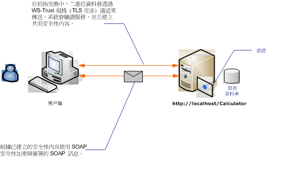

# <a name="message-security-with-an-anonymous-client"></a><span data-ttu-id="b3d5d-102">匿名用戶端的訊息安全性</span><span class="sxs-lookup"><span data-stu-id="b3d5d-102">Message Security with an Anonymous Client</span></span>
<span data-ttu-id="b3d5d-103">下列案例會顯示 [!INCLUDE[indigo1](../../../../includes/indigo1-md.md)] 訊息安全性所保護的用戶端和服務。</span><span class="sxs-lookup"><span data-stu-id="b3d5d-103">The following scenario shows a client and service secured by [!INCLUDE[indigo1](../../../../includes/indigo1-md.md)] message security.</span></span> <span data-ttu-id="b3d5d-104">這樣的設計目的是使用訊息安全性而非傳輸安全性，如此未來可以支援更豐富的宣告型模型。</span><span class="sxs-lookup"><span data-stu-id="b3d5d-104">A design goal is to use message security rather than transport security, so that in the future it can support a richer claims-based model.</span></span> [!INCLUDE[crabout](../../../../includes/crabout-md.md)]<span data-ttu-id="b3d5d-105">使用豐富的宣告進行授權，請參閱[管理宣告和授權的方式識別模型](../../../../docs/framework/wcf/feature-details/managing-claims-and-authorization-with-the-identity-model.md)。</span><span class="sxs-lookup"><span data-stu-id="b3d5d-105"> using rich claims for authorization, see [Managing Claims and Authorization with the Identity Model](../../../../docs/framework/wcf/feature-details/managing-claims-and-authorization-with-the-identity-model.md).</span></span>  
  
 <span data-ttu-id="b3d5d-106">範例應用程式，請參閱[訊息安全性匿名](../../../../docs/framework/wcf/samples/message-security-anonymous.md)。</span><span class="sxs-lookup"><span data-stu-id="b3d5d-106">For a sample application, see [Message Security Anonymous](../../../../docs/framework/wcf/samples/message-security-anonymous.md).</span></span>  
  
 <span data-ttu-id="b3d5d-107"></span><span class="sxs-lookup"><span data-stu-id="b3d5d-107"></span></span>  
  
|<span data-ttu-id="b3d5d-108">特性</span><span class="sxs-lookup"><span data-stu-id="b3d5d-108">Characteristic</span></span>|<span data-ttu-id="b3d5d-109">描述</span><span class="sxs-lookup"><span data-stu-id="b3d5d-109">Description</span></span>|  
|--------------------|-----------------|  
|<span data-ttu-id="b3d5d-110">安全性模式</span><span class="sxs-lookup"><span data-stu-id="b3d5d-110">Security Mode</span></span>|<span data-ttu-id="b3d5d-111">訊息</span><span class="sxs-lookup"><span data-stu-id="b3d5d-111">Message</span></span>|  
|<span data-ttu-id="b3d5d-112">互通性</span><span class="sxs-lookup"><span data-stu-id="b3d5d-112">Interoperability</span></span>|<span data-ttu-id="b3d5d-113">僅限 [!INCLUDE[indigo2](../../../../includes/indigo2-md.md)]</span><span class="sxs-lookup"><span data-stu-id="b3d5d-113">[!INCLUDE[indigo2](../../../../includes/indigo2-md.md)] only</span></span>|  
|<span data-ttu-id="b3d5d-114">驗證 (伺服器)</span><span class="sxs-lookup"><span data-stu-id="b3d5d-114">Authentication (Server)</span></span>|<span data-ttu-id="b3d5d-115">初始交涉需要伺服器驗證，而不需要用戶端驗證</span><span class="sxs-lookup"><span data-stu-id="b3d5d-115">Initial negotiation requires server authentication, but not client authentication</span></span>|  
|<span data-ttu-id="b3d5d-116">驗證 (用戶端)</span><span class="sxs-lookup"><span data-stu-id="b3d5d-116">Authentication (Client)</span></span>|<span data-ttu-id="b3d5d-117">無</span><span class="sxs-lookup"><span data-stu-id="b3d5d-117">None</span></span>|  
|<span data-ttu-id="b3d5d-118">完整性</span><span class="sxs-lookup"><span data-stu-id="b3d5d-118">Integrity</span></span>|<span data-ttu-id="b3d5d-119">是，使用共用安全性內容</span><span class="sxs-lookup"><span data-stu-id="b3d5d-119">Yes, using shared security context</span></span>|  
|<span data-ttu-id="b3d5d-120">機密性</span><span class="sxs-lookup"><span data-stu-id="b3d5d-120">Confidentiality</span></span>|<span data-ttu-id="b3d5d-121">是，使用共用安全性內容</span><span class="sxs-lookup"><span data-stu-id="b3d5d-121">Yes, using shared security context</span></span>|  
|<span data-ttu-id="b3d5d-122">Transport</span><span class="sxs-lookup"><span data-stu-id="b3d5d-122">Transport</span></span>|<span data-ttu-id="b3d5d-123">HTTP</span><span class="sxs-lookup"><span data-stu-id="b3d5d-123">HTTP</span></span>|  
  
## <a name="service"></a><span data-ttu-id="b3d5d-124">服務</span><span class="sxs-lookup"><span data-stu-id="b3d5d-124">Service</span></span>  
 <span data-ttu-id="b3d5d-125">下列程式碼和組態要獨立執行。</span><span class="sxs-lookup"><span data-stu-id="b3d5d-125">The following code and configuration are meant to run independently.</span></span> <span data-ttu-id="b3d5d-126">執行下列任一步驟：</span><span class="sxs-lookup"><span data-stu-id="b3d5d-126">Do one of the following:</span></span>  
  
-   <span data-ttu-id="b3d5d-127">使用不含組態的程式碼建立獨立服務。</span><span class="sxs-lookup"><span data-stu-id="b3d5d-127">Create a stand-alone service using the code with no configuration.</span></span>  
  
-   <span data-ttu-id="b3d5d-128">使用提供的組態建立服務，但不要定義任何端點。</span><span class="sxs-lookup"><span data-stu-id="b3d5d-128">Create a service using the supplied configuration, but do not define any endpoints.</span></span>  
  
### <a name="code"></a><span data-ttu-id="b3d5d-129">程式碼</span><span class="sxs-lookup"><span data-stu-id="b3d5d-129">Code</span></span>  
 <span data-ttu-id="b3d5d-130">下列程式碼會顯示如何建立會使用訊息安全性的服務端點。</span><span class="sxs-lookup"><span data-stu-id="b3d5d-130">The following code shows how to create a service endpoint that uses message security.</span></span>  
  
 [!code-csharp[C_SecurityScenarios#8](../../../../samples/snippets/csharp/VS_Snippets_CFX/c_securityscenarios/cs/source.cs#8)]
 [!code-vb[C_SecurityScenarios#8](../../../../samples/snippets/visualbasic/VS_Snippets_CFX/c_securityscenarios/vb/source.vb#8)]  
  
### <a name="configuration"></a><span data-ttu-id="b3d5d-131">組態</span><span class="sxs-lookup"><span data-stu-id="b3d5d-131">Configuration</span></span>  
 <span data-ttu-id="b3d5d-132">可以使用以下組態來取代程式碼。</span><span class="sxs-lookup"><span data-stu-id="b3d5d-132">The following configuration can be used instead of the code.</span></span> <span data-ttu-id="b3d5d-133">使用服務行為項目來指定用來驗證用戶端服務的憑證。</span><span class="sxs-lookup"><span data-stu-id="b3d5d-133">The service behavior element is used to specify a certificate that is used to authenticate the service to the client.</span></span> <span data-ttu-id="b3d5d-134">服務項目必須使用 `behaviorConfiguration` 屬性來指定行為。</span><span class="sxs-lookup"><span data-stu-id="b3d5d-134">The service element must specify the behavior using the `behaviorConfiguration` attribute.</span></span> <span data-ttu-id="b3d5d-135">繫結項目會指定用戶端認證類型為 `None`，因此可讓匿名用戶端使用服務。</span><span class="sxs-lookup"><span data-stu-id="b3d5d-135">The binding element specifies that the client credential type is `None`, allowing anonymous clients to use the service.</span></span>  
  
```xml  
<?xml version="1.0" encoding="utf-8"?>  
<configuration>  
  <system.serviceModel>  
    <behaviors>  
      <serviceBehaviors>  
        <behavior name="ServiceCredentialsBehavior">  
          <serviceCredentials>  
            <serviceCertificate findValue="contoso.com"   
                                storeLocation="LocalMachine"  
                                storeName="My" />  
          </serviceCredentials>  
        </behavior>  
      </serviceBehaviors>  
    </behaviors>  
    <services>  
      <service behaviorConfiguration="ServiceCredentialsBehavior"   
               name="ServiceModel.Calculator">  
        <endpoint address="http://localhost/Calculator"   
                  binding="wsHttpBinding"  
                  bindingConfiguration="WSHttpBinding_ICalculator"   
                  name="CalculatorService"  
                  contract="ServiceModel.ICalculator" />  
      </service>  
    </services>  
    <bindings>  
      <wsHttpBinding>  
        <binding name="WSHttpBinding_ICalculator" >  
          <security mode="Message">  
            <message clientCredentialType="None" />  
          </security>  
        </binding>  
      </wsHttpBinding>  
    </bindings>  
    <client />  
  </system.serviceModel>  
</configuration>  
```  
  
## <a name="client"></a><span data-ttu-id="b3d5d-136">用戶端</span><span class="sxs-lookup"><span data-stu-id="b3d5d-136">Client</span></span>  
 <span data-ttu-id="b3d5d-137">下列程式碼和組態要獨立執行。</span><span class="sxs-lookup"><span data-stu-id="b3d5d-137">The following code and configuration are meant to run independently.</span></span> <span data-ttu-id="b3d5d-138">執行下列任一步驟：</span><span class="sxs-lookup"><span data-stu-id="b3d5d-138">Do one of the following:</span></span>  
  
-   <span data-ttu-id="b3d5d-139">使用此程式碼 (和用戶端程式碼) 建立獨立用戶端。</span><span class="sxs-lookup"><span data-stu-id="b3d5d-139">Create a stand-alone client using the code (and client code).</span></span>  
  
-   <span data-ttu-id="b3d5d-140">建立未定義任何端點位址的用戶端，</span><span class="sxs-lookup"><span data-stu-id="b3d5d-140">Create a client that does not define any endpoint addresses.</span></span> <span data-ttu-id="b3d5d-141">然後改用可接受組態名稱當做引數的用戶端建構函式。</span><span class="sxs-lookup"><span data-stu-id="b3d5d-141">Instead, use the client constructor that takes the configuration name as an argument.</span></span> <span data-ttu-id="b3d5d-142">例如：</span><span class="sxs-lookup"><span data-stu-id="b3d5d-142">For example:</span></span>  
  
     [!code-csharp[C_SecurityScenarios#0](../../../../samples/snippets/csharp/VS_Snippets_CFX/c_securityscenarios/cs/source.cs#0)]
     [!code-vb[C_SecurityScenarios#0](../../../../samples/snippets/visualbasic/VS_Snippets_CFX/c_securityscenarios/vb/source.vb#0)]  
  
### <a name="code"></a><span data-ttu-id="b3d5d-143">程式碼</span><span class="sxs-lookup"><span data-stu-id="b3d5d-143">Code</span></span>  
 <span data-ttu-id="b3d5d-144">下列程式碼會建立用戶端的執行個體。</span><span class="sxs-lookup"><span data-stu-id="b3d5d-144">The following code creates an instance of the client.</span></span> <span data-ttu-id="b3d5d-145">繫結會使用訊息模式安全性，而且用戶端認證類型設為 none。</span><span class="sxs-lookup"><span data-stu-id="b3d5d-145">The binding uses message mode security, and the client credential type is set to none.</span></span>  
  
 [!code-csharp[C_SecurityScenarios#15](../../../../samples/snippets/csharp/VS_Snippets_CFX/c_securityscenarios/cs/source.cs#15)]
 [!code-vb[C_SecurityScenarios#15](../../../../samples/snippets/visualbasic/VS_Snippets_CFX/c_securityscenarios/vb/source.vb#15)]  
  
### <a name="configuration"></a><span data-ttu-id="b3d5d-146">組態</span><span class="sxs-lookup"><span data-stu-id="b3d5d-146">Configuration</span></span>  
 <span data-ttu-id="b3d5d-147">下列程式碼會設定用戶端。</span><span class="sxs-lookup"><span data-stu-id="b3d5d-147">The following code configures the client.</span></span>  
  
```xml  
<?xml version="1.0" encoding="utf-8"?>  
<configuration>  
  <system.serviceModel>  
    <bindings>  
      <wsHttpBinding>  
        <binding name="WSHttpBinding_ICalculator" >  
          <security mode="Message">  
            <message clientCredentialType="None" />  
          </security>  
        </binding>  
      </wsHttpBinding>  
    </bindings>  
    <client>  
      <endpoint address="http://machineName/Calculator"  
        binding="wsHttpBinding"  
        bindingConfiguration="WSHttpBinding_ICalculator"   
        contract="ICalculator"  
        name="WSHttpBinding_ICalculator">  
        <identity>  
          <dns value="contoso.com" />  
        </identity>  
      </endpoint>  
    </client>  
  </system.serviceModel>  
</configuration>  
```  
  
## <a name="see-also"></a><span data-ttu-id="b3d5d-148">另請參閱</span><span class="sxs-lookup"><span data-stu-id="b3d5d-148">See Also</span></span>  
 [<span data-ttu-id="b3d5d-149">安全性概觀</span><span class="sxs-lookup"><span data-stu-id="b3d5d-149">Security Overview</span></span>](../../../../docs/framework/wcf/feature-details/security-overview.md)  
 [<span data-ttu-id="b3d5d-150">分散式應用程式安全性</span><span class="sxs-lookup"><span data-stu-id="b3d5d-150">Distributed Application Security</span></span>](../../../../docs/framework/wcf/feature-details/distributed-application-security.md)  
 [<span data-ttu-id="b3d5d-151">訊息安全性匿名</span><span class="sxs-lookup"><span data-stu-id="b3d5d-151">Message Security Anonymous</span></span>](../../../../docs/framework/wcf/samples/message-security-anonymous.md)  
 [<span data-ttu-id="b3d5d-152">服務身分識別和驗證</span><span class="sxs-lookup"><span data-stu-id="b3d5d-152">Service Identity and Authentication</span></span>](../../../../docs/framework/wcf/feature-details/service-identity-and-authentication.md)  
 [<span data-ttu-id="b3d5d-153">Windows Server App Fabric 的安全性模型</span><span class="sxs-lookup"><span data-stu-id="b3d5d-153">Security Model for Windows Server App Fabric</span></span>](http://go.microsoft.com/fwlink/?LinkID=201279&clcid=0x409)
