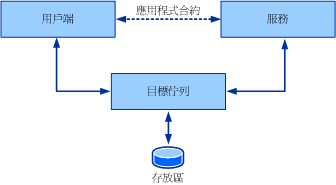
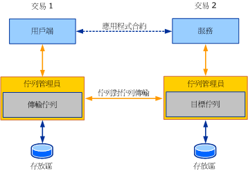

# 佇列概觀Queues Overview
本節將介紹已佇列通訊背後的一般和核心概念。This section introduces the general and core concepts behind queued communication. 後續各節討論有關此處所述的佇列概念會列印文件的顯示，請在 Windows Communication Foundation (WCF) 的詳細資料。Subsequent sections go into details about how the queuing concepts described here are manifested in Windows Communication Foundation (WCF).  
  
## 基本佇列概念Basic Queuing Concepts  
 當設計分散式應用程式時，為服務和用戶端之間的通訊選擇正確的傳輸是很重要的。When designing a distributed application, choosing the right transport for communication between services and clients is important. 有數個因素會影響所使用的傳輸種類。Several factors affect the kind of transport to use. 服務、用戶端和傳輸之間的隔離是一個重要的因素，它會決定要使用佇列傳輸或直接傳輸，例如 TCP 或 HTTP。One important factor—isolation between the service, the client, and the transport—determines use of a queued transport or a direct transport, such as TCP or HTTP. 由於直接傳輸 (例如 TCP 和 HTTP) 的性質之故，如果服務或用戶端停止運作或網路失敗，通訊也會一起停止。Due to the nature of direct transports such as TCP and HTTP, communication stops altogether if the service or the client stop functioning or if the network fails. 服務、用戶端和網路必須同時執行，應用程式才能運作。The service, the client, and the network must be running at the same time for the application to work. 已佇列之傳輸提供隔離，意指如果服務或用戶端失敗或它們之間的通訊連結失敗，用戶端和服務可以繼續運作。Queued transports provide isolation, which means that if the service or client fail or if communication links between them fail, the client and service can continue to function.  
  
 即使通訊方或網路失敗，佇列仍會提供可靠的通訊。Queues provide reliable communication even with failures in the communicating parties or the network. 佇列會擷取及傳遞在通訊方之間交換的訊息。Queues capture and deliver messages exchanged between the communicating parties. 佇列通常是受到某種存放區所支持，它可能是永久性或變動性的。Queues are typically backed by some kind of a store, which can be volatile or durable. 佇列會代表服務儲存來自用戶端的訊息，稍後再將這些訊息轉送至服務。Queues store messages from a client on behalf of a service and later forward these messages to the service. 由於間接佇列為任一方的失敗提供保護隔離，因此讓它成為高度可用的系統和連線中斷的服務慣用的通訊機制。The indirection queues provide ensured isolation of failure by either party, thus making it the preferred communication mechanism for high-availability systems and disconnected services. 間接所伴隨的代價是高延遲時間。The indirection comes with the cost of high latency. *延遲*是用戶端傳送訊息的時間和服務接收它的時間之間的時間延遲。*Latency* is the time delay between the time the client sends a message and the time the service receives it. 這表示訊息一旦送出，您就不知道可能何時才會處理該訊息。This means that once a message is sent, you do not know when that message may be processed. 大部分的佇列應用程式都會處理高延遲時間的問題。Most queued applications cope with high latency. 下圖顯示已佇列通訊的概念模型。The following illustration shows a conceptual model of queued communication.  
  
   
  
 已佇列通訊概念模型Queued communication conceptual model  
  
 事實上，佇列是一種分散式的概念。In reality, the queue is a distributed concept. 因此，它們可以是其中一方的本機或雙方的遠端。As such, they can be local to either party or remote to both parties. 一般來說，佇列對服務來說是本機的。Typically, the queue is local to the service. 在這個組態中，用戶端無法根據與遠端佇列的連線持續取得。In this configuration, the client cannot depend on connectivity to the remote queue to be constantly available. 同樣地，佇列必須與從佇列讀取之服務的可用性無關，才可使用。Similarly, the queue must be available independent of the availability of the service reading from the queue. 佇列管理員會管理佇列的集合。A queue manager manages a collection of queues. 它負責接受從其他佇列管理員傳送至其佇列的訊息。It is responsible for accepting messages sent to its queues from other queue managers. 它也負責管理與遠端佇列的連線，以及將訊息傳輸到這些遠端佇列。It is also responsible for managing connectivity to remote queues and transferring messages to those remote queues. 不論用戶端或服務應用程式是否失敗，為確保佇列的可用性，佇列管理員通常會執行為外部服務。To ensure availability of queues despite client or service application failures, the queue manager is typically run as an external service.  
  
 當用戶端將訊息傳送至佇列時，它會將訊息定址到目標佇列，也就是由服務的佇列管理員所管理的佇列。When a client sends a message to a queue, it addresses the message to the target queue, which is the queue managed by the service's queue manager. 用戶端上的佇列管理員會將訊息傳送至傳輸 (或傳出) 佇列。The queue manager on the client sends the message to a transmission (or outgoing) queue. 傳輸佇列是用戶端佇列管理員上的佇列，其中儲存傳輸至目標佇列的訊息。The transmission queue is a queue on the client queue manager that stores messages for transmission to the target queue. 然後佇列管理員會尋找擁有目標佇列之佇列管理員的路徑，再將訊息傳輸給它。The queue manager then finds a path to the queue manager that owns the target queue and transfers the message to it. 為確保可靠的通訊，佇列管理員會實作可靠的傳輸通訊協定，以防資料遺失。To ensure reliable communication, the queue managers implement a reliable transfer protocol to prevent data loss. 目的佇列管理員會接受定址到其擁有之目標佇列的訊息，並儲存訊息。The destination queue manager accepts messages addressed to the target queues it owns and stores the messages. 服務會要求從目標佇列讀取，然後此時佇列管理員會將訊息傳遞至目的應用程式。The service makes requests to read from the target queue, at which time the queue manager then delivers the message to the destination application. 下圖顯示四方之間的通訊。The following illustration shows communication between the four parties.  
  
   
  
 一般部署案例中的已佇列通訊Queued communication in a typical deployment scenario  
  
 因此，佇列管理員提供所需要的隔離，讓傳送者和接收者可以單獨失敗，而不會影響到實際的通訊。Thus, the queue manager provides the required isolation so that the sender and receiver can independently fail without affecting actual communication. 佇列所提供之額外間接的好處也可讓多個應用程式執行個體從相同的佇列讀取，讓節點中的伺服陣列工作達到更高的輸送量。The benefit of extra indirection that queues provide also enables multiple application instances to read from the same queue, so that farming work among the nodes achieves higher throughput. 因此，使用佇列來達成更大規模和輸送量需求是很常見的。Therefore, it is not uncommon to see queues being used to achieve higher scale and throughput requirements.  
  
## 佇列與交易Queues and Transactions  
 交易允許您組成一組作業，如果一個作業失敗，所有作業都會失敗。Transactions allow you to group a set of operations together so that if one operation fails, all of the operations fail. 下列範例說明如何使用交易，當有人使用 ATM 將 $1,000 從他的存款帳戶轉到他的支票帳戶時，An example of how to use transactions is when a person uses an ATM to transfer $1,000 from his savings account to his checking account. 這需要下列作業：This entails the following operations:  
  
-   從存款帳戶提款 $1,000。Withdrawing $1,000 from the savings account.  
  
-   將 $1,000 存入支票帳戶。Depositing $1,000 into the checking account.  
  
 如果第一個作業成功，並從存款帳戶提款 $1,000，但是第二個作業失敗，則會因為已經從存款帳戶中提出 $1,000，而遺失了 $1,000。If the first operation succeeds and $1,000 is withdrawn from the savings account but the second operation fails, the $1,000 is lost because it has already been withdrawn from the savings account. 為了讓帳戶處於有效狀態，如果其中一個作業失敗，兩個作業都必須失敗。To keep the accounts in a valid state, if one operation fails, both operations must fail.  
  
 在交易訊息中，訊息可以在交易下傳送至佇列以及從佇列接收。In transactional messaging, messages can be sent to the queue and received from the queue under a transaction. 因此，如果在交易中傳送訊息，且交易已回復，則結果就像是訊息從未傳送到佇列過一樣。Thus, if a message is sent in a transaction and the transaction is rolled back, then the outcome is as if the message had never been sent to the queue. 同樣地，如果訊息是在交易中收到，且交易已回復，則結果就像是訊息從未被收到過一樣。Similarly if a message is received in a transaction and the transaction is rolled back, then the outcome is as if the message had never been received. 訊息會保留在佇列中以供讀取。The message remains in the queue to be read.  
  
 由於高延遲時間之故，當您傳送訊息時，您無法得知要花多長的時間才能到達目標佇列，或要花多長的時間才能讓服務處理此訊息。Because of high latency, when you send a message you have no way of knowing how long it takes to reach its target queue, nor do you know how long it takes for the service to process the message. 因此，您不想使用單一交易來傳送訊息、接收訊息然後處理訊息。Because of this, you do not want to use a single transaction to send the message, receive the message, and then process the message. 這會建立不為未定時間量認可的交易。This creates a transaction that is not committed for an indeterminate amount of time. 當用戶端和服務透過使用交易的佇列來通訊時，會包含兩個交易：一個在用戶端上，另一個在服務上。When a client and service communicate through a queue using a transaction, two transactions are involved: one on the client and one on the service. 下圖顯示一般已佇列通訊中的異動界限。The following illustration shows the transaction boundaries in typical queued communication.  
  
   
  
 顯示擷取和傳遞之個別異動的已佇列通訊Queued communication showing separate transactions for capture and delivery  
  
 用戶端交易會處理並傳送訊息。The client transaction processes and sends the message. 當認可交易時，訊息會位於傳輸佇列中。When the transaction is committed, the message is in the transmission queue. 在服務上，交易會從目標佇列讀取訊息、處理訊息，然後認可交易。On the service, the transaction reads the message from the target queue, processes the message, and then commits the transaction. 如果在處理期間發生錯誤，訊息便會復原並放在目標佇列中。If an error occurs during the processing, the message is rolled back and placed in the target queue.  
  
## 使用佇列的非同步通訊Asynchronous Communication Using Queues  
 佇列提供通訊的非同步方式。Queues provide an asynchronous means of communication. 由於佇列管理員引入的高延遲時間之故，因此使用佇列傳送訊息的應用程式無法等待接收者接收及處理訊息。Applications that send messages using queues cannot wait for the message to be received and processed by the receiver because of high latency introduced by the queue manager. 訊息留在佇列中的時間長度可能遠超過應用程式的預期。Messages can remain in the queue for a far longer time than the application intended. 如果要避免這種情況，應用程式可以在訊息上指定「存留時間」值。To avoid this, the application can specify a Time-To-Live value on the message. 這個值會指定訊息應留在傳輸佇列中的時間長度。This value specifies how long the message should remain in the transmission queue. 如果超過這個時間值，訊息仍未傳送給目標佇列，可以將訊息傳輸到寄不出的信件佇列。If this time value is exceeded, and the message still has not been sent to the target queue, the message can be transferred to a dead-letter queue.  
  
 當傳送者傳送訊息時，從傳送作業傳回意指訊息只傳送到傳送者的傳輸佇列。When the sender sends a message, the return from the send operation implies that the message only made it to the transmission queue on the sender. 因此，如果訊息在傳送到目標佇列時失敗，傳送應用程式無法立即得知。As such, if there is a failure in getting the message to the target queue, the sending application cannot know about it immediately. 為記錄這類失敗，會將失敗的訊息傳送到寄不出的信件佇列。To take note of such failures, the failed message is transferred to a dead-letter queue.  
  
 任何錯誤 (例如無法到達目標佇列或存留時間過期的訊息) 都必須分開處理。Any error, such as a message failing to reach the target queue or the Time-To-Live expiring, must be processed separately. 因此，已佇列應用程式撰寫兩套邏輯是很常見的：It is not uncommon, therefore, for queued applications to write two sets of logic:  
  
-   傳送及接收訊息的一般用戶端和服務邏輯。The normal client and service logic of sending and receiving messages.  
  
-   處理來自失敗傳輸或傳遞之訊息的補償邏輯。Compensation logic to handle messages from the failed transmission or delivery.  
  
 下列各節將說明這些概念。The following sections discuss these concepts.  
  
## 寄不出的信件佇列程式設計Dead-Letter Queue Programming  
 寄不出的信件佇列包含因故無法到達目標佇列的訊息。Dead-letter queues contain messages that failed to reach the target queue for various reasons. 原因的範圍可能從訊息過期，到無法將訊息傳送到目標佇列的連線問題。The reasons can range from expired messages to connectivity issues preventing transfer of the message to the target queue.  
  
 一般來說，應用程式可以從整個系統之寄不出的信件佇列讀取訊息，判斷問題所在，然後採取適當的行動，例如更正錯誤並重新傳送訊息或做記錄。Typically, an application can read messages from a system-wide dead-letter queue, determine what went wrong, and take appropriate action, such as correcting the errors and resending the message or taking note of it.  
  
## 有害訊息佇列程式設計Poison Message Queue Programming  
 在訊息到達目標佇列之後，服務可能會重複失敗而無法處理訊息。After a message makes it to the target queue, the service may repeatedly fail to process the message. 例如，在交易下從佇列讀取訊息並更新資料庫的應用程式可能會發現資料庫暫時斷線。For example, an application reading a message from the queue under a transaction and updating a database may find the database temporarily disconnected. 在這種情況下，交易會復原，建立新的交易，然後從佇列重新讀取訊息。In this case, the transaction is rolled back, a new transaction is created, and the message is reread from the queue. 第二次嘗試可能會成功或失敗。A second attempt may succeed or fail. 在某些情況中，訊息可能會重複失敗而無法傳遞至應用程式，這要視錯誤的原因而定。In some cases, depending on the cause of the error, the message may repeatedly fail delivery to the application. 在這種情況下，會將訊息視為「有害」。In this case, the message is deemed as "poison." 此類訊息會移到有害佇列中，可由有害處理的應用程式讀取。Such messages are moved to a poison queue that can be read by a poison-handling application.  
  
## 另請參閱See Also  
 [WCF 中的佇列Queuing in WCF](../../../../docs/framework/wcf/feature-details/queuing-in-wcf.md)  
 [WCF 中的佇列Queuing in WCF](../../../../docs/framework/wcf/feature-details/queuing-in-wcf.md)  
 [工作階段和佇列Sessions and Queues](../../../../docs/framework/wcf/samples/sessions-and-queues.md)  
 [無效信件佇列Dead Letter Queues](../../../../docs/framework/wcf/samples/dead-letter-queues.md)  
 [變動性佇列通訊Volatile Queued Communication](../../../../docs/framework/wcf/samples/volatile-queued-communication.md)  
 [Windows Communication Foundation 至訊息佇列Windows Communication Foundation to Message Queuing](../../../../docs/framework/wcf/samples/wcf-to-message-queuing.md)  
 [安裝訊息佇列 (MSMQ)Installing Message Queuing (MSMQ)](../../../../docs/framework/wcf/samples/installing-message-queuing-msmq.md)  
 [訊息佇列整合繫結範例Message Queuing Integration Binding Samples](https://msdn.microsoft.com/library/997d11cb-f2c5-4ba0-9209-92843d4d0e1a)  
 [訊息佇列至 Windows Communication FoundationMessage Queuing to Windows Communication Foundation](../../../../docs/framework/wcf/samples/message-queuing-to-wcf.md)  
 [訊息佇列上的訊息安全性Message Security over Message Queuing](../../../../docs/framework/wcf/samples/message-security-over-message-queuing.md)
