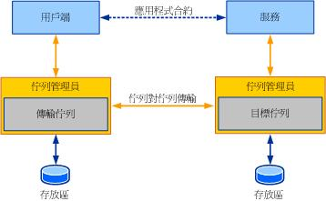

# 服務端點與佇列定址
本主題將討論用戶端如何針對從佇列讀取的服務進行定址，以及服務端點如何對應至佇列。 提醒您下, 圖顯示傳統 Windows Communication Foundation (WCF) 已排入佇列的應用程式部署。  
  
   
  
 當用戶端需要將訊息傳送到服務時，它會針對傳送到目標佇列的訊息加以定址。 為了讓服務讀取來自佇列的訊息，服務會將其接聽位址設為目標佇列。 WCF 中的位址是統一資源識別碼 URI 為基礎而訊息佇列 (MSMQ) 佇列名稱不是 URI 為基礎。 因此，它是必須了解如何解決在使用 WCF MSMQ 中建立的佇列。  
  
## MSMQ 定址  
 MSMQ 使用路徑與格式名稱來識別佇列。 路徑會指定主機名稱與 `QueueName`。 或者，您可以在主機名稱與 `Private$` 之間包含 `QueueName`，來表示尚未於 Active Directory 目錄服務中發行的私用佇列。  
  
 路徑名稱會對應至"FormatNames"以判斷位址，包括路由與佇列管理員傳輸通訊協定的其他層面。 佇列管理員支援兩種傳輸通訊協定：原生 MSMQ 通訊協定與 SOAP Reliable Messaging Protocol (SRMP)。  
  
 如需 MSMQ 路徑與格式名稱的詳細資訊，請參閱[關於訊息佇列](https://go.microsoft.com/fwlink/?LinkId=94837)。  
  
## NetMsmqBinding 與服務定址  
 針對傳送給服務的訊息進行定址時，URI 裡的配置是依據通訊時使用的傳輸所選定的。 WCF 中的每個傳輸的唯一配置。 配置必須反映通訊時使用的傳輸本質。 例如，net.tcp、net.pipe、HTTP 等等。  
  
 MSMQ 佇列傳輸只有在 WCF 會公開 net.msmq 配置。 任何使用 net.msmq 配置來定址的訊息，將透過使用 MSMQ 佇列傳輸通道的 `NetMsmqBinding` 來傳送。  
  
 WCF 中的佇列定址，根據下列模式：  
  
 net.msmq: / / \<*主機名稱*> / [private /] \<*佇列名稱*>  
  
 其中：  
  
-   \<*主機名稱*> 是裝載目標佇列的電腦名稱。  
  
-   [private] 為選擇性項目。 在您針對屬於私用佇列的目標佇列進行定址時，才會用到它。 若要針對公用佇列進行定址，您不可指定私用佇列。 請注意，與 MSMQ 路徑不同不包含"$"中的 WCF URI 形式。  
  
-   \<*佇列名稱*> 是佇列的名稱。 佇列名稱同時也參照到子佇列。 因此， \<*佇列名稱*> = \<*名稱的佇列*> [;*次要 queue 名稱*]。  
  
 範例 1:若要解決的私密佇列 PurchaseOrders abc atadatum.com 電腦所裝載，URI 會是 net.msmq: //abc.adatum.com/private/purchaseorders。  
  
 範例 2:若要解決的公用佇列 AccountsPayable def atadatum.com 電腦所裝載，URI 會是 net.msmq: //def.adatum.com/accountspayable。  
  
 接聽項會使用佇列位址來當成接聽 URI 以讀取訊息。 換句話說，佇列位址等於 TCP 通訊端的接聽連接埠。  
  
 當端點要從佇列中讀取時，必須以先前開啟 ServiceHost 時所指定的相同配置來指定佇列位址。 如需範例，請參閱[Net MSMQ 繫結](../../../../docs/framework/wcf/samples/net-msmq-binding.md)。  
  
### 佇列中多個合約  
 佇列中的訊息可以實作不同的合約。 在此情況下，下列任何一項必須為真，以順利讀取並處理所有訊息：  
  
-   指定可實作所有合約的服務端點。 這是建議的處理方式。  
  
-   指定多個端點使用不同的合約，但是確保所有端點都使用相同的 `NetMsmqBinding` 物件。 ServiceModel 的分派邏輯使用訊息幫浦從分派的傳輸通道中讀取訊息，最後再依據合約將訊息信號分離到不同的端點上。 訊息幫浦會針對接聽 URI/繫結對來建立。 佇列接聽項會使用接聽項位址做為接聽 URI。 讓所有端點都使用相同的繫結物件可確保使用單一訊息幫浦來讀取訊息，並依據合約將訊息信號分離到相關的端點上。  
  
### SRMP 訊息處理  
 如先前所述，您可以使用 SRMP 通訊協定來進行佇列對佇列 (queue-to-queue) 傳輸作業。 當 HTTP 傳輸需要在傳輸佇列與目標佇列之間傳輸訊息時，通常會使用這種方式。  
  
 若要使用 SRMP 傳輸通訊協定，請使用 net.msmq URI 配置 (如先前所述) 針對訊息進行定址，然後在 `QueueTransferProtocol` 的 `NetMsmqBinding` 屬性中指定 SRMP 或安全 SRMP 的選擇。  
  
 指定 `QueueTransferProtocol` 屬性是一種僅限傳送的功能。 用戶端會使用這種方式來表示要使用哪種佇列傳輸通訊協定。  
  
### 使用 Active Directory  
 MSMQ 預設支援 Active Directory 整合。 當 MSMQ 與 Active Directory 整合一併安裝時，電腦必須是 Windows 網域的一部分。 Active Directory 用來發行佇列，以供探索。這類佇列稱為*公用佇列*。 針對佇列進行定址時，可以使用 Active Directory 來解析佇列。 這與使用網域名稱系統 (DNS) 來解析網路名稱 IP 位址有異曲同工之妙。 `UseActiveDirectory` 中的 `NetMsmqBinding` 屬性是一項布林值，可表示佇列通道是否該使用 Active Directory 來解析佇列 URI。 根據預設，此屬性設定為 `false`。 如果 `UseActiveDirectory` 屬性設為 `true`，則佇列通道會使用 Active Directory 將 net.msmq:// URI 轉換為格式名稱。  
  
 只有當用戶端傳送訊息時，`UseActiveDirectory` 屬性才有意義，因為當傳送訊息時，會使用此屬性來解析佇列位址。  
  
### 將 net.msmq URI 對應至訊息佇列格式名稱  
 佇列通道會處理提供給通道的 net.msmq URI 名稱以及 MSMQ 格式名稱之間的對應。 下表摘要說明用來對應彼此關係的規則。  
  
|以 WCF URI 為基礎的佇列位址|使用 Active Directory 屬性|佇列傳輸通訊協定屬性|最後的 MSMQ 格式名稱|  
|----------------------------------|-----------------------------------|--------------------------------------|---------------------------------|  
|Net.msmq://\<machine-name>/private/abc|False (預設)|Native (預設)|DIRECT=OS:machine-name\private$\abc|  
|Net.msmq://\<machine-name>/private/abc|False|SRMP|DIRECT=http://machine/msmq/private$/abc|  
|Net.msmq://\<machine-name>/private/abc|True|原生|PUBLIC=some-guid (佇列的 GUID)|  
  
### 從寄不出的信件佇列或有害訊息佇列讀取訊息  
 若要從屬於目標佇列之子佇列的有害訊息佇列中讀取訊息，請使用子佇列位址來開啟 `ServiceHost`。  
  
 範例：讀取從本機電腦的 PurchaseOrders 私用佇列的有害訊息佇列服務會 //localhost/private/purchaseorders;。  
  
 為了從系統的異動式寄不出的信件佇列讀取訊息，URI 必須採用 net.msmq://localhost/system$;DeadXact 的格式。  
  
 為了從系統的非交易式寄不出的信件佇列讀取訊息，URI 必須採用 net.msmq://localhost/system$;DeadLetter 的格式。  
  
 在使用自訂寄不出的信件佇列時，請注意寄不出的信件佇列必須位於本機電腦上。 因此，寄不出的信件佇列 URI 將限於   
  
 net.msmq: //localhost/ [private /] \<*自訂的寄不出信件-佇列-名稱*>。  
  
 WCF 服務驗證，與其正在接聽的特定佇列完成定址所有收到的訊息。 如果訊息的目的地佇列不符合找到的佇列，則服務將無法處理訊息。 這是負責接聽寄不出的信件佇列的服務必須解決的問題，因為寄不出的信件佇列中任何訊息都是要傳送到其他地方的。 若要從寄不出的信件佇列或有害佇列中讀取訊息，必須使用包含 `ServiceBehavior` 參數的 <xref:System.ServiceModel.AddressFilterMode.Any>。 如需範例，請參閱[寄不出信件佇列](../../../../docs/framework/wcf/samples/dead-letter-queues.md)。  
  
## MsmqIntegrationBinding 與服務定址  
 `MsmqIntegrationBinding` 是用來與傳統 MSMQ 應用程式進行通訊的。 為了簡化與現有的 MSMQ 應用程式的互通，WCF 會支援僅格式名稱定址。 因此，使用此繫結來傳送的訊息必須符合下列 URI 配置：  
  
 msmq.formatname:\<*MSMQ-format-name*>>  
  
 MSMQ 格式名稱為 MSMQ 中指定的格式[關於訊息佇列](https://go.microsoft.com/fwlink/?LinkId=94837)。  
  
 請注意，當您使用 `MsmqIntegrationBinding` 從佇列接收訊息時，只能使用直接格式名稱，與公用與私用格式名稱 (需要 Active Directory 整合)。 然而，我們建議您使用直接格式名稱。 例如，在 [!INCLUDE[wv](../../../../includes/wv-md.md)] 上，使用其他任何格式名稱都會導致錯誤，因為系統會嘗試開啟子佇列，而此子佇列只能由直接格式名稱來開啟。  
  
 當您使用 `MsmqIntegrationBinding` 為 SRMP 定址時，不需要在直接格式名稱中新增 /msmq/ 以協助網際網路資訊服務 (IIS) 進行分派作業。 例如: Abc 使用 SRMP 通訊協定，而不是 DIRECT 佇列進行定址時 =http://adatum.com/msmq/private$/ abc，您應該使用 DIRECT =http://adatum.com/private$/abc。  
  
 請注意，您無法使用包含 `MsmqIntegrationBinding` 的 net.msmq:// 定址。 因為`MsmqIntegrationBinding`支援自由形式 MSMQ 格式名稱定址，您可以使用 WCF 服務使用此繫結至 MSMQ 中使用多點傳送與通訊群組清單功能。 當您使用 `CustomDeadLetterQueue` 時，需指定 `MsmqIntegrationBinding` 則是一個例外。 它必須是 net.msmq:// 的格式，與使用 `NetMsmqBinding` 來指定的方式很類似。  
  
## 另請參閱

- [以 Web 裝載佇列應用程式](../../../../docs/framework/wcf/feature-details/web-hosting-a-queued-application.md)
