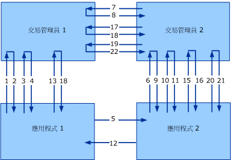

# <a name="transaction-protocols-version-10"></a>異動通訊協定 1.0 版
[!INCLUDE[indigo1](../../../../includes/indigo1-md.md)] 第 1 版實作了 WS-Atomic 交易與 WS-Coordination 通訊協定 1.0 版。 [!INCLUDE[crabout](../../../../includes/crabout-md.md)]版本 1.1，請參閱[交易通訊協定](../../../../docs/framework/wcf/feature-details/transaction-protocols.md)。  
  
|規格/文件|連結|  
|-----------------------------|----------|  
|WS-Coordination|http://msdn.microsoft.com/ws/2005/08/ws-coordination/|  
|WS-AtomicTransaction|http://msdn.microsoft.com/ws/2005/08/ws-atomictransaction/|  
  
 這些通訊協定規格的互通性需要滿足兩個層級：在應用程式之間，以及在交易管理員之間的層級 (請參閱下圖)。 規格詳細描述兩種互通性層級的訊息格式和訊息交換。 對應用程式之間的交換也會如同針對標準應用程式交換一樣，套用特定安全性、可靠性和編碼。 但是，交易管理員之間若要成功地達成互通性，便需要有一致的特定繫結，因為使用者通常不會設定它。  
  
 此主題描述 WS-Atomic 交易 (WS-AT) 安全性規格的組成，並且描述使用在交易管理員之間通訊的安全繫結。 本文件中描述的方法已經使用 WS-AT 和 WS-Coordination 的其他實作成功通過測試，其中包含 IBM、IONA、Sun Microsystems 和其他實作。  
  
 下圖描述兩個異動管理員之間：異動管理員 1 和異動管理員 2，以及兩個應用程式之間：應用程式 1 和應用程式 2 的互通性。  
  
   
  
 使用一個啟動器 (I) 和一個參與者 (P) 考量一般的 WS-Coordination/WS-Atomic Transaction 案例。 啟動器和參與者都有交易管理員 (分別是 ITM 和 PTM)。 在此主題中，兩階段交易認可會稱為 2PC。  
  
|||  
|-|-|  
|1.CreateCoordinationContext|12.應用程式訊息回應|  
|2.CreateCoordinationContextResponse|13.認可 (完成)|  
|3.登錄 (完成)|14.準備 (2PC)|  
|4.RegisterResponse|15.準備 (2PC)|  
|5.應用程式訊息|16.已準備 (2PC)|  
|6.CreateCoordinationContext 搭配內容|17.已準備 (2PC)|  
|7.註冊 (永久性)|18.已認可 (完成)|  
|8.RegisterResponse|19.認可 (2PC)|  
|9.CreateCoordinationContextResponse|20.認可 (2PC)|  
|10.註冊 (永久性)|21.已認可 (2PC)|  
|11.RegisterResponse|22.已認可 (2PC)|  
  
 此文件描述 WS-AtomicTransaction 安全性規格的組成，並且描述使用在交易管理員之間通訊的安全繫結。 本文件中描述的方法已經使用 WS-AT 和 WS-Coordination 的其他實作成功通過測試。  
  
 圖形與表格會從安全性觀點顯示四種訊息類別：  
  
-   啟動訊息 (CreateCoordinationContext 和 CreateCoordinationContextResponse)。  
  
-   登錄訊息 (Register 和 RegisterResponse)  
  
-   通訊協定訊息 (準備、復原、認可和中止等等)。  
  
-   應用程式訊息  
  
 前三個訊息類別會視為交易管理員訊息，並且在此主題稍後的「應用程式訊息交換」中會描述其繫結組態。 第四個訊息類別是應用程式對應用程式訊息，並且在此主題稍後的「訊息範例」一節中會描述。 此章節描述 [!INCLUDE[indigo2](../../../../includes/indigo2-md.md)] 針對每個類別使用的通訊協定繫結。  
  
 下列 XML 命名空間與關聯的前置詞會使用在整份文件中。  
  
|前置詞|命名空間 URI|  
|------------|-------------------|  
|s11|http://schemas.xmlsoap.org/soap/envelope|  
|wsa|http://www.w3.org/2004/08/addressing|  
|wscoor|http://schemas.xmlsoap.org/ws/2004/10/wscoor|  
|wsat|http://schemas.xmlsoap.org/ws/2004/10/wsat|  
|t|http://schemas.xmlsoap.org/ws/2005/02/trust|  
|o|http://docs.oasis-open.org/wss/2004/01/oasis-200401-wss-wssecurity-secext-1.0.xsd|  
|xsd|http://www.w3.org/2001/XMLSchema|  
  
## <a name="transaction-manager-bindings"></a>交易管理員繫結  
 R1001：交易管理員必須使用 SOAP 1.1 和 WS-Addressing 2004/08 以便交換 WS-Atomic 交易和 WS-Coordination 訊息。  
  
 應用程式訊息並不限於這些繫結，並且會在稍後描述。  
  
### <a name="transaction-manager-https-binding"></a>交易管理員 HTTPS 繫結  
 交易管理員 HTTPS 繫結僅依賴傳輸安全性來達到安全性，並且在交易樹狀結構中的每個傳送者與接收者組之間建立信任。  
  
#### <a name="https-transport-configuration"></a>HTTPS 傳輸組態  
 X.509 憑證會用來建立交易管理員身分識別。 需要用戶端/伺服器驗證，而用戶端/伺服器授權則留待實作詳細資料中說明：  
  
-   R1111：透過網路提供的 X.509 憑證必須有符合起始電腦之完整網域名稱 (FQDN) 的主體名稱。  
  
-   B1112：在系統中每個傳送者與接收者組之間的 DNS 都必須正常運作，X.509 主體名稱檢查才會成功。  
  
#### <a name="activation-and-registration-binding-configuration"></a>啟動和登錄繫結組態  
 [!INCLUDE[indigo2](../../../../includes/indigo2-md.md)] 需要要求/回覆在 HTTPS 上有相互關聯的雙向繫結  (如需有關相互關聯與要求/回覆訊息交換模式描述的詳細資訊，請參閱第 8 節的「WS-Atomic 交易」)。  
  
#### <a name="2pc-protocol-binding-configuration"></a>2PC 通訊協定繫結組態  
 [!INCLUDE[indigo2](../../../../includes/indigo2-md.md)] 支援 HTTPS 上的單向 (資料包) 訊息。 訊息間的相互關聯則留待實作詳細資料中說明。  
  
 B2131: 實作必須支援`wsa:ReferenceParameters`如所述以達到相互關聯的 WS 定址[!INCLUDE[indigo2](../../../../includes/indigo2-md.md)]的 2PC 訊息。  
  
### <a name="transaction-manager-mixed-security-binding"></a>交易管理員混合安全性繫結  
 這是替代 （混合模式） 繫結該使用傳輸安全性和 Ws-coordination 發行權杖模型針對識別建立目的。  啟動與登錄是兩個繫結之間唯一不同的項目。  
  
#### <a name="https-transport-configuration"></a>HTTPS 傳輸組態  
 X.509 憑證會用來建立交易管理員身分識別。 需要用戶端/伺服器驗證，而用戶端/伺服器授權則留待實作詳細資料中說明。  
  
#### <a name="activation-message-binding-configuration"></a>啟動訊息繫結組態  
 啟動訊息通常不會參與互通性，因為啟動訊息一般會發生在應用程式與其本機異動管理員之間。  
  
 B1221:[!INCLUDE[indigo2](../../../../includes/indigo2-md.md)]使用雙工的 HTTPS 繫結 (述[傳訊通訊協定](../../../../docs/framework/wcf/feature-details/messaging-protocols.md)) 的啟動訊息。 要求與回覆訊息會使用 WS-Addressing 2004/08 來相互關聯。  
  
 第 8 節的 WS-Atomic 交易規格進一步描述有關相互關聯與訊息交換模式的詳細資料。  
  
-   R1222：在接收到 `CreateCoordinationContext` 後，協調器必須使用關聯的密碼 `SecurityContextToken` 發行 `STx`。 在符合 WS-Trust 規格的 `t:IssuedTokens` 標頭中會傳回這個權杖。  
  
-   R1223：如果啟動發生在現有的協調內容中，則使用與現有內容關聯之 `t:IssuedTokens` 的 `SecurityContextToken` 標頭就必須在 `CreateCoordinationContext` 訊息上流通。  
  
 新`t:IssuedTokens`應產生標頭附加至傳出`wscoor:CreateCoordinationContextResponse`訊息。  
  
#### <a name="registration-message-binding-configuration"></a>登錄訊息繫結組態  
 B1231:[!INCLUDE[indigo2](../../../../includes/indigo2-md.md)]使用雙工的 HTTPS 繫結 (述[傳訊通訊協定](../../../../docs/framework/wcf/feature-details/messaging-protocols.md))。 要求與回覆訊息會使用 WS-Addressing 2004/08 來相互關聯。  
  
 第 8 節的 WS-AtomicTransaction 進一步描述有關相互關聯與訊息交換模式描述的詳細資料。  
  
 R1232： 傳出`wscoor:Register`訊息必須使用`IssuedTokenOverTransport`驗證模式中所述[安全性通訊協定](../../../../docs/framework/wcf/feature-details/security-protocols.md)。  
  
 `wsse:Timestamp`項目必須使用簽署`SecurityContextToken``STx`發出。 這個簽章是證明與特定異動關聯之權杖的所有權，並且用來驗證異動中登錄的參與者。 RegistrationResponse 訊息會透過 HTTPS 傳回。  
  
#### <a name="2pc-protocol-binding-configuration"></a>2PC 通訊協定繫結組態  
 [!INCLUDE[indigo2](../../../../includes/indigo2-md.md)] 支援 HTTPS 上的單向 (資料包) 訊息。 訊息間的相互關聯則留待實作詳細資料中說明。  
  
 B2131: 實作必須支援`wsa:ReferenceParameters`如所述以達到相互關聯的 WS 定址[!INCLUDE[indigo2](../../../../includes/indigo2-md.md)]的 2PC 訊息。  
  
## <a name="application-message-exchange"></a>應用程式訊息交換  
 應用程式可以隨意使用應用程式之間訊息的任何特定繫結，只要繫結符合下列安全性需求：  
  
-   R2001：應用程式之間的訊息必須將 `t:IssuedTokens` 標頭與訊息標頭中的 `CoordinationContext` 一起流通。  
  
-   R2002：必須提供 `t:IssuedToken` 的完整性與機密性。  
  
 `CoordinationContext` 標頭包含 `wscoor:Identifier`。 當 `xsd:AnyURI` 的定義允許同時使用絕對與相對 URI 時，[!INCLUDE[indigo2](../../../../includes/indigo2-md.md)] 只支援絕對 URI 的 `wscoor:Identifiers`。  
  
 如果 `wscoor:Identifier` 的 `wscoor:CoordinationContext` 是相對 URI，交易式 [!INCLUDE[indigo2](../../../../includes/indigo2-md.md)] 服務將傳回錯誤。  
  
## <a name="message-examples"></a>訊息範例  
  
### <a name="createcoordinationcontext-requestresponse-messages"></a>CreateCoordinationContext 要求/回應訊息  
 下列訊息會遵循要求/回應模式。  
  
#### <a name="createcoordinationcontext"></a>CreateCoordinationContext  
  
```xml  
<s:Envelope>  
  <s:Header>  
    <a:Action>http://.../ws/2004/10/wscoor/CreateCoordinationContext</Action>  
    <a:MessageID>urn:uuid:069f5104-fd88-4264-9f99-60032a82854e</MessageID>  
    <a:ReplyTo>  
      <Address>https://...</a:Address>  
    </a:ReplyTo>  
    <a:To>https://...</a:To>  
    <wsse:Security>  
      <u:Timestamp>  
        <wsu:Created>2005-12-15T23:36:09.921Z</u:Created>  
        <wsu:Expires>2005-12-15T23:41:09.921Z</u:Expires>  
      </u:Timestamp>  
    </wsse:Security>  
  </s:Header>  
  <s:Body xmlns:s="http://schemas.xmlsoap.org/soap/envelope/">  
    <wscoor:CreateCoordinationContext>  
      <wscoor:CoordinationType>...</wscoor:CoordinationType>  
    </wscoor:CreateCoordinationContext>  
  </s:Body>  
</s11:Envelope>  
```  
  
#### <a name="createcoordinationcontextresponse"></a>CreateCoordinationContextResponse  
  
```xml  
<s:Envelope>  
  <!-- Data below is shown in the clear for  
       illustration purposes only. -->  
  <s:Header>  
    <a:Action>./ws/2004/10/wscoor/CreateCoordinationContextResponse </a:Action>  
    <a:RelatesTo>urn:uuid:069f5104-fd88-4264-9f99-60032a82854e</a:RelatesTo>  
    <a:To s:mustUnderstand="1">https://... </a:To>  
    <t:IssuedTokens>  
 <wst:RequestSecurityTokenResponse     
    xmlns:wsse="http://docs.oasis-open.org/wss/2004/01/oasis-200401-wss-wssecurity-secext-1.0.xsd"  
    xmlns:wssu="http://docs.oasis-open.org/wss/2004/01/oasis-200401-wss-wssecurity-utility-1.0.xsd"   
    xmlns:wst="http://schemas.xmlsoap.org/ws/2005/02/trust"  
    xmlns:wsc="http://schemas.xmlsoap.org/ws/2005/02/sc"  
    xmlns:wsp="http://schemas.xmlsoap.org/ws/2004/09/policy">  
    <wst:TokenType>http://schemas.xmlsoap.org/ws/2005/02/sc/sct</wst:TokenType>  
    <wst:RequestedSecurityToken>  
      <wsc:SecurityContextToken>  
        <wssu:Identifier>  
          http://fabrikam123.com/SCTi  
        </wssu:Identifier>  
      </wsc:SecurityContextToken>   
    </wst:RequestedSecurityToken>  
    <wsp:AppliesTo>  
        http://fabrikam123.com/CCi  
    </wsp:AppliesTo>    
    <wst:RequestedAttachedReference>  
      <wsse:SecurityTokenReference >  
        <wsse:Reference   
           ValueType="http://schemas.xmlsoap.org/ws/2005/02/sc/sct"  
           URI="http://fabrikam123.com/SCTi"/>  
      </wsse:SecurityTokenReference>  
    </wst:RequestedAttachedReference>  
    <wst:RequestedUnattachedReference>  
      <wsse:SecurityTokenReference>  
        <wsse:Reference   
          ValueType="http://schemas.xmlsoap.org/ws/2005/02/sc/sct"  
          URI="http://fabrikam123.com/SCTi"/>  
      </wsse:SecurityTokenReference>  
    </wst:RequestedUnattachedReference>  
    <wst:RequestedProofToken>  
      <wst:BinarySecret   
        Type="http://schemas.xmlsoap.org/ws/2005/02/trust/SymmetricKey">  
        <!-- base64 encoded value -->  
      </wst:BinarySecret>  
    </wst:RequestedProofToken>  
    <wst:Lifetime>  
      <wssu:Created>2005-10-24T20:19:26.526Z</wssu:Created>  
      <wssu:Expires>2005-10-25T06:24:26.526Z</wssu:Expires>  
    </wst:Lifetime>  
    <wst:KeySize>256</wst:KeySize>  
</wst:RequestSecurityTokenResponse>  
    </t:IssuedTokens>  
    <o:Security xmlns:o="http://docs.oasis-open.org/wss/2004/01/oasis-200401-wss-wssecurity-secext-1.0.xsd">  
      <u:Timestamp u:Id="_0">  
        <u:Created>2005-12-15T23:36:12.015Z</u:Created>  
        <u:Expires>2005-12-15T23:41:12.015Z</u:Expires>  
      </u:Timestamp>  
    </o:Security>  
  </s:Header>  
  <s:Body>  
    <wscoor:CreateCoordinationContextResponse>  
      <wscoor:CoordinationContext>  
        <wscoor:Identifier>  
     http://fabrikam123.com/CCi  
      </wscoor:Identifier>  
        <wscoor:Expires>...</wscoor:Expires>  
        <wscoor:CoordinationType>...</wscoor:CoordinationType>  
        <wscoor:RegistrationService>  
          <a:Address>https://...</a:Address>  
          <a:ReferenceParameters>  
             ...  
          </a:ReferenceParameters>  
        </wscoor:RegistrationService>  
      </wscoor:CoordinationContext>  
    </wscoor:CreateCoordinationContextResponse>  
  </s:Body>  
</s:Envelope>  
```  
  
### <a name="registration-messages"></a>登錄訊息  
 下列訊息是登錄訊息。  
  
#### <a name="register"></a>登錄  
  
```xml  
<s:Envelope>  
  <s:Header>  
    <a:Action>http://schemas.xmlsoap.org/ws/2004/10/wscoor/Register</a:Action>  
    <a:MessageID>urn:uuid:ed418b86-a75e-4aea-9d4e-a5d0cb5c088e</a:MessageID>  
    <a:ReplyTo>  
      <a:Address>https://...</a:Address>        
    </a:ReplyTo>  
    <a:To>https://...</a:To>  
    <wsse:Security   
      s:mustUnderstand="1"   
      xmlns:wsse="http://docs.oasis-open.org/wss/2004/01/oasis-200401-wss-wssecurity-secext-1.0.xsd"  
      xmlns:wssu="http://docs.oasis-open.org/wss/2004/01/oasis-200401-wss-wssecurity-utility-1.0.xsd">  
      <wssu:Timestamp wssu:Id="_0" >  
        <wssu:Created>2005-12-15T23:36:13.827Z</wssu:Created>  
        <wssu:Expires>2005-12-15T23:41:13.827Z</wssu:Expires>  
      </wssu:Timestamp>  
      <wsc:SecurityContextToken>  
      <wssu:Identifier>  
          http://fabrikam123.com/SCTi  
      </wssu:Identifier>  
      </wsc:SecurityContextToken>  
      <!-- supporting signature over the timestamp -->  
      <wsse:Signature xmlns:ds="http://www.w3.org/2000/09/xmldsig#">  
        <ds:SignedInfo>  
          <ds:CanonicalizationMethod Algorithm="http://www.w3.org/2001/10/xml-exc-c14n#"/>  
          <ds:SignatureMethod Algorithm="http://www.w3.org/2000/09/xmldsig#hmac-sha1"/>  
          <ds:Reference URI="#_0">  
            <ds:Transforms>  
              <ds:Transform Algorithm="http://www.w3.org/2001/10/xml-exc-c14n#"/>  
            </ds:Transforms>  
            <ds:DigestMethod Algorithm="http://www.w3.org/2000/09/xmldsig#sha1"/>  
            <ds:DigestValue>  
              alRzyhjLgoUOYoh8cx4n75eTcUk=  
            </ds:DigestValue>  
          </ds:Reference>  
        </ds:SignedInfo>  
        <ds:SignatureValue>YZYjnVvSOVasAQqQxaaviTSWtqI=</ds:SignatureValue>  
        <ds:KeyInfo>  
          <wsse:SecurityTokenReference  
            xmlns:wsse="http://docs.oasis-open.org/wss/2004/01/oasis-200401-wss-wssecurity-secext-1.0.xsd">  
            <wsse:Reference   
              URI="http://fabrikam123.com/SCTi"/>  
          </wsse:SecurityTokenReference>  
        </ds:KeyInfo>  
      </wsse:Signature>  
    </wsse:Security>  
  </s:Header>  
  <s:Body xmlns:s="http://schemas.xmlsoap.org/soap/envelope/">  
    <wscoor:Register>  
      <wscoor:ProtocolIdentifier>...</wscoor:ProtocolIdentifier>  
      <wscoor:ParticipantProtocolService>  
        <a:Address>https://... </a:Address>  
      </wscoor:ParticipantProtocolService>  
    </wscoor:Register>  
  </s:Body>  
</s:Envelope>  
```  
  
#### <a name="register-response"></a>註冊回應  
  
```xml  
<s:Envelope>  
  <s:Header>  
    <a:Action>  
      http://schemas.xmlsoap.org/ws/2004/10/wscoor/RegisterResponse  
    </a:Action>  
    <a:MessageID>urn:uuid:ed418b86-a75e-4aea-9d4e-a5d0cb5c088d</a:MessageID>  
    <a:RelatesTo>  
      urn:uuid:ed418b86-a75e-4aea-9d4e-a5d0cb5c088e        
    </a:RelatesTo>  
    <a:To>https://...</a:To>  
    <wsse:Security   
      s:mustUnderstand="1"   
      xmlns:wsse="http://docs.oasis-open.org/wss/2004/01/oasis-200401-wss-wssecurity-secext-1.0.xsd"  
      xmlns:wssu="http://docs.oasis-open.org/wss/2004/01/oasis-200401-wss-wssecurity-utility-1.0.xsd">  
      <wssu:Timestamp>  
        <wssu:Created>2005-12-15T23:36:13.827Z</wssu:Created>  
        <wssu:Expires>2005-12-15T23:41:13.827Z</wssu:Expires>  
      </wssu:Timestamp>  
    </wsse:Security>  
  </s:Header>  
  <s:Body xmlns:s="http://schemas.xmlsoap.org/soap/envelope/">  
    <wscoor:RegisterResponse>  
      <wscoor:CoordinatorProtocolService>  
        <a:Address>https://...</a:Address>  
        <a:ReferenceParameters>  
          ...  
        </a:ReferenceParameters>  
      </wscoor:CoordinatorProtocolService>  
    </wscoor:RegisterResponse>  
  </s:Body>  
</s:Envelope>  
```  
  
### <a name="two-phase-commit-protocol-messages"></a>兩階段交易認可通訊協定訊息  
 下列訊息與兩階段交易認可 (2PC) 通訊協定有關。  
  
#### <a name="commit"></a>認可  
  
```xml  
<s:Envelope>  
  <s:Header>  
    <a:Action>http://.../ws/2004/10/wsat/Commit</a:Action>  
    <a:To>https://...</a:To>  
    <wsse:Security   
      s:mustUnderstand="1"   
      xmlns:wsse="http://docs.oasis-open.org/wss/2004/01/oasis-200401-wss-wssecurity-secext-1.0.xsd"  
      xmlns:wssu="http://docs.oasis-open.org/wss/2004/01/oasis-200401-wss-wssecurity-utility-1.0.xsd">  
      <wssu:Timestamp wssu:Id="_0" >  
        <wssu:Created>2005-12-15T23:36:13.827Z</wssu:Created>  
        <wssu:Expires>2005-12-15T23:41:13.827Z</wssu:Expires>  
      </wssu:Timestamp>  
   </wsse:Security>  
  </s:Header>  
  <s:Body xmlns:s="http://schemas.xmlsoap.org/soap/envelope/">  
    <wsat:Commit />  
  </s:Body>  
</s:Envelope>  
```  
  
### <a name="application-messages"></a>應用程式訊息  
 下列訊息是應用程式訊息。  
  
#### <a name="application-message-request"></a>應用程式訊息要求  
  
```xml  
<s:Envelope>  
  <s:Header>  
<!-- Addressing headers, all signed-->  
    <wsse:Security s:mustUnderstand="1">  
      <wssu:Timestamp wssu:Id="timestamp">   
        <wssu:Created>2005-10-25T06:29:18.703Z</wssu:Created>  
        <wssu:Expires>2005-10-25T06:34:18.703Z</wssu:Expires>  
      </wssu:Timestamp>  
      <wsse:BinarySecurityToken   
          wssu:Id="IA_Certificate"   
          ValueType="...#X509v3"   
          EncodingType="...#Base64Binary">  
        <!-- IA certificate -->  
      </wsse:BinarySecurityToken>  
      <e:EncryptedKey Id="encrypted_key">  
            <!-- ephemeral key encrypted for PA certificate -->    
        <e:ReferenceList xmlns:e="http://www.w3.org/2001/04/xmlenc#">  
          <e:DataReference URI="#encrypted_body"/>  
          <e:DataReference URI="#encrypted_CCi"/>  
          <e:DataReference URI="#encrypted_issuedtokens"/>  
        </e:ReferenceList>  
      </e:EncryptedKey>  
      <Signature xmlns="http://www.w3.org/2000/09/xmldsig#">  
        <!-- signature over Addressing headers, Timestamp, and Body -->  
      </Signature>  
    </wsse:Security>  
    <wsse11:EncryptedHeader >  
     <!-- encrypted wscoor:CoordinationContext header containing CCi -->  
    </wsse11:EncryptedHeader>  
    <wsse11:EncryptedHeader   
      <!-- encrypted wst:IssuedTokens header containing SCTi -->  
      <!-- wst:IssuedTokens header is taken verbatim from message #2 above, omitted for brevity -->  
    </wsse11:EncryptedHeader>  
  </s:Header>  
  <s:Body wssu:Id="body">  
    <!-- encrypted content of the Body element of the application message -->      
    <e:EncryptedData Id="encrypted_body"   
           Type="http://www.w3.org/2001/04/xmlenc#Content"   
           xmlns:e="http://www.w3.org/2001/04/xmlenc#">  
...  
    </e:EncryptedData>  
  </s:Body>  
</s:Envelope>  
```
