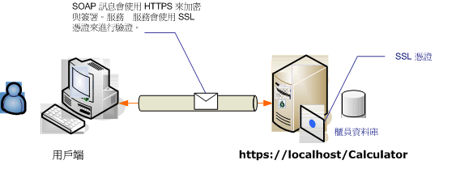

# <a name="transport-security-with-an-anonymous-client"></a><span data-ttu-id="7d0fd-102">匿名用戶端的傳輸安全性</span><span class="sxs-lookup"><span data-stu-id="7d0fd-102">Transport Security with an Anonymous Client</span></span>
<span data-ttu-id="7d0fd-103">此 Windows Communication Foundation (WCF) 案例使用傳輸安全性 (HTTPS) 來確保機密性和完整性。</span><span class="sxs-lookup"><span data-stu-id="7d0fd-103">This Windows Communication Foundation (WCF) scenario uses transport security (HTTPS) to ensure confidentiality and integrity.</span></span> <span data-ttu-id="7d0fd-104">伺服器必須使用安全通訊端層 (SSL) 憑證進行驗證，而且用戶端必須信任該伺服器的憑證。</span><span class="sxs-lookup"><span data-stu-id="7d0fd-104">The server must be authenticated with a Secure Sockets Layer (SSL) certificate, and the clients must trust the server's certificate.</span></span> <span data-ttu-id="7d0fd-105">此用戶端不會透過任何機制進行驗證，因此屬於匿名。</span><span class="sxs-lookup"><span data-stu-id="7d0fd-105">The client is not authenticated by any mechanism and is, therefore, anonymous.</span></span>  
  
 <span data-ttu-id="7d0fd-106">範例應用程式，請參閱[WS 傳輸安全性](../../../../docs/framework/wcf/samples/ws-transport-security.md)。</span><span class="sxs-lookup"><span data-stu-id="7d0fd-106">For a sample application, see [WS Transport Security](../../../../docs/framework/wcf/samples/ws-transport-security.md).</span></span> <span data-ttu-id="7d0fd-107">如需有關傳輸安全性的詳細資訊，請參閱[傳輸安全性概觀](../../../../docs/framework/wcf/feature-details/transport-security-overview.md)。</span><span class="sxs-lookup"><span data-stu-id="7d0fd-107">For more information about transport security, see [Transport Security Overview](../../../../docs/framework/wcf/feature-details/transport-security-overview.md).</span></span>  
  
 <span data-ttu-id="7d0fd-108">如需服務中使用憑證的詳細資訊，請參閱[Working with Certificates](../../../../docs/framework/wcf/feature-details/working-with-certificates.md)並[如何： 使用 SSL 憑證設定連接埠](../../../../docs/framework/wcf/feature-details/how-to-configure-a-port-with-an-ssl-certificate.md)。</span><span class="sxs-lookup"><span data-stu-id="7d0fd-108">For more information about using a certificate with a service, see [Working with Certificates](../../../../docs/framework/wcf/feature-details/working-with-certificates.md) and [How to: Configure a Port with an SSL Certificate](../../../../docs/framework/wcf/feature-details/how-to-configure-a-port-with-an-ssl-certificate.md).</span></span>  
  
 <span data-ttu-id="7d0fd-109"></span><span class="sxs-lookup"><span data-stu-id="7d0fd-109"></span></span>  
  
|<span data-ttu-id="7d0fd-110">特性</span><span class="sxs-lookup"><span data-stu-id="7d0fd-110">Characteristic</span></span>|<span data-ttu-id="7d0fd-111">描述</span><span class="sxs-lookup"><span data-stu-id="7d0fd-111">Description</span></span>|  
|--------------------|-----------------|  
|<span data-ttu-id="7d0fd-112">安全性模式</span><span class="sxs-lookup"><span data-stu-id="7d0fd-112">Security Mode</span></span>|<span data-ttu-id="7d0fd-113">Transport</span><span class="sxs-lookup"><span data-stu-id="7d0fd-113">Transport</span></span>|  
|<span data-ttu-id="7d0fd-114">互通性</span><span class="sxs-lookup"><span data-stu-id="7d0fd-114">Interoperability</span></span>|<span data-ttu-id="7d0fd-115">與現有的 Web 服務和用戶端</span><span class="sxs-lookup"><span data-stu-id="7d0fd-115">With existing Web services and clients</span></span>|  
|<span data-ttu-id="7d0fd-116">驗證 (伺服器)</span><span class="sxs-lookup"><span data-stu-id="7d0fd-116">Authentication (Server)</span></span><br /><br /> <span data-ttu-id="7d0fd-117">驗證 (用戶端)</span><span class="sxs-lookup"><span data-stu-id="7d0fd-117">Authentication (Client)</span></span>|<span data-ttu-id="7d0fd-118">是</span><span class="sxs-lookup"><span data-stu-id="7d0fd-118">Yes</span></span><br /><br /> <span data-ttu-id="7d0fd-119">應用程式層級 （沒有 WCF 支援）</span><span class="sxs-lookup"><span data-stu-id="7d0fd-119">Application level (no WCF support)</span></span>|  
|<span data-ttu-id="7d0fd-120">完整性</span><span class="sxs-lookup"><span data-stu-id="7d0fd-120">Integrity</span></span>|<span data-ttu-id="7d0fd-121">是</span><span class="sxs-lookup"><span data-stu-id="7d0fd-121">Yes</span></span>|  
|<span data-ttu-id="7d0fd-122">機密性</span><span class="sxs-lookup"><span data-stu-id="7d0fd-122">Confidentiality</span></span>|<span data-ttu-id="7d0fd-123">是</span><span class="sxs-lookup"><span data-stu-id="7d0fd-123">Yes</span></span>|  
|<span data-ttu-id="7d0fd-124">Transport</span><span class="sxs-lookup"><span data-stu-id="7d0fd-124">Transport</span></span>|<span data-ttu-id="7d0fd-125">HTTPS</span><span class="sxs-lookup"><span data-stu-id="7d0fd-125">HTTPS</span></span>|  
|<span data-ttu-id="7d0fd-126">繫結</span><span class="sxs-lookup"><span data-stu-id="7d0fd-126">Binding</span></span>|<span data-ttu-id="7d0fd-127"><<!--zz xref:System.ServiceModel.WsHttpBinding --> `xref:System.ServiceModel.WsHttpBinding`></span><span class="sxs-lookup"><span data-stu-id="7d0fd-127"><<!--zz xref:System.ServiceModel.WsHttpBinding --> `xref:System.ServiceModel.WsHttpBinding`></span></span>|  
  
## <a name="service"></a><span data-ttu-id="7d0fd-128">服務</span><span class="sxs-lookup"><span data-stu-id="7d0fd-128">Service</span></span>  
 <span data-ttu-id="7d0fd-129">下列程式碼和組態要獨立執行。</span><span class="sxs-lookup"><span data-stu-id="7d0fd-129">The following code and configuration are meant to run independently.</span></span> <span data-ttu-id="7d0fd-130">執行下列任一步驟：</span><span class="sxs-lookup"><span data-stu-id="7d0fd-130">Do one of the following:</span></span>  
  
-   <span data-ttu-id="7d0fd-131">使用不含組態的程式碼建立獨立服務。</span><span class="sxs-lookup"><span data-stu-id="7d0fd-131">Create a stand-alone service using the code with no configuration.</span></span>  
  
-   <span data-ttu-id="7d0fd-132">使用提供的組態建立服務，但不要定義任何端點。</span><span class="sxs-lookup"><span data-stu-id="7d0fd-132">Create a service using the supplied configuration, but do not define any endpoints.</span></span>  
  
### <a name="code"></a><span data-ttu-id="7d0fd-133">程式碼</span><span class="sxs-lookup"><span data-stu-id="7d0fd-133">Code</span></span>  
 <span data-ttu-id="7d0fd-134">下列程式碼會示範如何建立會使用傳輸安全性的端點：</span><span class="sxs-lookup"><span data-stu-id="7d0fd-134">The following code shows how to create an endpoint using transport security:</span></span>  
  
 [!code-csharp[c_SecurityScenarios#5](../../../../samples/snippets/csharp/VS_Snippets_CFX/c_securityscenarios/cs/source.cs#5)]
 [!code-vb[c_SecurityScenarios#5](../../../../samples/snippets/visualbasic/VS_Snippets_CFX/c_securityscenarios/vb/source.vb#5)]  
  
### <a name="configuration"></a><span data-ttu-id="7d0fd-135">組態</span><span class="sxs-lookup"><span data-stu-id="7d0fd-135">Configuration</span></span>  
 <span data-ttu-id="7d0fd-136">下列程式碼會使用組態設定相同端點。</span><span class="sxs-lookup"><span data-stu-id="7d0fd-136">The following code sets up the same endpoint using configuration.</span></span> <span data-ttu-id="7d0fd-137">此用戶端不會透過任何機制進行驗證，因此屬於匿名。</span><span class="sxs-lookup"><span data-stu-id="7d0fd-137">The client is not authenticated by any mechanism, and is therefore anonymous.</span></span>  
  
```xml  
<?xml version="1.0" encoding="utf-8"?>  
<configuration>  
  <system.serviceModel>  
    <services>  
      <service name="ServiceModel.Calculator">  
        <endpoint address="http://localhost/Calculator"   
                  binding="wsHttpBinding"  
                  bindingConfiguration="WSHttpBinding_ICalculator"   
                  name="SecuredByTransportEndpoint"  
                  contract="ServiceModel.ICalculator" />  
      </service>  
    </services>  
    <bindings>  
      <wsHttpBinding>  
        <binding name="WSHttpBinding_ICalculator">  
          <security mode="Transport">  
            <transport clientCredentialType="None" />  
          </security>  
        </binding>  
      </wsHttpBinding>  
    </bindings>  
    <client />  
  </system.serviceModel>  
</configuration>  
```  
  
## <a name="client"></a><span data-ttu-id="7d0fd-138">用戶端</span><span class="sxs-lookup"><span data-stu-id="7d0fd-138">Client</span></span>  
 <span data-ttu-id="7d0fd-139">下列程式碼和組態要獨立執行。</span><span class="sxs-lookup"><span data-stu-id="7d0fd-139">The following code and configuration are meant to run independently.</span></span> <span data-ttu-id="7d0fd-140">執行下列任一步驟：</span><span class="sxs-lookup"><span data-stu-id="7d0fd-140">Do one of the following:</span></span>  
  
-   <span data-ttu-id="7d0fd-141">使用此程式碼 (和用戶端程式碼) 建立獨立用戶端。</span><span class="sxs-lookup"><span data-stu-id="7d0fd-141">Create a stand-alone client using the code (and client code).</span></span>  
  
-   <span data-ttu-id="7d0fd-142">建立未定義任何端點位址的用戶端，</span><span class="sxs-lookup"><span data-stu-id="7d0fd-142">Create a client that does not define any endpoint addresses.</span></span> <span data-ttu-id="7d0fd-143">然後改用可接受組態名稱當做引數的用戶端建構函式。</span><span class="sxs-lookup"><span data-stu-id="7d0fd-143">Instead, use the client constructor that takes the configuration name as an argument.</span></span> <span data-ttu-id="7d0fd-144">例如：</span><span class="sxs-lookup"><span data-stu-id="7d0fd-144">For example:</span></span>  
  
     [!code-csharp[C_SecurityScenarios#0](../../../../samples/snippets/csharp/VS_Snippets_CFX/c_securityscenarios/cs/source.cs#0)]
     [!code-vb[C_SecurityScenarios#0](../../../../samples/snippets/visualbasic/VS_Snippets_CFX/c_securityscenarios/vb/source.vb#0)]  
  
### <a name="code"></a><span data-ttu-id="7d0fd-145">程式碼</span><span class="sxs-lookup"><span data-stu-id="7d0fd-145">Code</span></span>  
 [!code-csharp[c_SecurityScenarios#6](../../../../samples/snippets/csharp/VS_Snippets_CFX/c_securityscenarios/cs/source.cs#6)]
 [!code-vb[c_SecurityScenarios#6](../../../../samples/snippets/visualbasic/VS_Snippets_CFX/c_securityscenarios/vb/source.vb#6)]  
  
### <a name="configuration"></a><span data-ttu-id="7d0fd-146">組態</span><span class="sxs-lookup"><span data-stu-id="7d0fd-146">Configuration</span></span>  
 <span data-ttu-id="7d0fd-147">可以使用下列組態來取代程式碼，進行設定服務。</span><span class="sxs-lookup"><span data-stu-id="7d0fd-147">The following configuration can be used instead of the code to set up the service.</span></span>  
  
```xml  
<configuration>  
  <system.serviceModel>  
    <bindings>  
      <wsHttpBinding>  
        <binding name="WSHttpBinding_ICalculator" >  
          <security mode="Transport">  
            <transport clientCredentialType="None" />  
          </security>  
        </binding>  
      </wsHttpBinding>  
    </bindings>  
    <client>  
      <endpoint address="https://machineName/Calculator"   
                binding="wsHttpBinding"  
                bindingConfiguration="WSHttpBinding_ICalculator"   
                contract="ICalculator"  
                name="WSHttpBinding_ICalculator" />  
    </client>  
  </system.serviceModel>  
</configuration>  
```  
  
## <a name="see-also"></a><span data-ttu-id="7d0fd-148">另請參閱</span><span class="sxs-lookup"><span data-stu-id="7d0fd-148">See Also</span></span>  
 [<span data-ttu-id="7d0fd-149">安全性概觀</span><span class="sxs-lookup"><span data-stu-id="7d0fd-149">Security Overview</span></span>](../../../../docs/framework/wcf/feature-details/security-overview.md)  
 [<span data-ttu-id="7d0fd-150">WS 傳輸安全性</span><span class="sxs-lookup"><span data-stu-id="7d0fd-150">WS Transport Security</span></span>](../../../../docs/framework/wcf/samples/ws-transport-security.md)  
 [<span data-ttu-id="7d0fd-151">傳輸安全性概觀</span><span class="sxs-lookup"><span data-stu-id="7d0fd-151">Transport Security Overview</span></span>](../../../../docs/framework/wcf/feature-details/transport-security-overview.md)  
 [<span data-ttu-id="7d0fd-152">Windows Server App Fabric 的安全性模型</span><span class="sxs-lookup"><span data-stu-id="7d0fd-152">Security Model for Windows Server App Fabric</span></span>](https://go.microsoft.com/fwlink/?LinkID=201279&clcid=0x409)
