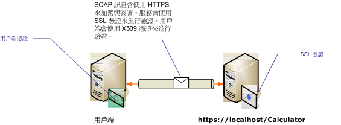

# <a name="transport-security-with-certificate-authentication"></a><span data-ttu-id="959e4-102">憑證驗證的傳輸安全性</span><span class="sxs-lookup"><span data-stu-id="959e4-102">Transport Security with Certificate Authentication</span></span>
<span data-ttu-id="959e4-103">本主題討論使用傳輸安全性時，如何使用 X.509 憑證進行伺服器和用戶端驗證。</span><span class="sxs-lookup"><span data-stu-id="959e4-103">This topic discusses using X.509 certificates for server and client authentication when using transport security.</span></span> <span data-ttu-id="959e4-104">如需 X.509 憑證的詳細資訊，請參閱 [X.509 公用金鑰憑證](https://msdn.microsoft.com/library/bb540819\(VS.85\).aspx)。</span><span class="sxs-lookup"><span data-stu-id="959e4-104">For more information about X.509 certificates see [X.509 Public Key Certificates](https://msdn.microsoft.com/library/bb540819\(VS.85\).aspx).</span></span> <span data-ttu-id="959e4-105">憑證必須由憑證授權單位，通常是憑證的協力廠商簽發者發行。</span><span class="sxs-lookup"><span data-stu-id="959e4-105">Certificates must be issued by a certification authority, which is often a third-party issuer of certificates.</span></span> <span data-ttu-id="959e4-106">在 Windows Server 網域中，可以使用 Active Directory 憑證服務對網域中的用戶端電腦發行憑證。</span><span class="sxs-lookup"><span data-stu-id="959e4-106">On a Windows Server domain, Active Directory Certificate Services can be used to issue certificates to client computers on the domain.</span></span> <span data-ttu-id="959e4-107">如需詳細資訊，請參閱[Windows 2008 R2 憑證服務](https://go.microsoft.com/fwlink/?LinkID=209949&clcid=0x409)。</span><span class="sxs-lookup"><span data-stu-id="959e4-107">For more information see [Windows 2008 R2 Certificate Services](https://go.microsoft.com/fwlink/?LinkID=209949&clcid=0x409).</span></span> <span data-ttu-id="959e4-108">在此案例中，服務是在使用安全通訊端層 (SSL) 設定的 Internet Information Services (IIS) 之下裝載。</span><span class="sxs-lookup"><span data-stu-id="959e4-108">In this scenario, the service is hosted under Internet Information Services (IIS) which is configured with Secure Sockets Layer (SSL).</span></span> <span data-ttu-id="959e4-109">此服務使用 SSL (X.509) 憑證設定，以允許使用者驗證伺服器的身分識別。</span><span class="sxs-lookup"><span data-stu-id="959e4-109">The service is configured with an SSL (X.509) certificate to allow clients to verify the identity of the server.</span></span> <span data-ttu-id="959e4-110">用戶端也使用 X.509 憑證設定，以允許服務驗證用戶端的身分識別。</span><span class="sxs-lookup"><span data-stu-id="959e4-110">The client is also configured with an X.509 certificate that allows the service to verify the identity of the client.</span></span> <span data-ttu-id="959e4-111">伺服器的憑證必須受到用戶端的信任，而用戶端的憑證則必須受到伺服器的信任。</span><span class="sxs-lookup"><span data-stu-id="959e4-111">The server’s certificate must be trusted by the client and the client’s certificate must be trusted by the server.</span></span> <span data-ttu-id="959e4-112">服務和用戶端如何驗證彼此的身分識別的實際機制，不在本主題的範圍之內。</span><span class="sxs-lookup"><span data-stu-id="959e4-112">The actual mechanics of how the service and client verifies each other’s identity is beyond the scope of this topic.</span></span> <span data-ttu-id="959e4-113">如需詳細資訊，請參閱[維基百科上的數位簽章](https://go.microsoft.com/fwlink/?LinkId=253157)。</span><span class="sxs-lookup"><span data-stu-id="959e4-113">For more information see [Digital Signature on Wikipedia](https://go.microsoft.com/fwlink/?LinkId=253157).</span></span>  
  
 <span data-ttu-id="959e4-114">此案例會實作要求/回覆訊息模式，如下列圖表所示。</span><span class="sxs-lookup"><span data-stu-id="959e4-114">This scenario implements a request/reply message pattern as illustrated by the following diagram.</span></span>  
  
 <span data-ttu-id="959e4-115"></span><span class="sxs-lookup"><span data-stu-id="959e4-115"></span></span>  
  
 <span data-ttu-id="959e4-116">如需服務中使用憑證的詳細資訊，請參閱[Working with Certificates](../../../../docs/framework/wcf/feature-details/working-with-certificates.md)並[如何： 使用 SSL 憑證設定連接埠](../../../../docs/framework/wcf/feature-details/how-to-configure-a-port-with-an-ssl-certificate.md)。</span><span class="sxs-lookup"><span data-stu-id="959e4-116">For more information about using a certificate with a service, see [Working with Certificates](../../../../docs/framework/wcf/feature-details/working-with-certificates.md) and [How to: Configure a Port with an SSL Certificate](../../../../docs/framework/wcf/feature-details/how-to-configure-a-port-with-an-ssl-certificate.md).</span></span> <span data-ttu-id="959e4-117">下表描述此案例的各種特性。</span><span class="sxs-lookup"><span data-stu-id="959e4-117">The following table describes the various characteristics of the scenario.</span></span>  
  
|<span data-ttu-id="959e4-118">特性</span><span class="sxs-lookup"><span data-stu-id="959e4-118">Characteristic</span></span>|<span data-ttu-id="959e4-119">描述</span><span class="sxs-lookup"><span data-stu-id="959e4-119">Description</span></span>|  
|--------------------|-----------------|  
|<span data-ttu-id="959e4-120">安全性模式</span><span class="sxs-lookup"><span data-stu-id="959e4-120">Security Mode</span></span>|<span data-ttu-id="959e4-121">Transport</span><span class="sxs-lookup"><span data-stu-id="959e4-121">Transport</span></span>|  
|<span data-ttu-id="959e4-122">互通性</span><span class="sxs-lookup"><span data-stu-id="959e4-122">Interoperability</span></span>|<span data-ttu-id="959e4-123">使用現有 Web 服務用戶端和服務。</span><span class="sxs-lookup"><span data-stu-id="959e4-123">With existing Web service clients and services.</span></span>|  
|<span data-ttu-id="959e4-124">驗證 (伺服器)</span><span class="sxs-lookup"><span data-stu-id="959e4-124">Authentication (Server)</span></span><br /><br /> <span data-ttu-id="959e4-125">驗證 (用戶端)</span><span class="sxs-lookup"><span data-stu-id="959e4-125">Authentication (Client)</span></span>|<span data-ttu-id="959e4-126">是 (使用 SSL 憑證)</span><span class="sxs-lookup"><span data-stu-id="959e4-126">Yes (using an SSL certificate)</span></span><br /><br /> <span data-ttu-id="959e4-127">是 (使用 X.509 憑證)</span><span class="sxs-lookup"><span data-stu-id="959e4-127">Yes (using an X.509 certificate)</span></span>|  
|<span data-ttu-id="959e4-128">資料完整性</span><span class="sxs-lookup"><span data-stu-id="959e4-128">Data Integrity</span></span>|<span data-ttu-id="959e4-129">是</span><span class="sxs-lookup"><span data-stu-id="959e4-129">Yes</span></span>|  
|<span data-ttu-id="959e4-130">資料機密性</span><span class="sxs-lookup"><span data-stu-id="959e4-130">Data Confidentiality</span></span>|<span data-ttu-id="959e4-131">是</span><span class="sxs-lookup"><span data-stu-id="959e4-131">Yes</span></span>|  
|<span data-ttu-id="959e4-132">Transport</span><span class="sxs-lookup"><span data-stu-id="959e4-132">Transport</span></span>|<span data-ttu-id="959e4-133">HTTPS</span><span class="sxs-lookup"><span data-stu-id="959e4-133">HTTPS</span></span>|  
|<span data-ttu-id="959e4-134">繫結</span><span class="sxs-lookup"><span data-stu-id="959e4-134">Binding</span></span>|<xref:System.ServiceModel.WSHttpBinding>|  
  
## <a name="configure-the-service"></a><span data-ttu-id="959e4-135">設定服務</span><span class="sxs-lookup"><span data-stu-id="959e4-135">Configure the Service</span></span>  
 <span data-ttu-id="959e4-136">由於此案例中的服務是在 IIS 之下裝載，因此該服務使用 web.config 檔案設定。</span><span class="sxs-lookup"><span data-stu-id="959e4-136">Since the service in this scenario is hosted under IIS, it is configured with a web.config file.</span></span> <span data-ttu-id="959e4-137">以下的 web.config 示範如何設定 <xref:System.ServiceModel.WSHttpBinding> 使用傳輸安全性和 X.509 用戶端認證。</span><span class="sxs-lookup"><span data-stu-id="959e4-137">The following web.config shows how to configure the <xref:System.ServiceModel.WSHttpBinding> to use transport security and X.509 client credentials.</span></span>  
  
```xml  
<configuration>  
  <system.serviceModel>  
    <protocolMapping>  
      <add scheme="https" binding="wsHttpBinding" />  
    </protocolMapping>  
    <bindings>  
      <wsHttpBinding>  
        <!-- configure wsHttp binding with Transport security mode and clientCredentialType as Certificate -->  
        <binding>  
          <security mode="Transport">  
            <transport clientCredentialType="Certificate"/>              
          </security>  
        </binding>  
      </wsHttpBinding>  
    </bindings>  
    <!--For debugging purposes set the includeExceptionDetailInFaults attribute to true-->  
    <behaviors>  
      <serviceBehaviors>  
        <behavior>            
           <serviceDebug includeExceptionDetailInFaults="True" />  
        </behavior>  
      </serviceBehaviors>  
    </behaviors>  
  </system.serviceModel>  
</configuration>  
```  
  
## <a name="configure-the-client"></a><span data-ttu-id="959e4-138">設定用戶端</span><span class="sxs-lookup"><span data-stu-id="959e4-138">Configure the Client</span></span>  
 <span data-ttu-id="959e4-139">用戶端可以在程式碼或 app.config 檔案中設定。</span><span class="sxs-lookup"><span data-stu-id="959e4-139">The client can be configured in code or in an app.config file.</span></span> <span data-ttu-id="959e4-140">下列範例示範如何在程式碼中設定用戶端。</span><span class="sxs-lookup"><span data-stu-id="959e4-140">The following example shows how to configure the client in code.</span></span>  
  
```vb  
// Create the binding.  
WSHttpBinding myBinding = new WSHttpBinding();  
myBinding.Security.Mode = SecurityMode.Transport;  
myBinding.Security.Transport.ClientCredentialType =  
   HttpClientCredentialType.Certificate;  
  
// Create the endpoint address. Note that the machine name   
// must match the subject or DNS field of the X.509 certificate  
// used to authenticate the service.   
EndpointAddress ea = new  
   EndpointAddress("https://localhost/CalculatorService/service.svc");  
  
// Create the client. The code for the calculator   
// client is not shown here. See the sample applications  
// for examples of the calculator code.  
CalculatorClient cc =  
   new CalculatorClient(myBinding, ea);  
  
// The client must specify a certificate trusted by the server.  
cc.ClientCredentials.ClientCertificate.SetCertificate(  
    StoreLocation.CurrentUser,  
    StoreName.My,  
    X509FindType.FindBySubjectName,  
    "contoso.com");  
  
// Begin using the client.  
Console.WriteLine(cc.Add(100, 1111));  
//...  
cc.Close();  
```  
  
 <span data-ttu-id="959e4-141">或者，您可以在 App.config 檔案中設定用戶端，如下列範例所示：</span><span class="sxs-lookup"><span data-stu-id="959e4-141">Alternatively you can configure the client in an App.config file as shown in the following example:</span></span>  
  
```xml  
<configuration>  
  <system.serviceModel>  
    <client>  
      <!-- this endpoint has an https: address -->  
      <endpoint address=" https://localhost/CalculatorService/service.svc "   
                behaviorConfiguration="endpointCredentialBehavior"  
                binding="wsHttpBinding"   
                bindingConfiguration="Binding1"   
                contract="Microsoft.Samples.TransportSecurity.ICalculator"/>  
    </client>  
    <behaviors>  
      <endpointBehaviors>  
        <behavior name="endpointCredentialBehavior">  
          <clientCredentials>  
            <clientCertificate findValue="contoso.com"  
                               storeLocation="CurrentUser"  
                               storeName="My"  
                               x509FindType="FindBySubjectName" />  
          </clientCredentials>  
        </behavior>  
      </endpointBehaviors>  
    </behaviors>  
    <bindings>  
      <wsHttpBinding>  
        <!-- configure wsHttpbinding with Transport security mode  
                   and clientCredentialType as Certificate -->  
        <binding name="Binding1">  
          <security mode="Transport">  
            <transport clientCredentialType="Certificate"/>  
          </security>  
        </binding>  
      </wsHttpBinding>  
    </bindings>  
  </system.serviceModel>  
  
<startup><supportedRuntime version="v4.0" sku=".NETFramework,Version=v4.0"/></startup></configuration>  
```  
  
## <a name="see-also"></a><span data-ttu-id="959e4-142">另請參閱</span><span class="sxs-lookup"><span data-stu-id="959e4-142">See Also</span></span>  
 [<span data-ttu-id="959e4-143">安全性概觀</span><span class="sxs-lookup"><span data-stu-id="959e4-143">Security Overview</span></span>](../../../../docs/framework/wcf/feature-details/security-overview.md)  
 [<span data-ttu-id="959e4-144">Windows Server App Fabric 的安全性模型</span><span class="sxs-lookup"><span data-stu-id="959e4-144">Security Model for Windows Server App Fabric</span></span>](https://go.microsoft.com/fwlink/?LinkID=201279&clcid=0x409)
