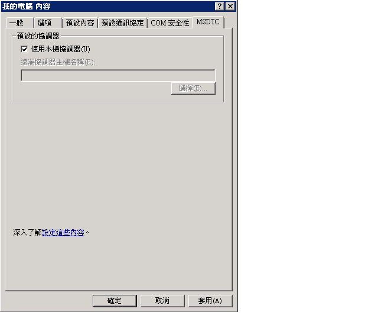
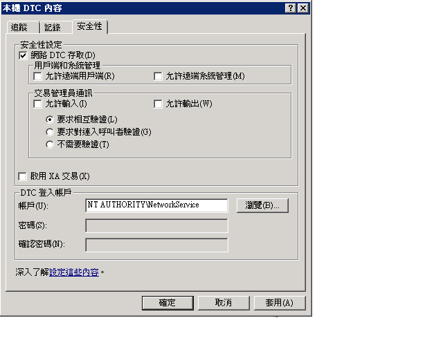

# <a name="troubleshooting-queued-messaging"></a><span data-ttu-id="1f6d8-102">佇列訊息的疑難排解</span><span class="sxs-lookup"><span data-stu-id="1f6d8-102">Troubleshooting Queued Messaging</span></span>
<span data-ttu-id="1f6d8-103">本章節包含常見問題與疑難排解說明，以便使用 Windows Communication Foundation (WCF) 中的佇列。</span><span class="sxs-lookup"><span data-stu-id="1f6d8-103">This section contains common questions and troubleshooting help for using queues in Windows Communication Foundation (WCF).</span></span>  
  
## <a name="common-questions"></a><span data-ttu-id="1f6d8-104">常見問題</span><span class="sxs-lookup"><span data-stu-id="1f6d8-104">Common Questions</span></span>  
 <span data-ttu-id="1f6d8-105">**問：** 我使用 WCF Beta 1，而且我已安裝 MSMQ hotfix。</span><span class="sxs-lookup"><span data-stu-id="1f6d8-105">**Q:** I used WCF Beta 1 and I installed the MSMQ hotfix.</span></span> <span data-ttu-id="1f6d8-106">我是否需要移除這個 Hotfix？</span><span class="sxs-lookup"><span data-stu-id="1f6d8-106">Do I need to remove the hotfix?</span></span>  
  
 <span data-ttu-id="1f6d8-107">**答：** 可以。</span><span class="sxs-lookup"><span data-stu-id="1f6d8-107">**A:** Yes.</span></span> <span data-ttu-id="1f6d8-108">不再支援這個 Hotfix。</span><span class="sxs-lookup"><span data-stu-id="1f6d8-108">This hotfix is no longer supported.</span></span> <span data-ttu-id="1f6d8-109">WCF 現在可以執行 MSMQ 而不需要 hotfix。</span><span class="sxs-lookup"><span data-stu-id="1f6d8-109">WCF now works on MSMQ without a hotfix requirement.</span></span>  
  
 <span data-ttu-id="1f6d8-110">**問：** 有兩個繫結的 MSMQ:<xref:System.ServiceModel.NetMsmqBinding>和<xref:System.ServiceModel.MsmqIntegration.MsmqIntegrationBinding>。</span><span class="sxs-lookup"><span data-stu-id="1f6d8-110">**Q:** There are two bindings for MSMQ: <xref:System.ServiceModel.NetMsmqBinding> and <xref:System.ServiceModel.MsmqIntegration.MsmqIntegrationBinding>.</span></span> <span data-ttu-id="1f6d8-111">我應該在什麼狀況下使用它們？</span><span class="sxs-lookup"><span data-stu-id="1f6d8-111">What should I use and when?</span></span>  
  
 <span data-ttu-id="1f6d8-112">**答：** 使用<xref:System.ServiceModel.NetMsmqBinding>當您想要使用 MSMQ 做為傳輸，兩個 WCF 應用程式之間佇列通訊時。</span><span class="sxs-lookup"><span data-stu-id="1f6d8-112">**A:** Use the <xref:System.ServiceModel.NetMsmqBinding> when you want to use MSMQ as a transport for queued communication between two WCF applications.</span></span> <span data-ttu-id="1f6d8-113">使用<xref:System.ServiceModel.MsmqIntegration.MsmqIntegrationBinding>當您想要使用現有的 MSMQ 應用程式與新的 WCF 應用程式通訊。</span><span class="sxs-lookup"><span data-stu-id="1f6d8-113">Use the <xref:System.ServiceModel.MsmqIntegration.MsmqIntegrationBinding> when you want to use existing MSMQ applications to communicate with new WCF applications.</span></span>  
  
 <span data-ttu-id="1f6d8-114">**問：** 我需要升級 MSMQ 才能使用<xref:System.ServiceModel.NetMsmqBinding>和`MsmqIntegration`繫結嗎？</span><span class="sxs-lookup"><span data-stu-id="1f6d8-114">**Q:** Do I have to upgrade MSMQ to use the <xref:System.ServiceModel.NetMsmqBinding> and `MsmqIntegration` bindings?</span></span>  
  
 <span data-ttu-id="1f6d8-115">**答：** 否。</span><span class="sxs-lookup"><span data-stu-id="1f6d8-115">**A:** No.</span></span> <span data-ttu-id="1f6d8-116">兩種繫結都可以配合 [!INCLUDE[wxp](../../../../includes/wxp-md.md)] 和 [!INCLUDE[ws2003](../../../../includes/ws2003-md.md)] 上的 MSMQ 3.0 使用。</span><span class="sxs-lookup"><span data-stu-id="1f6d8-116">Both bindings work with MSMQ 3.0 on [!INCLUDE[wxp](../../../../includes/wxp-md.md)] and [!INCLUDE[ws2003](../../../../includes/ws2003-md.md)].</span></span> <span data-ttu-id="1f6d8-117">這些繫結中的特定功能要等到您使用 [!INCLUDE[wv](../../../../includes/wv-md.md)] 升級至 MSMQ 4.0 時才可使用。</span><span class="sxs-lookup"><span data-stu-id="1f6d8-117">Certain features of the bindings become available when you upgrade to MSMQ 4.0 in [!INCLUDE[wv](../../../../includes/wv-md.md)].</span></span>  
  
 <span data-ttu-id="1f6d8-118">**問：** 的功能<xref:System.ServiceModel.NetMsmqBinding>和<xref:System.ServiceModel.MsmqIntegration.MsmqIntegrationBinding>繫結是否可用在 MSMQ 4.0，但不是能在 MSMQ 3.0？</span><span class="sxs-lookup"><span data-stu-id="1f6d8-118">**Q:** What features of the <xref:System.ServiceModel.NetMsmqBinding> and <xref:System.ServiceModel.MsmqIntegration.MsmqIntegrationBinding> bindings are available in MSMQ 4.0 but not in MSMQ 3.0?</span></span>  
  
 <span data-ttu-id="1f6d8-119">**答：** MSMQ 4.0，但不是能在 MSMQ 3.0 中有下列功能：</span><span class="sxs-lookup"><span data-stu-id="1f6d8-119">**A:** The following features are available in MSMQ 4.0 but not in MSMQ 3.0:</span></span>  
  
-   <span data-ttu-id="1f6d8-120">只有 MSMQ 4.0 支援自訂的寄不出的信件佇列。</span><span class="sxs-lookup"><span data-stu-id="1f6d8-120">Custom dead-letter queue is supported only on MSMQ 4.0.</span></span>  
  
-   <span data-ttu-id="1f6d8-121">MSMQ 3.0 和 4.0 以不同的方式處理有害訊息。</span><span class="sxs-lookup"><span data-stu-id="1f6d8-121">MSMQ 3.0 and 4.0 handle poison messages differently.</span></span>  
  
-   <span data-ttu-id="1f6d8-122">只有 MSMQ 4.0 支援遠端交易讀取。</span><span class="sxs-lookup"><span data-stu-id="1f6d8-122">Only MSMQ 4.0 supports remote transacted read.</span></span>  
  
 <span data-ttu-id="1f6d8-123">如需詳細資訊，請參閱 < [Windows Vista、 Windows Server 2003 和 Windows XP 中的佇列功能差異](../../../../docs/framework/wcf/feature-details/diff-in-queue-in-vista-server-2003-windows-xp.md)。</span><span class="sxs-lookup"><span data-stu-id="1f6d8-123">For more information, see [Differences in Queuing Features in Windows Vista, Windows Server 2003, and Windows XP](../../../../docs/framework/wcf/feature-details/diff-in-queue-in-vista-server-2003-windows-xp.md).</span></span>  
  
 <span data-ttu-id="1f6d8-124">**問：** 可以使用 MSMQ 3.0 上的另一端的一方已排入佇列的通訊和 MSMQ 4.0？</span><span class="sxs-lookup"><span data-stu-id="1f6d8-124">**Q:** Can I use MSMQ 3.0 on one side of a queued communication and MSMQ 4.0 on the other side?</span></span>  
  
 <span data-ttu-id="1f6d8-125">**答：** 可以。</span><span class="sxs-lookup"><span data-stu-id="1f6d8-125">**A:** Yes.</span></span>  
  
 <span data-ttu-id="1f6d8-126">**問：** 我想要整合現有 MSMQ 應用程式與新的 WCF 用戶端或伺服器。</span><span class="sxs-lookup"><span data-stu-id="1f6d8-126">**Q:** I want to integrate existing MSMQ applications with new WCF clients or servers.</span></span> <span data-ttu-id="1f6d8-127">我是否需要為 MSMQ 基礎結構的兩端同時升級？</span><span class="sxs-lookup"><span data-stu-id="1f6d8-127">Do I need to upgrade both sides of my MSMQ infrastructure?</span></span>  
  
 <span data-ttu-id="1f6d8-128">**答：** 否。</span><span class="sxs-lookup"><span data-stu-id="1f6d8-128">**A:** No.</span></span> <span data-ttu-id="1f6d8-129">您不需要將任何一端升級至 MSMQ 4.0。</span><span class="sxs-lookup"><span data-stu-id="1f6d8-129">You do not have to upgrade to MSMQ 4.0 on either side.</span></span>  
  
## <a name="troubleshooting"></a><span data-ttu-id="1f6d8-130">疑難排解</span><span class="sxs-lookup"><span data-stu-id="1f6d8-130">Troubleshooting</span></span>  
 <span data-ttu-id="1f6d8-131">本章節包含最常見疑難排解問題的解答。</span><span class="sxs-lookup"><span data-stu-id="1f6d8-131">This section contains answers to most common troubleshooting issues.</span></span> <span data-ttu-id="1f6d8-132">屬於已知限制的問題也會在版本資訊中加以說明。</span><span class="sxs-lookup"><span data-stu-id="1f6d8-132">Some issues that are known limitations are also described in the release notes.</span></span>  
  
 <span data-ttu-id="1f6d8-133">**問：** 嘗試使用私用佇列，而我得到下列例外狀況： `System.InvalidOperationException`: URL 無效。</span><span class="sxs-lookup"><span data-stu-id="1f6d8-133">**Q:** I am trying to use a private queue and I get the following exception: `System.InvalidOperationException`: The URL is invalid.</span></span> <span data-ttu-id="1f6d8-134">佇列的 URL 不可包含 '$' 字元。</span><span class="sxs-lookup"><span data-stu-id="1f6d8-134">The URL for the queue cannot contain the '$' character.</span></span> <span data-ttu-id="1f6d8-135">請使用 net.msmq://machine/private/queueName 中的語法，來定址私用佇列。</span><span class="sxs-lookup"><span data-stu-id="1f6d8-135">Use the syntax in net.msmq://machine/private/queueName to address a private queue.</span></span>  
  
 <span data-ttu-id="1f6d8-136">**答：** 請檢查您的組態和程式碼中的佇列統一資源識別元 (URI)。</span><span class="sxs-lookup"><span data-stu-id="1f6d8-136">**A:** Please check the queue Uniform Resource Identifier (URI) in your configuration and code.</span></span> <span data-ttu-id="1f6d8-137">請勿在 URI 中使用 "$" 字元。</span><span class="sxs-lookup"><span data-stu-id="1f6d8-137">Do not use the "$" character in the URI.</span></span> <span data-ttu-id="1f6d8-138">例如，若要定址名為 OrdersQueue 的私用佇列，請將 URI 指定為 net.msmq://localhost/private/ordersQueue。</span><span class="sxs-lookup"><span data-stu-id="1f6d8-138">For example, to address a private queue named OrdersQueue, specify the URI as net.msmq://localhost/private/ordersQueue.</span></span>  
  
 <span data-ttu-id="1f6d8-139">**問：** 呼叫`ServiceHost.Open()`我已排入佇列的應用程式會擲回下列例外狀況： `System.ArgumentException`: 基底位址不可包含 URI 查詢字串。</span><span class="sxs-lookup"><span data-stu-id="1f6d8-139">**Q:** Calling `ServiceHost.Open()` on my queued application throws the following exception: `System.ArgumentException`: A base address cannot contain a URI query string.</span></span> <span data-ttu-id="1f6d8-140">為什麼？</span><span class="sxs-lookup"><span data-stu-id="1f6d8-140">Why?</span></span>  
  
 <span data-ttu-id="1f6d8-141">**答：** 檢查佇列組態檔中，並在您的程式碼中的 URI。</span><span class="sxs-lookup"><span data-stu-id="1f6d8-141">**A:** Check the queue URI in your configuration file and in your code.</span></span> <span data-ttu-id="1f6d8-142">雖然 MSMQ 佇列支援使用 '?' 字元，但 URI 會將這個字元解譯為字串查詢的開頭。</span><span class="sxs-lookup"><span data-stu-id="1f6d8-142">While MSMQ queues support the use of the '?' character, URIs interpret this character as the beginning of a string query.</span></span> <span data-ttu-id="1f6d8-143">為了避免這個問題，請使用不含 '?' 字元的佇列名稱。</span><span class="sxs-lookup"><span data-stu-id="1f6d8-143">To avoid this issue, use queue names that do not contain '?' characters.</span></span>  
  
 <span data-ttu-id="1f6d8-144">**問：** 我傳送成功，但是接收者上叫用任何服務作業。</span><span class="sxs-lookup"><span data-stu-id="1f6d8-144">**Q:** My send succeeded but no service operation is invoked on the receiver.</span></span> <span data-ttu-id="1f6d8-145">為什麼？</span><span class="sxs-lookup"><span data-stu-id="1f6d8-145">Why?</span></span>  
  
 <span data-ttu-id="1f6d8-146">**答：** 若要判斷答案，逐步進行以下檢查清單：</span><span class="sxs-lookup"><span data-stu-id="1f6d8-146">**A:** To determine the answer, work through the following check list:</span></span>  
  
-   <span data-ttu-id="1f6d8-147">檢查異動式佇列需求是否相容於指定的保證。</span><span class="sxs-lookup"><span data-stu-id="1f6d8-147">Check that the transactional queue requirements are compatible with the assurances specified.</span></span> <span data-ttu-id="1f6d8-148">請注意下列準則：</span><span class="sxs-lookup"><span data-stu-id="1f6d8-148">Note the following principles:</span></span>  
  
    -   <span data-ttu-id="1f6d8-149">您可以傳送永久性的訊息 （資料包和工作階段） 具有 「 正好一次 」 保證 (<xref:System.ServiceModel.MsmqBindingBase.ExactlyOnce%2A> = `true`) 才能異動式佇列。</span><span class="sxs-lookup"><span data-stu-id="1f6d8-149">You can send durable messages (datagrams and sessions) with "exactly once" assurances (<xref:System.ServiceModel.MsmqBindingBase.ExactlyOnce%2A> = `true`) only to a transactional queue.</span></span>  
  
    -   <span data-ttu-id="1f6d8-150">您只能傳送具有「正好一次」保證的工作階段。</span><span class="sxs-lookup"><span data-stu-id="1f6d8-150">You can send sessions only with "exactly once" assurances.</span></span>  
  
    -   <span data-ttu-id="1f6d8-151">從異動式佇列接收工作階段中的訊息時需要進行異動。</span><span class="sxs-lookup"><span data-stu-id="1f6d8-151">A transaction is required to receive messages in a session from a transactional queue.</span></span>  
  
    -   <span data-ttu-id="1f6d8-152">您可以傳送或接收永久性或變動性訊息 （僅限資料包） 不具保證 (<xref:System.ServiceModel.MsmqBindingBase.ExactlyOnce%2A> = `false`) 只能以非異動式佇列。</span><span class="sxs-lookup"><span data-stu-id="1f6d8-152">You can send or receive volatile or durable messages (datagrams only) with no assurances (<xref:System.ServiceModel.MsmqBindingBase.ExactlyOnce%2A> = `false`) only to a non-transactional queue.</span></span>  
  
-   <span data-ttu-id="1f6d8-153">檢查寄不出的信件佇列。</span><span class="sxs-lookup"><span data-stu-id="1f6d8-153">Check the dead-letter queue.</span></span> <span data-ttu-id="1f6d8-154">如果您在其中找到訊息，請判斷它們為何沒有傳遞。</span><span class="sxs-lookup"><span data-stu-id="1f6d8-154">If you find the messages there, determine why they were not delivered.</span></span>  
  
-   <span data-ttu-id="1f6d8-155">檢查傳出佇列是否有連接或定址問題。</span><span class="sxs-lookup"><span data-stu-id="1f6d8-155">Check the outgoing queues for connectivity or addressing problems.</span></span>  
  
 <span data-ttu-id="1f6d8-156">**問：** 我已指定自訂的寄不出信件佇列，但是當我啟動寄件者應用程式時，我會找不到寄不出信件佇列，發生例外狀況，或傳送的應用程式有沒有寄不出信件佇列的權限。</span><span class="sxs-lookup"><span data-stu-id="1f6d8-156">**Q:** I have specified a custom dead-letter queue, but when I start the sender application, I get an exception that either the dead-letter queue is not found, or the sending application has no permission to the dead-letter queue.</span></span> <span data-ttu-id="1f6d8-157">為什麼會發生這種問題？</span><span class="sxs-lookup"><span data-stu-id="1f6d8-157">Why is this happening?</span></span>  
  
 <span data-ttu-id="1f6d8-158">**答：** 自訂的寄不出信件佇列 URI 必須在第一個區段中，例如，net.msmq: //localhost/private/myappdead-letter 佇列包含"localhost"或電腦名稱。</span><span class="sxs-lookup"><span data-stu-id="1f6d8-158">**A:** The custom dead-letter queue URI must include a "localhost" or the computer name in the first segment, for example, net.msmq://localhost/private/myAppdead-letter queue.</span></span>  
  
 <span data-ttu-id="1f6d8-159">**問：** 是否一定要定義自訂的寄不出信件佇列，或是否有預設的寄不出信件佇列？</span><span class="sxs-lookup"><span data-stu-id="1f6d8-159">**Q:** Is it always necessary to define a custom dead-letter queue, or is there a default dead-letter queue?</span></span>  
  
 <span data-ttu-id="1f6d8-160">**答：** 如果保證是 「 只一次性 」 (<xref:System.ServiceModel.MsmqBindingBase.ExactlyOnce%2A> = `true`)，如果您未指定自訂的寄不出信件佇列，預設值為整個系統異動式寄不出信件佇列。</span><span class="sxs-lookup"><span data-stu-id="1f6d8-160">**A:** If assurances are "exactly once" (<xref:System.ServiceModel.MsmqBindingBase.ExactlyOnce%2A> = `true`), and if you do not specify a custom dead-letter queue, the default is a system-wide transactional dead-letter queue.</span></span>  
  
 <span data-ttu-id="1f6d8-161">如果沒有保證 (<xref:System.ServiceModel.MsmqBindingBase.ExactlyOnce%2A> = `false`)，則預設值是沒有寄不出信件佇列功能。</span><span class="sxs-lookup"><span data-stu-id="1f6d8-161">If assurances are none (<xref:System.ServiceModel.MsmqBindingBase.ExactlyOnce%2A> = `false`), then the default is no dead-letter queue functionality.</span></span>  
  
 <span data-ttu-id="1f6d8-162">**問：** 我服務則會擲回例外狀況，當時的訊息 「 Listenerfactory 無法符合需求時 」。</span><span class="sxs-lookup"><span data-stu-id="1f6d8-162">**Q:** My service throws on SvcHost.Open with a message "EndpointListener requirements cannot be met by the ListenerFactory".</span></span> <span data-ttu-id="1f6d8-163">為什麼？</span><span class="sxs-lookup"><span data-stu-id="1f6d8-163">Why?</span></span>  
  
 <span data-ttu-id="1f6d8-164">答：</span><span class="sxs-lookup"><span data-stu-id="1f6d8-164">A.</span></span> <span data-ttu-id="1f6d8-165">請檢查您的服務合約。</span><span class="sxs-lookup"><span data-stu-id="1f6d8-165">Check your service contract.</span></span> <span data-ttu-id="1f6d8-166">您可能忘記將"IsOneWay =`true`」 在所有服務作業。</span><span class="sxs-lookup"><span data-stu-id="1f6d8-166">You may have forgotten to put "IsOneWay=`true`" on all the service operations.</span></span> <span data-ttu-id="1f6d8-167">佇列只會支援單向服務作業。</span><span class="sxs-lookup"><span data-stu-id="1f6d8-167">Queues support only one-way service operations.</span></span>  
  
 <span data-ttu-id="1f6d8-168">**問：** 佇列中有訊息，但不會叫用服務作業。</span><span class="sxs-lookup"><span data-stu-id="1f6d8-168">**Q:** There are messages in the queue but no service operation is invoked.</span></span> <span data-ttu-id="1f6d8-169">問題出在哪裡？</span><span class="sxs-lookup"><span data-stu-id="1f6d8-169">What is the problem?</span></span>  
  
 <span data-ttu-id="1f6d8-170">**答：** 判斷您的服務主機會發生錯誤。</span><span class="sxs-lookup"><span data-stu-id="1f6d8-170">**A:** Determine if your service host is faulted.</span></span> <span data-ttu-id="1f6d8-171">您可以查看追蹤，或是實作 `IErrorHandler` 以檢查這點。</span><span class="sxs-lookup"><span data-stu-id="1f6d8-171">You can check by looking at the trace or implementing `IErrorHandler`.</span></span> <span data-ttu-id="1f6d8-172">根據預設，如果偵測到有害訊息，便會發生服務主機錯誤。</span><span class="sxs-lookup"><span data-stu-id="1f6d8-172">Service host faults, by default, if a poison message is detected.</span></span>  
  
 <span data-ttu-id="1f6d8-173">**問：** 佇列中有訊息，但我 Web 裝載的佇列的服務卻沒有啟動。</span><span class="sxs-lookup"><span data-stu-id="1f6d8-173">**Q:** There are messages in the queue but my Web-hosted queued service is not getting activated.</span></span> <span data-ttu-id="1f6d8-174">為什麼？</span><span class="sxs-lookup"><span data-stu-id="1f6d8-174">Why?</span></span>  
  
 <span data-ttu-id="1f6d8-175">**答：** 最常見的原因是權限。</span><span class="sxs-lookup"><span data-stu-id="1f6d8-175">**A:** The most common reason is permissions.</span></span>  
  
1.  <span data-ttu-id="1f6d8-176">請確定 `NetMsmqActivator` 處理序正在執行，而且 `NetMsmqActivator` 處理序的身分識別已授與在佇列上讀取和搜尋的權限。</span><span class="sxs-lookup"><span data-stu-id="1f6d8-176">Ensure that the `NetMsmqActivator` process is running and the identity of the `NetMsmqActivator` process is given read and seek permission on the queue.</span></span>  
  
2.  <span data-ttu-id="1f6d8-177">如果 `NetMsmqActivator` 正在監視遠端電腦上的佇列，請確定 `NetMsmqActivator` 不是以受限制的權杖執行。</span><span class="sxs-lookup"><span data-stu-id="1f6d8-177">If the `NetMsmqActivator` is monitoring queues on a remote machine, ensure that `NetMsmqActivator` does not run under a restricted token.</span></span> <span data-ttu-id="1f6d8-178">若要以不受限制的權杖執行 `NetMsmqActivator`：</span><span class="sxs-lookup"><span data-stu-id="1f6d8-178">To run the `NetMsmqActivator` with an unrestricted token:</span></span>  
  
    ```  
    sc sidtype NetMsmqActivator unrestricted  
    ```  
  
 <span data-ttu-id="1f6d8-179">如非安全性相關的 Web 主機問題，請參閱：[排入佇列的應用程式裝載的 Web](../../../../docs/framework/wcf/feature-details/web-hosting-a-queued-application.md)。</span><span class="sxs-lookup"><span data-stu-id="1f6d8-179">For non-security related Web host issues refer to: [Web Hosting a Queued Application](../../../../docs/framework/wcf/feature-details/web-hosting-a-queued-application.md).</span></span>  
  
 <span data-ttu-id="1f6d8-180">**問：** 存取工作階段的最簡單方式是什麼？</span><span class="sxs-lookup"><span data-stu-id="1f6d8-180">**Q:** What is the easiest way to access sessions?</span></span>  
  
 <span data-ttu-id="1f6d8-181">**答：** 設定 AutoComplete =`true`對應至上次的作業上訊息工作階段中，並設定 AutoComplete =`false`在所有剩餘的服務作業。</span><span class="sxs-lookup"><span data-stu-id="1f6d8-181">**A:** Set AutoComplete=`true` on the operation that corresponds to the last message in the session, and set AutoComplete=`false` on all remaining service operations.</span></span>  
  
 <span data-ttu-id="1f6d8-182">**問：** 那裡找到常見問題的解答 msmq？</span><span class="sxs-lookup"><span data-stu-id="1f6d8-182">**Q:** Where can I find answers to common questions on MSMQ?</span></span>  
  
 <span data-ttu-id="1f6d8-183">**答：** 如需 MSMQ 的詳細資訊，請參閱[Microsoft Message Queuing](https://go.microsoft.com/fwlink/?LinkId=87810)。</span><span class="sxs-lookup"><span data-stu-id="1f6d8-183">**A:** For more information about MSMQ, see [Microsoft Message Queuing](https://go.microsoft.com/fwlink/?LinkId=87810).</span></span>  
  
 <span data-ttu-id="1f6d8-184">**問：** 為什麼沒有我的服務會擲回`ProtocolException`從同時包含佇列讀取時已排入佇列工作階段訊息和佇列資料包訊息？</span><span class="sxs-lookup"><span data-stu-id="1f6d8-184">**Q:** Why does my service throw a `ProtocolException` when reading from a queue that contains both queued session messages and queued datagram messages?</span></span>  
  
 <span data-ttu-id="1f6d8-185">**答：** 方式已排入佇列的工作階段訊息中的基本差異，並已排入佇列的資料包訊息的組成。</span><span class="sxs-lookup"><span data-stu-id="1f6d8-185">**A:** There is a fundamental difference in the way queued session messages and queued datagram messages are composed.</span></span> <span data-ttu-id="1f6d8-186">因此，預期要讀取佇列工作階段訊息的服務無法接收佇列資料包訊息，而預期要讀取佇列資料包訊息的服務無法接收工作階段訊息。</span><span class="sxs-lookup"><span data-stu-id="1f6d8-186">Because of this, a service that is expecting to read a queued session message cannot receive a queued datagram message and a service expecting to read a queued datagram message cannot receive a session message.</span></span> <span data-ttu-id="1f6d8-187">嘗試從相同佇列同時讀取這兩種訊息類型時，便會擲回下列例外狀況：</span><span class="sxs-lookup"><span data-stu-id="1f6d8-187">Attempting to read both types of messages from the same queue throws the following exception:</span></span>  
  
```  
System.ServiceModel.MsmqPoisonMessageException: The transport channel detected a poison message. This occurred because the message exceeded the maximum number of delivery attempts or because the channel detected a fundamental problem with the message. The inner exception may contain additional information.   
---> System.ServiceModel.ProtocolException: An incoming MSMQ message contained invalid or unexpected .NET Message Framing information in its body. The message cannot be received. Ensure that the sender is using a compatible service contract with a matching SessionMode.  
```  
  
 <span data-ttu-id="1f6d8-188">當應用程式從相同的電腦同時傳送佇列工作階段訊息和佇列資料包訊息時，系統的寄不出的信件佇列以及自訂的寄不出的信件佇列特別容易受到這個問題影響。</span><span class="sxs-lookup"><span data-stu-id="1f6d8-188">The system dead-letter queue, as well as any custom dead-letter queue, is particularly susceptible to this issue if an application sends both queued session messages and queued datagram messages from the same computer.</span></span> <span data-ttu-id="1f6d8-189">無法成功傳送的訊息會移到寄不出的信件佇列中。</span><span class="sxs-lookup"><span data-stu-id="1f6d8-189">If a message cannot be sent successfully, it is moved to the dead-letter queue.</span></span> <span data-ttu-id="1f6d8-190">在這些狀況下，寄不出的信件佇列中可能會同時有工作階段訊息和資料包訊息。</span><span class="sxs-lookup"><span data-stu-id="1f6d8-190">Under these circumstances, it is possible to have both session and datagram messages in the dead-letter queue.</span></span> <span data-ttu-id="1f6d8-191">在執行階段從佇列讀取時，沒有任何方法可以分開這兩種訊息，因此，應用程式不應該從相同的電腦同時傳送佇列工作階段訊息和佇列資料包訊息。</span><span class="sxs-lookup"><span data-stu-id="1f6d8-191">There is no way to separate both types of messages at runtime when reading from a queue, therefore, applications should not send both queued session messages and queued datagram messages from the same computer.</span></span>  
  
### <a name="msmq-integration-specific-troubleshooting"></a><span data-ttu-id="1f6d8-192">MSMQ 整合：特定疑難排解</span><span class="sxs-lookup"><span data-stu-id="1f6d8-192">MSMQ Integration: Specific Troubleshooting</span></span>  
 <span data-ttu-id="1f6d8-193">**問：** 時傳送的郵件，或當我開啟服務主機時，我會收到錯誤，指出配置是否錯誤。</span><span class="sxs-lookup"><span data-stu-id="1f6d8-193">**Q:** When I send a message, or when I open the service host, I get an error that indicates the scheme is wrong.</span></span> <span data-ttu-id="1f6d8-194">為什麼？</span><span class="sxs-lookup"><span data-stu-id="1f6d8-194">Why?</span></span>  
  
 <span data-ttu-id="1f6d8-195">**答：** 當您使用 MSMQ 整合繫結時，您必須使用 msmq.formatname 配置。</span><span class="sxs-lookup"><span data-stu-id="1f6d8-195">**A:** When you use the MSMQ integration binding, you must use the msmq.formatname scheme.</span></span> <span data-ttu-id="1f6d8-196">例如，msmq.formatname:DIRECT=OS:.\private$\OrdersQueue。</span><span class="sxs-lookup"><span data-stu-id="1f6d8-196">For example, msmq.formatname:DIRECT=OS:.\private$\OrdersQueue.</span></span> <span data-ttu-id="1f6d8-197">不過當指定自訂的寄不出的信件佇列時，您必須使用 net.msmq 配置。</span><span class="sxs-lookup"><span data-stu-id="1f6d8-197">But when you specify the custom dead-letter queue, you must use the net.msmq scheme.</span></span>  
  
 <span data-ttu-id="1f6d8-198">**問：** 當我使用公用或私用格式名稱，然後開啟服務主機上[!INCLUDE[wv](../../../../includes/wv-md.md)]，會發生錯誤。</span><span class="sxs-lookup"><span data-stu-id="1f6d8-198">**Q:** When I use a public or private format name and open the service host on [!INCLUDE[wv](../../../../includes/wv-md.md)], I get an error.</span></span> <span data-ttu-id="1f6d8-199">為什麼？</span><span class="sxs-lookup"><span data-stu-id="1f6d8-199">Why?</span></span>  
  
 <span data-ttu-id="1f6d8-200">**答：** 上的 WCF 整合通道[!INCLUDE[wv](../../../../includes/wv-md.md)]檢查以查看 是否可以處理有害訊息的主要應用程式佇列開啟子佇列。</span><span class="sxs-lookup"><span data-stu-id="1f6d8-200">**A:** The WCF integration channel on [!INCLUDE[wv](../../../../includes/wv-md.md)] checks to see if a sub-queue can be opened for the main application queue for handling poison messages.</span></span> <span data-ttu-id="1f6d8-201">子佇列的名稱衍生自傳遞至接聽項的 msmq.formatname URI。</span><span class="sxs-lookup"><span data-stu-id="1f6d8-201">The sub-queue name is derived from an msmq.formatname URI passed to the listener.</span></span> <span data-ttu-id="1f6d8-202">但是 MSMQ 中的子佇列名稱只能是直接格式名稱。</span><span class="sxs-lookup"><span data-stu-id="1f6d8-202">The sub-queue name in MSMQ can only be a direct format name.</span></span> <span data-ttu-id="1f6d8-203">所以您會看到錯誤。</span><span class="sxs-lookup"><span data-stu-id="1f6d8-203">So you see the error.</span></span> <span data-ttu-id="1f6d8-204">請將佇列 URI 變更為直接格式名稱。</span><span class="sxs-lookup"><span data-stu-id="1f6d8-204">Change the queue URI to a direct format name.</span></span>  
  
 <span data-ttu-id="1f6d8-205">**問：** 時從 MSMQ 應用程式中接收訊息，訊息位於佇列中，並不會讀取所接收的 WCF 應用程式。</span><span class="sxs-lookup"><span data-stu-id="1f6d8-205">**Q:** When receiving a message from an MSMQ application, the message sits in the queue and is not read by the receiving WCF application.</span></span> <span data-ttu-id="1f6d8-206">為什麼？</span><span class="sxs-lookup"><span data-stu-id="1f6d8-206">Why?</span></span>  
  
 <span data-ttu-id="1f6d8-207">**答：** 檢查訊息是否有內文。</span><span class="sxs-lookup"><span data-stu-id="1f6d8-207">**A:** Check to see whether the message has a body.</span></span> <span data-ttu-id="1f6d8-208">如果訊息沒有本文，MSMQ 整合通道便會忽略該訊息。</span><span class="sxs-lookup"><span data-stu-id="1f6d8-208">If the message has no body, the MSMQ integration channel ignores the message.</span></span> <span data-ttu-id="1f6d8-209">實作 `IErrorHandler`，即可獲得例外狀況的通知和檢查追蹤。</span><span class="sxs-lookup"><span data-stu-id="1f6d8-209">Implement `IErrorHandler` to be notified of exceptions and check the traces.</span></span>  
  
### <a name="security-related-troubleshooting"></a><span data-ttu-id="1f6d8-210">安全性相關疑難排解</span><span class="sxs-lookup"><span data-stu-id="1f6d8-210">Security-Related Troubleshooting</span></span>  
 <span data-ttu-id="1f6d8-211">**問：** 當我執行在工作群組模式中使用預設繫結的範例時，訊息似乎有傳送，但永遠不會被接收者接收。</span><span class="sxs-lookup"><span data-stu-id="1f6d8-211">**Q:** When I run the sample that uses a default binding in workgroup mode, messages seem to get sent but are never received by the receiver.</span></span>  
  
 <span data-ttu-id="1f6d8-212">**答：** 根據預設，訊息也都會簽署使用 MSMQ 內部憑證需要 Active Directory 目錄服務。</span><span class="sxs-lookup"><span data-stu-id="1f6d8-212">**A:** By default, messages are signed using an MSMQ internal certificate that requires the Active Directory directory service.</span></span> <span data-ttu-id="1f6d8-213">由於工作群組模式中並沒有提供 Active Directory，因此簽署訊息會失敗。</span><span class="sxs-lookup"><span data-stu-id="1f6d8-213">In workgroup mode, because Active Directory is not available, signing the message fails.</span></span> <span data-ttu-id="1f6d8-214">因此，訊息會落入寄不出信件佇列中，會指出失敗原因，例如 「 不正確簽章 」。</span><span class="sxs-lookup"><span data-stu-id="1f6d8-214">So the message lands in the dead-letter queue and failure cause, such as "Bad signature", is indicated.</span></span>  
  
 <span data-ttu-id="1f6d8-215">解決方法是關閉安全性。</span><span class="sxs-lookup"><span data-stu-id="1f6d8-215">The workaround is to turn off security.</span></span> <span data-ttu-id="1f6d8-216">這是藉由設定<xref:System.ServiceModel.NetMsmqSecurity.Mode%2A>  =  <xref:System.ServiceModel.NetMsmqSecurityMode.None> ，讓它在工作群組模式中運作。</span><span class="sxs-lookup"><span data-stu-id="1f6d8-216">This is done by setting <xref:System.ServiceModel.NetMsmqSecurity.Mode%2A> = <xref:System.ServiceModel.NetMsmqSecurityMode.None> to make it work in workgroup mode.</span></span>  
  
 <span data-ttu-id="1f6d8-217">另一個解決方法是從 <xref:System.ServiceModel.MsmqTransportSecurity> 屬性取得 <xref:System.ServiceModel.NetMsmqSecurity.Transport%2A>，並將其設定為 <xref:System.ServiceModel.MsmqAuthenticationMode.Certificate>，並設定用戶端憑證。</span><span class="sxs-lookup"><span data-stu-id="1f6d8-217">Another workaround is to get the <xref:System.ServiceModel.MsmqTransportSecurity> from the <xref:System.ServiceModel.NetMsmqSecurity.Transport%2A> property and set it to <xref:System.ServiceModel.MsmqAuthenticationMode.Certificate>, and set the client certificate.</span></span>  
  
 <span data-ttu-id="1f6d8-218">而另外一種解決方法是搭配 Active Directory 整合來安裝 MSMQ。</span><span class="sxs-lookup"><span data-stu-id="1f6d8-218">Yet another workaround is to install MSMQ with Active Directory integration.</span></span>  
  
 <span data-ttu-id="1f6d8-219">**問：** 當我使用預設繫結，會在傳送訊息時 （傳輸安全性已啟用） 在 Active Directory 到佇列中，我收到 「 找不到的內部憑證 」 訊息。</span><span class="sxs-lookup"><span data-stu-id="1f6d8-219">**Q:** When I send a message with default binding (transport security turned on) in Active Directory to a queue, I get an "internal certificate not found" message.</span></span> <span data-ttu-id="1f6d8-220">我要如何修正此問題？</span><span class="sxs-lookup"><span data-stu-id="1f6d8-220">How do I fix this?</span></span>  
  
 <span data-ttu-id="1f6d8-221">**答：** 這表示，必須更新傳送者在 Active Directory 中的憑證。</span><span class="sxs-lookup"><span data-stu-id="1f6d8-221">**A:** This means that the certificate in Active Directory for the sender must be renewed.</span></span> <span data-ttu-id="1f6d8-222">若要這樣做，請開啟**控制台中**，**系統管理工具**，**電腦管理**，以滑鼠右鍵按一下**MSMQ**，然後選取**屬性**。</span><span class="sxs-lookup"><span data-stu-id="1f6d8-222">To do so, open **Control Panel**, **Administrative Tools**, **Computer Management**, right-click **MSMQ**, and select **Properties**.</span></span> <span data-ttu-id="1f6d8-223">選取 [**使用者憑證**索引標籤，然後按一下**更新**] 按鈕。</span><span class="sxs-lookup"><span data-stu-id="1f6d8-223">Select the **User Certificate** tab and click the **Renew** button.</span></span>  
  
 <span data-ttu-id="1f6d8-224">**問：** 當我將傳送訊息，使用<xref:System.ServiceModel.MsmqAuthenticationMode.Certificate>並指定要使用的憑證，我收到 「 無效的憑證 」 訊息。</span><span class="sxs-lookup"><span data-stu-id="1f6d8-224">**Q:** When I send a message using <xref:System.ServiceModel.MsmqAuthenticationMode.Certificate> and specify the certificate to use, I get an "Invalid certificate" message.</span></span> <span data-ttu-id="1f6d8-225">我要如何修正此問題？</span><span class="sxs-lookup"><span data-stu-id="1f6d8-225">How do I fix this?</span></span>  
  
 <span data-ttu-id="1f6d8-226">**答：** 您不能使用憑證模式中的本機電腦憑證存放區。</span><span class="sxs-lookup"><span data-stu-id="1f6d8-226">**A:** You cannot use a local machine certificate store with certificate mode.</span></span> <span data-ttu-id="1f6d8-227">您必須使用憑證嵌入式管理單元，將憑證從電腦憑證存放區複製到目前使用者存放區。</span><span class="sxs-lookup"><span data-stu-id="1f6d8-227">You have to copy the certificate from the machine certificate store to the current user store using the Certificate snap-in.</span></span> <span data-ttu-id="1f6d8-228">若要取得憑證嵌入式管理單元：</span><span class="sxs-lookup"><span data-stu-id="1f6d8-228">To get the Certificate snap-in:</span></span>  
  
1.  <span data-ttu-id="1f6d8-229">按一下 **開始**，選取**執行**，型別`mmc`，然後按一下**確定**。</span><span class="sxs-lookup"><span data-stu-id="1f6d8-229">Click **Start**, select **Run**, type `mmc`, and click **OK**.</span></span>  
  
2.  <span data-ttu-id="1f6d8-230">在  **Microsoft Management Console**，開啟**檔案**功能表，然後選取**新增/移除嵌入式管理單元**。</span><span class="sxs-lookup"><span data-stu-id="1f6d8-230">In the **Microsoft Management Console**, open the **File** menu and select **Add/Remove Snap-in**.</span></span>  
  
3.  <span data-ttu-id="1f6d8-231">在 **新增/移除嵌入式管理單元** 對話方塊中，按一下**新增** 按鈕。</span><span class="sxs-lookup"><span data-stu-id="1f6d8-231">In the **Add/Remove Snap-in** dialog box, click the **Add** button.</span></span>  
  
4.  <span data-ttu-id="1f6d8-232">在 **新增獨立嵌入式管理單元** 對話方塊中，選取憑證然後按一下 **新增**。</span><span class="sxs-lookup"><span data-stu-id="1f6d8-232">In the **Add Standalone Snap-in** dialog box, select Certificates and click **Add**.</span></span>  
  
5.  <span data-ttu-id="1f6d8-233">在 **憑證**嵌入式管理單元對話方塊方塊中，選取**我的使用者帳戶**，按一下 **完成**。</span><span class="sxs-lookup"><span data-stu-id="1f6d8-233">In the **Certificates** snap-in dialog box, select **My user account,** and click **Finish**.</span></span>  
  
6.  <span data-ttu-id="1f6d8-234">接下來，新增第二個憑證嵌入式管理單元使用先前步驟中，但這次請選取**電腦帳戶**然後按一下**下一步**。</span><span class="sxs-lookup"><span data-stu-id="1f6d8-234">Next, add a second Certificates snap-in using the previous steps, but this time select **Computer account** and click **Next**.</span></span>  
  
7.  <span data-ttu-id="1f6d8-235">選取 **本機電腦**然後按一下**完成**。</span><span class="sxs-lookup"><span data-stu-id="1f6d8-235">Select **Local Computer** and click **Finish**.</span></span> <span data-ttu-id="1f6d8-236">現在，您可以從電腦憑證存放區將憑證拖放到目前使用者存放區。</span><span class="sxs-lookup"><span data-stu-id="1f6d8-236">You can now drag and drop certificates from the machine certificate store to the current user store.</span></span>  
  
 <span data-ttu-id="1f6d8-237">**問：** 當我的服務會從佇列讀取另一部電腦在工作群組模式中，我收到 「 拒絕存取 」 例外狀況。</span><span class="sxs-lookup"><span data-stu-id="1f6d8-237">**Q:** When my service reads from a queue on another computer in workgroup mode, I get an "access denied" exception.</span></span>  
  
 <span data-ttu-id="1f6d8-238">**答：** 在工作群組模式中，遠端應用程式來存取佇列，應用程式必須具有存取佇列的權限。</span><span class="sxs-lookup"><span data-stu-id="1f6d8-238">**A:** In workgroup mode, for a remote application to gain access to the queue, the application must have permission to access the queue.</span></span> <span data-ttu-id="1f6d8-239">將 [匿名登入] 新增至佇列的存取控制清單 (ACL)，並提供讀取權限。</span><span class="sxs-lookup"><span data-stu-id="1f6d8-239">Add "Anonymous login" to the queue's access control list (ACL) and give it read permission.</span></span>  
  
 <span data-ttu-id="1f6d8-240">**問：** 傳送時的網路服務用戶端 （或任何沒有網域帳戶的用戶端） 傳送佇列的訊息時，因不正確的憑證。</span><span class="sxs-lookup"><span data-stu-id="1f6d8-240">**Q:** When a network service client (or any client that does not have a domain account) sends a queued message, the send fails with an invalid certificate.</span></span> <span data-ttu-id="1f6d8-241">我要如何修正此問題？</span><span class="sxs-lookup"><span data-stu-id="1f6d8-241">How do I fix this?</span></span>  
  
 <span data-ttu-id="1f6d8-242">**答：** 檢查繫結組態。</span><span class="sxs-lookup"><span data-stu-id="1f6d8-242">**A:** Check the binding configuration.</span></span> <span data-ttu-id="1f6d8-243">預設繫結會開啟 MSMQ 傳輸安全性以簽署訊息。</span><span class="sxs-lookup"><span data-stu-id="1f6d8-243">The default binding has MSMQ transport security turned on to sign the message.</span></span> <span data-ttu-id="1f6d8-244">請關閉此選項。</span><span class="sxs-lookup"><span data-stu-id="1f6d8-244">Turn it off.</span></span>  
  
### <a name="remote-transacted-receives"></a><span data-ttu-id="1f6d8-245">遠端交易接收</span><span class="sxs-lookup"><span data-stu-id="1f6d8-245">Remote Transacted Receives</span></span>  
 <span data-ttu-id="1f6d8-246">**問：** 當我在電腦 A 上有佇列，並從 B （遠端交易接收案例），訊息的機器上的佇列讀取訊息的 WCF 服務不會從佇列讀取。</span><span class="sxs-lookup"><span data-stu-id="1f6d8-246">**Q:** When I have a queue on machine A, and a WCF service that reads messages from a queue on machine B (the remote transacted receive scenario), messages are not read from the queue.</span></span> <span data-ttu-id="1f6d8-247">追蹤資訊指出接收失敗訊息 「 無法匯入交易。 」</span><span class="sxs-lookup"><span data-stu-id="1f6d8-247">Tracing information indicates the receive failed with the message "Transaction cannot be imported."</span></span> <span data-ttu-id="1f6d8-248">可以做什麼來修正此問題？</span><span class="sxs-lookup"><span data-stu-id="1f6d8-248">What can I do to fix this?</span></span>  
  
 <span data-ttu-id="1f6d8-249">**答：** 有三個可能的原因：</span><span class="sxs-lookup"><span data-stu-id="1f6d8-249">**A:** There are three possible reasons for this:</span></span>  
  
-   <span data-ttu-id="1f6d8-250">如果您是在網域模式中，遠端異動接收便需要 Microsoft Distributed Transaction Coordinator (MSDTC) 網路存取。</span><span class="sxs-lookup"><span data-stu-id="1f6d8-250">If you are in domain mode, remote transacted receive requires Microsoft Distributed Transaction Coordinator (MSDTC) network access.</span></span> <span data-ttu-id="1f6d8-251">您可以使用來啟用這**新增/移除元件**。</span><span class="sxs-lookup"><span data-stu-id="1f6d8-251">You can enable this using **Add/Remove Components**.</span></span>  
  
     <span data-ttu-id="1f6d8-252"></span><span class="sxs-lookup"><span data-stu-id="1f6d8-252"></span></span>  
  
-   <span data-ttu-id="1f6d8-253">檢查與異動管理員進行通訊的驗證模式。</span><span class="sxs-lookup"><span data-stu-id="1f6d8-253">Check the authentication mode for communicating with the transaction manager.</span></span> <span data-ttu-id="1f6d8-254">如果您是在工作群組模式中，則必須選取 不需要驗證 」。</span><span class="sxs-lookup"><span data-stu-id="1f6d8-254">If you are in workgroup mode, "No Authentication Required" must be selected.</span></span> <span data-ttu-id="1f6d8-255">如果您是在網域模式中，則必須選取 「 需要相互驗證 」。</span><span class="sxs-lookup"><span data-stu-id="1f6d8-255">If you are in domain mode, then "Mutual Authentication Required" must be selected.</span></span>  
  
     <span data-ttu-id="1f6d8-256"></span><span class="sxs-lookup"><span data-stu-id="1f6d8-256"></span></span>  
  
-   <span data-ttu-id="1f6d8-257">請確定在清單中的例外狀況中的 MSDTC**網際網路連線防火牆**設定。</span><span class="sxs-lookup"><span data-stu-id="1f6d8-257">Make sure that MSDTC is in the list of exceptions in the **Internet Connection Firewall** settings.</span></span>  
  
-   <span data-ttu-id="1f6d8-258">確定您是使用 [!INCLUDE[wv](../../../../includes/wv-md.md)]。</span><span class="sxs-lookup"><span data-stu-id="1f6d8-258">Ensure that you are using [!INCLUDE[wv](../../../../includes/wv-md.md)].</span></span> <span data-ttu-id="1f6d8-259">[!INCLUDE[wv](../../../../includes/wv-md.md)] 上的 MSMQ 支援遠端交易讀取。</span><span class="sxs-lookup"><span data-stu-id="1f6d8-259">MSMQ on [!INCLUDE[wv](../../../../includes/wv-md.md)] supports remote transacted read.</span></span> <span data-ttu-id="1f6d8-260">在舊版 Window 中的 MSMQ 並不支援遠端交易讀取。</span><span class="sxs-lookup"><span data-stu-id="1f6d8-260">MSMQ on earlier Windows releases does not support remote transacted read.</span></span>  
  
 <span data-ttu-id="1f6d8-261">**問：** 網路服務從佇列讀取的服務時，比方說，在 Web 主機，為什麼收到拒絕存取時的例外狀況時引發從佇列讀取嗎？</span><span class="sxs-lookup"><span data-stu-id="1f6d8-261">**Q:** When the service reading from the queue is a network service, for example, in a Web host, why do I get an access-denied exception is raised when reading from the queue?</span></span>  
  
 <span data-ttu-id="1f6d8-262">**答：** 網路服務讀取權限必須新增至佇列 ACL，以確保網路服務可以從佇列讀取。</span><span class="sxs-lookup"><span data-stu-id="1f6d8-262">**A:** Network service read access must be added to the queue ACL to ensure that a network service can read from the queue.</span></span>  
  
 <span data-ttu-id="1f6d8-263">**問：** 可以使用 MSMQ 啟動服務來啟動遠端電腦上的佇列中的訊息為基礎的應用程式嗎？</span><span class="sxs-lookup"><span data-stu-id="1f6d8-263">**Q:** Can I use the MSMQ activation service to activate applications based on messages in a queue on a remote machine?</span></span>  
  
 <span data-ttu-id="1f6d8-264">**答：** 可以。</span><span class="sxs-lookup"><span data-stu-id="1f6d8-264">**A:** Yes.</span></span> <span data-ttu-id="1f6d8-265">若要這樣做，您必須將 MSMQ 啟動服務設定成當做網路服務執行，並新增在遠端電腦上佇列的網路服務存取。</span><span class="sxs-lookup"><span data-stu-id="1f6d8-265">To do this, you must configure the MSMQ activation service to run as a network service, and add network service access to the queue on the remote machine.</span></span>  
  
## <a name="using-custom-msmq-bindings-with-receivecontext-enabled"></a><span data-ttu-id="1f6d8-266">使用自訂 MSMQ 繫結並啟用 ReceiveContext</span><span class="sxs-lookup"><span data-stu-id="1f6d8-266">Using Custom MSMQ Bindings with ReceiveContext Enabled</span></span>  
 <span data-ttu-id="1f6d8-267">使用自訂 MSMQ 繫結並啟用 <xref:System.ServiceModel.Channels.ReceiveContext> 時，傳入訊息的處理就會使用執行緒集區執行緒，因為原生 MSMQ 不支援非同步 <xref:System.ServiceModel.Channels.ReceiveContext> 接收的 I/O 完成。</span><span class="sxs-lookup"><span data-stu-id="1f6d8-267">When using a custom MSMQ binding with <xref:System.ServiceModel.Channels.ReceiveContext> enabled processing an incoming message will use a thread pool thread because native MSMQ does not support I/O completion for asynchronous <xref:System.ServiceModel.Channels.ReceiveContext> receives.</span></span> <span data-ttu-id="1f6d8-268">這是因為處理這類訊息會使用 <xref:System.ServiceModel.Channels.ReceiveContext> 的內部交易，而且 MSMQ 不支援非同步處理。</span><span class="sxs-lookup"><span data-stu-id="1f6d8-268">This is because processing such a message uses internal transactions for <xref:System.ServiceModel.Channels.ReceiveContext> and MSMQ does not support asynchronous processing.</span></span> <span data-ttu-id="1f6d8-269">若要解決這個問題，您可以將 <xref:System.ServiceModel.Description.SynchronousReceiveBehavior> 加入至端點，以便強制執行同步處理，或將 <xref:System.ServiceModel.Description.DispatcherSynchronizationBehavior.MaxPendingReceives%2A> 設定為 1。</span><span class="sxs-lookup"><span data-stu-id="1f6d8-269">To work around this issue you can add a <xref:System.ServiceModel.Description.SynchronousReceiveBehavior> to the endpoint to force synchronous processing or set <xref:System.ServiceModel.Description.DispatcherSynchronizationBehavior.MaxPendingReceives%2A> to 1.</span></span>
