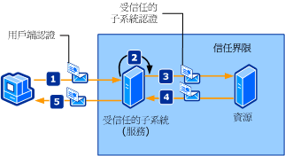

# <a name="trusted-subsystem"></a><span data-ttu-id="726d6-102">受信任的子系統</span><span class="sxs-lookup"><span data-stu-id="726d6-102">Trusted Subsystem</span></span>
<span data-ttu-id="726d6-103">用戶端會存取分散在網路上的一或多個 Web 服務。</span><span class="sxs-lookup"><span data-stu-id="726d6-103">A client accesses one or more Web services that are distributed across a network.</span></span> <span data-ttu-id="726d6-104">Web 服務的設計會將對其他資源 (例如資料庫或其他 Web 服務) 的存取封裝在 Web 服務的商務邏輯中。</span><span class="sxs-lookup"><span data-stu-id="726d6-104">The Web services are designed so that access to additional resources (such as databases or other Web services) is encapsulated in the business logic of the Web service.</span></span> <span data-ttu-id="726d6-105">這些資源必須受到保護，以避免未經授權的存取。</span><span class="sxs-lookup"><span data-stu-id="726d6-105">These resources must be protected against unauthorized access.</span></span> <span data-ttu-id="726d6-106">下圖說明受信任的子系統處理序。</span><span class="sxs-lookup"><span data-stu-id="726d6-106">The following illustration depicts a trusted subsystem process.</span></span>  
  
 <span data-ttu-id="726d6-107"></span><span class="sxs-lookup"><span data-stu-id="726d6-107"></span></span>  
  
 <span data-ttu-id="726d6-108">下列步驟說明受信任的子系統處理序，如圖所示：</span><span class="sxs-lookup"><span data-stu-id="726d6-108">The following steps describe the trusted subsystem process as illustrated:</span></span>  
  
1. <span data-ttu-id="726d6-109">用戶端將要求和認證提交至受信任的子系統。</span><span class="sxs-lookup"><span data-stu-id="726d6-109">The client submits a request to the trusted subsystem, along with credentials.</span></span>  
  
2. <span data-ttu-id="726d6-110">受信任的子系統會驗證並授權使用者。</span><span class="sxs-lookup"><span data-stu-id="726d6-110">The trusted subsystem authenticates and authorizes the user.</span></span>  
  
3. <span data-ttu-id="726d6-111">受信任的子系統將要求訊息傳送至遠端資源。</span><span class="sxs-lookup"><span data-stu-id="726d6-111">The trusted subsystem sends a request message to the remote resource.</span></span> <span data-ttu-id="726d6-112">這個要求會伴隨受信任子系統的認證 (或執行受信任子系統處理序所使用的服務帳戶)。</span><span class="sxs-lookup"><span data-stu-id="726d6-112">This request is accompanied by the credentials for the trusted subsystem (or the service account under which the trusted subsystem process is being executed).</span></span>  
  
4. <span data-ttu-id="726d6-113">後端資源會驗證並授權受信任的子系統。</span><span class="sxs-lookup"><span data-stu-id="726d6-113">The back-end resource authenticates and authorizes the trusted subsystem.</span></span> <span data-ttu-id="726d6-114">然後，處理要求並將回應發出至受信任的子系統。</span><span class="sxs-lookup"><span data-stu-id="726d6-114">It then processes the request and issues a response to the trusted subsystem.</span></span>  
  
5. <span data-ttu-id="726d6-115">受信任的子系統會處理回應，並將自己的回應發出至用戶端。</span><span class="sxs-lookup"><span data-stu-id="726d6-115">The trusted subsystem processes the response and issues its own response to the client.</span></span>  
  
|<span data-ttu-id="726d6-116">特性</span><span class="sxs-lookup"><span data-stu-id="726d6-116">Characteristic</span></span>|<span data-ttu-id="726d6-117">描述</span><span class="sxs-lookup"><span data-stu-id="726d6-117">Description</span></span>|  
|--------------------|-----------------|  
|<span data-ttu-id="726d6-118">安全性模式</span><span class="sxs-lookup"><span data-stu-id="726d6-118">Security Mode</span></span>|<span data-ttu-id="726d6-119">訊息</span><span class="sxs-lookup"><span data-stu-id="726d6-119">Message</span></span>|  
|<span data-ttu-id="726d6-120">互通性</span><span class="sxs-lookup"><span data-stu-id="726d6-120">Interoperability</span></span>|<span data-ttu-id="726d6-121">Windows Communication Foundation (WCF) 只。</span><span class="sxs-lookup"><span data-stu-id="726d6-121">Windows Communication Foundation (WCF) only.</span></span>|  
|<span data-ttu-id="726d6-122">驗證 (服務)</span><span class="sxs-lookup"><span data-stu-id="726d6-122">Authentication (service)</span></span>|<span data-ttu-id="726d6-123">安全性權杖服務會驗證並授權用戶端。</span><span class="sxs-lookup"><span data-stu-id="726d6-123">Security token service authenticates and authorizes clients.</span></span>|  
|<span data-ttu-id="726d6-124">驗證 (用戶端)</span><span class="sxs-lookup"><span data-stu-id="726d6-124">Authentication (client)</span></span>|<span data-ttu-id="726d6-125">受信任的子系統會驗證用戶端，而資源會驗證受信任的子系統服務。</span><span class="sxs-lookup"><span data-stu-id="726d6-125">The trusted subsystem authenticates the client and the resource authenticates the trusted subsystem service.</span></span>|  
|<span data-ttu-id="726d6-126">完整性</span><span class="sxs-lookup"><span data-stu-id="726d6-126">Integrity</span></span>|<span data-ttu-id="726d6-127">是</span><span class="sxs-lookup"><span data-stu-id="726d6-127">Yes</span></span>|  
|<span data-ttu-id="726d6-128">機密性</span><span class="sxs-lookup"><span data-stu-id="726d6-128">Confidentiality</span></span>|<span data-ttu-id="726d6-129">是</span><span class="sxs-lookup"><span data-stu-id="726d6-129">Yes</span></span>|  
|<span data-ttu-id="726d6-130">Transport</span><span class="sxs-lookup"><span data-stu-id="726d6-130">Transport</span></span>|<span data-ttu-id="726d6-131">用戶端與受信任子系統服務之間的 HTTP。</span><span class="sxs-lookup"><span data-stu-id="726d6-131">HTTP between client and the trusted subsystem service.</span></span><br /><br /> <span data-ttu-id="726d6-132">受信任子系統服務與資源 (後端服務) 之間的 NET.TCP。</span><span class="sxs-lookup"><span data-stu-id="726d6-132">NET.TCP between trusted subsystem service and the resource (back-end service).</span></span>|  
|<span data-ttu-id="726d6-133">繫結</span><span class="sxs-lookup"><span data-stu-id="726d6-133">Binding</span></span>|<span data-ttu-id="726d6-134"><xref:System.ServiceModel.WSHttpBinding> 並<xref:System.ServiceModel.NetTcpBinding> [ \<wsFederationHttpBinding >](../../../../docs/framework/configure-apps/file-schema/wcf/wsfederationhttpbinding.md)</span><span class="sxs-lookup"><span data-stu-id="726d6-134"><xref:System.ServiceModel.WSHttpBinding> and <xref:System.ServiceModel.NetTcpBinding>[\<wsFederationHttpBinding>](../../../../docs/framework/configure-apps/file-schema/wcf/wsfederationhttpbinding.md)</span></span>|  
  
## <a name="resource-back-end-service"></a><span data-ttu-id="726d6-135">資源 (後端服務)</span><span class="sxs-lookup"><span data-stu-id="726d6-135">Resource (Back-End Service)</span></span>  
  
### <a name="code"></a><span data-ttu-id="726d6-136">程式碼</span><span class="sxs-lookup"><span data-stu-id="726d6-136">Code</span></span>  
 <span data-ttu-id="726d6-137">下列程式碼示範如何建立資源的服務端點，這個服務端點會透過 TCP 傳輸通訊協定使用傳輸安全性。</span><span class="sxs-lookup"><span data-stu-id="726d6-137">The following code shows how to create a service endpoint for the resource, which uses transport security over the TCP transport protocol.</span></span>  
  
 [!code-csharp[TrustedSubSystemsResource#1](../../../../samples/snippets/csharp/VS_Snippets_CFX/trustedsubsystemsresource/cs/source.cs#1)]
 [!code-vb[TrustedSubSystemsResource#1](../../../../samples/snippets/visualbasic/VS_Snippets_CFX/trustedsubsystemsresource/vb/source.vb#1)]  
  
### <a name="configuration"></a><span data-ttu-id="726d6-138">組態</span><span class="sxs-lookup"><span data-stu-id="726d6-138">Configuration</span></span>  
 <span data-ttu-id="726d6-139">下列組態會使用組態來設定相同端點。</span><span class="sxs-lookup"><span data-stu-id="726d6-139">The following configuration sets up the same endpoint using configuration.</span></span>  
  
```xml  
<?xml version="1.0" encoding="utf-8" ?>  
<configuration>  
  <system.serviceModel>  
    <services>  
      <service name="Microsoft.ServiceModel.Samples.BackendService"  
               behaviorConfiguration="BackendServiceBehavior">  
        <endpoint address="net.tcp://localhost.com:8001/BackendService"  
                  binding="customBinding"  
                  bindingConfiguration="Binding1"  
                  contract="Microsoft.ServiceModel.Samples.ICalculator"/>  
      </service>  
    </services>  
    <bindings>  
      <customBinding>  
        <binding name="Binding1">  
          <security authenticationMode="UserNameOverTransport"/>  
          <windowsStreamSecurity/>  
          <tcpTransport/>  
        </binding>  
      </customBinding>  
    </bindings>  
    <behaviors>  
      <serviceBehaviors>  
        <behavior name="BackendServiceBehavior">  
          <serviceCredentials>  
            <userNameAuthentication userNamePasswordValidationMode="Custom"  
                                    customUserNamePasswordValidatorType="Microsoft.ServiceModel.Samples.MyUserNamePasswordValidator, BackendService"/>  
          </serviceCredentials>  
        </behavior>  
      </serviceBehaviors>  
    </behaviors>  
  </system.serviceModel>  
</configuration>  
```  
  
## <a name="trusted-subsystem"></a><span data-ttu-id="726d6-140">受信任的子系統</span><span class="sxs-lookup"><span data-stu-id="726d6-140">Trusted Subsystem</span></span>  
  
### <a name="code"></a><span data-ttu-id="726d6-141">程式碼</span><span class="sxs-lookup"><span data-stu-id="726d6-141">Code</span></span>  
 <span data-ttu-id="726d6-142">下列程式碼示範如何建立受信任子系統的服務端點，這個服務端點會透過 HTTP 通訊協定使用訊息安全性，並且使用使用者名稱和密碼進行驗證。</span><span class="sxs-lookup"><span data-stu-id="726d6-142">The following code shows how to create a service endpoint for the trusted subsystem that uses message security over the HTTP protocol and a user name and password for authentication.</span></span>  
  
 [!code-csharp[TrustedSubSystems#1](../../../../samples/snippets/csharp/VS_Snippets_CFX/trustedsubsystems/cs/source.cs#1)]
 [!code-vb[TrustedSubSystems#1](../../../../samples/snippets/visualbasic/VS_Snippets_CFX/trustedsubsystems/vb/source.vb#1)]  
  
 <span data-ttu-id="726d6-143">下列程式碼示範受信任子系統中的服務透過 TCP 傳輸通訊協定，使用傳輸安全性與後端服務進行通訊。</span><span class="sxs-lookup"><span data-stu-id="726d6-143">The following code shows a service in a trusted subsystem that communicates with a back-end service using transport security over the TCP transport protocol.</span></span>  
  
 [!code-csharp[TrustedSubSystems#2](../../../../samples/snippets/csharp/VS_Snippets_CFX/trustedsubsystems/cs/source.cs#2)]
 [!code-vb[TrustedSubSystems#2](../../../../samples/snippets/visualbasic/VS_Snippets_CFX/trustedsubsystems/vb/source.vb#2)]  
  
### <a name="configuration"></a><span data-ttu-id="726d6-144">組態</span><span class="sxs-lookup"><span data-stu-id="726d6-144">Configuration</span></span>  
 <span data-ttu-id="726d6-145">下列組態會使用組態來設定相同端點。</span><span class="sxs-lookup"><span data-stu-id="726d6-145">The following configuration sets up the same endpoint using configuration.</span></span> <span data-ttu-id="726d6-146">請注意兩個繫結：其中一個會保護裝載於受信任的子系統中的服務和其他受信任的子系統和後端服務之間進行通訊。</span><span class="sxs-lookup"><span data-stu-id="726d6-146">Note the two bindings: One secures the service hosted in the trusted subsystem and the other communicates between the trusted subsystem and the back-end service.</span></span>  
  
```xml  
<?xml version="1.0" encoding="utf-8" ?>  
<configuration>  
  <system.serviceModel>  
    <services>  
      <service name="Microsoft.ServiceModel.Samples.FacadeService"  
               behaviorConfiguration="FacadeServiceBehavior">  
        <host>  
          <baseAddresses>  
            <add baseAddress="http://localhost:8000/FacadeService"/>  
          </baseAddresses>  
        </host>  
        <endpoint address="http://localhost:8000/FacadeService"  
                  binding="wsHttpBinding"  
                  bindingConfiguration="Binding1"  
                  contract="Microsoft.ServiceModel.Samples.ICalculator"/>  
      </service>  
    </services>  
    <client>  
      <endpoint name=""   
                address="net.tcp://contoso.com:8001/BackendService"  
                binding="customBinding"  
                bindingConfiguration="ClientBinding"  
                contract="Microsoft.ServiceModel.Samples.ICalculator"/>  
    </client>  
    <bindings>  
      <wsHttpBinding>  
        <binding name="Binding1">  
          <security mode="Message">  
            <message clientCredentialType="UserName"/>  
          </security>  
        </binding>  
      </wsHttpBinding>  
      <customBinding>  
        <binding name="ClientBinding">  
          <security authenticationMode="UserNameOverTransport"/>  
          <windowsStreamSecurity/>  
          <tcpTransport/>  
        </binding>  
      </customBinding>  
    </bindings>  
    <behaviors>  
      <serviceBehaviors>  
        <behavior name="FacadeServiceBehavior">  
          <serviceMetadata httpGetEnabled="True"/>  
          <serviceCredentials>  
            <serviceCertificate findValue="Contoso.com"  
                                storeLocation="LocalMachine"  
                                storeName="My"  
                                x509FindType="FindBySubjectName" />  
            <userNameAuthentication userNamePasswordValidationMode="Custom"  
                                    customUserNamePasswordValidatorType="Microsoft.ServiceModel.Samples.MyUserNamePasswordValidator, FacadeService"/>  
          </serviceCredentials>  
        </behavior>  
      </serviceBehaviors>  
    </behaviors>  
  </system.serviceModel>  
</configuration>  
```  
  
## <a name="client"></a><span data-ttu-id="726d6-147">用戶端</span><span class="sxs-lookup"><span data-stu-id="726d6-147">Client</span></span>  
  
### <a name="code"></a><span data-ttu-id="726d6-148">程式碼</span><span class="sxs-lookup"><span data-stu-id="726d6-148">Code</span></span>  
 <span data-ttu-id="726d6-149">下列程式碼示範如何建立用戶端，這個用戶端會透過 HTTP 通訊協定使用訊息安全性，並且使用使用者名稱和密碼進行驗證，藉此與受信任的子系統進行通訊。</span><span class="sxs-lookup"><span data-stu-id="726d6-149">The following code shows how to create the client that communicates with the trusted subsystem by using message security over the HTTP protocol and a user name and password for authentication.</span></span>  
  
 [!code-csharp[TrustedSubSystemsClient#1](../../../../samples/snippets/csharp/VS_Snippets_CFX/trustedsubsystemsclient/cs/source.cs#1)]
 [!code-vb[TrustedSubSystemsClient#1](../../../../samples/snippets/visualbasic/VS_Snippets_CFX/trustedsubsystemsclient/vb/source.vb#1)]  
  
### <a name="configuration"></a><span data-ttu-id="726d6-150">組態</span><span class="sxs-lookup"><span data-stu-id="726d6-150">Configuration</span></span>  
 <span data-ttu-id="726d6-151">下列程式碼會將用戶端設定為透過 HTTP 通訊協定使用訊息安全性，並且使用使用者名稱和密碼進行驗證。</span><span class="sxs-lookup"><span data-stu-id="726d6-151">The following code configures the client to use message security over the HTTP protocol and a user name and password for authentication.</span></span> <span data-ttu-id="726d6-152">使用者名稱和密碼只能使用程式碼 (它是不可設定的) 來指定。</span><span class="sxs-lookup"><span data-stu-id="726d6-152">The user name and password can only be specified using code (it is not configurable).</span></span>  
  
```xml  
<?xml version="1.0" encoding="utf-8" ?>  
<configuration>  
  <system.serviceModel>  
    <client>  
        <endpoint name=""   
                  address="http://www.cohowinery.com:8000/FacadeService"  
                  binding="wsHttpBinding"  
                  bindingConfiguration="Binding1"  
                  behaviorConfiguration="ClientUserNameBehavior"  
                  contract="Microsoft.ServiceModel.Samples.ICalculator"/>  
    </client>  
    <bindings>  
      <wsHttpBinding>  
        <binding name="Binding1">  
          <security mode="Message">  
            <message clientCredentialType="UserName"/>  
          </security>  
        </binding>  
      </wsHttpBinding>  
    </bindings>  
    <behaviors>  
      <endpointBehaviors>  
        <behavior name="ClientUserNameBehavior">  
          <clientCredentials>  
            <serviceCertificate>  
              <authentication certificateValidationMode="PeerOrChainTrust"/>  
            </serviceCertificate>  
          </clientCredentials>  
        </behavior>  
      </endpointBehaviors>  
    </behaviors>  
  </system.serviceModel>  
</configuration>  
```  
  
## <a name="see-also"></a><span data-ttu-id="726d6-153">另請參閱</span><span class="sxs-lookup"><span data-stu-id="726d6-153">See also</span></span>

- [<span data-ttu-id="726d6-154">安全性概觀</span><span class="sxs-lookup"><span data-stu-id="726d6-154">Security Overview</span></span>](../../../../docs/framework/wcf/feature-details/security-overview.md)
- [<span data-ttu-id="726d6-155">Windows Server App Fabric 的安全性模型</span><span class="sxs-lookup"><span data-stu-id="726d6-155">Security Model for Windows Server App Fabric</span></span>](https://go.microsoft.com/fwlink/?LinkID=201279&clcid=0x409)
