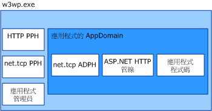

# <a name="was-activation-architecture"></a>WAS 啟動架構
本主題將條列說明並討論 Windows Process Activation Service (亦稱為 WAS) 的元件。  
  
## <a name="activation-components"></a>啟動元件  
 WAS 包含好幾個架構元件：  
  
-   接聽項配接器： Windows 服務，可在特定網路通訊協定上接收訊息，並與 WAS 通訊以將傳入訊息路由至正確的背景工作處理序。  
  
-   WAS： Windows 服務，可管理背景工作處理序的建立與存留期。  
  
-   泛型背景工作處理序可執行檔 (w3wp.exe)。  
  
-   應用程式管理員： 針對可在背景工作處理序中裝載應用程式的應用程式定義域，管理其建立與存留期。  
  
-   通訊協定處理常式： 特定於通訊協定的元件，可在背景工作處理序中執行並管理背景工作處理序與個別接聽項配接器之間的通訊。 通訊協定處理常式共有兩種類型：處理序通訊協定處理常式和 AppDomain 通訊協定處理常式。  
  
 當 WAS 啟動背景工作處理序執行個體時，會將所需的處理序通訊協定處理常式載入背景工作處理序，然後透過應用程式管理員建立可裝載應用程式的應用程式定義域。 應用程式定義域會依據應用程式需求，同時載入應用程式的程式碼與使用的 AppDomain 通訊協定處理常式。  
  
   
  
### <a name="listener-adapters"></a>接聽項配接器  
 接聽項配接器是個別的 Windows 服務，可實作網路通訊邏輯以透過所接聽的網路通訊協定來接收訊息。 下表列出 Windows Communication Foundation (WCF) 通訊協定的接聽程式配接器。  
  
|接聽項配接器服務名稱|通訊協定|注意|  
|-----------------------------------|--------------|-----------|  
|W3SVC|http|常見的元件，提供 IIS 7.0 和 WCF HTTP 啟用。|  
|NetTcpActivator|net.tcp|取決於 NetTcpPortSharing 服務。|  
|NetPipeActivator|net.pipe||  
|NetMsmqActivator|net.msmq|以 WCF 為基礎的訊息佇列應用程式搭配使用。|  
|NetMsmqActivator|msmq.formatname|提供與現有的訊息佇列應用程式的回溯相容性 (Backward Compatibility)。|  
  
 特定通訊協定的接聽項配接器會在安裝期間於 applicationHost.config 檔案中註冊，如下列 XML 範例所示。  
  
```xml  
<system.applicationHost>  
    <listenerAdapters>  
        <add name="http" />  
        <add name="net.tcp"   
          identity="S-1-5-80-3579033775-2824656752-1522793541-1960352512-462907086" />  
         <add name="net.pipe"   
           identity="S-1-5-80-2943419899-937267781-4189664001-1229628381-3982115073" />  
          <add name="net.msmq"   
            identity="S-1-5-80-89244771-1762554971-1007993102-348796144-2203111529" />  
           <add name="msmq.formatname"   
             identity="S-1-5-80-89244771-1762554971-1007993102-348796144-2203111529" />  
    </listenerAdapters>  
</system.applicationHost>  
```  
  
### <a name="protocol-handlers"></a>通訊協定處理常式  
 特定通訊協定的處理序通訊協定處理常式和 AppDomain 通訊協定處理常式會在電腦層級的 Web.config 檔案中註冊。  
  
```xml  
<system.web>  
   <protocols>  
      <add name="net.tcp"   
        processHandlerType=  
         "System.ServiceModel.WasHosting.TcpProcessProtocolHandler"  
        appDomainHandlerType=  
         "System.ServiceModel.WasHosting.TcpAppDomainProtocolHandler"  
        validate="false" />  
      <add name="net.pipe"   
        processHandlerType=  
         "System.ServiceModel.WasHosting.NamedPipeProcessProtocolHandler"  
          appDomainHandlerType=  
           "System.ServiceModel.WasHosting.NamedPipeAppDomainProtocolHandler"/>  
      <add name="net.msmq"  
        processHandlerType=  
         "System.ServiceModel.WasHosting.MsmqProcessProtocolHandler"  
        appDomainHandlerType=  
         "System.ServiceModel.WasHosting.MsmqAppDomainProtocolHandler"  
        validate="false" />  
   </protocols>  
</system.web>  
```  
  
## <a name="see-also"></a>另請參閱
- [設定用於 WCF 的 WAS](../../../../docs/framework/wcf/feature-details/configuring-the-wpa--service-for-use-with-wcf.md)
- [Windows Server AppFabric 裝載功能](https://go.microsoft.com/fwlink/?LinkId=201276)
