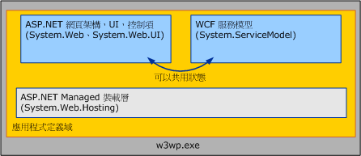

# WCF 服務與 ASP.NET
本主題討論將 [!INCLUDE[indigo1](../../../../includes/indigo1-md.md)] 服務與 ASP.NET 並存裝載，並且在 ASP.NET 相容性模式中進行裝載。  
  
## 將 WCF 與 ASP.NET 並存裝載  
 裝載在網際網路資訊服務 \(IIS\) 中的 [!INCLUDE[indigo2](../../../../includes/indigo2-md.md)] 服務可以與 .ASPX 頁面和 ASMX Web 服務位於單一、共同的應用程式定義域中。  ASP.NET 可同時為 [!INCLUDE[indigo2](../../../../includes/indigo2-md.md)] 和 ASP.NET HTTP 執行階段提供通用的基礎結構服務，例如 AppDomain 管理與動態編譯。  [!INCLUDE[indigo2](../../../../includes/indigo2-md.md)] 的預設組態會與 ASP.NET 並存。  
  
   
  
 ASP.NET HTTP 執行階段會處理 ASP.NET 要求，但不會參與處理針對 [!INCLUDE[indigo2](../../../../includes/indigo2-md.md)] 服務進行的要求，就算這些服務與 ASP.NET 內容都裝載到相同的 AppDomain 也一樣。  反之，[!INCLUDE[indigo2](../../../../includes/indigo2-md.md)] 服務模型會攔截發給 [!INCLUDE[indigo2](../../../../includes/indigo2-md.md)] 服務的訊息，並將這些訊息透過 [!INCLUDE[indigo2](../../../../includes/indigo2-md.md)] 傳輸\/通道堆疊路由出去。  
  
 並存模型的結果如下：  
  
-   ASP.NET 和 [!INCLUDE[indigo2](../../../../includes/indigo2-md.md)] 服務可以共用 AppDomain 狀態。  由於這兩個架構可以並存在相同的 AppDomain 中，[!INCLUDE[indigo2](../../../../includes/indigo2-md.md)] 也可以和 ASP.NET 共用 AppDomain 狀態 \(包括靜態變數、事件等等\)。  
  
-   不論裝載環境和傳輸為何，[!INCLUDE[indigo2](../../../../includes/indigo2-md.md)] 服務的行為都是一致的。  ASP.NET HTTP 執行階段主要用來與 IIS\/ASP.NET 裝載環境和 HTTP 通訊搭配使用。  另一方面，[!INCLUDE[indigo2](../../../../includes/indigo2-md.md)] 則是會在各種裝載環境 \([!INCLUDE[indigo2](../../../../includes/indigo2-md.md)] 會在 IIS 內部與外部採取一致的行為\) 與各種傳輸 \(透過 IIS 7.0 以及更新版本裝載的服務會在所公開的所有端點上採取一致的行為，即使這些端點當中有一些使用了 HTTP 以外的通訊協定\) 中採取一致的行為。  
  
-   在 AppDomain 中，HTTP 執行階段所實作的功能會套用到 ASP.NET 內容，但不會套用到 [!INCLUDE[indigo2](../../../../includes/indigo2-md.md)]。  在 ASP.NET 應用程式平台中，有許多 HTTP 特定的功能無法套用到裝載於 AppDomain \(其中包含 ASP.NET 內容\) 內部的 [!INCLUDE[indigo2](../../../../includes/indigo2-md.md)] 服務。  下列為這些功能的範例：  
  
    -   HttpContext：當從 [!INCLUDE[indigo2](../../../../includes/indigo2-md.md)] 服務內存取時，<xref:System.Web.HttpContext.Current%2A> 一律為 `null`。  請改用 <xref:System.ServiceModel.OperationContext.Current.RequestContext>。  
  
    -   檔案架構授權：在決定是否要授權服務要求時，[!INCLUDE[indigo2](../../../../includes/indigo2-md.md)] 安全性模型不允許將存取控制清單 \(ACL\) 套用到服務的 .svc 檔。  
  
    -   組態架構的 URL 授權：同理，[!INCLUDE[indigo2](../../../../includes/indigo2-md.md)] 安全性模型不會遵守任何在 System.Web 之 \<authorization\> 組態項目中指定的 URL 架構授權規則。  如果服務駐留在受到 ASP.NET 之 URL 授權規則保護的 URL 空間，則會忽略 [!INCLUDE[indigo2](../../../../includes/indigo2-md.md)] 要求的這些設定。  
  
    -   HttpModule 擴充性：一旦引發 <xref:System.Web.HttpApplication.PostAuthenticateRequest> 事件，而且無法將處理傳回至 ASP.NET HTTP 管線時，[!INCLUDE[indigo2](../../../../includes/indigo2-md.md)] 裝載基礎結構就會攔截 [!INCLUDE[indigo2](../../../../includes/indigo2-md.md)] 要求。  寫入程式碼中以便在管線的較後期階段攔截要求的模組，無法攔截 [!INCLUDE[indigo2](../../../../includes/indigo2-md.md)] 要求。  
  
    -   ASP.NET 模擬：根據預設，[!INCLUDE[indigo2](../../../../includes/indigo2-md.md)] 的要求一律以 IIS 處理序身分識別來執行，即使已經使用 System.Web 的 \<identity impersonate\=”true” \/\> 組態選項將 ASP.NET 設定為啟用模擬也是一樣。  
  
 這些限制只會套用至裝載在 IIS 應用程式中的 [!INCLUDE[indigo2](../../../../includes/indigo2-md.md)] 服務。  ASP.NET 內容的行為不會受到 [!INCLUDE[indigo2](../../../../includes/indigo2-md.md)] 存在事實的影響。  
  
 通常需要由 HTTP 管線提供功能的 [!INCLUDE[indigo2](../../../../includes/indigo2-md.md)] 應用程式，應該考慮使用不會受到主機與傳輸影響的 [!INCLUDE[indigo2](../../../../includes/indigo2-md.md)] 對等用法：  
  
-   以 <xref:System.ServiceModel.OperationContext> 取代 <xref:System.Web.HttpContext>。  
  
-   以 <xref:System.ServiceModel.Description.ServiceAuthorizationBehavior> 取代 ASP.NET 的檔案\/URL 授權。  
  
-   <xref:System.ServiceModel.Dispatcher.IDispatchMessageInspector> 或是自訂層級的通道，以取代 HTTP 模組。  
  
-   使用 [!INCLUDE[indigo2](../../../../includes/indigo2-md.md)] 模擬每一個作業，以取代 System.Web 模擬。  
  
 或者，您可以考慮在 [!INCLUDE[indigo2](../../../../includes/indigo2-md.md)] 的 ASP.NET 相容性模式中執行服務。  
  
## 在 ASP.NET 相容性模式中裝載 WCF 服務  
 雖然 [!INCLUDE[indigo2](../../../../includes/indigo2-md.md)] 模型可以在各種裝載環境與傳輸中表現一致的行為，但是常會有一些情況是應用程式根本不需要這麼大的彈性。  [!INCLUDE[indigo2](../../../../includes/indigo2-md.md)] 的 ASP.NET 相容性模式適用於不需要在 IIS 外部裝載，或是不會透過 HTTP 以外的通訊協定來通訊，但卻使用了 ASP.NET Web 應用程式平台所有功能的情況。  
  
 與預設的並存組態 \([!INCLUDE[indigo2](../../../../includes/indigo2-md.md)] 裝載基礎結構會攔截 [!INCLUDE[indigo2](../../../../includes/indigo2-md.md)] 訊息並將這些訊息路由至 HTTP 管線外\) 不同的是，在 ASP.NET 相容性模式中執行的 [!INCLUDE[indigo2](../../../../includes/indigo2-md.md)] 服務會充分參與 ASP.NET HTTP 要求的生命週期。  在相容性模式中，[!INCLUDE[indigo2](../../../../includes/indigo2-md.md)] 服務會透過 <xref:System.Web.IHttpHandler> 實作來使用 HTTP 管線，方式與 ASPX 頁面要求和 ASMX Web 服務要求的處理方式差不多。  如此一來，[!INCLUDE[indigo2](../../../../includes/indigo2-md.md)] 行為就會在下列 ASP.NET 功能上與 ASMX 行為一致：  
  
-   在 ASP.NET 相容性模式中執行的 <xref:System.Web.HttpContext>: [!INCLUDE[indigo2](../../../../includes/indigo2-md.md)] 服務可以存取 <xref:System.Web.HttpContext.Current%2A> 與其關聯狀態。  
  
-   檔案架構授權：在 ASP.NET 相容性模式中執行的 [!INCLUDE[indigo2](../../../../includes/indigo2-md.md)] 服務可以將檔案系統存取控制清單 \(ACL\) 附加至服務的 .svc 檔中，以保護自身的安全。  
  
-   可設定的 URL 授權：在 ASP.NET 相容性模式中執行 [!INCLUDE[indigo2](../../../../includes/indigo2-md.md)] 服務時，會強制執行 [!INCLUDE[indigo2](../../../../includes/indigo2-md.md)] 要求的 ASP.NET 的 URL 授權規則。  
  
-   <xref:System.Web.HttpModuleCollection> 擴充性：由於在 ASP.NET 相容性模式中執行的 [!INCLUDE[indigo2](../../../../includes/indigo2-md.md)] 服務會充分參與 ASP.NET HTTP 要求的生命週期，任何透過 HTTP 管線設定的 HTTP 模組都能夠在叫用服務前\/後在 [!INCLUDE[indigo2](../../../../includes/indigo2-md.md)] 要求上運作。  
  
-   ASP.NET 模擬：如果已經針對應用程式啟用了 ASP.NET 模擬，則透過 ASP.NET 模擬執行緒目前的身分識別來執行的 [!INCLUDE[indigo2](../../../../includes/indigo2-md.md)] 服務可能會與 IIS 處理序身分識別不同。  如果同時針對特定的服務作業啟用了 ASP.NET 模擬與 [!INCLUDE[indigo2](../../../../includes/indigo2-md.md)] 模擬，則服務實作最終將會透過從 [!INCLUDE[indigo2](../../../../includes/indigo2-md.md)] 取得的識別來執行。  
  
 [!INCLUDE[indigo2](../../../../includes/indigo2-md.md)] 的 ASP.NET 相容性模式會透過下列組態 \(位於應用程式的 Web.config 檔中\) 於應用程式層級啟用：  
  
```  
<system.serviceModel>  
    <serviceHostingEnvironment aspNetCompatibilityEnabled="true" />  
</system.serviceModel>  
```  
  
 如果未指定，則此值將預設為 “`true`”。  將此值設為 "`false`" 代表所有在應用程式執行的 [!INCLUDE[indigo2](../../../../includes/indigo2-md.md)] 服務將不會於 ASP.NET 相容性模式中執行。  
  
 由於 ASP.NET 相容性模式所隱含的要求處理語意在根本上就與 [!INCLUDE[indigo2](../../../../includes/indigo2-md.md)] 預設值不同，個別的服務實作將可控制是否要在啟用了 ASP.NET 相容性模式的應用程式裡面執行。  服務可以透過 <xref:System.ServiceModel.Activation.AspNetCompatibilityRequirementsAttribute> 來指出是否支援 ASP.NET 相容性模式。  這個屬性的預設值為 <xref:System.ServiceModel.Activation.AspNetCompatibilityRequirementsMode>。  
  
 `[AspNetCompatibilityRequirements(RequirementsMode = AspNetCompatibilityRequirementsMode.Allowed)]`  
  
 `public class CalculatorService : ICalculatorSession`  
  
 `{//Implement calculator service methods.}`  
  
 下表說明整個應用程式相容性模式設定如何與個別服務所陳述的支援層級互動：  
  
|整個應用程式的相容性模式設定|\[AspNetCompatibilityRequirementsMode\]<br /><br /> 設定|觀察結果|  
|--------------------|----------------------------------------------------|----------|  
|aspNetCompatibilityEnabled \= “`true`”|<xref:System.ServiceModel.Activation.AspNetCompatibilityRequirementsMode>|服務成功啟動。|  
|aspNetCompatibilityEnabled \= “`true`”|<xref:System.ServiceModel.Activation.AspNetCompatibilityRequirementsMode>|服務成功啟動。|  
|aspNetCompatibilityEnabled \= “`true`”|<xref:System.ServiceModel.Activation.AspNetCompatibilityRequirementsMode>|當服務接收訊息時，發生啟動錯誤。|  
|aspNetCompatibilityEnabled \= “`false`”|<xref:System.ServiceModel.Activation.AspNetCompatibilityRequirementsMode>|當服務接收訊息時，發生啟動錯誤。|  
|aspNetCompatibilityEnabled \= “`false`”|<xref:System.ServiceModel.Activation.AspNetCompatibilityRequirementsMode>|服務成功啟動。|  
|aspNetCompatibilityEnabled \= “`false`”|<xref:System.ServiceModel.Activation.AspNetCompatibilityRequirementsMode>|服務成功啟動。|  
  
> [!NOTE]
>  IIS 7.0 和 WAS 允許 [!INCLUDE[indigo2](../../../../includes/indigo2-md.md)] 服務透過 HTTP 以外的通訊協定進行通訊。  但是，在啟用了 ASP.NET 相容性模式的應用程式中執行的 [!INCLUDE[indigo2](../../../../includes/indigo2-md.md)] 服務將不被允許公開非 HTTP 端點。  此類組態會在服務接收其第一則訊息時，產生啟動例外狀況。  
  
 如需啟用 [!INCLUDE[indigo2](../../../../includes/indigo2-md.md)] 服務的 ASP.NET 相容性模式詳細資訊，請參閱 <xref:System.ServiceModel.Activation.AspNetCompatibilityRequirementsMode> 和 [ASP.NET 相容性](../../../../docs/framework/wcf/samples/aspnet-compatibility.md) 範例。  
  
## 請參閱  
 <xref:System.ServiceModel.Activation.AspNetCompatibilityRequirementsAttribute>   
 [Windows Server App Fabric 主控功能](http://go.microsoft.com/fwlink/?LinkId=201276)