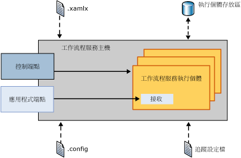
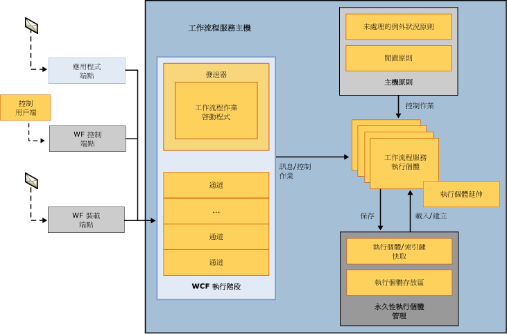
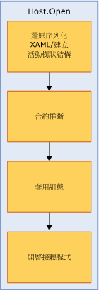
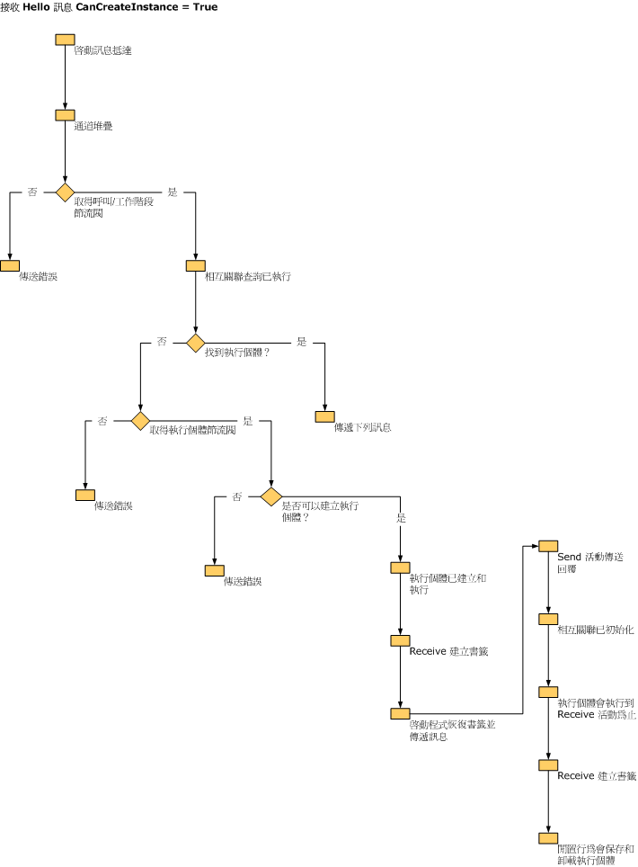
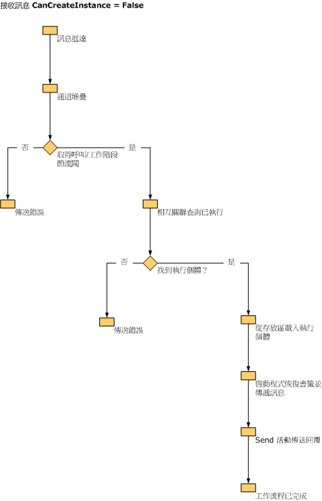

# 工作流程服務主機內部Workflow Service Host Internals
<xref:System.ServiceModel.WorkflowServiceHost> 會提供工作流程服務的主機。<xref:System.ServiceModel.WorkflowServiceHost> provides a host for workflow services. 它會負責接聽傳入訊息並將訊息路由傳送至適當的工作流程服務執行個體、控制閒置工作流程的卸載和保存作業，以及其他作業。It is responsible for listening for incoming messages and routing them to the appropriate workflow service instance, it controls unloading and persisting of idle workflows, and more. 本主題描述 WorkflowServiceHost 如何處理傳入訊息。This topic describes how WorkflowServiceHost processes incoming messages.  
  
## WorkflowServiceHost 概觀WorkflowServiceHost Overview  
 <xref:System.ServiceModel.WorkflowServiceHost> 類別是用來裝載工作流程服務。The <xref:System.ServiceModel.WorkflowServiceHost> class is used to host workflow services. 它會接聽傳入訊息並將訊息路由傳送至適當的服務執行個體，並視需要建立新的執行個體或從永久性儲存裝置載入現有的執行個體。It listens for incoming messages and routes them to the appropriate service instance, creating new instances or loading existing instances from durable storage as needed.  下圖概略說明 <xref:System.ServiceModel.WorkflowServiceHost> 的運作方式。The following diagram illustrates on a high level how <xref:System.ServiceModel.WorkflowServiceHost> works.  
  
   
  
 這張圖表顯示 <xref:System.ServiceModel.WorkflowServiceHost> 會從 .xamlx 檔案載入工作流程服務定義，並且從組態檔載入組態資訊。This diagram shows that <xref:System.ServiceModel.WorkflowServiceHost> loads workflow service definitions from .xamlx files and loads configuration information from a configuration file. 它也會從追蹤設定檔載入追蹤組態。It also loads tracking configuration from the tracking profile. <xref:System.ServiceModel.WorkflowServiceHost> 會公開工作流程控制端點，可讓您將控制作業傳送至工作流程執行個體。<xref:System.ServiceModel.WorkflowServiceHost> exposes a workflow control endpoint which allows you to send control operations to workflow instances.  如需詳細資訊，請參閱[流程控制端點](../../../../docs/framework/wcf/feature-details/workflow-control-endpoint.md)和[工作流程管理端點範例](../../../../docs/framework/windows-workflow-foundation/samples/workflow-management-endpoint-sample.md)。For more information see [Workflow Control Endpoint](../../../../docs/framework/wcf/feature-details/workflow-control-endpoint.md) and [Workflow Management Endpoint Sample](../../../../docs/framework/windows-workflow-foundation/samples/workflow-management-endpoint-sample.md).  
  
 <xref:System.ServiceModel.WorkflowServiceHost> 也會公開應用程式端點，以便接聽傳入的應用程式訊息。<xref:System.ServiceModel.WorkflowServiceHost> also exposes application endpoints that listen for incoming application messages. 當傳入訊息送達時，它就會傳送至適當的工作流程服務執行個體 (如果目前已載入的話)。When an incoming message arrives it is sent to the appropriate workflow service instance (if it is currently loaded). 必要時，它也會建立新的工作流程執行個體。If needed a new workflow instance is created. 或者，如果現有的執行個體已經保存，就會從持續性存放區載入此執行個體。Or if an existing instance has been persisted it is loaded from the persistence store.  
  
## WorkflowServiceHost 詳細資料WorkflowServiceHost Details  
 下圖稍微詳細說明 <xref:System.ServiceModel.WorkflowServiceHost> 如何處理訊息。The following diagram shows how <xref:System.ServiceModel.WorkflowServiceHost> handles messages in a bit more detail.  
  
   
  
 這張圖表顯示三個不同的端點：應用程式端點、工作流程控制端點和工作流程裝載端點。This diagram shows three different endpoints, an application endpoint, a workflow control endpoint, and a workflow hosting endpoint. 應用程式端點會接收要傳送至特定工作流程執行個體的訊息。The application endpoint receives messages that are bound for a specific workflow instance. 工作流程控制端點會接聽控制作業。The workflow control endpoint listens for control operations. 工作流程裝載端點會接聽讓 <xref:System.ServiceModel.WorkflowServiceHost> 載入並執行非服務工作流程的訊息。The workflow hosting endpoint listens for messages that cause <xref:System.ServiceModel.WorkflowServiceHost> to load and execute non-service workflows. 如圖表所示，所有訊息都會透過 WCF 執行階段處理。As shown in the diagram all messages are processed through the WCF runtime.  工作流程執行個體節流是使用 <xref:System.ServiceModel.Description.ServiceThrottlingBehavior.MaxConcurrentInstances%2A> 屬性來達成。Workflow service instance throttling is achieved by using the <xref:System.ServiceModel.Description.ServiceThrottlingBehavior.MaxConcurrentInstances%2A> property. 這個屬性會限制並行工作流程服務執行個體的數目。This property will limit the number of concurrent workflow service instances. 超過此節流時，系統就會將新工作流程服務執行個體的任何其他要求或啟動已保存之工作流程執行個體的要求排入佇列。When this throttle is exceeded any additional requests for new workflow service instances or requests to activate persisted workflow instances will be queued. 已佇列的要求會按照 FIFO 順序來處理，不論它們是新執行個體或執行中之已保存執行個體的要求都一樣。The queued requests are processed in FIFO order regardless of whether they are requests for a new instance or a running, persisted instance. 系統會載入主機原則資訊，以便判斷如何處理未處理的例外狀況，以及如何卸載並保存閒置的工作流程服務。Host policy information is loaded that determines how unhandled exceptions are dealt with, and how idle workflow services are unloaded and persisted. [!INCLUDE[crabout](../../../../includes/crabout-md.md)]請參閱這些主題[How to： 設定工作流程未處理例外狀況行為以 WorkflowServiceHost](../../../../docs/framework/wcf/feature-details/config-workflow-unhandled-exception-workflowservicehost.md)和[How to： 以 WorkflowServiceHost 設定 「 閒置行為](../../../../docs/framework/wcf/feature-details/how-to-configure-idle-behavior-with-workflowservicehost.md)。 these topics see [How to: Configure Workflow Unhandled Exception Behavior with WorkflowServiceHost](../../../../docs/framework/wcf/feature-details/config-workflow-unhandled-exception-workflowservicehost.md) and [How to: Configure Idle Behavior with WorkflowServiceHost](../../../../docs/framework/wcf/feature-details/how-to-configure-idle-behavior-with-workflowservicehost.md). 工作流程執行個體是根據主機原則來保存，並在必要時重新載入。Workflow instances are persisted according to host policies and are reloaded when needed. 如需工作流程持續性詳細資訊，請參閱： [How to： 以 WorkflowServiceHost 設定的持續性](../../../../docs/framework/wcf/feature-details/how-to-configure-persistence-with-workflowservicehost.md)，[建立長時間執行工作流程服務](../../../../docs/framework/wcf/feature-details/creating-a-long-running-workflow-service.md)，和[工作流程持續性](../../../../docs/framework/windows-workflow-foundation/workflow-persistence.md).For more information about workflow persistence see: [How to: Configure Persistence with WorkflowServiceHost](../../../../docs/framework/wcf/feature-details/how-to-configure-persistence-with-workflowservicehost.md), [Creating a Long-running Workflow Service](../../../../docs/framework/wcf/feature-details/creating-a-long-running-workflow-service.md), and [Workflow Persistence](../../../../docs/framework/windows-workflow-foundation/workflow-persistence.md).  
  
 下圖顯示所呼叫的 WorkflowServiceHost.Open 項目。The following illustration shows what the WorkflowServiceHost.Open is called.  
  
   
  
 系統會從 XAML 載入工作流程，並且建立活動樹狀。The workflow is loaded from XAML and the activity tree is created. <xref:System.ServiceModel.WorkflowServiceHost> 會瀏覽活動樹狀結構並建立服務說明。<xref:System.ServiceModel.WorkflowServiceHost> walks the activity tree and creates the service description. 然後，組態會套用至主機。Configuration is applied to the host. 最後，主機會開始接聽傳入訊息。Finally the host begins to listen for incoming messages.  
  
 下圖顯示當 <xref:System.ServiceModel.WorkflowServiceHost> 接收要傳送至 CanCreateInstance 設定為 `true` 之 Receive 活動的訊息時，它所進行的作業。The following illustration shows what the <xref:System.ServiceModel.WorkflowServiceHost> does when it receives a message bound for a Receive activity that has CanCreateInstance set to `true`.  
  
   
  
 當訊息送達時，就會由 WCF 通道堆疊處理。The message arrives and is processed by the WCF channel stack. 然後，系統會檢查節流並執行相互關聯查詢。Throttles are checked and correlation queries are executed. 如果此訊息要傳送至現有的執行個體，就會傳遞此訊息。If the message is bound for an existing instance the message is delivered. 如果需要建立新的執行個體，則會檢查 Receive 活動的 CanCreateInstance 屬性。If a new instance needs to be created, the Receive activity’s CanCreateInstance property is checked. 如果此屬性設定為 true，就會建立新的執行個體並傳遞此訊息。If it is set to true, a new instance is created and the message is delivered.  
  
 下圖顯示當 <xref:System.ServiceModel.WorkflowServiceHost> 接收要傳送至 CanCreateInstance 設定為 false 之 Receive 活動的訊息時，它所進行的作業。The following illustration shows what the <xref:System.ServiceModel.WorkflowServiceHost> does when it receives a message bound for a Receive activity that has CanCreateInstance set to false.  
  
   
  
 當訊息送達時，就會由 WCF 通道堆疊處理。The message arrives and is processed by the WCF channel stack. 然後，系統會檢查節流並執行相互關聯查詢。Throttles are checked and correlation queries are executed. 此訊息要傳送至現有的執行個體 (因為 CanCreateInstance 為 false)，所以系統會從持續性存放區載入執行個體、繼續使用書籤，然後工作流程便執行。The message is bound for an existing instance (because CanCreateInstance is false) so the instance is loaded from persistence store, the bookmark is resumed and the workflow executes.  
  
> [!WARNING]
>  如果 SQL Server 設定為只在 NamedPipe 通訊協定上接聽，工作流程服務主機將無法開啟。Workflow Service Host will fail to open if SQL Server is configured to listen on NamedPipe protocol only.  
  
## 另請參閱See Also  
 [工作流程服務Workflow Services](../../../../docs/framework/wcf/feature-details/workflow-services.md)  
 [裝載工作流程服務Hosting Workflow Services](../../../../docs/framework/wcf/feature-details/hosting-workflow-services.md)  
 [工作流程控制端點Workflow Control Endpoint](../../../../docs/framework/wcf/feature-details/workflow-control-endpoint.md)  
 [工作流程管理端點範例Workflow Management Endpoint Sample](../../../../docs/framework/windows-workflow-foundation/samples/workflow-management-endpoint-sample.md)  
 [如何： 設定工作流程未處理的例外狀況行為以 WorkflowServiceHostHow to: Configure Workflow Unhandled Exception Behavior with WorkflowServiceHost](../../../../docs/framework/wcf/feature-details/config-workflow-unhandled-exception-workflowservicehost.md)  
 [建立長時間執行工作流程服務Creating a Long-running Workflow Service](../../../../docs/framework/wcf/feature-details/creating-a-long-running-workflow-service.md)  
 [工作流程持續性Workflow Persistence](../../../../docs/framework/windows-workflow-foundation/workflow-persistence.md)
