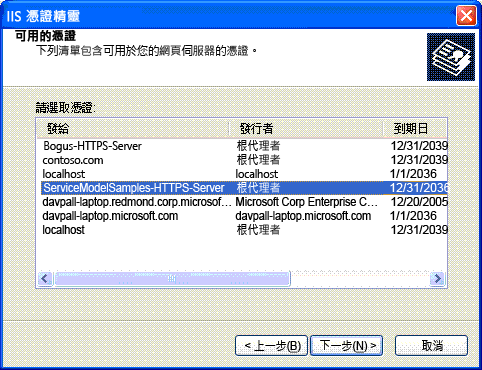

# 網際網路資訊服務 (IIS) 伺服器憑證安裝指示
若要執行能與網際網路資訊服務 \(IIS\) 安全通訊的範例，您必須建立並安裝伺服器憑證。  
  
## 步驟 1：建立憑證  
 若要建立電腦的憑證，請使用系統管理員權限來開啟 Visual Studio 命令提示字元，然後執行每個使用安全通訊搭配 IIS 之範例中包含的 Setup.bat。請先確定路徑有將 Makecert.exe 上一層的資料夾包含在內，再執行此批次 \(Batch\) 檔。下列命令是用來建立 Setup.bat 中的憑證。  
  
```  
makecert -sr LocalMachine -ss My -n CN=ServiceModelSamples-HTTPS-Server -sky exchange -sk ServiceModelSamples-HTTPS-Key  
```  
  
## 步驟 2：安裝憑證  
 安裝您剛才建立的憑證所需的步驟，視您使用的 IIS 版本而定。  
  
#### 在 IIS 5.1 \(Windows XP\) 和 IIS 6.0 \(Windows Server 2003\) 上安裝 IIS  
  
1.  開啟網際網路資訊服務管理員 MMC 嵌入式管理單元。  
  
2.  以滑鼠右鍵按一下預設網站，然後選取 \[**內容**\]。  
  
3.  選取 \[**目錄安全性**\] 索引標籤。  
  
4.  按一下 \[**伺服器憑證**\] 按鈕。\[Web 伺服器憑證精靈\] 隨即啟動。  
  
5.  完成精靈。選取選項以指派憑證。從顯示的憑證清單中，選取 ServiceModelSamples\-HTTPS\-Server 憑證。  
  
       
  
6.  在瀏覽器中使用 HTTPS 位址 https:\/\/localhost\/servicemodelsamples\/service.svc，測試對服務的存取。  
  
#### 如果先前是使用 Httpcfg.exe 設定 SSL  
  
1.  請使用 Makecert.exe \(或執行 Setup.bat\) 來建立伺服器憑證。  
  
2.  執行 IIS 管理員，並根據先前的步驟安裝憑證。  
  
3.  在用戶端程式加入下面這行程式碼。  
  
> [!IMPORTANT]
>  只有測試憑證才需要這段程式碼，例如 Makecert.exe 建立的憑證。在實際執行程式碼中不建議這樣做。  
  
```  
PermissiveCertificatePolicy.Enact("CN=ServiceModelSamples-HTTPS-Server");  
```  
  
#### 若要在 IIS 7.0 \(Windows Vista 和 Windows Server 2008\) 上安裝 IIS  
  
1.  從 \[**開始**\] 功能表中，按一下 \[**執行**\]，再輸入 **inetmgr**，以開啟網際網路資訊服務 \(IIS\) MMC 嵌入式管理單元。  
  
2.  以滑鼠右鍵按一下 \[**預設的網站**\]，然後選取 \[**編輯繫結**\]  
  
3.  按一下 \[**網站繫結**\] 對話方塊的 \[**新增**\] 按鈕。  
  
4.  選取 \[**類型**\] 下拉式清單中的 \[**HTTPS**\]。  
  
5.  選取 \[**SSL 憑證**\] 下拉式清單中的 \[**ServiceModelSamples\-HTTPS\-Server**\]，然後按一下 \[**確定**\]。  
  
6.  在瀏覽器中使用 HTTPS 位址 https:\/\/localhost\/servicemodelsamples\/service.svc，測試對服務的存取。  
  
> [!NOTE]
>  因為您剛剛安裝的測試憑證不是受信任的憑證，您在瀏覽使用這個憑證保護的本機網址時，可能會碰到其他 Internet Explorer 安全性警告。  
  
## 移除憑證  
  
-   依照前述指示使用 Internet Information Services 管理員，但是改為移除憑證或繫結，而非新增。  
  
-   使用下列命令移除電腦憑證。  
  
    ```  
    httpcfg delete ssl -i 0.0.0.0:443  
    ```