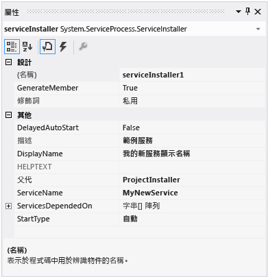
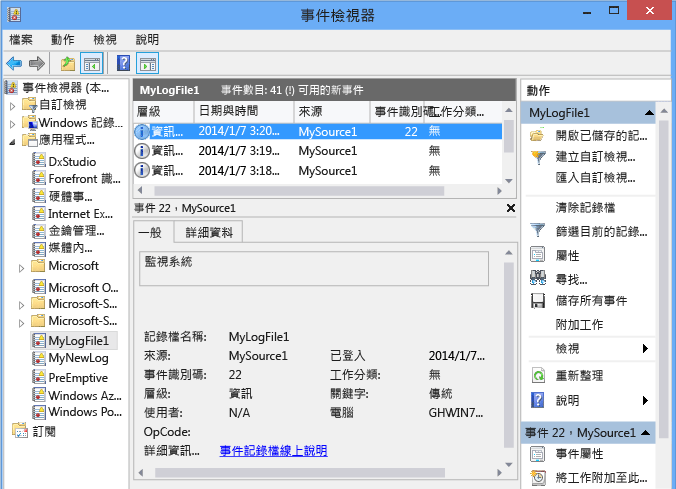

# <a name="walkthrough-creating-a-windows-service-application-in-the-component-designer"></a><span data-ttu-id="8036e-102">逐步解說：在元件設計工具中建立 Windows 服務應用程式</span><span class="sxs-lookup"><span data-stu-id="8036e-102">Walkthrough: Creating a Windows Service Application in the Component Designer</span></span>
<span data-ttu-id="8036e-103">本文示範如何在 Visual Studio 中建立簡單的 Windows 服務應用程式，以將訊息寫入至事件記錄檔。</span><span class="sxs-lookup"><span data-stu-id="8036e-103">This article demonstrates how to create a simple Windows Service application in Visual Studio that writes messages to an event log.</span></span> <span data-ttu-id="8036e-104">以下是建立及使用服務的基本執行步驟：</span><span class="sxs-lookup"><span data-stu-id="8036e-104">Here are the basic steps that you perform to create and use your service:</span></span>  
  
1.  <span data-ttu-id="8036e-105">[建立服務](#BK_CreateProject) ，方法是使用 **Windows 服務** 專案範本，並加以設定。</span><span class="sxs-lookup"><span data-stu-id="8036e-105">[Creating a Service](#BK_CreateProject) by using the **Windows Service** project template, and configure it.</span></span> <span data-ttu-id="8036e-106">這個範本會為您建立繼承自 <xref:System.ServiceProcess.ServiceBase?displayProperty=nameWithType> 的類別，並且撰寫大部分的基本服務程式碼，例如啟動服務的程式碼。</span><span class="sxs-lookup"><span data-stu-id="8036e-106">This template creates a class for you that inherits from <xref:System.ServiceProcess.ServiceBase?displayProperty=nameWithType> and writes much of the basic service code, such as the code to start the service.</span></span>  
  
2.  <span data-ttu-id="8036e-107">[在服務中加入功能](#BK_WriteCode) ，(針對 <xref:System.ServiceProcess.ServiceBase.OnStart%2A> 和 <xref:System.ServiceProcess.ServiceBase.OnStop%2A> 程序)，並覆寫任何您想要重新定義的方法。</span><span class="sxs-lookup"><span data-stu-id="8036e-107">[Adding Features to the Service](#BK_WriteCode) for the <xref:System.ServiceProcess.ServiceBase.OnStart%2A> and <xref:System.ServiceProcess.ServiceBase.OnStop%2A> procedures, and override any other methods that you want to redefine.</span></span>  
  
3.  <span data-ttu-id="8036e-108">[設定服務狀態](#BK_SetStatus).</span><span class="sxs-lookup"><span data-stu-id="8036e-108">[Setting Service Status](#BK_SetStatus).</span></span> <span data-ttu-id="8036e-109">根據預設，以 <xref:System.ServiceProcess.ServiceBase?displayProperty=nameWithType> 建立的服務只能實作可用狀態旗標的子集。</span><span class="sxs-lookup"><span data-stu-id="8036e-109">By default, services created with <xref:System.ServiceProcess.ServiceBase?displayProperty=nameWithType> implement only a subset of the available status flags.</span></span> <span data-ttu-id="8036e-110">如果您的服務會花很長的時間來啟動、暫停或停止，可以實作狀態值，例如「開始暫止」或「停止暫止」，以表示它正在進行的作業。</span><span class="sxs-lookup"><span data-stu-id="8036e-110">If your service takes a long time to start up, pause, or stop, you can implement status values such as Start Pending or Stop Pending to indicate that it's working on an operation.</span></span>  
  
4.  <span data-ttu-id="8036e-111">[將安裝程式加入服務](#BK_AddInstallers) (針對您的服務程式)。</span><span class="sxs-lookup"><span data-stu-id="8036e-111">[Adding Installers to the Service](#BK_AddInstallers) for your service application.</span></span>  
  
5.  <span data-ttu-id="8036e-112">(選擇性) [設定啟動參數](#BK_StartupParameters)，指定預設的啟動引數，並在使用者以手動方式啟動您的服務時，能夠覆寫預設值。</span><span class="sxs-lookup"><span data-stu-id="8036e-112">(Optional) [Set Startup Parameters](#BK_StartupParameters), specify default startup arguments, and enable users to override default settings when they start your service manually.</span></span>  
  
6.  <span data-ttu-id="8036e-113">[建置服務](#BK_Build).</span><span class="sxs-lookup"><span data-stu-id="8036e-113">[Building the Service](#BK_Build).</span></span>  
  
7.  <span data-ttu-id="8036e-114">[安裝服務](#BK_Install) (在本機電腦上)。</span><span class="sxs-lookup"><span data-stu-id="8036e-114">[Installing the Service](#BK_Install) on the local machine.</span></span>  
  
8.  <span data-ttu-id="8036e-115">存取 Windows 服務控制管理員並 [啟動及執行服務](#BK_StartService).</span><span class="sxs-lookup"><span data-stu-id="8036e-115">Access the Windows Service Control Manager and [Starting and Running the Service](#BK_StartService).</span></span>  
  
9. <span data-ttu-id="8036e-116">[解除安裝 Windows 服務](#BK_Uninstall).</span><span class="sxs-lookup"><span data-stu-id="8036e-116">[Uninstalling a Windows Service](#BK_Uninstall).</span></span>  
  
> [!WARNING]
>  <span data-ttu-id="8036e-117">Visual Studio 的 Express 版本中並沒有提供本逐步解說所需的 Windows 服務專案範本。</span><span class="sxs-lookup"><span data-stu-id="8036e-117">The Windows Services project template that is required for this walkthrough is not available in the Express edition of Visual Studio.</span></span>  
  
 [!INCLUDE[note_settings_general](../../../includes/note-settings-general-md.md)]  
  
<a name="BK_CreateProject"></a>   
## <a name="creating-a-service"></a><span data-ttu-id="8036e-118">建立服務</span><span class="sxs-lookup"><span data-stu-id="8036e-118">Creating a Service</span></span>  
 <span data-ttu-id="8036e-119">若要開始，您需要建立專案並設定服務正常運作所需的值。</span><span class="sxs-lookup"><span data-stu-id="8036e-119">To begin, you create the project and set values that are required for the service to function correctly.</span></span>  
  
#### <a name="to-create-and-configure-your-service"></a><span data-ttu-id="8036e-120">若要建立和設定您的服務</span><span class="sxs-lookup"><span data-stu-id="8036e-120">To create and configure your service</span></span>  
  
1.  <span data-ttu-id="8036e-121">在 Visual Studio 的功能表列中，選擇 [檔案] 、[新增] 、[專案] 。</span><span class="sxs-lookup"><span data-stu-id="8036e-121">In Visual Studio, on the menu bar, choose **File**, **New**, **Project**.</span></span>  
  
     <span data-ttu-id="8036e-122">[ **新增專案** ] 對話方塊隨即開啟。</span><span class="sxs-lookup"><span data-stu-id="8036e-122">The **New Project** dialog box opens.</span></span>  
  
2.  <span data-ttu-id="8036e-123">在 Visual Basic 或 Visual C# 專案範本清單中，選擇 [Windows 服務] ，並將專案命名為 **MyNewService**。</span><span class="sxs-lookup"><span data-stu-id="8036e-123">In the list of Visual Basic or Visual C# project templates, choose **Windows Service**, and name the project **MyNewService**.</span></span> <span data-ttu-id="8036e-124">選擇 [確定] 。</span><span class="sxs-lookup"><span data-stu-id="8036e-124">Choose **OK**.</span></span>  
  
     <span data-ttu-id="8036e-125">專案範本會自動加入繼承自 <xref:System.ServiceProcess.ServiceBase?displayProperty=nameWithType> 且名稱為 `Service1` 的元件類別。</span><span class="sxs-lookup"><span data-stu-id="8036e-125">The project template automatically adds a component class named `Service1` that inherits from <xref:System.ServiceProcess.ServiceBase?displayProperty=nameWithType>.</span></span>  
  
3.  <span data-ttu-id="8036e-126">在 [編輯]  功能表上，依序選擇 [尋找和取代] 、[檔案中尋找]  (鍵盤：CTRL+SHIFT+F)。</span><span class="sxs-lookup"><span data-stu-id="8036e-126">On the **Edit** menu, choose **Find and Replace**, **Find in Files** (Keyboard: Ctrl+Shift+F).</span></span> <span data-ttu-id="8036e-127">將所有 `Service1` 的出現變更為 `MyNewService`。</span><span class="sxs-lookup"><span data-stu-id="8036e-127">Change all occurrences of `Service1` to `MyNewService`.</span></span> <span data-ttu-id="8036e-128">Service1.cs、Program.cs 和 Service1.Designer.cs (或它們的 .vb 對應項) 中可找到這些情況。</span><span class="sxs-lookup"><span data-stu-id="8036e-128">You’ll find instances in Service1.cs, Program.cs, and Service1.Designer.cs (or their .vb equivalents).</span></span>  
  
4.  <span data-ttu-id="8036e-129">在 **Service1.cs [Design]** 或 **Service1.vb [Design]** 的 [屬性] 視窗中，設定 <xref:System.ServiceProcess.ServiceBase.ServiceName%2A> 並將 **的** (Name) `Service1` 屬性變更為 **MyNewService**(若尚未進行此設定)。</span><span class="sxs-lookup"><span data-stu-id="8036e-129">In the **Properties** window for **Service1.cs [Design]** or **Service1.vb [Design]**, set the <xref:System.ServiceProcess.ServiceBase.ServiceName%2A> and the **(Name)** property for `Service1` to **MyNewService**, if it's not already set.</span></span>  
  
5.  <span data-ttu-id="8036e-130">在方案總管中，將 **Service1.cs** 重新命名為 **MyNewService.cs**，或將 **Service1.vb** 重新命名為 **MyNewService.vb**。</span><span class="sxs-lookup"><span data-stu-id="8036e-130">In Solution Explorer, rename **Service1.cs** to **MyNewService.cs**, or **Service1.vb** to **MyNewService.vb**.</span></span>  
  
<a name="BK_WriteCode"></a>   
## <a name="adding-features-to-the-service"></a><span data-ttu-id="8036e-131">在服務中加入功能</span><span class="sxs-lookup"><span data-stu-id="8036e-131">Adding Features to the Service</span></span>  
 <span data-ttu-id="8036e-132">在本節中，您要將自訂事件記錄檔加入 Windows 服務中。</span><span class="sxs-lookup"><span data-stu-id="8036e-132">In this section, you add a custom event log to the Windows service.</span></span> <span data-ttu-id="8036e-133">事件記錄檔與 Windows 服務毫無關聯。</span><span class="sxs-lookup"><span data-stu-id="8036e-133">Event logs are not associated in any way with Windows services.</span></span> <span data-ttu-id="8036e-134">這裡的 <xref:System.Diagnostics.EventLog> 元件是用來當做可加入 Windows 服務之元件類型的範例。</span><span class="sxs-lookup"><span data-stu-id="8036e-134">Here the <xref:System.Diagnostics.EventLog> component is used as an example of the type of component you could add to a Windows service.</span></span>  
  
#### <a name="to-add-custom-event-log-functionality-to-your-service"></a><span data-ttu-id="8036e-135">若要將自訂事件記錄檔功能加入您的服務中</span><span class="sxs-lookup"><span data-stu-id="8036e-135">To add custom event log functionality to your service</span></span>  
  
1.  <span data-ttu-id="8036e-136">在 **方案總管中**中，開啟 **MyNewService.cs** 或 **MyNewService.vb**的內容功能表，然後選擇 [設計工具檢視] 。</span><span class="sxs-lookup"><span data-stu-id="8036e-136">In **Solution Explorer**, open the context menu for **MyNewService.cs** or **MyNewService.vb**, and then choose **View Designer**.</span></span>  
  
2.  <span data-ttu-id="8036e-137">從 [ **工具箱** ] 的 [ **元件**] 區段，將 <xref:System.Diagnostics.EventLog> 元件拖曳至設計工具中。</span><span class="sxs-lookup"><span data-stu-id="8036e-137">From the **Components** section of the **Toolbox**, drag an <xref:System.Diagnostics.EventLog> component to the designer.</span></span>  
  
3.  <span data-ttu-id="8036e-138">在 [方案總管] 中，開啟 **MyNewService.cs** 或 **MyNewService.vb**的內容功能表，然後選擇 [檢視程式碼] 。</span><span class="sxs-lookup"><span data-stu-id="8036e-138">In **Solution Explorer**, open the context menu for **MyNewService.cs** or **MyNewService.vb**, and then choose **View Code**.</span></span>  
  
4.  <span data-ttu-id="8036e-139">在 **類別中宣告** 變數的行後方，加入 `MyNewService` eventLog `components` 物件的宣告：</span><span class="sxs-lookup"><span data-stu-id="8036e-139">Add a declaration for the **eventLog** object in the `MyNewService` class, right after the line that declares the `components` variable:</span></span>  
  
     [!code-csharp[VbRadconService#16](../../../samples/snippets/csharp/VS_Snippets_VBCSharp/VbRadconService/CS/MyNewService.cs#16)]
     [!code-vb[VbRadconService#16](../../../samples/snippets/visualbasic/VS_Snippets_VBCSharp/VbRadconService/VB/MyNewService.vb#16)]  
  
5.  <span data-ttu-id="8036e-140">加入或編輯建構函式以定義自訂事件記錄檔：</span><span class="sxs-lookup"><span data-stu-id="8036e-140">Add or edit the constructor to define a custom event log:</span></span>  
  
     [!code-csharp[VbRadconService#2](../../../samples/snippets/csharp/VS_Snippets_VBCSharp/VbRadconService/CS/MyNewService.cs#2)]
     [!code-vb[VbRadconService#2](../../../samples/snippets/visualbasic/VS_Snippets_VBCSharp/VbRadconService/VB/MyNewService.vb#2)]  
  
#### <a name="to-define-what-occurs-when-the-service-starts"></a><span data-ttu-id="8036e-141">若要定義服務啟動時執行的動作</span><span class="sxs-lookup"><span data-stu-id="8036e-141">To define what occurs when the service starts</span></span>  
  
-   <span data-ttu-id="8036e-142">在程式碼編輯器中，找出當您建立專案時自動被覆寫的 <xref:System.ServiceProcess.ServiceBase.OnStart%2A> 方法，並替換成下列程式碼。</span><span class="sxs-lookup"><span data-stu-id="8036e-142">In the Code Editor, locate the <xref:System.ServiceProcess.ServiceBase.OnStart%2A> method that was automatically overridden when you created the project, and replace the code with the following.</span></span> <span data-ttu-id="8036e-143">當服務開始執行時，這可以將一個項目加入到事件記錄檔：</span><span class="sxs-lookup"><span data-stu-id="8036e-143">This adds an entry to the event log when the service starts running:</span></span>  
  
     [!code-csharp[VbRadconService#3](../../../samples/snippets/csharp/VS_Snippets_VBCSharp/VbRadconService/CS/MyNewService.cs#3)]
     [!code-vb[VbRadconService#3](../../../samples/snippets/visualbasic/VS_Snippets_VBCSharp/VbRadconService/VB/MyNewService.vb#3)]  
  
     <span data-ttu-id="8036e-144">服務應用程式設計為長時間執行，因此它通常會輪詢或監視系統中的一些項目。</span><span class="sxs-lookup"><span data-stu-id="8036e-144">A service application is designed to be long-running, so it usually polls or monitors something in the system.</span></span> <span data-ttu-id="8036e-145">監視工作是在 <xref:System.ServiceProcess.ServiceBase.OnStart%2A> 方法中設定的。</span><span class="sxs-lookup"><span data-stu-id="8036e-145">The monitoring is set up in the <xref:System.ServiceProcess.ServiceBase.OnStart%2A> method.</span></span> <span data-ttu-id="8036e-146">但是， <xref:System.ServiceProcess.ServiceBase.OnStart%2A> 實際上並不進行監視的工作。</span><span class="sxs-lookup"><span data-stu-id="8036e-146">However, <xref:System.ServiceProcess.ServiceBase.OnStart%2A> doesn’t actually do the monitoring.</span></span> <span data-ttu-id="8036e-147">服務的作業開始後， <xref:System.ServiceProcess.ServiceBase.OnStart%2A> 方法就必須傳回作業系統。</span><span class="sxs-lookup"><span data-stu-id="8036e-147">The <xref:System.ServiceProcess.ServiceBase.OnStart%2A> method must return to the operating system after the service's operation has begun.</span></span> <span data-ttu-id="8036e-148">它不能永遠迴圈或阻斷。</span><span class="sxs-lookup"><span data-stu-id="8036e-148">It must not loop forever or block.</span></span> <span data-ttu-id="8036e-149">若要設定簡單的輪詢機制，您可以如下述使用 <xref:System.Timers.Timer?displayProperty=nameWithType> 元件：在 <xref:System.ServiceProcess.ServiceBase.OnStart%2A> 方法中，在元件上設定參數，然後再將 <xref:System.Timers.Timer.Enabled%2A> 屬性設定為 `true`。</span><span class="sxs-lookup"><span data-stu-id="8036e-149">To set up a simple polling mechanism, you can use the <xref:System.Timers.Timer?displayProperty=nameWithType> component as follows: In the <xref:System.ServiceProcess.ServiceBase.OnStart%2A> method, set parameters on the component, and then set the <xref:System.Timers.Timer.Enabled%2A> property to `true`.</span></span> <span data-ttu-id="8036e-150">計時器會定期引發程式碼中的事件，這時候您的服務就可執行本身的監視工作。</span><span class="sxs-lookup"><span data-stu-id="8036e-150">The timer raises events in your code periodically, at which time your service could do its monitoring.</span></span> <span data-ttu-id="8036e-151">您可以使用下列程式碼來執行這項操作：</span><span class="sxs-lookup"><span data-stu-id="8036e-151">You can use the following code to do this:</span></span>  
  
    ```csharp  
    // Set up a timer to trigger every minute.  
    System.Timers.Timer timer = new System.Timers.Timer();  
    timer.Interval = 60000; // 60 seconds  
    timer.Elapsed += new System.Timers.ElapsedEventHandler(this.OnTimer);  
    timer.Start();  
    ```  
  
    ```vb  
    ' Set up a timer to trigger every minute.  
    Dim timer As System.Timers.Timer = New System.Timers.Timer()  
    timer.Interval = 60000 ' 60 seconds  
    AddHandler timer.Elapsed, AddressOf Me.OnTimer  
    timer.Start()  
    ```  
     <span data-ttu-id="8036e-152">將成員變數加入至類別。</span><span class="sxs-lookup"><span data-stu-id="8036e-152">Add a member variable to the class.</span></span> <span data-ttu-id="8036e-153">針對下一個要寫入事件記錄檔的事件，它將包含事件的識別碼。</span><span class="sxs-lookup"><span data-stu-id="8036e-153">It will contain the identifier of the next event to write into the event log.</span></span>

    ```csharp
    private int eventId = 1;
    ```

    ```vb
    Private eventId As Integer = 1
    ```

     <span data-ttu-id="8036e-154">加入處理計時器事件的程式碼：</span><span class="sxs-lookup"><span data-stu-id="8036e-154">Add code to handle the timer event:</span></span>  
  
    ```csharp  
    public void OnTimer(object sender, System.Timers.ElapsedEventArgs args)  
    {  
        // TODO: Insert monitoring activities here.  
        eventLog1.WriteEntry("Monitoring the System", EventLogEntryType.Information, eventId++);  
    }  
    ```  
  
    ```vb  
    Private Sub OnTimer(sender As Object, e As Timers.ElapsedEventArgs)  
        ' TODO: Insert monitoring activities here.  
        eventLog1.WriteEntry("Monitoring the System", EventLogEntryType.Information, eventId)  
        eventId = eventId + 1  
    End Sub  
    ```  
  
     <span data-ttu-id="8036e-155">您可能想要使用背景工作執行緒執行工作，而不是在主執行緒上執行所有工作。</span><span class="sxs-lookup"><span data-stu-id="8036e-155">You might want to perform tasks by using background worker threads instead of running all your work on the main thread.</span></span> <span data-ttu-id="8036e-156">如需相關範例，請參閱 <xref:System.ServiceProcess.ServiceBase?displayProperty=nameWithType> 參考頁面。</span><span class="sxs-lookup"><span data-stu-id="8036e-156">For an example of this, see the <xref:System.ServiceProcess.ServiceBase?displayProperty=nameWithType> reference page.</span></span>  
  
#### <a name="to-define-what-occurs-when-the-service-is-stopped"></a><span data-ttu-id="8036e-157">若要定義服務停止時執行的動作</span><span class="sxs-lookup"><span data-stu-id="8036e-157">To define what occurs when the service is stopped</span></span>  
  
-   <span data-ttu-id="8036e-158">將 <xref:System.ServiceProcess.ServiceBase.OnStop%2A> 方法的程式碼取代為下列內容：</span><span class="sxs-lookup"><span data-stu-id="8036e-158">Replace the code for the <xref:System.ServiceProcess.ServiceBase.OnStop%2A> method with the following.</span></span> <span data-ttu-id="8036e-159">當服務停止時，這可以將一個項目加入到事件記錄檔：</span><span class="sxs-lookup"><span data-stu-id="8036e-159">This adds an entry to the event log when the service is stopped:</span></span>  
  
     [!code-csharp[VbRadconService#4](../../../samples/snippets/csharp/VS_Snippets_VBCSharp/VbRadconService/CS/MyNewService.cs#4)]
     [!code-vb[VbRadconService#4](../../../samples/snippets/visualbasic/VS_Snippets_VBCSharp/VbRadconService/VB/MyNewService.vb#4)]  
  
 <span data-ttu-id="8036e-160">在下一節中，您可以覆寫 <xref:System.ServiceProcess.ServiceBase.OnPause%2A>、 <xref:System.ServiceProcess.ServiceBase.OnContinue%2A>和 <xref:System.ServiceProcess.ServiceBase.OnShutdown%2A> 方法，以為您的元件定義額外的處理。</span><span class="sxs-lookup"><span data-stu-id="8036e-160">In the next section, you can override the <xref:System.ServiceProcess.ServiceBase.OnPause%2A>, <xref:System.ServiceProcess.ServiceBase.OnContinue%2A>, and <xref:System.ServiceProcess.ServiceBase.OnShutdown%2A> methods to define additional processing for your component.</span></span>  
  
#### <a name="to-define-other-actions-for-the-service"></a><span data-ttu-id="8036e-161">若要為服務定義其他動作</span><span class="sxs-lookup"><span data-stu-id="8036e-161">To define other actions for the service</span></span>  
  
-   <span data-ttu-id="8036e-162">找出您要處理的方法，並將其覆寫，以定義您想要發生的動作。</span><span class="sxs-lookup"><span data-stu-id="8036e-162">Locate the method that you want to handle, and override it to define what you want to occur.</span></span>  
  
     <span data-ttu-id="8036e-163">下列程式碼範例示範如何覆寫 <xref:System.ServiceProcess.ServiceBase.OnContinue%2A> 方法。</span><span class="sxs-lookup"><span data-stu-id="8036e-163">The following code shows how you can override the <xref:System.ServiceProcess.ServiceBase.OnContinue%2A> method:</span></span>  
  
     [!code-csharp[VbRadconService#5](../../../samples/snippets/csharp/VS_Snippets_VBCSharp/VbRadconService/CS/MyNewService.cs#5)]
     [!code-vb[VbRadconService#5](../../../samples/snippets/visualbasic/VS_Snippets_VBCSharp/VbRadconService/VB/MyNewService.vb#5)]  
  
 <span data-ttu-id="8036e-164">當 Windows 服務由 <xref:System.Configuration.Install.Installer> 類別安裝時，必須發生一些自訂的動作。</span><span class="sxs-lookup"><span data-stu-id="8036e-164">Some custom actions have to occur when a Windows service is installed by the <xref:System.Configuration.Install.Installer> class.</span></span> <span data-ttu-id="8036e-165">Visual Studio 可建立專供 Windows 服務使用的安裝程式，並將它們加入至您的專案。</span><span class="sxs-lookup"><span data-stu-id="8036e-165">Visual Studio can create these installers specifically for a Windows service and add them to your project.</span></span>  
  
<a name="BK_SetStatus"></a>   
## <a name="setting-service-status"></a><span data-ttu-id="8036e-166">設定服務狀態</span><span class="sxs-lookup"><span data-stu-id="8036e-166">Setting Service Status</span></span>  
 <span data-ttu-id="8036e-167">服務將它們的狀態報告給服務控制管理員，讓使用者也可以知道服務是否運作正常。</span><span class="sxs-lookup"><span data-stu-id="8036e-167">Services report their status to the Service Control Manager, so that users can tell whether a service is functioning correctly.</span></span> <span data-ttu-id="8036e-168">根據預設，繼承自 <xref:System.ServiceProcess.ServiceBase> 的服務，會報告一組有限的狀態設定，包括「已停止」、「已暫停」及「執行中」。</span><span class="sxs-lookup"><span data-stu-id="8036e-168">By default, services that inherit from <xref:System.ServiceProcess.ServiceBase> report a limited set of status settings, including Stopped, Paused, and Running.</span></span> <span data-ttu-id="8036e-169">如果服務需要一些時間才啟動，則報告「開始暫止」狀態可能會很有幫助。</span><span class="sxs-lookup"><span data-stu-id="8036e-169">If a service takes a little while to start up, it might be helpful to report a Start Pending status.</span></span> <span data-ttu-id="8036e-170">您也可以將呼叫的程式碼新增至 Windows [SetServiceStatus 函式](/windows/desktop/api/winsvc/nf-winsvc-setservicestatus)，以實作「開始暫止」和「停止暫止」狀態設定。</span><span class="sxs-lookup"><span data-stu-id="8036e-170">You can also implement the Start Pending and Stop Pending status settings by adding code that calls into the Windows [SetServiceStatus function](/windows/desktop/api/winsvc/nf-winsvc-setservicestatus).</span></span>  
  
#### <a name="to-implement-service-pending-status"></a><span data-ttu-id="8036e-171">實作服務暫止狀態</span><span class="sxs-lookup"><span data-stu-id="8036e-171">To implement service pending status</span></span>  
  
1.  <span data-ttu-id="8036e-172">將 `using` 陳述式或 `Imports` 宣告，加入 MyNewService.cs 或 MyNewService.vb 檔案中的 <xref:System.Runtime.InteropServices?displayProperty=nameWithType> 命名空間：</span><span class="sxs-lookup"><span data-stu-id="8036e-172">Add a `using` statement or `Imports` declaration to the <xref:System.Runtime.InteropServices?displayProperty=nameWithType> namespace in the MyNewService.cs or MyNewService.vb file:</span></span>  
  
    ```csharp  
    using System.Runtime.InteropServices;  
    ```  
  
    ```vb  
    Imports System.Runtime.InteropServices  
    ```  
  
2.  <span data-ttu-id="8036e-173">將下列程式碼加入宣告 `ServiceState` 值的 MyNewService.cs，且加入您將在平台叫用呼叫中使用的狀態結構中：</span><span class="sxs-lookup"><span data-stu-id="8036e-173">Add the following code to MyNewService.cs to declare the `ServiceState` values and to add a structure for the status, which you'll use in a platform invoke call:</span></span>  
  
    ```csharp  
    public enum ServiceState  
      {  
          SERVICE_STOPPED = 0x00000001,  
          SERVICE_START_PENDING = 0x00000002,  
          SERVICE_STOP_PENDING = 0x00000003,  
          SERVICE_RUNNING = 0x00000004,  
          SERVICE_CONTINUE_PENDING = 0x00000005,  
          SERVICE_PAUSE_PENDING = 0x00000006,  
          SERVICE_PAUSED = 0x00000007,  
      }  
  
      [StructLayout(LayoutKind.Sequential)]  
      public struct ServiceStatus  
      {  
          public int dwServiceType;  
          public ServiceState dwCurrentState;  
          public int dwControlsAccepted;  
          public int dwWin32ExitCode;  
          public int dwServiceSpecificExitCode;  
          public int dwCheckPoint;  
          public int dwWaitHint;  
      };  
    ```  
  
    ```vb  
    Public Enum ServiceState  
        SERVICE_STOPPED = 1  
        SERVICE_START_PENDING = 2  
        SERVICE_STOP_PENDING = 3  
        SERVICE_RUNNING = 4  
        SERVICE_CONTINUE_PENDING = 5  
        SERVICE_PAUSE_PENDING = 6  
        SERVICE_PAUSED = 7  
    End Enum  
  
    <StructLayout(LayoutKind.Sequential)>  
    Public Structure ServiceStatus  
        Public dwServiceType As Long  
        Public dwCurrentState As ServiceState  
        Public dwControlsAccepted As Long  
        Public dwWin32ExitCode As Long  
        Public dwServiceSpecificExitCode As Long  
        Public dwCheckPoint As Long  
        Public dwWaitHint As Long  
    End Structure  
    ```  
  
3.  <span data-ttu-id="8036e-174">接著，在 `MyNewService` 類別中，使用平台叫用宣告 [SetServiceStatus 函式](/windows/desktop/api/winsvc/nf-winsvc-setservicestatus)：</span><span class="sxs-lookup"><span data-stu-id="8036e-174">Now, in the `MyNewService` class, declare the [SetServiceStatus function](/windows/desktop/api/winsvc/nf-winsvc-setservicestatus) by using platform invoke:</span></span>  
  
    ```csharp  
    [DllImport("advapi32.dll", SetLastError=true)]  
            private static extern bool SetServiceStatus(IntPtr handle, ref ServiceStatus serviceStatus);  
    ```  
  
    ```vb  
    Declare Auto Function SetServiceStatus Lib "advapi32.dll" (ByVal handle As IntPtr, ByRef serviceStatus As ServiceStatus) As Boolean  
    ```  
  
4.  <span data-ttu-id="8036e-175">若要實作「開始暫止」狀態，請將下列程式碼加入至 <xref:System.ServiceProcess.ServiceBase.OnStart%2A> 方法開頭：</span><span class="sxs-lookup"><span data-stu-id="8036e-175">To implement the Start Pending status, add the following code to the beginning of the <xref:System.ServiceProcess.ServiceBase.OnStart%2A> method:</span></span>  
  
    ```csharp  
    // Update the service state to Start Pending.  
    ServiceStatus serviceStatus = new ServiceStatus();  
    serviceStatus.dwCurrentState = ServiceState.SERVICE_START_PENDING;  
    serviceStatus.dwWaitHint = 100000;  
    SetServiceStatus(this.ServiceHandle, ref serviceStatus);  
    ```  
  
    ```vb  
    ' Update the service state to Start Pending.  
    Dim serviceStatus As ServiceStatus = New ServiceStatus()  
    serviceStatus.dwCurrentState = ServiceState.SERVICE_START_PENDING  
    serviceStatus.dwWaitHint = 100000  
    SetServiceStatus(Me.ServiceHandle, serviceStatus)  
    ```  
  
5.  <span data-ttu-id="8036e-176">在 <xref:System.ServiceProcess.ServiceBase.OnStart%2A> 方法結尾處加入程式碼，以將狀態設定為「執行中」。</span><span class="sxs-lookup"><span data-stu-id="8036e-176">Add code to set the status to Running at the end of the <xref:System.ServiceProcess.ServiceBase.OnStart%2A> method.</span></span>  
  
    ```csharp
    // Update the service state to Running.  
    serviceStatus.dwCurrentState = ServiceState.SERVICE_RUNNING;  
    SetServiceStatus(this.ServiceHandle, ref serviceStatus);  
    ```  
  
    ```vb  
    ' Update the service state to Running.  
    serviceStatus.dwCurrentState = ServiceState.SERVICE_RUNNING  
    SetServiceStatus(Me.ServiceHandle, serviceStatus)  
    ```  
  
6.  <span data-ttu-id="8036e-177">(選擇性) 為 <xref:System.ServiceProcess.ServiceBase.OnStop%2A> 方法重複這個程序。</span><span class="sxs-lookup"><span data-stu-id="8036e-177">(Optional) Repeat this procedure for the <xref:System.ServiceProcess.ServiceBase.OnStop%2A> method.</span></span>  
  
> [!CAUTION]
>  <span data-ttu-id="8036e-178">[服務控制管理員](/windows/desktop/Services/service-control-manager)使用 [SERVICE_STATUS 結構](/windows/desktop/api/winsvc/ns-winsvc-_service_status)的 `dwWaitHint` 和 `dwCheckpoint` 成員來判斷等候啟動或關閉 Windows 服務的時間。</span><span class="sxs-lookup"><span data-stu-id="8036e-178">The [Service Control Manager](/windows/desktop/Services/service-control-manager) uses the `dwWaitHint` and `dwCheckpoint` members of the [SERVICE_STATUS structure](/windows/desktop/api/winsvc/ns-winsvc-_service_status) to determine how much time to wait for a Windows Service to start or shut down.</span></span> <span data-ttu-id="8036e-179">如果您的 <xref:System.ServiceProcess.ServiceBase.OnStart%2A> 和 <xref:System.ServiceProcess.ServiceBase.OnStop%2A> 方法需長時間執行，則您可以使用遞增的 `dwCheckPoint` 值再次呼叫 [SetServiceStatus](/windows/desktop/api/winsvc/nf-winsvc-setservicestatus)，以要求更多時間。</span><span class="sxs-lookup"><span data-stu-id="8036e-179">If your <xref:System.ServiceProcess.ServiceBase.OnStart%2A> and <xref:System.ServiceProcess.ServiceBase.OnStop%2A> methods run long, your service can request more time by calling [SetServiceStatus](/windows/desktop/api/winsvc/nf-winsvc-setservicestatus) again with an incremented `dwCheckPoint` value.</span></span>  
  
<a name="BK_AddInstallers"></a>   
## <a name="adding-installers-to-the-service"></a><span data-ttu-id="8036e-180">將安裝程式加入服務</span><span class="sxs-lookup"><span data-stu-id="8036e-180">Adding Installers to the Service</span></span>  
 <span data-ttu-id="8036e-181">執行 Windows 服務之前，您需要安裝它，使其註冊服務控制管理員。</span><span class="sxs-lookup"><span data-stu-id="8036e-181">Before you can run a Windows Service, you need to install it, which registers it with the Service Control Manager.</span></span> <span data-ttu-id="8036e-182">您可以將安裝程式加入至處理註冊詳細資料的專案。</span><span class="sxs-lookup"><span data-stu-id="8036e-182">You can add installers to your project that handle the registration details.</span></span>  
  
#### <a name="to-create-the-installers-for-your-service"></a><span data-ttu-id="8036e-183">若要為您的服務建立安裝程式</span><span class="sxs-lookup"><span data-stu-id="8036e-183">To create the installers for your service</span></span>  
  
1.  <span data-ttu-id="8036e-184">在 **方案總管中**中，開啟 **MyNewService.cs** 或 **MyNewService.vb**的內容功能表，然後選擇 [設計工具檢視] 。</span><span class="sxs-lookup"><span data-stu-id="8036e-184">In **Solution Explorer**, open the context menu for **MyNewService.cs** or **MyNewService.vb**, and then choose **View Designer**.</span></span>  
  
2.  <span data-ttu-id="8036e-185">按一下設計工具的背景以選取服務本身，而不是服務的內容。</span><span class="sxs-lookup"><span data-stu-id="8036e-185">Click the background of the designer to select the service itself, instead of any of its contents.</span></span>  
  
3.  <span data-ttu-id="8036e-186">開啟設計工具視窗的內容功能表 (如果您使用指標裝置，以滑鼠右鍵按一下視窗)，然後選擇 [加入安裝程式] 。</span><span class="sxs-lookup"><span data-stu-id="8036e-186">Open the context menu for the designer window (if you’re using a pointing device, right-click inside the window), and then choose **Add Installer**.</span></span>  
  
     <span data-ttu-id="8036e-187">依預設會將包含兩個安裝程式的元件類別加入您的專案中。</span><span class="sxs-lookup"><span data-stu-id="8036e-187">By default, a component class that contains two installers is added to your project.</span></span> <span data-ttu-id="8036e-188">元件命名為 **ProjectInstaller**，而其所包含的安裝程式分別為服務的安裝程式和服務相關處理序的安裝程式。</span><span class="sxs-lookup"><span data-stu-id="8036e-188">The component is named **ProjectInstaller**, and the installers it contains are the installer for your service and the installer for the service's associated process.</span></span>  
  
4.  <span data-ttu-id="8036e-189">在 **ProjectInstaller** 的 [設計] 檢視中，選擇 **serviceInstaller1** (針對 Visual C# 專案) 或 **ServiceInstaller1** (針對 Visual Basic 專案)。</span><span class="sxs-lookup"><span data-stu-id="8036e-189">In **Design** view for **ProjectInstaller**, choose **serviceInstaller1** for a Visual C# project, or **ServiceInstaller1** for a Visual Basic project.</span></span>  
  
5.  <span data-ttu-id="8036e-190">在 [屬性]  視窗中，請確定 <xref:System.ServiceProcess.ServiceInstaller.ServiceName%2A> 屬性已設為 **MyNewService**。</span><span class="sxs-lookup"><span data-stu-id="8036e-190">In the **Properties** window, make sure the <xref:System.ServiceProcess.ServiceInstaller.ServiceName%2A> property is set to **MyNewService**.</span></span>  
  
6.  <span data-ttu-id="8036e-191">將 **描述** 屬性設定一些文字，例如 "A sample service"。</span><span class="sxs-lookup"><span data-stu-id="8036e-191">Set the **Description** property to some text, such as "A sample service".</span></span> <span data-ttu-id="8036e-192">這段文字會出現在 [服務] 視窗中，並協助使用者識別服務，以及了解它的用途。</span><span class="sxs-lookup"><span data-stu-id="8036e-192">This text appears in the Services window and helps the user identify the service and understand what it’s used for.</span></span>  
  
7.  <span data-ttu-id="8036e-193">將 <xref:System.ServiceProcess.ServiceInstaller.DisplayName%2A> 屬性設定為您想要出現在 [服務] 視窗的 [名稱]  欄中的文字。</span><span class="sxs-lookup"><span data-stu-id="8036e-193">Set the <xref:System.ServiceProcess.ServiceInstaller.DisplayName%2A> property to the text that you want to appear in the Services window in the **Name** column.</span></span> <span data-ttu-id="8036e-194">例如，您可以輸入 "MyNewService Display Name"。</span><span class="sxs-lookup"><span data-stu-id="8036e-194">For example, you can enter "MyNewService Display Name".</span></span> <span data-ttu-id="8036e-195">這個名稱可以和 <xref:System.ServiceProcess.ServiceInstaller.ServiceName%2A> 屬性不同，因為這是由系統使用的名稱 (例如，當您使用 `net start` 命令來啟動您的服務)。</span><span class="sxs-lookup"><span data-stu-id="8036e-195">This name can be different from the <xref:System.ServiceProcess.ServiceInstaller.ServiceName%2A> property, which is the name used by the system (for example, when you use the `net start` command to start your service).</span></span>  
  
8.  <span data-ttu-id="8036e-196">將 <xref:System.ServiceProcess.ServiceInstaller.StartType%2A> 屬性設定為 <xref:System.ServiceProcess.ServiceStartMode.Automatic>。</span><span class="sxs-lookup"><span data-stu-id="8036e-196">Set the <xref:System.ServiceProcess.ServiceInstaller.StartType%2A> property to <xref:System.ServiceProcess.ServiceStartMode.Automatic>.</span></span>  
  
     <span data-ttu-id="8036e-197"></span><span class="sxs-lookup"><span data-stu-id="8036e-197"></span></span>  
  
9. <span data-ttu-id="8036e-198">在設計工具中，選擇 **serviceProcessInstaller1** (針對 Visual C# 專案) 或 **ServiceProcessInstaller1** (針對 Visual Basic 專案)。</span><span class="sxs-lookup"><span data-stu-id="8036e-198">In the designer, choose **serviceProcessInstaller1** for a Visual C# project, or **ServiceProcessInstaller1** for a Visual Basic project.</span></span> <span data-ttu-id="8036e-199">將 <xref:System.ServiceProcess.ServiceProcessInstaller.Account%2A> 屬性設定為 <xref:System.ServiceProcess.ServiceAccount.LocalSystem>。</span><span class="sxs-lookup"><span data-stu-id="8036e-199">Set the <xref:System.ServiceProcess.ServiceProcessInstaller.Account%2A> property to <xref:System.ServiceProcess.ServiceAccount.LocalSystem>.</span></span> <span data-ttu-id="8036e-200">如此會使服務安裝並在本機服務帳戶上執行。</span><span class="sxs-lookup"><span data-stu-id="8036e-200">This will cause the service to be installed and to run on a local service account.</span></span>  
  
    > [!IMPORTANT]
    >  <span data-ttu-id="8036e-201"><xref:System.ServiceProcess.ServiceAccount.LocalSystem> 帳戶具有概括性的使用權限，包括寫入事件記錄檔的能力。</span><span class="sxs-lookup"><span data-stu-id="8036e-201">The <xref:System.ServiceProcess.ServiceAccount.LocalSystem> account has broad permissions, including the ability to write to the event log.</span></span> <span data-ttu-id="8036e-202">因此，請謹慎使用這個帳戶，因為它會增加您遭受惡意軟體攻擊的風險。</span><span class="sxs-lookup"><span data-stu-id="8036e-202">Use this account with caution, because it might increase your risk of attacks from malicious software.</span></span> <span data-ttu-id="8036e-203">至於其他工作，建議使用 <xref:System.ServiceProcess.ServiceAccount.LocalService> 帳戶，可在本機電腦上做為沒有權限的使用者，並提供匿名認證給任何遠端伺服器。</span><span class="sxs-lookup"><span data-stu-id="8036e-203">For other tasks, consider using the <xref:System.ServiceProcess.ServiceAccount.LocalService> account, which acts as a non-privileged user on the local computer and presents anonymous credentials to any remote server.</span></span> <span data-ttu-id="8036e-204">如果您嘗試使用 <xref:System.ServiceProcess.ServiceAccount.LocalService> 帳戶，因為需要寫入事件記錄檔的權限，所以這個範例會失敗。</span><span class="sxs-lookup"><span data-stu-id="8036e-204">This example fails if you try to use the <xref:System.ServiceProcess.ServiceAccount.LocalService> account, because it needs permission to write to the event log.</span></span>  
  
     <span data-ttu-id="8036e-205">如需安裝程式的詳細資訊，請參閱 [How to: Add Installers to Your Service Application](../../../docs/framework/windows-services/how-to-add-installers-to-your-service-application.md)。</span><span class="sxs-lookup"><span data-stu-id="8036e-205">For more information about installers, see [How to: Add Installers to Your Service Application](../../../docs/framework/windows-services/how-to-add-installers-to-your-service-application.md).</span></span>  
  
<a name="BK_StartupParameters"></a>   
## <a name="set-startup-parameters"></a><span data-ttu-id="8036e-206">設定啟動參數</span><span class="sxs-lookup"><span data-stu-id="8036e-206">Set Startup Parameters</span></span>  
 <span data-ttu-id="8036e-207">Windows 服務就像任何其他可執行檔，可以接受命令列引數或啟動參數。</span><span class="sxs-lookup"><span data-stu-id="8036e-207">A Windows Service, like any other executable, can accept command-line arguments, or startup parameters.</span></span> <span data-ttu-id="8036e-208">當您加入程式碼以處理啟動參數時，使用者可以使用 Windows 控制台中的 [服務] 視窗，以自己的自訂啟動參數啟動您的服務。</span><span class="sxs-lookup"><span data-stu-id="8036e-208">When you add code to process startup parameters, users can start your service with their own custom startup parameters by using the Services window in the Windows Control Panel.</span></span> <span data-ttu-id="8036e-209">不過，這些啟動參數不會保留到下次服務啟動時。</span><span class="sxs-lookup"><span data-stu-id="8036e-209">However, these startup parameters are not persisted the next time the service starts.</span></span> <span data-ttu-id="8036e-210">若要永久設定啟動參數，可以在登錄中設定它們，如這個程序所示範。</span><span class="sxs-lookup"><span data-stu-id="8036e-210">To set startup parameters permanently, you can set them in the registry, as shown in this procedure.</span></span>  
  
> [!NOTE]
>  <span data-ttu-id="8036e-211">決定加入啟動參數之前，請考慮那是否為將資訊傳遞給您服務的最佳的方式。</span><span class="sxs-lookup"><span data-stu-id="8036e-211">Before you decide to add startup parameters, consider whether that is the best way to pass information to your service.</span></span> <span data-ttu-id="8036e-212">雖然啟動參數很容易使用及剖析，使用者也可以輕易地覆寫它們，但在沒有文件時，使用者可能較難探索和使用它們。</span><span class="sxs-lookup"><span data-stu-id="8036e-212">Although startup parameters are easy to use and to parse, and users can easily override them, they might be harder for users to discover and use without documentation.</span></span> <span data-ttu-id="8036e-213">一般而言，如果您的服務需要較多的啟動參數，您應該考慮改用登錄或組態檔。</span><span class="sxs-lookup"><span data-stu-id="8036e-213">Generally, if your service requires more than just a few startup parameters, you should consider using the registry or a configuration file instead.</span></span> <span data-ttu-id="8036e-214">每個 Windows 服務在 HKLM\System\CurrentControlSet\services 下都有登錄項目。</span><span class="sxs-lookup"><span data-stu-id="8036e-214">Every Windows Service has an entry in the registry under HKLM\System\CurrentControlSet\services.</span></span> <span data-ttu-id="8036e-215">在服務的機碼下，您可以使用 **Parameters** 子機碼，來儲存您服務可以存取的資訊。</span><span class="sxs-lookup"><span data-stu-id="8036e-215">Under the service's key, you can use the **Parameters** subkey to store information that your service can access.</span></span> <span data-ttu-id="8036e-216">您可以為 Windows 服務，以和其他類型的程式相同的方式，使用應用程式組態檔。</span><span class="sxs-lookup"><span data-stu-id="8036e-216">You can use application configuration files for a Windows Service the same way you do for other types of programs.</span></span> <span data-ttu-id="8036e-217">如需範例程式碼，請參閱 <xref:System.Configuration.ConfigurationManager.AppSettings%2A>。</span><span class="sxs-lookup"><span data-stu-id="8036e-217">For example code, see <xref:System.Configuration.ConfigurationManager.AppSettings%2A>.</span></span>  
  
#### <a name="adding-startup-parameters"></a><span data-ttu-id="8036e-218">加入啟動參數</span><span class="sxs-lookup"><span data-stu-id="8036e-218">Adding startup parameters</span></span>  
  
1.  <span data-ttu-id="8036e-219">在 MyNewService.Designer.vb 或 Program.cs 中的 `Main` 方法，加入命令列的引數：</span><span class="sxs-lookup"><span data-stu-id="8036e-219">In the `Main` method in Program.cs or in MyNewService.Designer.vb, add an argument for the command line:</span></span>  
  
```csharp  
static void Main(string[] args)
{
    ServiceBase[] ServicesToRun = new ServiceBase[] { new MyNewService(args) };
    ServiceBase.Run(ServicesToRun);
}
```  
  
```vb
Shared Sub Main(ByVal cmdArgs() As String)
    Dim ServicesToRun() As System.ServiceProcess.ServiceBase = New System.ServiceProcess.ServiceBase() {New MyNewServiceVB(cmdArgs)}
    System.ServiceProcess.ServiceBase.Run(ServicesToRun)
End Sub
```  
  
2.  <span data-ttu-id="8036e-220">變更 `MyNewService` 建構函式，如下所示：</span><span class="sxs-lookup"><span data-stu-id="8036e-220">Change the `MyNewService` constructor as follows:</span></span>  
  
```csharp  
public MyNewService(string[] args)
{
    InitializeComponent();
    string eventSourceName = "MySource";
    string logName = "MyNewLog";
    if (args.Count() > 0) 
    {
        eventSourceName = args[0];
    }
    if (args.Count() > 1)
    {
        logName = args[1];
    }
    eventLog1 = new System.Diagnostics.EventLog();
    if (!System.Diagnostics.EventLog.SourceExists(eventSourceName))
    {
        System.Diagnostics.EventLog.CreateEventSource(eventSourceName, logName);
    }
    eventLog1.Source = eventSourceName;
    eventLog1.Log = logName;        
}
```  
  
```vb  
Public Sub New(ByVal cmdArgs() As String)
    InitializeComponent()
    Dim eventSourceName As String = "MySource"
    Dim logName As String = "MyNewLog"
    If (cmdArgs.Count() > 0) Then
        eventSourceName = cmdArgs(0)
    End If
    If (cmdArgs.Count() > 1) Then
        logName = cmdArgs(1)
    End If
    eventLog1 = New System.Diagnostics.EventLog()
    If (Not System.Diagnostics.EventLog.SourceExists(eventSourceName)) Then
        System.Diagnostics.EventLog.CreateEventSource(eventSourceName, logName)
    End If
    eventLog1.Source = eventSourceName
    eventLog1.Log = logName
End Sub  
```  
  
<span data-ttu-id="8036e-221">如果沒有提供引數，此程式碼會根據提供的啟動參數，或使用預設值，設定事件來源和記錄檔名稱。</span><span class="sxs-lookup"><span data-stu-id="8036e-221">This code sets the event source and log name according to the supplied startup parameters, or uses default values if no arguments are supplied.</span></span>  
  
3. <span data-ttu-id="8036e-222">若要指定命令列引數，請將下列程式碼加入 ProjectInstaller.cs 或 ProjectInstaller.vb 中的 `ProjectInstaller` 類別：</span><span class="sxs-lookup"><span data-stu-id="8036e-222">To specify the command-line arguments, add the following code to the `ProjectInstaller` class in ProjectInstaller.cs or ProjectInstaller.vb:</span></span>  
  
```csharp  
protected override void OnBeforeInstall(IDictionary savedState)
{
    string parameter = "MySource1\" \"MyLogFile1";
    Context.Parameters["assemblypath"] = "\"" + Context.Parameters["assemblypath"] + "\" \"" + parameter + "\"";
    base.OnBeforeInstall(savedState);
}
```

```vb  
Protected Overrides Sub OnBeforeInstall(ByVal savedState As IDictionary)
    Dim parameter As String = "MySource1"" ""MyLogFile1"
    Context.Parameters("assemblypath") = """" + Context.Parameters("assemblypath") + """ """ + parameter + """"
    MyBase.OnBeforeInstall(savedState)
End Sub  
```  
  
<span data-ttu-id="8036e-223">這個程式碼會藉由加入預設參數值，修改 **ImagePath** 登錄機碼，其通常包含 Windows 服務的可執行檔的完整路徑。</span><span class="sxs-lookup"><span data-stu-id="8036e-223">This code modifies the **ImagePath** registry key, which typically contains the full path to the executable for the Windows Service, by adding the default parameter values.</span></span> <span data-ttu-id="8036e-224">需要以引號括住路徑 (以及每個個別參數) 才能正確地啟動服務。</span><span class="sxs-lookup"><span data-stu-id="8036e-224">The quotation marks around the path (and around each individual parameter) are required for the service to start up correctly.</span></span> <span data-ttu-id="8036e-225">若要變更此 Windows 服務的啟動參數，使用者可以變更 **ImagePath** 登錄機碼中指定的參數，雖然較好的方式是以程式設計方式變更，並以易懂的方式將功能公開給使用者 (例如，在管理或組態公用程式中)。</span><span class="sxs-lookup"><span data-stu-id="8036e-225">To change the startup parameters for this Windows Service, users can change the parameters given in the **ImagePath** registry key, although the better way is to change it programmatically and expose the functionality to users in a friendly way (for example, in a management or configuration utility).</span></span>  
  
<a name="BK_Build"></a>   
## <a name="building-the-service"></a><span data-ttu-id="8036e-226">建置服務</span><span class="sxs-lookup"><span data-stu-id="8036e-226">Building the Service</span></span>  
  
#### <a name="to-build-your-service-project"></a><span data-ttu-id="8036e-227">若要建置您的服務專案</span><span class="sxs-lookup"><span data-stu-id="8036e-227">To build your service project</span></span>  
  
1.  <span data-ttu-id="8036e-228">在 [方案總管] 中，開啟專案的內容功能表，然後選擇 [屬性] 。</span><span class="sxs-lookup"><span data-stu-id="8036e-228">In **Solution Explorer**, open the context menu for your project, and then choose **Properties**.</span></span> <span data-ttu-id="8036e-229">會出現您專案的屬性頁面。</span><span class="sxs-lookup"><span data-stu-id="8036e-229">The property pages for your project  appear.</span></span>  
  
2.  <span data-ttu-id="8036e-230">在 [應用程式] 索引標籤的 [啟始物件]  清單中，按一下 **MyNewService.Program**。</span><span class="sxs-lookup"><span data-stu-id="8036e-230">On the Application tab, in the **Startup object** list, choose **MyNewService.Program**.</span></span>  
  
3.  <span data-ttu-id="8036e-231">在 [方案總管] 中，開啟您專案的內容功能表，然後選擇 [建置]  來建置專案 (鍵盤：Ctrl + Shift + B)。</span><span class="sxs-lookup"><span data-stu-id="8036e-231">In **Solution Explorer**, open the context menu for your project, and then choose **Build** to build the project (Keyboard: Ctrl+Shift+B).</span></span>  
  
<a name="BK_Install"></a>   
## <a name="installing-the-service"></a><span data-ttu-id="8036e-232">安裝服務</span><span class="sxs-lookup"><span data-stu-id="8036e-232">Installing the Service</span></span>  
 <span data-ttu-id="8036e-233">建置 Windows 服務之後，您就可以安裝它了。</span><span class="sxs-lookup"><span data-stu-id="8036e-233">Now that you've built the Windows service, you can install it.</span></span> <span data-ttu-id="8036e-234">若要安裝 Windows 服務，您必須在要安裝服務的電腦上擁有系統管理認證。</span><span class="sxs-lookup"><span data-stu-id="8036e-234">To install a Windows service, you must have administrative credentials on the computer on which you're installing it.</span></span>  
  
#### <a name="to-install-a-windows-service"></a><span data-ttu-id="8036e-235">安裝 Windows 服務</span><span class="sxs-lookup"><span data-stu-id="8036e-235">To install a Windows Service</span></span>  
  
1.  <span data-ttu-id="8036e-236">在 Windows 7 和 Windows Server 中，在 [開始]  功能表的 [Visual Studio 工具]  下，開啟 [開發人員命令提示字元]  。</span><span class="sxs-lookup"><span data-stu-id="8036e-236">In Windows 7 and Windows Server, open the **Developer Command Prompt** under **Visual Studio Tools** in the **Start** menu.</span></span> <span data-ttu-id="8036e-237">在 Windows 8 或 Windows 8.1 中，選擇 **開始** 畫面上的 [Visual Studio 工具]  動態磚，然後以系統管理認證執行 [開發人員命令提示字元]</span><span class="sxs-lookup"><span data-stu-id="8036e-237">In Windows 8 or Windows 8.1, choose the **Visual Studio Tools** tile on the **Start** screen, and then run Developer Command Prompt with administrative credentials.</span></span> <span data-ttu-id="8036e-238">(如果您使用滑鼠，請以滑鼠右鍵按一下 [開發人員命令提示字元] ，然後選擇 [以系統管理員身分執行] )。</span><span class="sxs-lookup"><span data-stu-id="8036e-238">(If you’re using a mouse, right-click on **Developer Command Prompt**, and then choose **Run as Administrator**.)</span></span>  
  
2.  <span data-ttu-id="8036e-239">在命令提示字元視窗中，巡覽至包含您專案輸出的資料夾。</span><span class="sxs-lookup"><span data-stu-id="8036e-239">In the Command Prompt window, navigate to the folder that contains your project's output.</span></span> <span data-ttu-id="8036e-240">例如，在 [我的文件] 資料夾下，巡覽至 Visual Studio 2013\Projects\MyNewService\bin\Debug。</span><span class="sxs-lookup"><span data-stu-id="8036e-240">For example, under your My Documents folder, navigate to Visual Studio 2013\Projects\MyNewService\bin\Debug.</span></span>  
  
3.  <span data-ttu-id="8036e-241">輸入下列命令：</span><span class="sxs-lookup"><span data-stu-id="8036e-241">Enter the following command:</span></span>  
  
    ```  
    installutil.exe MyNewService.exe  
    ```  
  
     <span data-ttu-id="8036e-242">如果成功安裝服務，installutil.exe 就會報告安裝成功。</span><span class="sxs-lookup"><span data-stu-id="8036e-242">If the service installs successfully, installutil.exe will report success.</span></span> <span data-ttu-id="8036e-243">如果系統找不到 InstallUtil.exe，請確定它存在於您的電腦中。</span><span class="sxs-lookup"><span data-stu-id="8036e-243">If the system could not find InstallUtil.exe, make sure that it exists on your computer.</span></span> <span data-ttu-id="8036e-244">此工具透過 .NET Framework 安裝至資料夾 `%WINDIR%\Microsoft.NET\Framework[64]\`*framework_version*。</span><span class="sxs-lookup"><span data-stu-id="8036e-244">This tool is installed with the .NET Framework to the folder `%WINDIR%\Microsoft.NET\Framework[64]\`*framework_version*.</span></span> <span data-ttu-id="8036e-245">例如，32 位元版本的 .NET Framework 4、4.5、4.5.1 和 4.5.2 的預設路徑是 `C:\Windows\Microsoft.NET\Framework\v4.0.30319\InstallUtil.exe`。</span><span class="sxs-lookup"><span data-stu-id="8036e-245">For example, the default path for the 32-bit version of the .NET Framework 4, 4.5, 4.5.1, and 4.5.2 is `C:\Windows\Microsoft.NET\Framework\v4.0.30319\InstallUtil.exe`.</span></span>  
  
     <span data-ttu-id="8036e-246">如果 installutil.exe 程序回報失敗，請檢查安裝記錄檔以找出原因。</span><span class="sxs-lookup"><span data-stu-id="8036e-246">If the installutil.exe process reports failure, check the install log to find out why.</span></span> <span data-ttu-id="8036e-247">根據預設，記錄檔與服務可執行檔位於相同的資料夾。</span><span class="sxs-lookup"><span data-stu-id="8036e-247">By default the log is in the same folder as the service executable.</span></span> <span data-ttu-id="8036e-248">若 `ProjectInstaller` 類別中沒有 <xref:System.ComponentModel.RunInstallerAttribute> 類別、或是未將屬性設為 `true`，或 `ProjectInstaller` 類別不是 `public`，則安裝可能會失敗。</span><span class="sxs-lookup"><span data-stu-id="8036e-248">The installation can fail if  the <xref:System.ComponentModel.RunInstallerAttribute> Class is not present on the `ProjectInstaller` class, or else the attribute is not set to `true`, or else the `ProjectInstaller` class is not `public`.</span></span>  
  
     <span data-ttu-id="8036e-249">如需詳細資訊，請參閱 [How to: Install and Uninstall Services](../../../docs/framework/windows-services/how-to-install-and-uninstall-services.md)。</span><span class="sxs-lookup"><span data-stu-id="8036e-249">For more information, see [How to: Install and Uninstall Services](../../../docs/framework/windows-services/how-to-install-and-uninstall-services.md).</span></span>  
  
<a name="BK_StartService"></a>   
## <a name="starting-and-running-the-service"></a><span data-ttu-id="8036e-250">啟動及執行服務</span><span class="sxs-lookup"><span data-stu-id="8036e-250">Starting and Running the Service</span></span>  
  
#### <a name="to-start-and-stop-your-service"></a><span data-ttu-id="8036e-251">若要啟動和停止您的服務</span><span class="sxs-lookup"><span data-stu-id="8036e-251">To start and stop your service</span></span>  
  
1.  <span data-ttu-id="8036e-252">在 Windows 中，開啟 **開始** 畫面或 [啟動]  功能表，然後輸入 `services.msc`。</span><span class="sxs-lookup"><span data-stu-id="8036e-252">In Windows, open the **Start** screen or **Start** menu, and type `services.msc`.</span></span>  
  
     <span data-ttu-id="8036e-253">現在您應該可以看到 **MyNewService** 列在 [服務]  視窗中。</span><span class="sxs-lookup"><span data-stu-id="8036e-253">You should now see **MyNewService** listed in the **Services** window.</span></span>  
  
     <span data-ttu-id="8036e-254">![在 [服務] 視窗中的 MyNewService。](../../../docs/framework/windows-services/media/windowsservices-serviceswindow.PNG "WindowsServices_ServicesWindow")</span><span class="sxs-lookup"><span data-stu-id="8036e-254"></span></span>  
  
2.  <span data-ttu-id="8036e-255">在 [服務]  視窗中，開啟您服務的捷徑功能表，然後選擇 [開始] 。</span><span class="sxs-lookup"><span data-stu-id="8036e-255">In the **Services** window, open the shortcut menu for your service, and then choose **Start**.</span></span>  
  
3.  <span data-ttu-id="8036e-256">開啟服務的捷徑功能表，然後選擇 [停止] 。</span><span class="sxs-lookup"><span data-stu-id="8036e-256">Open the shortcut menu for the service, and then choose **Stop**.</span></span>  
  
4.  <span data-ttu-id="8036e-257">(選擇性) 您可以從命令列中，使用命令 `net start``ServiceName` 和 `net stop``ServiceName` 來啟動及停止您的服務。</span><span class="sxs-lookup"><span data-stu-id="8036e-257">(Optional) From the command line, you can use the commands `net start``ServiceName` and `net stop``ServiceName` to start and stop your service.</span></span>  
  
#### <a name="to-verify-the-event-log-output-of-your-service"></a><span data-ttu-id="8036e-258">若要確認服務的事件記錄檔輸出</span><span class="sxs-lookup"><span data-stu-id="8036e-258">To verify the event log output of your service</span></span>  
  
1.  <span data-ttu-id="8036e-259">在 Visual Studio 中，開啟 **伺服器總管** (鍵盤：CTRL+ALT+S)，然後存取本機電腦的 [事件記錄檔]  節點。</span><span class="sxs-lookup"><span data-stu-id="8036e-259">In Visual Studio, open **Server Explorer** (Keyboard: Ctrl+Alt+S), and access the **Event Logs** node for the local computer.</span></span>  
  
2.  <span data-ttu-id="8036e-260">找出 **MyNewLog** 的清單 (或 **MyLogFile1**，如果您使用選擇性程序加入命令列引數)，並加以展開。</span><span class="sxs-lookup"><span data-stu-id="8036e-260">Locate the listing for **MyNewLog** (or **MyLogFile1**, if you used the optional procedure to add command-line arguments) and expand it.</span></span> <span data-ttu-id="8036e-261">您應該會看到服務已執行兩個動作 (啟動和停止) 的項目。</span><span class="sxs-lookup"><span data-stu-id="8036e-261">You should see entries for the two actions (start and stop) your service has performed.</span></span>  
  
     <span data-ttu-id="8036e-262"></span><span class="sxs-lookup"><span data-stu-id="8036e-262"></span></span>  
  
<a name="BK_Uninstall"></a>   
## <a name="uninstalling-a-windows-service"></a><span data-ttu-id="8036e-263">解除安裝 Windows 服務</span><span class="sxs-lookup"><span data-stu-id="8036e-263">Uninstalling a Windows Service</span></span>  
  
#### <a name="to-uninstall-your-service"></a><span data-ttu-id="8036e-264">若要解除服務的安裝</span><span class="sxs-lookup"><span data-stu-id="8036e-264">To uninstall your service</span></span>  
  
1.  <span data-ttu-id="8036e-265">以系統管理認證開啟開發人員命令提示字元。</span><span class="sxs-lookup"><span data-stu-id="8036e-265">Open a developer command prompt with administrative credentials.</span></span>  
  
2.  <span data-ttu-id="8036e-266">在命令提示字元視窗中，巡覽至包含您專案輸出的資料夾。</span><span class="sxs-lookup"><span data-stu-id="8036e-266">In the Command Prompt window, navigate to the folder that contains your project's output.</span></span> <span data-ttu-id="8036e-267">例如，在 [我的文件] 資料夾下，巡覽至 Visual Studio 2013\Projects\MyNewService\bin\Debug。</span><span class="sxs-lookup"><span data-stu-id="8036e-267">For example, under your My Documents folder, navigate to Visual Studio 2013\Projects\MyNewService\bin\Debug.</span></span>  
  
3.  <span data-ttu-id="8036e-268">輸入下列命令：</span><span class="sxs-lookup"><span data-stu-id="8036e-268">Enter the following command:</span></span>  
  
    ```  
    installutil.exe /u MyNewService.exe  
    ```  
  
     <span data-ttu-id="8036e-269">如果服務已成功解除安裝，installutil.exe 就會報告已成功移除您的服務。</span><span class="sxs-lookup"><span data-stu-id="8036e-269">If the service uninstalls successfully, installutil.exe will report that your service was successfully removed.</span></span> <span data-ttu-id="8036e-270">如需詳細資訊，請參閱 [How to: Install and Uninstall Services](../../../docs/framework/windows-services/how-to-install-and-uninstall-services.md)。</span><span class="sxs-lookup"><span data-stu-id="8036e-270">For more information, see [How to: Install and Uninstall Services](../../../docs/framework/windows-services/how-to-install-and-uninstall-services.md).</span></span>  
  
## <a name="next-steps"></a><span data-ttu-id="8036e-271">後續步驟</span><span class="sxs-lookup"><span data-stu-id="8036e-271">Next Steps</span></span>  
 <span data-ttu-id="8036e-272">您可以建立獨立的安裝程式，讓其他人可以用來安裝您的 Windows 服務，但這需要額外的步驟。</span><span class="sxs-lookup"><span data-stu-id="8036e-272">You can create a standalone setup program that others can use to install your Windows service, but it requires additional steps.</span></span> <span data-ttu-id="8036e-273">ClickOnce 不支援 Windows 服務，因此，您不能使用發行精靈。</span><span class="sxs-lookup"><span data-stu-id="8036e-273">ClickOnce doesn't support Windows services, so you can't use the Publish Wizard.</span></span> <span data-ttu-id="8036e-274">您可以使用 InstallShield 的完整版本 (Microsoft 不提供)。</span><span class="sxs-lookup"><span data-stu-id="8036e-274">You can use a full edition of InstallShield, which Microsoft doesn't provide.</span></span> <span data-ttu-id="8036e-275">如需有關 InstallShield 的詳細資訊，請參閱 [InstallShield Limited Edition](/visualstudio/deployment/installshield-limited-edition)。</span><span class="sxs-lookup"><span data-stu-id="8036e-275">For more information about InstallShield, see [InstallShield Limited Edition](/visualstudio/deployment/installshield-limited-edition).</span></span> <span data-ttu-id="8036e-276">您也可以使用 [Windows Installer XML Toolset](https://go.microsoft.com/fwlink/?LinkId=249067) 來建立 Windows 服務的安裝程式。</span><span class="sxs-lookup"><span data-stu-id="8036e-276">You can also use the [Windows Installer XML Toolset](https://go.microsoft.com/fwlink/?LinkId=249067) to create an installer for a Windows service.</span></span>  
  
 <span data-ttu-id="8036e-277">您可以瀏覽 <xref:System.ServiceProcess.ServiceController> 元件的用法，讓您可以將命令傳送至已安裝的服務。</span><span class="sxs-lookup"><span data-stu-id="8036e-277">You might explore the use of a <xref:System.ServiceProcess.ServiceController> component, which enables you to send commands to the service you have installed.</span></span>  
  
 <span data-ttu-id="8036e-278">您可以使用安裝程式，在安裝應用程式時建立事件記錄檔，而不是在應用程式執行時才建立事件記錄檔。</span><span class="sxs-lookup"><span data-stu-id="8036e-278">You can use an installer to create an event log when the application is installed instead of creating the event log when the application runs.</span></span> <span data-ttu-id="8036e-279">此外在應用程式解除安裝時，安裝程式會刪除事件記錄檔。</span><span class="sxs-lookup"><span data-stu-id="8036e-279">Additionally, the event log will be deleted by the installer when the application is uninstalled.</span></span> <span data-ttu-id="8036e-280">如需詳細資訊，請參閱 <xref:System.Diagnostics.EventLogInstaller> 參考頁面。</span><span class="sxs-lookup"><span data-stu-id="8036e-280">For more information, see the <xref:System.Diagnostics.EventLogInstaller> reference page.</span></span>  
  
## <a name="see-also"></a><span data-ttu-id="8036e-281">請參閱</span><span class="sxs-lookup"><span data-stu-id="8036e-281">See Also</span></span>  
 [<span data-ttu-id="8036e-282">Windows 服務應用程式</span><span class="sxs-lookup"><span data-stu-id="8036e-282">Windows Service Applications</span></span>](../../../docs/framework/windows-services/index.md)  
 [<span data-ttu-id="8036e-283">Windows 服務應用程式簡介</span><span class="sxs-lookup"><span data-stu-id="8036e-283">Introduction to Windows Service Applications</span></span>](../../../docs/framework/windows-services/introduction-to-windows-service-applications.md)  
 [<span data-ttu-id="8036e-284">如何：偵錯 Windows 服務應用程式</span><span class="sxs-lookup"><span data-stu-id="8036e-284">How to: Debug Windows Service Applications</span></span>](../../../docs/framework/windows-services/how-to-debug-windows-service-applications.md)  
 <span data-ttu-id="8036e-285">[服務 (Windows)](https://msdn.microsoft.com/library/windows/desktop/ms685141.aspx) \(英文\)</span><span class="sxs-lookup"><span data-stu-id="8036e-285">[Services (Windows)](https://msdn.microsoft.com/library/windows/desktop/ms685141.aspx)</span></span>
