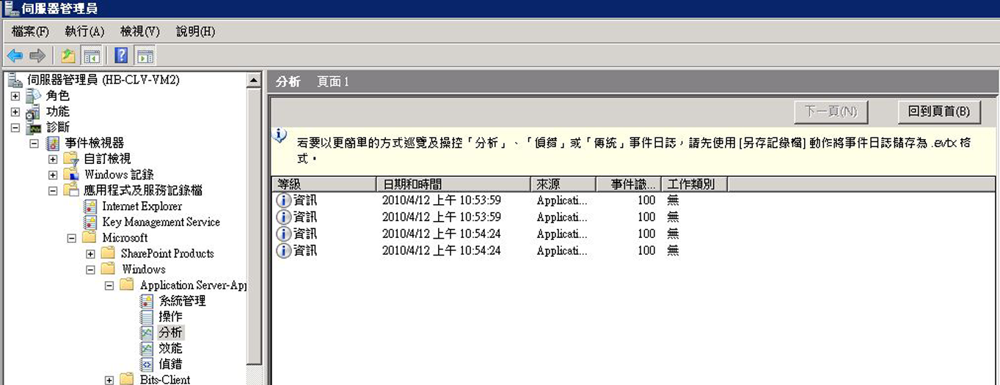

# <a name="configuring-tracking-for-a-workflow"></a><span data-ttu-id="47d83-102">設定工作流程的追蹤</span><span class="sxs-lookup"><span data-stu-id="47d83-102">Configuring Tracking for a Workflow</span></span>

<span data-ttu-id="47d83-103">工作流程可透過三種方法執行：</span><span class="sxs-lookup"><span data-stu-id="47d83-103">A workflow can execute in three ways:</span></span>

- <span data-ttu-id="47d83-104">在 <xref:System.ServiceModel.Activities.WorkflowServiceHost> 中裝載</span><span class="sxs-lookup"><span data-stu-id="47d83-104">Hosted in <xref:System.ServiceModel.Activities.WorkflowServiceHost></span></span>

- <span data-ttu-id="47d83-105">當做 <xref:System.Activities.WorkflowApplication> 執行</span><span class="sxs-lookup"><span data-stu-id="47d83-105">Executed as a <xref:System.Activities.WorkflowApplication></span></span>

- <span data-ttu-id="47d83-106">使用 <xref:System.Activities.WorkflowInvoker> 直接執行</span><span class="sxs-lookup"><span data-stu-id="47d83-106">Executed directly using <xref:System.Activities.WorkflowInvoker></span></span>

<span data-ttu-id="47d83-107">視工作流程裝載選項而定，追蹤參與者可以透過程式碼或組態檔加入。</span><span class="sxs-lookup"><span data-stu-id="47d83-107">Depending on the workflow hosting option, a tracking participant can be added either through code or through a configuration file.</span></span> <span data-ttu-id="47d83-108">本主題描述如何透過將追蹤參與者加入至 <xref:System.Activities.WorkflowApplication> 及 <xref:System.ServiceModel.Activities.WorkflowServiceHost> 來設定追蹤，以及如何在使用 <xref:System.Activities.WorkflowInvoker> 時啟用追蹤。</span><span class="sxs-lookup"><span data-stu-id="47d83-108">This topic describes how tracking is configured by adding a tracking participant to a <xref:System.Activities.WorkflowApplication> and to a <xref:System.ServiceModel.Activities.WorkflowServiceHost>, and how to enable tracking when using <xref:System.Activities.WorkflowInvoker>.</span></span>

## <a name="configuring-workflow-application-tracking"></a><span data-ttu-id="47d83-109">設定工作流程應用程式追蹤</span><span class="sxs-lookup"><span data-stu-id="47d83-109">Configuring Workflow Application Tracking</span></span>

<span data-ttu-id="47d83-110">工作流程可透過 <xref:System.Activities.WorkflowApplication> 類別來執行。</span><span class="sxs-lookup"><span data-stu-id="47d83-110">A workflow can run using the <xref:System.Activities.WorkflowApplication> class.</span></span> <span data-ttu-id="47d83-111">本主題示範如何將追蹤參與者加入至 [!INCLUDE[netfx_current_long](../../../includes/netfx-current-long-md.md)] 工作流程主機，以設定 <xref:System.Activities.WorkflowApplication> 工作流程應用程式的追蹤。</span><span class="sxs-lookup"><span data-stu-id="47d83-111">This topic demonstrates how tracking is configured for a [!INCLUDE[netfx_current_long](../../../includes/netfx-current-long-md.md)] workflow application by adding a tracking participant to the <xref:System.Activities.WorkflowApplication> workflow host.</span></span> <span data-ttu-id="47d83-112">在這種情況下，工作流程會以工作流程應用程式的形式執行。</span><span class="sxs-lookup"><span data-stu-id="47d83-112">In this case, the workflow runs as a workflow application.</span></span> <span data-ttu-id="47d83-113">您要透過程式碼 (而不是使用組態檔) 設定工作流程應用程式，而該程式碼為使用 <xref:System.Activities.WorkflowApplication> 類別的自我裝載 .exe 檔案。</span><span class="sxs-lookup"><span data-stu-id="47d83-113">You configure a workflow application through code (rather than by using a configuration file), which is a self-hosted .exe file using the <xref:System.Activities.WorkflowApplication> class.</span></span> <span data-ttu-id="47d83-114">追蹤參與者會加入做為 <xref:System.Activities.WorkflowApplication> 執行個體的延伸。</span><span class="sxs-lookup"><span data-stu-id="47d83-114">The tracking participant is added as an extension to the <xref:System.Activities.WorkflowApplication> instance.</span></span> <span data-ttu-id="47d83-115">將 <xref:System.Activities.Tracking.TrackingParticipant> 加入至 WorkflowApplication 執行個體的擴充集合，即可完成此步驟。</span><span class="sxs-lookup"><span data-stu-id="47d83-115">This is done by adding the <xref:System.Activities.Tracking.TrackingParticipant> to the extensions collection for the WorkflowApplication instance.</span></span>

<span data-ttu-id="47d83-116">若為工作流程應用程式，您可以加入 <xref:System.Activities.Tracking.EtwTrackingParticipant> 行為擴充，如下列程式碼所示。</span><span class="sxs-lookup"><span data-stu-id="47d83-116">For a workflow application, you can add the <xref:System.Activities.Tracking.EtwTrackingParticipant> behavior extension as shown in the following code.</span></span>

```csharp
LogActivity activity = new LogActivity();

WorkflowApplication instance = new WorkflowApplication(activity);
EtwTrackingParticipant trackingParticipant =
    new EtwTrackingParticipant
{

        TrackingProfile = new TrackingProfile
           {
               Name = "SampleTrackingProfile",
               ActivityDefinitionId = "ProcessOrder",
               Queries = new WorkflowInstanceQuery
               {
                  States = { "*" }
              }
          }
       };
instance.Extensions.Add(trackingParticipant);
```

### <a name="configuring-workflow-service-tracking"></a><span data-ttu-id="47d83-117">設定工作流程服務追蹤</span><span class="sxs-lookup"><span data-stu-id="47d83-117">Configuring Workflow Service Tracking</span></span>

<span data-ttu-id="47d83-118">工作流程可以公開為 WCF 服務中裝載時<xref:System.ServiceModel.Activities.WorkflowServiceHost>服務主機。</span><span class="sxs-lookup"><span data-stu-id="47d83-118">A workflow can be exposed as a WCF service when hosted in the <xref:System.ServiceModel.Activities.WorkflowServiceHost> service host.</span></span> <span data-ttu-id="47d83-119"><xref:System.ServiceModel.Activities.WorkflowServiceHost> 是用於工作流程服務的特殊 .NET ServiceHost 實作。</span><span class="sxs-lookup"><span data-stu-id="47d83-119"><xref:System.ServiceModel.Activities.WorkflowServiceHost> is a specialized .NET ServiceHost implementation for a workflow-based service.</span></span> <span data-ttu-id="47d83-120">本節說明如何為在 [!INCLUDE[netfx_current_short](../../../includes/netfx-current-short-md.md)] 中執行的 <xref:System.ServiceModel.Activities.WorkflowServiceHost> 工作流程服務設定追蹤。</span><span class="sxs-lookup"><span data-stu-id="47d83-120">This section explains how to configure tracking for a [!INCLUDE[netfx_current_short](../../../includes/netfx-current-short-md.md)] workflow service running in <xref:System.ServiceModel.Activities.WorkflowServiceHost>.</span></span> <span data-ttu-id="47d83-121">此追蹤是透過 Web.config 檔案 (適用於 Web 裝載服務) 或 App.config 檔案 (適用於裝載於獨立應用程式中的服務，例如主控台應用程式) 指定服務行為而設定的，或是透過程式碼將追蹤特定行為加入至服務主機的 <xref:System.ServiceModel.Description.ServiceDescription.Behaviors%2A> 集合而設定的。</span><span class="sxs-lookup"><span data-stu-id="47d83-121">It is configured through a Web.config file (for a Web-hosted service) or an App.config file (for a service hosted in a stand-alone application, such as a console application) by specifying a service behavior or through code by adding a tracking-specific behavior to the <xref:System.ServiceModel.Description.ServiceDescription.Behaviors%2A> collection for the service host.</span></span>

<span data-ttu-id="47d83-122">對於裝載於 <xref:System.ServiceModel.WorkflowServiceHost> 的主機，您可以使用組態檔中的 <<xref:System.Activities.Tracking.EtwTrackingParticipant>> 項目加入 `behavior`，如下列範例所示。</span><span class="sxs-lookup"><span data-stu-id="47d83-122">For a workflow service hosted in <xref:System.ServiceModel.WorkflowServiceHost>, you can add the <xref:System.Activities.Tracking.EtwTrackingParticipant> using the <`behavior`> element in a configuration file, as shown in the following example.</span></span>

```xml
<behaviors>
   <serviceBehaviors>
        <behavior>
          <etwTracking profileName="Sample Tracking Profile" />
        </behavior>
   </serviceBehaviors>
<behaviors>
```

<span data-ttu-id="47d83-123">此外，對於裝載於 <xref:System.ServiceModel.WorkflowServiceHost> 中的工作流程服務，您可以透過程式碼加入 <xref:System.Activities.Tracking.EtwTrackingParticipant> 行為擴充。</span><span class="sxs-lookup"><span data-stu-id="47d83-123">Alternatively, for a workflow service hosted in <xref:System.ServiceModel.WorkflowServiceHost>, you can add the <xref:System.Activities.Tracking.EtwTrackingParticipant> behavior extension through code.</span></span> <span data-ttu-id="47d83-124">若要加入自訂的追蹤參與者，請建立一個新的行為擴充，並將它加入至 <xref:System.ServiceModel.ServiceHost>，如下列範例程式碼所示。</span><span class="sxs-lookup"><span data-stu-id="47d83-124">To add a custom tracking participant, create a new behavior extension and add it to the <xref:System.ServiceModel.ServiceHost> as shown in the following example code.</span></span>

> [!NOTE]
> <span data-ttu-id="47d83-125">如果您想要檢視示範如何建立自訂行為項目加入自訂追蹤參與者的範例程式碼，請參閱[追蹤](../../../docs/framework/windows-workflow-foundation/samples/tracking.md)範例。</span><span class="sxs-lookup"><span data-stu-id="47d83-125">If you want to view sample code that shows how to create a custom behavior element that adds a custom tracking participant, refer to the [Tracking](../../../docs/framework/windows-workflow-foundation/samples/tracking.md) samples.</span></span>

```csharp
ServiceHost svcHost = new ServiceHost(typeof(WorkflowService), new
                                 Uri("http://localhost:8001/Sample"));
EtwTrackingBehavior trackingBehavior =
    new EtwTrackingBehavior
    {
        ProfileName = "Sample Tracking Profile"
    };
svcHost.Description.Behaviors.Add(trackingBehavior);
svcHost.Open();
```

<span data-ttu-id="47d83-126">追蹤參與者會做為行為的擴充，而加入至工作流程服務主機。</span><span class="sxs-lookup"><span data-stu-id="47d83-126">The tracking participant is added to the workflow service host as an extension to the behavior.</span></span>

<span data-ttu-id="47d83-127">下列範例程式碼示範如何從組態檔讀取追蹤設定檔。</span><span class="sxs-lookup"><span data-stu-id="47d83-127">This sample code below shows how to read a tracking profile from configuration file.</span></span>

```csharp
TrackingProfile GetProfile(string profileName, string displayName)
        {
            TrackingProfile trackingProfile = null;
            TrackingSection trackingSection = (TrackingSection)WebConfigurationManager.GetSection("system.serviceModel/tracking");
            if (trackingSection == null)
            {
                return null;
            }

            if (profileName == null)
            {
                profileName = "";
            }

            //Find the profile with the specified profile name in the list of profile found in config
            var match = from p in new List<TrackingProfile>(trackingSection.TrackingProfiles)
                        where (p.Name == profileName) && ((p.ActivityDefinitionId == displayName) || (p.ActivityDefinitionId == "*"))
                        select p;

            if (match.Count() == 0)
            {
                //return an empty profile
                trackingProfile = new TrackingProfile()
                {
                    ActivityDefinitionId = displayName
                };

            }
            else
            {
                trackingProfile = match.First();
            }

            return trackingProfile;
```

<span data-ttu-id="47d83-128">下列範例程式碼示範如何將追蹤設定檔加入至工作流程主機。</span><span class="sxs-lookup"><span data-stu-id="47d83-128">This sample code shows how to add a tracking profile to a workflow host.</span></span>

```csharp
WorkflowServiceHost workflowServiceHost = serviceHostBase as WorkflowServiceHost;
if (null != workflowServiceHost)
{
    string workflowDisplayName = workflowServiceHost.Activity.DisplayName;
    TrackingProfile trackingProfile = GetProfile(this.profileName, workflowDisplayName);
    workflowServiceHost.WorkflowExtensions.Add(()  => new EtwTrackingParticipant {
        TrackingProfile = trackingProfile
    });
 }
```

> [!NOTE]
> <span data-ttu-id="47d83-129">如需有關追蹤設定檔的詳細資訊，請參閱[追蹤設定檔](https://go.microsoft.com/fwlink/?LinkId=201310)。</span><span class="sxs-lookup"><span data-stu-id="47d83-129">For more information on tracking profiles, refer to [Tracking Profiles](https://go.microsoft.com/fwlink/?LinkId=201310).</span></span>

### <a name="configuring-tracking-using-workflowinvoker"></a><span data-ttu-id="47d83-130">使用 WorkflowInvoker 設定追蹤</span><span class="sxs-lookup"><span data-stu-id="47d83-130">Configuring tracking using WorkflowInvoker</span></span>

<span data-ttu-id="47d83-131">若要為使用 <xref:System.Activities.WorkflowInvoker> 執行的工作流程設定追蹤，請加入追蹤提供者做為 <xref:System.Activities.WorkflowInvoker> 執行個體的延伸。</span><span class="sxs-lookup"><span data-stu-id="47d83-131">To configure tracking for a workflow executed using <xref:System.Activities.WorkflowInvoker>, add the tracking provider as an extension to a <xref:System.Activities.WorkflowInvoker> instance.</span></span> <span data-ttu-id="47d83-132">下列程式碼範例取自[自訂追蹤](../../../docs/framework/windows-workflow-foundation/samples/custom-tracking.md)範例。</span><span class="sxs-lookup"><span data-stu-id="47d83-132">The following code example is from the [Custom Tracking](../../../docs/framework/windows-workflow-foundation/samples/custom-tracking.md) sample.</span></span>

```csharp
WorkflowInvoker invoker = new WorkflowInvoker(BuildSampleWorkflow());
invoker.Extensions.Add(customTrackingParticipant);
invoker.Invoke();
```

### <a name="viewing-tracking-records-in-event-viewer"></a><span data-ttu-id="47d83-133">在事件檢視器中檢視追蹤記錄</span><span class="sxs-lookup"><span data-stu-id="47d83-133">Viewing tracking records in Event Viewer</span></span>

<span data-ttu-id="47d83-134">追蹤 WF 執行時，可以檢視兩個相關性特別大的事件檢視器記錄：分析記錄和偵錯記錄。</span><span class="sxs-lookup"><span data-stu-id="47d83-134">There are two Event Viewer logs of particular interest to view when tracking WF execution - the Analytic log and the Debug log.</span></span> <span data-ttu-id="47d83-135">都是位在 Microsoft&#124;Windows&#124;應用程式伺服器-應用程式節點。</span><span class="sxs-lookup"><span data-stu-id="47d83-135">Both reside under the Microsoft&#124;Windows&#124;Application Server-Applications node.</span></span> <span data-ttu-id="47d83-136">這個區段中的記錄包含單一應用程式的事件，而不包含對整個系統有影響的事件。</span><span class="sxs-lookup"><span data-stu-id="47d83-136">Logs within this section contain events from a single application rather than events that have an impact on the entire system.</span></span>

<span data-ttu-id="47d83-137">偵錯追蹤事件會寫入到偵錯記錄中。</span><span class="sxs-lookup"><span data-stu-id="47d83-137">Debug trace events are written to the Debug Log.</span></span> <span data-ttu-id="47d83-138">若要收集事件檢視器中的 WF 偵錯追蹤事件，請啟用偵錯記錄。</span><span class="sxs-lookup"><span data-stu-id="47d83-138">To collect WF debug trace events in the Event Viewer, enable the Debug Log.</span></span>

1. <span data-ttu-id="47d83-139">若要開啟 事件檢視器，請按一下**開始**，然後按一下 **執行。**</span><span class="sxs-lookup"><span data-stu-id="47d83-139">To open Event Viewer, click **Start**, and then click **Run.**</span></span> <span data-ttu-id="47d83-140">在 [執行] 對話方塊中，輸入`eventvwr`。</span><span class="sxs-lookup"><span data-stu-id="47d83-140">In the Run dialog, type `eventvwr`.</span></span>

2. <span data-ttu-id="47d83-141">在 [事件檢視器] 對話方塊中，依序展開**Applications and Services Logs**節點。</span><span class="sxs-lookup"><span data-stu-id="47d83-141">In the Event Viewer dialog, expand the **Applications and Services Logs** node.</span></span>

3. <span data-ttu-id="47d83-142">依序展開**Microsoft**， **Windows**，並**應用程式伺服器-應用程式**節點。</span><span class="sxs-lookup"><span data-stu-id="47d83-142">Expand the **Microsoft**, **Windows**, and **Application Server-Applications** nodes.</span></span>

4. <span data-ttu-id="47d83-143">以滑鼠右鍵按一下**偵錯**下方的節點**應用程式伺服器-應用程式**節點，然後選取**啟用記錄**。</span><span class="sxs-lookup"><span data-stu-id="47d83-143">Right-click the **Debug** node under the **Application Server-Applications** node, and select **Enable Log**.</span></span>

5. <span data-ttu-id="47d83-144">執行可啟用追蹤的應用程式，以產生追蹤事件。</span><span class="sxs-lookup"><span data-stu-id="47d83-144">Execute your tracing-enabled application to generate tracing events.</span></span>

6. <span data-ttu-id="47d83-145">以滑鼠右鍵按一下**偵錯**節點，然後選取**重新整理。**</span><span class="sxs-lookup"><span data-stu-id="47d83-145">Right-click the **Debug** node and select **Refresh.**</span></span> <span data-ttu-id="47d83-146">追蹤事件應該會顯示在中央窗格中。</span><span class="sxs-lookup"><span data-stu-id="47d83-146">Tracing events should be visible in the center pane.</span></span>

<span data-ttu-id="47d83-147">WF 4 提供將追蹤記錄寫入至 ETW (Windows 事件追蹤) 工作階段的追蹤參與者。</span><span class="sxs-lookup"><span data-stu-id="47d83-147">WF 4 provides a tracking participant that writes tracking records to an ETW (Event Tracing for Windows) session.</span></span> <span data-ttu-id="47d83-148">ETW 追蹤參與者會設定追蹤設定檔來訂閱追蹤記錄。</span><span class="sxs-lookup"><span data-stu-id="47d83-148">The ETW tracking participant is configured with a tracking profile to subscribe to tracking records.</span></span> <span data-ttu-id="47d83-149">當啟用追蹤時，會向 ETW 發出錯誤追蹤記錄。</span><span class="sxs-lookup"><span data-stu-id="47d83-149">When tracking is enabled, errors tracking records are emitted to ETW.</span></span> <span data-ttu-id="47d83-150">對應至由 ETW 追蹤參與者所發出之追蹤事件的 ETW 追蹤事件 (範圍在 100-113 之間) 會寫入到分析記錄中。</span><span class="sxs-lookup"><span data-stu-id="47d83-150">ETW tracking events (between the range of 100-113) corresponding to the tracking events emitted by the ETW tracking participant are written to the Analytic Log.</span></span>

<span data-ttu-id="47d83-151">若要檢視追蹤記錄，請遵循下列步驟。</span><span class="sxs-lookup"><span data-stu-id="47d83-151">To view tracking records, follow these steps.</span></span>

1. <span data-ttu-id="47d83-152">若要開啟 事件檢視器，請按一下**開始**，然後按一下 **執行。**</span><span class="sxs-lookup"><span data-stu-id="47d83-152">To open Event Viewer, click **Start**, and then click **Run.**</span></span> <span data-ttu-id="47d83-153">在 [執行] 對話方塊中，輸入`eventvwr`。</span><span class="sxs-lookup"><span data-stu-id="47d83-153">In the Run dialog, type `eventvwr`.</span></span>

2. <span data-ttu-id="47d83-154">在 [事件檢視器] 對話方塊中，依序展開**Applications and Services Logs**節點。</span><span class="sxs-lookup"><span data-stu-id="47d83-154">In the Event Viewer dialog, expand the **Applications and Services Logs** node.</span></span>

3. <span data-ttu-id="47d83-155">依序展開**Microsoft**， **Windows**，並**應用程式伺服器-應用程式**節點。</span><span class="sxs-lookup"><span data-stu-id="47d83-155">Expand the **Microsoft**, **Windows**, and **Application Server-Applications** nodes.</span></span>

4. <span data-ttu-id="47d83-156">以滑鼠右鍵按一下**分析**下方的節點**應用程式伺服器-應用程式**節點，然後選取**啟用記錄**。</span><span class="sxs-lookup"><span data-stu-id="47d83-156">Right-click the **Analytic** node under the **Application Server-Applications** node, and select **Enable Log**.</span></span>

5. <span data-ttu-id="47d83-157">執行您的啟用追蹤的應用程式，以產生追蹤記錄。</span><span class="sxs-lookup"><span data-stu-id="47d83-157">Execute your tracking-enabled application to generate tracking records.</span></span>

6. <span data-ttu-id="47d83-158">以滑鼠右鍵按一下**分析**節點，然後選取**重新整理。**</span><span class="sxs-lookup"><span data-stu-id="47d83-158">Right-click the **Analytic** node and select **Refresh.**</span></span> <span data-ttu-id="47d83-159">追蹤記錄應該會顯示在中央窗格中。</span><span class="sxs-lookup"><span data-stu-id="47d83-159">Tracking records should be visible in the center pane.</span></span>

<span data-ttu-id="47d83-160">下圖顯示事件檢視器中的追蹤事件。</span><span class="sxs-lookup"><span data-stu-id="47d83-160">The following image shows tracking events in the event viewer.</span></span>

<span data-ttu-id="47d83-161"></span><span class="sxs-lookup"><span data-stu-id="47d83-161"></span></span>

### <a name="registering-an-application-specific-provider-id"></a><span data-ttu-id="47d83-162">註冊應用程式特定的提供者識別碼</span><span class="sxs-lookup"><span data-stu-id="47d83-162">Registering an application-specific provider ID</span></span>

<span data-ttu-id="47d83-163">如果事件必須寫入至特定應用程式記錄檔，請遵循下列步驟註冊新提供者資訊清單。</span><span class="sxs-lookup"><span data-stu-id="47d83-163">If events need to be written to a specific application log, follow these steps to register the new provider manifest.</span></span>

1. <span data-ttu-id="47d83-164">在應用程式的組態檔中宣告提供者識別碼。</span><span class="sxs-lookup"><span data-stu-id="47d83-164">Declare the provider ID in the application configuration file.</span></span>

    ```xml
    <system.serviceModel>
        <diagnostics etwProviderId="2720e974-9fe9-477a-bb60-81fe3bf91eec"/>
    </system.serviceModel>
    ```

2. <span data-ttu-id="47d83-165">資訊清單檔案複製 %windir%\Microsoft.NET\Framework\\< 的最新版本[!INCLUDE[netfx_current_short](../../../includes/netfx-current-short-md.md)]> \Microsoft.Windows.ApplicationServer.Applications.man 到暫存位置，並重新命名為Microsoft.windows.applicationserver.applications_provider1.man。</span><span class="sxs-lookup"><span data-stu-id="47d83-165">Copy the manifest file from %windir%\Microsoft.NET\Framework\\<latest version of [!INCLUDE[netfx_current_short](../../../includes/netfx-current-short-md.md)]>\Microsoft.Windows.ApplicationServer.Applications.man to a temporary location, and rename it to Microsoft.Windows.ApplicationServer.Applications_Provider1.man</span></span>

3. <span data-ttu-id="47d83-166">將資訊清單檔中的 GUID 變更為新的 GUID。</span><span class="sxs-lookup"><span data-stu-id="47d83-166">Change the GUID in the manifest file to the new GUID.</span></span>

    ```xml
    <provider name="Microsoft-Windows-Application Server-Applications" guid="{2720e974-9fe9-477a-bb60-81fe3bf91eec}"
    ```

4. <span data-ttu-id="47d83-167">如果您不要解除安裝預設提供者，請變更提供者名稱。</span><span class="sxs-lookup"><span data-stu-id="47d83-167">Change the provider name if you do not want to uninstall the default provider.</span></span>

    ```xml
    <provider name="Microsoft-Windows-Application Server-Applications" guid="{2720e974-9fe9-477a-bb60-81fe3bf91eec}"
    ```

5. <span data-ttu-id="47d83-168">如果您在上一個步驟中變更提供者名稱，請將資訊清單檔中的通道名稱變更為新的提供者名稱。</span><span class="sxs-lookup"><span data-stu-id="47d83-168">If you changed the provider name in the previous step, change the channel names in the manifest file to the new provider name.</span></span>

    ```xml
    <channel name="Microsoft-Windows-Application Server-Applications_Provider1/Admin" chid="ADMIN_CHANNEL" symbol="ADMIN_CHANNEL" type="Admin" enabled="false" isolation="Application" message="$(string.MICROSOFT_WINDOWS_APPLICATIONSERVER_APPLICATIONS.channel.ADMIN_CHANNEL.message)" />
    <channel name="Microsoft-Windows-Application Server-Applications_Provider1/Operational" chid="OPERATIONAL_CHANNEL" symbol="OPERATIONAL_CHANNEL" type="Operational" enabled="false" isolation="Application" message="$(string.MICROSOFT_WINDOWS_APPLICATIONSERVER_APPLICATIONS.channel.OPERATIONAL_CHANNEL.message)" />
    <channel name="Microsoft-Windows-Application Server-Applications_Provider1/Analytic" chid="ANALYTIC_CHANNEL" symbol="ANALYTIC_CHANNEL" type="Analytic" enabled="false" isolation="Application" message="$(string.MICROSOFT_WINDOWS_APPLICATIONSERVER_APPLICATIONS.channel.ANALYTIC_CHANNEL.message)" />
    <channel name="Microsoft-Windows-Application Server-Applications_Provider1/Debug" chid="DEBUG_CHANNEL" symbol="DEBUG_CHANNEL" type="Debug" enabled="false" isolation="Application" message="$(string.MICROSOFT_WINDOWS_APPLICATIONSERVER_APPLICATIONS.channel.DEBUG_CHANNEL.message)" />
    <channel name="Microsoft-Windows-Application Server-Applications_Provider1/Perf" chid="PERF_CHANNEL" symbol="PERF_CHANNEL" type="Analytic" enabled="false" isolation="Application" message="$(string.MICROSOFT_WINDOWS_APPLICATIONSERVER_APPLICATIONS.channel.PERF_CHANNEL.message)" />
    ```

6. <span data-ttu-id="47d83-169">遵循下列步驟產生資源 DLL。</span><span class="sxs-lookup"><span data-stu-id="47d83-169">Generate the resource DLL by following these steps.</span></span>

    1. <span data-ttu-id="47d83-170">安裝 Windows SDK。</span><span class="sxs-lookup"><span data-stu-id="47d83-170">Install the Windows SDK.</span></span> <span data-ttu-id="47d83-171">Windows SDK 包含訊息編輯器 ([mc.exe](https://go.microsoft.com/fwlink/?LinkId=184606)) 和資源編輯器 ([rc.exe](https://go.microsoft.com/fwlink/?LinkId=184605))。</span><span class="sxs-lookup"><span data-stu-id="47d83-171">The Windows SDK includes the message compiler ([mc.exe](https://go.microsoft.com/fwlink/?LinkId=184606)) and resource compiler ([rc.exe](https://go.microsoft.com/fwlink/?LinkId=184605)).</span></span>

    2. <span data-ttu-id="47d83-172">在 Windows SDK 命令提示字元中，對新的資訊清單檔執行 mc.exe。</span><span class="sxs-lookup"><span data-stu-id="47d83-172">In a Windows SDK command prompt, run mc.exe on the new manifest file.</span></span>

        ```console
        mc.exe Microsoft.Windows.ApplicationServer.Applications_Provider1.man
        ```

    3. <span data-ttu-id="47d83-173">對上一個步驟中產生的資源檔執行 rc.exe。</span><span class="sxs-lookup"><span data-stu-id="47d83-173">Run rc.exe on the resource file generated in the previous step.</span></span>

        ```console
        rc.exe  Microsoft.Windows.ApplicationServer.Applications_Provider1.rc
        ```

    4. <span data-ttu-id="47d83-174">建立名為 NewProviderReg.cs 的空白 cs 檔案。</span><span class="sxs-lookup"><span data-stu-id="47d83-174">Create an empty cs file called NewProviderReg.cs.</span></span>

    5. <span data-ttu-id="47d83-175">使用 C# 編輯器建立資源 DLL。</span><span class="sxs-lookup"><span data-stu-id="47d83-175">Create a resource DLL using the C# compiler.</span></span>

        ```console
        csc /target:library /win32res:Microsoft.Windows.ApplicationServer.Applications_Provider1.res NewProviderReg.cs /out:Microsoft.Windows.ApplicationServer.Applications_Provider1.dll
        ```

    6. <span data-ttu-id="47d83-176">變更從資訊清單檔中的資源和訊息 dll 名稱`Microsoft.Windows.ApplicationServer.Applications.Provider1.man`為新的 dll 名稱。</span><span class="sxs-lookup"><span data-stu-id="47d83-176">Change the resource and message dll name in the manifest file from `Microsoft.Windows.ApplicationServer.Applications.Provider1.man` to the new dll name.</span></span>

        ```xml
        <provider name="Microsoft-Windows-Application Server-Applications_Provider1" guid="{2720e974-9fe9-477a-bb60-81fe3bf91eec}" symbol="Microsoft_Windows_ApplicationServer_ApplicationEvents" resourceFileName="<dll directory>\Microsoft.Windows.ApplicationServer.Applications_Provider1.dll" messageFileName="<dll directory>\Microsoft.Windows.ApplicationServer.Applications_Provider1.dll">
        ```

    7. <span data-ttu-id="47d83-177">使用[wevtutil](https://go.microsoft.com/fwlink/?LinkId=184608)註冊資訊清單。</span><span class="sxs-lookup"><span data-stu-id="47d83-177">Use [wevtutil](https://go.microsoft.com/fwlink/?LinkId=184608) to register the manifest.</span></span>

        ```console
        wevtutil im Microsoft.Windows.ApplicationServer.Applications_Provider1.man
        ```

## <a name="see-also"></a><span data-ttu-id="47d83-178">另請參閱</span><span class="sxs-lookup"><span data-stu-id="47d83-178">See also</span></span>

- [<span data-ttu-id="47d83-179">Windows Server App Fabric 監控</span><span class="sxs-lookup"><span data-stu-id="47d83-179">Windows Server App Fabric Monitoring</span></span>](https://go.microsoft.com/fwlink/?LinkId=201273)
- [<span data-ttu-id="47d83-180">使用 App Fabric 監控應用程式</span><span class="sxs-lookup"><span data-stu-id="47d83-180">Monitoring Applications with App Fabric</span></span>](https://go.microsoft.com/fwlink/?LinkId=201275)
