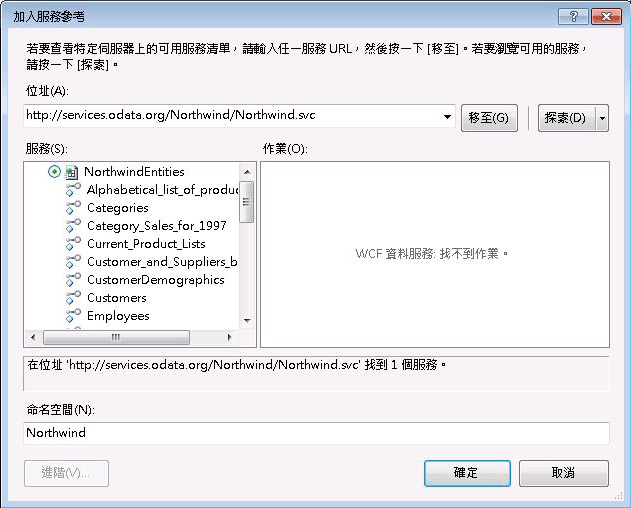

# 從流程中使用 OData 摘要
WCF 資料服務是 [!INCLUDE[dnprdnshort](../../../includes/dnprdnshort-md.md)] 的一個元件，可讓您建立使用 Open Data Protocol (OData) 的服務，利用具像狀態傳輸 (REST) 的語意透過 Web 或內部網路公開及取用資料。 OData 會將資料公開為可由 URI 定址的資源。 任何可以傳送 HTTP 要求並處理資料服務傳回之 OData 摘要的應用程式，都可以與 OData 型資料服務互動。 此外，WCF 資料服務也包含用戶端程式庫，在您從 [!INCLUDE[dnprdnshort](../../../includes/dnprdnshort-md.md)] 應用程式取用 OData 摘要時，可為您提供更豐富的程式設計體驗。 本主題提供在工作流程中取用 OData 摘要的概觀 (不論有沒有使用用戶端程式庫)。  
  
## 使用範例 Northwind OData 服務  
 本主題中的範例使用範例 Northwind 資料服務位於[ http://services.odata.org/Northwind/Northwind.svc/ ](http://go.microsoft.com/fwlink/?LinkID=187426)。 這項服務是 [OData SDK](http://go.microsoft.com/fwlink/?LinkID=185248) 的一部分，而且會提供範例 Northwind 資料庫的唯讀存取。 如果需要寫入存取或者需要本機 WCF 資料服務，您可以遵循 [WCF 資料服務快速入門](http://go.microsoft.com/fwlink/?LinkID=131076) 的步驟，建立本機 OData 服務來提供 Northwind 資料庫的存取。 如果您遵循快速入門的步驟，請使用本機 URI 來替代本主題的範例程式碼所提供的 URI。  
  
## 使用用戶端程式庫取用 OData 摘要  
 WCF 資料服務包含用戶端程式庫，可讓您更輕鬆地從 [!INCLUDE[dnprdnshort](../../../includes/dnprdnshort-md.md)] 和用戶端應用程式取用 OData 摘要。 這些程式庫會簡化 HTTP 訊息的傳送與接收。 他們也會將訊息承載轉譯為代表實體資料的 CLR 物件。 用戶端程式庫具有兩個核心類別： <xref:System.Data.Services.Client.DataServiceContext> 和 <xref:System.Data.Services.Client.DataServiceQuery%601>。 這些類別可讓您查詢資料服務，然後使用傳回的實體資料當做 CLR 物件。 本章節包含了建立活動來使用用戶端程式庫的兩個方法。  
  
### 加入 WCF 資料服務的服務參考  
 若要產生 Northwind 用戶端程式庫，您可以使用 **中的 [** 加入服務參考 [!INCLUDE[vs_current_long](../../../includes/vs-current-long-md.md)] ] 對話方塊，加入 Northwind OData 服務的參考。  
  
   
  
 請注意，此服務不會公開任何服務作業，而且 [ **服務** ] 清單中有項目代表 Northwind 資料服務所公開的實體。 當加入服務參考時，將會針對這些實體產生類別，而且這些類別可用於用戶端程式碼。 本主題的範例會使用這些類別和 `NorthwindEntities` 類別來執行查詢。  
  
> [!NOTE]
>  如需詳細資訊，請參閱[產生資料服務用戶端程式庫 (WCF Data Services)](http://go.microsoft.com/fwlink/?LinkID=191611)。  
  
### 使用非同步方法  
 為了對付透過 Web 存取資源時可能發生的延遲問題，我們建議您以非同步方式存取 WCF 資料服務。 WCF 資料服務用戶端程式庫包含叫用查詢的非同步方法，並提供 Windows Workflow Foundation (WF)<xref:System.Activities.AsyncCodeActivity>類別，可撰寫非同步活動。 您可以撰寫<xref:System.Activities.AsyncCodeActivity> 衍生活動，以利用具有非同步方法的 [!INCLUDE[dnprdnshort](../../../includes/dnprdnshort-md.md)] 類別，或者可以將要非同步執行的程式碼放在方法中，然後使用委派來叫用此程式碼。 本章節提供 <xref:System.Activities.AsyncCodeActivity> 衍生活動的兩個範例，一個範例會使用 WCF 資料服務用戶端程式庫的非同步方法，另一個範例則使用委派。  
  
> [!NOTE]
>  如需詳細資訊，請參閱[非同步作業 (WCF Data Services)](http://go.microsoft.com/fwlink/?LinkId=193396)和[建立非同步活動](../../../docs/framework/windows-workflow-foundation/creating-asynchronous-activities-in-wf.md)。  
  
### 使用用戶端程式庫非同步方法  
 <xref:System.Data.Services.Client.DataServiceQuery%601> 類別會提供 <xref:System.Data.Services.Client.DataServiceQuery%601.BeginExecute%2A> 和 <xref:System.Data.Services.Client.DataServiceQuery%601.EndExecute%2A> 方法，以非同步方式查詢 OData 服務。 這些方法可以從 <xref:System.Activities.AsyncCodeActivity.BeginExecute%2A> 衍生類別的 <xref:System.Activities.AsyncCodeActivity.EndExecute%2A> 和 <xref:System.Activities.AsyncCodeActivity> 覆寫來呼叫。 當 <xref:System.Activities.AsyncCodeActivity> <xref:System.Activities.AsyncCodeActivity.BeginExecute%2A> 覆寫傳回時，工作流程可以進入閒置狀態 (但不會持久)，而且當非同步工作完成時，執行階段會叫用 <xref:System.Activities.AsyncCodeActivity.EndExecute%2A> 。  
  
 下列範例會定義具有兩個輸入引數的 `OrdersByCustomer` 活動。 `CustomerId` 引數代表可識別要傳回哪些訂單的客戶，而 `ServiceUri` 引數則代表要查詢之 OData 服務的 URI。 因為此活動衍生自 `AsyncCodeActivity<IEnumerable<Order>>` ，所以也會有一個 <xref:System.Activities.Activity%601.Result%2A> 輸出引數用來傳回查詢的結果。 <xref:System.Activities.AsyncCodeActivity.BeginExecute%2A> 覆寫會建立一個 LINQ 查詢，此查詢會選取指定之客戶的所有訂單。 這個查詢會指定為傳遞之 <xref:System.Activities.AsyncCodeActivityContext.UserState%2A> 的 <xref:System.Activities.AsyncCodeActivityContext>，然後會呼叫此查詢的 <xref:System.Data.Services.Client.DataServiceQuery%601.BeginExecute%2A> 方法。 請注意，傳入查詢之 <xref:System.Data.Services.Client.DataServiceQuery%601.BeginExecute%2A> 中的回呼和狀態為傳入活動之 <xref:System.Activities.AsyncCodeActivity.BeginExecute%2A> 方法中的回呼和狀態。 當查詢執行完之後，就會叫用此活動的 <xref:System.Activities.AsyncCodeActivity.EndExecute%2A> 方法。 此查詢擷取自 <xref:System.Activities.AsyncCodeActivityContext.UserState%2A>，然後會呼叫此查詢的 <xref:System.Data.Services.Client.DataServiceQuery%601.EndExecute%2A> 方法。 這個方法會傳回指定之實體型別的 <xref:System.Collections.Generic.IEnumerable%601> ，也就是此案例中的 `Order`。 因為 `IEnumerable<Order>` 是 <xref:System.Activities.AsyncCodeActivity%601>的泛型型別，所以這個 `IEnumerable` 會設定為活動的 <xref:System.Activities.Activity%601.Result%2A> <xref:System.Activities.OutArgument%601> 。  
  
 [!code-csharp[CFX_WCFDataServicesActivityExample#100](../../../samples/snippets/csharp/VS_Snippets_CFX/CFX_WCFDataServicesActivityExample/cs/Program.cs#100)]  
  
 在下列範例中， `OrdersByCustomer` 活動會擷取指定之客戶的訂單清單，然後 <xref:System.Activities.Statements.ForEach%601> 活動會列舉傳回的訂單，並將每一筆訂單的日期寫入主控台。  
  
 [!code-csharp[CFX_WCFDataServicesActivityExample#10](../../../samples/snippets/csharp/VS_Snippets_CFX/CFX_WCFDataServicesActivityExample/cs/Program.cs#10)]  
  
 當叫用這個工作流程時，下列資料會寫入主控台：  
  
 **呼叫 WCF 資料服務...**  
**8/25/1997**   
**10/3/1997**   
**10/13/1997**   
**1/15/1998**   
**3/16/1998**   
**4/9/1998**    
> [!NOTE]
>  如果無法建立與 OData 伺服器之間的連接，您將會得到類似以下的例外狀況：  
>   
>  未處理的例外狀況: System.InvalidOperationException: 處理這個要求時發生錯誤。 ---> System.Net.WebException: 無法連接至遠端伺服器 ---> System.Net.Sockets.SocketException: 連線嘗試失敗，因為連線對象有一段時間未正確回應，或是已建立的連線失敗，因為已連線的主機未回應。  
  
 如果需要額外處理此查詢所傳回的資料，則可以在活動的 <xref:System.Activities.AsyncCodeActivity%601.EndExecute%2A> 覆寫中完成。 <xref:System.Activities.AsyncCodeActivity%601.BeginExecute%2A> 和 <xref:System.Activities.AsyncCodeActivity%601.EndExecute%2A> 都是使用工作流程執行緒來叫用，而且這些覆寫中的任何程式碼都不會以非同步方式執行。 如果額外處理的工作過於密集或執行時間很長，或者查詢結果需分頁處理，您應該考慮使用下一節所討論的方法，該方法會使用委派來執行查詢，並以非同步方式執行額外處理工作。  
  
### 使用委派  
 除了叫用 [!INCLUDE[dnprdnshort](../../../includes/dnprdnshort-md.md)] 類別的非同步方法以外，以 <xref:System.Activities.AsyncCodeActivity>為基礎的活動也可以在它的其中一個方法內定義非同步邏輯。 這個方法的指定方式是使用活動之 <xref:System.Activities.AsyncCodeActivity.BeginExecute%2A> 覆寫中的委派。 當此方法傳回時，執行階段會叫用此活動的 <xref:System.Activities.AsyncCodeActivity.EndExecute%2A> 覆寫。 從工作流程呼叫 OData 服務時，這個方法可用來查詢此服務，並提供任何額外的處理工作。  
  
 在下列範例中，會定義 `ListCustomers` 活動。 這個活動會查詢範例 Northwind 資料服務，並傳回 `List<Customer>` ，其中包含了 Northwind 資料庫中的所有客戶。 非同步工作是由 `GetCustomers` 方法所執行。 這個方法會查詢此服務中的所有客戶，然後將這些客戶複製到 `List<Customer>`。 接著它會檢查結果是否分頁。 如果是的話，它會查詢此服務中的下一頁結果、將這些結果加入至清單中，並繼續進行，直到擷取所有客戶資料為止。  
  
> [!NOTE]
>  如需 WCF Data Services 中的分頁的詳細資訊，請參閱。 [如何：載入分頁結果 (WCF 資料服務)](http://go.microsoft.com/fwlink/?LinkId=193452)。  
  
 一旦加入所有客戶之後，就會傳回清單。 `GetCustomers` 方法會指定於活動的 <xref:System.Activities.AsyncCodeActivity.BeginExecute%2A> 覆寫中。 因為此方法具有傳回值，所以會建立 `Func<string, List<Customer>>` 來指定此方法。  
  
> [!NOTE]
>  如果執行非同步工作的方法沒有傳回值，則會使用 <xref:System.Action> 而非 <!--zz <xref:System.Func> --> `System.Func`。 建立使用這兩種方法的非同步範例的範例，請參閱[建立非同步活動](../../../docs/framework/windows-workflow-foundation/creating-asynchronous-activities-in-wf.md)。  
  
 這個 <!--zz <xref:System.Func> --> `System.Func` 會指派給 <xref:System.Activities.AsyncCodeActivityContext.UserState%2A>，然後呼叫 `BeginInvoke` 。 因為要叫用的方法無法存取此活動的引數環境，所以 `ServiceUri` 引數的值會當做第一個參數來傳遞，連同之前傳入 <xref:System.Activities.AsyncCodeActivity.BeginExecute%2A>中的回呼和狀態。 當 `GetCustomers` 傳回時，執行階段會叫用 <xref:System.Activities.AsyncCodeActivity.EndExecute%2A>。 <xref:System.Activities.AsyncCodeActivity.EndExecute%2A> 中的程式碼會從 <xref:System.Activities.AsyncCodeActivityContext.UserState%2A>擷取委派、呼叫 `EndInvoke`並傳回結果，也就是從 `GetCustomers` 方法傳回的客戶清單。  
  
 [!code-csharp[CFX_WCFDataServicesActivityExample#200](../../../samples/snippets/csharp/VS_Snippets_CFX/CFX_WCFDataServicesActivityExample/cs/Program.cs#200)]  
  
 在下列範例中， `ListCustomers` 活動會擷取客戶清單，然後 <xref:System.Activities.Statements.ForEach%601> 活動會列舉這些客戶，並將每一位客戶的公司名稱和連絡人名稱寫入主控台。  
  
 [!code-csharp[CFX_WCFDataServicesActivityExample#20](../../../samples/snippets/csharp/VS_Snippets_CFX/CFX_WCFDataServicesActivityExample/cs/Program.cs#20)]  
  
 當叫用這個工作流程時，下列資料會寫入主控台。 這個查詢會傳回許多客戶，所以這裡只顯示一部分的輸出。  
  
 **呼叫 WCF 資料服務...**  
**Alfreds Futterkiste, Contact: Maria Anders**   
**Ana Trujillo Emparedados y helados, Contact: Ana Trujillo**   
**Antonio Moreno Taquería，連絡人： Antonio Moreno**   
**Around the Horn, Contact: Thomas Hardy**   
**Berglunds snabbköp，連絡人： Christina Berglund**   
**...**    
## 取用 OData 摘要而不使用用戶端程式庫  
 OData 會將資料公開為可由 URI 定址的資源。 當您使用用戶端程式庫時，將會為您建立這些 URI，但是您不必使用用戶端程式庫。 您可以視需要直接存取 OData 服務，而不使用用戶端程式庫。 當您未使用用戶端程式庫時，此服務的位置和所需的資料會由 URI 所指定，而且會傳回結果來回應 HTTP 要求。 然後可以依照所需的方式來處理或操作這些未經處理資料。 擷取 OData 查詢結果的一個方式就是使用 <xref:System.Net.WebClient> 類別。 在這個範例中，將會擷取以索引鍵 ALFKI 代表之客戶的連絡人名稱。  
  
 [!code-csharp[CFX_WCFDataServicesActivityExample#2](../../../samples/snippets/csharp/VS_Snippets_CFX/CFX_WCFDataServicesActivityExample/cs/Program.cs#2)]  
  
 當執行這段程式碼時，主控台會顯示下列輸出：  
  
 **傳回原始的資料：**  
**\<？ xml 版本 ="1.0"encoding ="utf-8"獨立 ="yes"？ >**   
**\<ContactName xmlns ="http://schemas.microsoft.com/ado/2007/08/dataservices"> Maria Anders\</ContactName >** 在工作流程，此範例的程式碼可能會併入<xref:System.Activities.CodeActivity.Execute%2A>覆寫<xref:System.Activities.CodeActivity>-型自訂活動，但相同功能也可以使用來完成<xref:System.Activities.Expressions.InvokeMethod%601>活動。 <xref:System.Activities.Expressions.InvokeMethod%601> 活動會讓工作流程作者叫用類別的靜態和執行個體方法，也可以選擇非同步叫用指定的方法。 下列範例會設定 <xref:System.Activities.Expressions.InvokeMethod%601> 活動來呼叫 <xref:System.Net.WebClient.DownloadString%2A> 類別的 <xref:System.Net.WebClient> 方法，並傳回客戶清單。  
  
 [!code-csharp[CFX_WCFDataServicesActivityExample#3](../../../samples/snippets/csharp/VS_Snippets_CFX/CFX_WCFDataServicesActivityExample/cs/Program.cs#3)]  
  
 <xref:System.Activities.Expressions.InvokeMethod%601> 可以同時呼叫某個類別的靜態與執行個體方法。 由於 <xref:System.Net.WebClient.DownloadString%2A> 是 <xref:System.Net.WebClient> 類別的執行個體方法，因此會為 <xref:System.Net.WebClient> 指定 <xref:System.Activities.Expressions.InvokeMethod%601.TargetObject%2A>類別的新執行個體。 `DownloadString` 會被指定為 <xref:System.Activities.Expressions.InvokeMethod%601.MethodName%2A>、包含查詢的 URI 指定在 <xref:System.Activities.Expressions.InvokeMethod%601.Parameters%2A> 集合中，而傳回值會指派給 <xref:System.Activities.Activity%601.Result%2A> 值。 <xref:System.Activities.Expressions.InvokeMethod%601.RunAsynchronously%2A> 值會設定為 `true`，這表示方法引動過程將會以非同步方式執行 (與工作流程有關)。 下列範例會建構使用 <xref:System.Activities.Expressions.InvokeMethod%601> 活動的工作流程來查詢範例 Northwind 資料服務，以找出特定客戶的訂單清單，然後將傳回的資料寫入主控台。  
  
 [!code-csharp[CFX_WCFDataServicesActivityExample#1](../../../samples/snippets/csharp/VS_Snippets_CFX/CFX_WCFDataServicesActivityExample/cs/Program.cs#1)]  
  
 當叫用這個工作流程時，主控台就會顯示下列輸出。 這個查詢會傳回多筆訂單，所以這裡只顯示一部分的輸出。  
  
 **呼叫 WCF 資料服務...**  
**Raw data returned:**   
**\<？ xml 版本 ="1.0"encoding ="utf-8"獨立 ="yes"？ >**   
**\<摘要**   
 **xml: base ="http://services.odata.org/Northwind/Northwind.svc/"**  
 **xmlns:d ="http://schemas.microsoft.com/ado/2007/08/dataservices"**  
 **xmlns:m ="http://schemas.microsoft.com/ado/2007/08/dataservices/metadata"**  
 **xmlns ="http://www.w3.org/2005/Atom">**  
 **\<標題 類型 ="text"> 訂單 \< /標題 >**  
 **\<識別碼>http://services.odata.org/Northwind/Northwind.svc/Customers('ALFKI')/排序\</id>**  
 **\<更新 > 2010年-05-19T19:37:07Z\</ 更新 >**  
 **\<連結 rel ="本身"title ="Orders"href ="Orders"/ >**  
 **\<項目 >**  
 **\<識別碼 >http://services.odata.org/Northwind/Northwind.svc/Orders(10643)\</id >**  
 **\<標題 類型 ="text"> \< /標題 >**  
 **\<更新 > 2010年-05-19T19:37:07Z\</ 更新 >**  
 **\<作者 >**  
 **\<名稱 / >**  
 **\<撰寫/>**  
 **\<連結 rel ="edit"title ="Order"href="Orders(10643)"/ >**  
 **\<連結 rel ="http://schemas.microsoft.com/ado/2007/08/dataservices/related/Customer"**  
 **類型 ="應用程式/atom + xml; 輸入 = 項目"title ="Customer"href ="訂單 （10643）/客戶 」 / >**  
**...** 此範例提供一種方法，可讓工作流程應用程式作者耗用從 OData 服務傳回的原始資料。 如需使用存取 WCF 資料服務 Uri 的詳細資訊，請參閱[存取資料服務資源 (WCF Data Services)](http://go.microsoft.com/fwlink/?LinkId=193397)和[OData: URI 慣例](http://go.microsoft.com/fwlink/?LinkId=185564)。
