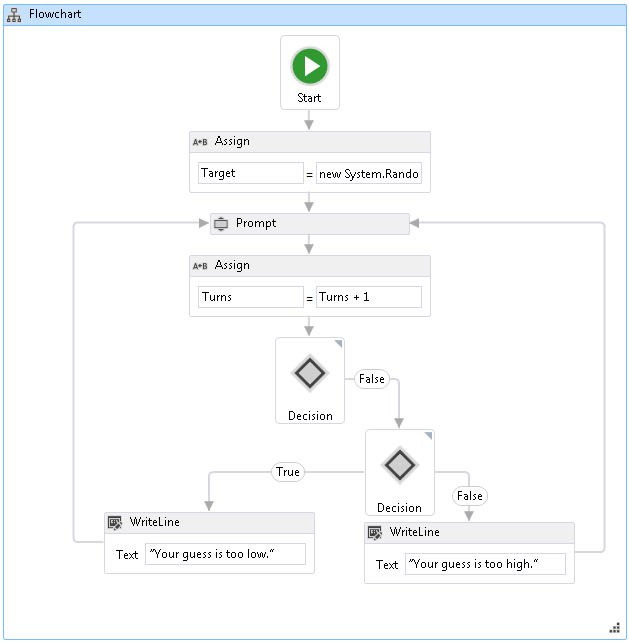

# <a name="how-to-create-a-flowchart-workflow"></a><span data-ttu-id="40ea3-102">HOW TO：建立流程圖工作流程</span><span class="sxs-lookup"><span data-stu-id="40ea3-102">How to: Create a Flowchart Workflow</span></span>
<span data-ttu-id="40ea3-103">工作流程可以從內建活動建構，也可以從自訂活動建構。</span><span class="sxs-lookup"><span data-stu-id="40ea3-103">Workflows can be constructed from built-in activities as well as from custom activities.</span></span> <span data-ttu-id="40ea3-104">本主題逐步說明建立使用這兩個內建的活動，例如工作流程<xref:System.Activities.Statements.Flowchart>活動，並從先前的自訂活動[How to： 建立活動](../../../docs/framework/windows-workflow-foundation/how-to-create-an-activity.md)主題。</span><span class="sxs-lookup"><span data-stu-id="40ea3-104">This topic steps through creating a workflow that uses both built-in activities such as the <xref:System.Activities.Statements.Flowchart> activity, and the custom activities from the previous [How to: Create an Activity](../../../docs/framework/windows-workflow-foundation/how-to-create-an-activity.md) topic.</span></span> <span data-ttu-id="40ea3-105">此工作流程會以數字猜測遊戲為模型。</span><span class="sxs-lookup"><span data-stu-id="40ea3-105">The workflow models a number guessing game.</span></span>  
  
> [!NOTE]
>  <span data-ttu-id="40ea3-106">「快速入門」教學課程中的每個主題都與之前的主題息息相關。</span><span class="sxs-lookup"><span data-stu-id="40ea3-106">Each topic in the Getting Started tutorial depends on the previous topics.</span></span> <span data-ttu-id="40ea3-107">若要完成本主題，您必須先完成[How to： 建立活動](../../../docs/framework/windows-workflow-foundation/how-to-create-an-activity.md)。</span><span class="sxs-lookup"><span data-stu-id="40ea3-107">To complete this topic, you must first complete [How to: Create an Activity](../../../docs/framework/windows-workflow-foundation/how-to-create-an-activity.md).</span></span>  
  
> [!NOTE]
>  <span data-ttu-id="40ea3-108">若要下載教學課程的完整版本，請參閱 [Windows Workflow Foundation (WF45) - 快速入門教學課程](http://go.microsoft.com/fwlink/?LinkID=248976)。</span><span class="sxs-lookup"><span data-stu-id="40ea3-108">To download a completed version of the tutorial, see [Windows Workflow Foundation (WF45) - Getting Started Tutorial](http://go.microsoft.com/fwlink/?LinkID=248976).</span></span>  
  
### <a name="to-create-the-workflow"></a><span data-ttu-id="40ea3-109">建立工作流程</span><span class="sxs-lookup"><span data-stu-id="40ea3-109">To create the workflow</span></span>  
  
1.  <span data-ttu-id="40ea3-110">以滑鼠右鍵按一下**NumberGuessWorkflowActivities**中**方案總管 中**選取**新增**，**新項目**。</span><span class="sxs-lookup"><span data-stu-id="40ea3-110">Right-click **NumberGuessWorkflowActivities** in **Solution Explorer** and select **Add**, **New Item**.</span></span>  
  
2.  <span data-ttu-id="40ea3-111">在**已安裝**，**一般項目**節點中，選取**工作流程**。</span><span class="sxs-lookup"><span data-stu-id="40ea3-111">In the **Installed**, **Common Items** node, select **Workflow**.</span></span> <span data-ttu-id="40ea3-112">選取**活動**從**工作流程**清單。</span><span class="sxs-lookup"><span data-stu-id="40ea3-112">Select **Activity** from the **Workflow** list.</span></span>  
  
3.  <span data-ttu-id="40ea3-113">型別`FlowchartNumberGuessWorkflow`到**名稱**方塊，然後按一下**新增**。</span><span class="sxs-lookup"><span data-stu-id="40ea3-113">Type `FlowchartNumberGuessWorkflow` into the **Name** box and click **Add**.</span></span>  
  
4.  <span data-ttu-id="40ea3-114">拖曳**流程圖**活動從**流程圖**區段**工具箱**並將其放置**在此置放活動**上加上標籤工作流程設計介面。</span><span class="sxs-lookup"><span data-stu-id="40ea3-114">Drag a **Flowchart** activity from the **Flowchart** section of the **Toolbox** and drop it onto the **Drop activity here** label on the workflow design surface.</span></span>  
  
### <a name="to-create-the-workflow-variables-and-arguments"></a><span data-ttu-id="40ea3-115">若要建立工作流程變數和引數</span><span class="sxs-lookup"><span data-stu-id="40ea3-115">To create the workflow variables and arguments</span></span>  
  
1.  <span data-ttu-id="40ea3-116">按兩下**FlowchartNumberGuessWorkflow.xaml**中**方案總管 中**來顯示工作流程設計工具中，如果未顯示。</span><span class="sxs-lookup"><span data-stu-id="40ea3-116">Double-click **FlowchartNumberGuessWorkflow.xaml** in **Solution Explorer** to display the workflow in the designer, if it is not already displayed.</span></span>  
  
2.  <span data-ttu-id="40ea3-117">按一下**引數**顯示工作流程設計工具的左下方**引數**窗格。</span><span class="sxs-lookup"><span data-stu-id="40ea3-117">Click **Arguments** in the lower-left side of the workflow designer to display the **Arguments** pane.</span></span>  
  
3.  <span data-ttu-id="40ea3-118">按一下**建立引數**。</span><span class="sxs-lookup"><span data-stu-id="40ea3-118">Click **Create Argument**.</span></span>  
  
4.  <span data-ttu-id="40ea3-119">型別`MaxNumber`到**名稱**方塊中，選取**中**從**方向**下拉式清單中，選取**Int32**從**引數型別**下拉式清單，然後按下 ENTER 儲存引數。</span><span class="sxs-lookup"><span data-stu-id="40ea3-119">Type `MaxNumber` into the **Name** box, select **In** from the **Direction** drop-down list, select **Int32** from the **Argument type** drop-down list, and then press ENTER to save the argument.</span></span>  
  
5.  <span data-ttu-id="40ea3-120">按一下**建立引數**。</span><span class="sxs-lookup"><span data-stu-id="40ea3-120">Click **Create Argument**.</span></span>  
  
6.  <span data-ttu-id="40ea3-121">型別`Turns`到**名稱**下方新增`MaxNumber`引數，選取**出**從**方向**下拉式清單中，選取**Int32**從**引數型別**下拉式清單，然後按下 ENTER。</span><span class="sxs-lookup"><span data-stu-id="40ea3-121">Type `Turns` into the **Name** box that is below the newly added `MaxNumber` argument, select **Out** from the **Direction** drop-down list, select **Int32** from the **Argument type** drop-down list, and then press ENTER.</span></span>  
  
7.  <span data-ttu-id="40ea3-122">按一下**引數**活動設計工具，以關閉的左下方**引數**窗格。</span><span class="sxs-lookup"><span data-stu-id="40ea3-122">Click **Arguments** in the lower-left side of the activity designer to close the **Arguments** pane.</span></span>  
  
8.  <span data-ttu-id="40ea3-123">按一下**變數**顯示工作流程設計工具的左下方**變數**窗格。</span><span class="sxs-lookup"><span data-stu-id="40ea3-123">Click **Variables** in the lower-left side of the workflow designer to display the **Variables** pane.</span></span>  
  
9. <span data-ttu-id="40ea3-124">按一下**建立變數**。</span><span class="sxs-lookup"><span data-stu-id="40ea3-124">Click **Create Variable**.</span></span>  
  
    > [!TIP]
    >  <span data-ttu-id="40ea3-125">如果沒有**建立變數**顯示方塊中，按一下<xref:System.Activities.Statements.Flowchart>活動在工作流程設計工具介面，即可選取它。</span><span class="sxs-lookup"><span data-stu-id="40ea3-125">If no **Create Variable** box is displayed, click the <xref:System.Activities.Statements.Flowchart> activity on the workflow designer surface to select it.</span></span>  
  
10. <span data-ttu-id="40ea3-126">型別`Guess`到**名稱**方塊中，選取**Int32**從**變數型別**下拉式清單，然後按下 ENTER 儲存變數。</span><span class="sxs-lookup"><span data-stu-id="40ea3-126">Type `Guess` into the **Name** box, select **Int32** from the **Variable type** drop-down list, and then press ENTER to save the variable.</span></span>  
  
11. <span data-ttu-id="40ea3-127">按一下**建立變數**。</span><span class="sxs-lookup"><span data-stu-id="40ea3-127">Click **Create Variable**.</span></span>  
  
12. <span data-ttu-id="40ea3-128">型別`Target`到**名稱**方塊中，選取**Int32**從**變數型別**下拉式清單，然後按下 ENTER 儲存變數。</span><span class="sxs-lookup"><span data-stu-id="40ea3-128">Type `Target` into the **Name** box, select **Int32** from the **Variable type** drop-down list, and then press ENTER to save the variable.</span></span>  
  
13. <span data-ttu-id="40ea3-129">按一下**變數**活動設計工具，以關閉的左下方**變數**窗格。</span><span class="sxs-lookup"><span data-stu-id="40ea3-129">Click **Variables** in the lower-left side of the activity designer to close the **Variables** pane.</span></span>  
  
### <a name="to-add-the-workflow-activities"></a><span data-ttu-id="40ea3-130">若要加入工作流程活動</span><span class="sxs-lookup"><span data-stu-id="40ea3-130">To add the workflow activities</span></span>  
  
1.  <span data-ttu-id="40ea3-131">拖曳**指派**活動從**基本型別**區段**工具箱**並將滑鼠停留在**啟動**節點，即在頂端流程圖。</span><span class="sxs-lookup"><span data-stu-id="40ea3-131">Drag an **Assign** activity from the **Primitives** section of the **Toolbox** and hover it over the **Start** node, which is at the top of the flowchart.</span></span> <span data-ttu-id="40ea3-132">當**指派**活動位於**啟動** 節點，周圍，就會出現三個三角形**啟動**節點。</span><span class="sxs-lookup"><span data-stu-id="40ea3-132">When the **Assign** activity is over the **Start** node, three triangles will appear around the **Start** node.</span></span> <span data-ttu-id="40ea3-133">卸除**指派**活動是正下方的三角形上**啟動**節點。</span><span class="sxs-lookup"><span data-stu-id="40ea3-133">Drop the **Assign** activity on the triangle that is directly below the **Start** node.</span></span> <span data-ttu-id="40ea3-134">這會連結兩個項目在一起，並指定**指派**當作流程圖中的第一個活動的活動。</span><span class="sxs-lookup"><span data-stu-id="40ea3-134">This will link the two items together and designates the **Assign** activity as the first activity in the flowchart.</span></span>  
  
    > [!NOTE]
    >  <span data-ttu-id="40ea3-135">您也可以手動連結活動與啟動節點，指定活動為工作流程中的啟動活動。</span><span class="sxs-lookup"><span data-stu-id="40ea3-135">Activities can also be indicated as the starting activity in the workflow by manually linking them activity to the start node.</span></span> <span data-ttu-id="40ea3-136">若要這樣做，請將滑鼠游標**啟動**節點中，按一下滑鼠位於上方時出現的矩形**啟動**節點，然後將拖曳連接線向所需的活動並放在其中一個出現的矩形。</span><span class="sxs-lookup"><span data-stu-id="40ea3-136">To do this, hover the mouse over the **Start** node, click one of the rectangles that appear when the mouse is over the **Start** node, and drag the connecting line down to the desired activity and drop it on one of the rectangles that appear.</span></span> <span data-ttu-id="40ea3-137">您也可以指定做為 it 上按一下滑鼠右鍵，然後選擇開始活動的活動和**設為開始節點**。</span><span class="sxs-lookup"><span data-stu-id="40ea3-137">You can also designate and activity as the starting activity by right-clicking the it and choosing **Set as Start Node**.</span></span>  
  
2.  <span data-ttu-id="40ea3-138">型別`Target`到**至** 方塊中，下列運算式**輸入 C# 運算式**或**輸入 VB 運算式**方塊。</span><span class="sxs-lookup"><span data-stu-id="40ea3-138">Type `Target` into the **To** box and the following expression into the **Enter a C# Expression** or **Enter a VB expression** box.</span></span>  
  
    ```vb  
    New System.Random().Next(1, MaxNumber + 1)  
    ```  
  
    ```csharp  
    new System.Random().Next(1, MaxNumber + 1)  
    ```  
  
    > [!TIP]
    >  <span data-ttu-id="40ea3-139">如果**工具箱**未顯示視窗中，選取**工具箱**從**檢視**功能表。</span><span class="sxs-lookup"><span data-stu-id="40ea3-139">If the **Toolbox** window is not displayed, select **Toolbox** from the **View** menu.</span></span>  
  
3.  <span data-ttu-id="40ea3-140">拖曳**提示**活動從**NumberGuessWorkflowActivities**區段**工具箱**，卸除下列**指派**活動從上一個逐步執行和連接**提示**活動**指派**活動。</span><span class="sxs-lookup"><span data-stu-id="40ea3-140">Drag a **Prompt** activity from the **NumberGuessWorkflowActivities** section of the **Toolbox**, drop it below the **Assign** activity from the previous step, and connect the **Prompt** activity to the **Assign** activity.</span></span> <span data-ttu-id="40ea3-141">有三種方式可連接這兩個活動。</span><span class="sxs-lookup"><span data-stu-id="40ea3-141">There are three ways to connect the two activities.</span></span> <span data-ttu-id="40ea3-142">第一種方式是將它們拖曳連接**提示**上工作流程的活動。</span><span class="sxs-lookup"><span data-stu-id="40ea3-142">The first way is to connect them as you drop the **Prompt** activity on the workflow.</span></span> <span data-ttu-id="40ea3-143">當您拖曳**提示**活動至工作流程，停留**指派**活動並放到時出現的四個三角形的其中一個**提示**活動是透過**指派**活動。</span><span class="sxs-lookup"><span data-stu-id="40ea3-143">As you are dragging the **Prompt** activity to the workflow, hover it over the **Assign** activity and drop it onto one of the four triangles that appear when the **Prompt** activity is over the **Assign** activity.</span></span> <span data-ttu-id="40ea3-144">第二種方式是將**提示**放置到所需的位置工作流程的活動。</span><span class="sxs-lookup"><span data-stu-id="40ea3-144">The second way is to drop the **Prompt** activity onto the workflow at the desired location.</span></span> <span data-ttu-id="40ea3-145">然後，將滑鼠游標**指派**活動並拖曳至出現的矩形**提示**活動。</span><span class="sxs-lookup"><span data-stu-id="40ea3-145">Then, hover the mouse over the **Assign** activity and drag one of the rectangles that appears down to the **Prompt** activity.</span></span> <span data-ttu-id="40ea3-146">拖曳滑鼠，讓連接線**指派**活動連接至其中的矩形**提示**活動，然後再放開滑鼠按鈕。</span><span class="sxs-lookup"><span data-stu-id="40ea3-146">Drag the mouse so that the connecting line from the **Assign** activity connects to one of the rectangles of the **Prompt** activity, and then release the mouse button.</span></span> <span data-ttu-id="40ea3-147">第三個方式是非常類似於第一個方式，不同處在於，而不是拖曳**提示**活動從**工具箱**，您將它從它的位置拖曳工作流程設計介面上，請停留**指派**活動，並放到三角形出現的其中一個。</span><span class="sxs-lookup"><span data-stu-id="40ea3-147">The third way is very similar to the first way, except that instead of dragging the **Prompt** activity from the **Toolbox**, you drag it from its location on the workflow design surface, hover it over the **Assign** activity, and drop it onto one of the triangles that appears.</span></span>  
  
4.  <span data-ttu-id="40ea3-148">在**屬性 視窗**如**提示**活動中，輸入`"EnterGuess"`（包含引號） 到**BookmarkName**屬性值方塊。</span><span class="sxs-lookup"><span data-stu-id="40ea3-148">In the **Properties Window** for the **Prompt** activity, type `"EnterGuess"` including the quotes into the **BookmarkName** property value box.</span></span> <span data-ttu-id="40ea3-149">型別`Guess`到**結果**屬性值方塊中，並輸入下列運算式**文字**屬性方塊中。</span><span class="sxs-lookup"><span data-stu-id="40ea3-149">Type `Guess` into the **Result** property value box, and type the following expression into the **Text** property box.</span></span>  
  
    ```vb  
    "Please enter a number between 1 and " & MaxNumber  
    ```  
  
    ```csharp  
    "Please enter a number between 1 and " + MaxNumber  
    ```  
  
    > [!TIP]
    >  <span data-ttu-id="40ea3-150">如果**屬性 視窗**顯示，請選取**屬性 視窗**從**檢視**功能表。</span><span class="sxs-lookup"><span data-stu-id="40ea3-150">If the **Properties Window** is not displayed, select **Properties Window** from the **View** menu.</span></span>  
  
5.  <span data-ttu-id="40ea3-151">拖曳**指派**活動從**基本型別**區段**工具箱**並將它使用其中一個方法在先前步驟中所述，使它低於連接**提示**活動。</span><span class="sxs-lookup"><span data-stu-id="40ea3-151">Drag an **Assign** activity from the **Primitives** section of the **Toolbox** and connect it using one of the methods described in the previous step so that it is below the **Prompt** activity.</span></span>  
  
6.  <span data-ttu-id="40ea3-152">型別`Turns`到**至**方塊和`Turns + 1`到**輸入 C# 運算式**或**輸入 VB 運算式**方塊。</span><span class="sxs-lookup"><span data-stu-id="40ea3-152">Type `Turns` into the **To** box and `Turns + 1` into the **Enter a C# expression**  or **Enter a VB expression** box.</span></span>  
  
7.  <span data-ttu-id="40ea3-153">拖曳**FlowDecision**從**流程圖**區段**工具箱**並將它連接下列**指派**活動。</span><span class="sxs-lookup"><span data-stu-id="40ea3-153">Drag a **FlowDecision** from the **Flowchart** section of the **Toolbox** and connect it below the **Assign** activity.</span></span> <span data-ttu-id="40ea3-154">在**屬性 視窗**，下列運算式輸入到**條件**屬性值方塊。</span><span class="sxs-lookup"><span data-stu-id="40ea3-154">In the **Properties Window**, type the following expression into the **Condition** property value box.</span></span>  
  
    ```vb  
    Guess = Target  
    ```  
  
    ```csharp  
    Guess == Target  
    ```  
  
8.  <span data-ttu-id="40ea3-155">拖曳其他**FlowDecision**活動從**工具箱**下方的第一個。</span><span class="sxs-lookup"><span data-stu-id="40ea3-155">Drag another **FlowDecision** activity from the **Toolbox** and drop it below the first one.</span></span> <span data-ttu-id="40ea3-156">從標示為矩形拖曳來連接兩個活動**False**在上方**FlowDecision**矩形頂端的第二個活動**FlowDecision**活動。</span><span class="sxs-lookup"><span data-stu-id="40ea3-156">Connect the two activities by dragging from the rectangle that is labeled **False** on the top **FlowDecision** activity to the rectangle at the top of the second **FlowDecision** activity.</span></span>  
  
    > [!TIP]
    >  <span data-ttu-id="40ea3-157">如果您沒有看到**True**和**False**標籤上**FlowDecision**，將滑鼠游標**FlowDecision**。</span><span class="sxs-lookup"><span data-stu-id="40ea3-157">If you do not see the **True** and **False** labels on the **FlowDecision**, hover the mouse over the **FlowDecision**.</span></span>  
  
9. <span data-ttu-id="40ea3-158">按一下第二個**FlowDecision**活動加以選取。</span><span class="sxs-lookup"><span data-stu-id="40ea3-158">Click the second **FlowDecision** activity to select it.</span></span> <span data-ttu-id="40ea3-159">在**屬性 視窗**，下列運算式輸入到**條件**屬性值方塊。</span><span class="sxs-lookup"><span data-stu-id="40ea3-159">In the **Properties Window**, type the following expression into the **Condition** property value box.</span></span>  
  
    ```
    Guess < Target  
    ```  
  
10. <span data-ttu-id="40ea3-160">拖放兩**WriteLine**活動從**基本型別**區段**工具箱**加以卸除，讓它們並排顯示兩個**FlowDecision**活動。</span><span class="sxs-lookup"><span data-stu-id="40ea3-160">Drag two **WriteLine** activities from the **Primitives** section of the **Toolbox** and drop them so that they are side by side below the two **FlowDecision** activities.</span></span> <span data-ttu-id="40ea3-161">連接**True**底端的動作**FlowDecision**至最左邊**WriteLine**活動，而**False**動作最右邊**WriteLine**活動。</span><span class="sxs-lookup"><span data-stu-id="40ea3-161">Connect the **True** action of the bottom **FlowDecision** activity to the leftmost **WriteLine** activity, and the **False** action to the rightmost **WriteLine** activity.</span></span>  
  
11. <span data-ttu-id="40ea3-162">按一下最左邊**WriteLine**活動加以選取，然後輸入下列運算式**文字**屬性值方塊中**屬性 視窗**。</span><span class="sxs-lookup"><span data-stu-id="40ea3-162">Click the leftmost **WriteLine** activity to select it, and type the following expression into the **Text** property value box in the **Properties Window**.</span></span>  
  
    ```
    "Your guess is too low."  
    ```  
  
12. <span data-ttu-id="40ea3-163">連接**WriteLine**左側**提示**其上方的活動。</span><span class="sxs-lookup"><span data-stu-id="40ea3-163">Connect the **WriteLine** to the left side of the **Prompt** activity that is above it.</span></span>  
  
13. <span data-ttu-id="40ea3-164">按一下最右邊**WriteLine**活動加以選取，然後輸入下列運算式**文字**屬性值方塊中**屬性 視窗**。</span><span class="sxs-lookup"><span data-stu-id="40ea3-164">Click the rightmost **WriteLine** activity to select it, and type the following expression into the **Text** property value box in the **Properties Window**.</span></span>  
  
    ```
    "Your guess is too high."  
    ```  
  
14. <span data-ttu-id="40ea3-165">連接**WriteLine**活動右邊的 list**提示**其上方的活動。</span><span class="sxs-lookup"><span data-stu-id="40ea3-165">Connect the **WriteLine** activity to the right side of the **Prompt** activity above it.</span></span>  
  
     <span data-ttu-id="40ea3-166">下列範例示範完成的工作流程。</span><span class="sxs-lookup"><span data-stu-id="40ea3-166">The following example illustrates the completed workflow.</span></span>  
  
     <span data-ttu-id="40ea3-167"></span><span class="sxs-lookup"><span data-stu-id="40ea3-167"></span></span>  
  
### <a name="to-build-the-workflow"></a><span data-ttu-id="40ea3-168">若要建置工作流程</span><span class="sxs-lookup"><span data-stu-id="40ea3-168">To build the workflow</span></span>  
  
1.  <span data-ttu-id="40ea3-169">按下 CTRL+SHIFT+B 以建置方案。</span><span class="sxs-lookup"><span data-stu-id="40ea3-169">Press CTRL+SHIFT+B to build the solution.</span></span>  
  
     <span data-ttu-id="40ea3-170">如需有關如何執行工作流程，指示，請參閱下一個主題中，[如何： 執行工作流程](../../../docs/framework/windows-workflow-foundation/how-to-run-a-workflow.md)。</span><span class="sxs-lookup"><span data-stu-id="40ea3-170">For instructions on how to run the workflow, please see the next topic, [How to: Run a Workflow](../../../docs/framework/windows-workflow-foundation/how-to-run-a-workflow.md).</span></span> <span data-ttu-id="40ea3-171">如果您已經完成[如何： 執行工作流程](../../../docs/framework/windows-workflow-foundation/how-to-run-a-workflow.md)步驟與工作流程的不同的樣式和想要執行此程式碼使用流程圖工作流程，此步驟中的，跳到[建置並執行應用程式](../../../docs/framework/windows-workflow-foundation/how-to-run-a-workflow.md#BKMK_ToRunTheApplication)區段[如何： 執行工作流程](../../../docs/framework/windows-workflow-foundation/how-to-run-a-workflow.md)。</span><span class="sxs-lookup"><span data-stu-id="40ea3-171">If you have already completed the [How to: Run a Workflow](../../../docs/framework/windows-workflow-foundation/how-to-run-a-workflow.md) step with a different style of workflow and wish to run it using the flowchart workflow from this step, skip ahead to the [To build and run the application](../../../docs/framework/windows-workflow-foundation/how-to-run-a-workflow.md#BKMK_ToRunTheApplication) section of [How to: Run a Workflow](../../../docs/framework/windows-workflow-foundation/how-to-run-a-workflow.md).</span></span>  
  
## <a name="see-also"></a><span data-ttu-id="40ea3-172">另請參閱</span><span class="sxs-lookup"><span data-stu-id="40ea3-172">See Also</span></span>  
 <xref:System.Activities.Statements.Flowchart>  
 <xref:System.Activities.Statements.FlowDecision>  
 [<span data-ttu-id="40ea3-173">Windows Workflow Foundation 程式設計</span><span class="sxs-lookup"><span data-stu-id="40ea3-173">Windows Workflow Foundation Programming</span></span>](../../../docs/framework/windows-workflow-foundation/programming.md)  
 [<span data-ttu-id="40ea3-174">設計工作流程</span><span class="sxs-lookup"><span data-stu-id="40ea3-174">Designing Workflows</span></span>](../../../docs/framework/windows-workflow-foundation/designing-workflows.md)  
 [<span data-ttu-id="40ea3-175">快速入門教學課程</span><span class="sxs-lookup"><span data-stu-id="40ea3-175">Getting Started Tutorial</span></span>](../../../docs/framework/windows-workflow-foundation/getting-started-tutorial.md)  
 [<span data-ttu-id="40ea3-176">如何：建立活動</span><span class="sxs-lookup"><span data-stu-id="40ea3-176">How to: Create an Activity</span></span>](../../../docs/framework/windows-workflow-foundation/how-to-create-an-activity.md)  
 [<span data-ttu-id="40ea3-177">如何：執行工作流程</span><span class="sxs-lookup"><span data-stu-id="40ea3-177">How to: Run a Workflow</span></span>](../../../docs/framework/windows-workflow-foundation/how-to-run-a-workflow.md)
