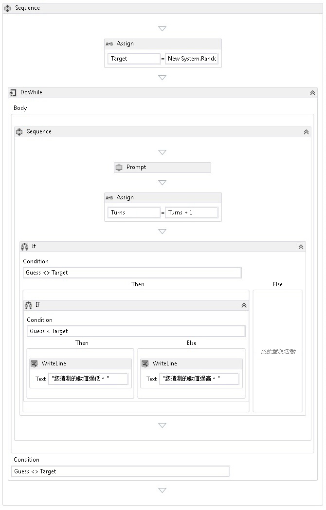

# <a name="how-to-create-a-sequential-workflow"></a>HOW TO：建立循序工作流程
工作流程可以從內建活動建構，也可以從自訂活動建構。 本主題逐步說明建立使用這兩個內建的活動，例如工作流程<xref:System.Activities.Statements.Sequence>活動，並從先前的自訂活動[How to： 建立活動](../../../docs/framework/windows-workflow-foundation/how-to-create-an-activity.md)主題。 此工作流程會以數字猜測遊戲為模型。  
  
> [!NOTE]
>  「快速入門」教學課程中的每個主題都與之前的主題息息相關。 若要完成本主題，您必須先完成[How to： 建立活動](../../../docs/framework/windows-workflow-foundation/how-to-create-an-activity.md)。  
  
> [!NOTE]
>  若要下載教學課程的完整版本，請參閱 [Windows Workflow Foundation (WF45) - 快速入門教學課程](http://go.microsoft.com/fwlink/?LinkID=248976)。  
  
### <a name="to-create-the-workflow"></a>建立工作流程  
  
1.  以滑鼠右鍵按一下**NumberGuessWorkflowActivities**中**方案總管 中**選取**新增**，**新項目**。  
  
2.  在**已安裝**，**一般項目**節點中，選取**工作流程**。 選取**活動**從**工作流程**清單。  
  
3.  型別`SequentialNumberGuessWorkflow`到**名稱**方塊，然後按一下**新增**。  
  
4.  拖曳**順序**活動從**控制流程**區段**工具箱**並將其放置**在此置放活動**上加上標籤工作流程設計介面。  
  
### <a name="to-create-the-workflow-variables-and-arguments"></a>若要建立工作流程變數和引數  
  
1.  按兩下**SequentialNumberGuessWorkflow.xaml**中**方案總管 中**來顯示工作流程設計工具中，如果未顯示。  
  
2.  按一下**引數**顯示工作流程設計工具的左下方**引數**窗格。  
  
3.  按一下**建立引數**。  
  
4.  型別`MaxNumber`到**名稱**方塊中，選取**中**從**方向**下拉式清單中，選取**Int32**從**引數型別**下拉式清單，然後按下 ENTER 儲存引數。  
  
5.  按一下**建立引數**。  
  
6.  型別`Turns`到**名稱**下方新增`MaxNumber`引數，選取**出**從**方向**下拉式清單中，選取**Int32**從**引數型別**下拉式清單，然後按下 ENTER。  
  
7.  按一下**引數**活動設計工具，以關閉的左下方**引數**窗格。  
  
8.  按一下**變數**顯示工作流程設計工具的左下方**變數**窗格。  
  
9. 按一下**建立變數**。  
  
    > [!TIP]
    >  如果沒有**建立變數**顯示方塊中，按一下**順序**活動在工作流程設計工具介面，即可選取它。  
  
10. 型別`Guess`到**名稱**方塊中，選取**Int32**從**變數型別**下拉式清單，然後按下 ENTER 儲存變數。  
  
11. 按一下**建立變數**。  
  
12. 型別`Target`到**名稱**方塊中，選取**Int32**從**變數型別**下拉式清單，然後按下 ENTER 儲存變數。  
  
13. 按一下**變數**活動設計工具，以關閉的左下方**變數**窗格。  
  
### <a name="to-add-the-workflow-activities"></a>若要加入工作流程活動  
  
1.  拖曳**指派**活動從**基本型別**區段**工具箱**並將其放置**順序**活動。 型別`Target`到**至** 方塊中，下列運算式**輸入 C# 運算式**或**輸入 VB 運算式**方塊。  
  
    ```vb  
    New System.Random().Next(1, MaxNumber + 1)  
    ```  
  
    ```csharp  
    new System.Random().Next(1, MaxNumber + 1)  
    ```  
  
    > [!TIP]
    >  如果**工具箱**未顯示視窗中，選取**工具箱**從**檢視**功能表。  
  
2.  拖曳**DoWhile**活動從**控制流程**區段**工具箱**並將它放在工作流程，使它低於**指派**活動。  
  
3.  將下列運算式輸入到**DoWhile**活動的**條件**屬性值方塊。  
  
    ```vb  
    Guess <> Target  
    ```  
  
    ```csharp  
    Guess != Target  
    ```  
  
     <xref:System.Activities.Statements.DoWhile> 活動會執行其子活動，然後評估其 <xref:System.Activities.Statements.DoWhile.Condition%2A>。 如果 <xref:System.Activities.Statements.DoWhile.Condition%2A> 判斷值為 `True`，則會再次執行 <xref:System.Activities.Statements.DoWhile> 中的活動。 此範例中會評估使用者的猜測，而 <xref:System.Activities.Statements.DoWhile> 會繼續，直到猜測正確為止。  
  
4.  拖曳**提示**活動從**NumberGuessWorkflowActivities**區段**工具箱**並將它放**DoWhile**活動從上一個步驟。  
  
5.  在**屬性 視窗**，型別`"EnterGuess"`（包含引號） 到**BookmarkName**屬性值方塊**提示**活動。 型別`Guess`到**結果**屬性值方塊中，並輸入下列運算式**文字**屬性方塊中。  
  
    ```vb  
    "Please enter a number between 1 and " & MaxNumber  
    ```  
  
    ```csharp  
    "Please enter a number between 1 and " + MaxNumber  
    ```  
  
    > [!TIP]
    >  如果**屬性 視窗**顯示，請選取**屬性 視窗**從**檢視**功能表。  
  
6.  拖曳**指派**活動從**基本型別**區段**工具箱**並將它放**DoWhile**活動，接**提示**活動。  
  
    > [!NOTE]
    >  當您卸除**指派**活動，請注意工作流程設計工具自動加入**順序**活動，以同時包含**提示**活動和新加入**指派**活動。  
  
7.  型別`Turns`到**至**方塊和`Turns + 1`到**輸入 C# 運算式**或**輸入 VB 運算式**方塊。  
  
8.  拖曳**如果**活動從**控制流程**區段**工具箱**並將它放**順序**活動，接新加入的**指派**活動。  
  
9. 將下列運算式輸入到**如果**活動的**條件**屬性值方塊。  
  
    ```vb  
    Guess <> Target  
    ```  
  
    ```csharp  
    Guess != Target  
    ```  
  
10. 拖曳其他**如果**活動從**控制流程**區段**工具箱**並將它放**然後**> 一節的第一個**如果**活動。  
  
11. 下列運算式輸入至新加入**如果**活動的**條件**屬性值方塊。  
  
    ```
    Guess < Target  
    ```  
  
12. 拖放兩**WriteLine**活動從**基本型別**區段**工具箱**，讓其中一項是置於**然後**區段新加入**如果**活動和一個處於**Else** > 一節。  
  
13. 按一下**WriteLine**中的活動**然後**區段來選取它，然後輸入下列運算式**文字**屬性值方塊。  
  
    ```vb  
    "Your guess is too low."  
    ```  
  
14. 按一下**WriteLine**中的活動**Else**區段來選取它，然後輸入下列運算式**文字**屬性值方塊。  
  
    ```vb  
    "Your guess is too high."  
    ```  
  
     下列範例示範完成的工作流程。  
  
       
  
### <a name="to-build-the-workflow"></a>若要建置工作流程  
  
1.  按下 CTRL+SHIFT+B 以建置方案。  
  
     如需有關如何執行工作流程，指示，請參閱下一個主題中，[如何： 執行工作流程](../../../docs/framework/windows-workflow-foundation/how-to-run-a-workflow.md)。 如果您已經完成[如何： 執行工作流程](../../../docs/framework/windows-workflow-foundation/how-to-run-a-workflow.md)步驟與工作流程的不同的樣式和想要使用此步驟中的循序工作流程執行該，跳到[建置並執行應用程式](../../../docs/framework/windows-workflow-foundation/how-to-run-a-workflow.md#BKMK_ToRunTheApplication)區段[如何： 執行工作流程](../../../docs/framework/windows-workflow-foundation/how-to-run-a-workflow.md)。  
  
## <a name="see-also"></a>另請參閱  
 <xref:System.Activities.Statements.Flowchart>  
 <xref:System.Activities.Statements.FlowDecision>  
 [Windows Workflow Foundation 程式設計](../../../docs/framework/windows-workflow-foundation/programming.md)  
 [設計工作流程](../../../docs/framework/windows-workflow-foundation/designing-workflows.md)  
 [快速入門教學課程](../../../docs/framework/windows-workflow-foundation/getting-started-tutorial.md)  
 [如何：建立活動](../../../docs/framework/windows-workflow-foundation/how-to-create-an-activity.md)  
 [如何：執行工作流程](../../../docs/framework/windows-workflow-foundation/how-to-run-a-workflow.md)
